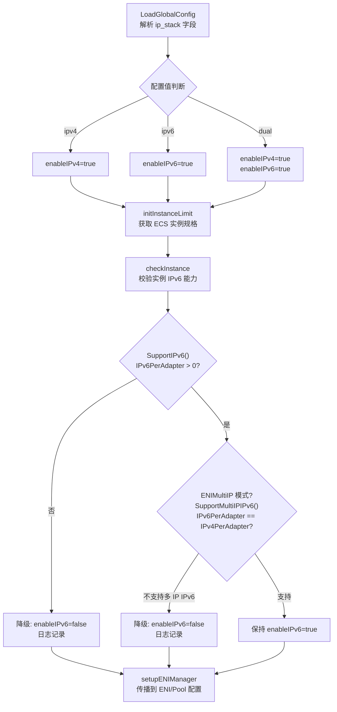
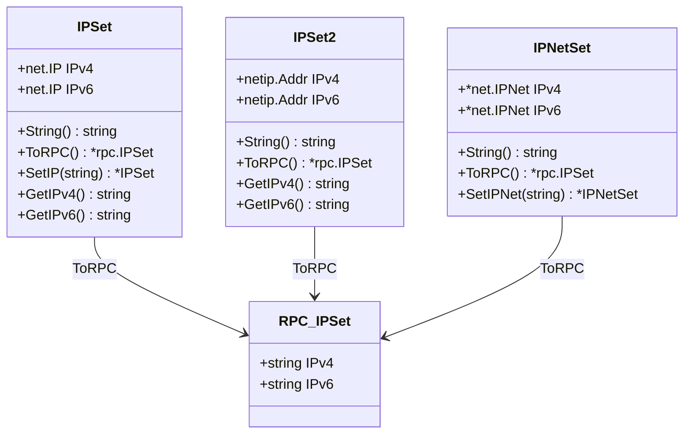

Terway 支持三种 IP 协议栈模式——**IPv4 单栈**（默认）、**IPv6 单栈**和**IPv4/IPv6 双栈**——通过统一的 `ip_stack` 配置项驱动从控制平面到数据平面的全链路协议栈协商。本文从配置入口出发，逐步追踪协议栈声明在 Daemon 启动、ENI 资源管理、IP 分配策略及数据路径配置中的传播与约束机制。

## 协议栈配置模型与入口

`ip_stack` 字段是整个双栈能力的总开关，定义于 Terway Daemon 的全局配置结构体中，支持三种合法取值 `ipv4`、`ipv6`、`dual`，默认为 `ipv4`。该字段通过 ConfigMap `eni-config` 中的 `eni_conf` 段注入，Helm Chart 将其映射为 `terway.ipStack` 值。

| 配置路径 | 字段名 | 合法取值 | 默认值 | 验证规则 |
|---------|--------|---------|-------|---------|
| ConfigMap `eni_conf` | `ip_stack` | `ipv4`, `ipv6`, `dual` | `ipv4` | `validate:"oneof=ipv4 ipv6 dual"` |
| Helm `values.yaml` | `terway.ipStack` | `ipv4`, `ipv6`, `dual` | `ipv4` | Chart 模板直接透传 |

配置加载时，`Config.Populate()` 方法在字段为空时设置默认值 `ipv4`，而 `Config.Validate()` 仅允许 `""`、`"ipv4"` 和 `"dual"` 通过验证（注意：Validate 方法当前未包含 `"ipv6"`，但 Populate 和 `GetIPStack()` 均正确处理了该值）。`Config.GetIPStack()` 方法是协议栈布尔化的核心入口，将字符串解析为 `(enableIPv4, enableIPv6)` 二元组：

Sources: [config.go](types/daemon/config.go#L58-L167), [values.yaml](charts/terway/values.yaml#L26-L27), [configmap.yaml](charts/terway/templates/terwayd/configmap.yaml#L20)

## Daemon 启动链中的协议栈协商

Daemon 启动通过 `NetworkServiceBuilder` 的链式调用完成协议栈的初始化与降级。整个流程遵循"配置声明 → 实例能力校验 → 运行时生效"的三阶段模式。



**第一阶段：全局配置加载**（`LoadGlobalConfig`）从 ConfigMap 解析 `ip_stack` 并设置 `networkService.enableIPv4` / `enableIPv6` 字段。

**第二阶段：实例能力校验**（`checkInstance`）是关键的降级决策点。该函数通过 `client.Limits` 结构体查询 ECS 实例规格的 IPv6 能力。`Limits` 包含 `IPv6PerAdapter` 字段，由阿里云 `DescribeInstanceTypes` API 返回的 `EniIpv6AddressQuantity` 填充。两个核心判定方法：`SupportIPv6()` 检查 `IPv6PerAdapter > 0`；`SupportMultiIPIPv6()` 检查 `IPv6PerAdapter == IPv4PerAdapter`——后者确保 ENI 多 IP 模式下 IPv6 地址数量与 IPv4 对等，否则双栈中的 IPv6 将被静默降级。

**第三阶段：配置传播**（`setupENIManager`）将最终的布尔值写入 `ENIConfig` 和 `PoolConfig` 的 `EnableIPv4` / `EnableIPv6` 字段，并传递给 ENI Factory 和 Local ENI Manager。

Sources: [builder.go](daemon/builder.go#L83-L112), [daemon.go](daemon/daemon.go#L828-L868), [limit.go](pkg/aliyun/client/limit.go#L59-L65)

## 类型系统中的双协议栈抽象

Terway 在类型层面通过三个核心结构体实现对双协议栈的统一抽象，贯穿 RPC 通信、资源配置和数据路径配置的完整链路。

**`IPSet`**（`net.IP` 实现）和 **`IPSet2`**（`net/netip.Addr` 实现）是双栈 IP 的容器类型，分别包含 `IPv4` 和 `IPv6` 两个字段。`IPSet` 用于 Daemon 内部的资源配置（如 ENI 的 `PrimaryIP`、`GatewayIP`），而 `IPSet2` 用于 CRD 控制器路径中更高效的 `netip` 地址处理。`IPNetSet` 则封装双栈子网信息。三者的共同特征是：字段值可为 `nil`（表示该协议栈未启用），通过 `GetIPv4()` / `GetIPv6()` 方法安全访问。



**RPC 协议层**的 `IPSet`（protobuf 定义）是跨进程通信的标准格式，所有 `IPSet`/`IPSet2`/`IPNetSet` 都可通过 `ToRPC()` 方法序列化为 RPC 消息。`AllocIPReply` 中通过 `bool IPv4` 和 `bool IPv6` 两个布尔值告知 CNI Binary 当前 Pod 获得了哪些协议栈的 IP。

Sources: [types.go](types/types.go#L48-L197), [rpc.proto](rpc/rpc.proto#L16-L20), [types.go](types/daemon/types.go#L35-L72)

## ENI 资源管理中的 IPv6 地址分配

### Factory 层：阿里云 OpenAPI 集成

`Aliyun` Factory 封装了 IPv6 地址的全生命周期管理，依赖阿里云 ECS API 的 `AssignIpv6Addresses` 和 `UnassignIpv6Addresses` 接口。

| 操作 | 方法 | 对应 ECS API | 参数 |
|------|------|-------------|------|
| 创建 ENI 时分配 IPv6 | `CreateNetworkInterface` | `CreateNetworkInterface` | `IPv6Count` 字段 |
| 追加分配 IPv6 | `AssignNIPv6` | `AssignIpv6Addresses` | `eniID`, `count` |
| 释放 IPv6 | `UnAssignNIPv6` | `UnassignIpv6Addresses` | `eniID`, `[]netip.Addr` |

创建 ENI 时，`CreateNetworkInterface` 的入参 `ipv6` 表示请求的 IPv6 地址数量。在 Trunk ENI 初始化中，当 `poolConfig.EnableIPv6` 为 `true` 时，`v6 = 1` 被传入创建请求。分配后，Factory 通过 ECS 元数据服务（Metadata Service）校验 IPv6 地址就绪：调用 `metadata.GetIPv6ByMac(mac)` 轮询直到地址出现在实例元数据中，随后获取 IPv6 网关（`GetENIV6GatewayAddr`）和 vSwitch IPv6 CIDR（`GetVSwitchIPv6CIDR`）。

Sources: [aliyun.go](pkg/factory/aliyun/aliyun.go#L78-L280), [ecs.go](pkg/aliyun/client/ecs.go#L27-L28)

### ENI Metadata 层：双栈信息采集

`ENIMetadata` 结构体持有 `ipv4`/`ipv6` 布尔开关，在 `GetENIByMac` 中根据 `e.ipv6` 决定是否采集 IPv6 网关和子网信息。当 IPv6 未启用时，`ENI.VSwitchCIDR.IPv6` 和 `ENI.GatewayIP.IPv6` 将保持 `nil`。

Sources: [eni.go](pkg/aliyun/eni/eni.go#L22-L93)

### Local ENI Manager：双栈 IP 池管理

`Local` ENI 管理器维护独立的 IPv4 和 IPv6 IP 池（`ipv4 Set` 和 `ipv6 Set`），根据 `enableIPv4`/`enableIPv6` 决定池化策略。在分配流程中：

**双栈模式**下（`enableIPv4 && enableIPv6`），系统在同一个 ENI 上原子性地分配一对 IPv4+IPv6 地址——先尝试获取可用的 IPv4 缓存 IP，再在**同一个 ENI** 上分配 IPv6。若 IPv6 分配失败，已获取的 IPv4 会被回滚。这保证了双栈 Pod 的 IPv4 和 IPv6 地址始终来自同一张网卡。

**单栈模式**下，仅在对应协议的 IP 池中分配。池化水位控制对两个协议栈独立运作——IPv4 和 IPv6 各自维护 `allocatingV4`/`allocatingV6` 请求队列和独立的 `rateLimitv4`/`rateLimitv6` 限速器。

Sources: [local.go](pkg/eni/local.go#L134-L177), [local.go](pkg/eni/local.go#L376-L488), [local_delegate.go](pkg/eni/local_delegate.go#L186-L253)

## 数据路径中的 IPv6 配置实现

所有数据路径驱动（PolicyRoute、IPVlan、ExclusiveENI、VLAN）均通过条件分支 `if cfg.ContainerIPNet.IPv6 != nil` 独立处理 IPv6 配置，确保在单栈 IPv4 场景下零开销。

### 链路地址与路由常量

数据路径使用固定的链路本地地址作为 Veth pair 两端的中间网关：

| 协议栈 | 链路地址 | 子网掩码 | 默认路由 |
|-------|---------|---------|---------|
| IPv4 | `169.254.1.1` | `/32` | `0.0.0.0/0` |
| IPv6 | `fe80::1` | `/128` | `::/0` |

Sources: [consts_linux.go](plugin/datapath/consts_linux.go#L17-L29)

### PolicyRoute 数据路径

PolicyRoute（Veth + 策略路由）模式对 IPv6 的处理分为容器侧和主机侧两个维度：

**容器侧**（`generateContCfgForPolicy`）：当 `cfg.ContainerIPNet.IPv6 != nil` 时，配置 IPv6 默认路由（网关为 `fe80::1`）、到链路地址 `fe80::1/128` 的邻居表项，并通过 `GenerateIPv6Sysctl` 设置 sysctl 参数：`disable_ipv6=0`（lo/all/default/接口）、`accept_ra=0`（禁用路由广告）、`forwarding=1`（启用转发）。

**主机侧**（`GenerateHostPeerCfgForPolicy`）：为 Host Veth 配置到容器 IPv6 地址的链路路由、策略路由规则（优先级 512：目标地址匹配 → 主表；优先级 2048：源地址匹配 → ENI 路由表），以及接口级别的 `disable_ipv6=0` + `forwarding=1` sysctl。

**ENI 侧**（`GenerateENICfgForPolicy`）：在 ENI 接口上配置到 IPv6 网关的 `/128` 主机路由和默认路由（`::/0`），同时设置 sysctl 启用 IPv6 转发。

Sources: [policy_router_linux.go](plugin/datapath/policy_router_linux.go#L93-L303)

### IPVlan 数据路径

IPVlan 模式的 IPv6 配置与 PolicyRoute 类似，但在容器内直接使用 ENI 的网关 IP（而非链路本地地址）作为默认路由网关。关键差异点：

- **容器侧**配置 IPv6 地址时，若 `StripVlan` 为 true 则使用最大掩码长度，否则使用 vSwitch CIDR 掩码
- **主机侧从接口**（`ipvl_X`）配置 IPv6 地址时带 `IFA_F_NODAD` 标志（跳过重复地址检测），并添加到容器 IPv6 的链路路由
- **init 命名空间**的 teardown 阶段会分别清理 IPv4 和 IPv6 的路由条目

Sources: [ipvlan_linux.go](plugin/datapath/ipvlan_linux.go#L42-L251), [ipvlan_linux.go](plugin/datapath/ipvlan_linux.go#L535-L570)

### ExclusiveENI 数据路径

独占 ENI 模式将物理网卡直接移入 Pod 网络命名空间。IPv6 配置包括到网关的 `/128` 链路路由、默认路由（`::/0`）以及完整的 sysctl 配置。此模式下 IPv6 地址直接配置在 ENI 上（而非 Veth 接口），无链路本地中间地址。

Sources: [exclusive_eni_linux.go](plugin/datapath/exclusive_eni_linux.go#L87-L128)

### 主机命名空间配置

`EnsureHostNsConfig` 函数在 CNI ADD 流程中被调用，为所有网络接口设置全局 sysctl 参数。对于 IPv6，它确保 `disable_ipv6=0` 和 `forwarding=1` 应用于系统中所有接口（包括 `default`、`all` 和每个具体接口）。`GetHostIP` 函数通过 `ResolveBindAddress` 探测节点 IP——分别用 `127.0.0.1` 和 `::1` 作为探测目标来获取节点的 IPv4 和 IPv6 地址。

Sources: [utils_linux.go](plugin/driver/utils/utils_linux.go#L32-L44), [utils_linux.go](plugin/driver/utils/utils_linux.go#L290-L343), [utils_linux.go](plugin/driver/utils/utils_linux.go#L369-L409)

## CNI 请求处理中的双栈结果构建

CNI Binary（`cmdAdd`）在收到 `AllocIPReply` 后，通过 `allocResult.IPv4` 和 `allocResult.IPv6` 布尔值确定生效的协议栈，然后构建 CNI Result。对于每个有效的协议栈，`current.IPConfig` 包含完整的地址和网关信息。双栈 Pod 将在结果中包含两个 `IPConfig` 条目。

Sources: [cni.go](plugin/terway/cni.go#L104-L126), [cni_linux.go](plugin/terway/cni_linux.go#L161-L177)

## 配置实践与 RAM 权限要求

启用双栈的完整配置示例：

```yaml
# Helm values.yaml
terway:
  ipStack: dual        # 启用 IPv4/IPv6 双栈
  # ...
```

对应的 ConfigMap 生成结果：

```json
{
  "ip_stack": "dual",
  "max_pool_size": 5,
  "min_pool_size": 0,
  "vswitch_selection_policy": "ordered"
}
```

**RAM 权限要求**：Terway 使用的 RAM 角色必须包含 IPv6 地址操作权限：

```json
{
  "Version": "1",
  "Statement": [{
    "Action": [
      "ecs:AssignIpv6Addresses",
      "ecs:UnassignIpv6Addresses"
    ],
    "Resource": ["*"],
    "Effect": "Allow"
  }]
}
```

**前置条件检查清单**：

| 检查项 | 条件 | 失败降级行为 |
|-------|------|------------|
| VPC 已开启 IPv6 | VPC 具有 IPv6 CIDR | ENI 创建失败 |
| vSwitch 已开启 IPv6 | vSwitch 具有 IPv6 CIDR | ENI 创建失败 |
| 实例规格支持 IPv6 | `IPv6PerAdapter > 0` | `enableIPv6` 降级为 `false`，仅 IPv4 |
| 实例支持多 IP IPv6 | `IPv6PerAdapter == IPv4PerAdapter` | 双栈模式下 IPv6 降级为 `false` |
| 安全组放行 IPv6 | 安全组包含 IPv6 规则 | 网络不通（非 Terway 层面） |
| 节点有 IPv6 默认路由 | 节点网络命名空间有 `::/0` 路由 | `GetHostIP` 报错 |

Sources: [ipv6.md](docs/ipv6.md#L1-L45)

## IPv6 Prefix 模式

与 IPv4 Prefix 模式类似，IPv6 也支持基于前缀的地址分配。`Config` 中的 `IPv6PrefixCount` 字段控制 IPv6 前缀分配数量。**在双栈模式下此字段被忽略**，因为双栈时每个 ENI 自动获取一个 IPv6 前缀（`IPv6PrefixCount` 仅在 IPv6 单栈模式下生效，有效值为 0 或 1）。IPv4 前缀数量则由 `IPv4PrefixCount` 在 IPv4 单栈和双栈模式下统一控制。

Sources: [config.go](types/daemon/config.go#L74-L81)

## 实例能力判定矩阵

不同 ECS 实例规格的 IPv6 支持能力决定了最终生效的协议栈。以下矩阵总结了 `checkInstance` 函数的判定逻辑：

| `ip_stack` 配置 | 实例 `IPv6PerAdapter` | `IPv6PerAdapter` == `IPv4PerAdapter` | 最终结果 |
|-----------------|----------------------|--------------------------------------|---------|
| `ipv4` | 任意 | 任意 | IPv4 only |
| `ipv4` | 任意 | 任意 | IPv4 only |
| `ipv6` | `> 0` | 任意 | IPv6 only |
| `ipv6` | `0` | 任意 | 降级为无 IP |
| `dual` | `> 0` | `true` | Dual-stack |
| `dual` | `> 0` | `false`（ENIMultiIP） | 降级为 IPv4 only |
| `dual` | `0` | 任意 | 降级为 IPv4 only |

Sources: [daemon.go](daemon/daemon.go#L828-L868), [builder_test.go](daemon/builder_test.go#L941-L1075)

## 延伸阅读

- [整体架构设计：Daemon、CNI Binary 与控制平面的协作机制](4-zheng-ti-jia-gou-she-ji-daemon-cni-binary-yu-kong-zhi-ping-mian-de-xie-zuo-ji-zhi) — 了解 Daemon 与 CNI Binary 的整体协作架构
- [网络模式全解析：VPC、ENI、ENI 多 IP 与 Trunk 模式](6-wang-luo-mo-shi-quan-jie-xi-vpc-eni-eni-duo-ip-yu-trunk-mo-shi) — 各网络模式与 IPv6 的兼容性
- [数据路径驱动层：Veth、IPVlan、VLAN、NIC 与 VF 驱动实现](7-shu-ju-lu-jing-qu-dong-ceng-veth-ipvlan-vlan-nic-yu-vf-qu-dong-shi-xian) — 深入理解各数据路径的 IPv6 配置细节
- [ENI 资源管理器：IP 池化、水位控制与资源回收机制](9-eni-zi-yuan-guan-li-qi-ip-chi-hua-shui-wei-kong-zhi-yu-zi-yuan-hui-shou-ji-zhi) — 双栈 IP 池的完整管理策略
- [IP Prefix 模式：基于子网前缀的大规模 IP 分配策略](11-ip-prefix-mo-shi-ji-yu-zi-wang-qian-zhui-de-da-gui-mo-ip-fen-pei-ce-lue) — IPv6 Prefix 分配的详细机制
- [gRPC 通信协议：Daemon 与 CNI Binary 的接口定义](5-grpc-tong-xin-xie-yi-daemon-yu-cni-binary-de-jie-kou-ding-yi) — RPC 层的双栈协议定义