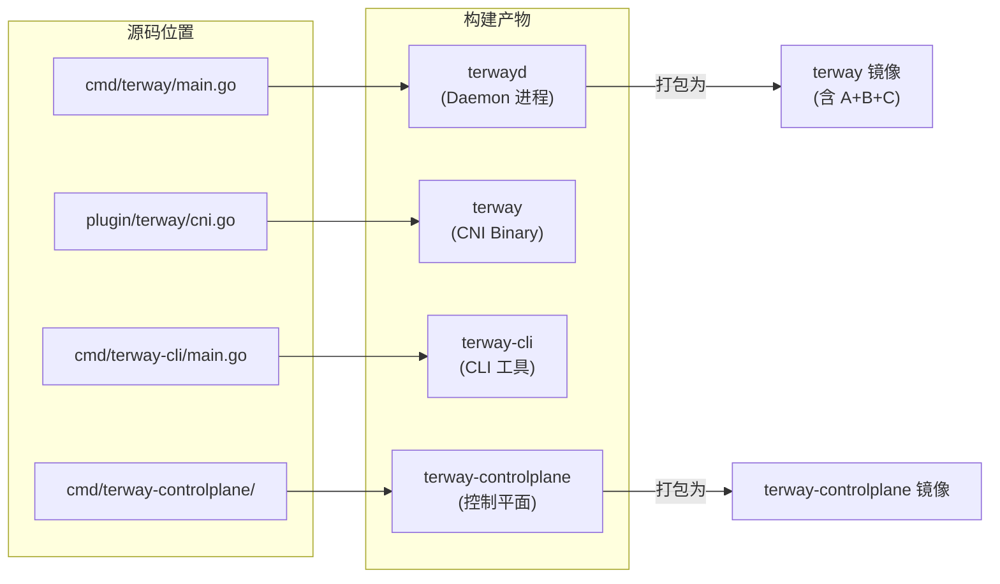
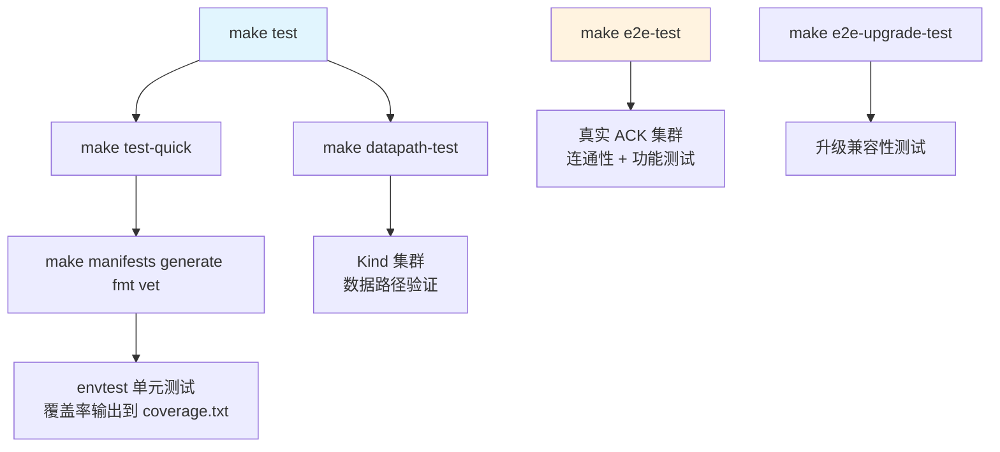
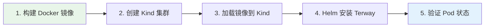

本文面向初次接触 Terway 项目的开发者，提供从环境准备到构建、测试、本地运行的完整操作路径。阅读完成后，你将掌握 Terway 的**三大构建产物**（terwayd、terway CNI 插件、terway-controlplane）的编译方法，理解**三级测试体系**（单元测试 / 数据路径测试 / E2E 测试）的运行机制，并能够使用 **Kind + Helm** 在本地拉起一个完整的 Terway 集群实例。

Sources: [Makefile](Makefile#L1-L186), [go.mod](go.mod#L1-L4)

## 环境准备

Terway 是一个纯 Go 项目，但构建过程中涉及 Docker 多阶段镜像打包与网络策略组件（Cilium、Calico Felix）的编译，因此需要提前安装以下工具链：

| 工具 | 最低版本要求 | 用途 | 安装方式 |
|------|------------|------|---------|
| **Go** | 1.24.0+（见 `go.mod`） | 编译所有 Go 二进制 | [golang.org/dl](https://golang.org/dl/) |
| **Docker** | 支持 BuildKit | 多阶段镜像构建、Kind 集群 | [docker.com](https://www.docker.com/) |
| **Docker Buildx** | 最新稳定版 | 多平台交叉构建（amd64/arm64） | Docker Desktop 内置 |
| **protoc** | 3.x+ | gRPC protobuf 代码生成 | `go generate ./rpc/...` |
| **Make** | GNU Make 4.x+ | 驱动所有构建与测试目标 | 系统包管理器 |
| **Git** | 2.x+ | 版本信息注入构建产物 | 系统包管理器 |
| **Helm 3** | 最新稳定版 | 部署 Terway 到 Kind 集群 | `curl https://raw.githubusercontent.com/helm/helm/main/scripts/get-helm-3 \| bash` |

克隆仓库后，进入项目根目录即可开始：

```bash
git clone https://github.com/AliyunContainerService/terway.git
cd terway
```

Sources: [go.mod](go.mod#L1-L4), [tests/kind/run.sh](tests/kind/run.sh#L1-L17)

## 项目结构概览

理解 Terway 的构建产物，首先需要认识源码的组织方式。下图展示了与构建直接相关的核心目录及其角色：

```
terway/
├── cmd/
│   ├── terway/                    # 🔵 节点 Daemon 入口（terwayd）
│   ├── terway-cli/                # 🟢 CLI 诊断工具（terway-cli）
│   └── terway-controlplane/       # 🟠 控制平面入口
├── plugin/
│   └── terway/                    # 🔵 CNI Binary（terway）
├── daemon/                        # Daemon 核心逻辑
├── pkg/                           # 公共库（aliyun、controller、eni…）
├── rpc/                           # gRPC protobuf 定义
├── policy/                        # Cilium/Felix 补丁
├── deploy/images/                 # Dockerfile 集合
│   ├── terway/Dockerfile          # Daemon + CNI + CLI 三合一镜像
│   ├── terway-controlplane/       # 控制平面镜像
│   └── policy/Dockerfile          # 策略组件镜像
├── charts/terway/                 # Helm Chart
├── tests/kind/                    # Kind 本地测试环境
├── Makefile                       # 统一构建入口
└── .golangci.yml                  # Lint 配置
```

Terway 构建产生**三个核心二进制文件**，它们的关系如下：



值得注意的是，`terwayd`、`terway`（CNI Binary）和 `terway-cli` 三个二进制被打包进同一个 Docker 镜像（`deploy/images/terway/Dockerfile`），而 `terway-controlplane` 独立成另一个镜像。

Sources: [deploy/images/terway/Dockerfile](deploy/images/terway/Dockerfile#L22-L51), [deploy/images/terway-controlplane/Dockerfile](deploy/images/terway-controlplane/Dockerfile#L1-L33)

## 构建

### 依赖工具自动下载

Terway 的 Makefile 内置了工具链管理机制。以下工具在首次执行对应 target 时会自动下载到项目根目录的 `bin/` 目录下，无需手动安装：

| 工具 | 版本 | 用途 |
|------|------|------|
| `controller-gen` | v0.17.2 | 生成 CRD、DeepCopy、Webhook 配置 |
| `setup-envtest` | release-0.20 | 下载 envtest 所需的 kubebuilder 二进制 |
| `golangci-lint` | v2.7.2 | Go 静态分析 |

工具以 `<name>-<version>-<os>-<arch>` 格式存放在 `bin/` 目录中，避免版本冲突。

Sources: [Makefile](Makefile#L132-L185)

### 一键构建（推荐）

执行以下命令完成完整的构建流程——包括代码生成、格式化、静态检查和所有 Docker 镜像构建：

```bash
make build
```

该命令等价于依次执行：`manifests → generate → fmt → vet → build-terway → build-terway-controlplane`。

Sources: [Makefile](Makefile#L87-L109)

### 分步构建

如果只需要构建特定的组件，可以使用以下独立目标：

| Make 目标 | 产物 | 说明 |
|-----------|------|------|
| `make build-terway` | `terway` 镜像 | 包含 terwayd + CNI + CLI，默认平台 `linux/amd64,linux/arm64` |
| `make build-terway-controlplane` | `terway-controlplane` 镜像 | 控制平面控制器 |
| `make build-policy` | `terway:policy` 镜像 | Cilium + Calico Felix 策略组件（构建耗时较长） |

**构建参数说明**：

```bash
# 指定镜像仓库地址（默认 registry.cn-hangzhou.aliyuncs.com/acs）
make REGISTRY=ghcr.io/myorg build-terway

# 构建并推送镜像
make PUSH=true build-terway

# 指定构建平台
make BUILD_PLATFORMS=linux/amd64 build-terway
```

Sources: [Makefile](Makefile#L89-L124)

### 版本信息注入

构建过程中通过 `-ldflags` 将 Git 信息注入二进制文件，版本字符串格式为：`<二进制名>/<gitVersion> (goos/goarch) <gitCommit> <buildDate>`。版本信息由 `pkg/version` 包负责渲染，在程序启动时自动打印。

Sources: [pkg/version/version.go](pkg/version/version.go#L13-L26), [deploy/images/terway/Dockerfile](deploy/images/terway/Dockerfile#L22-L29)

### 代码生成

修改 Kubernetes API 定义（`pkg/apis/` 下的 Go struct）后，需要重新生成代码：

```bash
# 生成 DeepCopy、CRD YAML、Webhook 配置
make manifests generate

# 或执行完整的代码生成流程（含 clientset、informer、lister）
bash hack/update.sh
```

`hack/update.sh` 是一站式脚本，它依次执行：`go mod tidy → go mod vendor → codegen → controller-gen crd → 清理 vendor`。注意该脚本需要 `k8s.io/code-generator` 在 vendor 目录中可用。

Sources: [Makefile](Makefile#L37-L42), [hack/update.sh](hack/update.sh#L1-L9), [hack/update-codegen.sh](hack/update-codegen.sh#L22-L45)

## 测试

Terway 采用**三级测试体系**，每一级覆盖不同的验证维度：



### 单元测试

```bash
# 运行完整测试（含数据路径测试）
make test

# 仅运行单元测试（不含 datapath-test）
make test-quick
```

单元测试使用 `sigs.k8s.io/controller-runtime/pkg/envtest` 框架启动一个真实的 API Server 环境（非 fake client），下载的 kubebuilder 资产版本为 `1.31.0`。测试执行时会自动排除 `/e2e`、`/mocks`、`/generated`、`/tests`、`/windows` 等目录，并开启 race 检测，覆盖率结果写入 `coverage.txt`。

**测试 Mock 策略**：项目内部接口使用 `mockery` 生成 Mock 实现；对于 `netlink`、`os` 等难以 Mock 的系统调用，则使用 `gomonkey` 进行函数级打桩。

Sources: [Makefile](Makefile#L53-L58), [AGENTS.md](AGENTS.md#L12-L29), [.github/workflows/check.yml](.github/workflows/check.yml#L12-L39)

### 代码检查（Lint）

```bash
# 运行 golangci-lint
make lint

# 运行并自动修复可修复的问题
make lint-fix
```

项目使用 `golangci-lint v2` 配置了 `goconst`（重复字符串常量检测）、`misspell`（拼写检查）、`staticcheck`（静态分析）三个 linter，以及 `goimports` 格式化器。构建标签设置为 `default_build` 和 `privileged`。

```bash
# 也可通过 Docker 运行 lint（无需本地安装）
make golangci-lint-docker
```

Sources: [.golangci.yml](.golangci.yml#L1-L41), [Makefile](Makefile#L61-L69)

### 数据路径测试（Kind 集成测试）

```bash
make datapath-test
```

该目标在 `tests/kind/` 目录下执行，通过 Kind 创建一个禁用默认 CNI 的 Kubernetes 集群（`kindest/node:v1.30.8`），然后使用 Helm 安装 Terway，验证不同配置场景下 Cilium Agent 的启动参数是否符合预期。测试场景包括：

| 测试场景 | 验证内容 |
|---------|---------|
| `eniip_default` | 默认 ENI 多 IP 模式 + NetworkPolicy |
| `eniip_datapathv2` | DatapathV2 模式（eBPF 加速） |
| `eniip_legacy_ciliumargs` | 自定义 Cilium 参数透传 |

每个场景的验证流程为：构建镜像 → 创建 Kind 集群 → Helm 安装 → 检查 cilium-agent 命令行参数 → 销毁集群。

Sources: [tests/kind/run.sh](tests/kind/run.sh#L28-L208), [tests/kind/Makefile](tests/kind/Makefile#L1-L14), [tests/kind/cluster.yml](tests/kind/cluster.yml#L1-L8)

### E2E 端到端测试

E2E 测试运行在真实的阿里云 ACK 集群上，需要实际的云资源（ECS、VPC、ENI 等）：

```bash
# 运行功能性 E2E 测试（排除升级测试）
make e2e-test

# 仅运行升级测试
make e2e-upgrade-test

# 运行全部 E2E 测试
make e2e-test-all
```

E2E 测试覆盖连通性验证、Prefix 分配、安全组、多网卡、空闲 IP 回收、压力测试等场景，超时时间设为 60 分钟。可通过 `TESTARGS` 传递额外参数。

Sources: [Makefile](Makefile#L73-L82)

## 本地运行（Kind 环境）

Terway 提供了一套基于 **Kind + Helm** 的本地运行方案，允许你在单节点 Kubernetes 集群中验证 Terway 的部署和基本行为。以下流程展示了从构建到运行的完整步骤：



### 步骤一：构建镜像

```bash
# 构建 terway 和 terway-controlplane 镜像
cd tests/kind
chmod +x run.sh && ./run.sh
# 或手动构建：
# docker buildx build --load -t local/terway:1 -f ../../deploy/images/terway/Dockerfile ../../
# docker buildx build --load -t local/terway-controlplane:1 -f ../../deploy/images/terway-controlplane/Dockerfile ../../
```

### 步骤二：创建集群并安装

```bash
# 安装 Kind 和 Helm（如尚未安装）
# run.sh 脚本会自动安装

# 创建 Kind 集群
kind create cluster --config tests/kind/cluster.yml

# 加载本地构建的镜像
kind load docker-image local/terway:1 local/terway-controlplane:1

# 使用 Helm 安装 Terway
helm install -n kube-system terway-eniip ./charts/terway \
  --set terway.image.repository=local/terway \
  --set terway.image.tag=1 \
  --set terway.accessKey=foo \
  --set terwayControlplane.image.repository=local/terway-controlplane \
  --set terwayControlplane.image.tag=1 \
  --set terwayControlplane.accessKey=foo \
  --set terwayControlplane.accessSecret=bar \
  --set terway.enableNetworkPolicy=true
```

**注意**：本地 Kind 环境中的 `accessKey` 和 `accessSecret` 为占位值（`foo`/`bar`），Terway Daemon 会启动但无法连接阿里云 API。这适用于验证部署模板和基本进程启动行为，不适用于真实网络功能测试。

### 步骤三：验证

```bash
# 检查 Terway Daemon 是否在运行
kubectl get pods -n kube-system -l k8s-app=terway-eniip -o wide

# 查看 Daemon 日志
kubectl logs -n kube-system -l k8s-app=terway-eniip -c terway

# 查看控制平面日志
kubectl logs -n kube-system -l k8s-app=terway-controlplane

# 清理环境
kind delete cluster
```

Sources: [tests/kind/run.sh](tests/kind/run.sh#L33-L65), [charts/terway/values.yaml](charts/terway/values.yaml#L1-L128), [hack/init.sh](hack/init.sh#L1-L67)

## 常用开发命令速查

下表汇总了日常开发中最常使用的 Make 目标及其用途：

| 命令 | 说明 | 适用场景 |
|------|------|---------|
| `make help` | 显示所有可用 target 及说明 | 随时查阅 |
| `make build` | 一键构建所有镜像 | 提交前验证构建 |
| `make test-quick` | 运行单元测试 + 覆盖率 | 日常开发迭代 |
| `make test` | 单元测试 + 数据路径测试 | PR 提交前 |
| `make lint` | 运行 golangci-lint | 代码质量检查 |
| `make lint-fix` | Lint 并自动修复 | 快速修整代码风格 |
| `make fmt` | `go fmt ./...` | 格式化代码 |
| `make vet` | `go vet`（带构建标签） | 静态检查 |
| `make manifests` | 重新生成 CRD 和 Webhook YAML | 修改 API struct 后 |
| `make generate` | 重新生成 DeepCopy 方法 | 修改 API struct 后 |
| `make datapath-test` | Kind 数据路径集成测试 | 验证网络配置 |

Sources: [Makefile](Makefile#L25-L83)

## CI/CD 流水线概览

Terway 的 GitHub Actions 流水线会在每次推送和 PR 时自动运行，确保代码质量。了解 CI 流程有助于在本地提前发现和修复问题：

| 工作流 | 触发条件 | 执行内容 |
|--------|---------|---------|
| **check** | 每次 push / PR | `make test`（单元测试）+ `go mod tidy` 检查 + golangci-lint + Markdown/Bash lint |
| **build** | push 到 main / tag `v*` / PR | `make build`（Docker 多平台镜像构建，主分支自动推送至 GHCR） |
| **release** | 推送 `v*` tag | 自动生成 Changelog 并创建 GitHub Release |
| **codeql-analysis** | 定期 / push | Go 代码安全分析 |

本地开发时，建议至少在提交 PR 前运行 `make test lint`，确保通过 check 和 lint 两个阶段。

Sources: [.github/workflows/check.yml](.github/workflows/check.yml#L1-L83), [.github/workflows/build.yml](.github/workflows/build.yml#L1-L53), [.github/workflows/release.yml](.github/workflows/release.yml#L1-L33)

## 特性门控（Feature Gates）

Terway 使用 Kubernetes 风格的特性门控机制控制实验性功能的启停。通过 `--feature-gates` 参数（所有三个二进制均支持）传入键值对：

| Feature Gate | 默认值 | 阶段 | 说明 |
|-------------|--------|------|------|
| `AutoDataPathV2` | `true` | Alpha | 启用新一代 eBPF 数据路径 |
| `EFLO` | `true` | Alpha | 灵峻（EFLO）计算平台适配 |
| `KubeProxyReplacement` | `false` | Alpha | kube-proxy 替换模式 |
| `WriteCNIConfFirst` | `false` | Alpha | 优先写入 CNI 配置文件 |

示例：启动 terwayd 时启用 KubeProxyReplacement：

```bash
terwayd --feature-gates=KubeProxyReplacement=true
```

Sources: [pkg/feature/feature.go](pkg/feature/feature.go#L14-L30)

## 下一步

你已经掌握了 Terway 的构建、测试与本地运行方法。以下是基于你的兴趣方向的推荐阅读路径：

- **理解整体设计** → [整体架构设计：Daemon、CNI Binary 与控制平面的协作机制](4-zheng-ti-jia-gou-she-ji-daemon-cni-binary-yu-kong-zhi-ping-mian-de-xie-zuo-ji-zhi)
- **参与代码贡献** → [开发规范与贡献指南](3-kai-fa-gui-fan-yu-gong-xian-zhi-nan)
- **深入测试体系** → [单元测试策略：Mock 框架（Mockery）、Gomonkey 打桩与 Envtest 集成测试](28-dan-yuan-ce-shi-ce-lue-mock-kuang-jia-mockery-gomonkey-da-zhuang-yu-envtest-ji-cheng-ce-shi)
- **调试运行中的 Terway** → [Terway CLI 调试工具：资源映射、元数据查询与问题诊断](25-terway-cli-diao-shi-gong-ju-zi-yuan-ying-she-yuan-shu-ju-cha-xun-yu-wen-ti-zhen-duan)