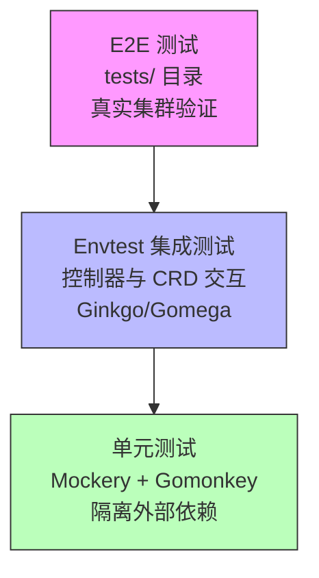
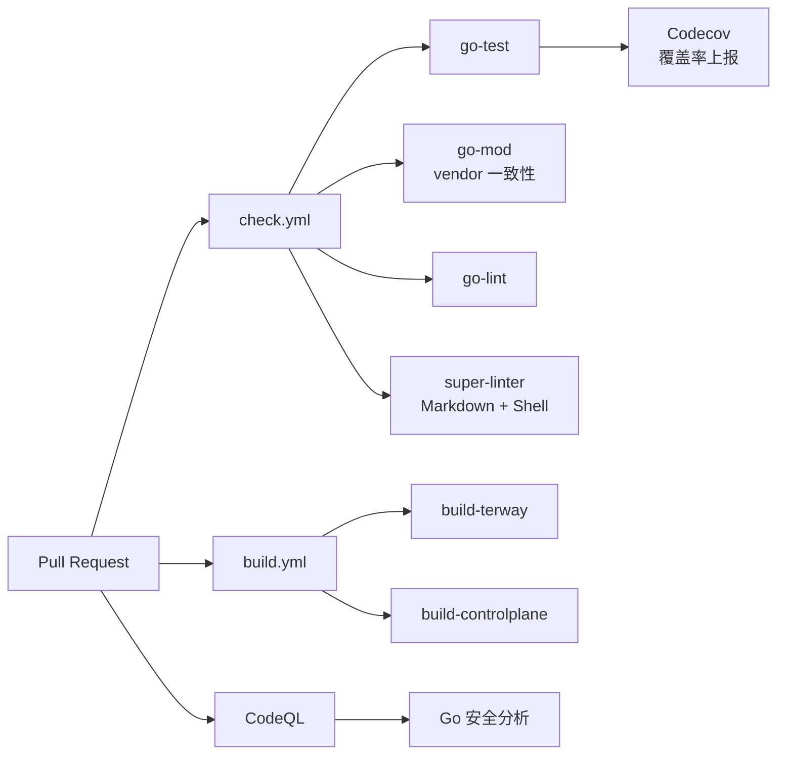
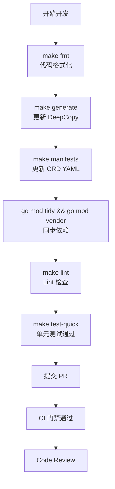

本文档面向希望参与 Terway 项目的开发者，系统性地阐述从环境搭建、编码规范、测试策略到提交代码的全流程要求。Terway 采用 Go 语言开发，遵循 Kubernetes 生态的代码生成与控制器模式，并通过多层 CI 门禁确保代码质量。无论是首次提交 Bug Fix 还是计划引入新特性，本文档将帮助你理解项目的质量标准与协作约定。

Sources: [AGENTS.md](AGENTS.md#L1-L48), [Makefile](Makefile#L1-L186), [LICENSE](LICENSE#L1)

## 开发环境准备

### 基础工具链

Terway 项目基于 **Go 1.24** 构建，使用 vendor 模式管理依赖。开发前需确认本地已安装以下工具：

| 工具 | 用途 | 安装方式 |
|------|------|----------|
| Go ≥ 1.24 | 编译与测试 | [官方安装指南](https://go.dev/doc/install) |
| Docker + Buildx | 多架构容器镜像构建 | [Docker Desktop](https://www.docker.com/products/docker-desktop) |
| Git | 版本控制 | 系统包管理器 |
| make | 构建编排 | 系统包管理器 |

项目通过 `Makefile` 自动管理开发工具的下载与版本控制，所有工具安装到 `./bin/` 目录下，版本锁定策略确保团队一致性：

| 工具 | 版本锁定 | Makefile 目标 |
|------|----------|--------------|
| controller-gen | v0.17.2 | `make controller-gen` |
| setup-envtest | release-0.20 | `make envtest` |
| golangci-lint | v2.7.2 | `make golangci-lint` |

Sources: [go.mod](go.mod#L1-L4), [Makefile](Makefile#L133-L167)

### 快速验证环境

克隆仓库后，执行以下命令验证环境是否就绪：

```bash
# 格式化 → 静态检查 → 单元测试（一站式验证）
make test-quick
```

`test-quick` 是开发者日常最高频使用的目标，它会依次执行 `manifests → generate → fmt → vet → envtest` 准备工作，然后运行单元测试并输出覆盖率报告到 `coverage.txt`。注意该命令需要 `sudo` 权限运行，因为 envtest 需要启动本地 Kubernetes API Server。

Sources: [Makefile](Makefile#L56-L58)

## 代码组织与模块职责

Terway 采用标准的 Go 项目布局，核心模块划分如下：

```
terway/
├── cmd/                        # 入口点
│   ├── terway/                 # Daemon 主进程
│   ├── terway-cli/             # CLI 诊断工具
│   └── terway-controlplane/    # 控制平面
├── daemon/                     # Daemon 核心逻辑：配置、服务、资源管理
├── plugin/                     # CNI 插件与数据路径驱动
│   ├── datapath/               # 数据路径实现（exclusive ENI, IPvlan, VLAN, policy router）
│   ├── driver/                 # 底层驱动（veth, ipvlan, vlan, nic, vf）
│   └── terway/                 # CNI 插件入口
├── pkg/                        # 可复用库
│   ├── aliyun/                 # 阿里云 API 封装（ECS、VPC、EFLO、凭证、元数据）
│   ├── apis/                   # CRD 类型定义与生成代码
│   ├── controller/             # 控制器（ENI、Multi-IP、Pod、PodENI、Webhook...）
│   ├── eni/                    # ENI 资源管理器与 IP 池
│   ├── factory/                # 资源工厂接口
│   ├── k8s/                    # Kubernetes 客户端封装
│   ├── metric/                 # Prometheus 指标
│   └── ...                     # 其他工具包
├── types/                      # 公共类型定义
├── rpc/                        # gRPC 协议定义（Protobuf）
├── charts/                     # Helm Chart
├── policy/                     # Cilium/Felix 补丁
├── tests/                      # E2E 测试
└── hack/                       # 构建、代码生成脚本
```

理解这一布局对贡献者至关重要：修改 API 类型时关注 `pkg/apis/`，修改网络数据路径时关注 `plugin/datapath/` 和 `plugin/driver/`，修改资源管理策略时关注 `pkg/eni/` 和 `pkg/controller/`。

Sources: [AGENTS.md](AGENTS.md#L1-L48), [.gitignore](.gitignore#L1-L14)

## 代码生成与 CRD 管理

Terway 使用 **controller-runtime** 生态的代码生成工具链。当你修改 `pkg/apis/` 下的 Kubernetes API 类型定义时，必须同步更新生成代码。

### 触发场景与操作

| 变更类型 | 需要执行的命令 | 生成物 |
|----------|--------------|--------|
| 修改 API 结构体字段 | `make generate` | `pkg/apis/` 下的 `DeepCopy` 方法 |
| 修改 CRD 定义 | `make manifests` | `pkg/apis/crds/` 下的 YAML 文件 |
| 修改 API 类型并需要完整同步 | `hack/update.sh` | 依赖整理 + 代码生成 + CRD 一站式更新 |
| 新增客户端代码 | `hack/update-codegen.sh` | `pkg/generated/` 下的 clientset、informer、lister |

**关键约定**：所有生成的源文件必须使用项目标准头文件模板 [hack/boilerplate.go.txt](hack/boilerplate.go.txt#L1-L15)，包含 Apache 2.0 许可声明。`controller-gen` 通过 `--go-header-file` 参数自动注入此模板。

Sources: [Makefile](Makefile#L36-L42), [hack/update-codegen.sh](hack/update-codegen.sh#L22-L45), [hack/boilerplate.go.txt](hack/boilerplate.go.txt#L1-L15)

### 代码生成验证

CI 通过 `hack/verify-codegen.sh` 验证生成代码是否最新——它会重新生成代码并与当前代码做 diff，任何不一致都会导致失败。本地可执行：

```bash
bash hack/verify-codegen.sh
```

Sources: [hack/verify-codegen.sh](hack/verify-codegen.sh#L17-L48)

## 测试策略

Terway 采用三层测试策略，针对不同场景使用不同工具，形成完整的质量保障金字塔：



### 第一层：接口 Mock（Mockery）

对于项目内定义的 Go 接口，使用 **Mockery** 生成 Mock 实现。项目中约 15 个接口通过 `//go:generate mockery` 注解声明了 Mock 生成，覆盖了核心的依赖边界：

| 接口 | 所在文件 | Mock 用途 |
|------|----------|-----------|
| `ECS` / `VPC` / `EFLO` / `OpenAPI` | [pkg/aliyun/client/interface.go](pkg/aliyun/client/interface.go#L1-L5) | Mock 阿里云 API 调用 |
| `Kubernetes` | [pkg/k8s/k8s.go](pkg/k8s/k8s.go#L1) | Mock Kubernetes 客户端 |
| `Factory` | [pkg/factory/types.go](pkg/factory/types.go#L1) | Mock 资源工厂 |
| `Storage` | [pkg/storage/store.go](pkg/storage/store.go#L1) | Mock 存储层 |
| `Interface` (Instance) | [pkg/aliyun/instance/instance.go](pkg/aliyun/instance/instance.go#L3) | Mock 实例元数据查询 |
| `NodeCapabilitiesStore` | [pkg/utils/nodecap/node_capabilities.go](pkg/utils/nodecap/node_capabilities.go#L1) | Mock 节点能力缓存 |

生成 Mock 的标准做法是在接口定义文件头部添加 `//go:generate` 注解。部分接口需要指定 build tag（`--tags default_build`），以确保只在完整构建时生成：

```go
//go:generate mockery --name ECS --tags default_build
```

执行 `go generate ./...` 后，Mock 文件会生成到对应包的 `mocks/` 子目录中。

Sources: [AGENTS.md](AGENTS.md#L12-L15), [pkg/aliyun/client/interface.go](pkg/aliyun/client/interface.go#L1-L5), [pkg/k8s/k8s.go](pkg/k8s/k8s.go#L1)

### 第二层：底层打桩（Gomonkey）

对于难以通过接口 Mock 的系统级交互——如 `os` 文件操作、`netlink` 网络调用、`grpc` 连接等——使用 **Gomonkey** 在运行时替换函数或方法。项目依赖 `github.com/agiledragon/gomonkey/v2`（v2.13.0），在测试中广泛使用 `ApplyFunc`、`ApplyMethodFunc` 等模式。

典型用例包括 Daemon 测试中对 `deviceplugin.NewENIDevicePlugin` 的打桩，以及 ENI 管理器测试中对 `netlink` 操作的替换。注意由于 Gomonkey 依赖运行时二进制修改，测试编译时需要 `-gcflags=all=-l` 禁用内联优化，这在 Makefile 中已预配置。

Sources: [AGENTS.md](AGENTS.md#L17-L20), [go.mod](go.mod#L10), [Makefile](Makefile#L57)

### 第三层：Envtest 集成测试

对于涉及 **Kubernetes 控制器与 CRD 交互**的逻辑，项目采用 **Envtest** 框架启动真实的 etcd 和 kube-apiserver，确保状态流转的准确性。这是项目中最高层级的自动化测试，分布在 11 个 `suite_test.go` 文件中：

| 测试套件 | 路径 |
|----------|------|
| ENI 控制器 | `pkg/controller/eni/suite_test.go` |
| Pod 控制器 | `pkg/controller/pod/suite_test.go` |
| PodENI 控制器 | `pkg/controller/pod-eni/suite_test.go` |
| Node 控制器 | `pkg/controller/node/suite_test.go` |
| Multi-IP (Pod) | `pkg/controller/multi-ip/pod/suite_test.go` |
| Multi-IP (Node) | `pkg/controller/multi-ip/node/suite_test.go` |
| PodNetworking 控制器 | `pkg/controller/pod-networking/suite_test.go` |
| Webhook | `pkg/controller/webhook/webhook_suite_test.go` |
| Preheating 控制器 | `pkg/controller/preheating/suite_test.go` |
| Common 工具 | `pkg/controller/common/suite_test.go` |
| ENI 资源管理 | `pkg/eni/suite_test.go` |

所有 Envtest 套件使用 **Ginkgo v2 + Gomega** BDD 框架编写，遵循统一的初始化模式：`BeforeSuite` 中启动 envtest 环境、注册 CRD Scheme、创建 Client；`AfterSuite` 中清理环境。**重要约束**：禁止手动设置 `UID`、`ResourceVersion` 或 `DeletionTimestamp` 等服务端托管字段，设置 `DeletionTimestamp` 必须通过 Client 的 `Delete` 操作触发。

Sources: [AGENTS.md](AGENTS.md#L22-L30), [pkg/eni/suite_test.go](pkg/eni/suite_test.go#L1-L107), [pkg/controller/eni/suite_test.go](pkg/controller/eni/suite_test.go#L1-L79)

### 测试执行命令

| 命令 | 用途 | 说明 |
|------|------|------|
| `make test-quick` | 单元测试 | 排除 e2e、mocks、generated、windows 等包，输出覆盖率 |
| `make test` | 完整单元测试 | 包含 datapath 测试 + test-quick |
| `make datapath-test` | 数据路径测试 | 使用 Kind 集群验证数据路径 |
| `make e2e-test` | E2E 功能测试 | 排除升级测试，需真实集群 |
| `make e2e-upgrade-test` | E2E 升级测试 | 仅运行升级场景 |
| `make e2e-test-all` | 全量 E2E 测试 | 功能 + 升级 |

Sources: [Makefile](Makefile#L52-L83)

## 代码质量与 Lint 规范

### Go Lint 配置

项目使用 **golangci-lint v2** 作为统一 Lint 平台，配置文件为 [.golangci.yml](.golangci.yml#L1-L41)。启用的规则包括：

| Linter | 作用 | 配置要点 |
|--------|------|----------|
| `goconst` | 检测可提取为常量的重复字符串 | 排除 `_test.go` 文件 |
| `misspell` | 英文拼写检查 | — |
| `staticcheck` | 静态分析（Bug 检测、代码简化） | — |
| `errcheck` | 错误返回值检查 | `check-blank: false` |
| `goimports` | Import 排序与格式化 | 作为 Formatter 启用 |

关键配置说明：Lint 运行时使用 `privileged` 和 `default_build` 两个 build tag；`_test.go` 文件中的 `dupl`（重复代码检测）和 `goconst` 规则被排除；生成的代码（`generated` 目录）采用宽松策略。

Sources: [.golangci.yml](.golangci.yml#L1-L41)

### Markdown 与 Shell 检查

除了 Go 代码，CI 还通过 **Super-Linter** 检查 Markdown 和 Shell 脚本。Markdown 遵循 [markdownlint](https://github.com/DavidAnson/markdownlint) 规则，配置在 [.github/linters/.markdown-lint.yml](.github/linters/.markdown-lint.yml#L1-L201) 中，主要要求包括：标题层级递增、无尾随空格、fenced code block 需指定语言、文件末尾单一换行等。Shell 脚本通过 `shellcheck` 检查，排除了 `SC2166` 规则（`a && b || c` 模式）。

Sources: [.github/workflows/check.yml](.github/workflows/check.yml#L70-L83), [.github/linters/.markdown-lint.yml](.github/linters/.markdown-lint.yml#L1-L201)

### Lint 执行命令

```bash
make lint          # 检查所有问题
make lint-fix      # 检查并尝试自动修复
make vet           # Go vet 静态分析（使用 privileged build tag）
make fmt           # go fmt 格式化
```

Sources: [Makefile](Makefile#L44-L66)

## CI/CD 流水线

所有 Pull Request 和 Push 都会触发 GitHub Actions 流水线，构成多层门禁机制：



### check.yml——质量门禁

这是最核心的 CI 工作流，包含四个并行 Job：

1. **go-test**：执行 `make test`，覆盖率报告上传至 Codecov，失败即阻塞合并
2. **go-mod**：验证 `go mod tidy && go mod vendor` 后无文件变化，确保依赖声明与 vendor 同步
3. **go-lint**：使用 `golangci-lint-action` 运行 Lint 检查
4. **super-linter**：对全仓库执行 Markdown 和 Shell 脚本检查

所有 Job 均启用 **并发控制**：同一 PR 的多次推送会自动取消前一次运行。

Sources: [.github/workflows/check.yml](.github/workflows/check.yml#L1-L83)

### build.yml——构建验证

验证所有组件（terway、terway-controlplane）的多架构 Docker 镜像构建成功。构建产物推送到 `ghcr.io/aliyuncontainerservice`，仅在 Push 到 main 分支或 Tag 触发时实际推送，PR 仅验证构建通过。

Sources: [.github/workflows/build.yml](.github/workflows/build.yml#L1-L53)

### CodeQL——安全分析

每周日定时运行 + 每次对 main 分支的 Push/PR 触发 Go 语言的 CodeQL 安全漏洞扫描。

Sources: [.github/workflows/codeql-analysis.yml](.github/workflows/codeql-analysis.yml#L1-L65)

## 依赖管理

Terway 使用 **Go Modules + Vendor** 模式。核心规则如下：

- 修改任何 import 后，必须执行 `go mod tidy && go mod vendor`
- CI 的 `go-mod` Job 会验证 vendor 目录与 `go.mod` 声明完全一致
- **Dependabot** 每周自动扫描依赖更新，但排除了 `google.golang.org/grpc`、`github.com/miekg/dns`、`k8s.io/*`、`sigs.k8s.io/*` 这些需要谨慎升级的核心依赖
- 工具依赖通过 [hack/tools.go](hack/tools.go#L1-L24) 以 `//go:build tools` 标签声明，确保 `go mod` 能追踪但不会编译到最终产物

Sources: [AGENTS.md](AGENTS.md#L39-L42), [.github/workflows/check.yml](.github/workflows/check.yml#L42-L53), [.github/dependabot.yml](.github/dependabot.yml#L1-L16)

## Pull Request 提交规范

### PR 命名规范

PR 标题格式：`[terway] <标题>` 或 `[组件名] <标题>`，例如 `[terway] fix: ENI IP leak on pod deletion` 或 `[cilium] update patch for LB policy`。

### 提交前检查清单



**最小化提交前验证**（按 AGENTS.md 要求）：

```bash
# 1. 格式化
make fmt

# 2. Lint 检查
make lint

# 3. 快速测试
make test-quick
```

如果修改了 API 类型，还需要额外执行：

```bash
make generate   # 更新 DeepCopy 方法
make manifests  # 更新 CRD 定义
```

如果添加或移除了 import，需要执行：

```bash
go mod tidy && go mod vendor
```

Sources: [AGENTS.md](AGENTS.md#L44-L48), [Makefile](Makefile#L36-L66)

### 覆盖率要求

项目使用 [Codecov](codecov.yml#L1-L6) 追踪覆盖率，配置了 `fully_covered_patch` 策略：删除的代码如果之前已被覆盖则不影响状态。测试报告输出到 `coverage.txt`，`test-quick` 目标会自动排除生成代码。

Sources: [Makefile](Makefile#L57-L58), [codecov.yml](codecov.yml#L1-L6)

## 安全漏洞报告

**切勿通过 GitHub Issue 报告安全问题**。如发现安全漏洞，请发送邮件至 **kubernetes-security@service.aliyun.com**。项目当前支持版本为 ≥ v1.6.0，低于此版本的分支不再接受安全修复。

Sources: [SECURITY.md](SECURITY.md#L1-L22)

## 构建与发布

### 本地构建

```bash
# 构建所有组件
make build

# 构建并推送镜像（需登录容器镜像仓库）
make build-push REGISTRY=your-registry PUSH=true
```

构建支持多平台（默认 `linux/amd64,linux/arm64`），通过 Docker Buildx 和 QEMU 实现。产物包括三个镜像：`terway`（Daemon + CNI Binary）、`terway-controlplane`（控制平面）和 `terway-policy`（网络策略）。

Sources: [Makefile](Makefile#L86-L125)

### 发布流程

发布通过 Git Tag 触发自动化流程：

| Tag 格式 | 触发的工作流 | 产物 |
|----------|-------------|------|
| `v*` | `release.yml` | GitHub Release（自动生成 Changelog） |
| `v*` | `build.yml` | 多架构镜像推送到 `ghcr.io/aliyuncontainerservice` |
| `v*-policy` | `build-policy.yml` | Policy 镜像推送到 `ghcr.io/aliyuncontainerservice/terway-policy` |

Changelog 基于 [release-change-log.json](.github/release-change-log.json#L1-L14) 配置自动生成，将带 `feature` 标签的 PR 归入"🚀 Features"分类。

Sources: [.github/workflows/release.yml](.github/workflows/release.yml#L1-L33), [.github/workflows/build-policy.yml](.github/workflows/build-policy.yml#L1-L56), [.github/release-change-log.json](.github/release-change-log.json#L1-L14)

## 下一步阅读

完成开发环境搭建并理解贡献规范后，建议按以下路径深入了解项目架构：

1. [整体架构设计：Daemon、CNI Binary 与控制平面的协作机制](4-zheng-ti-jia-gou-she-ji-daemon-cni-binary-yu-kong-zhi-ping-mian-de-xie-zuo-ji-zhi)——理解三大组件的协作模型
2. [单元测试策略：Mock 框架（Mockery）、Gomonkey 打桩与 Envtest 集成测试](28-dan-yuan-ce-shi-ce-lue-mock-kuang-jia-mockery-gomonkey-da-zhuang-yu-envtest-ji-cheng-ce-shi)——深入理解测试模式的具体实现
3. [E2E 测试框架：连通性验证、Prefix 测试与压力测试](29-e2e-ce-shi-kuang-jia-lian-tong-xing-yan-zheng-prefix-ce-shi-yu-ya-li-ce-shi)——了解端到端验证体系