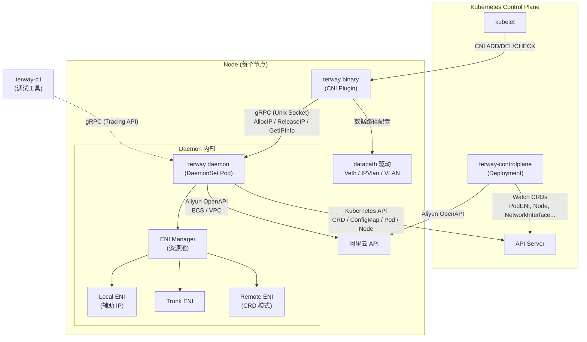
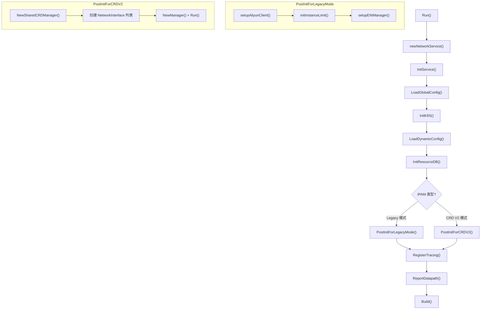
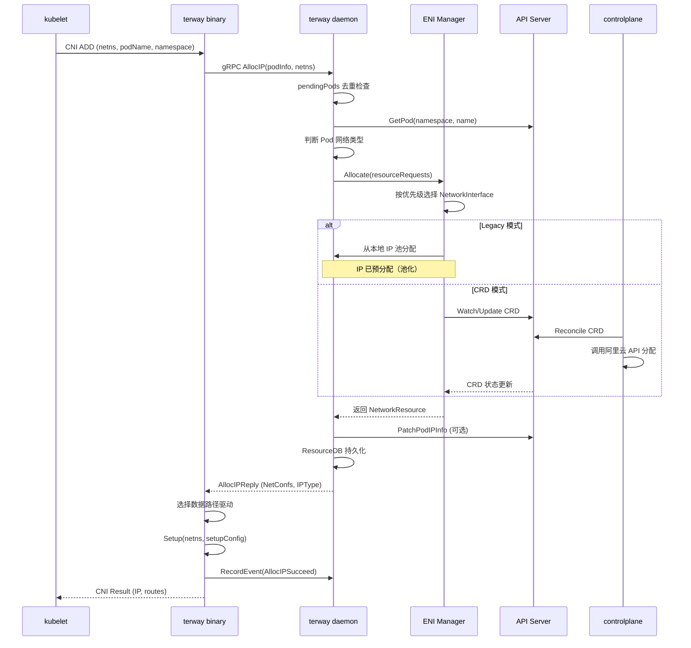

Terway 是阿里云容器服务团队推出的 CNI 插件，其架构遵循业界标准的 "Binary + Daemon" 分离模式，并在此基础上引入了独立的控制平面组件来处理集群级别的资源编排。本文将从**进程拓扑、通信协议、职责边界和初始化流程**四个维度，系统阐述三大组件——CNI Binary、Terway Daemon 和 Terway ControlPlane——如何协同工作以完成 Pod 网络的创建、配置与生命周期管理。

Sources: [design.md](docs/design.md#L1-L122), [main.go](cmd/terway/main.go#L1-L76), [terway-controlplane.go](cmd/terway-controlplane/terway-controlplane.go#L93-L265)

## 组件全景：三大进程的定位与职责

Terway 的运行态由三个独立的进程/组件构成，每个进程承担明确的职责边界。下表总结了它们的角色定位：

| 组件 | 进程入口 | 部署形态 | 核心职责 | 生命周期 |
|------|----------|----------|----------|----------|
| **CNI Binary** | `plugin/terway/cni.go` | 节点二进制文件 | 接收 kubelet 的 CNI 调用，配置 Pod 网络命名空间的数据路径 | 短生命周期，由 kubelet 按需 invoke |
| **Terway Daemon** | `cmd/terway/main.go` → `daemon/server.go` | DaemonSet (`terway-eniip`) | IP 地址分配与释放、ENI 资源池管理、节点级资源回收与 GC | 长生命周期，每个节点一个 Pod |
| **Control Plane** | `cmd/terway-controlplane/terway-controlplane.go` | Deployment (`terway-controlplane`) | CRD 管理、集群级控制器协调、Webhook 准入控制、多 IP 集中调度 | 长生命周期，2+ 副本（Leader Election） |

这种架构决策的核心考量在于：**CNI Binary 的执行环境受限于 kubelet 的调用上下文（网络命名空间中、无持久状态），因此将资源管理和 API 调用等重逻辑卸载到常驻 Daemon 进程中**。而控制平面进一步将集群级别的资源编排逻辑从节点级 Daemon 中剥离，形成了清晰的分层架构。

Sources: [cni.go](plugin/terway/cni.go#L62-L65), [daemonset.yaml](charts/terway/templates/terwayd/daemonset.yaml#L1-L47), [deployment.yaml](charts/terway/templates/terway-controlplane/deployment.yaml#L1-L67)

## 进程拓扑与通信模型

理解 Terway 的架构首先需要明确组件之间的通信路径。下图展示了从 kubelet 触发 Pod 创建到网络就绪的完整交互链路：

**通信协议分为三类**：

1. **CNI Binary ↔ Daemon**：基于 Unix Domain Socket 的 gRPC 通信（`/var/run/eni/eni.socket`），使用 `TerwayBackend` 服务定义，包含 `AllocIP`、`ReleaseIP`、`GetIPInfo`、`RecordEvent` 四个核心 RPC。Binary 是短生命周期进程，每次 CNI 调用都会建立新的 gRPC 连接。

2. **Daemon ↔ Kubernetes API Server**：Daemon 通过 controller-runtime 的 `client.Client` 接口与 API Server 交互，用于获取 Pod 信息、读写 CRD 资源（如 `Node`、`NetworkInterface`）、Patch 节点注解以及动态配置热加载。

3. **Daemon / ControlPlane ↔ 阿里云 OpenAPI**：两个组件均通过 `aliyun.APIFacade` 封装的 ECS/VPC API 管理底层网络资源，包括 ENI 创建/绑定/分配辅助 IP 等操作。凭证链采用 `AccessKey → EncryptedFile → ECSMetadata` 的三级回退策略。

Sources: [rpc.proto](rpc/rpc.proto#L1-L140), [cni.go](plugin/terway/cni.go#L209-L234), [k8s.go](pkg/k8s/k8s.go#L80-L107), [builder.go](daemon/builder.go#L166-L190)

## CNI Binary：kubelet 的网络代理

CNI Binary 是 kubelet 直接调用的可执行文件，其职责非常聚焦——**作为 kubelet 与 Daemon 之间的桥梁，将 CNI 规范的调用语义转换为 gRPC 请求，并在获得资源后完成数据路径的物理配置**。

### CNI 规范实现

Binary 通过 `skel.PluginMain` 注册了三个标准 CNI 回调：

| 回调 | 对应 RPC | 核心行为 |
|------|----------|----------|
| `cmdAdd` | `AllocIP` → `RecordEvent` | 向 Daemon 申请 IP 资源，根据返回的 `NetConf` 配置数据路径（Veth/IPVlan/VLAN/ExclusiveENI） |
| `cmdDel` | `GetIPInfo` → 数据路径清理 → `ReleaseIP` | 从 Daemon 获取已分配资源信息，清理网络配置后释放 IP |
| `cmdCheck` | `GetIPInfo` | 从 Daemon 获取当前状态，校验 Pod 网络配置是否一致 |

`cmdAdd` 的关键流程是：解析 CNI 参数 → 建立 gRPC 连接 → 调用 `AllocIP` → 根据 `IPType`（`TypeVPCIP`/`TypeVPCENI`/`TypeENIMultiIP`）选择数据路径驱动 → 在 Pod 网络命名空间中执行 `Setup`。`cmdDel` 则先获取缓存的分配信息，执行数据路径 `Teardown`，最后调用 `ReleaseIP` 归还资源。所有 RPC 调用均设置了 120 秒超时（`defaultCniTimeout`），与 kubelet 的 CNI 超时对齐。

Sources: [cni.go](plugin/terway/cni.go#L62-L126), [cni_linux.go](plugin/terway/cni_linux.go#L101-L274)

### 数据路径选择策略

Binary 根据 Daemon 返回的 `IPType` 和配置参数，通过 `getDatePath` 函数确定实际的数据路径驱动：

| IPType | Trunk | 数据路径 | 说明 |
|--------|-------|----------|------|
| `TypeVPCIP` | - | `VPCRoute` | VPC 路由模式，使用 Veth pair |
| `TypeVPCENI` | No | `ExclusiveENI` | 独占 ENI 模式 |
| `TypeVPCENI` | Yes | `Vlan` | Trunk + VLAN 模式 |
| `TypeENIMultiIP` | No / VLAN 禁用 | `IPVlan`（优先）或 `PolicyRoute`（降级） | ENI 多 IP 模式 |
| `TypeENIMultiIP` | Yes + VLAN 启用 | `Vlan` | Trunk ENI 多 IP |

值得注意的是，当 `IPType` 为 `TypeENIMultiIP` 且选择了 `IPVlan` 驱动时，Binary 会先检查内核是否支持 IPVlan（`CheckIPVLvanAvailable`）。如果不可用，则自动降级到 `PolicyRoute`（基于 Veth pair 的策略路由），并记录一条 `VirtualModeChanged` 事件通知用户。

Sources: [cni.go](plugin/terway/cni.go#L509-L526), [cni_linux.go](plugin/terway/cni_linux.go#L199-L267)

## Terway Daemon：节点级资源管家

Daemon 是 Terway 在每个节点上运行的核心常驻进程，以 DaemonSet 形式部署，承担**IP 地址管理、ENI 资源池化、垃圾回收和节点状态上报**等关键职责。其内部架构采用 Builder 模式构建，由 `networkService` 结构体作为核心服务对象。

### 初始化链路（Builder 模式）

Daemon 的启动过程通过 `NetworkServiceBuilder` 以链式调用完成，每一步构建阶段都有明确的依赖关系：

构建链中的关键决策点在 `IPAMType` 判断上。当 IPAM 类型为空或 `preferCRD` 时走 **Legacy 模式**（直接调用阿里云 API 管理 ENI 资源）；当为 `crd` 时走 **CRD V2 模式**（通过 CRD 和 SharedCRDManager 与控制平面协同管理资源）。这两种模式的 ENI Manager 初始化策略完全不同：Legacy 模式通过 `setupENIManager` 直接创建本地 ENI 对象并连接阿里云 API；CRD V2 模式则创建 `LocalDelegate`/`RemoteV2`/`CRDV2` 等 NetworkInterface 实现，通过 CRD 中介完成资源交互。

Sources: [builder.go](daemon/builder.go#L36-L576), [server.go](daemon/server.go#L73-L143)

### gRPC 服务端点

Daemon 在 `/var/run/eni/eni.socket` 上启动 gRPC 服务器，注册了两套服务：

**TerwayBackend**（核心业务）—— 由 `networkService` 结构体实现：

- `AllocIP`：接收 CNI Binary 的 IP 分配请求，执行 `pendingPods` 去重 → 获取 Pod 信息 → 判断网络类型 → 构造 `ResourceRequest` → 调用 `eniMgr.Allocate` 分配资源 → 持久化到本地 ResourceDB → 返回 `NetConf` 配置
- `ReleaseIP`：释放 IP 资源，支持固定 IP 租期（`IPStickTime`），在租期内保留资源不归还池
- `GetIPInfo`：从 ResourceDB 读取已缓存的分配信息，用于 `cmdCheck` 和 `cmdDel` 场景
- `RecordEvent`：代理 CNI Binary 向 Kubernetes 记录 Pod/Node 事件

**TerwayTracing**（调试诊断）—— 由 `tracing.DefaultRPCServer` 提供，支持 `terway-cli` 的资源映射查询、配置获取和追踪信息。

Sources: [server.go](daemon/server.go#L106-L111), [daemon.go](daemon/daemon.go#L61-L87), [rpc.proto](rpc/rpc.proto#L5-L14)

### ENI Manager 与资源池化

`eni.Manager` 是 Daemon 资源管理的核心引擎，它管理一组按优先级排序的 `NetworkInterface` 实现。Manager 的设计采用**资源池化 + 异步分配**模式：

`Allocate` 方法的工作机制是遍历所有 `NetworkInterface`，对每个 `ResourceRequest` 找到第一个能够处理的 NetworkInterface，获取其返回的分配通道（`chan *AllocResp`），然后通过 goroutine 并发收集结果。当所有 NetworkInterface 都无法处理请求时（如 IP 耗尽），Manager 会通过 `NodeCondition` 机制设置节点的 `IPExhaustive` 状态，触发 10 分钟的冷却期，在此期间节点被标记为 IP 不足。

`Release` 方法则采用精确匹配策略，遍历 NetworkInterface 列表直到找到持有该资源的后端执行释放，并在本地 IP 释放时触发 `UnsetIPExhaustive` 恢复节点状态。

Manager 还运行一个周期性的 `syncPool` 协程，根据 `selectionPolicy`（`MostIPs` 或 `LeastIPs`）对 NetworkInterface 进行排序，确保资源分配策略在运行时保持一致。

Sources: [manager.go](pkg/eni/manager.go#L80-L276), [types.go](pkg/eni/types.go#L1-L200)

### 垃圾回收机制

Daemon 运行一个每 5 分钟触发一次的 GC 循环（`gcPeriod = 5 * time.Minute`）。GC 的核心逻辑是对比本地 ResourceDB 中记录的 Pod 资源与 Kubernetes 集群中实际存在的 Pod：对于 ResourceDB 中存在但集群中已不存在的 Pod，执行资源释放并清理规则配置。对于有固定 IP 租期（`IPStickTime`）的 Pod，GC 会先将租期置零，等待下一次 GC 周期再释放资源，从而实现 StatefulSet Pod 的 IP 保持能力。

Sources: [daemon.go](daemon/daemon.go#L498-L600)

## Terway ControlPlane：集群级编排引擎

控制平面是一个独立的 Deployment，通过 controller-runtime 框架注册了多个控制器和 Webhook，负责**CRD 生命周期管理、集群级资源调度和 Pod 准入控制**。

### 控制器注册体系

控制平面采用插件式注册架构，每个控制器通过 `register.Add()` 函数注册到全局 `Controllers` 映射中，运行时根据配置决定启用哪些控制器：

| 控制器 | 注册包 | 默认启用 | 职责 |
|--------|--------|----------|------|
| ENI Controller | `pkg/controller/eni` | 是 | 管理弹性网卡的创建/绑定/解绑 |
| Multi-IP Node | `pkg/controller/multi-ip/node` | 是 | 节点级多 IP 资源池协调 |
| Multi-IP Pod | `pkg/controller/multi-ip/pod` | 是 | Pod 级 IP 分配协调 |
| Node Controller | `pkg/controller/node` | 是 | 节点资源状态同步 |
| Pod Controller | `pkg/controller/pod` | 是 | Pod 网络资源状态追踪 |
| PodENI Controller | `pkg/controller/pod-eni` | 是 | PodENI CRD 生命周期管理 |
| PodNetworking Controller | `pkg/controller/pod-networking` | 是 | PodNetworking CRD 管理 |

控制器在启动前会经过 `detectMultiIP` 检测：如果 Daemon 配置的 IPAM 类型不是 `crd`，则自动禁用 `multi-ip/node` 和 `multi-ip/pod` 控制器，避免不必要的资源消耗。这种自适应机制确保了控制平面与不同配置模式的 Daemon 之间的兼容性。

Sources: [terway-controlplane.go](cmd/terway-controlplane/terway-controlplane.go#L149-L264), [all.go](pkg/controller/all/all.go#L1-L30), [register.go](pkg/controller/register.go#L36-L71)

### CRD 管理与初始化

控制平面在启动时首先通过 `crds.CreateOrUpdateCRD` 确保以下五种 CRD 存在于集群中：

- `PodENI` — Pod 与弹性网卡的绑定关系
- `PodNetworking` — Pod 网络配置模板
- `Node` — 节点级网络资源状态
- `NodeRuntime` — 节点运行时网络配置
- `NetworkInterface` — 网络接口资源抽象

这些 CRD 构成了控制平面与 Daemon 之间的**声明式数据契约**。Daemon 通过 watch 这些 CRD 获取资源分配指令，控制平面通过 reconcile 确保 CRD 状态与底层阿里云资源一致。

Sources: [terway-controlplane.go](cmd/terway-controlplane/terway-controlplane.go#L149-L155), [register.go](pkg/apis/crds/register.go)

### Webhook 准入控制

当 `DisableWebhook` 为 false 时（默认），控制平面会注册两个 Webhook 端点：

- **`/mutating`**（Mutating Webhook）— 对新建或更新的 Pod 进行变更注入，根据 Pod 的 Annotation 和 PodNetworking 配置决定其网络类型（ENI/ENIMultiIP），并注入相关配置
- **`/validate`**（Validating Webhook）— 对 Pod 网络配置进行校验，防止非法配置

Webhook 使用自动管理的 TLS 证书（通过 `cert.SyncCert` 实现），证书存储在 Secret 中由控制平面自动轮换。

Sources: [terway-controlplane.go](cmd/terway-controlplane/terway-controlplane.go#L165-L205)

## 端到端 Pod 创建流程

将三大组件的协作关系串联起来，一个完整的 Pod 创建流程如下：

**释放流程**则反向执行：CNI Binary 调用 `GetIPInfo` 获取缓存信息 → 清理数据路径 → 调用 `ReleaseIP` 归还资源。Daemon 在释放时会检查 Pod 的 `IPStickTime`：大于零时不立即释放而是保留租期，等待 GC 循环后续处理；为零时立即释放并从 ResourceDB 删除记录。

Sources: [daemon.go](daemon/daemon.go#L106-L295), [cni_linux.go](plugin/terway/cni_linux.go#L101-L274), [cni_linux.go](plugin/terway/cni_linux.go#L276-L365)

## 本地持久化与状态恢复

Daemon 使用两层本地持久化存储来保障节点重启后的状态恢复：

| 存储路径 | 用途 | 内容 |
|----------|------|------|
| `/var/lib/cni/terway/pod.db` | Pod 信息缓存（`k8s.Kubernetes` 使用） | Pod 与资源映射 |
| `/var/lib/cni/terway/ResRelation.db` | 资源关系数据库（`networkService` 使用） | PodID → PodResources 映射，包含网络类型、ENI 信息、IP 地址、NetConf JSON |

这两个存储均通过 `storage.NewDiskStorage` 创建，基于 JSON 序列化。在 Daemon 初始化时，Builder 会从 ResourceDB 加载历史 PodResources，传入 ENI Manager 的 `Run` 方法，使得 Manager 能够恢复节点重启前的资源状态，避免 IP 地址冲突和资源泄漏。

Sources: [builder.go](daemon/builder.go#L514-L533), [resource_manager.go](daemon/resource_manager.go#L1-L7), [k8s.go](pkg/k8s/k8s.go#L54-L55)

## 架构设计的关键权衡

Terway 的架构决策体现了几个关键的工程权衡：

**Binary-Daemon 分离**：将 CNI Binary 保持为轻量级（仅处理网络配置），将 API 调用和资源管理等重逻辑放在 Daemon 中。这使得 Binary 的执行时间可控，不会因为阿里云 API 延迟而阻塞 kubelet，但代价是引入了进程间通信的开销和 Daemon 单点故障风险（Daemon 崩溃时所有正在进行的 CNI 调用会失败）。

**资源池化策略**：Daemon 在 Legacy 模式下维护预分配的 IP 池（`PoolConfig` 的 `MinPoolSize` / `MaxPoolSize`），通过后台协程在水位线之间自动补充和释放。这使得 Pod 创建时无需等待阿里云 API，但需要额外占用 IP 资源。

**CRD 模式 vs Legacy 模式**：CRD 模式将资源管理职责从 Daemon 上移到控制平面，通过声明式 CRD 实现更精确的资源追踪和跨节点协调。Legacy 模式则让 Daemon 直接管理资源，简化了部署但牺牲了集群级视图。两种模式通过 `IPAMType` 配置无缝切换。

Sources: [design.md](docs/design.md#L15-L24), [config.go](daemon/config.go#L72-L195), [builder.go](daemon/builder.go#L468-L512)

## 延伸阅读

- 了解 gRPC 通信协议的详细字段定义，参见 [gRPC 通信协议：Daemon 与 CNI Binary 的接口定义](5-grpc-tong-xin-xie-yi-daemon-yu-cni-binary-de-jie-kou-ding-yi)
- 深入了解各网络模式的数据路径实现，参见 [网络模式全解析：VPC、ENI、ENI 多 IP 与 Trunk 模式](6-wang-luo-mo-shi-quan-jie-xi-vpc-eni-eni-duo-ip-yu-trunk-mo-shi)
- 了解 ENI 资源池化与 IP 水位控制机制，参见 [ENI 资源管理器：IP 池化、水位控制与资源回收机制](9-eni-zi-yuan-guan-li-qi-ip-chi-hua-shui-wei-kong-zhi-yu-zi-yuan-hui-shou-ji-zhi)
- 了解控制平面控制器的工作原理，参见 [控制平面控制器详解：ENI 控制器、Multi-IP 控制器与 Pod 控制器](14-kong-zhi-ping-mian-kong-zhi-qi-xiang-jie-eni-kong-zhi-qi-multi-ip-kong-zhi-qi-yu-pod-kong-zhi-qi)
- 了解调试工具的使用方法，参见 [Terway CLI 调试工具：资源映射、元数据查询与问题诊断](25-terway-cli-diao-shi-gong-ju-zi-yuan-ying-she-yuan-shu-ju-cha-xun-yu-wen-ti-zhen-duan)