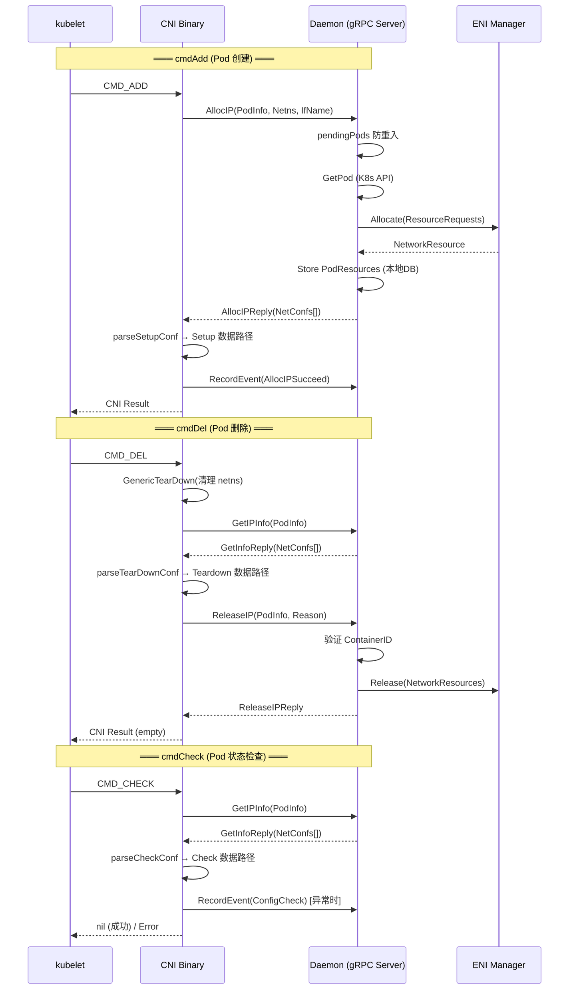

Terway 的核心架构采用 **Daemon + CNI Binary** 的分离设计：CNI Binary 作为 kubelet 调用的轻量级入口，通过 Unix Domain Socket 上的 gRPC 协议将所有网络资源管理逻辑委托给常驻运行的 Daemon 进程。这种设计使得 IP 分配、ENI 管理等重量级操作可以复用长连接、维护本地资源池，同时保持 CNI Binary 自身的快速启停特性。本文将深入剖析两套 gRPC 服务——**TerwayBackend**（核心 CNI 生命周期接口）和 **TerwayTracing**（资源调试与诊断接口）——的完整协议定义、消息结构、调用时序与工程实现。

Sources: [rpc.proto](rpc/rpc.proto#L1-L140), [tracing.proto](rpc/tracing.proto#L1-L95)

## 传输层架构：Unix Domain Socket 与安全模型

Terway 的 gRPC 通信建立在 **Unix Domain Socket** 之上，默认路径为 `/var/run/eni/eni.socket`。这一选择并非偶然——Unix Socket 将通信范围限定在同一节点内的进程间，天然避免了网络层面的安全风险，同时避免了 TCP 连接的内核协议栈开销。

```
┌─────────────────────────────────────────────────────────────────┐
│                        节点 (Node)                               │
│                                                                  │
│  ┌──────────┐    Unix Socket        ┌───────────────────────┐   │
│  │   kubelet │──CMD_ADD/DEL/CHECK──▶│  CNI Binary (terway)  │   │
│  └──────────┘                       └───────────┬───────────┘   │
│                                                 │ gRPC          │
│                                                 │ (insecure)    │
│                                     /var/run/eni/eni.socket     │
│                                                 │               │
│                                         ┌───────▼──────────┐    │
│                                         │  Terway Daemon    │    │
│                                         │  ┌──────────────┐ │    │
│                                         │  │TerwayBackend │ │    │
│                                         │  │TerwayTracing │ │    │
│                                         │  └──────────────┘ │    │
│                                         └──────────────────┘    │
└─────────────────────────────────────────────────────────────────┘
```

Daemon 在启动时通过 `newUnixListener` 创建 Socket 监听器，设置文件权限为 `0600`（仅属主可读写），并通过 `filemutex` 确保同一节点上只有一个 Daemon 实例运行。gRPC Server 使用 `insecure.NewCredentials()` 传输凭证——在 Unix Socket 场景下，文件系统权限已提供足够的访问控制，无需 TLS 开销。

Sources: [server.go](daemon/server.go#L73-L168), [cni.go](plugin/terway/cni.go#L34-L55)

### 客户端连接管理

CNI Binary 每次被 kubelet 调用时都会创建新的 gRPC 连接，调用完成后立即关闭。连接建立使用 `passthrough:` scheme 绕过 gRPC 默认的 DNS 解析，直接通过自定义 Dialer 拨号到 Unix Socket：

```go
// 连接重试参数：固定 1 秒间隔，避免过长的重试等待
grpc.WithConnectParams(grpc.ConnectParams{
    Backoff: backoff.Config{
        BaseDelay:  time.Second,
        Multiplier: 1,
        MaxDelay:   time.Second,
    },
})
```

CNI 侧的 RPC 超时设置为 **120 秒**（`defaultCniTimeout`），与 Daemon 侧的 **118 秒**（`daemonRPCTimeout`）形成层级超时：CNI 端先超时断开，Daemon 端随后清理上下文，避免悬挂请求。

Sources: [cni.go](plugin/terway/cni.go#L209-L234), [server.go](daemon/server.go#L253-L270)

## TerwayBackend 服务：CNI 生命周期核心接口

`TerwayBackend` 是 Terway 的核心 gRPC 服务，定义了 4 个 Unary RPC 方法，直接映射 CNI 的 ADD、DEL、CHECK 生命周期操作加上事件记录功能。

```protobuf
service TerwayBackend {
  rpc AllocIP (AllocIPRequest) returns (AllocIPReply) {}
  rpc ReleaseIP (ReleaseIPRequest) returns (ReleaseIPReply) {}
  rpc GetIPInfo(GetInfoRequest) returns (GetInfoReply) {}
  rpc RecordEvent(EventRequest) returns (EventReply) {}
}
```

Sources: [rpc.proto](rpc/rpc.proto#L5-L14)

### 服务端拦截器：统一超时与日志注入

所有 `TerwayBackend` RPC 调用都经过 `cniInterceptor` 拦截器，执行两项关键职责：

1. **统一超时控制**：为每个请求注入 118 秒超时上下文（`daemonRPCTimeout`），防止异常请求长期占用资源
2. **结构化日志注入**：从请求中提取 `Pod Namespace/Name` 和 `ContainerID`，注入到 `context` 的日志字段中，实现请求级别的全链路追踪

Sources: [server.go](daemon/server.go#L253-L270)

### AllocIP — Pod 网络资源分配

**调用时机**：CNI Binary 在 `cmdAdd` 阶段调用，为 Pod 分配 IP 地址及关联的网络资源（ENI、ENIIP）。

**请求结构**：

| 字段 | 类型 | 说明 |
|------|------|------|
| `K8sPodName` | string | Pod 名称 |
| `K8sPodNamespace` | string | Pod 命名空间 |
| `K8sPodInfraContainerId` | string | Pod 沙箱容器 ID（作为唯一性标识） |
| `Netns` | string | 容器网络命名空间路径（如 `/proc/12345/ns/net`） |
| `IfName` | string | 容器内网络接口名称（通常为 `eth0`） |

Sources: [rpc.proto](rpc/rpc.proto#L22-L28)

**响应结构 `AllocIPReply`**：

| 字段 | 类型 | 说明 |
|------|------|------|
| `Success` | bool | 分配是否成功 |
| `IPType` | enum | IP 类型枚举：`TypeVPCIP`(0)、`TypeVPCENI`(1)、`TypeENIMultiIP`(2) |
| `IPv4` | bool | 是否启用 IPv4 |
| `IPv6` | bool | 是否启用 IPv6 |
| `NetConfs` | repeated NetConf | 网络配置列表（支持多网卡场景，每个元素对应一个网络接口） |

**`NetConf` 嵌套结构**是整个协议中信息密度最高的消息类型：

```
NetConf
├── BasicInfo          # 基础网络信息
│   ├── PodIP (IPSet)      # Pod 的 IPv4/IPv6 地址
│   ├── PodCIDR (IPSet)    # Pod 所属子网 CIDR
│   ├── GatewayIP (IPSet)  # 子网网关 IP
│   └── ServiceCIDR (IPSet)# 集群 Service CIDR
├── ENIInfo            # ENI 关联信息（VPC/ENI/ENIMultiIP 模式）
│   ├── MAC               # ENI MAC 地址
│   ├── Trunk             # 是否为 Trunk ENI
│   ├── Vid               # VLAN ID（Trunk 模式下）
│   ├── GatewayIP (IPSet) # ENI 网关 IP
│   ├── eRDMA             # 是否为 eRDMA ENI
│   └── VfId (optional)   # SR-IOV VF ID
├── Pod                # 流量控制参数
│   ├── Ingress           # 入方向带宽限制（bytes/s）
│   ├── Egress            # 出方向带宽限制（bytes/s）
│   └── NetworkPriority   # 网络优先级
├── IfName             # 容器内接口名称
├── ExtraRoutes        # 额外路由（Dst 字段）
└── DefaultRoute       # 是否承载默认路由
```

Sources: [rpc.proto](rpc/rpc.proto#L30-L78), [rpc.proto](rpc/rpc.proto#L39-L45)

### ReleaseIP — Pod 网络资源释放

**调用时机**：CNI Binary 在 `cmdDel` 阶段调用，先通过 `GetIPInfo` 获取已分配资源的快照执行数据路径清理，再调用 `ReleaseIP` 释放 IP 和 ENI 资源。

**请求结构**：

| 字段 | 类型 | 说明 |
|------|------|------|
| `K8sPodName` | string | Pod 名称 |
| `K8sPodNamespace` | string | Pod 命名空间 |
| `K8sPodInfraContainerId` | string | 沙箱容器 ID |
| `IPType` | enum | IP 类型 |
| `IPv4Addr` | IPSet | 待释放的 IPv4 地址 |
| `MacAddr` | string | 关联的 MAC 地址 |
| `Reason` | string | 释放原因（如 `"normal release"` 或回滚原因） |

Sources: [rpc.proto](rpc/rpc.proto#L80-L88)

**释放策略的关键分支**：Daemon 的 `ReleaseIP` 方法在处理资源释放时，会根据 `IPStickTime`（固定 IP 保持时间）和 `ipamType` 做决策——当 IPAM 类型为 CRD 模式或 `IPStickTime ≤ 0` 时立即释放资源；否则保留 IP 分配记录，由 GC 周期或后续流程回收。ContainerID 的校验确保了只有发起分配请求的同一容器实例才能触发释放，防止竞态条件下误删资源。

Sources: [daemon.go](daemon/daemon.go#L297-L390)

### GetIPInfo — 已分配资源查询

**调用时机**：CNI Binary 在 `cmdDel`（删除）和 `cmdCheck`（检查）阶段调用，从 Daemon 本地存储中读取之前 `AllocIP` 保存的网络配置快照。

**请求/响应结构**：

| 请求字段 | 类型 | 说明 |
|----------|------|------|
| `K8sPodName` | string | Pod 名称 |
| `K8sPodNamespace` | string | Pod 命名空间 |
| `K8sPodInfraContainerId` | string | 沙箱容器 ID |

| 响应字段 | 类型 | 说明 |
|----------|------|------|
| `IPType` | enum | IP 类型 |
| `Success` | bool | 查询是否成功 |
| `IPv4/IPv6` | bool | 协议栈启用状态 |
| `NetConfs` | repeated NetConf | 序列化的网络配置（从本地存储反序列化） |
| `Error` | Error enum | 错误类型：`ErrNoErr`(0)、`ErrCRDNotFound`(1) |

`GetIPInfo` 的设计体现了 **Cache-Aside** 模式：`AllocIP` 成功后会将 `NetConf` 列表 JSON 序列化存入本地存储（`resourceDB`），`GetIPInfo` 直接反序列化返回，无需重新与 ENI 管理器或 API Server 交互。`ErrCRDNotFound` 错误码用于标识 CRD 资源已被外部控制器删除的场景，CNI Binary 收到此错误时会静默返回，避免删除阶段因资源缺失而失败。

Sources: [rpc.proto](rpc/rpc.proto#L98-L116), [daemon.go](daemon/daemon.go#L393-L462)

### RecordEvent — Kubernetes 事件上报

**调用时机**：CNI Binary 在 `cmdAdd` 完成后（无论成功或失败）以及 `cmdCheck` 检测到异常时调用，通过 Daemon 向 Kubernetes API Server 上报 Pod 级别或 Node 级别的事件。

**请求结构**：

| 字段 | 类型 | 说明 |
|------|------|------|
| `EventTarget` | enum | 事件目标：`EventTargetNode`(0)、`EventTargetPod`(1) |
| `K8sPodName` | string | Pod 名称（Pod 事件时使用） |
| `K8sPodNamespace` | string | Pod 命名空间 |
| `EventType` | enum | 事件级别：`EventTypeNormal`(0)、`EventTypeWarning`(1) |
| `Reason` | string | 事件原因（如 `"AllocIPSucceed"`、`"AllocIPFailed"`） |
| `Message` | string | 事件详细信息 |

CNI Binary 无法直接访问 Kubernetes API（它运行在主机网络命名空间且没有 ServiceAccount），因此将事件上报委托给拥有 Kubernetes 客户端的 Daemon。事件使用独立于主 RPC 的 **10 秒超时**（`defaultEventTimeout`），且上报失败不会影响主流程。

Sources: [rpc.proto](rpc/rpc.proto#L118-L140), [cni_linux.go](plugin/terway/cni_linux.go#L106-L129)

## TerwayTracing 服务：资源调试与诊断接口

`TerwayTracing` 是独立的诊断 gRPC 服务，由 **Terway CLI**（`terway-cli`）工具调用，提供节点级资源状态查询、配置追踪和命令执行能力。该服务与 `TerwayBackend` 注册在同一个 gRPC Server 上，共享同一个 Unix Socket。

```protobuf
service TerwayTracing {
  rpc GetResourceTypes(Placeholder) returns (ResourcesTypesReply);
  rpc GetResources(ResourceTypeRequest) returns (ResourcesNamesReply);
  rpc GetResourceConfig(ResourceTypeNameRequest) returns (ResourceConfigReply);
  rpc GetResourceTrace(ResourceTypeNameRequest) returns (ResourceTraceReply);
  rpc ResourceExecute(ResourceExecuteRequest) returns (stream ResourceExecuteReply);
  rpc GetResourceMapping(Placeholder) returns (ResourceMappingReply);
}
```

Sources: [tracing.proto](rpc/tracing.proto#L5-L12)

### 接口功能总览

| RPC 方法 | 类型 | 功能 | CLI 子命令 |
|----------|------|------|-----------|
| `GetResourceTypes` | Unary | 获取所有可追踪的资源类型列表 | `list` |
| `GetResources` | Unary | 获取指定类型的所有资源名称 | `list [type]` |
| `GetResourceConfig` | Unary | 获取指定资源的运行时配置 | `show <type> [name]` |
| `GetResourceTrace` | Unary | 获取指定资源的追踪信息 | `show <type> [name]` |
| `ResourceExecute` | Server Streaming | 向指定资源发送命令并流式返回结果 | `execute <type> <name> <cmd>` |
| `GetResourceMapping` | Unary | 获取所有 ENI 资源映射及 Pod-IP 绑定关系 | `mapping` |

### Server Streaming：ResourceExecute

`ResourceExecute` 是唯一使用 **服务端流式 RPC** 的方法，其设计意图是支持长时间运行的诊断命令（如连续抓包、日志流）。客户端发送一次请求后，服务端通过 `channel` 持续推送消息：

```protobuf
message ResourceExecuteRequest {
  string Type = 1;           // 资源类型
  string Name = 2;           // 资源名称
  string Command = 3;        // 要执行的命令
  repeated string Args = 4;  // 命令参数
}
```

服务端实现从 `Tracer.Execute()` 返回的 `channel` 中逐条读取消息，通过 `server.Send()` 推送给客户端，直到 channel 关闭。

Sources: [tracing_grpc.pb.go](rpc/tracing_grpc.pb.go#L90-L104), [rpc.go](pkg/tracing/rpc.go#L71-L84)

### GetResourceMapping：资源映射全景视图

`GetResourceMapping` 返回节点上所有 ENI 资源及其关联 Pod 的完整映射关系，是排查 Pod-ENI-IP 绑定问题的核心诊断接口：

```protobuf
message ResourceMappingReply {
  repeated ResourceMapping info = 1;       // ENI 资源映射
  repeated ResourceDBEntry resource_db = 2; // Pod 资源数据库
}

message ResourceMapping {
  string NetworkInterfaceID = 1;
  string MAC = 2;
  string Type = 3;
  string Status = 5;
  repeated PrefixInfo ipv4_prefixes = 7;   // IPv4 Prefix 分配详情
  repeated PrefixInfo ipv6_prefixes = 8;   // IPv6 Prefix 分配详情
}
```

`PrefixInfo` 子结构揭示了 IP Prefix 模式下的精细分配状态，包含 prefix CIDR、总容量、已用/可用数量及每个 IP 的 Pod 绑定关系。

Sources: [tracing.proto](rpc/tracing.proto#L80-L94), [tracing.proto](rpc/tracing.proto#L56-L68)

## CNI Binary 的 RPC 调用时序

以下是 CNI Binary 在不同生命周期阶段的完整 gRPC 调用时序：



Sources: [cni_linux.go](plugin/terway/cni_linux.go#L101-L274), [cni_linux.go](plugin/terway/cni_linux.go#L276-L365), [cni_linux.go](plugin/terway/cni_linux.go#L367-L467)

### cmdAdd 的异常回滚链

`doCmdAdd` 的实现包含精心设计的 **回滚链**：`AllocIP` 成功后，如果数据路径 Setup 阶段失败，`defer` 函数会自动调用 `ReleaseIP` 回滚已分配的 IP 资源。同时，无论成功或失败，`defer` 还会通过 `RecordEvent` 上报对应的 Kubernetes 事件：

```
AllocIP 成功 → Setup 失败 → defer: RecordEvent(Warning) + ReleaseIP(回滚)
AllocIP 成功 → Setup 成功 → defer: RecordEvent(Normal)
AllocIP 失败 → defer: RecordEvent(Warning)
```

Sources: [cni_linux.go](plugin/terway/cni_linux.go#L106-L159)

## IPType 枚举与网络模式映射

`IPType` 枚举是 `AllocIPReply` 和 `GetInfoReply` 中的核心字段，决定了 CNI Binary 选择哪条数据路径：

| IPType 值 | 枚举序号 | Daemon 模式 | Pod 网络类型 | 数据路径选择 |
|-----------|---------|------------|------------|-------------|
| `TypeVPCIP` | 0 | VPC | — | VPC Route（Veth 对） |
| `TypeVPCENI` | 1 | ENIOnly | VPCENI | ExclusiveENI 或 VLAN（Trunk 时） |
| `TypeENIMultiIP` | 2 | ENIMultiIP | ENIMultiIP | IPVlan 或 PolicyRoute 或 VLAN（Trunk 时） |

CNI Binary 的 `getDatePath` 函数根据 `IPType` + `Trunk` + `VlanStripType` 三个维度决定最终的数据路径驱动。当 IPVlan 不可用时会自动降级到 PolicyRoute（Veth 对 + 策略路由），并通过 `RecordEvent` 上报降级事件。

Sources: [rpc.proto](rpc/rpc.proto#L67-L71), [cni.go](plugin/terway/cni.go#L509-L526)

## Daemon 端并发控制与防重入

`networkService` 结构体实现了两层并发保护机制：

**第一层：`pendingPods` (sync.Map)** — 每个 RPC 方法在执行前通过 `LoadOrStore` 检查该 Pod 是否正在处理中。如果存在未完成的请求，直接返回 `ErrPodIsProcessing` 错误。请求处理完成后通过 `defer` 删除标记。这一机制防止 kubelet 的重试机制导致同一 Pod 的并发处理。

**第二层：`sync.RWMutex`** — `AllocIP`、`ReleaseIP`、`GetIPInfo` 三个方法都使用读锁（`RLock`），允许不同 Pod 的请求并发执行。GC 和资源池变更操作使用写锁（`Lock`），确保全局资源一致性。

Sources: [daemon.go](daemon/daemon.go#L61-L83), [daemon.go](daemon/daemon.go#L106-L123)

## IPSet 双栈协议抽象

协议中大量使用 `IPSet` 消息类型实现 IPv4/IPv6 双栈的统一表达：

```protobuf
message IPSet {
  string IPv4 = 1;
  string IPv6 = 2;
}
```

`IPSet` 出现在 `BasicInfo.PodIP`、`BasicInfo.PodCIDR`、`BasicInfo.GatewayIP`、`BasicInfo.ServiceCIDR`、`ENIInfo.GatewayIP` 等关键字段中。Daemon 在 `AllocIPReply` 中通过顶层 `IPv4`/`IPv6` 布尔字段告知 CNI Binary 当前启用的协议栈，CNI Binary 据此决定是否配置 IPv4/IPv6 地址和路由。

Sources: [rpc.proto](rpc/rpc.proto#L17-L20)

## Protocol Buffers 代码生成

所有 `.pb.go` 文件通过 `protoc` 工具从 `.proto` 源文件自动生成，生成命令记录在 `generate.go` 的 `go:generate` 指令中：

```go
//go:generate protoc --go_out=. --go_opt=paths=source_relative --go-grpc_out=. --go-grpc_opt=paths=source_relative rpc.proto tracing.proto
```

当前使用 `protoc-gen-go-grpc v1.6.1` 和 `protoc v3.21.12`，生成的代码要求 gRPC-Go v1.64.0 或更高版本。`rpc` 包同时包含 `TerwayBackend` 和 `TerwayTracing` 两套服务的客户端/服务端桩代码，任何需要调用或实现这些服务的组件只需导入 `github.com/AliyunContainerService/terway/rpc` 包即可。

Sources: [generate.go](rpc/generate.go#L1-L2), [rpc_grpc.pb.go](rpc/rpc_grpc.pb.go#L1-L6)

## 消息类型速查表

| 消息类型 | 用途 | 所属 RPC |
|---------|------|---------|
| `AllocIPRequest` | Pod 网络分配请求 | AllocIP |
| `AllocIPReply` | 分配结果 + NetConf 列表 | AllocIP |
| `ReleaseIPRequest` | IP 释放请求（含回滚原因） | ReleaseIP |
| `ReleaseIPReply` | 释放结果 | ReleaseIP |
| `GetInfoRequest` | 已分配资源查询请求 | GetIPInfo |
| `GetInfoReply` | 缓存的 NetConf 快照 | GetIPInfo |
| `EventRequest` | Kubernetes 事件上报 | RecordEvent |
| `EventReply` | 事件上报结果 | RecordEvent |
| `NetConf` | 单个网络接口完整配置 | AllocIP/GetIPInfo |
| `BasicInfo` | Pod IP、子网、网关信息 | NetConf 子结构 |
| `ENIInfo` | ENI MAC、VLAN、eRDMA 信息 | NetConf 子结构 |
| `IPSet` | IPv4/IPv6 双栈地址对 | 多处使用 |
| `ResourceMapping` | ENI 资源映射全景 | GetResourceMapping |
| `PrefixInfo` | IP Prefix 分配详情 | ResourceMapping 子结构 |

Sources: [rpc.proto](rpc/rpc.proto#L1-L140), [tracing.proto](rpc/tracing.proto#L1-L95)

## 延伸阅读

- 要理解 Daemon 和 CNI Binary 在整体架构中的角色定位，参见 [整体架构设计：Daemon、CNI Binary 与控制平面的协作机制](4-zheng-ti-jia-gou-she-ji-daemon-cni-binary-yu-kong-zhi-ping-mian-de-xie-zuo-ji-zhi)
- 要了解 `IPType` 背后各网络模式的数据路径实现差异，参见 [网络模式全解析：VPC、ENI、ENI 多 IP 与 Trunk 模式](6-wang-luo-mo-shi-quan-jie-xi-vpc-eni-eni-duo-ip-yu-trunk-mo-shi) 和 [数据路径驱动层：Veth、IPVlan、VLAN、NIC 与 VF 驱动实现](7-shu-ju-lu-jing-qu-dong-ceng-veth-ipvlan-vlan-nic-yu-vf-qu-dong-shi-xian)
- 要了解 ENI Manager 如何响应 `Allocate/Release` 请求，参见 [ENI 资源管理器：IP 池化、水位控制与资源回收机制](9-eni-zi-yuan-guan-li-qi-ip-chi-hua-shui-wei-kong-zhi-yu-zi-yuan-hui-shou-ji-zhi)
- 要了解 Terway CLI 如何使用 TerwayTracing 服务进行诊断，参见 [Terway CLI 调试工具：资源映射、元数据查询与问题诊断](25-terway-cli-diao-shi-gong-ju-zi-yuan-ying-she-yuan-shu-ju-cha-xun-yu-wen-ti-zhen-duan)
- 要了解 RPC 延迟指标和监控体系，参见 [监控指标体系：Prometheus 指标、Grafana 面板与 RPC 延迟追踪](26-jian-kong-zhi-biao-ti-xi-prometheus-zhi-biao-grafana-mian-ban-yu-rpc-yan-chi-zhui-zong)