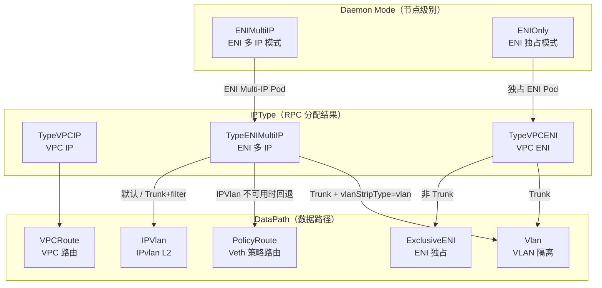
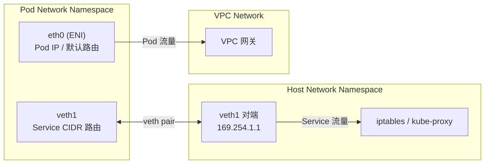
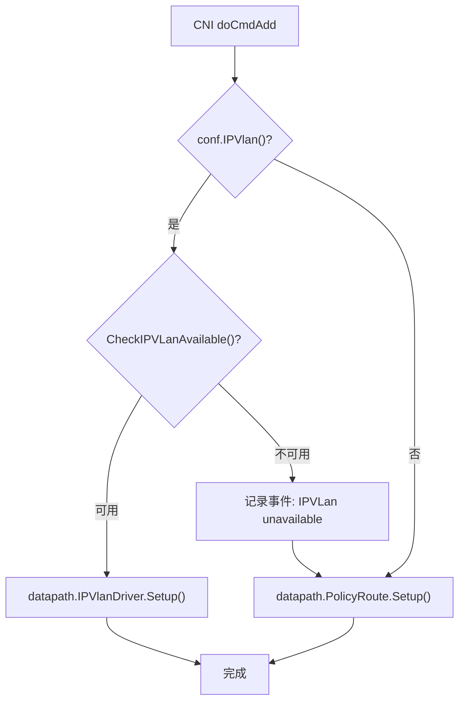
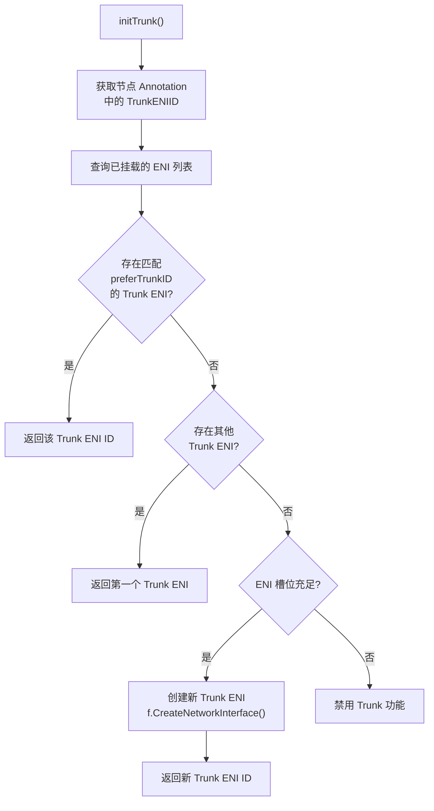
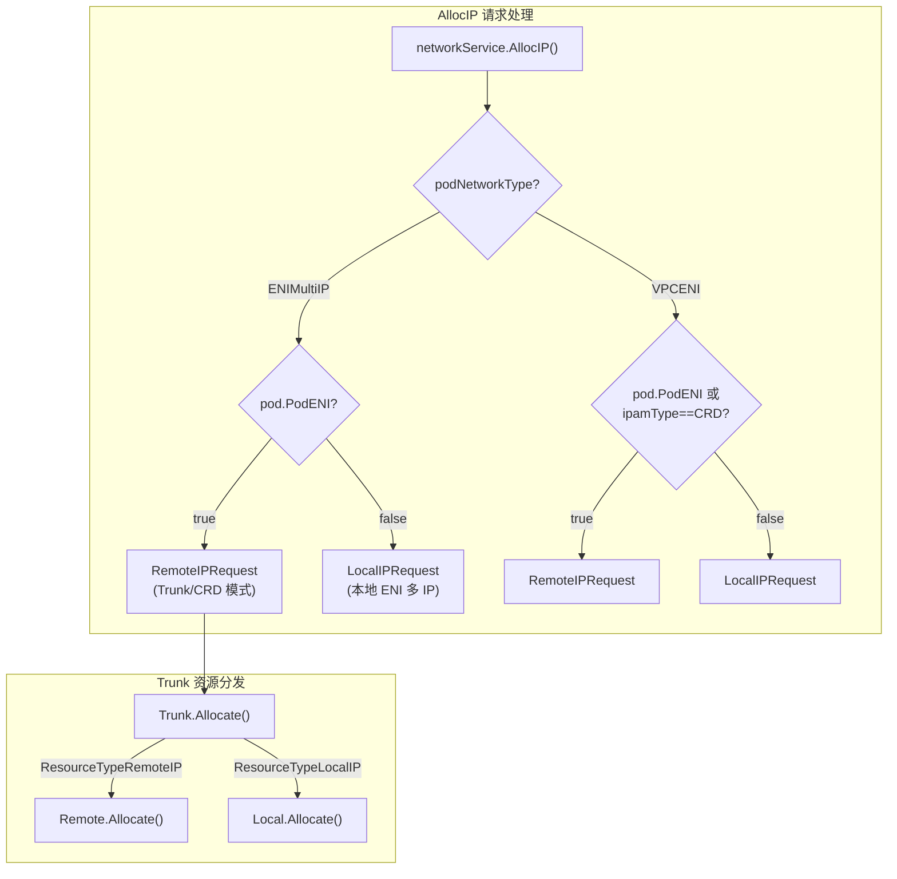

Terway 作为阿里云 VPC 网络的 CNI 插件，提供了多种网络连接模式以适配不同场景的性能与功能需求。本文将系统性地解析 Terway 支持的四种核心网络模式——**VPC 路由模式、ENI 独占模式、ENI 多 IP 模式以及 Trunk 模式**——的架构原理、数据路径、资源模型与适用场景。理解这些模式之间的差异与协作关系，是掌握 Terway 整体架构设计的关键前提。

Sources: [types.go](types/daemon/types.go#L9-L26), [design.md](docs/design.md#L39-L44)

## 模式全景：从 Daemon Mode 到 DataPath 的映射

Terway 的网络模式并非单一维度的概念，而是由两个层次构成：**Daemon 运行模式**（决定资源管理策略）和 **DataPath 数据路径**（决定实际的 Linux 网络设备与路由配置）。Daemon 模式在节点级别设定，而 DataPath 则在每次 CNI 调用时根据 IP 类型、Trunk 配置和 CNI 配置动态选择。



**Daemon 模式**定义在节点启动时确定，当前代码中 `ENIMultiIP` 是主要入口模式，而 `ENIOnly` 模式在检测到节点标签 `ExclusiveENIOnly` 时自动切换。`VPCRoute` 作为遗留数据路径类型存在于枚举中，但在当前 Daemon 构建流程中已不再是独立的 Daemon 模式。

Sources: [types.go](types/daemon/types.go#L22-L26), [k8s.go](pkg/k8s/k8s.go#L549-L558), [cni.go](plugin/terway/cni.go#L509-L526)

## VPC 路由模式（VPCRoute）

### 架构原理

VPC 路由模式是 Terway 最早支持的网络模式之一。其核心思想是使用独立于宿主机 VPC 网段的 Overlay 网段为 Pod 分配 IP 地址，通过阿里云 VPC 自定义路由表将 Pod 网段流量转发到对应节点。

在该模式下，集群拥有一个独立的 Pod CIDR（例如 `192.168.0.0/16`），`kube-controller-manager` 为每个节点分配不同的 PodCidr 子段。Terway 从子段中为容器分配地址，`cloud-controller-manager` 配置 VPC 路由规则将各节点的 PodCidr 转发到对应节点。

### 数据路径特征

Pod 与宿主机通过 **Linux veth pair** 设备联通。Pod 内的 `default` 路由指向 Pod 内的 veth 端，所有流量经过宿主机端的 veth 设备进入宿主机 `network namespace`，再通过宿主机路由转发至主网卡，最终进入 VPC 网络。在宿主机 `network namespace` 转发过程中，流量会经过 `iptables` 和 `tc` 规则实现负载均衡、流量控制与地址转换。

**VPCRoute 的 DataPath 枚举值为 `VPCRoute`（`iota = 0`）**，在 CNI 侧当 `IPType == TypeVPCIP` 时选择此路径。其容器 IP 来源不是弹性网卡的辅助 IP，而是从节点 PodCidr 子段分配的地址。

### 优劣势分析

| 维度 | 评估 |
|------|------|
| **性能** | 较低。流量经过 veth pair 和宿主机协议栈，存在额外的内核转发开销 |
| **网络规模** | 受 VPC 路由表条目限制（默认 48 条），集群规模受限 |
| **兼容性** | 最高。无内核版本要求，支持所有 ECS 实例类型 |
| **NetworkPolicy** | 集成 Felix（Calico）实现 |
| **Pod 网段** | 独立于 VPC 网段，需要额外规划 |

Sources: [design.md](docs/design.md#L46-L56), [types.go](plugin/driver/types/types.go#L83-L89), [cni.go](plugin/terway/cni.go#L511-L512)

## ENI 独占模式（ExclusiveENI）

### 架构原理

ENI 独占模式下，每个 Pod 独占一张阿里云**弹性网卡（ENI）**。Terway 从 VPC 网络中创建弹性网卡并绑定到节点上，然后将物理网卡直接移入 Pod 的 `network namespace`。Pod 的网段与宿主机网段一致，Pod 可通过弹性网卡直接与 VPC 内资源通信。

**该模式通过 `ModeENIOnly`（`"ENIOnly"`）Daemon 模式触发**。在代码中，当 `ENIMultiIP` 模式启动时检测到节点标签 `ExclusiveENIOnly`，会自动切换至 `ENIOnly` 模式并使用 CRD IPAM。

### 数据路径特征

`ExclusiveENI` 数据路径的核心操作是将 ENI 设备（netlink Link）直接移入容器的 `network namespace`，配置 IP 地址与默认路由指向 ENI 网关。此外，为了保留 Pod 访问 Service（ClusterIP）时经过宿主机 `iptables` 规则的能力，会额外创建一对 **veth pair**（`veth1`），将 Service CIDR 路由指向该 veth 设备，打通 Pod 与宿主机网络栈。

关键配置逻辑：容器内主网卡为 ENI（默认路由指向 ENI 网关），辅助 veth 设备 `veth1` 用于 Service CIDR 流量回宿主机。宿主机侧的 `veth1` 对端配置 `169.254.1.1` 链路地址，并设置静态 ARP 条目指向容器端 veth 的 MAC 地址。



### 资源限制与调度感知

弹性网卡数量受 ECS 实例规格配额限制。Terway 通过 **DevicePlugin** 机制向 Kubernetes 上报节点可分配的 ENI 数量，Pod 通过声明 `aliyun/eni` 扩展资源来请求独占 ENI，调度器据此感知配额避免过度调度。

Sources: [types.go](types/daemon/types.go#L23-L26), [k8s.go](pkg/k8s/k8s.go#L150-L155), [exclusive_eni_linux.go](plugin/datapath/exclusive_eni_linux.go#L23-L27), [design.md](docs/design.md#L57-L65), [daemon.go](daemon/daemon.go#L930-L948)

## ENI 多 IP 模式（ENIMultiIP）

### 架构原理

**ENI 多 IP 模式是 Terway 的核心模式**，也是当前代码中唯一通过 `InitService` 直接支持的 Daemon 模式。该模式利用阿里云弹性网卡支持配置多个辅助 VPC IP 的能力，将辅助 IP 分配给 Pod，从而大幅提升单节点的 Pod 部署密度。

单张 ENI 根据实例规格可分配 6~20 个辅助 IP，结合多张辅助 ENI，单个节点的 Pod 密度可达上百个。Pod 的 IP 与宿主机属于同一 VPC 网段，无需额外路由配置即可与 VPC 内资源直接通信。

### 两种数据路径：Veth 策略路由与 IPvlan L2

ENI 多 IP 模式支持两种数据路径实现，通过 CNI 配置中的 `eniip_virtual_type` 字段选择：

**策略路由（PolicyRoute）** 是兼容性最好的实现。Pod 与宿主机通过 **veth pair** 连通，Pod 内的 IP 为 ENI 辅助 IP。宿主机侧需要配置**策略路由规则**，确保来自辅助 IP 的流量经过对应的弹性网卡发出，而非默认路由（主网卡）。这解决了"辅助 IP 流量必须走对应 ENI"的 ARP 与路由匹配问题。

**IPvlan L2（IPVlan）** 是性能更优的实现。利用 Linux 4.2+ 内核的 IPvlan 虚拟网络驱动，在弹性网卡上创建 IPvlan 子设备，每个子设备使用独立的辅助 IP。IPvlan 子设备与父设备共享 MAC 地址，在 L2 层面直接收发报文，避免了 veth pair 带来的内核协议栈穿越开销。

**关键代码路径**：CNI Binary 在 `doCmdAdd` 中检查 `conf.IPVlan()` 配置和内核版本，若 IPvlan 可用则使用 `IPvlanDriver`，否则通过 `fallthrough` 降级到 `PolicyRoute`。这一降级机制保证了在 CentOS 7.x（内核 3.10）等旧系统上的兼容性。



### 资源池化与水位控制

ENI 多 IP 模式的资源管理采用**池化策略**。`PoolConfig` 定义了 `MaxPoolSize`（最大池容量）和 `MinPoolSize`（最小池容量）两个水位线。资源池在低于最小水位时自动补充 ENI/IP 资源，高于最大水位时释放多余资源。这一机制避免了 Pod 创建/销毁时的 API 调用延迟。

容量计算公式为 `capacity = maxENI × ipPerENI`，其中 `maxENI` 由实例规格的 ENI 配额和 `EniCapRatio`/`EniCapShift` 参数调整。

Sources: [types.go](types/daemon/types.go#L22-L26), [design.md](docs/design.md#L67-L93), [cni_linux.go](plugin/terway/cni_linux.go#L199-L239), [config.go](daemon/config.go#L73-L161), [builder.go](daemon/builder.go#L73-L81)

## Trunk 模式

### 架构原理

Trunk 模式是 ENI 多 IP 模式的增强扩展，基于 ECS 的 **ENI Trunk 能力**构建。Trunk ENI 是一张具备 VLAN Trunk 功能的特殊弹性网卡，可以承载多个 Member ENI（成员弹性网卡），每个 Member ENI 通过 VLAN ID 进行流量隔离。

Trunk 模式与 ENI 多 IP 模式**互不影响，不占用 ENI 多 IP 的配额**。被 PodNetworking CRD 匹配的 Pod 使用 Trunk 模式（通过 Remote IP 分配），未被匹配的 Pod 继续使用本地 ENI 多 IP 模式。

### Trunk ENI 初始化流程

Trunk ENI 的初始化在 Daemon 启动阶段完成，`initTrunk` 函数的优先级为：**（1）从节点 Annotation 恢复已知 Trunk ENI → （2）从已挂载的 ENI 中筛选 Trunk 类型 → （3）创建新的 Trunk ENI**。如果节点上 ENI 槽位不足，Trunk 功能会被自动禁用。



初始化成功后，Trunk ENI 的 ID 被记录到节点 Annotation `TrunkOn` 中，同时 Member ENI 的最大数量（`MaxMemberENI`）也被写入节点 Annotation，供 DevicePlugin 上报和调度感知。

### Trunk 数据路径：VLAN 隔离

Trunk 模式的数据路径为 **VLAN** 类型。在 CNI 侧，`getDatePath` 函数根据 `trunk=true` 和 `vlanStripType` 配置决定使用 `Vlan` DataPath。其核心操作是在 Trunk ENI 上创建 VLAN 子设备，将 VLAN ID 对应的 Member ENI 流量隔离到独立的虚拟接口。

`Vlan` 数据路径的 `Setup` 流程：（1）获取 Trunk ENI 的 netlink Link 对象并设置 MTU；（2）创建 VLAN 虚拟设备，绑定 Master 为 Trunk ENI、VID 为 Pod 对应的 VLAN ID；（3）将 VLAN 设备移入容器 `network namespace` 并配置 IP 地址、路由和策略路由规则。

Sources: [trunk.go](pkg/eni/trunk.go#L16-L71), [terway-trunk.md](docs/terway-trunk.md#L1-L50), [daemon.go](daemon/daemon.go#L871-L928), [vlan_linux.go](plugin/datapath/vlan_linux.go#L151-L200), [cni.go](plugin/terway/cni.go#L509-L526), [builder.go](daemon/builder.go#L299-L310)

### Trunk 模式的资源分配模型

Trunk 模式引入了 **Local IP 与 Remote IP** 的双层资源分配架构。`Trunk` 结构体同时持有 `Local`（本地 ENI IP 管理）和 `Remote`（远端 ENI IP 管理，通过 CRD 控制器协调）两个资源管理器。当 `ResourceType` 为 `ResourceTypeLocalIP` 时委托给 `Local`，为 `ResourceTypeRemoteIP` 时委托给 `Remote`。

在 Daemon 的 `AllocIP` 处理逻辑中，Pod 的网络类型由 `podNetworkType()` 确定，而是否使用 Trunk 模式则由 Pod Annotation `PodENI` 决定。当 `pod.PodENI == true` 时，使用 `RemoteIPRequest`（Trunk 模式），否则使用 `LocalIPRequest`（普通 ENI 多 IP 模式）。



### PodNetworking CRD：网络平面配置

Trunk 模式通过 `PodNetworking` 自定义资源描述网络平面配置，支持独立的 vSwitch、安全组和 IP 分配策略。一个 `PodNetworking` 通过标签选择器（`podSelector` 和 `namespaceSelector`）匹配 Pod，被匹配的 Pod 使用 Trunk 模式。

`PodNetworking` 的核心配置项包括：

| 配置项 | 说明 |
|--------|------|
| `allocationType.type` | `Elastic`（弹性，Pod 删除后释放）或 `Fixed`（固定 IP，仅对 StatefulSet 生效） |
| `allocationType.releaseStrategy` | IP 回收策略，`TTL` 表示延迟回收 |
| `allocationType.releaseAfter` | 延迟回收时间，最小 5 分钟 |
| `selector.podSelector` | 匹配 Pod 的标签 |
| `selector.namespaceSelector` | 匹配 Namespace 的标签 |
| `vSwitchOptions` | Pod 使用的 vSwitch 列表 |
| `securityGroupIDs` | 安全组 ID 列表（≤5 个） |

每个 Trunk 模式的 Pod 都会创建一个同名的 `PodENI` CRD 资源，记录其使用的 ENI ID、MAC、Zone、IP 分配策略等信息。

Sources: [trunk.go](pkg/eni/trunk.go#L39-L59), [daemon.go](daemon/daemon.go#L186-L225), [terway-trunk.md](docs/terway-trunk.md#L84-L131), [builder.go](daemon/builder.go#L370-L405)

## 四种模式对比总览

| 特性维度 | VPC 路由 | ENI 独占 | ENI 多 IP（PolicyRoute） | ENI 多 IP（IPvlan） | Trunk |
|----------|----------|----------|--------------------------|---------------------|-------|
| **Daemon 模式** | — | ENIOnly | ENIMultiIP | ENIMultiIP | ENIMultiIP |
| **DataPath** | VPCRoute | ExclusiveENI | PolicyRoute | IPVlan | Vlan |
| **Pod 网段** | 独立 PodCidr | VPC 网段 | VPC 网段 | VPC 网段 | VPC 网段 |
| **IP 来源** | 节点子段分配 | 独占 ENI 主 IP | ENI 辅助 IP | ENI 辅助 IP | Member ENI IP |
| **连通设备** | veth pair | ENI + veth pair | veth pair + 策略路由 | IPvlan 子设备 | VLAN 子设备 |
| **Pod 密度** | 高（受路由表限制） | 低（受 ENI 数量限制） | 高 | 高 | 高 |
| **网络性能** | 低（宿主机转发） | 高（直通 VPC） | 中 | 高 | 高 |
| **内核要求** | 无特殊要求 | 无特殊要求 | 无特殊要求 | ≥ 4.2 | 无特殊要求 |
| **独立安全组** | 不支持 | 不支持 | 不支持 | 不支持 | 支持 |
| **独立 vSwitch** | 不支持 | 不支持 | 不支持 | 不支持 | 支持 |
| **固定 IP** | 不支持 | 不支持 | 不支持 | 不支持 | 支持 |
| **NetworkPolicy** | Felix | Felix | Felix | Cilium | Cilium/Felix |

Sources: [design.md](docs/design.md#L114-L117), [types.go](plugin/driver/types/types.go#L80-L89), [cni.go](plugin/terway/cni.go#L509-L526)

## 模式选择与调度机制

### Daemon 模式确定

节点级别的网络模式在 Daemon 启动时确定。`NetworkServiceBuilder` 按以下步骤初始化：

1. **`WithDaemonMode()`** 设置初始模式为 `ENIMultiIP`
2. **`InitService()`** 校验 Daemon 模式，当前仅 `ENIMultiIP` 被直接支持
3. **`InitK8S()`** 初始化 Kubernetes 客户端时检测节点标签，若发现 `ExclusiveENIOnly` 标签，自动切换为 `ENIOnly` 模式并设置 `ipamType = CRD`

### Pod 级别的路径选择

每个 Pod 的 DataPath 在 CNI 调用时动态确定。`getDatePath` 函数是核心决策点，其逻辑为：

```
TypeVPCIP       → VPCRoute
TypeVPCENI      → Trunk ? Vlan : ExclusiveENI
TypeENIMultiIP  → Trunk && VlanStripTypeVlan ? Vlan : IPVlan
```

在 CNI Binary 的 `doCmdAdd` 中，IPvlan 路径还有额外的可用性检查。若内核不支持 IPvlan，会通过 `fallthrough` 降级到 PolicyRoute，并记录 `VirtualModeChanged` 事件通知用户。

### IPAM 类型影响

`IPAMType` 配置影响资源分配方式。当设置为 `"crd"` 时，Pod 的 IP 分配通过 CRD 控制器（terway-controlplane）协调，而非本地 ENI 管理器。`ENIOnly` 模式和 Trunk 模式下的 Remote IP 分配都依赖 CRD IPAM。当设置为 `"preferCRD"` 时，优先使用 CRD IPAM，不可用时回退到本地管理。

Sources: [builder.go](daemon/builder.go#L60-L136), [cni.go](plugin/terway/cni.go#L509-L526), [cni_linux.go](plugin/terway/cni_linux.go#L199-L228), [daemon.go](daemon/daemon.go#L186-L225)

## 延伸阅读

- 要了解各 DataPath 驱动层（Veth、IPvlan、VLAN、NIC、VF）的具体实现细节，请参阅 [数据路径驱动层：Veth、IPVlan、VLAN、NIC 与 VF 驱动实现](7-shu-ju-lu-jing-qu-dong-ceng-veth-ipvlan-vlan-nic-yu-vf-qu-dong-shi-xian)。
- 要理解策略路由如何确保辅助 IP 流量正确走对应 ENI，请参阅 [策略路由与网络连通性：Pod 间、Pod 与节点、跨节点通信原理](8-ce-lue-lu-you-yu-wang-luo-lian-tong-xing-pod-jian-pod-yu-jie-dian-kua-jie-dian-tong-xin-yuan-li)。
- 要深入 ENI 资源池化管理与水位控制机制，请参阅 [ENI 资源管理器：IP 池化、水位控制与资源回收机制](9-eni-zi-yuan-guan-li-qi-ip-chi-hua-shui-wei-kong-zhi-yu-zi-yuan-hui-shou-ji-zhi)。
- 要了解 Trunk 模式下安全组的 Pod 维度配置，请参阅 [安全组与 Trunk 模式：Pod 维度的安全组与 vSwitch 配置](17-an-quan-zu-yu-trunk-mo-shi-pod-wei-du-de-an-quan-zu-yu-vswitch-pei-zhi)。