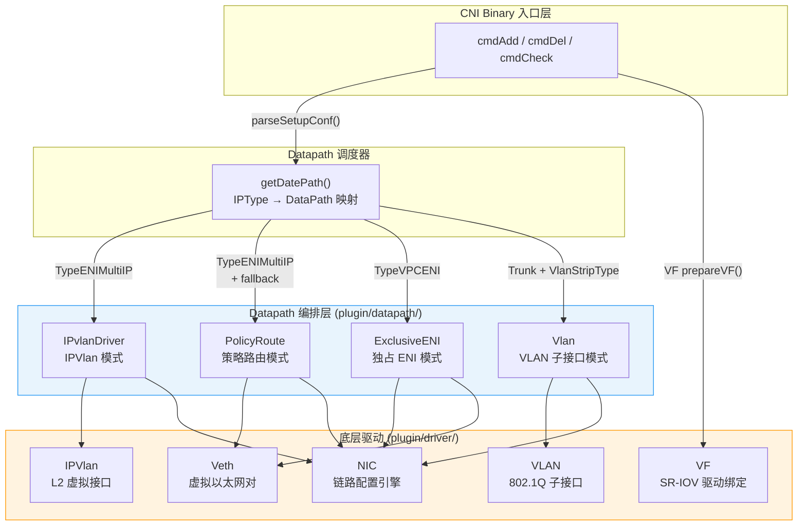
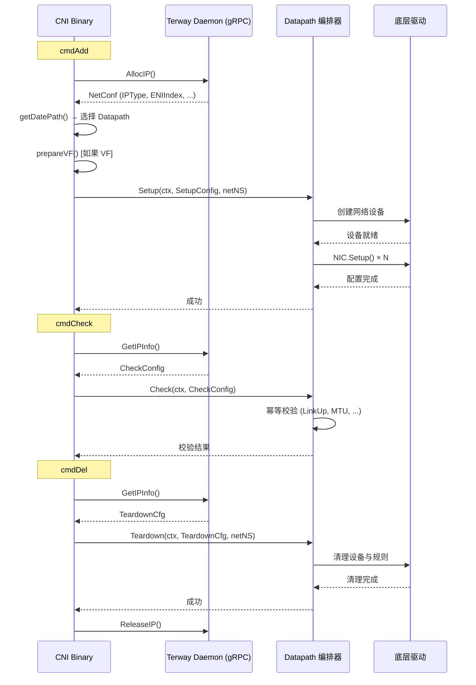

Terway 的数据路径（Datapath）层是网络配置最终落地的核心引擎——它负责将高层网络模式（VPC、ENI、ENI 多 IP、Trunk）翻译为具体的 Linux 内核网络设备操作。整个数据路径采用**两层抽象架构**：底层驱动（`plugin/driver/`）封装单一网络设备的创建与配置，上层 Datapath 编排器（`plugin/datapath/`）协调多个驱动的协作，完成完整的 Pod 网络拓扑构建。本文将深入每一层的实现原理、设备拓扑、流量路径与策略路由规则，揭示 Terway 如何在不同网络模式下精确操控内核网络栈。

Sources: [types.go](plugin/driver/types/types.go#L80-L89), [cni.go](plugin/terway/cni.go#L509-L526)

## 整体架构：两层驱动模型

Terway 的数据路径实现遵循清晰的分层原则。底层驱动包（`plugin/driver/`）提供五种原子化设备操作能力——**Veth** 负责虚拟以太网对的创建、**IPVlan** 负责 L2 模式虚拟接口的挂载、**VLAN** 负责 802.1Q 子接口的建立、**NIC** 负责通用链路属性（地址、路由、规则、邻居表、sysctl）的声明式配置、**VF** 负责 SR-IOV 虚拟功能的驱动绑定。上层 Datapath 包（`plugin/datapath/`）则包含四个编排器——**PolicyRoute**（策略路由模式）、**IPvlanDriver**（IPVlan 模式）、**ExclusiveENI**（独占 ENI 模式）、**Vlan**（VLAN 模式），每个编排器在 `Setup` 阶段按序调用底层驱动，在 `Teardown` 阶段逆向清理，在 `Check` 阶段执行幂等性校验。

**Datapath 调度规则**由 `getDatePath()` 函数实现，它根据 RPC 返回的 IP 类型（`IPType`）、CNI 配置中的 `VlanStripType` 以及是否启用 Trunk ENI 三个维度决定使用哪个 Datapath 编排器。关键调度逻辑如下：`TypeVPCIP` 映射到 VPC 路由模式（不在本文范围），`TypeVPCENI` 在 Trunk 启用时映射到 VLAN 模式否则映射到独占 ENI 模式，`TypeENIMultiIP` 在 Trunk 且 `VlanStripType=Vlan` 时映射到 VLAN 模式否则映射到 IPVlan 模式。值得注意的是，当配置了 IPVlan 但内核版本不满足要求时，会通过 `fallthrough` 降级到 PolicyRoute 模式。

Sources: [cni_linux.go](plugin/terway/cni_linux.go#L199-L266), [cni.go](plugin/terway/cni.go#L509-L526)

## 底层驱动详解

### Veth 驱动：虚拟以太网对

Veth 驱动是 Terway 数据路径中最基础的组件，负责创建一对虚拟以太网接口（veth pair）。其实现极其简洁——`Setup()` 函数接收 `Veth` 配置结构体（包含容器侧接口名、主机侧接口名、MAC 地址和 MTU），执行三个步骤：首先检查主机侧 peer 是否已存在并清理旧链路，然后通过 `netlink.Veth` 结构体创建新的 veth 对（容器端自动生成随机名称并直接放入目标 network namespace），最后在容器 network namespace 内将随机接口名重命名为期望的容器接口名。这种"先创建后重命名"的设计保证了在并发场景下不会因接口名冲突而失败。

**设备拓扑**：主机侧接口（如 `cali+SHA1`）留在主机网络命名空间中，容器侧接口（如 `eth0`）被直接放入容器的 network namespace。两端通过内核 veth 机制实现双向数据转发。

Sources: [veth.go](plugin/driver/veth/veth.go#L14-L62), [veth.go](pkg/link/veth.go#L11-L23)

### IPVlan 驱动：L2 模式虚拟接口

IPVlan 驱动在父接口（ENI）上创建 IPVlan L2 模式的虚拟子接口。与 Veth 不同，IPVlan 子接口共享父接口的 MAC 地址但拥有独立的 IP 地址栈。`Setup()` 函数的核心流程为：定位父接口 → 清理同名旧链路 → 创建 `netlink.IPVlan` 设备（模式固定为 `IPVLAN_MODE_L2`）并将其直接放入容器 network namespace → 在容器命名空间内重命名为期望接口名。IPVlan L2 模式的关键特性是子接口在二层完全独立，可以进行独立的 ARP 响应和 IP 配置，但物理收发仍由父接口完成，因此性能开销极低。

**内核版本要求**：IPVlan 模式需要 Linux 内核 ≥ 4.19，Terway 通过 `CheckIPVLanAvailable()` 函数在运行时检测内核版本，不满足时自动降级到 Veth + PolicyRoute 模式。

Sources: [ipvlan.go](plugin/driver/ipvlan/ipvlan.go#L12-L60), [ipvlan_linux.go](plugin/datapath/ipvlan_linux.go#L25-L34)

### VLAN 驱动：802.1Q 子接口

VLAN 驱动在主接口（Trunk ENI）上创建带 VLAN Tag 的 802.1Q 子接口。`Setup()` 函数接收 `Vlan` 配置（包含主接口名、VLAN ID 和 MTU），构建子接口名格式为 `<master>.<vid>`（如 `eth1.100`），若名称超过 15 字符限制则截取末尾 15 字符。创建过程与 IPVlan 类似：定位主接口 → 清理旧子接口 → 通过 `netlink.Vlan` 结构体创建 VLAN 设备（设置 `VlanId` 和 `ParentIndex`）并放入容器命名空间 → 在容器内重命名为容器接口名。

**关键实现细节**：VLAN 子接口通过 `ParentIndex` 关联到主接口，内核自动在收发方向进行 VLAN Tag 的添加和剥离。在 Trunk 模式下，阿里云的 ENI Trunk 功能允许一个 ENI 同时承载多个 VLAN 的流量，VLAN 子接口为每个 Pod 提供隔离的二层域。

Sources: [vlan.go](plugin/driver/vlan/vlan.go#L29-L80)

### NIC 驱动：通用链路配置引擎

NIC 驱动是所有 Datapath 编排器的共享基础设施，提供声明式的链路配置能力。它不创建网络设备，而是对已存在的链路执行**幂等配置**——即只在实际状态与期望状态不一致时才执行变更。`Setup()` 函数按序执行七个阶段的配置：

1. **接口名设置**（`EnsureLinkName`）：若 `IfName` 非空且当前名称不匹配，则重命名
2. **MTU 设置**（`EnsureLinkMTU`）：若 MTU 值不一致则更新
3. **Sysctl 配置**：遍历键值对确保 sysctl 参数
4. **地址配置**（`EnsureAddr`）：确保每个协议族仅有一个全局单播地址，移除多余地址
5. **链路启用**（`EnsureLinkUp`）：设置接口为 UP 状态
6. **邻居表配置**（`EnsureNeigh`）：添加静态 ARP/NDISC 条目
7. **路由配置**（`EnsureRoute`）：确保路由条目存在
8. **策略路由规则**（`EnsureIPRule`）：确保 ip rule 条目存在
9. **VLAN 剥离**（`StripVlan`）：若启用，在接口上添加 TC ingress filter 自动剥离 VLAN Tag

`Conf` 结构体是 NIC 驱动的核心数据模型，包含接口名、MTU、地址列表、路由列表、策略路由规则列表、邻居表条目列表、sysctl 配置以及是否剥离 VLAN 标志。每个 Datapath 编排器通过构造不同的 `Conf` 来表达其网络拓扑需求。

Sources: [nic.go](plugin/driver/nic/nic.go#L30-L113)

### VF 驱动：SR-IOV 虚拟功能绑定

VF 驱动专门用于 eRDMA 场景，负责将 SR-IOV Virtual Function（VF）绑定到 `virtio-pci` 驱动。其工作流程分为三步：

1. **BDF 查询**（`GetBDFbyVFID`）：从两个可能的配置文件路径（`/var/rdma/eni_topo` 或 `/var/run/hc-eni-host/vf-topo-vpc`）中读取 JSON 格式的 VF-BDF 映射，根据 VF ID 找到对应的 PCI Bus-Device-Function 地址
2. **驱动绑定**（`SetupDriver`）：首先检查 VF 是否已绑定到 `virtio-pci`；若未绑定，则检查 PF 的 `sriov_drivers_autoprobe` 配置，若自动探测被禁用则先设置 `driver_override`，最后将 VF BDF 写入 `/sys/bus/pci/drivers/virtio-pci/bind` 完成绑定
3. **接口索引获取**（`SetupDriverAndGetNetInterface`）：绑定完成后通过 sysfs 路径 `/sys/bus/pci/drivers/virtio-pci/<bdf>/virtio*/net/*/ifindex` 获取网络接口索引

VF 驱动在 CNI 的 `prepareVF()` 函数中被调用——当 RPC 返回的 ENI 信息包含 `VfId` 字段时，CNI Binary 会先调用 VF 驱动完成设备绑定和 MAC 地址设置，然后将获得的接口索引传递给后续的 Datapath 编排器。

Sources: [vf.go](plugin/driver/vf/vf.go#L25-L197), [cni_linux.go](plugin/terway/cni_linux.go#L469-L481)

## Datapath 编排器详解

### PolicyRoute 模式：Veth + 策略路由

PolicyRoute 是 Terway ENI 多 IP 模式的**默认数据路径**（也是 IPVlan 不可用时的降级方案）。其核心思想是：在主机与容器之间建立 Veth 对，容器使用 ENI 的辅助 IP 地址，通过 Linux 策略路由规则将容器流量引导到正确的 ENI 上。

**Setup 流程**按序执行以下操作：

| 步骤 | 操作 | 命名空间 | 说明 |
|------|------|----------|------|
| 1 | 创建 Veth 对 | 主机 → 容器 | 主机端 `cali+SHA1`，容器端 `eth0` |
| 2 | 配置容器接口 | 容器 | 设置 IP 地址（掩码 /32）、默认路由（网关 `169.254.1.1`）、静态 ARP、ExtraRoutes |
| 3 | 配置 ENI | 主机 | 设置到容器 IP 的直连路由、策略路由规则、ENI 地址 |
| 4 | 配置主机侧 Veth | 主机 | 设置到容器 IP 的直连路由、策略路由规则（src 匹配 → ENI 路由表） |
| 5 | 带宽限速 | 主机 | 非 EDT 模式下在主机侧 Veth 上配置 TC ingress 限速 |

**策略路由规则**是 PolicyRoute 模式的核心机制。Terway 为每个 ENI 分配独立的路由表（表号 = `1000 + link_index`），通过两条 ip rule 实现：

- **fromContainer（优先级 2048）**：`from <容器IP> lookup <ENI路由表>` —— 容器出站流量通过 ENI 专属路由表发送
- **toContainer（优先级 512）**：`to <容器IP> lookup main` —— 到容器的入站流量查找主路由表

容器内部使用 `169.254.1.1` 作为默认网关（Link-Local 地址），这是一个虚拟网关——实际上不存在这个 IP 的真实设备，容器通过静态 ARP 将其映射到主机侧 Veth 的 MAC 地址。主机侧 Veth 拥有到容器 IP 的 /32 直连路由，实现主机到容器的双向可达。对于 eRDMA 设备，Veth 对的容器端还会被设置为 ENI 的 MAC 地址，并配置 SMC-R（Shared Memory Communications over RDMA）的 PNET 表关联。

Sources: [policy_router_linux.go](plugin/datapath/policy_router_linux.go#L20-L399), [consts_linux.go](plugin/datapath/consts_linux.go#L11-L29)

### IPvlanDriver 模式：IPVlan L2 + 初始化命名空间

IPvlanDriver 是 ENI 多 IP 模式的高性能数据路径。与 PolicyRoute 不同，它不需要 Veth 对和策略路由规则——容器直接通过 IPVlan 子接口连接到 ENI，所有流量在二层直接由父接口处理，避免了 Veth pair 带来的额外内核转发开销。

**Setup 流程**按序执行：

| 步骤 | 操作 | 命名空间 | 说明 |
|------|------|----------|------|
| 1 | 配置 ENI | 主机 | 设置 MTU、IPv6 sysctl；Trunk 模式下添加 VLAN Tag TC filter |
| 2 | 创建 IPVlan 子接口 | 主机 → 容器 | 在 ENI 上创建 L2 模式 IPVlan，直接放入容器 netns |
| 3 | 配置容器接口 | 容器 | 设置 IP 地址、默认路由（网关为 ENI 网关）、静态邻居、带宽限速 |
| 4 | 配置初始化命名空间 | 主机 | 创建 `ipvl_<index>` 辅助接口、设置到容器 IP 的路由、TC redirect filter |

**初始化命名空间**（Init Namespace）是 IPvlanDriver 最复杂的设计。由于 IPVlan 子接口与父接口共享二层，主机网络栈无法直接与容器通信（因为主机发出的 ARP 请求会被 IPVlan 子接口拦截）。为解决这个问题，IPvlanDriver 在 ENI 上额外创建一个 `ipvl_<index>` 辅助 IPVlan 接口留在主机命名空间，配置主机 IP 地址和到容器 IP 的直连路由。同时，通过 TC clsact qdisc 上的 U32 filter 实现**流量重定向**——将目的地址匹配 Service CIDR 或 HostStackCIDRs 的流量从 ENI 重定向到辅助接口，使得 Service 访问和主机网络栈通信成为可能。

**Trunk VLAN 剥离**：在 Trunk 模式下，IPvlanDriver 支持两种 VLAN 处理方式。当 `VlanStripType=filter` 时，通过 TC ingress filter 在 ENI 上自动剥离 VLAN Tag（`TCA_VLAN_KEY_POP`），并通过 TC egress filter 为容器出站流量自动添加 VLAN Tag（`TCA_VLAN_KEY_PUSH`）。当 `VlanStripType=vlan` 时，直接使用 VLAN 子接口（由 Vlan 编排器处理）。

Sources: [ipvlan_linux.go](plugin/datapath/ipvlan_linux.go#L36-L318), [ipvlan_linux.go](plugin/datapath/ipvlan_linux.go#L420-L533)

### ExclusiveENI 模式：物理 ENI 移入容器

ExclusiveENI 模式用于 ENI 独占场景——将整个物理 ENI 直接移入容器的 network namespace，容器拥有对 ENI 的完全控制权。这是最简单直接的数据路径，但每个 Pod 需要独占一个 ENI，受限于 ECS 实例的 ENI 数量上限。

**Setup 流程**的核心是"**设备迁移**"操作：

| 步骤 | 操作 | 命名空间 | 说明 |
|------|------|----------|------|
| 1 | 获取 ENI | 主机 | 通过 `LinkByIndex` 获取物理 ENI |
| 2 | 设置 ENI down | 主机 | 迁移前必须先将接口设为 down |
| 3 | 临时重命名 | 主机 | 生成随机名称避免命名空间内冲突 |
| 4 | 迁移 netns | 主机 → 容器 | `LinkSetNsFd` 将 ENI 移入容器命名空间 |
| 5 | 配置容器接口 | 容器 | 设置 IP 地址、默认路由（网关为 ENI 网关）、ExtraRoutes、带宽限速 |
| 6 | 创建辅助 Veth | 容器 → 主机 | 仅为 `eth0` 且 `DisableCreatePeer=false` 时创建 |
| 7 | 配置 Veth1 | 容器 | 配置 `169.254.1.1` 相关路由、静态 ARP、ServiceCIDR 路由 |
| 8 | 配置主机侧 Veth | 主机 | 设置到容器 IP 的直连路由 |

**辅助 Veth 对**的设计意图值得特别关注。独占 ENI 模式下，容器通过 ENI 直接访问 VPC 网络，但 **Kubernetes Service（ClusterIP）** 的流量需要通过主机网络栈的 kube-proxy 进行处理。辅助 Veth 对（`veth1` 在容器侧，`cali+SHA1` 在主机侧）提供了这条控制通道——容器内通过 `veth1` 的路由将 ServiceCIDR 流量发送到主机，主机通过 iptables/ipvs 完成 Service 代理。Veth1 的配置包含到 ServiceCIDR 的路由（网关 `169.254.1.1`）和到主机 IP 的 /32 路由，确保容器到主机控制面的可达性。

**Windows 平台适配**：ExclusiveENI 模式在 Windows 上通过 HNS/HCN（Host Networking Service/Host Compute Networking）API 实现，创建透明网络（Transparent Network）并将 ENI 作为端点挂载，同时创建辅助端点处理 Service 流量。

Sources: [exclusive_eni_linux.go](plugin/datapath/exclusive_eni_linux.go#L23-L443), [exclusive_eni_windows.go](plugin/datapath/exclusive_eni_windows.go#L16-L119)

### Vlan 模式：Trunk ENI 上的 VLAN 子接口

Vlan 模式是 Trunk ENI 场景下的专用数据路径。与 IPvlanDriver 不同，Vlan 模式使用真正的 802.1Q VLAN 子接口——每个 Pod 获得独立的 VLAN ID，二层隔离完全由 VLAN 标签实现。

**Setup 流程**简洁明了：

| 步骤 | 操作 | 命名空间 | 说明 |
|------|------|----------|------|
| 1 | 配置 Trunk ENI | 主机 | 设置 MTU、启用链路；配置网络优先级 TC |
| 2 | 创建 VLAN 子接口 | 主机 → 容器 | 在 Trunk ENI 上创建 `eni.<vid>` VLAN 子接口 |
| 3 | 配置容器接口 | 容器 | 设置 IP 地址（保留原始 CIDR 掩码）、默认路由、ExtraRoutes、带宽限速 |

Vlan 模式的容器地址配置使用 `NewIPNet1()` 保留原始 CIDR 掩码（如 `/24`），而不是像 PolicyRoute 模式那样使用 /32 掩码——这是因为 VLAN 子接口在二层直接与网关通信，需要正确的子网掩码进行 ARP 和路由判断。多网卡（MultiNetwork）场景下，Vlan 模式会为每个接口创建独立的路由表（`1000 + link_index`）和对应的策略路由规则（优先级 512），确保多网卡流量正确分流。

Sources: [vlan_linux.go](plugin/datapath/vlan_linux.go#L16-L201)

## 网络工具层：幂等操作与并发安全

底层工具函数（`plugin/driver/utils/`）为所有驱动提供幂等操作保障。**幂等性设计**体现在每个 `Ensure*` 函数都遵循"检查-比较-执行"模式——仅在当前状态与期望状态不一致时才执行变更，并返回 `changed` 布尔值指示是否发生了实际操作。`netlink_linux.go` 封装了所有 netlink 系统调用，每个操作都记录对应的 `ip` 命令日志，便于故障排查。**并发安全**通过文件锁机制（`GrabFileLock`）实现——CNI Binary 在执行 Setup/Teardown/Check 前获取 `/var/run/eni/terway_cni.lock` 文件锁（超时 11 秒），防止同一节点上的并发 CNI 操作产生竞争条件。

**VLAN 标签操作**（`EnsureVlanTag` / `EnsureVlanUntagger`）通过 TC clsact qdisc 上的 U32 filter 实现。`EnsureVlanUntagger` 在 ingress 方向添加 wildcard U32 filter 匹配所有 802.1Q 帧，通过 `TCA_VLAN_KEY_POP` action 剥离 VLAN Tag。`EnsureVlanTag` 在 egress 方向添加基于源 IP 匹配的 U32 filter，通过 `TCA_VLAN_KEY_PUSH` action 为出站流量添加指定 VLAN Tag——这使得 IPVlan 模式下容器流量能够正确携带 Trunk ENI 期望的 VLAN 标签。

Sources: [utils_linux.go](plugin/driver/utils/utils_linux.go#L27-L30), [netlink_linux.go](plugin/driver/utils/netlink_linux.go#L36-L54), [utils.go](plugin/driver/utils/utils.go#L53-L85), [utils_linux.go](plugin/driver/utils/utils_linux.go#L411-L532)

## 五种 Datapath 模式对比

| 维度 | PolicyRoute | IPvlanDriver | ExclusiveENI | Vlan | VPCRoute |
|------|-------------|--------------|--------------|------|----------|
| **网络设备** | Veth pair | IPVlan L2 | 物理 ENI + Veth pair | VLAN 子接口 | 主机路由 |
| **IP 来源** | ENI 辅助 IP | ENI 辅助 IP | ENI 主 IP | ENI 辅助 IP | Pod CIDR |
| **Pod 隔离** | 网络命名空间 | 网络命名空间 | 网络命名空间 | 网络命名空间 + VLAN | 网络命名空间 |
| **二层隔离** | 共享 ENI MAC | 共享 ENI MAC | 独占 ENI MAC | VLAN 标签隔离 | 共享节点 MAC |
| **策略路由** | 必须（per-ENI table） | 不需要 | 不需要 | 可选（多网卡时） | 不需要 |
| **Service 访问** | 主机侧 Veth 转发 | TC redirect 到辅助接口 | 辅助 Veth 对 | 容器直连网关 | 主机路由 |
| **性能开销** | 中（Veth 转发） | 低（共享物理设备） | 最低（独占设备） | 低（硬件 VLAN） | 最低（纯路由） |
| **ENI 利用率** | 高（多 IP 共享） | 高（多 IP 共享） | 低（1 Pod = 1 ENI） | 高（VLAN 复用） | 不使用 ENI |
| **内核要求** | 通用 | ≥ 4.19 | 通用 | 通用 | 通用 |
| **Windows 支持** | 是（policy_router） | 否 | 是（HNS/HCN） | 否 | 否 |

Sources: [types.go](plugin/driver/types/types.go#L80-L89), [getDatePath](plugin/terway/cni.go#L509-L526)

## Datapath 生命周期：Setup → Check → Teardown

每个 Datapath 编排器实现三个生命周期方法，由 CNI Binary 的 `cmdAdd`、`cmdCheck`、`cmdDel` 分别调用。**Setup** 阶段创建完整的网络拓扑，如果中间步骤失败则执行回滚（如 ExclusiveENI 将 ENI 移回主机命名空间）。**Check** 阶段执行轻量级的幂等校验——检查容器接口是否 UP、MTU 是否正确、IPVlan 模式下还检查父接口状态，任何修正操作都会通过 `RecordPodEvent` 记录事件。**Teardown** 阶段清理所有网络资源——删除 Veth/IPVlan/VLAN 设备、移除策略路由规则、清理 TC filter 和优先级标记。

**错误处理与回滚**策略因 Datapath 而异。ExclusiveENI 在 ENI 迁移失败时使用 `defer` 函数将 ENI 移回主机命名空间；PolicyRoute 和 IPvlanDriver 在 CNI 层通过 `defer` 函数调用 `ReleaseIP()` 归还已分配的 IP 地址。文件锁机制确保同一节点的 CNI 操作串行化，避免并发 Setup/Teardown 导致的设备名冲突或路由表不一致。

Sources: [cni_linux.go](plugin/terway/cni_linux.go#L101-L274), [exclusive_eni_linux.go](plugin/datapath/exclusive_eni_linux.go#L338-L370)

## 延伸阅读

- [网络模式全解析：VPC、ENI、ENI 多 IP 与 Trunk 模式](6-wang-luo-mo-shi-quan-jie-xi-vpc-eni-eni-duo-ip-yu-trunk-mo-shi) — 理解各网络模式如何选择 Datapath
- [策略路由与网络连通性：Pod 间、Pod 与节点、跨节点通信原理](8-ce-lue-lu-you-yu-wang-luo-lian-tong-xing-pod-jian-pod-yu-jie-dian-kua-jie-dian-tong-xin-yuan-li) — 深入策略路由规则与流量路径分析
- [Pod 流量控制（QoS）：基于 TC 的带宽限速实现](20-pod-liu-liang-kong-zhi-qos-ji-yu-tc-de-dai-kuan-xian-su-shi-xian) — TC/EDT 带宽控制在 Datapath 中的集成
- [eRDMA 支持与灵骏（EFLO）适配](21-erdma-zhi-chi-yu-ling-jun-eflo-gua-pei) — VF 驱动与 SMC-R 在 eRDMA 场景下的协作