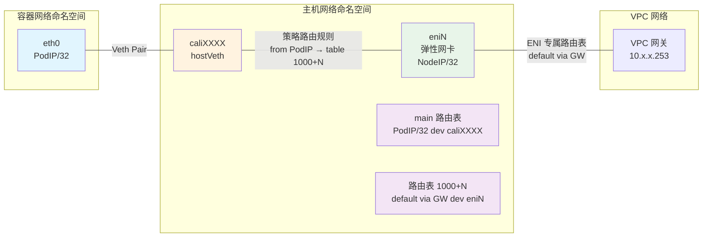
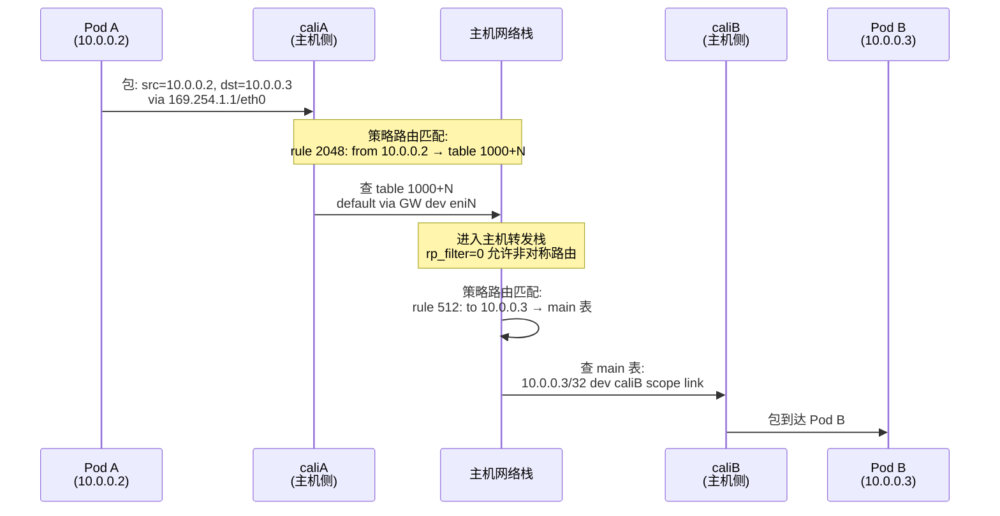
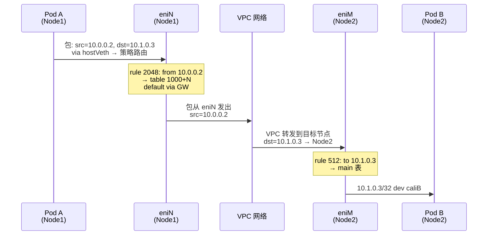
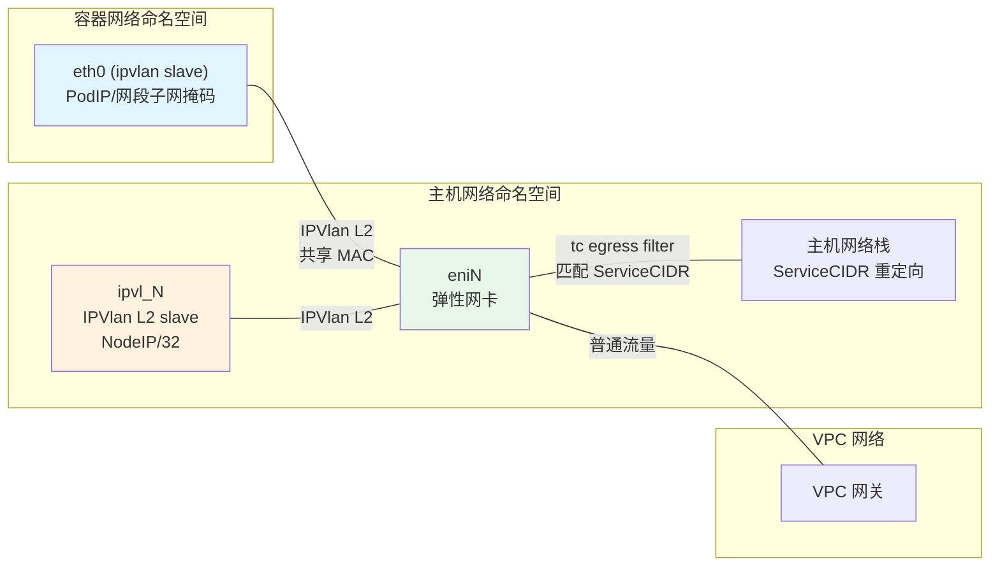
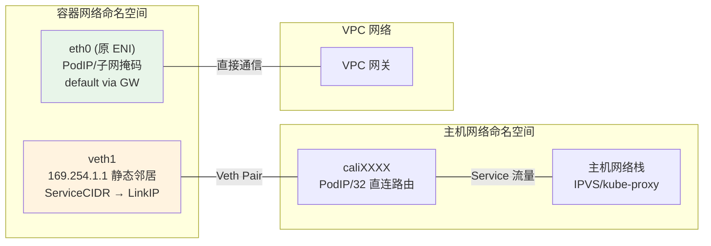
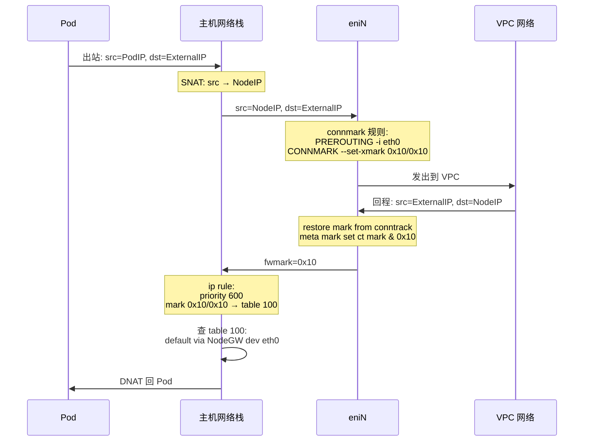

本文深入剖析 Terway CNI 插件中策略路由（Policy Routing）的核心机制与各类通信场景的数据路径。Terway 支持多种网络模式——VPC 路由、ENI 独占、ENI 多 IP（Veth 策略路由 / IPVlan）以及 VLAN/Trunk——每种模式对 Linux 网络栈的编排方式各不相同。理解这些底层机制，是排查 Pod 连通性问题和优化网络性能的基石。

Sources: [design.md](docs/design.md#L37-L86), [types.go](plugin/driver/types/types.go#L80-L89)

## 核心抽象：Linux 策略路由原语

在深入 Terway 的具体实现之前，需要先理解其依赖的三个 Linux 网络原语。Terway 的所有数据路径本质上都是对这些原语的组合编排：

| 原语 | 作用 | Terway 中的用途 |
|------|------|-----------------|
| **ip rule**（策略路由规则） | 根据源/目的地址、出接口、fwmark 等条件选择路由表 | 将 Pod 流量导向特定路由表，实现 ENI 流量隔离 |
| **ip route table**（路由表） | 独立于 main 表的私有路由空间 | 每张 ENI 对应一个独立路由表，承载该 ENI 的默认路由 |
| **netlink Neigh**（静态邻居表） | 绕过 ARP/NDP，直接指定 IP → MAC 映射 | 在容器内设置 `169.254.1.1` → veth 对端 MAC 的静态映射 |

**路由表 ID 生成规则**是 Terway 策略路由的基石。每张 ENI 对应一个独立路由表，其 ID 由 ENI 的 `linkIndex` 决定：`tableID = 1000 + linkIndex`。这一映射关系保证了同一节点上不同 ENI 的路由空间互不冲突。

```
// GetRouteTableID add 1000 to link index to avoid route table conflict
func GetRouteTableID(linkIndex int) int {
    return 1000 + linkIndex
}
```

Sources: [utils_linux.go](plugin/driver/utils/utils_linux.go#L27-L30), [consts_linux.go](plugin/datapath/consts_linux.go#L11-L14)

## 策略路由优先级体系

Terway 定义了两级策略路由优先级常量，构成"入容器"和"出容器"的双向规则对：

```go
const (
    toContainerPriority   = 512   // 目的地址匹配 → 查 main 表
    fromContainerPriority = 2048  // 源地址匹配 → 查 ENI 专属表
)
```

这两条规则的语义如下：

- **优先级 512（toContainer）**：当数据包的**目的地址**是 Pod IP 时，强制查 `main` 路由表。这确保了从节点网络栈发往 Pod 的流量，能通过 main 表中指向 hostVeth 的直连路由到达容器。
- **优先级 2048（fromContainer）**：当数据包的**源地址**是 Pod IP 时，强制查 ENI 对应的**专属路由表**。这确保了从容器发出的流量，经由正确的 ENI 接口离开节点。

```
┌──────────────────────────────────────────────────────────────┐
│                   策略路由规则优先级体系                        │
├──────────────────────────────────────────────────────────────┤
│                                                              │
│  Priority 512:  to PodIP  →  lookup main                     │
│  ──────────────────────────────────────────                  │
│  │ 触发条件: 数据包目的地址 == Pod IP                          │
│  │ 效果: 在 main 表中找到 hostVeth 上的直连路由               │
│  │          PodIP/32 dev caliXXXX scope link                  │
│  └───────────────────────────────────────────                 │
│                                                              │
│  Priority 2048: from PodIP  →  lookup table (1000+ENIIndex)  │
│  ──────────────────────────────────────────                  │
│  │ 触发条件: 数据包源地址 == Pod IP                            │
│  │ 效果: 在 ENI 专属表中找到默认路由                           │
│  │          default via GW dev eniXXX onlink table N          │
│  └───────────────────────────────────────────                 │
│                                                              │
└──────────────────────────────────────────────────────────────┘
```

Sources: [consts_linux.go](plugin/datapath/consts_linux.go#L11-L14), [policy_router_linux.go](plugin/datapath/policy_router_linux.go#L196-L206)

## 数据路径选择：getDatePath 分发逻辑

Terway 根据 IP 类型（`ipType`）和配置参数决定使用哪种数据路径。分发逻辑集中在 `getDatePath` 函数中：

| IP 类型 | Trunk 配置 | VLAN 剥离方式 | 数据路径 |
|---------|-----------|-------------|---------|
| `TypeVPCIP` | — | — | VPC Route（通过 VPC 路由表转发） |
| `TypeVPCENI` | 否 | — | ExclusiveENI（ENI 整卡移入容器） |
| `TypeVPCENI` | 是 | — | VLAN（Trunk ENI + VLAN 子接口） |
| `TypeENIMultiIP` | 否 | — | IPVlan（默认，需内核 ≥ 4.19） |
| `TypeENIMultiIP` | 是 | `vlan` | VLAN |
| `TypeENIMultiIP` | 是 | 其他 | IPVlan（VLAN strip filter 模式） |

值得注意的是，当 IPVlan 模式的内核版本不满足要求（< 4.19）时，CNI 会通过 `fallthrough` 自动降级为 PolicyRoute（Veth 策略路由）模式。

Sources: [cni.go](plugin/terway/cni.go#L509-L526), [cni_linux.go](plugin/terway/cni_linux.go#L199-L266)

## PolicyRoute（Veth 策略路由）模式详解

这是 ENI 多 IP 模式下最经典的数据路径。每个 Pod 通过一对 Veth Pair 连接到主机网络命名空间，依靠策略路由将辅助 IP 的流量导向正确的 ENI。

### 拓扑结构



### 三层配置：容器侧、主机侧、ENI 侧

PolicyRoute 模式的 Setup 过程在三个位置分别配置网络：

**1. 容器侧（generateContCfgForPolicy）**

在容器的 `eth0` 接口上，Terway 配置如下：
- **地址**：PodIP 配置为 `/32`（IPv4）或 `/128`（IPv6）主机路由，避免与同子网其他 IP 冲突
- **默认路由**：`default via 169.254.1.1 dev eth0`，指向 Link-Local 网关地址
- **静态邻居**：`169.254.1.1 → hostVeth 的 MAC 地址`（`NUD_PERMANENT`），绕过 ARP 查询

这里使用的 `169.254.1.1` 是 Terway 定义的一个特殊 Link-Local 地址，它并非真正的网关，而是充当一个"探针"——容器将所有出站流量发往这个地址，而静态邻居表确保流量实际被发送到 hostVeth 对端。

Sources: [policy_router_linux.go](plugin/datapath/policy_router_linux.go#L26-L172), [consts_linux.go](plugin/datapath/consts_linux.go#L17-L29)

**2. 主机侧 Veth（GenerateHostPeerCfgForPolicy）**

在主机的 `caliXXXX` 接口上，Terway 配置两条核心规则：

```go
// 规则 1: 目的地址匹配 → 查 main 表
toContainerRule := &netlink.Rule{
    Dst:       PodIP/32,
    Table:     RT_TABLE_MAIN,     // 254
    Priority:  512,
}

// 规则 2: 源地址匹配 → 查 ENI 专属表
fromContainerRule := &netlink.Rule{
    Src:       PodIP/32,
    Table:     1000 + eniIndex,
    Priority:  2048,
}
```

同时在 hostVeth 上添加一条**直连路由**：`PodIP/32 dev caliXXXX scope link`，这条路由位于 main 表中，被优先级 512 的规则命中。

Sources: [policy_router_linux.go](plugin/datapath/policy_router_linux.go#L174-L246)

**3. ENI 侧（GenerateENICfgForPolicy）**

在弹性网卡 `eniN` 上配置：
- **节点 IP 地址**：将主机的主 IP 以 `/32` 形式绑定到 ENI 上（`HostIPSet`），用于回程流量识别
- **ENI 专属路由表**：`default via <VPC网关> dev eniN table 1000+N onlink`，将所有从该 Pod 发出的流量通过指定 ENI 发出

当 Trunk 模式启用时（`cfg.StripVlan = true`），网关地址会切换为 ENI 级别的网关 `cfg.ENIGatewayIP`，而非 vSwitch 级别的网关。

Sources: [policy_router_linux.go](plugin/datapath/policy_router_linux.go#L248-L303)

### 通信场景详解

#### Pod → 同节点 Pod



**关键路径**：Pod A 的出站流量经策略路由 rule 2048 匹配后查 ENI 专属表，但由于目的地址是同节点的 Pod IP，流量实际进入主机转发栈。转发过程中，rule 512 将流量重新导向 main 表，找到指向 caliB 的直连路由。

**前提条件**：主机网络栈的 `rp_filter` 必须设为 `0`（`/proc/sys/net/ipv4/conf/all/rp_filter`），因为从 caliA 进来的流量源 IP 不在 caliA 的子网范围内，严格反向路径过滤会丢弃这种包。Terway 在 `EnsureHostNsConfig` 中统一设置此参数。

Sources: [utils_linux.go](plugin/driver/utils/utils_linux.go#L32-L44), [policy_router_linux.go](plugin/datapath/policy_router_linux.go#L196-L206)

#### Pod → 跨节点 Pod



跨节点通信依赖阿里云 VPC 网络的转发能力。由于 ENI 多 IP 模式下 Pod 使用的是 VPC 子网的真实 IP 地址，VPC 网络能直接识别并将流量送达目标节点。目标节点上的 rule 512 将入站流量导向 main 表，进而通过 hostVeth 到达 Pod B。

Sources: [design.md](docs/design.md#L78-L84)

#### Pod → 节点（Pod 访问宿主机）

Pod 访问其所在宿主机的 Node IP 时，流量路径为：Pod → hostVeth → 策略路由 rule 2048 → ENI 专属表 → ENI 接口 → VPC → 回到节点。由于 ENI 上绑定了主机的 Node IP（`HostIPSet`），流量通过 ENI 的默认路由发出后，会被 VPC 网络环回到节点本身。

在 **ExclusiveENI** 模式下，这一路径更为明确——容器内会添加一条主机 IP 的路由指向 `veth1` 的 Link-Local 网关，并额外添加 `ServiceCIDR` 路由，使得 Service 流量通过宿主机网络栈处理。

Sources: [exclusive_eni_linux.go](plugin/datapath/exclusive_eni_linux.go#L159-L274)

#### 节点 → Pod

当节点上的进程（如 kubelet、kube-proxy）访问 Pod IP 时，流量路径为：主机进程 → main 路由表 → 查到 `PodIP/32 dev caliXXXX scope link` → 到达容器。这里的 rule 512 确保了即使存在其他策略路由规则，目的地址为 Pod IP 的流量始终查 main 表。

Sources: [policy_router_linux.go](plugin/datapath/policy_router_linux.go#L196-L199)

## IPVlan L2 模式详解

IPVlan 模式是 ENI 多 IP 的另一种数据路径，利用 Linux 内核 4.19+ 的 IPVlan L2 虚拟网络接口，在 ENI 上创建子接口并将辅助 IP 直接绑定到子接口上。

### 拓扑结构



### 关键差异：无策略路由，使用 TC Filter

IPVlan 模式与 PolicyRoute 模式最根本的区别在于：**IPVlan 不使用 ip rule 策略路由**。由于 IPVlan 子接口与父 ENI 共享 MAC 地址，辅助 IP 的流量天然从正确的 ENI 发出，无需策略路由强制引导。

取而代之的是 **TC（Traffic Control）egress filter 机制**，用于将特定 CIDR 的流量重定向到主机网络栈。这在 `setupInitNamespace` 中实现：

```go
func (d *IPvlanDriver) setupInitNamespace(ctx context.Context, parentLink netlink.Link, cfg *types.SetupConfig) error {
    // 创建 ipvl_N slave 接口
    slaveLink, err := d.createSlaveIfNotExist(ctx, parentLink, slaveName, cfg.MTU)
    
    // 配置 slave 的地址和路由（NodeIP → 容器 IP 的直连路由）
    slaveCfg := generateSlaveLinkCfgForIPVlan(cfg, slaveLink)
    nic.Setup(ctx, slaveLink, slaveCfg)
    
    // 在父 ENI 上设置 clsact qdisc
    utils.EnsureClsActQdsic(ctx, parentLink)
    
    // 重定向 ServiceCIDR + HostStackCIDRs 到 slave 接口
    redirectCIDRs := append(cfg.HostStackCIDRs, cfg.ServiceCIDR.IPv4)
    d.setupFilters(ctx, parentLink, redirectCIDRs, slaveLink.Attrs().Index)
}
```

**TC Filter 的工作原理**：在 ENI 的 egress 方向（从 ENI 发出的流量）上安装 U32 过滤器，匹配目标 IP 属于 `ServiceCIDR` 或 `HostStackCIDRs` 的数据包，通过 `mirred redirect` 动作将其重定向到 `ipvl_N` 接口，从而进入主机网络栈处理（如 kube-proxy/IPVS 的 Service 负载均衡）。

过滤器使用 `priority: 40000` 和 `TCA_INGRESS_REDIR` 动作，配合 `TCA_TUNNEL_KEY_UNSET`（清除隧道标记）和 `SkbEditAction`（设置 `PACKET_HOST` 类型），确保重定向后的数据包能被主机网络栈正确接收。

Sources: [ipvlan_linux.go](plugin/datapath/ipvlan_linux.go#L42-L196), [ipvlan_linux.go](plugin/datapath/ipvlan_linux.go#L420-L533), [ipvlan_linux.go](plugin/datapath/ipvlan_linux.go#L576-L707)

### HostStackCIDRs：自定义主机栈路由

用户可通过 CNI 配置的 `host_stack_cidrs` 字段将额外的 CIDR 路由到主机网络栈。典型场景是 **node-local-dns**：本地 DNS 缓存使用 `169.254.0.0/16` 的 Link-Local 地址暴露服务，需要将此网段加入 HostStackCIDRs 才能让 IPVlan 模式的 Pod 访问到。

```json
{
    "eniip_virtual_type": "IPVlan",
    "host_stack_cidrs": ["169.254.0.0/16"]
}
```

Sources: [host-stack-cidrs.md](docs/host-stack-cidrs.md#L1-L10), [types.go](plugin/driver/types/types.go#L24)

## ExclusiveENI（ENI 独占）模式详解

ENI 独占模式是最直接的数据路径——将整张弹性网卡从主机网络命名空间移入容器的网络命名空间，容器直接通过 ENI 与 VPC 网络通信。

### 双网卡拓扑

ExclusiveENI 模式在容器内创建两个网络接口：

1. **主 ENI**（重命名为 `eth0`）：Pod 的默认路由指向此接口，流量直接通过 VPC 网络转发
2. **辅助 Veth `veth1`**：用于 Service 流量和主机通信



容器内 `veth1` 的路由配置包括：
- **ServiceCIDR → 169.254.1.1**：将集群 Service 网段的流量指向辅助 veth，经由主机网络栈的 kube-proxy 处理
- **NodeIP → 169.254.1.1**：将主机 IP 的流量也指向辅助 veth
- **HostStackCIDRs → 169.254.1.1**：用户自定义的需要经过主机栈的 CIDR

Sources: [exclusive_eni_linux.go](plugin/datapath/exclusive_eni_linux.go#L22-L274), [exclusive_eni_linux.go](plugin/datapath/exclusive_eni_linux.go#L307-L443)

## VLAN/Trunk 模式

当 ENI 开启 Trunk 功能时，Terway 使用 VLAN 子接口模式。在容器内创建 VLAN 子接口（`eth0.VID`），通过 VLAN 标签实现网络隔离。

VLAN 模式的策略路由规则与 PolicyRoute 模式类似，但额外支持 **多网络（MultiNetwork）** 场景。当 `MultiNetwork=true` 时，会为每个网络接口添加 OIF（出接口）匹配规则：

```go
// 多网络时的额外规则
ruleIf := netlink.NewRule()
ruleIf.OifName = cfg.ContainerIfName  // 匹配出接口
ruleIf.Table = table
ruleIf.Priority = toContainerPriority   // 512
```

VLAN 剥离方式（`VlanStripType`）决定了 Trunk 模式的实现路径：
- **`filter`**（默认）：使用 TC filter 在 ENI 上剥离 VLAN 标签
- **`vlan`**：创建 VLAN 子接口，由内核自动处理 VLAN 标签

Sources: [vlan_linux.go](plugin/datapath/vlan_linux.go#L1-L200), [types.go](plugin/driver/types/types.go#L72-L78)

## 对称路由与 connmark 机制

在 `dataPathv2` 模式下，Pod 出站流量会 SNAT 为节点 IP，导致回程流量无法直接匹配策略路由规则（因为源 IP 已被改写）。为解决这个问题，Terway 实现了基于 **connmark** 的对称路由机制。

### 工作原理



对称路由配置支持两种防火墙后端：

| 后端 | 配置值 | 实现方式 |
|------|-------|---------|
| **iptables** | `"backend": "iptables"` | mangle 表 PREROUTING 链的 CONNMARK 规则 |
| **nftables** | `"backend": "nftables"` | `terway_symmetric` 表的 prerouting 链 |

默认配置参数：

| 参数 | 默认值 | 含义 |
|------|-------|------|
| `mark` | `0x10` | connmark 标记值 |
| `mask` | `0x10` | connmark 掩码 |
| `table_id` | `100` | 对称路由使用的路由表 ID |
| `rule_priority` | `600` | ip rule 优先级（位于 512 和 2048 之间） |
| `interface` | `eth0` | 节点主网卡名称 |

Sources: [symmetric.go](cmd/terway-cli/symmetric.go#L1-L535), [symmetric_routing_config.md](docs/symmetric_routing_config.md#L1-L48)

## 多网络（MultiNetwork）策略路由

当 Pod 配置了多块网络接口（通过 `PodNetworking` CRD 或多 CNI 配置），Terway 为每个接口生成独立的策略路由规则。核心模式是 **源地址 + 出接口双匹配**：

```go
// 每个网络接口的三条规则
ruleSrc := &netlink.Rule{
    Src:      PodIP/32,          // 源地址匹配
    Table:    table,              // ENI 专属路由表
    Priority: toContainerPriority, // 512
}
ruleIf := &netlink.Rule{
    OifName:  containerIfName,    // 出接口匹配
    Table:    table,
    Priority: toContainerPriority,
}
```

这确保了不同网络平面的流量严格隔离：即使两个接口分配了来自不同子网的 IP，策略路由也能准确地将每个接口的流量引导到对应的 ENI。

Sources: [policy_router_linux.go](plugin/datapath/policy_router_linux.go#L32-L41), [ipvlan_linux.go](plugin/datapath/ipvlan_linux.go#L50-L59)

## Daemon 层规则同步与垃圾回收

### 规则同步（ruleSync）

Daemon 定期执行 `ruleSync`，为 ENI 多 IP 模式的 Pod 重建策略路由规则和路由。这是一个**声明式**的 reconciliation 过程：遍历所有 Pod 的 `NetConf`，根据当前 ENI 状态和 hostVeth 状态，确保路由和规则存在。

```go
func ruleSync(ctx context.Context, res daemon.PodResources) error {
    // 仅处理 ENI 多 IP 模式
    if res.PodInfo.PodNetworkType != daemon.PodNetworkTypeENIMultiIP {
        return nil
    }
    // 为每个 NetConf 生成并确保 ENI 配置和 hostVeth 配置
    for _, conf := range netConf {
        eniConf := datapath.GenerateENICfgForPolicy(setUp, eni, table)
        hostVethConf := datapath.GenerateHostPeerCfgForPolicy(setUp, hostVeth, table)
        // 确保路由和规则
        utils.EnsureRoute(ctx, route)
        utils.EnsureIPRule(ctx, rule)
    }
}
```

Sources: [rule_linux.go](daemon/rule_linux.go#L20-L131)

### 垃圾回收

Daemon 在 `gcLeakedRules` 中清理三种遗留资源：

1. **gcPolicyRoutes**：调用 PolicyRoute.Teardown 删除已不存在的 Pod 的策略路由规则和 hostVeth
2. **gcRoutes**：清理 IPVlan slave 接口上指向已不存在 Pod IP 的路由
3. **gcTCFilters**：清理 ENI 上 priority=50001 的 VLAN TC filter 中，匹配已不存在 Pod IP 的规则

Sources: [daemon_linux.go](daemon/daemon_linux.go#L19-L138)

## 各模式通信方式对比

| 通信场景 | PolicyRoute (Veth) | IPVlan L2 | ExclusiveENI | VLAN/Trunk |
|---------|-------------------|-----------|--------------|------------|
| **同节点 Pod→Pod** | hostVeth → main 表 → hostVeth | VPC 网络环回 | VPC 网络环回 | 同 PolicyRoute |
| **跨节点 Pod→Pod** | ENI → VPC → 对端 ENI → rule 512 | ENI → VPC → 对端 ENI | ENI → VPC → 对端 ENI | VLAN 子接口 → VPC |
| **Pod→Service** | hostVeth → iptables/IPVS | TC filter 重定向到 ipvl_N | veth1 → iptables/IPVS | 同 PolicyRoute |
| **Pod→Node** | 策略路由 → ENI → VPC 环回 | ENI → VPC 环回 | veth1 直连 | 同 PolicyRoute |
| **出站路径** | rule 2048 → ENI 专属表 | 共享 MAC，直接从 ENI | ENI 默认路由 | VLAN 子接口 |
| **回程识别** | rule 512（dst 匹配） | main 表直连路由 | main 表直连路由 | 同 PolicyRoute |
| **策略路由依赖** | ✅ ip rule 必需 | ❌ 使用 TC filter | ❌ 直通 ENI | ✅ ip rule 必需 |

Sources: [design.md](docs/design.md#L37-L86), [cni.go](plugin/terway/cni.go#L509-L526)

## 资源清理（Teardown）流程

当 Pod 被删除时，Terway 执行有序的资源清理：

1. **删除 hostVeth**：移除 Veth Pair 的主机端，断开容器与主机网络栈的连接
2. **清理策略路由规则**：按 `fromContainerPriority`（2048）和 `toContainerPriority`（512）分别查找并删除源地址/目的地址匹配的 ip rule
3. **清理 TC 过滤器**：删除 ENI 上与该 Pod IP 关联的 TC filter
4. **清理网络优先级标记**：如果启用了 `EnableNetworkPriority`，删除 ENI 上的 egress 优先级标记

```go
// 策略路由规则清理的关键代码
func (d *PolicyRoute) Teardown(ctx context.Context, cfg *types.TeardownCfg, netNS ns.NetNS) error {
    // 删除 hostVeth
    utils.DelLinkByName(ctx, cfg.HostVETHName)
    
    // 删除 fromContainer 规则 (priority 2048, src=PodIP)
    // 删除 toContainer 规则 (priority 512, dst=PodIP)
    // ...
    
    // 清理 TC filter
    utils.DelFilter(ctx, link, netlink.HANDLE_MIN_EGRESS, cfg.ContainerIPNet)
}
```

Sources: [policy_router_linux.go](plugin/datapath/policy_router_linux.go#L428-L509), [daemon_linux.go](daemon/daemon_linux.go#L19-L35)

## sysctl 网络参数要求

Terway 的策略路由依赖以下系统参数的正确配置，在 `EnsureHostNsConfig` 中统一设置：

| 参数 | 值 | 作用 |
|------|---|------|
| `net.ipv4.conf.all.forwarding` | `1` | 启用 IP 转发 |
| `net.ipv4.conf.<if>.forwarding` | `1` | 每个接口启用转发 |
| `net.ipv4.conf.all.rp_filter` | `0` | 关闭严格反向路径过滤（允许策略路由的非对称路径） |
| `net.ipv6.conf.all.disable_ipv6` | `0` | 启用 IPv6（双栈场景） |
| `net.ipv6.conf.<if>.disable_ipv6` | `0` | 接口级启用 IPv6 |
| `net.ipv6.conf.<if>.forwarding` | `1` | 启用 IPv6 转发 |
| `net.ipv6.conf.<if>.accept_ra` | `0` | 禁用 IPv6 路由通告（由 Terway 管理路由） |

Sources: [utils_linux.go](plugin/driver/utils/utils_linux.go#L369-L407), [utils_linux.go](plugin/driver/utils/utils_linux.go#L290-L307)

## 延伸阅读

- [网络模式全解析：VPC、ENI、ENI 多 IP 与 Trunk 模式](6-wang-luo-mo-shi-quan-jie-xi-vpc-eni-eni-duo-ip-yu-trunk-mo-shi) — 各模式的完整对比与选型指南
- [数据路径驱动层：Veth、IPVlan、VLAN、NIC 与 VF 驱动实现](7-shu-ju-lu-jing-qu-dong-ceng-veth-ipvlan-vlan-nic-yu-vf-qu-dong-shi-xian) — 各驱动层的底层实现细节
- [Terway CLI 调试工具：资源映射、元数据查询与问题诊断](25-terway-cli-diao-shi-gong-ju-zi-yuan-ying-she-yuan-shu-ju-cha-xun-yu-wen-ti-zhen-duan) — 使用 `terway-cli` 命令行工具排查策略路由问题
- [Pod 流量控制（QoS）：基于 TC 的带宽限速实现](20-pod-liu-liang-kong-zhi-qos-ji-yu-tc-de-dai-kuan-xian-su-shi-xian) — TC 在 Terway 中的另一项应用