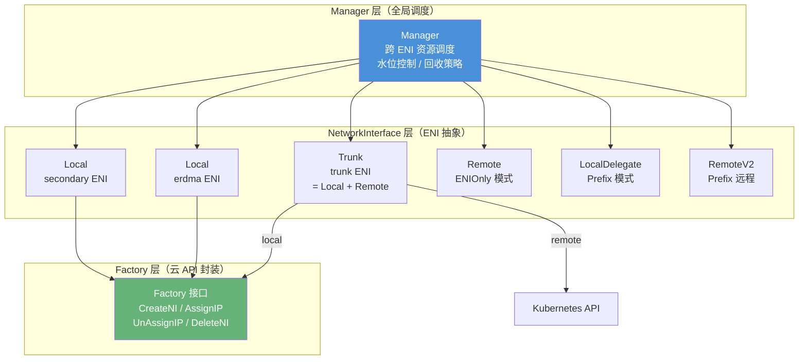
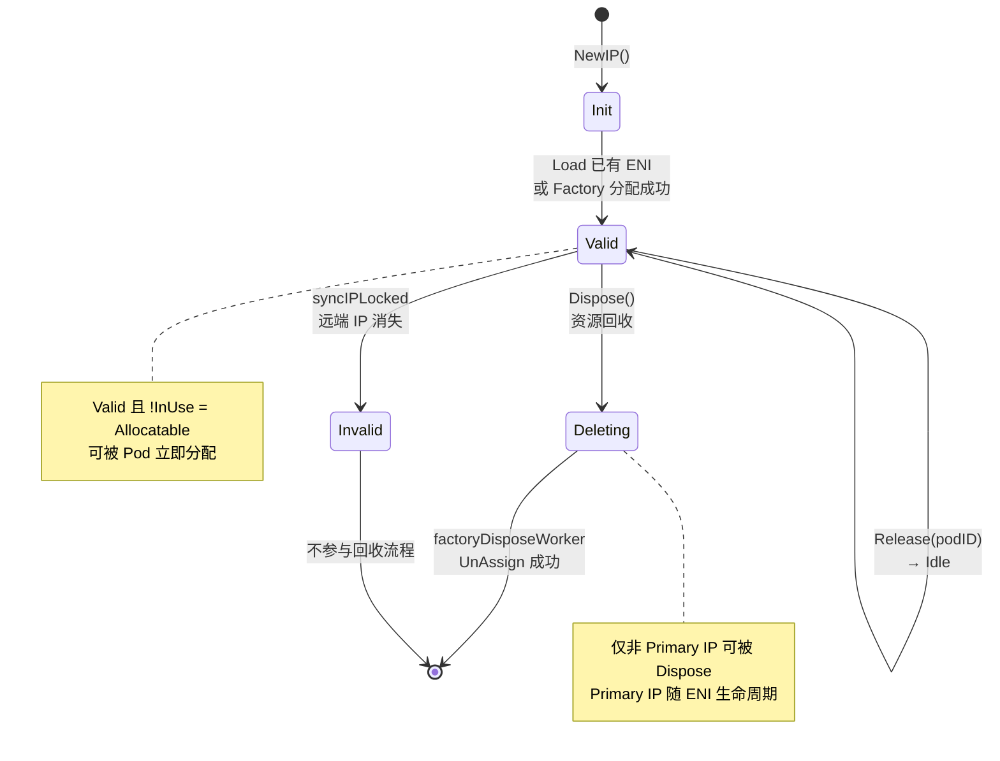
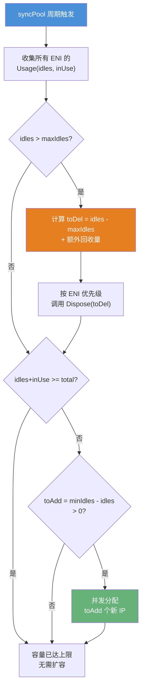
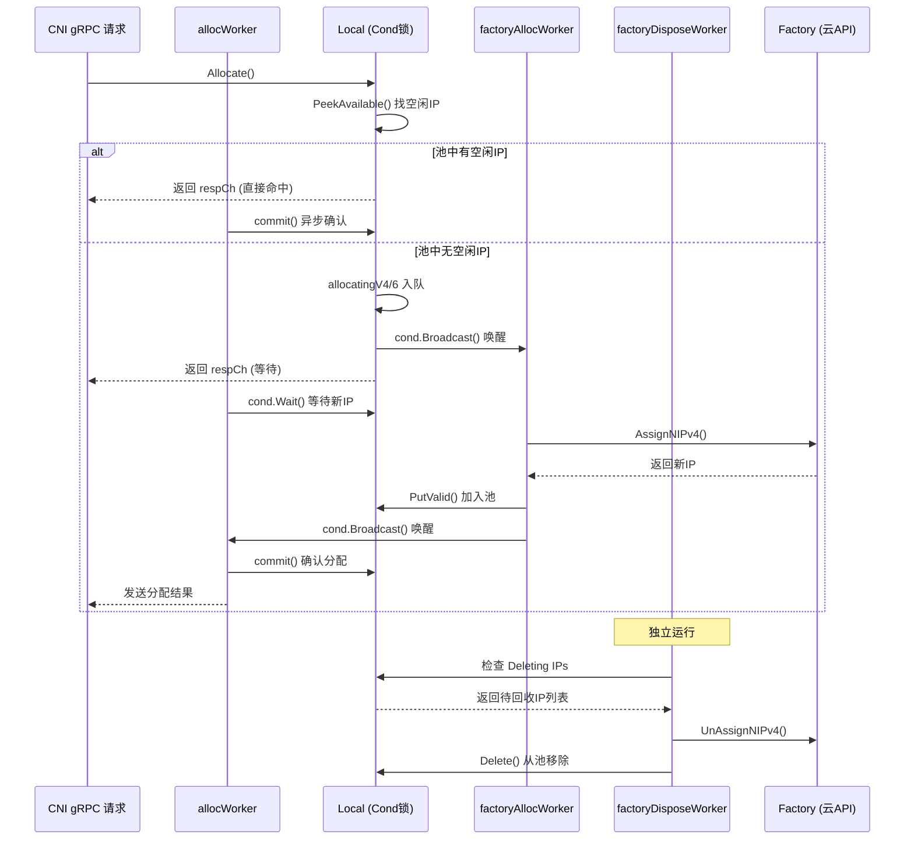

Terway 的 ENI 资源管理器是节点级 IP 地址分配的核心引擎，它在本地维护一个预热 IP 池，使 Pod 创建时能够**零延迟**获得 IP 地址，而无需同步等待阿里云 OpenAPI 调用。整个系统采用**分层架构**设计：顶层 `Manager` 负责跨 ENI 的资源调度与水位控制，底层每个 ENI 由独立的 `Local` 实例管理其 IP 生命周期，通过 `sync.Cond` 实现高效的**生产者-消费者**协作模型。本文将深入解析资源池化的数据结构、水位控制的调度策略、以及资源回收的完整流程。

Sources: [manager.go](pkg/eni/manager.go#L100-L120), [local.go](pkg/eni/local.go#L134-L156)

## 架构总览：三层资源管理模型

在深入细节之前，先建立整体架构认知。Terway 的 ENI 资源管理器由三个核心层次构成，每一层承担不同的职责边界：



**Manager** 作为全局调度器，持有所有 `NetworkInterface` 实例的引用，根据**选择策略**（`most_ips` 或 `least_ips`）决定将 IP 分配请求路由到哪个 ENI。每个 `Local` 实例独立管理单个 ENI 上的 IP 资源池，并运行两个后台 worker 分别负责 IP 分配和资源回收。`Trunk` 是 `Local` 和 `Remote` 的组合体，同时支持本地 IP 和 Member ENI 远程 IP 的分配。`Factory` 则是对阿里云 OpenAPI 的抽象封装，屏蔽了 ECS API 调用的细节。

Sources: [manager.go](pkg/eni/manager.go#L80-L98), [trunk.go](pkg/eni/trunk.go#L16-L21), [types.go](pkg/factory/types.go#L11-L25)

## 核心数据模型：IP 生命周期状态机

IP 地址在资源池中的生命周期由 `ipStatus` 状态机严格管控。理解这个状态机是理解整个资源管理器的关键：



**`IP` 结构体**是资源管理的基本单元，它封装了 IP 地址、是否为主 IP、关联的 Pod 标识和当前状态。`Set` 类型（`map[netip.Addr]*IP`）在此基础上提供了 `Idles()`、`InUse()`、`Allocatable()`、`PeekAvailable()` 等批量查询方法，这些方法支撑了上层的水位计算与分配决策。特别值得注意的设计是 `PeekAvailable(podID string)` 方法：当 `podID` 非空时，它优先查找该 Pod 已关联的 IP（支持幂等重试），否则从可分配 IP 中选取第一个，实现了**亲和性分配**语义。

| 状态 | 含义 | 是否可分配 | 是否在用 |
|------|------|-----------|---------|
| `ipStatusInit` | 新创建，尚未就绪 | ❌ | ❌ |
| `ipStatusValid` | 已就绪，在池中等待分配 | ✅（若未绑定 Pod） | 视 `podID` 而定 |
| `ipStatusInvalid` | 远端已不存在 | ❌ | ❌ |
| `ipStatusDeleting` | 正在回收中 | ❌ | ❌ |

Sources: [types.go](pkg/eni/types.go#L16-L97), [types.go](pkg/eni/types.go#L99-L194)

## Manager 层：全局调度与水位控制

### 初始化与配置映射

`Manager` 的初始化由 `NewManager()` 函数完成，它将 `PoolConfig` 中的配置参数映射到运行时属性。`PoolConfig` 结构体承载了池化管理的全部配置：

| 配置字段 | 来源配置 | 作用 |
|---------|---------|------|
| `Capacity` | `maxENI × ipPerENI` | 节点可容纳的 IP 总量上限 |
| `MaxPoolSize` | `max_pool_size` | 池中最大空闲 IP 数 |
| `MinPoolSize` | `min_pool_size` | 池中最小空闲 IP 数 |
| `BatchSize` | 固定值 `10` | 单次 OpenAPI 批量分配数量 |
| `MaxIPPerENI` | 实例规格限制 | 单个 ENI 最大 IP 数 |
| `ReclaimBatchSize` | `idle_ip_reclaim_batch_size` | 单次回收批次大小 |
| `ReclaimInterval` | `idle_ip_reclaim_interval` | 回收检查间隔 |
| `ReclaimAfter` | `idle_ip_reclaim_after` | 回收等待期（池静默时长） |
| `ReclaimFactor` | `idle_ip_reclaim_jitter_factor` | 回收间隔抖动因子 |

`Manager` 还持有 `NodeCondition` 实例用于向 Kubernetes 报告节点 IP 耗尽状态。当 IP 分配因 vSwitch IP 不足而失败时，会触发 `SetIPExhaustive()` 将节点标记为 IP 资源不足；当 IP 成功释放后，调用 `UnsetIPExhaustive()` 恢复。这个机制使用了**原子操作 + 定时器**的双重保障：`CompareAndSwap` 确保并发安全，10 分钟定时器防止状态卡在异常值。

Sources: [manager.go](pkg/eni/manager.go#L376-L420), [manager.go](pkg/eni/manager.go#L22-L67), [config.go](types/daemon/config.go#L259-L278), [config.go](daemon/config.go#L73-L194)

### 分配流程：ENI 选择与请求分发

当 CNI Binary 通过 gRPC 发起 IP 分配请求时，`Manager.Allocate()` 是入口方法。其核心逻辑分三步：

**第一步：ENI 排序。** 根据配置的 `EniSelectionPolicy` 对所有 `NetworkInterface` 实例排序。`most_ips` 策略（默认）按**优先级降序**排列，优先选择 IP 池最大的 ENI，实现负载均衡；`least_ips` 策略则反向排序，优先选择 IP 池最小的 ENI，实现 IP 集中回收。`Priority()` 值由 ENI 状态（`InUse=50, Creating=10, Init=0, Deleting=-100`）加上当前 IP 数量决定。

**第二步：遍历尝试。** 对每个资源请求，遍历排序后的 ENI 列表，调用 `ni.Allocate()` 方法。如果某个 ENI 返回了非 nil 的 channel，表示该 ENI 可以处理此请求，立即跳出循环。

**第三步：结果收集。** 通过 goroutine + channel 的模式异步收集分配结果，支持多个资源请求的并行处理。如果所有 ENI 都无法处理（返回 nil channel），则检查 `Trace` 信息中是否包含 `InsufficientVSwitchIP` 条件，触发节点 IP 耗尽告警。

```
EniSelectionPolicy = "most_ips" → 按 Priority 降序 → IP 多的优先
EniSelectionPolicy = "least_ips" → 按 Priority 升序 → IP 少的优先
```

Sources: [manager.go](pkg/eni/manager.go#L144-L250), [local.go](pkg/eni/local.go#L526-L549), [config.go](types/daemon/config.go#L231-L236)

### 池同步与预热：syncPool 机制

`Manager.Run()` 启动后，会以 `syncPeriod` 为周期（默认 120 秒，通过 `ip_pool_sync_period` 配置）执行 `syncPool()`，这是**资源池水位自动调节**的核心：



**缩容路径**（`toDel > 0`）：当空闲 IP 数超过 `maxPoolSize` 时，Manager 按 ENI 优先级反向排序（`least_ips` 时正序），调用各 ENI 的 `Dispose()` 方法标记多余的 IP 为 `Deleting` 状态。

**扩容路径**（`toAdd > 0`）：当空闲 IP 数低于 `minPoolSize` 且总容量未达上限时，Manager 并发发起 `toAdd` 个 `NoCache=true` 的分配请求，触发 Factory 创建新 IP 或新 ENI。`NoCache=true` 表示这些 IP 仅用于预热池，不会被特定 Pod 消费，而是作为通用池资源。

Sources: [manager.go](pkg/eni/manager.go#L122-L139), [manager.go](pkg/eni/manager.go#L297-L374)

## Local 层：单 ENI 的 IP 池管理

`Local` 是资源管理器中**最复杂的组件**，每个 ENI 对应一个 `Local` 实例。它通过 `sync.Cond` 条件变量实现了一种精巧的**等待-通知**机制，连接了三个核心并发角色：分配请求者（`allocWorker`）、工厂分配者（`factoryAllocWorker`）和工厂回收者（`factoryDisposeWorker`）。

### 并发模型：三角色协作



关键设计要点：**`sync.Cond` + `sync.Mutex`** 构成了 Local 的核心同步原语。`factoryAllocWorker` 和 `factoryDisposeWorker` 是长驻 goroutine，通过 `cond.Wait()` 挂起等待，当有新分配请求或新待回收 IP 时由 `cond.Broadcast()` 唤醒。`allocWorker` 为每次 CNI 请求创建的临时 goroutine，它等待 IP 可用后通过 channel 将结果返回给调用方。这种模型确保了在高并发 Pod 创建场景下，**每个 ENI 一次只有一个在途的 OpenAPI 调用**，避免了 API 限流。

Sources: [local.go](pkg/eni/local.go#L179-L201), [local.go](pkg/eni/local.go#L552-L640), [local.go](pkg/eni/local.go#L642-L811), [local.go](pkg/eni/local.go#L885-L973)

### ENI 生命周期管理

`Local` 实例本身也有自己的状态机，由 `eniStatus` 表示：

| 状态 | 含义 | 可分配 | 可回收 |
|------|------|--------|--------|
| `statusInit` | ENI 尚未创建，Local 是占位符 | ✅（触发创建） | ❌ |
| `statusCreating` | 正在调用 CreateNetworkInterface | ❌ | ❌ |
| `statusInUse` | ENI 已创建，正常工作 | ✅ | ✅ |
| `statusDeleting` | ENI 正在删除 | ❌ | ✅（自动回收） |

当 `factoryAllocWorker` 发现 `eni == nil` 且有待分配请求时，会调用 `factory.CreateNetworkInterface()` 创建新 ENI，创建成功后将状态切换为 `statusInUse`。如果创建失败，ENI 会被标记为 `statusDeleting`，由 `factoryDisposeWorker` 清理。对于已存在的 ENI（从 `attached` 列表初始化），则直接从 `statusInUse` 开始。

**批量分配**机制是性能优化的关键：`factoryAllocWorker` 不是逐个分配 IP，而是以 `batchSize`（默认 10）为批次调用 `AssignNIPv4/AssignNIPv6`。请求队列 `allocatingV4/allocatingV6` 是 `AllocatingRequests` 类型，它会自动清理已取消的请求（通过 `workerCtx.Done()` 判断），避免为已超时的 Pod 分配 IP。

Sources: [local.go](pkg/eni/local.go#L39-L46), [local.go](pkg/eni/local.go#L680-L810), [types.go](pkg/eni/types.go#L280-L296)

### IP 分配抑制（Alloc Inhibit）

当 OpenAPI 调用返回特定错误时，`Local` 会启动**分配抑制**机制，避免在已知会失败的情况下重复调用 API：

- **`ErrEniPerInstanceLimitExceeded`**（ENI 数量超限）：抑制 1 分钟
- **`InvalidVSwitchIDIPNotEnough`** 或 **`QuotaExceededPrivateIPAddress`**（vSwitch IP 不足）：抑制 10 分钟

抑制期间，所有需要从 Factory 获取新 IP 的分配请求都会立即失败，并携带 `InsufficientVSwitchIP` 的 Trace 信息，向上传播到 Manager 层触发节点 IP 耗尽告警。这个机制体现了**快速失败**的设计哲学：与其让请求排队等待注定失败的操作，不如立即返回让上层做出调度决策。

Sources: [local.go](pkg/eni/local.go#L975-L994), [local.go](pkg/eni/local.go#L440-L443)

## 资源回收机制：三级回收策略

Terway 实现了层次分明的资源回收策略，从即时回收到定时批量回收，确保 IP 资源不被浪费：

### 第一级：超出水位线的即时回收

当 `syncPool` 检测到 `idles > maxPoolSize` 时，`calculateToDel()` 返回正向值，触发 `Dispose()` 调用。`Local.Dispose()` 的回收逻辑如下：

1. **尝试整 ENI 回收**：如果 `toDel >= max(ipv4数, ipv6数)` 且 ENI 可以被整体回收（`canDispose()` 返回 true），则将 ENI 标记为 `statusDeleting`，连同其上所有 IP 一起回收
2. **优先回收无效 IP**：遍历所有非 Valid 且非 InUse 的 IP，标记为 Deleting
3. **回收空闲 IP**：从空闲 IP 中选取 `min(空闲数, toDel)` 个标记为 Deleting

`canDispose()` 检查条件非常严格：ENI 类型不能是 trunk 或 erdma、不能有正在使用的 IP、不能有待分配的请求。这确保了**不会误删正在服务 Pod 的 ENI**。

Sources: [local.go](pkg/eni/local.go#L813-L883), [local.go](pkg/eni/local.go#L1088-L1105)

### 第二级：空闲 IP 定时批量回收

这是 `calculateToDel()` 方法实现的核心策略，通过**静默期 + 抖动间隔 + 批次限制**三个维度控制回收节奏：

```go
// 核心逻辑伪代码
func calculateToDel(idles int) int {
    toDel = idles - maxPoolSize  // 基础回收量
    
    if reclaimAfter 未配置 {
        return toDel  // 仅执行第一级回收
    }
    
    if 距上次池修改 < reclaimAfter {
        return toDel  // 静默期内不额外回收
    }
    
    if 下次回收时间未设置 {
        设置下次回收时间 = now + jitter(reclaimInterval, factor)
        return toDel  // 首次进入静默期后等待
    }
    
    if 下次回收时间 > now {
        return toDel  // 未到回收时间
    }
    
    // 到达回收时间，计算额外回收量
    extraDel = min(reclaimBatchSize, idles - toDel - minPoolSize)
    toDel += extraDel
    重置下次回收时间
    return toDel
}
```

这个算法的关键特征是：**回收只在池静默（无分配/释放操作）`reclaimAfter` 时长后才启动**，每次回收后重新计算下次回收时间（带抖动），确保不会一次性清空池。`lastModified` 在每次 LocalIP 类型的 Allocate 和 Release 操作时更新，用于重置静默期计时器。

| 参数 | 默认值 | 作用 |
|------|--------|------|
| `idle_ip_reclaim_after` | 未配置（不启用） | 池静默多久后开始回收 |
| `idle_ip_reclaim_interval` | `10m` | 回收检查间隔 |
| `idle_ip_reclaim_batch_size` | `5` | 每次最多回收 IP 数 |
| `idle_ip_reclaim_jitter_factor` | `0.1` | 间隔抖动因子（10%） |

Sources: [manager.go](pkg/eni/manager.go#L422-L464), [manager.go](pkg/eni/manager.go#L109-L116)

### 第三级：远端同步与孤儿 IP 检测

`Local.sync()` 以 `defaultSyncPeriod`（1 分钟）为周期，调用 `factory.LoadNetworkInterface()` 从 ECS 元数据服务获取 ENI 上的实际 IP 列表，与本地池进行对比：

- **远端消失的 IP**：标记为 `ipStatusInvalid`，这些 IP 会在 `Dispose()` 中被优先回收
- **远端多出的 IP**（孤儿 IP）：通过 LRU 缓存（`invalidIPCache`）追踪，连续 2 次同步仍然存在的孤儿 IP 会触发告警事件

这个机制是资源一致性的最后保障，能够自动修正因 ECS 侧操作（如手动释放 IP）导致的本地池与远端状态不一致问题。

Sources: [local.go](pkg/eni/local.go#L355-L374), [local.go](pkg/eni/local.go#L1107-L1164)

## 网络接口类型与选择策略

Terway 支持多种 `NetworkInterface` 实现，每种对应不同的网络模式：

| 实现类型 | 适用场景 | Priority | 说明 |
|---------|---------|----------|------|
| `Local` (secondary) | ENI 多 IP 模式 | 0~50+ | 基础类型，每个 ENI 独立管理 |
| `Local` (erdma) | eRDMA 高性能网络 | 0~50+ | 与 secondary 相同逻辑，仅类型标签不同 |
| `Trunk` | Trunk 模式 | **固定 100** | 组合 Local + Remote，最高优先级 |
| `Remote` | ENI 独占模式 | 动态 | 通过 Kubernetes CRD 分配 Member ENI |
| `CRDV2` | CRD 管理模式 | 动态 | 全部通过 NetworkInterface CRD 管理 |
| `LocalDelegate` | IP Prefix 模式 | **固定 200** | 最高优先级，基于 CRD 本地管理 |
| `RemoteV2` | Prefix 远程分配 | 动态 | Prefix 模式下的远程 ENI 分配 |

`Trunk` 和 `LocalDelegate` 拥有固定的高优先级，确保在同时存在多种 ENI 类型时，系统优先使用这些更高效的分配路径。`EniSelectionPolicy` 仅影响同类型 ENI 之间的选择顺序。

Sources: [trunk.go](pkg/eni/trunk.go#L35-L37), [local_delegate.go](pkg/eni/local_delegate.go#L92-L94), [manager.go](pkg/eni/manager.go#L174-L180)

## 速率限制与错误恢复

整个资源管理器在多个层面实施了速率限制，确保不会因过度调用阿里云 API 而被限流：

- **ENI 操作**：`rate.Every(1m/10)` = 每 6 秒允许 1 次，突发上限 2
- **IPv4 分配**：同上
- **IPv6 分配**：同上
- **Factory 分配前等待**：300ms 的短暂数延迟，用于合并同一批次内的多个分配请求

当 OpenAPI 调用失败时，`errorHandleLocked()` 会根据错误类型设置不同时长的分配抑制期，并将事件记录到 Kubernetes 事件系统供运维排查。`factoryDisposeWorker` 在删除 ENI 失败后会持续重试（下次 `cond.Wait` 唤醒时），确保资源最终被清理。

Sources: [local.go](pkg/eni/local.go#L52-L53), [local.go](pkg/eni/local.go#L149-L173), [local.go](pkg/eni/local.go#L675-L678), [local.go](pkg/eni/local.go#L975-L994)

## 监控指标

资源池暴露了以下 Prometheus 指标，用于监控水位和异常检测：

| 指标名 | 类型 | 标签 | 含义 |
|--------|------|------|------|
| `terway_resource_pool_total_count` | Gauge | type, ipStack | 池中 IP 总数 |
| `terway_resource_pool_idle_count` | Gauge | type, ipStack | 池中空闲 IP 数 |
| `terway_resource_pool_disposed_count` | Counter | type, ipStack | 已回收的 IP 数 |
| `terway_resource_pool_allocated_count` | Counter | type | 已分配的 IP 数 |

这些指标在每次 IP 状态变更时实时更新，为 Grafana 面板提供数据源。建议关注 `idle_count / total_count` 的比率作为池健康度的核心指标。

Sources: [resource_pool.go](pkg/metric/resource_pool.go#L1-L47)

## 小结

ENI 资源管理器通过**分层解耦**的设计，将全局水位控制（Manager）、单 ENI 资源池管理（Local）、云 API 调用（Factory）三个关注点清晰分离。`sync.Cond` 驱动的生产者-消费者模型实现了高效的异步 IP 分配，避免了 Pod 创建路径上的同步等待。三级回收策略（即时/定时/同步）在保证资源利用率的同时，通过静默期、抖动和批次限制等机制确保了回收行为的温和性。

**延伸阅读**：关于 IP Prefix 模式下基于子网前缀的大规模 IP 分配策略，请参阅 [IP Prefix 模式：基于子网前缀的大规模 IP 分配策略](11-ip-prefix-mo-shi-ji-yu-zi-wang-qian-zhui-de-da-gui-mo-ip-fen-pei-ce-lue)。关于 DevicePlugin 如何与 Kubernetes 调度器协同实现节点容量感知，请参阅 [空闲 IP 回收与资源调度：DevicePlugin 与节点容量感知](12-kong-xian-ip-hui-shou-yu-zi-yuan-diao-du-deviceplugin-yu-jie-dian-rong-liang-gan-zhi)。关于控制平面如何通过 CRD 和控制器管理 ENI 资源，请参阅 [控制平面控制器详解：ENI 控制器、Multi-IP 控制器与 Pod 控制器](14-kong-zhi-ping-mian-kong-zhi-qi-xiang-jie-eni-kong-zhi-qi-multi-ip-kong-zhi-qi-yu-pod-kong-zhi-qi)。