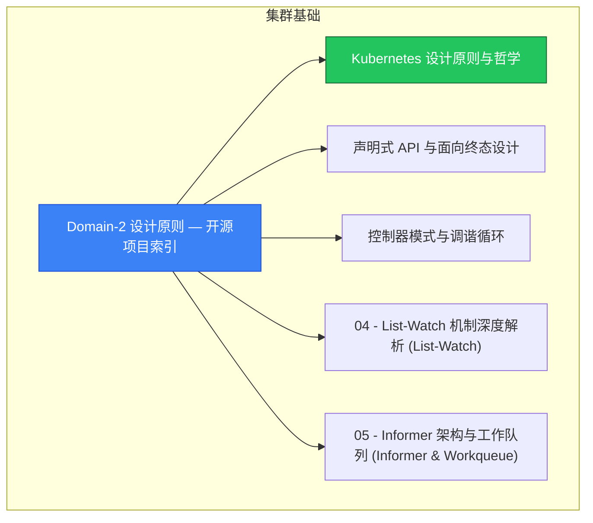

> **生产环境安全提示**
>
> 本文档包含可直接执行的运维命令。执行前请确认：当前目标集群与 Namespace 是否正确；是否具备足够的 RBAC 权限；是否已在非生产环境验证。命令风险等级标注：🔴 高风险（可能造成数据丢失或服务中断）、🟡 中风险（会修改集群状态，但通常可回滚）、🟢 低风险/只读（信息收集，无副作用）。

# 集群基础 MOC

> **MOC 版本**: 1.0
> **知识域**: 集群基础
> **文档数量**: 20 篇
> **最后更新**: 2026-05-21
> **用途**: 本知识域的导航入口，汇总所有相关文档、关联领域、和场景入口

---

## 领域概述

Kubernetes 设计原则 — API 设计理念、声明式 API、控制器模式、渐进式交付

### 知识域定位

| 维度 | 说明 |
|---|---|
| **知识域** | 集群基础 |
| **文档数量** | 20 篇 |
| **难度分布** | 入门 0 / 进阶 0 / 高级 3 / 专家 0 |

---

## 文档清单

| # | 文档 | 难度 | 标签 | 估计阅读时间 |
|---|---|---|---|---|
| 1 | Domain-2 设计原则 — 开源项目索引 |  | k8s, design-principles |  |
| 2 | Kubernetes 设计原则与哲学 | 高级 | k8s, design-principles, philosophy | 5min |
| 3 | 声明式 API 与面向终态设计 | 高级 | k8s, declarative, api | 5min |
| 4 | 控制器模式与调谐循环 | 高级 | k8s, controller, reconcile | 5min |
| 5 | 04 - List-Watch 机制深度解析 (List-Watch) |  | k8s, design-principles |  |
| 6 | 05 - Informer 架构与工作队列 (Informer & Workqueue) |  | k8s, design-principles |  |
| 7 | 06 - 资源版本与并发控制 (Concurrency Control) |  | k8s, design-principles |  |
| 8 | 07 - 分布式共识与 etcd 原理 (etcd & Raft) |  | k8s, design-principles |  |
| 9 | 08 - 高可用架构模式 (HA Patterns) |  | k8s, design-principles |  |
| 10 | 09 - Kubernetes 源码结构与阅读指南 (Source Code) |  | k8s, design-principles |  |
| 11 | 10 - CAP 定理与分布式系统基础 (CAP Theorem) |  | k8s, design-principles |  |
| 12 | 11 - 扩展性设计模式 (Extensibility) |  | k8s, design-principles |  |
| 13 | 12 - Operator 模式与控制器开发 (Operator Guide) |  | k8s, design-principles, guide |  |
| 14 | 13 - 准入控制与 Webhook 机制深度解析 |  | k8s, design-principles |  |
| 15 | 14 - 服务网格与微服务架构设计 |  | k8s, design-principles, architecture |  |
| 16 | 15 - 混沌工程与故障注入设计 |  | k8s, design-principles |  |
| 17 | 16 - 可观测性设计原则 |  | k8s, design-principles, observability |  |
| 18 | 17 - 安全设计模式 |  | k8s, design-principles, security |  |
| 19 | 18 - 性能优化原理 |  | k8s, design-principles, performance |  |
| 20 | Kubernetes v1.29-v1.33 设计原理演进与影响分析 |  | k8s, design-principles |  |

---

## 知识图谱

---

## 关联入口

| 入口 | 说明 |
|---|---|
| FTA 故障树 | 集群基础 相关故障树分析 |
| Skills 技能 | 集群基础 相关操作技能 |
| 深度研究入口 | 语料库索引与向量检索 |

---

## 统计信息

| 指标 | 数值 |
|---|---|
| 文档总数 | 20 |
| 覆盖 K8s 版本 | v1.25 - v1.32 |

---

*本文档由 scripts/generate-mocs.py 自动生成，最后更新 2026-05-21。*

<!-- risk-assessed -->
