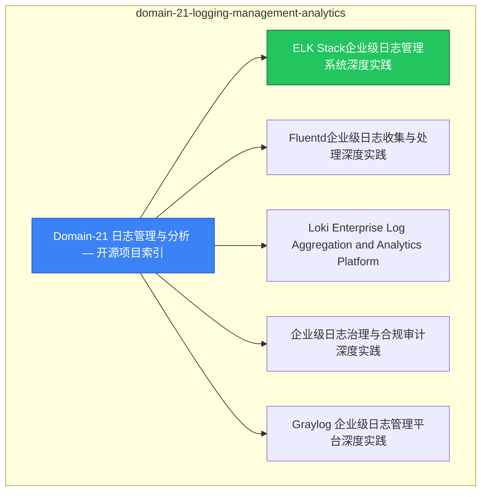

> **生产环境安全提示**
>
> 本文档包含可直接执行的运维命令。执行前请确认：当前目标集群与 Namespace 是否正确；是否具备足够的 RBAC 权限；是否已在非生产环境验证。命令风险等级标注：🔴 高风险（可能造成数据丢失或服务中断）、🟡 中风险（会修改集群状态，但通常可回滚）、🟢 低风险/只读（信息收集，无副作用）。

# domain-21-logging-management-analytics MOC

> **MOC 版本**: 1.0
> **知识域**: domain-21-logging-management-analytics
> **文档数量**: 10 篇
> **最后更新**: 2026-05-21
> **用途**: 本知识域的导航入口，汇总所有相关文档、关联领域、和场景入口

---

## 领域概述

日志管理与分析 — 日志采集、存储、分析、可视化

### 知识域定位

| 维度 | 说明 |
|---|---|
| **知识域** | domain-21-logging-management-analytics |
| **文档数量** | 10 篇 |
| **难度分布** | 入门 0 / 进阶 0 / 高级 0 / 专家 0 |

---

## 文档清单

| # | 文档 | 难度 | 标签 | 估计阅读时间 |
|---|---|---|---|---|
| 1 | [[09-可观测性/01-总览/00-open-source-projects-index.md|Domain-21 日志管理与分析 — 开源项目索引]] |  | observability, logging |  |
| 2 | ELK Stack企业级日志管理系统深度实践 |  | observability, logging |  |
| 3 | Fluentd企业级日志收集与处理深度实践 |  | observability, logging |  |
| 4 | Loki Enterprise Log Aggregation and Analytics Platform |  | observability, logging |  |
| 5 | 企业级日志治理与合规审计深度实践 |  | observability, logging, compliance |  |
| 6 | Graylog 企业级日志管理平台深度实践 |  | observability, logging |  |
| 7 | Splunk企业级日志分析与安全智能平台深度实践 |  | observability, logging |  |
| 8 | 企业级实时日志分析与业务洞察深度实践 |  | observability, logging |  |
| 9 | Splunk Enterprise Log Analytics Platform 深度实践 |  | observability, logging |  |
| 10 | Loggly Cloud Log Management Platform 深度实践 |  | observability, logging |  |

---

## 知识图谱

---

## 关联入口

| 入口 | 说明 |
|---|---|
| FTA 故障树 | domain-21-logging-management-analytics 相关故障树分析 |
| Skills 技能 | domain-21-logging-management-analytics 相关操作技能 |
| 深度研究入口 | 语料库索引与向量检索 |

---

## 统计信息

| 指标 | 数值 |
|---|---|
| 文档总数 | 10 |
| 覆盖 K8s 版本 | v1.25 - v1.32 |

---

*本文档由 scripts/generate-mocs.py 自动生成，最后更新 2026-05-21。*

## See Also

- [[37-归档/domain-indexes/observability/FINAL-QUALITY-ASSESSMENT.md|FINAL-QUALITY-ASSESSMENT]]
- [[37-归档/domain-indexes/observability/MOC-from-domain-20.md|MOC-from-可观测性]]
- [[37-归档/domain-indexes/observability/MOC-from-domain-8.md|MOC-from-可观测性]]
- [[可观测性/98-merged-indexes/QUALITY-REPORT.md|QUALITY-REPORT]]

- [[09-可观测性/README.md|返回目录]]

<!-- risk-assessed -->
