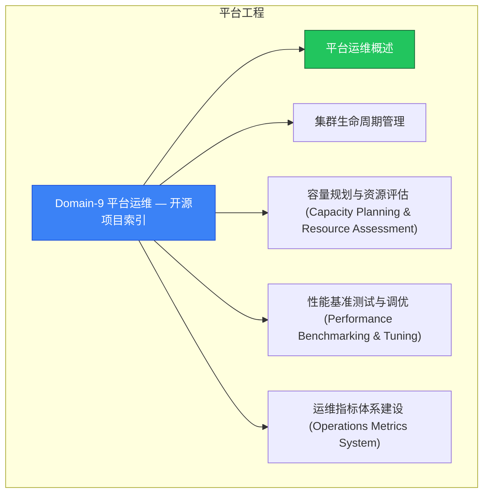

> **生产环境安全提示**
>
> 本文档包含可直接执行的运维命令。执行前请确认：当前目标集群与 Namespace 是否正确；是否具备足够的 RBAC 权限；是否已在非生产环境验证。命令风险等级标注：🔴 高风险（可能造成数据丢失或服务中断）、🟡 中风险（会修改集群状态，但通常可回滚）、🟢 低风险/只读（信息收集，无副作用）。

# 平台工程 MOC

> **MOC 版本**: 1.0
> **知识域**: 平台工程
> **文档数量**: 29 篇
> **最后更新**: 2026-05-21
> **用途**: 本知识域的导航入口，汇总所有相关文档、关联领域、和场景入口

---

## 领域概述

平台运维 — 集群管理、资源管理、调度策略、运维自动化

### 知识域定位

| 维度 | 说明 |
|---|---|
| **知识域** | 平台工程 |
| **文档数量** | 29 篇 |
| **难度分布** | 入门 0 / 进阶 3 / 高级 0 / 专家 0 |

---

## 文档清单

| # | 文档 | 难度 | 标签 | 估计阅读时间 |
|---|---|---|---|---|
| 1 | Domain-9 平台运维 — 开源项目索引 |  | k8s, devops, daily-ops |  |
| 2 | 平台运维概述 | 进阶 | k8s, platform, platform-engineering | 5min |
| 3 | 集群生命周期管理 | 进阶 | k8s, cluster, lifecycle | 5min |
| 4 | 容量规划与资源评估 (Capacity Planning & Resource Assessment) |  | k8s, devops, daily-ops |  |
| 5 | 性能基准测试与调优 (Performance Benchmarking & Tuning) |  | k8s, devops, daily-ops |  |
| 6 | 运维指标体系建设 (Operations Metrics System) |  | k8s, devops, daily-ops |  |
| 7 | 监控告警体系 | 进阶 | k8s, monitoring, alerting | 5min |
| 8 | GitOps配置管理 (GitOps Configuration Management) |  | k8s, devops, daily-ops |  |
| 9 | 运维自动化工具链 (Operations Automation Toolchain) |  | k8s, devops, daily-ops |  |
| 10 | 成本优化与FinOps实践 (Cost Optimization & FinOps) |  | k8s, devops, daily-ops |  |
| 11 | 安全合规管理 (Security & Compliance Management) |  | k8s, devops, daily-ops |  |
| 12 | 灾难恢复与业务连续性 (Disaster Recovery & Business Continuity) |  | k8s, devops, daily-ops |  |
| 13 | Kubernetes 备份与恢复概述 (Backup & Recovery Overview) |  | k8s, devops, daily-ops |  |
| 14 | 多集群管理 |  | k8s, devops, daily-ops |  |
| 15 | 大规模集群性能优化 (Large Scale Cluster Optimization) |  | k8s, devops, daily-ops |  |
| 16 | 生产环境故障诊断 (Production Troubleshooting) |  | k8s, devops, daily-ops |  |
| 17 | 平台升级与迁移策略 (Platform Upgrade & Migration Strategy) |  | k8s, devops, daily-ops |  |
| 18 | 多租户管理与资源隔离 (Multi-Tenant Management  Resource Isolation) |  | k8s, devops, daily-ops |  |
| 19 | 平台可观测性深度实践 (Platform Observability Deep Practice) |  | k8s, devops, daily-ops |  |
| 20 | 69 - Lease 与 Leader 选举机制 (Lease & Leader Election) |  | k8s, devops, daily-ops |  |
| 21 | 31 - CRD与Operator开发 |  | k8s, devops, daily-ops |  |
| 22 | 32 - API聚合层配置 |  | k8s, devops, daily-ops |  |
| 23 | 46 - Kubernetes客户端库 |  | k8s, devops, daily-ops |  |
| 24 | 110 - CLI 增强与效率工具 (CLI Enhancement) |  | k8s, devops, daily-ops |  |
| 25 | 14 - 附加组件和扩展表 |  | k8s, devops, daily-ops |  |
| 26 | 55 - 虚拟集群与多租户 |  | k8s, devops, daily-ops |  |
| 27 | kubectl 插件生态知识手册 |  | k8s, devops, daily-ops |  |
| 28 | Java Kubernetes Client 与 Operator SDK 开发指南 |  | k8s, devops, daily-ops |  |
| 29 | Kubernetes v1.29-v1.33 平台运维新特性指南 |  | k8s, devops, daily-ops |  |

---

## 知识图谱

---

## 关联入口

| 入口 | 说明 |
|---|---|
| FTA 故障树 | 平台工程 相关故障树分析 |
| Skills 技能 | 平台工程 相关操作技能 |
| 深度研究入口 | 语料库索引与向量检索 |

---

## 统计信息

| 指标 | 数值 |
|---|---|
| 文档总数 | 29 |
| 覆盖 K8s 版本 | v1.25 - v1.32 |

---

*本文档由 scripts/generate-mocs.py 自动生成，最后更新 2026-05-21。*

<!-- risk-assessed -->
