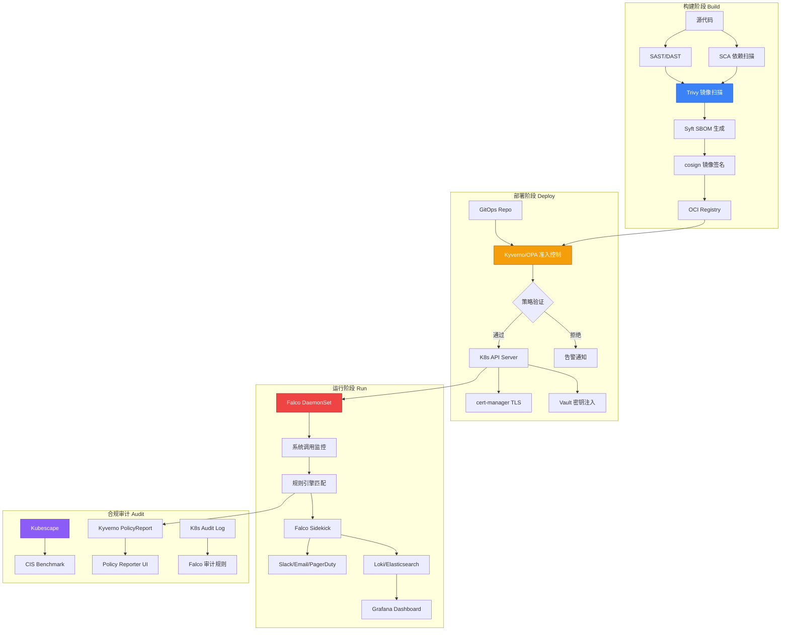
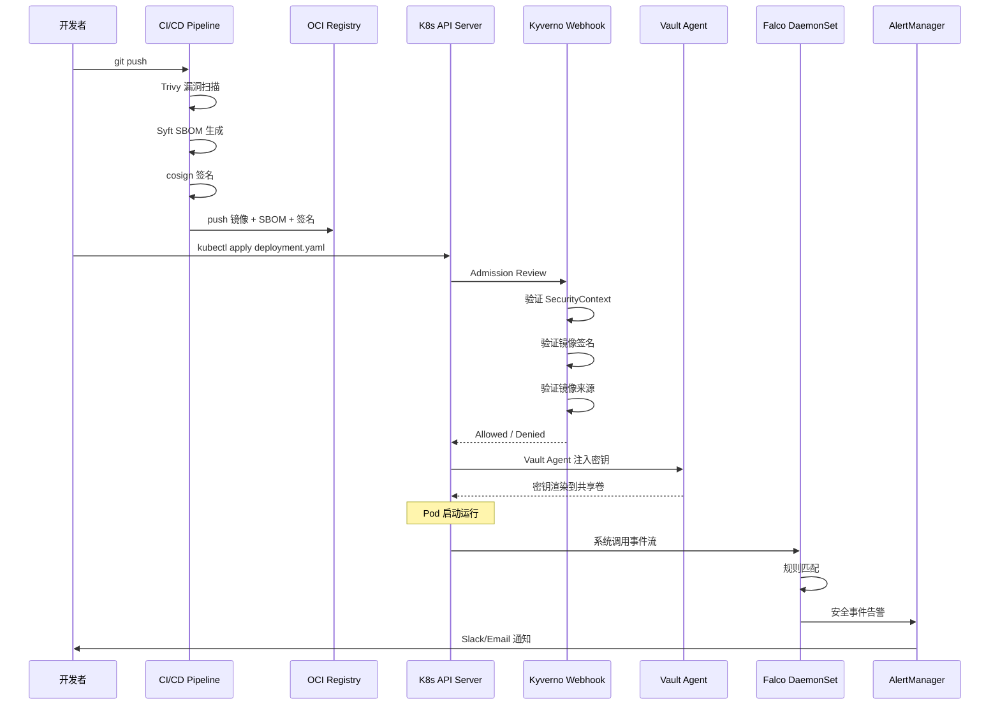

> **生产环境安全提示**
>
> 本文档包含可直接执行的运维命令。执行前请确认：当前目标集群与 Namespace 是否正确；是否具备足够的 RBAC 权限；是否已在非生产环境验证。命令风险等级标注：🔴 高风险（可能造成数据丢失或服务中断）、🟡 中风险（会修改集群状态，但通常可回滚）、🟢 低风险/只读（信息收集，无副作用）。


# Domain-25 云原生安全 — 开源项目索引

> **最后更新**: 2026-04-24
> **适用版本**: Falco v0.41 / Kyverno v1.14 / cert-manager v1.17 / OPA v1.3 / Trivy v0.61

---

<!-- chunk: 一、概述与威胁模型 -->## 一、概述与威胁模型

云原生安全并非单一工具可以覆盖的领域，而是需要覆盖软件供应链全生命周期的纵深防御体系。从代码编写、镜像构建、集群部署到运行时保护，每个阶段都面临不同类型的威胁。现代云原生威胁模型涵盖以下核心攻击面：

| 攻击面 | 典型威胁 | 对应工具 |
|:---|:---|:---|
| **供应链** | 恶意依赖注入、镜像篡改、构建管道劫持 | cosign, Trivy, Syft, in-toto |
| **身份认证** | 凭据泄露、权限提升、服务账号滥用 | Vault, SPIFFE/SPIRE, Keycloak |
| **网络** | 横向移动、数据外泄、DNS 隧道 | Cilium, Calico, NetworkPolicy |
| **运行时** | 特权逃逸、加密货币挖矿、反向 Shell | Falco, Sysdig, Aqua, NeuVector |
| **合规** | 配置漂移、审计缺失、基线不达标 | Kubescape, OPA, Kyverno |
| **密钥管理** | 硬编码密钥、Secret 泄露、证书过期 | Vault, External Secrets, cert-manager |

云原生环境的安全挑战与传统基础设施有本质差异。容器的短暂性（ephemeral nature）意味着攻击可能稍纵即逝，传统的基于日志的事后分析难以有效追踪。微服务架构下的东西向流量爆炸式增长，边界防火墙策略难以覆盖。K8s 声明式配置模型虽然提高了运维效率，但也带来了配置漂移（configuration drift）的安全风险。此外，多租户集群环境下的隔离要求、CI/CD 管道的供应链安全、以及 DevOps 团队安全意识参差不齐等现实问题，都要求企业建立系统化的安全工具链和流程体系。

本索引汇总了云原生安全领域的主要开源与商业项目，按照功能域分类，帮助安全架构师和平台工程师快速定位合适的工具。每个项目提供了功能描述、版本信息、社区状态和关键特性的深度对比，以及典型部署配置和使用场景。

---

<!-- chunk: 二、核心项目总览 -->## 二、核心项目总览

| 项目 | 作用 | CNCF 状态 | 最新版本 | Stars | License |
|:---|:---|:---|:---|:---|:---|
| **Falco** | 运行时安全监控 | Graduated | v0.41.0 | 7.5k+ | Apache-2.0 |
| **OPA** | 通用策略引擎 | Graduated | v1.3.0 | 9.5k+ | Apache-2.0 |
| **Kyverno** | K8s 原生策略管理 | Graduated | v1.14.0 | 5.5k+ | Apache-2.0 |
| **cert-manager** | 自动化 TLS 证书 | Graduated | v1.17.0 | 12.5k+ | Apache-2.0 |
| **SPIFFE/SPIRE** | 工作负载身份框架 | Graduated | v1.11.0 | 4k+ | Apache-2.0 |
| **TUF** | 软件更新安全框架 | Graduated | v4.0.0 | 3k+ | MIT/Apache-2.0 |
| **in-toto** | 软件供应链完整性 | Graduated | v3.0.0 | 1k+ | Apache-2.0 |
| **Vault** | 密钥与机密管理 | HashiCorp | v1.19.0 | 31k+ | BSL/Apache-2.0 |
| **Kubescape** | 合规扫描与风险评估 | Incubating | v3.0.30 | 10k+ | Apache-2.0 |
| **Notary** | 镜像内容信任 | Incubating | v2.0.0 | 3k+ | Apache-2.0 |
| **cosign** | 镜像签名 (Sigstore) | OpenSSF | v2.4.0 | 4k+ | Apache-2.0 |
| **Trivy** | 漏洞与合规扫描 | Aqua | v0.61.0 | 24k+ | Apache-2.0 |
| **External Secrets** | 外部密钥同步 | 非 CNCF | v0.15.0 | 4k+ | Apache-2.0 |
| **Sealed Secrets** | GitOps 加密密钥 | 非 CNCF | v0.28.0 | 7.5k+ | Apache-2.0 |
| **SOPS** | YAML/JSON 加密 | Mozilla | v3.9.0 | 17k+ | MPL-2.0 |
| **Kubewarden** | Rust K8s 策略引擎 | Rancher | v1.23.0 | 2k+ | Apache-2.0 |
| **NeuVector** | 容器安全平台 | SUSE | v5.4.0 | 3k+ | Apache-2.0 |
| **OPA Gatekeeper** | K8s 准入策略控制器 | OPA | v3.18.0 | 3.5k+ | Apache-2.0 |
| **Syft** | SBOM 生成工具 | Anchore | v1.20.0 | 6k+ | Apache-2.0 |
| **Grype** | 漏洞扫描工具 | Anchore | v0.90.0 | 9k+ | Apache-2.0 |

---

<!-- chunk: 三、运行时安全 (Runtime Security) -->## 三、运行时安全 (Runtime Security)

运行时安全是云原生纵深防御的最后一道防线，负责在容器运行期间检测和响应异常行为。与静态分析不同，运行时安全工具能够捕获实际发生的系统调用、网络连接和进程行为，从而发现零日漏洞利用、供应链投毒和内部威胁等高级攻击。

## 3.1 Falco (CNCF Graduated)

Falco 是云原生运行时安全的基石项目，由 Sysdig 公司于 2016 年创建，2018 年捐赠给 CNCF，2022 年正式毕业。Falco 通过 eBPF 或内核模块捕获系统调用，利用灵活的规则引擎检测异常行为。其架构设计为插件化，支持自定义输出通道和 gRPC 流式 API。

```yaml
核心特性:
  - 基于 eBPF 或内核模块的系统调用监控
  - 规则引擎检测异常行为 (条件表达式 + 输出格式化)
  - 丰富的默认规则库 (300+ 内置规则覆盖 MITRE ATT&CK)
  - gRPC 输出与自定义插件 (K8s Audit, Cloud Audit)
  - Falco Sidekick 集成 (Slack/SQS/HTTP/Webhook/Loki/Elasticsearch)
  - 支持容器、主机、K8s 审计日志三种事件源
  - 现代化 eBPF 驱动 (modern-bpf) 性能优异
```

**检测能力矩阵**

| 类别 | 检测场景 | 默认规则 | MITRE ATT&CK 映射 |
|:---|:---|:---|:---|
| 进程 | 特权 Shell、反向 Shell、加密货币挖矿 | `Terminal shell in container`, `Detect crypto miners` | Execution, Impact |
| 文件 | 敏感文件读写、隐藏文件创建、/etc 修改 | `Write below etc`, `Read sensitive file` | Persistence, Defense Evasion |
| 网络 | 可疑外联、黑名单 IP、DNS 隧道 | `Unexpected outbound connection`, `Contact K8s API Server` | Command & Control, Discovery |
| K8s | exec 进入容器、RBAC 变更、Secret 修改 | `K8s Pod Exec`, `K8s Secret Modified` | Lateral Movement, Credential Access |
| 合规 | CIS Benchmark、PCI DSS、NIST 800-190 | `CIS 1.x.x` 系列 | Various |

**部署模式对比**

```yaml
DaemonSet 模式 (推荐):
  优点: 节点级覆盖、资源隔离、独立升级
  缺点: 需要特权容器 (读取 /proc, /dev)
  适用: 生产环境标准部署

Sidecar 模式:
  优点: Pod 级隔离、精确事件关联
  缺点: 资源开销大、管理复杂
  适用: 高安全要求的关键工作负载
```

**部署示例**

```yaml
apiVersion: apps/v1
kind: DaemonSet
metadata:
  name: falco
  namespace: falco
spec:
  template:
    spec:
      serviceAccountName: falco
      containers:
      - name: falco
        image: falcosecurity/falco:0.41.0
        securityContext:
          privileged: true
        env:
        - name: FALCO_BPF_PROBE
          value: ""
        - name: NODE_NAME
          valueFrom:
            fieldRef:
              fieldPath: spec.nodeName
```

**GitHub**: https://github.com/falcosecurity/falco
**文档**: https://falco.org/docs/

## 3.2 Sysdig (商业开源)

Sysdig 基于 Falco 规则引擎，提供企业级扩展能力。其核心差异化在于：

- **自动基线学习与异常检测**：通过机器学习模型分析容器行为模式，自动建立正常行为基线，检测偏离基线的异常活动
- **取证与回溯能力**：捕获安全事件发生时的完整系统状态（进程树、网络连接、文件操作），支持回溯分析攻击链
- **集成漏洞管理**：从镜像扫描到运行时保护的闭环，将运行时风险与静态漏洞数据关联
- **合规自动化**：CIS Benchmark、PCI DSS、NIST 自动检查和报告生成
- **多云统一管理平面**：AWS、Azure、GCP、本地集群统一安全视图
- **Runtime Insights**：无需手动编写规则，自动发现容器中的可疑活动

## 3.3 NeuVector (SUSE 开源)

NeuVector 是全生命周期容器安全平台，2022 年被 SUSE 收购后于 2024 年完全开源：

- 网络微分段与零信任网络策略自动学习
- 运行时进程与文件保护（Process Profile、File Profile）
- DLP（数据防泄漏）检测（信用卡号、SSN、自定义模式）
- 合规扫描与报告（PCI DSS、HIPAA、GDPR、CIS）
- CI/CD 管道集成（Helm Chart 扫描）
- Admission Control 准入控制
- 多集群集中管理

## 3.4 Aqua Security (开源 + 商业)

Aqua 提供开源和商业两个层次的容器安全方案：

- **开源**: Trivy（漏洞扫描）、kube-hunter（K8s 渗透测试）、Tracee（运行时安全，基于 eBPF）
- **商业**: 完整 CNAPP 平台（运行时保护、供应链安全、合规管理、云安全态势管理）
- Tracee 是 Aqua 开源的运行时安全工具，使用纯 eBPF 技术，无需内核模块

---

<!-- chunk: 四、策略与合规 (Policy & Compliance) -->## 四、策略与合规 (Policy & Compliance)

策略引擎是云原生安全的「免疫系统」，通过准入控制（Admission Control）在资源创建和修改时自动执行安全策略，防止不安全配置进入集群。同时通过定期审计（Audit）扫描现有资源，确保持续的合规状态。

## 4.1 OPA / Gatekeeper (CNCF Graduated)

OPA (Open Policy Agent) 是通用策略引擎，Rego 是其声明式策略语言。OPA 的设计理念是将策略决策与策略执行解耦，使得同一套策略可以在 K8s Admission Control、API Gateway 授权、Terraform 计划审查、Kafka 消息路由等多种场景中复用。

```yaml
OPA 核心特性:
  - 通用策略引擎 (不限于 K8s)
  - Rego 声明式策略语言 (图查询、集合运算、递归)
  - 解耦策略决策与执行 (decision API)
  - 支持 K8s Admission Control、Envoy 外部授权、Terraform Sentinel 替代
  - Bundle API 热加载策略
  - 部分评估 (Partial Evaluation) 性能优化
```

**Gatekeeper** (OPA 的 K8s 集成) 提供以下能力：

| 能力 | 说明 | CRD |
|:---|:---|:---|
| ConstraintTemplate | 定义可复用的策略模板 (Rego) | `templates.gatekeeper.sh/v1` |
| Constraint | 实例化策略并配置参数 | 由 Template 定义的 Kind |
| Mutation | 自动修改资源 (注入标签、设置默认值) | `Assign`, `AssignMetadata`, `ModifySet` |
| Audit | 定期扫描集群内现有资源的合规性 | 内置审计控制器 |
| External Data | 从外部系统获取策略评估数据 | `providers.externaldata.gatekeeper.sh/v1` |
| Expansion | 展开 CRD 为底层 K8s 资源再验证 | `expansiontemplates.gatekeeper.sh/v1` |

**GitHub OPA**: https://github.com/open-policy-agent/opa
**GitHub Gatekeeper**: https://github.com/open-policy-agent/gatekeeper

## 4.2 Kyverno (CNCF Graduated)

Kyverno 的设计哲学是「K8s 原生策略管理」，使用标准 K8s YAML 定义策略，无需学习新的策略语言。这使得 K8s 管理员和安全团队无需掌握 Rego 就能编写和维护安全策略。

```yaml
核心特性:
  - 纯 K8s 原生 (YAML 策略，kubectl get/describe/apply 管理)
  - Validate (验证) / Mutate (变异) / Generate (生成) / VerifyImages (镜像验证)
  - 镜像验证 (cosign/Sigstore/Notary 原生集成)
  - 清理策略 (CleanupPolicy - 定时清理资源)
  - 策略报告 (PolicyReport / ClusterPolicyReport)
  - 与 Argo CD / Flux GitOps 集成
  - 策略异常 (PolicyException) 灵活管理
  - 背景扫描 (Background Scan) 持续审计
```

**Kyverno vs OPA/Gatekeeper 选型对比**

| 维度 | Kyverno | OPA/Gatekeeper |
|:---|:---|:---|
| 学习曲线 | 低 (YAML) | 高 (Rego) |
| 策略语言 | K8s 原生 YAML | Rego DSL |
| 适用场景 | 纯 K8s 环境 | 多平台统一策略 |
| 变异能力 | 强 (JSON Patch / Strategic Merge) | 中等 (Assign/ModifySet) |
| 镜像验证 | 原生支持 cosign/Notary | 需要扩展 |
| 生成能力 | 自动生成 NetworkPolicy/Quota/ConfigMap | 有限 |
| 性能 | 优秀 (Go 原生评估) | 优秀 (Rego 编译优化) |
| 社区 | 快速增长 (5.5k stars) | 成熟庞大 (3.5k stars) |
| 非K8s场景 | 不支持 | 支持 (Envoy, Kafka, Terraform) |
| 测试工具 | kyverno cli | conftest / opa test |
| 策略生态 | kyverno.io/policies (400+) | gatekeeper-library |

**GitHub**: https://github.com/kyverno/kyverno
**文档**: https://kyverno.io/

## 4.3 Kubescape (CNCF Incubating)

Kubescape 是基于 NSA/CISA K8s 加固指南的合规扫描工具，由 ARMO 开源：

- NSA/CISA K8s 加固指南自动检查（27 项控制）
- MITRE ATT&CK 框架映射检测
- CIS Benchmark 自动化审计
- 漏洞扫描 (镜像+依赖)
- RBAC 可视化与权限审计（发现过度授权的 Subject）
- 网络策略生成建议（基于实际流量分析推荐最小权限策略）
- SARIF 输出集成 DevSecOps 流水线
- Helm values 扫描

```bash
kubescape scan --enable-host-scan --verbose
kubescape scan framework nsa,mitre,nsa
kubescape scan control "Privileged container" --exclude-namespaces kube-system
kubescape scan --submit  # 提交到 ARMO 平台
```

**GitHub**: https://github.com/kubescape/kubescape

## 4.4 Kubewarden (Rancher)

Kubewarden 使用 WebAssembly (Wasm) 作为策略执行引擎，具有独特优势：

- 策略可以用任何编译到 Wasm 的语言编写 (Rust, Go, Swift, AssemblyScript)
- 策略在 Wasm 沙箱中执行，与宿主系统完全隔离
- 策略以 OCI 制品形式分发，与镜像仓库管理一致
- 与 Rancher 深度集成（Rancher 2.8+ 内置策略管理 UI）
- 支持策略策略验证、变异和审计

---

<!-- chunk: 五、身份与访问 (Identity & Access) -->## 五、身份与访问 (Identity & Access)

## 5.1 SPIFFE / SPIRE (CNCF Graduated)

SPIFFE (Secure Production Identity Framework for Everyone) 是工作负载身份的标准框架，SPIRE 是其参考实现。在微服务架构中，服务间认证不再依赖网络边界，而是基于加密身份的工作负载身份验证。

```yaml
SPIFFE 核心概念:
  - SVID (SPIFFE Verifiable Identity Document): 工作负载身份证书
  - Trust Domain: 信任边界 (如 example.org)
  - SPIFFE ID: 全局唯一标识 (如 spiffe://example.org/billing/svc)
  
SPIRE 架构组件:
  - Agent: 节点代理，为工作负载提供 SVID
  - Server: 签发 SVID，管理注册条目
  - Plugin: 多种节点证明 (K8s, AWS IID, GCP, Azure, Unix)
  - Entry: 工作负载注册条目 (选择器 + SPIFFE ID)
```

在 K8s 环境中，SPIRE 可以自动为每个 Pod 签发 X.509 SVID 证书，实现服务间的 mTLS 认证，无需依赖 K8s 原生的 ServiceAccount Token。SPIRE 与 Envoy/Istio 的集成可以通过 Envoy SDS (Secret Discovery Service) API 自动分发证书到 sidecar 代理。

**GitHub SPIRE**: https://github.com/spiffe/spire

## 5.2 Keycloak (CNCF Incubating)

Keycloak 是企业级开源身份与访问管理平台，适用于 K8s 集群外部身份管理：

- OIDC / SAML / OAuth 2.0 完整协议支持
- 多租户 Realm 隔离
- 用户联邦 (LDAP, Active Directory, Kerberos, Custom)
- 细粒度授权 (Resource-based permissions, UMA 2.0)
- 身份代理 (Identity Brokering - 社交登录, 企业 IdP)
- 2025 v26 新增: 组织支持 (Organization)、TLS 热重载、持久会话
- 适用于 K8s 集群外部用户身份管理和 API 网关认证

**GitHub**: https://github.com/keycloak/keycloak

---

<!-- chunk: 六、供应链安全 (Supply Chain) -->## 六、供应链安全 (Supply Chain)

供应链安全是近年来云原生安全最受关注的领域之一。SolarWinds 事件、Codecov 供应链攻击、Log4Shell 漏洞等安全事件暴露了现代软件供应链的脆弱性。SLSA (Supply-chain Levels for Software Artifacts) 框架定义了供应链完整性的四个等级，而 Sigstore 生态系统为镜像签名和验证提供了完整的开源工具链。

## 6.1 Sigstore / cosign

Sigstore 生态系统为容器镜像签名和验证提供了完整的开源工具链，其核心创新是 Keyless Signing（无密钥签名），通过 OIDC 身份验证替代传统的密钥管理：

```yaml
核心工具链:
  - cosign: 容器镜像签名与验证 (支持 key-based 和 keyless)
  - fulcio: 免费 OIDC 代码签名 CA (将 OIDC token 绑定到公钥)
  - rekor: 签名透明日志 (不可篡改的审计追踪, 类似 CT Log)
  - gitsign: Git 提交签名 (替代 GPG, 使用 OIDC)
```

**使用示例**

```bash
# Key-based signing
cosign generate-key-pair
cosign sign --key cosign.key myregistry/myimage:latest
cosign verify --key cosign.pub myregistry/myimage:latest

# Keyless signing (推荐 - 无需管理密钥)
cosign sign --yes myregistry/myimage:latest  # 使用 GitHub/GitLab OIDC

# SBOM attestation
cosign attest --predicate sbom.json --type cyclonedx myregistry/myimage:latest

# Vulnerability scan attestation
cosign attest --predicate vuln.json --type vuln myregistry/myimage:latest
```

**GitHub cosign**: https://github.com/sigstore/cosign

## 6.2 TUF / in-toto

| 项目 | 功能 | 适用场景 | SLSA 等级 |
|:---|:---|:---|:---|
| **TUF** | 框架防范软件更新攻击 (降档、无限冻结、恶意镜像、混合攻击) | 镜像仓库安全、Notary v2 底层 | SLSA Level 3+ |
| **in-toto** | 记录和验证软件供应链每一步骤的完整性 | SLSA 合规、构建管道验证 | SLSA Level 2+ |

## 6.3 Notary v2

Notary v2 是 OCI 镜像内容信任的下一代方案，基于 TUF 规范：

- 支持多层签名 (镜像、制品、SBOM、SLSA provenance)
- 与 OCI 注册表原生集成 (使用 OCI Referrers API)
- notation CLI 签名和验证工具
- 策略控制器 (notation policy-controller) 可在 K8s 中强制执行签名验证

---

<!-- chunk: 七、镜像安全扫描 -->## 七、镜像安全扫描

## 7.1 Trivy (Aqua)

Trivy 是目前最流行的全栈安全扫描器，支持几乎所有主流漏洞数据库和制品格式。其设计理念是「简单、全面、快速」，一行命令即可完成扫描：

```yaml
扫描能力:
  - OS 包漏洞 (Alpine, Debian, RHEL, Ubuntu, Amazon Linux, Oracle Linux, Photon)
  - 语言依赖 (npm, pip, go mod, Maven, Cargo, NuGet, Composer, Conda, pubspec)
  - 基础设施即代码 (Terraform, Dockerfile, K8s YAML, CloudFormation, ARM Template)
  - 密钥检测 (AWS keys, GitHub tokens, 私钥泄露, 数据库连接串)
  - SBOM 生成 (CycloneDX, SPDX)
  - 许可证合规 (GPL, MIT, Apache 等扫描)
  - 自定义漏洞数据库 (VEX, 自定义 advisory)
  - License 合规检查
```

**CI/CD 集成**

```yaml
- name: Trivy Scan
  uses: aquasecurity/trivy-action@master
  with:
    image-ref: 'myimage:${{ github.sha }}'
    format: 'sarif'
    output: 'trivy-results.sarif'
    severity: 'HIGH,CRITICAL'
    exit-code: '1'
```

**K8s 集成 (Trivy Operator)**

Trivy Operator 是 Trivy 的 K8s 原生版本，以 Operator 模式运行在集群内：

> ⚠️ **🟡 中危变更** — 变更集群资源状态，建议先 --dry-run 或 diff 确认
> - `helm upgrade/install`：部署/升级 release

``` bash
# 🟡 中风险：会修改集群/资源状态，执行前请确认目标、影响范围与授权
helm install trivy-operator aqua/trivy-operator \
  --namespace trivy-system \
  --create-namespace \
  --set trivy.ignoreUnfixed=true \
  --set trivy.severity=HIGH,CRITICAL
```
**GitHub**: https://github.com/aquasecurity/trivy

## 7.2 Grype (Anchore)

Grype 是 Anchore 开源的漏洞扫描工具，与 Syft SBOM 生成器配合使用：

```bash
# 先生成 SBOM，再扫描漏洞
syft registry.example.com/app:v1.0.0 -o cyclonedx-json > sbom.json
grype sbom:./sbom.json --fail-on high

# 直接扫描目录
grype dir:./project --fail-on critical

# 扫描容器镜像
grype registry.example.com/app:v1.0.0
```

## 7.3 Syft (Anchore)

Syft 是专用的 SBOM 生成工具，支持输出 CycloneDX 和 SPDX 格式：

```bash
syft packages dir:./project -o cyclonedx-json > sbom.json
syft packages registry.example.com/app:v1.0.0 -o spdx-json > sbom.spdx.json
```

## 7.4 Snyk / Aqua Enterprise

- **Snyk**: 开发者友好的安全扫描平台，IDE 集成（VS Code, IntelliJ），SAST/SCA/容器/IaC 扫描一体，Developer Security Platform
- **Aqua**: 企业级 CNAPP，运行时防护 + 供应链安全 + 合规管理 + 云安全态势管理 (CSPM)

---

<!-- chunk: 八、密钥管理 -->## 八、密钥管理

## 8.1 Vault (HashiCorp)

```yaml
核心特性:
  - 动态密钥 (数据库凭证、云 IAM、PKI 证书、SSH OTP)
  - 静态加密 (K/V v2, Transit Engine, Transform Engine)
  - PKI 引擎 (自动 TLS 证书签发与轮换, 中间 CA, 根 CA 管理)
  - K8s 集成 (Vault Agent Injector, CSI Driver, External Secrets)
  - 密钥轮换与租赁管理 (TTL, Max TTL, 自动回收)
  - 审计日志 (File, Syslog, Socket - 所有 API 调用记录)
  - 多租户 Namespace (Vault Enterprise)
  - 灾难恢复 (Raft storage, 备份快照, 复制)
  - 认证方法 (Token, AppRole, K8s, LDAP, OIDC, JWT, TLS Cert)
```

**License 注意**: Vault v1.15+ 核心功能采用 BSL (Business Source License)，限制竞品使用。建议评估 **OpenBao** (社区分叉，Apache-2.0) 或 **External Secrets Operator** 作为纯开源替代。

## 8.2 External Secrets Operator

External Secrets Operator (ESO) 将外部 KMS/Secrets Manager 同步为标准 K8s Secret：

- 支持: AWS Secrets Manager, GCP Secret Manager, Azure Key Vault, HashiCorp Vault, GitLab CI/CD Variables, 1Password, CyberArk, Doppler, Infisical
- 避免在 Git 中存储敏感信息
- 与 GitOps (Argo CD / Flux) 完美集成
- 支持模板化 Secret 生成（将多个外部密钥合并为一个 K8s Secret）
- Push Secret 功能（将 K8s Secret 推送到外部存储）

```yaml
apiVersion: external-secrets.io/v1beta1
kind: ExternalSecret
metadata:
  name: app-secrets
spec:
  refreshInterval: 1h
  secretStoreRef:
    name: vault-backend
    kind: SecretStore
  target:
    name: app-k8s-secret
    template:
      type: Opaque
      data:
        DB_URL: "postgresql://{{ .username }}:{{ .password }}@postgres:5432/mydb"
  data:
    - secretKey: username
      remoteRef:
        key: secret/data/app/database
        property: username
    - secretKey: password
      remoteRef:
        key: secret/data/app/database
        property: password
```

**GitHub**: https://github.com/external-secrets/external-secrets

## 8.3 Sealed Secrets (Bitnami)

Sealed Secrets 是 GitOps 场景下加密 K8s Secret 的标准方案：

- 将 Secret 加密为 SealedSecret 资源（非对称加密，只有集群内控制器能解密）
- 可安全存储在 Git 仓库中（即使仓库公开也无法解密）
- 集群内控制器自动解密为标准 Secret
- 支持密钥轮换和范围限定（限定命名空间和 Secret 名称）
- 支持集群迁移（备份恢复密封密钥）

**GitHub**: https://github.com/bitnami-labs/sealed-secrets

## 8.4 SOPS (Mozilla)

SOPS (Secrets OPerationS) 支持加密 YAML/JSON/ENV/INI 等格式文件：

- 支持 AWS KMS, GCP KMS, Azure Key Vault, age, PGP 加密
- 适合 Flux Kustomization + SOPS 的 GitOps 密钥管理
- 文件级加密（加密值而非整个文件），保持 YAML 结构可读和可 diff
- 支持密钥组 (key groups) 需要多个密钥才能解密
- 原生集成 Flux SOPS 解密

## 8.5 cert-manager (Let's Encrypt / ACME)

cert-manager 是 K8s 原生的 TLS 证书管理器：

- 自动签发和轮换 TLS 证书（ACME/Let's Encrypt, Vault PKI, CA 签发）
- 支持多种 DNS01/HTTP01 challenge 解析器
- 证书到期自动续签
- 与 Ingress/Gateway API 集成
- 信任管理 (Trust Bundle 分发)

---

<!-- chunk: 九、版本兼容矩阵 -->## 九、版本兼容矩阵

| 组件 | K8s v1.31 | v1.32 | v1.33 | 备注 |
|:---|:---|:---|:---|:---|
| Falco v0.41 | ✅ | ✅ | ✅ | eBPF probe 需内核 5.8+ |
| Kyverno v1.14 | ✅ | ✅ | ⚠️ 待验证 | 关注 webhook 超时 |
| OPA Gatekeeper v3.18 | ✅ | ✅ | ✅ | 与 K8s API 深度耦合 |
| cert-manager v1.17 | ✅ | ✅ | ✅ | 自动 ACME 证书 |
| SPIRE v1.11 | ✅ | ✅ | ✅ | 需 cert-manager 配合 |
| Kubescape v3.0 | ✅ | ✅ | ✅ | 离线扫描可用 |
| Trivy v0.61 | ✅ | ✅ | ✅ | 独立工具 |
| Vault v1.19 | ✅ | ✅ | ✅ | Agent Injector 兼容 |
| External Secrets v0.15 | ✅ | ✅ | ✅ | 多后端支持 |
| cosign v2.4 | N/A | N/A | N/A | 不依赖 K8s 版本 |
| NeuVector v5.4 | ✅ | ✅ | ⚠️ 待验证 | 关注 CNI 兼容性 |
| Kubewarden v1.23 | ✅ | ✅ | ✅ | 需 Wasm runtime |
| Syft v1.20 | N/A | N/A | N/A | 不依赖 K8s 版本 |
| Grype v0.90 | N/A | N/A | N/A | 不依赖 K8s 版本 |

---

<!-- chunk: 十、安全架构选型决策树 -->## 十、安全架构选型决策树

```
┌─────────────────────────────────────────────────────────────┐
│                 云原生安全分层架构推荐                         │
└─────────────────────────────────────────────────────────────┘

构建阶段 (Build)
  ├── Trivy / Grype ──► 镜像漏洞扫描
  ├── cosign / Notary ──► 镜像签名
  ├── Syft ──► SBOM 生成
  ├── OPA Conftest ──► IaC 策略检查
  └── Kubescape ──► 配置合规检查

部署阶段 (Deploy)
  ├── Kyverno / OPA Gatekeeper ──► 准入控制
  ├── cert-manager ──► 自动 TLS
  ├── Sealed Secrets / External Secrets ──► 密钥管理
  ├── Notary / Sigstore policy-controller ──► 镜像信任验证
  └── Kyverno VerifyImages ──► 签名验证

运行阶段 (Run)
  ├── Falco ──► 运行时威胁检测
  ├── Falco Sidekick ──► 告警响应
  ├── Network Policies (Cilium/Calico) ──► 微分段
  ├── NeuVector ──► 网络可视化与保护
  └── Sysdig / Aqua ──► 企业级取证分析

身份与访问
  ├── SPIFFE/SPIRE ──► 工作负载 mTLS
  ├── Keycloak ──► 身份联邦
  └── Vault / External Secrets ──► 密钥生命周期

供应链
  ├── in-toto ──► 构建流程完整性
  ├── TUF ──► 更新安全
  └── Sigstore/Rekor ──► 透明日志审计
```

## 选型决策流程

```
需要运行时安全监控？
  ├── 是 → Falco (开源) / Sysdig (商业)
  └── 否 → 继续评估

需要准入控制策略？
  ├── 团队熟悉 YAML → Kyverno
  ├── 需要跨平台策略 → OPA Gatekeeper
  └── 需要 Wasm 策略 → Kubewarden

需要密钥管理？
  ├── 企业级 → Vault + External Secrets
  ├── GitOps → Sealed Secrets / SOPS
  └── 简单场景 → K8s Secret + 加密 at rest

需要镜像安全？
  ├── 全功能 → Trivy
  ├── SBOM 优先 → Syft + Grype
  └── 开发者体验 → Snyk

需要身份管理？
  ├── 服务身份 → SPIFFE/SPIRE
  ├── 用户身份 → Keycloak
  └── 证书管理 → cert-manager
```

---

<!-- chunk: 十一、最佳实践 -->## 十一、最佳实践

| 层级 | 最佳实践 | 推荐工具 | 优先级 |
|:---|:---|:---|:---|
| **构建** | 所有镜像必须经过漏洞扫描和签名 | Trivy + cosign | P0 |
| **构建** | 生成 SBOM 并存档到 OCI 注册表 | Syft / CycloneDX | P1 |
| **构建** | CI/CD 管道中嵌入安全扫描 Gate | Trivy Action + Kyverno CLI | P0 |
| **部署** | 准入控制强制执行安全基线 | Kyverno / OPA Gatekeeper | P0 |
| **部署** | 自动 TLS 证书管理 | cert-manager | P1 |
| **部署** | 镜像来源白名单 + 签名验证 | Kyverno VerifyImages | P0 |
| **部署** | Pod Security Standards (Restricted) | K8s 内置 + Kyverno | P0 |
| **运行** | 运行时威胁检测 | Falco | P0 |
| **运行** | 网络微分段 (Default Deny) | Cilium / Calico NetworkPolicy | P1 |
| **运行** | 最小权限 SecurityContext | Kyverno PSS 策略 | P0 |
| **密钥** | 动态凭证替代静态密码 | Vault / External Secrets | P1 |
| **密钥** | Secret 加密存储 (etcd encryption) | KMS provider | P1 |
| **密钥** | 证书自动轮换 | cert-manager | P1 |
| **合规** | 定期 CIS Benchmark 扫描 | Kubescape | P1 |
| **合规** | 策略报告与审计 | Policy Reporter | P2 |
| **合规** | K8s Audit Log 完整记录 | Audit Policy + Falco | P1 |

---

<!-- chunk: 十二、故障排查速查 -->## 十二、故障排查速查

| 问题 | 排查命令 |
|:---|:---|
| Falco 规则不生效 | `falco --validate /etc/falco/rules.d/my-rule.yaml` |
| Falco 事件丢失 | 检查 `syscall_event_drops` 指标，调大缓冲区 |
| Kyverno 策略被绕过 | `kubectl get clusterpolicy -o wide` 检查 `validationFailureAction` |
| Kyverno webhook 延迟 | `kubectl get validatingwebhookconfiguration -o yaml` 检查超时 |
| OPA 违规查看 | `kubectl get constraints -o json | jq '.items[].status.violations'` |
| OPA 审计不运行 | `kubectl logs -n gatekeeper-system deployment/gatekeeper-audit` |
| cert-manager 证书失败 | `kubectl describe certificate -n cert-manager` 查看 events |
| cert-manager ACME challenge 失败 | `kubectl describe order -n cert-manager` |
| Trivy 扫描超时 | `trivy image --timeout 10m --skip-update` |
| Trivy 数据库过期 | `trivy image --download-db-only` 手动更新 |
| Vault 密封 | `vault operator unseal` + 检查 Raft 集群状态 `vault operator raft list-peers` |
| External Secrets 同步失败 | `kubectl describe externalsecret` 查看 `status.conditions` |
| Sealed Secret 解密失败 | 检查控制器日志 `kubectl logs -n sealed-secrets deployment/sealed-secrets-controller` |

---

<!-- chunk: 十三、监控与告警工具集成 -->## 十三、监控与告警工具集成

云原生安全工具链需要与监控告警系统深度集成，才能实现从检测到响应的闭环。以下是推荐的监控告警集成方案：

## 13.1 Prometheus + Grafana 通用集成

大多数云原生安全工具原生暴露 Prometheus 指标：

| 工具 | 指标端点 | 关键指标 |
|:---|:---|:---|
| Falco | `falco_events_total`, `falco_evts_drop_total` | 事件速率、丢弃率、规则匹配延迟 |
| Kyverno | `kyverno_policy_results_total`, `kyverno_admission_requests_total` | 策略通过/失败率、Webhook 延迟 |
| OPA Gatekeeper | `gatekeeper_validation_requests`, `gatekeeper_violations` | 验证请求数、违规数 |
| Trivy Operator | `trivy_vulnerability_id`, `trivy_image_vulns` | 漏洞数量、严重程度分布 |
| cert-manager | `certmanager_certificate_expiration_timestamp` | 证书到期时间 |
| Vault | `vault_core_unsealed`, `vault_audit_log_request_count` | 密封状态、请求量 |

## 13.2 Falco → Loki/Elasticsearch 日志管道

```
Falco DaemonSet → Falco Sidekick → Kafka/Loki/Elasticsearch → Grafana Dashboard
                                     ↓
                                  AlertManager → Slack/PagerDuty/Opsgenie
```

## 13.3 关键告警规则模板

```yaml
groups:
  - name: cloud-native-security
    rules:
      - alert: RuntimeSecurityThreat
        expr: rate(falco_events_total{priority="Critical"}[5m]) > 0
        for: 1m
        labels:
          severity: critical
          team: security
        annotations:
          summary: "运行时检测到严重安全威胁"

      - alert: PolicyViolationDetected
        expr: increase(kyverno_policy_results_total{result="fail"}[1h]) > 10
        for: 5m
        labels:
          severity: warning
          team: platform
        annotations:
          summary: "检测到大量策略违规"

      - alert: CertificateExpiringSoon
        expr: certmanager_certificate_expiration_timestamp - time() < 86400 * 7
        for: 1h
        labels:
          severity: warning
          team: platform
        annotations:
          summary: "证书即将在 7 天内过期"

      - alert: HighSeverityVulnerabilities
        expr: trivy_vulnerability_id{severity="Critical"} > 0
        for: 24h
        labels:
          severity: warning
          team: security
        annotations:
          summary: "检测到严重漏洞"
```

## 13.4 安全事件生命周期管理

安全事件从检测到响应的完整生命周期应遵循以下流程：

1. **检测 (Detection)**: Falco/Kyverno/OPA 检测到安全事件
2. **告警 (Alerting)**: 通过 Falco Sidekick/AlertManager 发送告警
3. **分类 (Triage)**: 安全团队评估告警严重程度和影响范围
4. **响应 (Response)**: 自动化或手动响应（隔离 Pod、阻断网络、通知运维）
5. **取证 (Forensics)**: 收集证据（Pod 日志、审计记录、内存快照）
6. **修复 (Remediation)**: 修复漏洞、更新策略、轮换凭据
7. **复盘 (Post-Mortem)**: 事后分析，改进检测规则和响应流程

---

<!-- chunk: 十四、企业落地路线图 -->## 十四、企业落地路线图

云原生安全工具的落地应遵循分阶段推进的策略，避免一次性引入过多工具导致运维负担。以下是推荐的三阶段落地路线图：

## 14.1 第一阶段：基础安全基线 (0-3 个月)

第一阶段的目标是建立基本的安全基线，覆盖最常见的攻击向量：

| 优先级 | 任务 | 工具 | 工作量 |
|:---|:---|:---|:---|
| P0 | 镜像漏洞扫描集成到 CI/CD | Trivy | 2 天 |
| P0 | Pod Security Standards 强制执行 | Kyverno / K8s 内置 PSS | 3 天 |
| P0 | 准入控制禁止特权容器 | Kyverno / OPA | 3 天 |
| P0 | Secret 加密存储 (etcd at rest encryption) | KMS Provider | 2 天 |
| P1 | NetworkPolicy Default Deny | Calico / Cilium | 3 天 |
| P1 | RBAC 最小权限审计 | Kubescape | 2 天 |
| P1 | CIS Benchmark 基线扫描 | Kubescape | 1 天 |

第一阶段预计总工作量约 2-3 周，完成后可覆盖 NSA/CISA 加固指南中 80% 的控制项。

## 14.2 第二阶段：深度防护 (3-6 个月)

在基础安全基线之上，引入运行时安全和供应链保护：

| 优先级 | 任务 | 工具 | 工作量 |
|:---|:---|:---|:---|
| P0 | 运行时威胁检测部署 | Falco + Sidekick | 5 天 |
| P0 | 镜像签名与验证 | cosign + Kyverno VerifyImages | 3 天 |
| P0 | 动态密钥管理 | Vault / External Secrets | 5 天 |
| P1 | SBOM 生成与存档 | Syft + OCI Registry | 3 天 |
| P1 | TLS 证书自动化 | cert-manager | 3 天 |
| P1 | 安全策略 GitOps 管理 | Kyverno + Argo CD | 3 天 |
| P2 | 安全事件告警集成 | Falco → Slack/PagerDuty | 2 天 |

## 14.3 第三阶段：持续优化 (6-12 个月)

实现安全运营自动化和持续合规：

| 优先级 | 任务 | 工具 | 工作量 |
|:---|:---|:---|:---|
| P1 | 安全仪表板与可视化 | Grafana + Policy Reporter | 5 天 |
| P1 | 自动化事件响应 | Falco → K8s API → Pod 隔离 | 5 天 |
| P2 | 工作负载身份 (mTLS) | SPIFFE/SPIRE 或服务网格 | 10 天 |
| P2 | 供应链完整性 (SLSA) | in-toto + Sigstore | 10 天 |
| P2 | 定期安全演练 | Falco 模拟攻击 + Runbook | 5 天 |
| P2 | 合规报告自动化 | Kubescape + Policy Reporter | 3 天 |

## 14.4 团队技能矩阵

云原生安全的成功落地要求团队具备以下技能：

| 角色 | 核心技能 | 学习资源 |
|:---|:---|:---|
| 安全架构师 | 威胁建模、纵深防御设计、合规框架 | CNCF 安全白皮书、NIST 800-190 |
| 平台工程师 | K8s SecurityContext、NetworkPolicy、RBAC | K8s 官方文档安全章节 |
| DevOps 工程师 | CI/CD 安全集成、镜像扫描、SBOM | Trivy 文档、SLSA 规范 |
| SRE | Falco 规则编写、告警配置、取证分析 | Falco 官方文档 |
| 开发者 | 安全编码、依赖管理、密钥管理 | OWASP Top 10、SCA 工具 |

---

<!-- chunk: 十五、安全工具成本估算 -->## 十五、安全工具成本估算

企业在选择安全工具时，除了功能适配度，还需要考虑许可证成本、运维成本和学习成本。以下是基于 100 节点集群规模的成本估算：

## 15.1 开源方案成本

| 工具 | 许可证成本 | 运维人力/月 | 基础设施成本/月 |
|:---|:---|:---|:---|
| Falco | 免费 | 0.5 FTE | $200 (计算资源) |
| Kyverno | 免费 | 0.3 FTE | $100 |
| Trivy | 免费 | 0.1 FTE | $0 (CI/CD 运行) |
| cert-manager | 免费 | 0.1 FTE | $50 |
| Vault (开源) | 免费 | 0.5 FTE | $200 |
| External Secrets | 免费 | 0.1 FTE | $50 |
| **合计** | **$0** | **1.6 FTE** | **$600** |

## 15.2 商业方案成本

| 工具 | 年许可证 | 运维人力/月 | 说明 |
|:---|:---|:---|:---|
| Sysdig Secure | $50k-$200k | 0.2 FTE | 全托管 SaaS，含支持 |
| Aqua Enterprise | $30k-$150k | 0.3 FTE | 自托管或 SaaS |
| Snyk | $20k-$100k | 0.2 FTE | 开发者平台，按开发者数收费 |
| Vault Enterprise | $50k-$200k | 0.3 FTE | 含 HSM、多命名空间等企业特性 |

## 15.3 混合方案推荐

对于大多数企业，推荐采用「开源为主、商业补充」的混合策略：

- **运行时安全**: Falco (开源) — 丰富的规则库，社区活跃
- **策略管理**: Kyverno (开源) — K8s 原生，学习曲线低
- **漏洞扫描**: Trivy (开源) — 全面、快速、免费
- **密钥管理**: Vault 开源版 + External Secrets — 满足大多数场景
- **开发者安全**: Snyk (商业) — 开发者体验好，IDE 集成
- **合规报告**: Kubescape (开源) — 免费合规扫描

---

<!-- chunk: 十六、安全架构图解 -->## 十六、安全架构图解

以下 mermaid 图展示了云原生安全的完整工具链集成架构，覆盖从构建到运行的全生命周期：



## 事件流架构



---

<!-- chunk: 十七、常见问题 (FAQ) -->## 十七、常见问题 (FAQ)

| 问题 | 回答 |
|:---|:---|
| Falco 和 Trivy 有什么区别？ | Falco 是运行时安全监控（检测容器内的异常行为），Trivy 是静态扫描工具（检测镜像漏洞和配置问题）。两者互补。 |
| Kyverno 和 OPA 应该选哪个？ | 纯 K8s 场景选 Kyverno（YAML 原生、学习曲线低），需要跨平台统一策略（K8s + Envoy + Terraform）选 OPA。 |
| Vault 开源版够用吗？ | 小中型集群足够。缺少企业版的 HSM 集成、多命名空间、性能备用副本等特性。可考虑 OpenBao 作为替代。 |
| 需要同时部署 Falco 和 NeuVector 吗？ | 不需要。两者功能重叠较大。Falco 更轻量，NeuVector 功能更全（含网络可视化）。根据团队规模选择。 |
| External Secrets 和 Sealed Secrets 选哪个？ | GitOps 场景选 Sealed Secrets（加密后直接 Git 存储），已有 Vault/AWS SM 基础设施选 External Secrets。 |
| SBOM 是必须的吗？ | 不强制，但 SLSA Level 2+ 要求，且美国行政令 14028 要求联邦供应商提供 SBOM。建议及早建立 SBOM 生成流程。 |
| cosign 和 Notary v2 选哪个？ | cosign 生态更成熟（Sigstore 一体化），Notary v2 与 OCI 规范更紧密。大多数场景推荐 cosign。 |

---

<!-- chunk: 十八、参考链接 -->## 十八、参考链接

- [Falco 官方文档](https://falco.org/docs/)
- [Kyverno 官方文档](https://kyverno.io/docs/)
- [OPA 官方文档](https://www.openpolicyagent.org/docs/)
- [Gatekeeper 文档](https://open-policy-agent.github.io/gatekeeper/website/docs/)
- [cert-manager 官方文档](https://cert-manager.io/docs/)
- [Sigstore 官方文档](https://docs.sigstore.dev/)
- [Vault 官方文档](https://developer.hashicorp.com/vault/docs)
- [External Secrets 文档](https://external-secrets.io/)
- [CNCF 安全白皮书](https://github.com/cncf/tag-security/blob/main/security-whitepaper/v2/cloud-native-security-whitepaper.md)
- [NIST SP 800-190](https://csrc.nist.gov/publications/detail/sp/800-190/final)
- [NSA/CISA K8s 加固指南](https://media.defense.gov/2022/Aug/29/2003066362/-1/-1/0/CTR_KUBERNETES_HARDENING_GUIDANCE_1.2_20220829.PDF)
- [SLSA 框架](https://slsa.dev/)
- [MITRE ATT&CK 容器矩阵](https://attack.mitre.org/matrices/enterprise/containers/)

---

<!-- chunk: Obsidian 相关文档 -->## Obsidian 相关文档

- 安全 MOC
- [[08-安全/README.md|Domain 05: 云原生安全 (Cloud Native Security)]]
- Falco 云原生安全监控深度实践
- Sysdig企业级容器安全深度实践
- Aqua Security 企业级容器安全平台深度实践
- Kyverno 企业级策略管理深度实践
- HashiCorp Vault 企业级密钥管理深度实践
- OPA Gatekeeper 策略即代码深度实践
- 容器镜像安全扫描深度实践
- Kubernetes 安全加固深度实践
- gVisor 容器沙箱深度解析
- cert-manager 自动证书管理深度实践

## See Also

- [[08-安全/06-合规审计/14-java-security-kubernetes-guide.md|99-java-security-kubernetes-guide]]
- [[32-发布/package/2026-07-02_18-29/corpus/core/domain-05-security-compliance/02-incident-response/01-incident-response-process|20-incident-response-process]]
- [[37-归档/domain-indexes/security/01-open-source-projects-index-from-domain-39.md|00-open-source-projects-index-from-安全]]
- [[37-归档/domain-indexes/security/02-open-source-projects-index-from-domain-7.md|00-open-source-projects-index-from-安全]]

- [[08-安全/README.md|返回目录]]

<!-- risk-assessed -->
