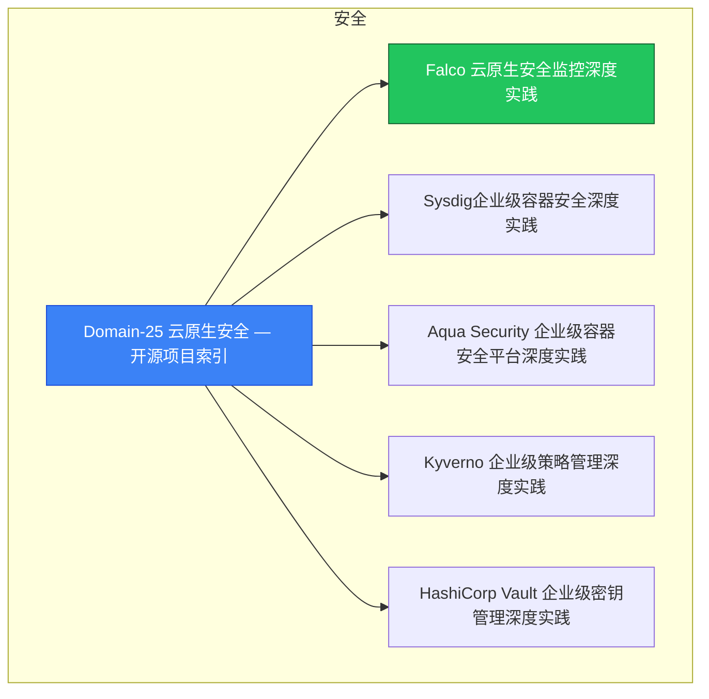

> **生产环境安全提示**
>
> 本文档包含可直接执行的运维命令。执行前请确认：当前目标集群与 Namespace 是否正确；是否具备足够的 RBAC 权限；是否已在非生产环境验证。命令风险等级标注：🔴 高风险（可能造成数据丢失或服务中断）、🟡 中风险（会修改集群状态，但通常可回滚）、🟢 低风险/只读（信息收集，无副作用）。

# 安全 MOC

> **MOC 版本**: 1.0
> **知识域**: 安全
> **文档数量**: 16 篇
> **最后更新**: 2026-05-21
> **用途**: 本知识域的导航入口，汇总所有相关文档、关联领域、和场景入口

---

## 领域概述

云原生安全 — 供应链安全、运行时安全、合规

### 知识域定位

| 维度 | 说明 |
|---|---|
| **知识域** | 安全 |
| **文档数量** | 16 篇 |
| **难度分布** | 入门 0 / 进阶 0 / 高级 0 / 专家 0 |

---

## 文档清单

| # | 文档 | 难度 | 标签 | 估计阅读时间 |
|---|---|---|---|---|
| 1 | [[08-安全/00-总览/00-open-source-projects-index.md|Domain-25 云原生安全 — 开源项目索引]] |  | security, cloud-native |  |
| 2 | Falco 云原生安全监控深度实践 |  | security, cloud-native |  |
| 3 | Sysdig企业级容器安全深度实践 |  | security, cloud-native |  |
| 4 | Aqua Security 企业级容器安全平台深度实践 |  | security, cloud-native |  |
| 5 | Kyverno 企业级策略管理深度实践 |  | security, cloud-native |  |
| 6 | HashiCorp Vault 企业级密钥管理深度实践 |  | security, cloud-native |  |
| 7 | OPA Gatekeeper 策略即代码深度实践 |  | security, cloud-native |  |
| 8 | 容器镜像安全扫描深度实践 |  | security, cloud-native |  |
| 9 | Kubernetes 安全加固深度实践 |  | security, cloud-native |  |
| 10 | gVisor 容器沙箱深度解析 |  | security, cloud-native |  |
| 11 | cert-manager 自动证书管理深度实践 |  | security, cloud-native, guide |  |
| 12 | Falco 运行时安全监控深度实践 |  | security, cloud-native, guide |  |
| 13 | Java 应用 Kubernetes 安全加固深度实践 |  | security, cloud-native, guide |  |
| 14 | Kyverno K8s 原生策略管理实践指南 |  | security, cloud-native, guide |  |
| 15 | OPA Gatekeeper 策略即代码深度实践 |  | security, cloud-native, guide |  |
| 16 | Vault K8s 密钥管理集成深度实践 |  | security, cloud-native, guide |  |

---

## 知识图谱

---

## 关联入口

| 入口 | 说明 |
|---|---|
| FTA 故障树 | 安全 相关故障树分析 |
| Skills 技能 | 安全 相关操作技能 |
| 深度研究入口 | 语料库索引与向量检索 |

---

## 统计信息

| 指标 | 数值 |
|---|---|
| 文档总数 | 16 |
| 覆盖 K8s 版本 | v1.25 - v1.32 |

---

*本文档由 scripts/generate-mocs.py 自动生成，最后更新 2026-05-21。*

## See Also

- [[37-归档/domain-indexes/security/00-open-source-projects-index-from-domain-39.md|00-open-source-projects-index-from-安全]]
- [[37-归档/domain-indexes/security/00-open-source-projects-index-from-domain-7.md|00-open-source-projects-index-from-安全]]
- [[37-归档/domain-indexes/security/MOC-from-domain-39.md|MOC-from-安全]]
- [[37-归档/domain-indexes/security/MOC-from-domain-7.md|MOC-from-安全]]

- [[08-安全/README.md|返回目录]]

<!-- risk-assessed -->
