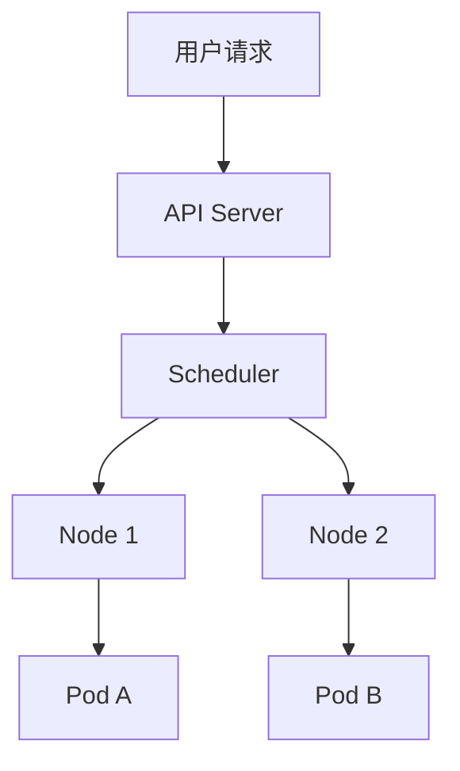

> **生产环境安全提示**
>
> 本文档包含可直接执行的运维命令。执行前请确认：当前目标集群与 Namespace 是否正确；是否具备足够的 RBAC 权限；是否已在非生产环境验证。命令风险等级标注：🔴 高风险（可能造成数据丢失或服务中断）、🟡 中风险（会修改集群状态，但通常可回滚）、🟢 低风险/只读（信息收集，无副作用）。


# 内容创作规范指南

> **定位**: 统一所有发布内容的写作风格、格式标准、质量要求
> **适用范围**: 方案一（AI Infra 系列）和方案二（K8S ACK 系列）的全部文章
> **最后更新**: 2026-05

---

## 一、写作风格指南

### 1.1 语言风格

本系列文章采用"中文为主，英文为辅"的双语风格，具体规则如下：

| 场景 | 使用语言 | 示例 |
|:---|:---|:---|
| 叙述性文字 | 中文 | "Kubernetes 的控制平面由三个核心组件构成" |
| 技术术语 | 英文（首次出现时附中文注释） | "API Server（API 服务器）" |
| 产品/项目名称 | 英文 | "vLLM / TGI / Prometheus / Grafana" |
| 命令和代码 | 英文 | `kubectl get pods -n kube-system` |
| 配置参数 | 英文 | `--max-requests=100` |
| 缩写 | 英文，首次附全称 | "LLM（Large Language Model）" |
| 版本号 | 英文 | "Kubernetes 1.29" |

**核心原则**：
- 避免过度中文化技术术语，如不说"库伯奈特斯"而说"Kubernetes"
- 避免全英文堆砌，适当用中文解释技术概念的"为什么"
- 保持语言的准确性和专业性，不用网络流行语
- 用"我们"代替"我"（部分场景除外，如工单经验分享时可用"我"）

### 1.2 语气与口吻

本系列文章的语气应该体现以下特质：

| 特质 | 说明 | 示例 |
|:---|:---|:---|
| **专业** | 技术内容准确，不敷衍 | 使用具体数据和配置，而非模糊描述 |
| **务实** | 来源于生产实践，不空谈 | "在处理 ACK 工单时，我们发现..." |
| **谦逊** | 分享经验而非说教 | "以下是我们的实践，欢迎讨论" |
| **热情** | 对技术充满好奇心 | "这个方案的效果出乎意料地好" |
| **严谨** | 区分事实和观点 | "建议..."而非"一定要..." |

### 1.3 禁用表达

以下表达应避免使用：

| 禁用表达 | 替代表达 | 原因 |
|:---|:---|:---|
| "众所周知" | 直接陈述事实 | 傲慢，读者可能不知道 |
| "很简单" | 删除或提供具体步骤 | 对新手不友好 |
| "你应该" | "建议" 或 "推荐" | 说教感太强 |
| "最佳实践"（滥用） | "生产实践" 或 "推荐方案" | 过于绝对，世上没有最佳 |
| "轻轻松松" | 删除或描述具体效果 | 不专业 |
| "一站式"（滥用） | "系统性" 或 "完整" | 过度营销感 |
| "秒杀" | "显著优于" | 不专业 |

---

## 二、文章模板

### 2.1 标准文章模板

每篇文章应遵循以下标准结构：

```markdown
# [系列名] 第 X 篇：[文章标题]

> 本文是「[系列总名称]」系列第 XX/[总篇数] 篇
> 系列总纲：[链接]
> 上一篇：[链接] | 下一篇：[链接]

## 工单场景导入 / 背景引入
（1-2 个真实场景，让读者产生共鸣）
（方案二使用工单场景，方案一使用技术背景）

---

## 一、[核心概念/背景介绍]
（是什么：定义、背景、为什么需要）

## 二、[核心内容 A]
（怎么做：原理、架构、配置）

## 三、[核心内容 B]
（怎么做：实践、示例、配置）

## 四、[进阶内容]
（深入：性能调优、高级配置、边缘场景）

## 五、踩坑指南 / 常见问题
（排坑：生产环境中遇到的问题和解决方案）

## 六、总结与最佳实践
（总结：要点回顾、推荐方案、后续方向）

---

## 关联阅读
- 本系列其他文章：[链接列表]
- 跨系列关联：[相关系列链接]
- 外部参考：[官方文档链接]

## 互动话题
（1-2 个引导讨论的话题）
```

### 2.2 总纲帖模板

```markdown
# [系列总标题]

> [一句话定位]
> [核心数据：X 篇、Y 个系列、Z 周发布]

## 为什么写这个系列
（个人背景 + 动机 + 价值主张）

## 系列全景图
（架构图或思维导图）
（系列目录树，每系列附一句话说明）

## 阅读路径推荐
（按角色/场景推荐不同的阅读顺序）

## 核心数据
（知识库规模、覆盖范围等量化数据）

## 语料导入说明
（如何将文档导入 Qoder IDE）

## 互动承诺
（评论区答疑承诺、更新计划）
```

### 2.3 工具手册模板

```markdown
# [工具名] 速查手册

> 本手册覆盖 [X] 个 [类型]，按 [分类维度] 排列
> 建议收藏备用，遇到问题时快速检索

## 使用说明
（如何使用本手册）

## 分类索引
（按类别组织的完整索引）

## 详细条目
### 条目 1
- **触发场景**：
- **根因分析**：
- **排查命令**：
- **解决方案**：
- **预防措施**：

## 附录
（补充信息、交叉引用）
```

---

## 三、格式规范

### 3.1 标题层级

| 层级 | 用途 | 格式 | 示例 |
|:---:|:---|:---|:---|
| H1 `#` | 文章标题 | 粗体，单独一行 | `# 系列名 第 1 篇：文章标题` |
| H2 `##` | 主要章节 | 粗体，带编号 | `## 一、背景介绍` |
| H3 `###` | 子章节 | 粗体 | `### 3.1 配置步骤` |
| H4 `####` | 细节说明 | 粗体 | `#### 注意事项` |

**规则**：
- 一篇文章只有一个 H1（文章标题）
- H2 使用中文数字编号：一、二、三、四...
- H3 使用阿拉伯数字编号：1.1、1.2、2.1...
- 标题层级不跳级（H1 下不能直接跟 H3）
- 标题末尾不加句号

### 3.2 代码块规范

| 代码类型 | 语言标记 | 示例 |
|:---|:---|:---|
| Shell 命令 | ` ```bash ` | kubectl/Shell 命令 |
| YAML 配置 | ` ```yaml ` | K8S 资源配置 |
| Go 代码 | ` ```go ` | Controller 代码 |
| Python 代码 | ` ```python ` | 脚本和工具 |
| 输出日志 | ` ```text ` 或 ` ```console ` | 命令输出 |
| 无标记 | ` ``` ` | 通用代码块 |

**代码块规则**：
- 每个代码块必须有语言标记（便于语法高亮）
- 关键命令和参数添加注释说明
- 超过 50 行的代码块考虑折叠或分段展示
- 生产环境的命令需要标注版本和日期

```yaml
# ✅ 好的示例：有注释、有上下文
apiVersion: v1
kind: Pod
metadata:
  name: gpu-pod
spec:
  containers:
  - name: cuda-container
    resources:
      limits:
        nvidia.com/gpu: 2  # 请求 2 块 GPU
```

### 3.3 表格规范

| 规范 | 说明 | 示例 |
|:---|:---|:---|
| 表头必须加粗 | 所有表格的第一行是表头 | `| **参数** | **说明** |` |
| 对齐方式 | 左对齐为主，数字列右对齐 | `|:---|---:|` |
| 复杂表格 | 避免过度嵌套 | 用列表或多个简单表格替代 |
| 空单元格 | 用 `-` 或 `N/A` 标注 | `| - | N/A |` |

### 3.4 强调和标记

| 格式 | 用途 | 示例 |
|:---|:---|:---|
| `行内代码` | 命令、参数、文件名、技术术语 | `kubectl get nodes` |
| **粗体** | 重点强调、关键结论 | **这是最重要的配置** |
| *斜体* | 次要强调、英文术语 | *Best Effort* |
| > 引用块 | 注意事项、警告、引用 | > 注意：此操作不可逆 |
| ⚠️ | 警告（仅在关键安全警告时使用） | ⚠️ 生产环境请先在测试环境验证 |

### 3.5 列表规范

```markdown
无序列表（平行关系）：
- 项目 A
- 项目 B
- 项目 C

有序列表（步骤/优先级）：
1. 第一步
2. 第二步
3. 第三步

嵌套列表（最多 3 层）：
- 大类
  - 子类
    - 具体项
```

---

## 四、内容创作流程

### 4.1 标准创作流程

```
Step 1：选题确认（15 min）
├── 确认本篇在系列中的位置和衔接关系
├── 回顾原始文档，提取核心内容
└── 设计工单场景导入或技术背景引入

Step 2：结构设计（30 min）
├── 根据模板确定文章结构
├── 列出各章节的核心要点
├── 确定需要包含的代码块、图表、表格
└── 设计互动话题

Step 3：内容填充（60-120 min）
├── 按章节填充内容
├── 从原始文档中提取和改写
├── 补充工单场景和实战经验
└── 添加代码块和配置示例

Step 4：质量打磨（30-60 min）
├── 检查技术准确性
├── 优化表达和排版
├── 补充图表和架构图
└── 检查格式规范

Step 5：审核发布（15-30 min）
├── 自检清单逐项验证
├── 优化标题和摘要
├── 添加关联链接和导航
└── 定时发布
```

### 4.2 不同文章类型的创作要点

| 文章类型 | 创作要点 | 时间占比 |
|:---|:---|:---|
| **概念解析类** | 定义清晰、类比恰当、图表辅助、由浅入深 | 原理 60% + 实践 40% |
| **实战操作类** | 步骤清晰、命令可执行、输出可复现、错误可处理 | 原理 20% + 实践 80% |
| **对比分析类** | 维度全面、数据客观、结论明确、适用场景标注 | 对比 70% + 建议 30% |
| **故障排查类** | 现象→原因→命令→方案，形成完整排查链 | 场景 30% + 排查 70% |
| **工具手册类** | 分类清晰、索引方便、内容准确、定期更新 | 结构 40% + 内容 60% |

---

## 五、质量检查清单

### 5.1 发布前自检清单

每篇文章发布前，必须逐项确认以下清单：

#### 内容质量

| # | 检查项 | 通过标准 |
|:---:|:---|:---|
| 1 | 技术准确性 | 所有命令可在对应版本执行，所有配置可直接使用 |
| 2 | 内容完整性 | 覆盖"是什么-为什么-怎么做-踩坑指南"四个维度 |
| 3 | 逻辑连贯性 | 章节之间逻辑递进，无跳跃和重复 |
| 4 | 实用性 | 至少 1 个可直接使用的配置/脚本/命令 |
| 5 | 原创性 | 核心观点和经验原创，引用内容标明出处 |

#### 格式规范

| # | 检查项 | 通过标准 |
|:---:|:---|:---|
| 6 | 标题层级 | 层级正确，不跳级，编号连续 |
| 7 | 代码块 | 有语言标记，有注释，格式正确 |
| 8 | 表格 | 表头完整，对齐正确，无空行 |
| 9 | 链接 | 导航链接完整，无死链 |
| 10 | 术语 | 技术术语使用一致，首次出现有注释 |

#### 安全合规

| # | 检查项 | 通过标准 |
|:---:|:---|:---|
| 11 | 无敏感信息 | 无密钥、密码、内网地址、客户数据 |
| 12 | 无安全隐患 | 命令和配置不会导致生产事故 |
| 13 | 版本标注 | 技术版本信息标注日期和版本号 |
| 14 | 免责声明 | 危险操作附"先在测试环境验证"提示 |

#### 互动设计

| # | 检查项 | 通过标准 |
|:---:|:---|:---|
| 15 | 互动话题 | 1-2 个可引导讨论的话题 |
| 16 | 关联阅读 | 本系列和跨系列链接完整 |
| 17 | 系列导航 | 上一篇/下一篇链接正确 |

### 5.2 同行评审检查清单

| # | 检查维度 | 评审要点 |
|:---:|:---|:---|
| 1 | 技术深度 | 内容是否足够深入？有无浅尝辄止？ |
| 2 | 表达清晰 | 是否容易理解？有无歧义？ |
| 3 | 场景真实 | 工单场景是否真实可信？ |
| 4 | 命令有效 | 关键命令是否已验证？ |
| 5 | 遗漏内容 | 是否有明显的知识点遗漏？ |

---

## 六、图表设计规范

### 6.1 架构图规范

| 规范项 | 要求 |
|:---|:---|
| 格式 | Mermaid 图 或 SVG/ASCII 图 |
| 配色 | 使用技术蓝色调为主色 |
| 层次 | 从上到下、从左到右 |
| 标注 | 关键组件必须有简短说明 |
| 一致性 | 同系列文章使用一致的图例和配色 |

### 6.2 Mermaid 图示例



### 6.3 对比表设计

对比分析类文章应包含以下维度的对比：

| 对比维度 | 说明 |
|:---|:---|
| 架构设计 | 各方案的架构差异 |
| 性能表现 | Benchmark 数据对比 |
| 功能覆盖 | 功能矩阵对比 |
| 易用性 | 上手难度和运维复杂度 |
| 社区生态 | 社区活跃度、文档完善度 |
| 生产就绪 | 生产环境使用的成熟度 |
| 适用场景 | 最佳适用场景推荐 |

---

## 七、版本管理与更新规范

### 7.1 版本标注

每篇文章必须在头部标注以下信息：

```markdown
> **技术版本**: Kubernetes 1.29 / vLLM 0.6.x / ...
> **撰写日期**: 2026-05-XX
> **最后更新**: 2026-05-XX
> **适用范围**: ACK 1.28+ / 自建 K8S 1.27+
```

### 7.2 更新策略

| 更新类型 | 触发条件 | 更新频率 | 标注方式 |
|:---|:---|:---|:---|
| **勘误更新** | 发现技术错误 | 即时 | 更新"最后更新"日期 |
| **版本更新** | 对应技术版本升级 | 按需 | 更新"技术版本"和"最后更新" |
| **补充更新** | 新增内容或案例 | 季度 | 更新"最后更新"，文末加"[更新日志]" |
| **重构更新** | 文章结构大幅调整 | 半年 | 新版本号，保留旧版链接 |

### 7.3 内容保鲜机制

- **月度巡检**：每月检查阅读量 Top 10 文章的技术版本是否过时
- **季度更新**：每季度对核心系列文章进行版本兼容性检查
- **社区反馈**：根据评论反馈及时修正错误内容

---

## 八、写作效率提升技巧

### 8.1 内容复用策略

| 复用方式 | 说明 | 示例 |
|:---|:---|:---|
| **系列内复用** | 基础概念在首篇讲透，后续引用 | "关于 RBAC 的基础概念，请参见系列五 5.1" |
| **跨系列复用** | 不同系列的相同知识点交叉引用 | "GPU 监控的详细配置见方案一系列二" |
| **模板复用** | 相似结构文章使用统一模板 | 故障排查类文章统一结构 |
| **代码复用** | 常用命令和配置提取为"标准代码块" | kubectl 排障命令集 |

### 8.2 AI 辅助创作

在保证原创性和准确性的前提下，可以使用 AI 工具辅助以下环节：

| 环节 | AI 辅助方式 | 注意事项 |
|:---|:---|:---|
| 大纲生成 | 基于原始文档生成初步大纲 | 必须人工审核和调整 |
| 格式优化 | 优化 Markdown 格式和排版 | 检查是否破坏原有结构 |
| 代码注释 | 为代码块生成注释 | 验证注释的准确性 |
| 摘要生成 | 生成文章摘要和关键要点 | 人工改写，确保准确 |
| 检查校对 | 检查错别字、格式错误 | 不能替代人工技术审核 |

**重要提示**：AI 生成的技术内容必须经过人工验证后才能发布。技术准确性是不可妥协的底线。

### 8.3 批量创作策略

对于需要密集发布的系列（如系列四 LLM 推理 6 篇），建议采用批量创作策略：

1. **集中调研**：一次性完成整个系列的资料收集和结构设计
2. **批量初稿**：集中 2-3 天完成整个系列的初稿
3. **统一审核**：一起审核，确保系列内的内容连贯和一致
4. **定时发布**：按计划定时发布，保持节奏

---

## 九、内容安全红线

### 9.1 绝对禁止

| # | 禁止项 | 原因 | 替代方案 |
|:---:|:---|:---|:---|
| 1 | 发布真实密钥、Token、密码 | 安全风险 | 使用 `YOUR_API_KEY` 占位 |
| 2 | 发布内网 IP 和域名 | 信息泄露 | 使用 `10.x.x.x` 或 `example.com` |
| 3 | 发布客户数据和业务数据 | 隐私合规 | 使用模拟数据 |
| 4 | 发布未授权的内部架构图 | 保密要求 | 重新绘制公开版本 |
| 5 | 发布未经验证的命令 | 可能导致事故 | 本地验证后再发布 |

### 9.2 谨慎处理

| # | 谨慎项 | 处理方式 |
|:---:|:---|:---|
| 1 | 性能数据 | 标注测试环境和条件，说明"仅供参考" |
| 2 | 工单案例 | 脱敏处理，去除可识别信息 |
| 3 | 安全漏洞 | 负责任披露，不提供攻击脚本 |
| 4 | 成本数据 | 使用相对值或范围，避免绝对金额 |


<!-- risk-assessed -->
