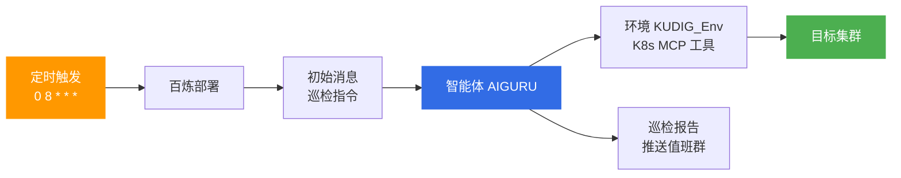

# 百炼智能体每日巡检部署配置

> 面向 SRE 的百炼智能体「部署」功能配置指南：将集群每日巡检交给云端智能体定时执行，巡检标准与知识库《生产环境日常巡检与值班手册》对齐。

## 一、功能定位

百炼控制台 → **部署**：配置智能体的自动化部署，支持**定时或手动触发运行**。每次触发时，平台将「初始消息」作为初始用户消息发送给智能体（1 到 50 条），智能体在其环境（Environment）中调用已绑定的工具（MCP 等）完成任务。

每日巡检的典型链路：



---

## 二、创建部署表单填写

| 字段 | 推荐填写 | 说明 |
|------|----------|------|
| **名称** | KUDIG - 每日巡检 | 标识用途 |
| **描述** | 每天早上 8 点自动执行集群巡检，按《生产环境日常巡检与值班手册》生成巡检报告 | 可选，建议填写 |
| **智能体** | AIGURU | 已挂载 KUDIG 知识库与运维技能的智能体 |
| **环境** | KUDIG_Env | 需已绑定 Kubernetes MCP 工具，见 [02-本地集群接入方案.md](02-本地集群接入方案.md) |
| **密钥** | AG-KEY | 注入环境所需 API Key |
| **初始消息** | 见下方模板 | **核心配置**，决定"巡什么、怎么巡" |

---

## 三、初始消息模板（直接复制）

阈值与知识库巡检手册对齐（CPU<80%、内存<85%、重启<3），避免两套标准：

```text
请执行今日集群每日巡检，并生成《每日巡检报告》，检查标准遵循《生产环境日常巡检与值班手册》：

1. 节点巡检：所有节点 Ready；CPU < 80%、内存 < 85%；无 DiskPressure/MemoryPressure/PIDPressure
2. Pod 巡检：全命名空间无 CrashLoopBackOff/Error/Pending；列出重启次数 ≥ 3 的 Pod；汇总过去 24 小时 Warning 事件
3. 工作负载：Deployment/StatefulSet/DaemonSet 无不可用副本
4. 存储：PVC 全部 Bound；列出磁盘使用率 > 80% 的卷；检查昨日备份快照执行结果
5. 网络：无 Endpoints 为空的 Service；CoreDNS/kube-proxy/CNI 组件正常；列出 30 天内到期的 Ingress TLS 证书
6. 控制平面：API Server 的 /healthz、/livez、/readyz 均为 ok；etcd 健康
7. ACK 专项：节点池扩缩状态正常；识别按量付费闲置节点（成本巡检）

输出要求：
- 按 🔴 严重 / 🟡 警告 / 🟢 正常 三档分类，异常项附关键证据（命令输出或指标）
- 每个异常项给出处理建议，并引用知识库对应排障文档
- 末尾附总体健康评分（满分 100）和一句话摘要，格式可直接推送到值班群
```

> **本地 kind 集群适配**：删除第 7 条「ACK 专项」；控制平面检查保留（kind 为自管控制面，检查项比 ACK 更全）。详见 [02-本地集群接入方案.md](02-本地集群接入方案.md)。

---

## 四、调度配置（创建后）

在部署列表找到该部署 → **调度配置**：

| 配置项 | 推荐值 | 说明 |
|--------|--------|------|
| **触发方式** | 定时触发 | Cron 调度 |
| **调度表达式** | `0 8 * * *` | 每天早上 8 点，与知识库巡检 CronJob 时间一致 |
| **时区** | Asia/Shanghai | 避免 UTC 偏差 |

**验收流程**：先**手动触发**一次验证报告格式与工具调用链路，确认无误后再开启定时。

---

## 五、配置前置检查

| 检查项 | 要求 | 原因 |
|--------|------|------|
| **环境工具权限** | KUDIG_Env 接入的 kubectl / OpenAPI 工具仅授予**只读**权限 | 避免智能体巡检时误执行变更类命令（🟡/🔴 风险命令） |
| **密钥权限** | AG-KEY 对应账号具备集群监控、事件的读权限 | 巡检无需写权限 |
| **推送通道** | 如智能体支持 Webhook 工具，在初始消息末尾追加"巡检完成后将报告推送到钉钉值班群" | 闭环送达 |

---

## 六、巡检标准来源

初始消息中的检查项与阈值来源于知识库既有标准，保持单一事实源：

| 检查域 | 阈值标准 | 知识库文档 |
|--------|----------|------------|
| 节点 | All Ready；CPU<80%、内存<85%；无资源压力 | [[13-生产运维/07-运维手册/01-production-sre-daily-ops.md\|生产环境日常巡检与值班手册]] |
| Pod | 无 CrashLoopBackOff/Error；Restart<3 | 同上 |
| 存储/网络 | PVC Bound；Endpoints 非空；TLS 证书有效期 | 同上 |
| 控制平面 | /healthz、/livez、/readyz；etcd 健康 | [[09-可观测性/00-总览/05-cluster-health-check.md\|集群健康检查指南]] |
| 告警分级 | P0 5分钟 / P1 15分钟 / P2 30分钟 | 值班手册 |

---

## 七、相关文档

- [02-本地集群接入方案.md](02-本地集群接入方案.md) — 本地 kind 集群接入百炼智能体
- [index.md](index.md) — 百炼智能体目录导航
- [[18-云厂商/01-阿里云/公共云/index.md|公共云架构与方案]] — 产品选型与架构方案

---

> **文档版本**: v1.0  
> **最后更新**: 2026-08-26  
> **适用对象**: 云原生架构师、SRE、值班工程师
