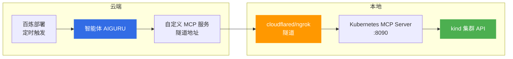

# 百炼智能体本地集群接入方案

> 本地 kind 集群接入百炼智能体的打通方案。核心矛盾：**kind 集群在本地 Docker 里，百炼智能体在云端，云端访问不到本机的 `127.0.0.1`**。本文给出拉/推两种模式与完整配置。

## 一、可行性结论

能实现。"接入"有两个方向，二选一：

| 模式 | 链路 | 特点 |
|------|------|------|
| **拉模式（推荐）** | 云端智能体 → 隧道 → 本地 MCP Server → kind API | 沿用百炼「部署」定时能力，智能体主动巡检 |
| **推模式** | 本地脚本/CronJob 采集 → 调百炼应用 API → 智能体分析 | 不暴露本地集群，更安全；调度在本地侧 |

---

## 二、方案一：Kubernetes MCP + 内网穿透（拉模式）



### 2.1 第 1 步：给 kind 建只读巡检账号

**安全底线**：即使隧道泄露，也只有读权限。

```yaml
# inspection-reader.yaml
apiVersion: v1
kind: ServiceAccount
metadata:
  name: inspection-reader
  namespace: kube-system
---
apiVersion: rbac.authorization.k8s.io/v1
kind: ClusterRole
metadata:
  name: inspection-reader
rules:
- apiGroups: [""]
  resources: [pods, nodes, services, endpoints, persistentvolumeclaims, events, namespaces]
  verbs: [get, list, watch]
- apiGroups: ["apps"]
  resources: [deployments, statefulsets, daemonsets, replicasets]
  verbs: [get, list, watch]
- apiGroups: ["networking.k8s.io"]
  resources: [ingresses, networkpolicies]
  verbs: [get, list, watch]
- apiGroups: ["metrics.k8s.io"]
  resources: [pods, nodes]
  verbs: [get, list]
---
apiVersion: rbac.authorization.k8s.io/v1
kind: ClusterRoleBinding
metadata:
  name: inspection-reader
roleRef:
  apiGroup: rbac.authorization.k8s.io
  kind: ClusterRole
  name: inspection-reader
subjects:
- kind: ServiceAccount
  name: inspection-reader
  namespace: kube-system
```

```bash
# 🟢 低风险：只读账号创建与 token 生成
kubectl apply -f inspection-reader.yaml
TOKEN=$(kubectl -n kube-system create token inspection-reader --duration=2160h)
# 用该 token 生成一份独立 kubeconfig（~/.kube/inspection.yaml），勿用管理员 kubeconfig
```

### 2.2 第 2 步：本地起 Kubernetes MCP Server

选择支持 HTTP 远程连接的 Kubernetes MCP Server（如 `kubernetes-mcp-server`），指向只读 kubeconfig：

```bash
KUBECONFIG=~/.kube/inspection.yaml kubernetes-mcp-server --port 8090
```

### 2.3 第 3 步：内网穿透拿公网地址

```bash
cloudflared tunnel --url http://localhost:8090   # 或 ngrok http 8090
# 得到 https://xxx.trycloudflare.com
```

### 2.4 第 4 步：百炼控制台接入

1. 左侧菜单 **MCP** → 创建自定义 MCP 服务 → 选「远程连接」
2. 粘贴隧道地址（streamable HTTP / SSE，按 Server 支持选择）→ 测试连接
3. 将该 MCP 加入环境 **KUDIG_Env** → 智能体 AIGURU 即拥有操作 kind 集群的工具

### 2.5 第 5 步：初始消息 kind 适配

- **删除**「ACK 专项」检查项（kind 没有节点池/按量节点）
- **保留**控制平面检查（kind 为自管控制面，`/healthz`、`/livez`、`/readyz` 都能查，比 ACK 还全）
- 完整模板见 [01-每日巡检部署配置.md](01-每日巡检部署配置.md)

---

## 三、方案二：本地推送百炼 API（推模式）

本地 cron 或 kind 内 CronJob 运行巡检脚本（见知识库值班手册的每日巡检脚本），将原始输出通过**百炼应用 API** 发送给 AIGURU，由智能体生成报告并推送钉钉。

| 维度 | 拉模式 | 推模式 |
|------|--------|--------|
| 集群暴露 | 需隧道暴露（只读+鉴权缓解） | 不暴露，仅出站 HTTPS |
| 调度位置 | 云端部署定时 | 本地 cron/CronJob |
| 智能体主动性 | 主动调用工具巡检 | 被动分析推送数据 |
| 适用场景 | 想沿用百炼部署定时能力 | 安全要求高、不愿穿透 |

---

## 四、kind 适配注意事项

### 4.1 metrics-server 默认未安装

`kubectl top` 会失败，资源水位检查依赖它。安装并适配 kind：

```bash
# 🟡 中风险：安装组件并修改其部署参数，仅影响 metrics-server
kubectl apply -f https://github.com/kubernetes-sigs/metrics-server/releases/latest/download/components.yaml
kubectl -n kube-system patch deploy metrics-server --type=json -p='[
  {"op":"add","path":"/spec/template/spec/containers/0/args/-","value":"--kubelet-insecure-tls"},
  {"op":"add","path":"/spec/template/spec/containers/0/args/-","value":"--kubelet-preferred-address-types=InternalIP,Hostname,ExternalIP"}]'
```

### 4.2 检查项差异

| 检查项 | kind | 生产 ACK |
|--------|------|----------|
| 控制平面健康端点 | ✅ 可查（自管） | ⚠️ 托管面不可直连，用 ACK 诊断/OpenAPI |
| 节点 Conditions | ✅ | ✅ |
| ACK 专项（节点池/闲置节点） | ❌ 删除 | ✅ |
| Ingress TLS 证书 | 需先装 ingress-nginx | ✅ |

---

## 五、安全提醒

| 措施 | 说明 |
|------|------|
| **只读 RBAC** | MCP Server 必须使用只读 kubeconfig，禁用管理员凭据 |
| **隧道鉴权** | cloudflared 加 Access 策略，ngrok 开 auth token，避免巡检接口裸奔公网 |
| **token 有效期** | `--duration` 按需设置，定期轮换 |
| **环境隔离** | kind 为测试集群，先跑通链路；生产集群不建议走隧道 |

---

## 六、演进路径

1. **验证期**：kind + 方案一，手动触发验证工具调用与报告格式
2. **试用期**：开启每日定时，观察一周报告质量
3. **生产期**：接生产 ACK 时，把 MCP 工具换成**阿里云 OpenAPI / STAROps**（无需隧道），初始消息恢复「ACK 专项」

---

## 七、相关文档

- [01-每日巡检部署配置.md](01-每日巡检部署配置.md) — 部署表单、初始消息模板、调度配置
- [index.md](index.md) — 百炼智能体目录导航
- [[13-生产运维/07-运维手册/01-production-sre-daily-ops.md|生产环境日常巡检与值班手册]] — 巡检标准与 CronJob 脚本
- [[09-可观测性/00-总览/05-cluster-health-check.md|集群健康检查指南]] — 健康检查命令矩阵

---

> **文档版本**: v1.0  
> **最后更新**: 2026-08-26  
> **适用对象**: 云原生架构师、SRE、平台工程师
