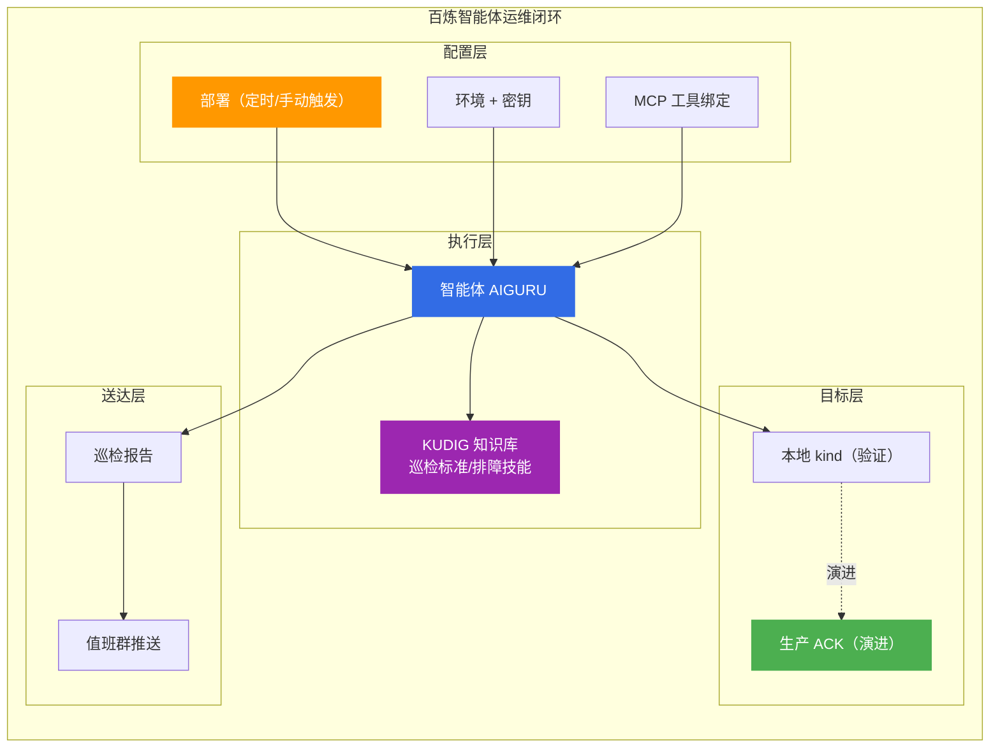

# 阿里云百炼智能体

> 百炼智能体平台运维实践知识轨：将 KUDIG 知识库的巡检标准、排障技能交给云端智能体定时执行，实现 Agentic Ops 闭环。

## 文档索引

| # | 文档 | 说明 | 状态 |
|---|------|------|------|
| 01 | [01-每日巡检部署配置.md](01-每日巡检部署配置.md) | 部署表单、初始消息模板、调度配置、前置检查 | ✅ |
| 02 | [02-本地集群接入方案.md](02-本地集群接入方案.md) | kind 集群 MCP + 隧道拉模式 / 推送 API 推模式 | ✅ |

## 核心场景

## 设计原则

| 原则 | 说明 |
|------|------|
| **单一事实源** | 巡检阈值（CPU<80%、内存<85%、Restart<3）统一来自知识库值班手册，初始消息不另立标准 |
| **只读底线** | 智能体工具仅授予只读权限，巡检不执行变更类命令 |
| **先验证后定时** | 手动触发验证链路 → 再开启每日定时 |
| **测试到生产** | kind 跑通链路 → 生产换 OpenAPI/STAROps 工具，无需隧道 |

## 相关目录

- [[18-云厂商/01-阿里云/公共云/index.md|公共云/]] — 产品选型与架构方案
- [[18-云厂商/01-阿里云/公有云-ACK/index.md|公有云-ACK/]] — ACK 容器服务运维
- [[13-生产运维/07-运维手册/01-production-sre-daily-ops.md|生产环境日常巡检与值班手册]] — 巡检标准来源
- [[09-可观测性/00-总览/05-cluster-health-check.md|集群健康检查指南]] — 健康检查命令矩阵

---

> **文档版本**: v1.0  
> **最后更新**: 2026-08-26  
> **维护者**: 云原生架构师知识库
