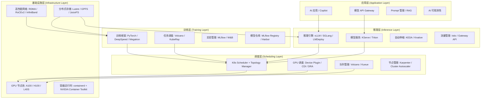

> **生产环境安全提示**
>
> 本文档包含可直接执行的运维命令。执行前请确认：当前目标集群与 Namespace 是否正确；是否具备足够的 RBAC 权限；是否已在非生产环境验证。命令风险等级标注：🔴 高风险（可能造成数据丢失或服务中断）、🟡 中风险（会修改集群状态，但通常可回滚）、🟢 低风险/只读（信息收集，无副作用）。

# 企业 AI 平台参考架构

## 概述

企业 AI 平台是将 AI/ML 能力从实验性项目转化为规模化生产系统的技术底座。一个成熟的 AI 平台需要解决五大核心问题：如何高效管理异构计算资源（GPU/NPU/CPU）、如何支撑大规模分布式训练、如何保障推理服务的 SLA、如何实现多团队安全协作、如何持续优化成本效率。

本文提供一套经过生产验证的五层参考架构，覆盖从底层基础设施到上层应用的全栈设计，并给出各层的技术选型矩阵、数据流设计、多租户隔离方案、安全合规框架和分阶段建设路线图。该架构适用于中大型企业（50+ AI 工程师、100+ GPU 卡规模）的 AI 平台建设。

## 架构与核心概念

### 五层分层架构



### 各层职责与边界

| 层级 | 核心职责 | 关键 SLA | 负责团队 |
|------|---------|---------|---------|
| 基础设施层 | 硬件资源供给、网络互联、存储挂载 | 节点可用率 99.9% | 基础设施 / SRE |
| 调度层 | 资源分配、队列管理、拓扑感知 | 调度延迟 < 5s | 平台工程 |
| 训练层 | 分布式训练、实验管理、模型版本 | 训练任务成功率 > 95% | ML 平台 |
| 推理层 | 模型部署、弹性伸缩、流量管理 | P99 延迟 < 3s, 可用率 99.95% | ML 平台 / SRE |
| 应用层 | API 网关、Prompt 管理、可观测性 | API 可用率 99.99% | 应用开发 |

## 生产部署

### 技术选型矩阵

#### 基础设施层选型

| 组件 | 选项 A（推荐） | 选项 B | 选项 C | 选型考量 |
|------|--------------|--------|--------|---------|
| GPU | NVIDIA A100/H100 | NVIDIA L40S | 华为 Ascend 910B | 生态成熟度、供应链 |
| 网络 | RoCEv2 (ConnectX-7) | InfiniBand NDR | TCP + eRDMA | 训练规模、预算 |
| 存储 | JuiceFS + 对象存储 | Lustre | GPFS | 运维复杂度、性能 |
| 容器运行时 | containerd 1.7+ | CRI-O | - | K8s 兼容性 |
| GPU 管理 | NVIDIA GPU Operator | 手动部署 | - | 运维自动化 |

#### 调度层选型

| 组件 | 选项 A（推荐） | 选项 B | 选项 C | 选型考量 |
|------|--------------|--------|--------|---------|
| 批调度 | Volcano | Kueue | YuniKorn | Gang Scheduling 支持 |
| GPU 分配 | Device Plugin + CDI | DRA (Beta) | - | 生产稳定性 |
| 节点伸缩 | Karpenter | Cluster Autoscaler | - | 响应速度、成本 |
| 队列管理 | Volcano Queue | Kueue ClusterQueue | - | 多租户公平性 |

#### 训练层选型

| 组件 | 选项 A（推荐） | 选项 B | 选项 C | 选型考量 |
|------|--------------|--------|--------|---------|
| 训练框架 | PyTorch + DeepSpeed | Megatron-LM | ColossalAI | 模型规模、团队熟悉度 |
| Ray 集成 | KubeRay | Ray on VM | - | K8s 原生集成 |
| 实验管理 | MLflow | Weights & Biases | Neptune | 私有化部署需求 |
| 模型仓库 | MLflow Registry | Harbor + 自定义 | HuggingFace Hub | 安全合规 |

#### 推理层选型

| 组件 | 选项 A（推荐） | 选项 B | 选项 C | 选型考量 |
|------|--------------|--------|--------|---------|
| 推理引擎 | vLLM | SGLang / LMDeploy | TensorRT-LLM | 模型兼容性、性能 |
| 模型服务 | KServe | Triton Inference Server | 裸 Deployment | 多模型管理、A/B 测试 |
| 自动伸缩 | KEDA + Knative | HPA | Karpenter | 伸缩粒度、scale-to-zero |
| 流量管理 | Istio + Gateway API | Nginx Ingress | Envoy Gateway | 灰度发布、流量镜像 |

### 数据流架构

🟢 **只读** — 端到端数据流验证命令：

```bash
# 验证数据湖 → 训练数据管道连通性
kubectl exec -n data-pipeline deploy/data-loader -- \
  python -c "import pyarrow.parquet as pq; print(pq.read_metadata('/data/lake/features/train.parquet'))"

# 验证模型仓库 → 推理服务模型加载
kubectl exec -n ai-inference deploy/vllm-llama3 -- \
  python -c "import os; print(os.listdir('/models'))"

# 验证推理服务 → 监控指标链路
curl -s http://vllm-llama3-svc.ai-inference.svc:8000/metrics | head -20

# 验证全链路健康
kubectl get pods -n ai-platform -l tier=data -o wide
kubectl get pods -n ai-platform -l tier=training -o wide
kubectl get pods -n ai-platform -l tier=inference -o wide
kubectl get pods -n ai-platform -l tier=application -o wide
```

### 多租户 Namespace 规划

🟡 **中风险** — 创建多租户 Namespace 体系：

```yaml
# 平台基础设施 Namespace
apiVersion: v1
kind: Namespace
metadata:
  name: ai-platform-system
  labels:
    role: platform-infrastructure
    team: ml-platform
    cost-center: "CC-PLATFORM"
---
# 团队 Namespace 模板（以 NLP 团队为例）
apiVersion: v1
kind: Namespace
metadata:
  name: team-nlp
  labels:
    role: team-workspace
    team: nlp
    cost-center: "CC-NLP-001"
    env: production
---
# 共享服务 Namespace
apiVersion: v1
kind: Namespace
metadata:
  name: ai-shared-services
  labels:
    role: shared-services
    team: ml-platform
---
# 推理服务 Namespace（按环境隔离）
apiVersion: v1
kind: Namespace
metadata:
  name: ai-inference-prod
  labels:
    role: inference
    env: production
    team: ml-platform
---
apiVersion: v1
kind: Namespace
metadata:
  name: ai-inference-staging
  labels:
    role: inference
    env: staging
    team: ml-platform
```

### 平台核心组件部署清单

🟡 **中风险** — AI 平台核心组件 Helm 部署脚本：

```bash
#!/bin/bash
# AI 平台核心组件部署（按依赖顺序）
set -euo pipefail

echo "=== Phase 1: 基础设施层 ==="
# NVIDIA GPU Operator
helm upgrade --install gpu-operator nvidia/gpu-operator \
  --namespace gpu-operator --create-namespace \
  --version v24.9.0 \
  --set devicePlugin.enabled=true \
  --set dcgmExporter.enabled=true \
  --wait --timeout 10m

# 存储 CSI Driver（以 JuiceFS 为例）
helm upgrade --install juicefs-csi-driver juicefs/juicefs-csi-driver \
  --namespace kube-system \
  --wait --timeout 5m

echo "=== Phase 2: 调度层 ==="
# Volcano 批调度器
helm upgrade --install volcano volcano-sh/volcano \
  --namespace volcano-system --create-namespace \
  --version 1.9.0 \
  --set scheduler.number=2 \
  --wait --timeout 5m

# Karpenter 节点自动伸缩
helm upgrade --install karpenter oci://public.ecr.aws/karpenter/karpenter \
  --namespace karpenter --create-namespace \
  --version v0.37.0 \
  --wait --timeout 5m

echo "=== Phase 3: 训练层 ==="
# KubeRay Operator
helm upgrade --install kuberay-operator kuberay/kuberay-operator \
  --namespace kuberay-system --create-namespace \
  --version 1.2.0 \
  --wait --timeout 5m

# MLflow（模型仓库 + 实验管理）
helm upgrade --install mlflow community/mlflow \
  --namespace ai-platform-system --create-namespace \
  --set backendStore.type=postgresql \
  --set artifactRoot.type=s3 \
  --wait --timeout 5m

echo "=== Phase 4: 推理层 ==="
# KServe
helm upgrade --install kserve kserve/kserve \
  --namespace kserve --create-namespace \
  --version 0.14.0 \
  --wait --timeout 10m

# KEDA 自动伸缩
helm upgrade --install keda kedacore/keda \
  --namespace keda --create-namespace \
  --version 2.16.1 \
  --wait --timeout 5m

echo "=== Phase 5: 可观测性 ==="
# Prometheus + Grafana（如未部署）
helm upgrade --install prometheus prometheus-community/kube-prometheus-stack \
  --namespace monitoring --create-namespace \
  --set grafana.enabled=true \
  --wait --timeout 10m

echo "=== 部署完成 ==="
kubectl get pods --all-namespaces -l "app.kubernetes.io/part-of=ai-platform" --no-headers | wc -l
```

## 运维操作

### 平台健康巡检

🟢 **只读** — AI 平台全栈健康检查：

```bash
#!/bin/bash
# AI 平台日巡检脚本
echo "====== AI 平台健康巡检 $(date) ======"

echo "--- 1. GPU 节点状态 ---"
kubectl get nodes -l nvidia.com/gpu.present=true -o custom-columns=\
NAME:.metadata.name,STATUS:.status.conditions[-1].type,\
GPU:.status.allocatable.nvidia\\.com/gpu

echo "--- 2. 平台组件状态 ---"
for ns in gpu-operator volcano-system kuberay-system kserve keda monitoring; do
  echo "Namespace: $ns"
  kubectl get pods -n $ns --no-headers 2>/dev/null | \
    awk '{print $1, $2, $3}' | head -5
done

echo "--- 3. GPU 利用率总览 ---"
curl -s 'http://prometheus-server.monitoring.svc:9090/api/v1/query?query=avg(DCGM_FI_DEV_GPU_UTIL)' | \
  jq -r '.data.result[0].value[1] // "N/A"' | xargs -I{} echo "集群平均 GPU 利用率: {}%"

echo "--- 4. 推理服务状态 ---"
kubectl get inferenceservice --all-namespaces -o custom-columns=\
NS:.metadata.namespace,NAME:.metadata.name,READY:.status.conditions[0].status

echo "--- 5. 训练任务队列 ---"
kubectl get jobs -n ai-training --no-headers 2>/dev/null | \
  awk '{print $1, $2, $3}' | head -10

echo "--- 6. 存储容量 ---"
kubectl get pvc --all-namespaces -o custom-columns=\
NS:.metadata.namespace,NAME:.metadata.name,STATUS:.status.phase,\
CAPACITY:.status.capacity.storage | grep -v Bound | head -5

echo "====== 巡检完成 ======"
```

### 容量规划

🟢 **只读** — GPU 资源使用率分析：

```bash
# 各团队 GPU 使用率
for ns in $(kubectl get ns -l role=team-workspace -o jsonpath='{.items[*].metadata.name}'); do
  requested=$(kubectl get pods -n $ns -o json 2>/dev/null | \
    jq '[.items[].spec.containers[].resources.requests["nvidia.com/gpu"] // "0" | tonumber] | add // 0')
  echo "$ns: GPU requested = $requested"
done

# 集群 GPU 总量 vs 已分配
total_gpu=$(kubectl get nodes -l nvidia.com/gpu.present=true -o json | \
  jq '[.items[].status.allocatable["nvidia.com/gpu"] | tonumber] | add')
allocated_gpu=$(kubectl get pods --all-namespaces -o json | \
  jq '[.items[] | select(.status.phase=="Running") | .spec.containers[].resources.requests["nvidia.com/gpu"] // "0" | tonumber] | add // 0')
echo "Total GPU: $total_gpu, Allocated: $allocated_gpu, Utilization: $(echo "scale=1; $allocated_gpu * 100 / $total_gpu" | bc)%"
```

## 故障排查

### 平台级故障定位

**现象**：多个团队同时报告训练任务无法提交或推理服务不可用。

**排查步骤**：

```bash
# 🟢 检查控制平面健康
kubectl get componentstatuses
kubectl get nodes --no-headers | grep -v Ready

# 🟢 检查平台核心组件
kubectl get pods -n gpu-operator -l app=nvidia-device-plugin-daemonset --no-headers | grep -v Running
kubectl get pods -n volcano-system --no-headers | grep -v Running
kubectl get pods -n kserve --no-headers | grep -v Running

# 🟢 检查最近集群事件
kubectl get events --all-namespaces --sort-by='.lastTimestamp' | tail -20

# 🟢 检查 GPU 节点是否有 NotReady 或磁盘压力
kubectl get nodes -o custom-columns=\
NAME:.metadata.name,\
READY:.status.conditions[?(@.type=="Ready")].status,\
DISK:.status.conditions[?(@.type=="DiskPressure")].status,\
MEM:.status.conditions[?(@.type=="MemoryPressure")].status
```

### 模型部署失败

**现象**：InferenceService 创建后一直处于 `Unknown` 状态。

**排查步骤**：

```bash
# 🟢 查看 InferenceService 详情
kubectl describe inferenceservice <name> -n ai-inference-prod

# 🟢 查看 Predictor Pod 状态
kubectl get pods -n ai-inference-prod -l serving.kserve.io/inferenceservice=<name>

# 🟢 查看 Pod 日志（模型加载错误）
kubectl logs -n ai-inference-prod -l serving.kserve.io/inferenceservice=<name> --tail=100

# 🟢 检查 PVC 模型文件是否存在
kubectl exec -n ai-inference-prod deploy/<predictor-pod> -- ls -la /models/
```

## 最佳实践

### 安全与合规

| 安全域 | 措施 | 工具 |
|--------|------|------|
| 网络隔离 | 租户间 NetworkPolicy deny-all | Calico / Cilium |
| 身份认证 | OIDC + RBAC 最小权限 | Dex + Keycloak |
| 镜像安全 | 私有 Registry + 漏洞扫描 | Harbor + Trivy |
| 模型安全 | 模型加密存储 + 访问审计 | Vault + 审计日志 |
| 数据安全 | 训练数据加密 + 脱敏 | LUKS + 数据分类 |
| 合规审计 | 操作审计 + 变更追溯 | Falco + OPA Gatekeeper |

### 成本治理框架

1. **度量层**：OpenCost/Kubecost 归因到团队/项目/模型（参考 [[AI基础设施/K8s-AI基础设施/14-gpu-cost-attribution-multitenant.md|GPU 成本分摊与多租户 AI 平台]]）
2. **预算层**：每团队月度 GPU 预算，ResourceQuota 硬限制
3. **优化层**：idle 检测 + auto-suspend、量化推理、Spot 实例
4. **报告层**：月度成本报表、单位推理成本（$/1K tokens）趋势

### 建设路线图

| 阶段 | 时间 | 目标 | 关键交付 |
|------|------|------|---------|
| P0: 基础搭建 | 1-2 月 | GPU 集群可用 | GPU Operator + 基础调度 + 监控 |
| P1: 训练能力 | 2-3 月 | 分布式训练可用 | Volcano + KubeRay + 共享存储 |
| P2: 推理服务 | 3-4 月 | 模型服务化 | KServe + vLLM + 自动伸缩 |
| P3: 多租户 | 4-6 月 | 团队自助使用 | Namespace 隔离 + 配额 + 计费 |
| P4: 平台化 | 6-9 月 | 全自助 AI 平台 | Portal + CI/CD + 模型市场 |
| P5: 智能化 | 9-12 月 | AIOps 运营 | 智能调度 + 异常自愈 + 成本优化 |

### 关键设计原则

1. **K8s 原生优先**：所有组件以 Operator/CRD 形式运行在 K8s 上，避免 VM 孤岛
2. **声明式 API**：用户通过 YAML/Portal 声明需求，平台自动编排
3. **可观测性内建**：每层组件必须暴露 Prometheus 指标和结构化日志
4. **渐进式建设**：先跑通核心链路（训练→部署→推理），再逐步增强
5. **避免过度设计**：初期不需要完整的 Service Mesh，Nginx Ingress 足够

## Related

- [[AI基础设施/基础设施/01-ai-infrastructure-overview.md|AI 基础设施概述]]
- [[AI基础设施/K8s-AI基础设施/13-model-serving-autoscaling-keda.md|推理服务自动伸缩]]
- [[AI基础设施/K8s-AI基础设施/14-gpu-cost-attribution-multitenant.md|GPU 成本分摊与多租户 AI 平台]]
- [[AI基础设施/K8s-AI基础设施/16-cdi-device-plugin-framework.md|CDI 与 Device Plugin 框架]]
- [[AI基础设施/基础设施/32-mlops-pipeline.md|MLOps Pipeline]]
