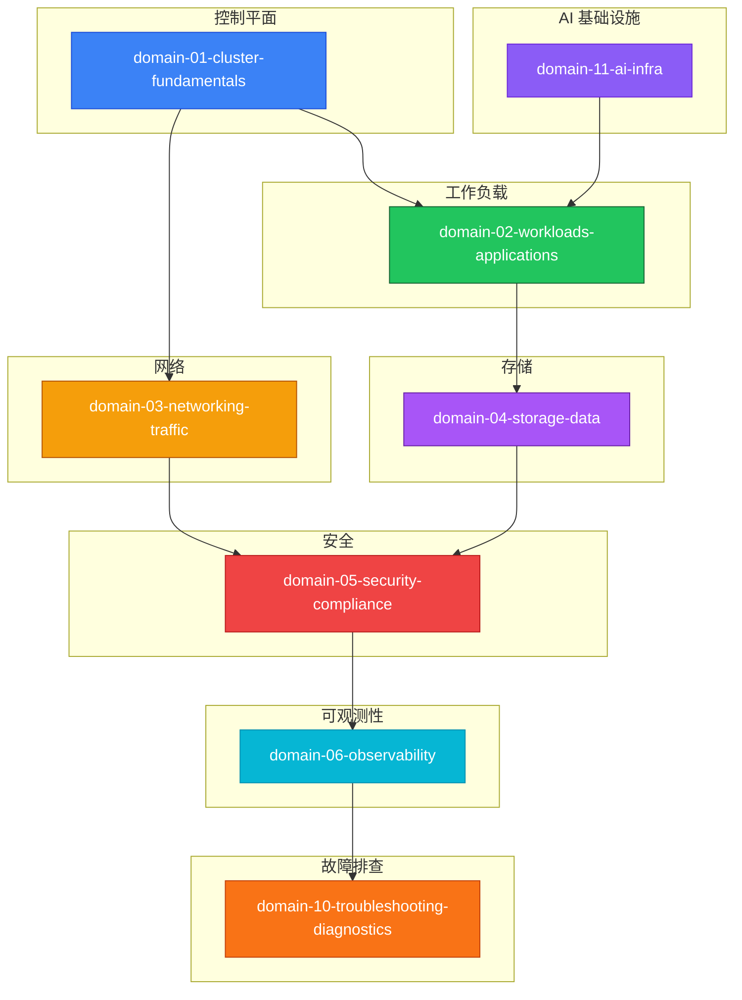

# KUDIG Database — Global [[domain-07-platform-engineering/topic-code-analysis/MOC|MOC]]

> **Kubernetes Production Operations Knowledge Base**
> **全局导航**: 40 个知识域 + 21 个专题
> **文档总量**: 2977+ 篇
> **最后更新**: 2026-05-21

---

<pre align="center">
╔══════════════════════════════════════════════════════════════════════════╗
║   KUDIG — Global Map of Content ([[MOC]])                                   ║
║   40 Domains  │  21 Topics  │  2977+ Documents                          ║
╚══════════════════════════════════════════════════════════════════════════╝
</pre>

---

## 知识域导航 (40 Domains)

| MOC | 概述 | 文档数 |
|---|---|---|
| [[domain-01-cluster-fundamentals/MOC.md|domain-01-cluster-fundamentals MOC]] | Kubernetes 架构基础 — 系统整体设计、核心组件、API 版本、源码结构、集群部署 | 33 |
| [[domain-15-specialized-tech/MOC.md|domain-15-specialized-tech MOC]] | 扩展 — CRD、Operator、Webhook、API Aggregation | 20 |
| [[domain-14-ai-ml-infra/MOC.md|domain-11-ai-infra MOC]] | AI 基础设施 — GPU 调度、CUDA、Model Serving、LLM 部署 | 39 |
| [[domain-10-troubleshooting-diagnostics/MOC.md|domain-10-troubleshooting-diagnostics MOC]] | 故障排查 — 通用方法论、常见故障模式、诊断工具链 | 48 |
| [[domain-13-container-runtime/MOC.md|domain-13-container-runtime MOC]] | Docker — 容器运行时、镜像构建、Docker Compose、最佳实践 | 14 |
| [[domain-17-system-foundation/MOC.md|domain-17-system-foundation MOC]] | Linux 基础 — 系统管理、网络配置、性能调优、安全加固 | 11 |
| [[domain-03-networking-traffic/MOC.md|domain-03-networking-traffic MOC]] | 网络基础 — TCP/IP、HTTP、DNS、负载均衡原理 | 8 |
| [[domain-04-storage-data/MOC.md|domain-04-storage-data MOC]] | 存储基础 — 文件系统、块存储、对象存储原理 | 7 |
| [[domain-12-cloud-providers/MOC.md|domain-12-cloud-providers MOC]] | 云提供商 — AWS、GCP、Azure、阿里云集成 | 1 |
| [[domain-11-production-operations/MOC.md|domain-11-production-operations MOC]] | 生产运维 — 生产最佳实践、容量规划、变更管理 | 32 |
| [[domain-19-landscape-references/MOC.md|domain-19-papers MOC]] | 论文阅读 — Kubernetes 相关学术论文和技术报告 | 27 |
| [[domain-01-cluster-fundamentals/MOC.md|domain-01-cluster-fundamentals MOC]] | Kubernetes 设计原则 — API 设计理念、声明式 API、控制器模式、渐进式交付 | 20 |
| [[domain-06-observability/MOC.md|domain-20-enterprise-monitoring-alerting MOC]] | 企业监控告警 — 监控架构、告警策略、SLO/SLI | 13 |
| [[domain-06-observability/MOC.md|domain-21-logging-management-analytics MOC]] | 日志管理与分析 — 日志采集、存储、分析、可视化 | 10 |
| [[domain-13-container-runtime/MOC.md|domain-22-container-image-management MOC]] | 容器镜像管理 — 镜像构建、安全扫描、分发 | 9 |
| [[domain-08-release-change-management/MOC.md|domain-08-release-change-management MOC]] | GitOps 与 CI/CD — ArgoCD、Flux、Jenkins、GitHub Actions | 13 |
| [[domain-08-release-change-management/MOC.md|domain-24-infrastructure-as-code MOC]] | 基础设施即代码 — Terraform、Pulumi、Crossplane | 7 |
| [[domain-05-security-compliance/MOC.md|domain-05-security-compliance MOC]] | 云原生安全 — 供应链安全、运行时安全、合规 | 16 |
| [[domain-03-networking-traffic/MOC.md|domain-03-networking-traffic MOC]] | Service Mesh 与微服务 — Istio、Envoy、微服务架构 | 14 |
| [[domain-12-cloud-providers/MOC.md|domain-27-multi-cloud-hybrid MOC]] | 多云与混合云 — 多云架构、混合云网络、数据同步 | 11 |
| [[domain-16-database-middleware/MOC.md|domain-28-enterprise-database-middleware MOC]] | 企业数据库中间件 — MySQL、PostgreSQL、Redis on K8s | 10 |
| [[domain-08-release-change-management/MOC.md|domain-29-automated-testing-quality MOC]] | 自动化测试与质量 — 单元测试、集成测试、e2e 测试 | 6 |
| [[domain-01-cluster-fundamentals/MOC.md|domain-01-cluster-fundamentals MOC]] | 控制平面 — etcd、apiserver、scheduler、controller-manager 深度解析 | 37 |
| [[domain-09-reliability-engineering/MOC.md|domain-30-disaster-recovery-business-continuity MOC]] | 灾备与业务连续性 — 备份、恢复、容灾演练 | 10 |
| [[domain-17-system-foundation/MOC.md|domain-31-hardware MOC]] | 硬件 — 服务器、网络硬件、存储硬件 | 19 |
| [[domain-18-manifests-patterns/MOC.md|domain-32-yaml-manifests MOC]] | YAML 清单 — 资源清单编写规范、最佳实践 | 37 |
| [[domain-17-system-foundation/MOC.md|domain-33-kubernetes-events MOC]] | Kubernetes 事件 — 事件模型、事件驱动、事件分析 | 16 |
| [[domain-19-landscape-references/MOC.md|domain-19-landscape-references MOC]] | CNCF 全景 — CNCF 项目生态、成熟度模型 | 5 |
| [[domain-03-networking-traffic/MOC.md|domain-35-ebpf-technology MOC]] | eBPF 技术 — eBPF 原理、Cilium、网络/安全可观测性 | 11 |
| [[domain-07-platform-engineering/MOC.md|domain-07-platform-engineering MOC]] | 平台工程 — 内部开发者平台、IDP、Backstage | 13 |
| [[domain-15-specialized-tech/MOC.md|domain-37-edge-computing MOC]] | 边缘计算 — KubeEdge、边缘集群、边缘 AI | 12 |
| [[domain-15-specialized-tech/MOC.md|domain-38-webassembly-cloud-native MOC]] | WebAssembly 云原生 — Wasm、WASI、WasmEdge | 12 |
| [[domain-05-security-compliance/MOC.md|domain-05-security-compliance MOC]] | 供应链安全 — SBOM、签名、验证、镜像安全 | 12 |
| [[domain-02-workloads-applications/MOC.md|domain-02-workloads-applications MOC]] | 工作负载 — Pod、Deployment、StatefulSet、DaemonSet、Job、CronJob | 28 |
| [[domain-03-networking-traffic/MOC.md|domain-40-cloud-native-api-gateway MOC]] | 云原生 API 网关 — Higress、Envoy Gateway、Kong | 16 |
| [[domain-03-networking-traffic/MOC.md|domain-03-networking-traffic MOC]] | 网络 — Service、Ingress、CNI、网络策略、DNS、负载均衡 | 55 |
| [[domain-04-storage-data/MOC.md|domain-04-storage-data MOC]] | 存储 — PV、PVC、StorageClass、CSI、持久化存储 | 19 |
| [[domain-05-security-compliance/MOC.md|domain-05-security-compliance MOC]] | 安全 — RBAC、NetworkPolicy、PodSecurity、Secret、证书管理 | 22 |
| [[domain-06-observability/MOC.md|domain-06-observability MOC]] | 可观测性 — Prometheus、Grafana、指标、日志、追踪 | 33 |
| [[domain-07-platform-engineering/MOC.md|domain-07-platform-engineering MOC]] | 平台运维 — 集群管理、资源管理、调度策略、运维自动化 | 29 |

---

## 专题导航 (21 Topics)

| MOC | 概述 | 文档数 |
|---|---|---|
| [[domain-14-ai-ml-infra/topic-ai-agent/MOC.md|topic-ai-agent MOC]] | AI Agent — AI 智能体架构、工具调用、Agent 工作流 | 57 |
| [[domain-14-ai-ml-infra/topic-ai-coding/MOC.md|topic-ai-coding MOC]] | AI 编程 — AI 辅助编程工具、最佳实践 | 24 |
| [[domain-20-application-patterns/topic-application-architecture/MOC.md|topic-application-architecture MOC]] | 应用架构 — 云原生应用设计模式、架构决策 | 96 |
| [[domain-11-production-operations/topic-best-practices/MOC.md|topic-best-practices MOC]] |  | 13 |
| [[domain-17-system-foundation/topic-cheat-sheet/MOC.md|topic-cheat-sheet MOC]] | 速查卡 — 常用命令、配置、模板速查 | 13 |
| [[domain-08-release-change-management/topic-deployment/MOC.md|topic-deployment MOC]] | 部署 — 部署策略、发布模式、滚动更新 | 4 |
| [[domain-17-system-foundation/topic-dictionary/MOC.md|topic-dictionary MOC]] | 运维术语词典 — K8s 运维专业术语解释 | 207 |
| [[domain-10-troubleshooting-diagnostics/topic-febm/MOC.md|topic-febm MOC]] | FEBM 取证 — 故障事件取证方法文档 | 10 |
| [[domain-10-troubleshooting-diagnostics/topic-fta/MOC.md|topic-fta MOC]] | FTA 故障树 — 故障树分析文档集合 | 79 |
| [[domain-02-workloads-applications/topic-functions/MOC.md|topic-functions MOC]] | 函数 — 运维脚本常用函数库 | 82 |
| [[domain-19-landscape-references/topic-index/MOC.md|topic-index MOC]] | 深度研究入口 — 语料库索引与向量检索 | 23 |
| [[domain-java-kubernetes/MOC.md|domain-java-kubernetes MOC]] | Java on Kubernetes — Java 应用部署与调优 | 6 |
| [[domain-11-production-operations/topic-learn/MOC.md|topic-learn MOC]] | 学习计划 — 系统学习路径与考核 | 123 |
| [[domain-08-release-change-management/topic-migration/MOC.md|topic-migration MOC]] | 迁移 — 数据迁移、应用迁移、版本升级 | 10 |
| [[domain-11-production-operations/topic-presentations/MOC.md|topic-presentations MOC]] | 演示文稿 — 技术分享与培训 PPT | 12 |
| [[domain-11-production-operations/topic-publish/MOC.md|topic-publish MOC]] | 发布 — 内容发布流程与规范 | 9 |
| [[domain-10-troubleshooting-diagnostics/topic-qa-corpus/MOC.md|topic-qa-corpus MOC]] | QA 语料库 — Agent 评测问答对 | 1 |
| [[domain-19-landscape-references/topic-release-notes/MOC.md|topic-release-notes MOC]] | 版本发布说明 — Kubernetes 各版本变更 | 1321 |
| [[topic-scenarios/MOC.md|topic-scenarios MOC]] |  | 20 |
| [[domain-10-troubleshooting-diagnostics/topic-skills/MOC.md|topic-skills MOC]] | 操作技能 — 场景化运维操作卡片 | 32 |
| [[domain-10-troubleshooting-diagnostics/topic-structural-trouble-shooting/MOC.md|topic-structural-trouble-shooting MOC]] | 结构化故障排查 — 系统性排障方法论 | 71 |
| [[domain-03-networking-traffic/README.md|Domain 5 Networking]] | Terway — 阿里云 CNI 插件深度解析 (40-47) | 9 |

---

## 快速入口

| 入口 | 说明 |
|---|---|
| [[domain-10-troubleshooting-diagnostics/topic-fta/MOC.md|FTA 故障树]] | 67+ 篇故障树分析文档 |
| [[domain-10-troubleshooting-diagnostics/topic-skills/MOC.md|Skills 技能]] | 34+ 篇操作技能卡片 |
| [[domain-17-system-foundation/topic-cheat-sheet/MOC.md|速查卡]] | 9 张速查卡 |
| [[domain-19-landscape-references/topic-index/README.md|深度研究入口]] | 语料库索引与向量检索 |
| [[domain-11-production-operations/topic-learn/MOC.md|学习计划]] | 系统学习路径 |
| [[domain-19-landscape-references/topic-release-notes/MOC.md|版本发布说明]] | Kubernetes 版本变更历史 |
| [[domain-17-system-foundation/topic-dictionary/MOC.md|运维术语词典]] | 运维专业术语解释 |

---

## 知识图谱概览

---

*本文档由 scripts/generate-mocs.py 自动生成，最后更新 2026-05-21。*

## Related

- [[CHANGELOG.md|CHANGELOG]]
- [[README.md|README]]
- [[domain-17-system-foundation/topic-cheat-sheet/k8s.md|k8s]]
- [[concepts/supply-chain-security.md|supply-chain-security]]

- [[MOC]]
- [[MOC]]
- [[_reports/WIKI-LINT-REPORT-2026-05-21|Wiki Lint Report — 2026-05-21]] — Cross-reference
- [[references/release-notes-storage|发布说明索引 — 存储]] — Cross-reference
- [[references/release-notes-observability|发布说明索引 — 可观测性]] — Cross-reference
- [[references/release-notes-networking|发布说明索引 — 网络]] — Cross-reference
- [[references/release-notes-kubernetes|发布说明索引 — Kubernetes]] — Cross-reference
- [[references/release-notes-security|发布说明索引 — 安全]] — Cross-reference
- [[references/k8s-knowledge-map|Kubernetes Knowledge Map]] — Cross-reference
- [[references/release-notes-cicd-gitops|发布说明索引 — CI/CD 与 GitOps]] — Cross-reference
- [[references/release-notes-cli-tools|发布说明索引 — CLI 工具]] — Cross-reference
- [[references/release-notes-core-deps|发布说明索引 — 核心依赖]] — Cross-reference
- [[references/k8s-difficulty-index|Kubernetes Difficulty Index]] — Cross-reference
- [[domain-03-networking-traffic/98-merged-indexes/MOC-from-domain-03-networking-traffic|domain-03-networking-traffic MOC]] — Cross-reference
- [[domain-03-networking-traffic/00-core-k8s-networking/02-cni-architecture-fundamentals|CNI 架构与核心原理]] — Cross-reference
- [[domain-06-observability/01-overview/01-observability-architecture-overview|Kubernetes 可观测性架构体系]] — Cross-reference
- [[domain-14-ai-ml-infra/01-ai-infra/03-gpu-scheduling-management|GPU 调度与管理]] — Cross-reference
- [[domain-14-ai-ml-infra/01-ai-infra/05-distributed-training-frameworks|分布式训练框架]] — Cross-reference
- [[domain-08-release-change-management/98-merged-indexes/MOC-from-domain-08-release-change-management|domain-08-release-change-management MOC]] — Cross-reference
- [[domain-01-cluster-fundamentals/05-kubectl/05-kubectl-commands-reference|kubectl 命令完整参考]] — Cross-reference
- [[domain-01-cluster-fundamentals/01-architecture-overview/02-core-components-deep-dive|Kubernetes 核心组件深度剖析]] — Cross-reference
- [[domain-04-storage-data/01-k8s-storage/02-pv-architecture-fundamentals|PV/PVC 核心概念与企业级实践]] — Cross-reference
- [[domain-04-storage-data/01-k8s-storage/01-storage-architecture-overview|存储架构概览与核心组件]] — Cross-reference
