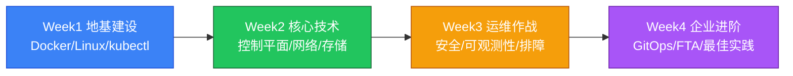
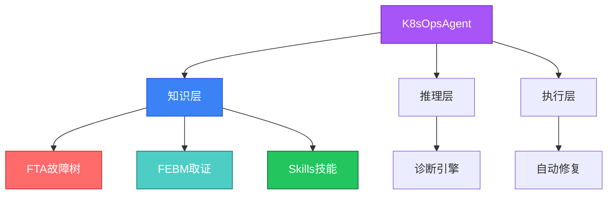
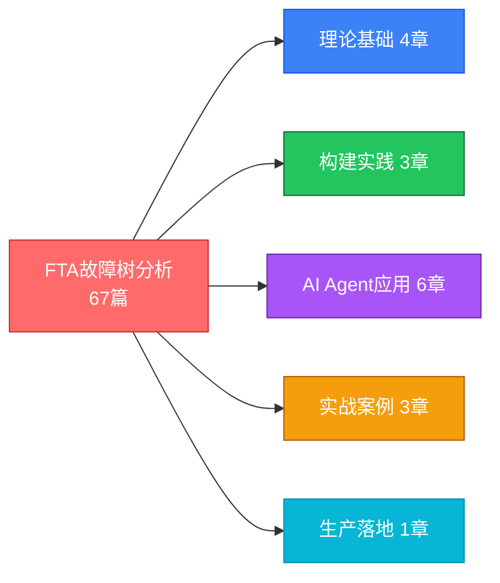
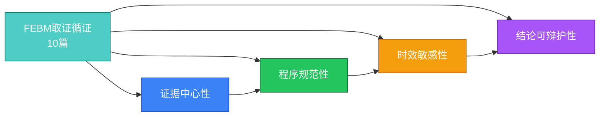
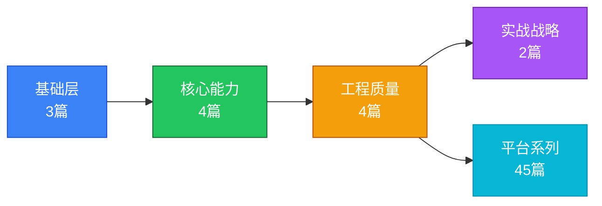

<div align="center">

<!-- ==================================================================
     KUDIG DATABASE - Cool ASCII Art Logo
     ================================================================== -->
<pre align="center">
╔══════════════════════════════════════════════════════════════════════════╗
║                                                                          ║
║   ██╗  ██╗██╗   ██╗██████╗ ██╗ ██████╗     ██████╗  █████╗ ████████╗    ║
║   ██║ ██╔╝██║   ██║██╔══██╗██║██╔════╝     ██╔══██╗██╔══██╗╚══██╔══╝    ║
║   █████╔╝ ██║   ██║██║  ██║██║██║  ███╗    ██║  ██║███████║   ██║       ║
║   ██╔═██╗ ██║   ██║██║  ██║██║██║   ██║    ██║  ██║██╔══██║   ██║       ║
║   ██║  ██╗╚██████╔╝██████╔╝██║╚██████╔╝    ██████╔╝██║  ██║   ██║       ║
║   ╚═╝  ╚═╝ ╚═════╝ ╚═════╝ ╚═╝ ╚═════╝     ╚═════╝ ╚═╝  ╚═╝   ╚═╝       ║
║                                                                          ║
║              KUBERNETES  PRODUCTION  OPERATIONS  KNOWLEDGE BASE          ║
║                                                                          ║
║  ┌──────────────────────────────────────────────────────────────────┐   ║
║  │  📚 3300+ Docs  │  🌐 40 Domains  │  🤖 AI-Ready  │  ⚡ Production  │   ║
║  └──────────────────────────────────────────────────────────────────┘   ║
║                                                                          ║
╚══════════════════════════════════════════════════════════════════════════╝
</pre>

<!-- Binary Rain Effect Decoration -->
<pre align="center" style="opacity: 0.3; font-size: 8px; line-height: 1;">
10110 01001 11010 00101  🅺  01101 10110 01011 10100
01011 10100 00101 11010  🆄  11010 00101 01101 10100
10101 01011 10100 00101  🅳  00101 11010 10101 01011
01001 10110 01011 10100  🅸  10100 00101 11010 10101
10110 01001 11010 00101  🅶  01011 10100 00101 11010
</pre>

<!-- Badges Row -->
<p>
  
  
  
  
  
  
</p>

<p>
  
  
  
  
  
  
</p>

<!-- One-liner Description -->
<p align="center">
  <b>面向生产环境的 Kubernetes + AI Infrastructure 全域知识库</b><br/>
  <b>支持 NotebookLM / IMA / RAG 等 AI 问答场景</b><br/>
  <b>覆盖从基础架构到 LLM 工作负载的完整技术栈</b>
</p>

<!-- Quick Links -->
<p>
  <a href="#-快速开始">🚀 快速开始</a> •
  <a href="#-核心特性">✨ 核心特性</a> •
  <a href="#-知识体系架构">📚 知识体系</a> •
  <a href="#-ai-语料库场景">🤖 AI 语料库</a> •
  <a href="#-使用场景">🎯 使用场景</a> •
  <a href="#-manpage-参考手册">📖 Manpage</a> •
  <a href="#-项目基础设施">🏗️ 基础设施</a> •
  <a href="#-内容统计">📊 统计</a>
</p>

</div>

---

## ✨ 核心特性

<table>
<tr>
<td width="50%">

### 🏭 生产级配置
所有 YAML/Shell 示例经过**万级节点生产环境验证**，可直接用于生产部署。非玩具示例，包含完整的监控告警、故障排查、安全加固方案。

### 🤖 AI 语料库就绪
专为 AI Agent 训练优化的知识组织：
- ✅ NotebookLM 原生支持
- ✅ 腾讯 IMA 知识库导入
- ✅ RAG 检索增强生成
- ✅ Agent 推理骨架（FTA/FEBM）

</td>
<td width="50%">

### 📚 内容全面性
- **5500万+** 字符（约1800万中文字）
- **3200+** 篇技术文档
- **40** 个核心知识域 + **21** 个专题目录
- **219** 个 CNCF 开源项目
- **67** 个 FTA 故障树
- **58** 篇 AI Agent 工程

### 🔬 深度解析
- 控制平面组件源码级剖析
- CRI/CSI/CNI 接口详解
- 内核级性能调优
- 分布式系统原理

</td>
</tr>
</table>

---

## 🚀 快速开始

### 方式一：作为 AI 语料库使用

<details>
<summary>📱 <b>NotebookLM</b> - 生成专属技术播客</summary>

1. 访问 [notebooklm.google.com](https://notebooklm.google.com)
2. 创建新笔记本，添加本仓库 GitHub 链接
3. NotebookLM 自动解析所有 Markdown 文档
4. 使用「生成音频摘要」功能创建技术播客

> 💡 推荐组合：导入 `topic-fta/` + `domain-12-troubleshooting/` 生成故障排查专题播客
</details>

<details>
<summary>💬 <b>腾讯 IMA</b> - 构建个人知识库</summary>

1. 安装 IMA 知识库客户端
2. 导入本仓库文件夹（支持批量导入 Markdown）
3. 使用语义搜索快速定位知识点
4. 基于知识库进行问答对话

> 💡 推荐导入：`topic-dictionary/` + `topic-cheat-sheet/` 作为日常速查
</details>

<details>
<summary>🤖 <b>RAG 应用</b> - 构建智能运维助手</summary>

```python
# 使用 LangChain 加载知识库
from langchain_community.document_loaders import DirectoryLoader
from langchain_text_splitters import MarkdownHeaderTextSplitter

# 加载所有 Markdown 文档
loader = DirectoryLoader('./', glob='**/*.md')
docs = loader.load()

# 按标题层级分块（保持知识完整性）
splitter = MarkdownHeaderTextSplitter(
    headers_to_split_on=[('#', 'Header 1'), ('##', 'Header 2')]
)
chunks = []
for doc in docs:
    chunks.extend(splitter.split_text(doc.page_content))

# 构建向量库
# ... 接入 OpenAI / Claude / Qwen Embedding
```
</details>

### 方式二：作为学习资料使用

```bash
# 克隆仓库
git clone https://github.com/kudig-io/kudig-database.git
cd kudig-database

# 启动本地 GitBook 浏览（需要安装 mdBook）
cd gitbook
bash start.sh
# 浏览器访问 http://localhost:3000
```

### 方式三：Agent 训练语料

```yaml
# Agent Skill 示例：使用 topic-skills 作为训练数据
skill:
  name: k8s-troubleshooting
  corpus:
    - topic-skills/*.md      # 工单处理技能库
    - topic-fta/list/*.md    # 故障树分析
    - topic-febm/*.md        # 取证方法论
  agent_type: diagnostic    # 诊断型 Agent
```

### 方式四：导出智能体语料（完整指南）

> 本节面向 AI 工程团队，说明如何将本知识库导出为结构化语料，用于训练或微调智能 Agent。

#### 导出格式与结构

| 导出格式 | 适用场景 | 文件类型 |
|:---|:---|:---|
| **Markdown 原始** | 直接导入 RAG 系统（如 LangChain/LlamaIndex） | `.md` |
| **JSON 分块** | 结构化检索、Embedding 训练 | `.json` |
| **Q&A 对话集** | SFT 微调、监督学习 | `.jsonl` |
| **工具调用轨迹** | Agent 行为克隆、RLHF | `.jsonl` |

#### 快速导出命令

```bash
# ============================================
# 智能体语料导出脚本
# ============================================

# 方式 A: 完整导出（默认）
./scripts/export-corpus.sh

# 方式 B: 仅导出 Agent 核心语料（FTA + FEBM + Skills）
./scripts/export-corpus.sh -f agent

# 方式 C: 轻量导出（仅 FTA + Skills）
./scripts/export-corpus.sh -f lite

# 方式 D: 指定输出目录 + 压缩
./scripts/export-corpus.sh -f full -o my-corpus -c
```

**脚本功能：**
- ✅ 自动创建输出目录结构
- ✅ 按格式（full/agent/lite）选择性导出
- ✅ 生成元数据（corpus-info.json）
- ✅ 生成分块策略（chunking-strategy.json）
- ✅ 生成 QA 对话模板（qa-template.json）
- ✅ 生成工具调用轨迹模板（tool-trace-template.json）
- ✅ 可选压缩（.tar.gz）

#### 导出文档清单与规模

| 目录 | 文档数 | 主要内容 | 适用场景 |
|:---|:---:|:---|:---|
| **topic-fta/** | 81 篇 | FTA 故障树完整体系（TE-1~TE-16、向量匹配、执行引擎） | Agent 诊断推理 |
| **topic-febm/** | 11 篇 | FEBM 取证方法论、联合诊断案例 | Agent 取证分析 |
| **topic-skills/** | 34 篇 | 可执行自动修复技能（OOM、调度、网络等） | Agent 工具调用 |
| **topic-structural-trouble-shooting/** | 72 篇 | 结构化详细排查步骤（按组件/现象分） | Agent + 人工排查 |
| **domain-12-troubleshooting/** | 50 篇 | 生产级故障排查知识（原理+案例） | 人工学习参考 |

#### 双用途导出方案（Agent + 人工阅读）

```
┌─────────────────────────────────────────────────────────────────────┐
│                    双用途导出方案                                    │
├─────────────────────────────────────────────────────────────────────┤
│  方案 A: 合并导出（推荐）                                            │
│  导出一个完整包，同时包含：                                          │
│    • 原始 .md 文件（人工阅读）                                       │
│    • 结构化 JSON 分块（Agent 使用）                                  │
│    • 元数据 + 分块策略（AI 工程用）                                  │
│                                                                     │
│  方案 B: 分层导出                                                    │
│  分为两个独立包：                                                    │
│    • kudig-corpus-agent.tar.gz    → Agent 专用（优化后）             │
│    • kudig-corpus-human.tar.gz    → 人工阅读专用（原始 + 索引）      │
│                                                                     │
│  方案 C: 渐进式导出                                                  │
│  按使用场景分批导出：                                                │
│    • 第 1 批：问题排查核心（FTA + Skills + Structural）               │
│    • 第 2 批：深度学习（Domain + FEBM）                              │
│    • 第 3 批：扩展知识（CNCF 生态 + 云厂商）                         │
└─────────────────────────────────────────────────────────────────────┘
```

#### Q&A 语料示例

```json
{
  "question": "Pod 处于 CrashLoopBackOff 状态，如何排查？",
  "answer": "1. kubectl describe pod <name> 查看 Events\n2. kubectl logs <name> --previous 查看上次崩溃日志\n3. 检查 OOMKilled: kubectl get pod <name> -o jsonpath='{.status.containerStatuses[0].lastState}'\n4. 检查资源限制: kubectl get pod <name> -o jsonpath='{.spec.containers[0].resources}'\n5. 参考 FTA: topic-fta/list/pod-fta.md BE-2.3 路径",
  "source": "topic-skills/02-pod-crashloop-oomkilled.md",
  "type": "troubleshooting",
  "tags": ["pod", "crashloop", "oom", "debugging"]
}
```

#### 工具调用轨迹示例

```json
{
  "chunk_id": "fta-te2-ie21-be23-001",
  "document": {
    "title": "TE-2 应用服务不可用 - OOMKilled 路径",
    "path": "topic-fta/kubernetes-fta-full-analysis-v2.md",
    "section": "三、TE-2 应用服务不可用 (P0)"
  },
  "metadata": {
    "type": "fta_bottom_event",
    "fta_code": "BE-2.3",
    "severity": "P0",
    "cloud_provider": "generic",
    "kubernetes_version": "v1.25+"
  },
  "tags": ["OOMKilled", "内存", "JVM", "CrashLoopBackOff"],
  "references": [
    "topic-structural-trouble-shooting/07-oom-memory-diagnosis.md",
    "topic-skills/oom-healing-skill.md"
  ]
}
```

---

## 📚 知识体系架构

```mermaid
graph TD
    ROOT[KUDIG-DATABASE<br/>全域知识库] --> TOPIC[🔥 专题资源]
    ROOT --> CORE[🎯 核心知识域]
    ROOT --> BASE[🏗️ 底层基础]
    ROOT --> ENTERPRISE[🏢 企业级专题]
    ROOT --> ADVANCED[🚀 前沿技术]
    
    TOPIC --> T1[FTA故障树 67篇]
    TOPIC --> T2[FEBM取证 10篇]
    TOPIC --> T3[AI Agent 58篇]
    TOPIC --> T4[学习计划 92篇]
    TOPIC --> T5[应用架构/运维函数等]
    
    CORE --> C1[架构/设计 52篇]
    CORE --> C2[控制平面 35篇]
    CORE --> C3[网络/存储 60篇]
    CORE --> C4[安全/可观测 52篇]
    CORE --> C5[平台运维 28篇]
    CORE --> C6[AI Infra 38篇]
    
    BASE --> B1[Docker]
    BASE --> B2[Linux]
    BASE --> B3[网络基础]
    BASE --> B4[存储基础]
    BASE --> B5[云厂商 13家]
    
    ENTERPRISE --> E1[生产运维]
    ENTERPRISE --> E2[GitOps/CI-CD]
    ENTERPRISE --> E3[监控日志]
    ENTERPRISE --> E4[灾备恢复]
    
    ADVANCED --> A1[CNCF 219项目]
    ADVANCED --> A2[eBPF]
    ADVANCED --> A3[边缘计算]
    ADVANCED --> A4[WebAssembly]
    
    style ROOT fill:#326ce5,stroke:#1a3a8f,color:#fff
    style TOPIC fill:#ff6b6b,stroke:#c92a2a,color:#fff
    style CORE fill:#22c55e,stroke:#166534,color:#fff
    style BASE fill:#0ea5e9,stroke:#0369a1,color:#fff
    style ENTERPRISE fill:#f59e0b,stroke:#b45309,color:#fff
    style ADVANCED fill:#a855f7,stroke:#6b21a8,color:#fff
```



---

## 🤖 AI 语料库场景

本知识库专为 AI 时代的知识管理设计，完美适配以下场景：

### 1. NotebookLM - 音频学习

| 推荐导入内容 | 生成效果 | 适用人群 |
|-------------|---------|---------|
| `topic-learn/` 学习计划 | 系统化的技术播客系列 | 初学者 |
| `topic-fta/` 故障树分析 | 故障排查方法论播客 | SRE/运维 |
| `domain-11-ai-infra/` AI基础设施 | AI工程专题播客 | AI工程师 |

### 2. IMA / 豆包 / 文心一言 - 个人知识库

| 推荐导入内容 | 使用场景 | 预期效果 |
|-------------|---------|---------|
| `topic-dictionary/` 运维词典 | 日常查询术语 | 秒级概念检索 |
| `topic-cheat-sheet/` 速查卡 | 命令速查 | 提高操作效率 |
| `topic-structural-trouble-shooting/` | 故障排查 | 快速定位问题 |

### 3. RAG 应用 - 企业知识库

> 📋 详细的分块策略与 Embedding 模型推荐请参阅 [corpus-config/rag-chunking-strategy.md](./corpus-config/rag-chunking-strategy.md)，预置的 RAG Profile 请参阅 [corpus-config/profiles/](./corpus-config/profiles/)。

```text
# 推荐分块策略
├── domain-*/          # 按知识域分块，用于专业问答
├── topic-fta/          # 故障树结构，用于诊断推理
├── topic-skills/       # 技能库，用于 Agent 执行
└── topic-cheat-sheet/  # 速查卡，用于快速检索
```

### 4. Agent 训练语料

| 语料类型 | 用途 | 示例框架 |
|---------|------|---------|
| `topic-fta/*.md` | Agent 推理骨架 | AutoGen, CrewAI |
| `topic-skills/*.md` | 诊断-修复闭环 | AgentScope |
| `topic-febm/*.md` | 取证分析能力 | LangChain Agent |
| `domain-12-troubleshooting/*.md` | 故障排查知识 | Custom Agent |

---

## 🎯 使用场景

### 场景一：生产故障排查（SRE/运维）


**推荐路径**：
1. [FTA 生产快速落地](./topic-fta/23-fta-production-quick-start.md)
2. [Pod 故障树分析](./topic-fta/list/pod-fta.md)
3. [Pod CrashLoopBackOff Skill](./topic-skills/02-pod-crashloop-oomkilled.md)

### 场景二：系统学习 K8s（开发者/学生）



**完整计划**：[1个月学习计划](./topic-learn/public-training/one-month/README.md)

### 场景三：构建 K8s 运维 Agent（AI工程师）



### 场景四：生产问题排查完整工作流（SRE 深度指南）

> 本指南面向 SRE/运维工程师，提供从**问题现象**到**根因定位**再到**自动修复**的完整闭环路径。

#### 问题排查知识体系全景

```
┌─────────────────────────────────────────────────────────────────────────────┐
│                    Kudig-DB 问题排查知识体系                                │
├─────────────────────────────────────────────────────────────────────────────┤
│  ┌─────────────┐     ┌─────────────┐     ┌─────────────┐                │
│  │  症状快速    │────►│   FTA       │────►│ Structural  │                │
│  │  映射层      │     │  故障树     │     │  详细排查   │                │
│  │  入口诊断    │     │  根因方向    │     │  详细步骤    │                │
│  └─────────────┘     └─────────────┘     └─────────────┘                │
│        │                   │                   │                           │
│        ▼                   ▼                   ▼                           │
│  ┌─────────────┐     ┌─────────────┐     ┌─────────────┐                │
│  │  向量匹配    │     │  动态概率   │     │  证据置信度 │                │
│  │  (增强)     │     │  (增强)     │     │  (增强)     │                │
│  └─────────────┘     └─────────────┘     └─────────────┘                │
│        │                   │                   │                           │
│        ▼                   ▼                   ▼                           │
│  ┌─────────────┐     ┌─────────────┐     ┌─────────────┐             │
│  │  Skills     │◄────│  FEBM       │◄────│  Domain     │             │
│  │  自动修复   │     │  取证分析   │     │  深度 Dive  │             │
│  └─────────────┘     └─────────────┘     └─────────────┘             │
└─────────────────────────────────────────────────────────────────────────────┘
```

#### 方法论选择指南

| 场景 | FTA | FEBM | FTA+FEBM |
|:---|:---:|:---:|:---:|
| 已知故障模式 | ✅ 最佳 | ⚠️ 不推荐 | ⚠️ 不需要 |
| 未知故障 | ⚠️ 可用 | ✅ 最佳 | ✅ 联合 |
| 需要快速恢复 | ✅ 最佳 | ⚠️ 较慢 | ⚠️ 可用 |
| 事后复盘 | ⚠️ 可用 | ✅ 最佳 | ✅ 最佳 |
| 多因素复杂故障 | ⚠️ 可用 | ⚠️ 可用 | ✅ 最佳 |
| 安全事件取证 | ⚠️ 可用 | ✅ 最佳 | ✅ 联合 |

#### 问题域 → 文档映射表

| 问题域 | FTA 路径 | 详细排查 | 深度文档 |
|:---|:---|:---|:---|
| **控制平面 (TE-1)** | [TE-1 集群不可用](./topic-fta/kubernetes-fta-full-analysis.md) | [API Server](./topic-structural-trouble-shooting/01-control-plane/01-apiserver-troubleshooting.md) · [etcd](./topic-structural-trouble-shooting/01-control-plane/02-etcd-troubleshooting.md) · [Scheduler](./topic-structural-trouble-shooting/01-control-plane/03-scheduler-troubleshooting.md) | [domain-3](./domain-3-control-plane/) |
| **工作负载 (TE-2/3)** | [TE-2 应用不可用](./topic-fta/kubernetes-fta-full-analysis.md) · [TE-3 Pod启动失败](./topic-fta/kubernetes-fta-full-analysis.md) | [Pod](./topic-structural-trouble-shooting/05-workloads/01-pod-troubleshooting.md) · [Deployment](./topic-structural-trouble-shooting/05-workloads/02-deployment-troubleshooting.md) · [StatefulSet](./topic-structural-trouble-shooting/05-workloads/03-statefulset-troubleshooting.md) | [domain-4](./domain-4-workloads/) |
| **网络 (TE-4)** | [TE-4 网络异常](./topic-fta/kubernetes-fta-full-analysis.md) | [CNI](./topic-structural-trouble-shooting/03-networking/01-cni-troubleshooting.md) · [DNS](./topic-structural-trouble-shooting/03-networking/02-dns-troubleshooting.md) · [Service](./topic-structural-trouble-shooting/03-networking/03-service-ingress-troubleshooting.md) | [domain-5](./domain-5-networking/) |
| **存储 (TE-5)** | [TE-5 存储失败](./topic-fta/kubernetes-fta-full-analysis.md) | [PV/PVC](./topic-structural-trouble-shooting/04-storage/01-pv-pvc-troubleshooting.md) · [CSI](./topic-structural-trouble-shooting/04-storage/02-csi-troubleshooting.md) | [domain-6](./domain-6-storage/) |
| **安全 (TE-7)** | [TE-7 认证失败](./topic-fta/kubernetes-fta-full-analysis.md) | [RBAC](./topic-structural-trouble-shooting/06-security-auth/01-rbac-troubleshooting.md) · [证书](./topic-structural-trouble-shooting/06-security-auth/02-certificate-troubleshooting.md) | [domain-7](./domain-7-security/) |
| **可观测性 (TE-8)** | [TE-8 监控异常](./topic-fta/kubernetes-fta-full-analysis.md) | [监控概览](./topic-structural-trouble-shooting/12-monitoring-observability/01-monitoring-observability-troubleshooting.md) · [OTel](./topic-structural-trouble-shooting/12-monitoring-observability/02-opentelemetry-troubleshooting.md) · [eBPF可观测](./topic-structural-trouble-shooting/12-monitoring-observability/03-ebpf-observability-troubleshooting.md) | [domain-8](./domain-8-observability/) |
| **服务网格 (TE-10)** | [TE-10 ASM故障](./topic-fta/kubernetes-fta-full-analysis.md) | [Istio](./topic-structural-trouble-shooting/03-networking/05-service-mesh-istio-troubleshooting.md) | [domain-26](./domain-26-service-mesh-microservices/) |

## 📊 内容统计

<table>
<tr>
<td width="33%">

### 📈 整体规模
| 指标 | 数值 |
|------|------|
| 文件总数 | 12,700+ |
| Markdown 文档 | 3,337 |
| 总字符数 | 5500万+ |
| 核心知识域 | 40 |
| 专题目录 | 21 |

</td>
<td width="33%">

### 🤖 AI 相关
| 指标 | 数值 |
|------|------|
| AI Agent 文档 | 58 篇 |
| FTA 故障树 | 81 篇 |
| FEBM 取证 | 11 篇 |
| 学习课程 | 92 篇 |
| CNCF 项目 | 219 个 |

</td>
<td width="33%">

### 🔧 运维专题
| 指标 | 数值 |
|------|------|
| 故障排查文档 | 72+ |
| 技能库 (Skills) | 34 篇 |
| 速查卡 | 9 张 |
| 演示文档 | 13 篇 |
| 运维词典 | 207 篇 |
| Manpage | 14 个 |

</td>
</tr>
</table>

### 各知识域文档分布

| 域 | 名称 | 文档数 | 关键内容 |
|:---:|:---|:---:|:---|
| 1 | 架构基础 | 32 | K8s 架构、核心组件、升级策略、性能调优 |
| 2 | 设计原理 | 20 | 声明式API、控制器模式、etcd共识、高可用 |
| 3 | 控制平面 | 35 | etcd、API Server、Scheduler、CRI/CSI/CNI |
| 4 | 工作负载 | 27 | Pod生命周期、调度器、HPA/VPA、资源管理 |
| 5 | 网络 | 41 | CNI、Service、DNS、Ingress、Gateway API |
| 6 | 存储 | 19 | PV/PVC、StorageClass、CSI驱动、备份恢复 |
| 7 | 安全合规 | 22 | RBAC、网络安全、运行时安全、审计合规 |
| 8 | 可观测性 | 30 | 监控指标、日志审计、链路追踪、混沌工程 |
| 9 | 平台运维 | 28 | 集群管理、GitOps、成本优化、灾备恢复 |
| 10 | 扩展生态 | 20 | CRD/Operator、Helm、CI/CD、服务网格 |
| 11 | AI基础设施 | 38 | GPU调度、分布式训练、LLM推理、成本优化 |
| 12 | 故障排查 | 46 | 全组件故障排查、FTA故障树、结构化排障 |
| 13 | Docker容器 | 14 | Docker基础、容器运行时、镜像管理 |
| 14 | Linux系统 | 11 | Linux基础、系统管理、性能调优 |
| 15 | 网络基础 | 8 | TCP/IP、网络模型、协议栈 |
| 16 | 存储基础 | 7 | 存储原理、文件系统、块存储 |
| 17 | 云厂商 | 24 | 13家云厂商K8s服务（AWS/GCP/Azure/阿里云等） |
| 18 | 生产运维 | 32 | 生产环境运维、集群运维、容量规划 |
| 19 | 技术白皮书 | 27 | 经典论文、技术白皮书、RFC |
| 20 | 监控告警 | 13 | 企业级监控、告警体系、SLO/SLA |
| 21 | 日志管理 | 10 | 日志采集、分析、审计 |
| 22 | 容器镜像 | 9 | 镜像管理、安全扫描、仓库 |
| 23 | GitOps/CI-CD | 9 | ArgoCD、FluxCD、Tekton、CI/CD |
| 24 | 基础设施即代码 | 7 | IaC、Terraform、Pulumi |
| 25 | 云原生安全 | 12 | 安全策略、合规、零信任 |
| 26 | 服务网格 | 10 | Istio、Envoy、流量治理 |
| 27 | 多云混合 | 6 | 多云管理、混合云架构 |
| 28 | 数据库中间件 | 7 | 数据库、消息队列、中间件 |
| 29 | 自动化测试 | 6 | 测试策略、质量保障 |
| 30 | 灾备恢复 | 7 | Velero、灾备方案、业务连续性 |
| 31 | 硬件基础 | 19 | 服务器硬件、GPU、网络设备 |
| 32 | YAML清单 | 37 | K8s全资源YAML参考 |
| 33 | K8s事件 | 16 | 事件体系、事件驱动 |
| 34 | CNCF生态 | 219 | Graduated/Incubating/Sandbox全景 |
| 35 | eBPF | 11 | eBPF技术、网络可观测 |
| 36 | 平台工程 | 13 | 内部开发者平台、IDP |
| 37 | 边缘计算 | 12 | KubeEdge、边缘部署 |
| 38 | WebAssembly | 12 | Wasm运行时、边缘计算 |
| 39 | 供应链安全 | 12 | SBOM、签名验证、安全供应链 |
| 40 | API网关 | 16 | Gateway API、网关选型、安全策略 |

---

## 🧭 快速导航

### 按角色导航

<table>
<tr>
<td width="20%" align="center"><b>👨‍💻 开发者</b></td>
<td>
<a href="./domain-1-architecture-fundamentals/05-kubectl-commands-reference.md">kubectl 命令</a> → 
<a href="./domain-4-workloads/10-workload-controllers-overview.md">工作负载</a> → 
<a href="./domain-5-networking/06-service-concepts-types.md">Service</a> → 
<a href="./domain-10-extensions/08-cicd-pipelines.md">CI/CD</a>
</td>
</tr>
<tr>
<td align="center"><b>👨‍🔧 运维工程师</b></td>
<td>
<a href="./domain-3-control-plane/11-etcd-deep-dive.md">etcd 运维</a> → 
<a href="./domain-12-troubleshooting/">故障排查</a> → 
<a href="./domain-8-observability/10-monitoring-metrics-prometheus.md">监控告警</a> → 
<a href="./topic-fta/23-fta-production-quick-start.md">FTA 快速落地</a>
</td>
</tr>
<tr>
<td align="center"><b>🏗️ 架构师</b></td>
<td>
<a href="./domain-1-architecture-fundamentals/01-kubernetes-architecture-overview.md">架构基础</a> → 
<a href="./domain-2-design-principles/01-design-principles-foundations.md">设计原理</a> → 
<a href="./domain-2-design-principles/08-high-availability-patterns.md">高可用模式</a> → 
<a href="./domain-9-platform-ops/13-multi-cluster-management.md">多集群管理</a>
</td>
</tr>
<tr>
<td align="center"><b>🤖 AI工程师</b></td>
<td>
<a href="./domain-11-ai-infra/01-ai-infrastructure-overview.md">AI Infra</a> → 
<a href="./domain-11-ai-infra/03-gpu-scheduling-management.md">GPU调度</a> → 
<a href="./topic-ai-agent/01-ai-agent-fundamentals.md">Agent基础</a> → 
<a href="./topic-ai-agent/30-agent-harness-engineering.md">Harness工程</a>
</td>
</tr>
<tr>
<td align="center"><b>🎓 学习者</b></td>
<td>
<a href="./topic-learn/public-training/one-month/README.md">1个月计划</a> → 
<a href="./topic-cheat-sheet/k8s.md">K8s 速查卡</a> → 
<a href="./topic-dictionary/">概念手册</a> → 
<a href="./domain-12-troubleshooting/">故障排查</a>
</td>
</tr>
<tr>
<td align="center"><b>🚨 SRE/故障调查</b></td>
<td>
<a href="./topic-fta/23-fta-production-quick-start.md">FTA 快速落地</a> → 
<a href="./topic-febm/08-febm-production-quick-start.md">FEBM 快速落地</a> → 
<a href="./topic-structural-trouble-shooting/">结构化排障</a> → 
<a href="./topic-skills/">工单技能库</a>
</td>
</tr>
</table>

### 按场景导航

| 场景 | 推荐起点 | 核心文档 |
|:---|:---|:---|
| **🔥 故障排查** | [topic-fta/README.md](./topic-fta/README.md) + [topic-febm/README.md](./topic-febm/README.md) | 67篇FTA故障树 + 10篇FEBM取证 + 排障文档 |
| **📚 系统学习** | [topic-learn/](./topic-learn/) | 1个月学习计划 + 92篇课程 |
| **🤖 Agent开发** | [topic-ai-agent/](./topic-ai-agent/) | 58篇AI Agent工程文档 |
| **⚡ 命令速查** | [topic-cheat-sheet/](./topic-cheat-sheet/) | 9张 K8s/Linux/Go 速查卡 |
| **🏢 企业部署** | [topic-deployment/](./topic-deployment/) | 从本地Demo到生产环境的完整路径 |
| **🔄 集群迁移** | [topic-migration/](./topic-migration/) | 10步完整迁移指南 |
| **🎤 技术演示** | [topic-presentations/](./topic-presentations/) | 13个K8s专题Presentation |
| **🤖 AI 编码** | [topic-ai-coding/](./topic-ai-coding/) | 25篇AI辅助编码与开发工具链文档 |
| **🏗️ 应用架构** | [topic-application-architecture/](./topic-application-architecture/) | 97篇电商/IM/教育等典型架构文档 |
| **⚙️ 运维函数** | [topic-functions/](./topic-functions/) | 80篇集群/部署/节点操作函数库 |
| **🌐 Terway专题** | [topic-terway/](./topic-terway/) | 10篇阿里云Terway CNI深度文档 |
| **☕ Java × K8s** | [topic-java-kubernetes/](./topic-java-kubernetes/) | Java应用K8s部署实践 |
| **📋 版本发布** | [topic-release-notes/](./topic-release-notes/) | 核心组件版本发布说明 |
| **📝 出版计划** | [topic-publish/](./topic-publish/) | AI Infra/K8s系列出版路线图 |

---

## 🗂️ 全局专题索引

> 横向跨域聚合：突破 `domain-*` 按领域组织的限制，按**关键技术关键字**全局关联所有相关内容，支持从单一视角穿透全库。

### 计算与运行时

| 索引 | 说明 | 覆盖规模 |
|:---|:---|:---|
| [`pod-index.md`](./topic-index/pod-index.md) | Pod 全景：生命周期、Pending 诊断、全面故障排查、YAML 规格、事件体系 | ~260+ 篇关联 |
| [`node-index.md`](./topic-index/node-index.md) | Node 全景：Kubelet 深度解析、NotReady 诊断、节点组件故障排查 | ~270+ 篇关联 |
| [`scheduler-index.md`](./topic-index/scheduler-index.md) | 调度与弹性伸缩：调度器原理、亲和性/污点容忍、HPA/VPA/Karpenter、资源配额 | ~300+ 篇关联 |

### 网络与安全

| 索引 | 说明 | 覆盖规模 |
|:---|:---|:---|
| [`network-index.md`](./topic-index/network-index.md) | 网络全景：CNI、Service/Ingress/Gateway API、DNS、NetworkPolicy、负载均衡 | ~360+ 篇关联 |
| [`terway-index.md`](./topic-index/terway-index.md) | Terway 专题：阿里云 CNI 产品、源码分析、故障树、云厂商集成 | ~120+ 篇关联 |
| [`dns-index.md`](./topic-index/dns-index.md) | DNS 专题：CoreDNS 原理与配置、DNS 故障排查、Linux 解析链 | ~250+ 篇关联 |
| [`service-mesh-index.md`](./topic-index/service-mesh-index.md) | 服务网格全景：Istio/Linkerd/Envoy 企业实践、Ambient/Sidecar、流量治理 | ~280+ 篇关联 |
| [`security-index.md`](./topic-index/security-index.md) | 安全全景：RBAC、准入控制/Webhook、Pod 安全标准、运行时安全、合规审计 | ~400+ 篇关联 |
| [`cert-index.md`](./topic-index/cert-index.md) | 证书/TLS 全景：证书管理、Ingress TLS、cert-manager、PKI 速查表 | ~280+ 篇关联 |

### 存储与数据保护

| 索引 | 说明 | 覆盖规模 |
|:---|:---|:---|
| [`storage-index.md`](./topic-index/storage-index.md) | 存储全景：CSI 驱动、StorageClass、分布式存储（Ceph/Longhorn/Rook）、性能调优 | ~310+ 篇关联 |
| [`pvc-index.md`](./topic-index/pvc-index.md) | PVC 使用层：PV/PVC 架构、CSI 存储、YAML 清单、故障排查 | ~360+ 篇关联 |
| [`backup-dr-index.md`](./topic-index/backup-dr-index.md) | 备份与灾备：Velero、etcd 备份恢复、跨区灾备、存储快照、业务连续性 | ~280+ 篇关联 |

### 集群与基础设施

| 索引 | 说明 | 覆盖规模 |
|:---|:---|:---|
| [`cluster-index.md`](./topic-index/cluster-index.md) | 集群生命周期：新建（kubeadm 26 篇源码分析）、删除、证书、升级、部署 | ~390+ 篇关联 |
| [`etcd-index.md`](./topic-index/etcd-index.md) | etcd 专题：Raft 共识、数据模型、Lease/Watch、备份恢复、性能调优 | ~280+ 篇关联 |

### 平台工程与可观测性

| 索引 | 说明 | 覆盖规模 |
|:---|:---|:---|
| [`observability-index.md`](./topic-index/observability-index.md) | 可观测性全景：Prometheus/Grafana、日志（Loki/ELK）、链路追踪、事件体系 | ~390+ 篇关联 |
| [`gitops-cicd-index.md`](./topic-index/gitops-cicd-index.md) | 持续交付全景：ArgoCD/Flux GitOps、Tekton/Jenkins/GitHub Actions、Helm | ~300+ 篇关联 |

### AI 基础设施

| 索引 | 说明 | 覆盖规模 |
|:---|:---|:---|
| [`ai-gpu-index.md`](./topic-index/ai-gpu-index.md) | AI 基础设施全景：GPU 调度、分布式训练（MPI/Horovod）、LLM 推理（KServe/vLLM） | ~330+ 篇关联 |

**总计 17 个全局索引，6,100+ 行，覆盖全库 3,200+ 篇 Markdown 的横向关联内容。**

---

## 🌟 特色专题

### 🧠 FTA 故障树分析 (Fault Tree Analysis)

> **67篇文档** | 行业级 FTA 方法论与 AI Agent 智能运维实践

FTA（故障树分析）是一套从传统安全工程理论到云原生 Kubernetes 智能运维实践的完整知识体系。



**核心文档**：
- [FTA 生产快速落地指南](./topic-fta/23-fta-production-quick-start.md) - 30天实施路线图
- [Kubernetes 全量故障树分析](./topic-fta/kubernetes-fta-full-analysis.md) - 8顶事件、63底事件
- [FTA 方法论与 AI Agent 实践合集](./topic-fta/fta-methodology-and-agentic-practices.md)

### 🔍 FEBM 取证循证方法论 (Forensic Evidence-Based Methodology)

> **10篇文档** | 从证据到结论的归纳式故障调查方法论

FEBM 与 FTA 形成**方法论互补**：
- **FTA** (演绎法): 自上而下，从假设到验证 —— "系统可能在哪里出问题？"
- **FEBM** (归纳法): 自下而上，从证据到结论 —— "系统实际发生了什么？"



**核心文档**：
- [FEBM 生产快速落地指南](./topic-febm/08-febm-production-quick-start.md) - 6个K8s故障取证Runbook
- [FEBM 方法论深度剖析](./topic-febm/febm-methodology-deep-dive.md)

### 🤖 AI Agent 工程

> **58篇文档** | 从基础概念到 Harness 工程的完整 Agent 构建指南

内容覆盖 **AI Agent 工程全生命周期**（58篇）：



**核心文档**：
- [Agent Harness 工程](./topic-ai-agent/30-agent-harness-engineering.md) - 六层架构、质量门禁、K8S落地
- [Agent 赋能设计与落地路径](./topic-ai-agent/14-agent-kudig-design-strategy.md) - kudig知识底座 × Agent
- [Agent 语料库差距分析](./topic-ai-agent/15-agent-corpus-gap-analysis.md) - 10大类缺失分析

### 🎓 1个月学习计划

> **92篇文档** | 从零到全栈运维的完整学习路径

**Week 1: 地基建设期**
- Docker 基础 → Linux 基础 → K8s 架构 → kubectl 实战
- 产出：独立搭建 K8s 集群

**Week 2: 核心技术构建期**
- 控制平面精读 → 工作负载深潜 → 网络栈精通 → 存储体系
- 产出：生产级应用 YAML 编排

**Week 3: 运维作战能力期**
- 安全合规 → 可观测性构建 → 故障排查方法论 → 平台运维
- 产出：监控告警体系 + 排障手册

**Week 4: 企业级进阶期**
- 企业监控/日志 → GitOps → FTA/FEBM 专题 → 生产最佳实践
- 产出：GitOps 流水线 + Playbook

**完整计划**：[Kubernetes 生产运维 1 个月学习计划](./topic-learn/public-training/one-month/README.md)

### 🌐 CNCF Landscape 开源项目库

> **219篇文档** | CNCF 云原生全景图完整收录

| 成熟度 | 数量 | 代表项目 |
|:---|:---:|:---|
| **Graduated** | 34 | Kubernetes, Prometheus, Envoy, Helm, Istio, etcd, containerd, Argo, Cilium, Harbor, Falco |
| **Incubating** | 37 | OpenTelemetry, gRPC, Backstage, Kyverno, Kubeflow, Volcano, Chaos Mesh |
| **Sandbox** | 147 | k3s, MetalLB, K8sGPT, OpenEBS, Kuma |

**每篇文档包含**：架构图、核心概念、安装部署、使用示例、生态集成、参考资源

---

## 🏢 云厂商 Kubernetes 服务

| 云厂商 | 产品 | 特色 | 文档 |
|:---|:---|:---|:---|
| **AWS** | EKS | IAM集成、EKS Anywhere混合云、Karpenter | [查看](./domain-17-cloud-provider/01-aws-eks/) |
| **GCP** | GKE | Autopilot模式、Anthos多云、Borg传承 | [查看](./domain-17-cloud-provider/02-google-cloud-gke/) |
| **Azure** | AKS | Azure AD集成、Confidential Containers | [查看](./domain-17-cloud-provider/03-azure-aks/) |
| **阿里云** | ACK | 托管版/专有版、Terway网络、RRSA认证 | [查看](./domain-17-cloud-provider/04-alicloud-ack/) |
| **腾讯云** | TKE | 万级节点、VPC-CNI、超级节点 | [查看](./domain-17-cloud-provider/05-tencent-tke/) |
| **华为云** | CCE | GPU节点、ASM服务网格、鲲鹏ARM | [查看](./domain-17-cloud-provider/06-huawei-cce/) |
| **UCloud** | UK8S | 轻量托管、快杰主机 | [查看](./domain-17-cloud-provider/07-ucloud-uk8s/) |
| **IBM** | IKS | Red Hat OpenShift、混合多云 | [查看](./domain-17-cloud-provider/08-ibm-iks/) |
| **Oracle** | OKE | OCI集成、ARM实例 | [查看](./domain-17-cloud-provider/09-oracle-oke/) |
| **字节云** | VEK | 字节内部经验、高性能调度 | [查看](./domain-17-cloud-provider/10-volcengine-vek/) |
| **天翼云** | TKE | 电信级基础设施、CTyun OS | [查看](./domain-17-cloud-provider/11-ctyun-tke/) |
| **移动云** | CKE | 移动网络基础设施 | [查看](./domain-17-cloud-provider/12-ecloud-cke/) |
| **阿里云** | APSARA | 飞天架构、企业版 | [查看](./domain-17-cloud-provider/13-alicloud-apsara-ack/) |

---

## 📖 速查资源

### 速查卡 (Cheat Sheet)

| 速查卡 | 内容 | 适用版本 |
|:---|:---|:---|
| [Kubernetes 速查卡](./topic-cheat-sheet/k8s.md) | kubectl、集群管理、Pod操作、网络、存储、RBAC、排障 | v1.25-v1.32 |
| [Linux 速查卡](./topic-cheat-sheet/linux.md) | 系统管理、进程、网络、存储、安全、Shell脚本 | RHEL 7-9, Ubuntu 20-24 |
| [Go 语言速查卡](./topic-cheat-sheet/go.md) | 语法、并发、网络、数据库、测试、性能优化 | Go 1.20-1.22 |
| [Docker/Containerd 速查卡](./topic-cheat-sheet/docker.md) | 容器生命周期、镜像管理、网络、存储、Compose、ctr | Docker 20.10+, containerd 1.6+ |
| [PromQL 速查卡](./topic-cheat-sheet/promql.md) | 指标查询、聚合函数、Kubernetes监控、告警规则 | Prometheus 2.40+ |
| [网络诊断速查卡](./topic-cheat-sheet/networking.md) | DNS诊断、TCP调试、HTTP测试、抓包分析、K8s网络 | TCP/IP |
| [Git 速查表](./topic-cheat-sheet/git.md) | 日常操作、分支管理、撤销操作、故障排查 | Git 2.30+ |
| [SQL 速查表](./topic-cheat-sheet/sql.md) | 查询语法、表操作、索引优化、数据库管理 | MySQL 8.0, PostgreSQL 14 |
| [TLS/PKI 速查卡](./topic-cheat-sheet/tls-pki.md) | 证书格式、OpenSSL命令、证书链、K8s证书管理、监控脚本 | x509, TLS 1.2/1.3 |

### 运维词典 (Dictionary)

**207篇专家级运维文档**，全面覆盖：
- 运维最佳实践、故障模式分析、性能调优专家指南
- SRE成熟度模型、概念参考手册、命令行清单
- AI基础设施专家指南、云原生安全专家指南
- 多云混合云运维手册、企业级运维最佳实践
- 生产事故管理Runbook、容量规划与资源预测
- 变更管理与发布策略、SLI/SLO/SLA工程实践
- 生产环境故障排查剧本

**查看全部**：[topic-dictionary/](./topic-dictionary/)

---

## 💻 本地 GitBook

本项目提供基于 [mdBook](https://rust-lang.github.io/mdBook/) 的本地文档浏览系统，支持全文搜索、目录折叠导航。

### 快速启动

```bash
# 安装 mdBook（需要 Rust 工具链）
cargo install mdbook

# 启动本地服务
cd gitbook
bash start.sh
# 浏览器访问 http://localhost:3000
```

### 常用命令

| 命令 | 说明 |
|:---|:---|
| `bash start.sh` | 初始化并启动本地服务（首次使用） |
| `PORT=8080 bash start.sh` | 指定端口启动 |
| `bash refresh.sh` | 完整刷新：更新符号链接 + 重新生成目录 + 重新构建 |
| `bash refresh.sh build` | 仅重新构建 |
| `bash export-static.sh` | 导出到 gitbook/dist/ 目录 |
| `bash export-static.sh --zip` | 导出并打包为 zip |

---

## 📖 Manpage 参考手册

项目提供完整的 Unix manpage 文档，方便在终端快速查阅核心开源产品和项目脚本的使用方法。

### 支持的命令

| Section | 命令 | 描述 |
|:---:|:---|:---|
| **man1** | `kudig-stats` | README 数字指标自动统计工具 |
| | `kudig-quality` | 知识库全面质量检查工具 |
| | `kudig-validate` | 代码示例语法校验工具 |
| | `kudig-fta-viz` | FTA 故障树可视化工具 |
| **man8** | `kubernetes` | Kubernetes 容器编排平台 |
| | `prometheus` | 监控和告警系统 |
| | `etcd` | 分布式键值存储 |
| | `containerd` | 容器运行时 |
| | `cilium` | eBPF 网络和安全平台 |
| | `helm` | Kubernetes 包管理器 |
| | `argocd` | GitOps 持续交付工具 |
| | `istio` | 服务网格平台 |
| | `velero` | 备份和灾难恢复工具 |
| | `cert-manager` | 证书管理自动化与 PKI 基础设施工具 |

### 使用方法

```bash
# 方式一：直接查看（无需安装）
man ./man/man1/kudig-stats.1
man ./man/man8/kubernetes.8

# 方式二：安装到系统（推荐）
sudo cp -r man/man1/* /usr/local/share/man/man1/
sudo cp -r man/man8/* /usr/local/share/man/man8/
sudo mandb  # Linux 系统更新 man 数据库

# 安装后直接使用
man kudig-stats
man kubernetes
man prometheus
```

更多安装选项详见 [`man/INSTALL.md`](./man/INSTALL.md)。

---

## 🏗️ 项目基础设施

| 文件/目录 | 说明 |
|:---|:---|
| [INDEX.md](./docs/indexes/INDEX.md) | 全局知识库索引，按逻辑分组组织所有 domain/topic 目录 |
| [CONTRIBUTING.md](./CONTRIBUTING.md) | 贡献指南：命名规范、文档结构、质量标准、提交约定 |
| [CHANGELOG.md](./CHANGELOG.md) | 版本变更日志 |
| [templates/](./templates/) | 文档模板（域文章、FTA 故障树、速查卡、Skill 工单） |
| [metadata/](./metadata/) | 元数据索引：标签体系、难度分级、知识图谱 |
| [corpus-config/](./corpus-config/) | AI 语料配置：RAG 分块策略、NotebookLM/IMA/RAG Profile |
| [reports/](./reports/) | 质量报告、统计数据（STATS、QUALITY_REPORT 系列） |
| [visualizations/](./visualizations/) | 知识库可视化图表与架构图 |
| [OPEN-SOURCE-ECOSYSTEM.md](./docs/ecosystem/OPEN-SOURCE-ECOSYSTEM.md) | 开源生态全景分析 |
| [OPEN-SOURCE-SELECTION-GUIDE.md](./docs/ecosystem/OPEN-SOURCE-SELECTION-GUIDE.md) | 开源产品选型指南 |
| [STORAGE-INDEX.md](./docs/indexes/STORAGE-INDEX.md) | 存储知识域全局索引 |
| [.editorconfig](./.editorconfig) | 跨编辑器格式一致性配置 |
| [docs/agent-specs/](./docs/agent-specs/) | AI Agent 规格文档（P0-P3 工单分类、协调协议、决策树等） |
| [docs/ecosystem/](./docs/ecosystem/) | 开源生态评估与选型指南 |
| [docs/indexes/](./docs/indexes/) | 全局索引文档 |
| [docs/assessments/](./docs/assessments/) | 质量评估与改进报告 |
| [scripts/](./scripts/) | 工具脚本（27个：语料导出、质量检查、Front matter 校验等） |

### 工具脚本速查

| 脚本 | 用途 |
|:---|:---|
| `scripts/export-corpus.sh` | 语料导出（full/agent/lite） |
| `scripts/validate-frontmatter.py` | Front matter 校验 |
| `scripts/generate-qa-corpus.py` | QA 语料生成 |
| `scripts/enhance-cross-refs.py` | 交叉引用批量生成 |
| `scripts/gen-doc-stats.py` | 文档统计 |
| `scripts/check-broken-links.sh` | 死链检测 |
| `scripts/batch-fix-quality.py` | 批量质量修复 |
| `scripts/comprehensive-quality-check.sh` | 综合质量检查 |
| `scripts/format-intent-queries.py` | 意图查询格式化 |
| `scripts/build-index-vector.py` | 索引向量构建 |

### AI Agent 规格文档

本知识库包含完整的 AI Agent 工程规格，位于 `docs/agent-specs/`：

| 编号 | 文档 | 说明 |
|:---|:---|:---|
| P0-1 | Ticket 分类与意图识别 | 工单自动分类模型 |
| P0-1 | Intent Corpus (JSONL) | 意图识别语料 |
| P0-2 | 多技能协调协议 | Agent 间协作规范 |
| P0-3 | 会话上下文管理 | 多轮对话状态管理 |
| P0 | Knowledge Graph RDF 模型 | 知识图谱本体定义 |
| P0 | Tool Schema 定义 | 工具调用接口规范 |
| P1-4 | 决策树可视化 (Mermaid) | 诊断决策流程 |
| P1-4 | 决策树 Mermaid 规格 | 详细可视化规格 |
| P1-5 | OnCall 速查卡 | 值班快速参考 |
| P1-6 | 告警→工单闭环 | 自动化响应链路 |
| P1-7 | 反思机制 | Agent 自我纠错 |
| P1-8 | 诊断基准测试 | Agent 能力评估 |
| P2-7 | AI/ML 工作负载排障 | GPU/训练/推理故障 |
| P2-8 | 数据库中间件排障 | MySQL/Redis/Kafka 故障 |
| P2-9 | 非 K8s 基础设施排障 | 服务器/网络/存储硬件 |
| P3-10 | 云厂商特定排障 | AWS/GCP/Azure/阿里云 |
| P3-11 | 安全事件 SOP | 安全合规检查清单 |
| P3-12 | 多集群联邦排障 | 跨集群故障诊断 |

---

## 📝 版本说明

- **适用 Kubernetes 版本**: v1.25 - v1.32
- **最后更新时间**: 2026年5月
- **更新频率**: 持续更新，详见 [CHANGELOG.md](./CHANGELOG.md)

### 近期重大更新

| 日期 | 更新内容 |
|:---|:---|
| 2026-05 | **根目录结构优化** - 33个散落文件归位，新增 docs/agent-specs、docs/ecosystem、docs/indexes、docs/assessments |
| 2026-05 | **README 全面增强** - 新增 YAML front matter、语料导出指南、问题排查工作流、Agent 规格文档、工具脚本速查 |
| 2026-05 | **README 全面审核修复** - 修复 21 个断链、刷新统计数据、补充 7 个遗漏专题、云厂商表格扩充至 13 家 |
| 2026-04 | **目录结构优化** - 统一命名规范(FTA/FEBM)、新增 metadata/corpus-config/templates/reports/ 基础设施、domain-98→domain-40 重编号 |
| 2026-04 | **速查表全面补齐** - 新增 Docker、PromQL、网络诊断、Git、SQL 速查表，总数达 9 张 |
| 2026-04 | **TLS/PKI 证书内容加强** - cert-manager manpage 全面扩展 (245行→996行)，新增 TLS/PKI 速查表 |
| 2026-04 | **Manpage 参考手册上线** - 为核心开源产品和项目脚本提供 14 个 Unix manpage |
| 2026-03 | **CNCF Landscape 219项目全量上线** - Graduated 34 + Incubating 37 + Sandbox 147 + 索引 |
| 2026-03 | **Kubernetes 部署方案指南** - 从零到生产的完整部署路径 |
| 2026-03 | **1个月学习计划** - 92篇系统化学习课程 |
| 2026-03 | **FTA v2.0 全量故障树** - 67篇组件故障树全面深化 |
| 2026-02 | **YAML配置清单手册** - 36篇K8s全资源YAML参考 |
| 2026-02 | **Domain 18-30 企业级专题** - 生产运维、监控日志、GitOps、安全合规等 |
| 2026-02 | **Agent Harness 工程** - 12篇2026最新范式 |

---

## 🤖 AI Agent 集成指南

> 本节面向 AI Agent 和自动化系统，提供结构化的知识库接入方式。

### Front Matter 元数据

每篇文档均包含结构化 YAML front matter，Agent 可直接解析：

```yaml
---
title: 文档标题
title_en: English Title
description: 一句话描述
category: domain-3-control-plane
tags: [etcd, apiserver, ha]
last_updated: 2026-05
difficulty: intermediate
reading_level: intermediate
audience: [SRE, 平台工程师]
estimated_read_time: 15min
intent_queries:
- etcd 集群如何扩容
- etcd 备份恢复步骤
trigger_keywords:
- etcd
- backup
- restore
cross_refs:
  - type: "fta"
    path: "../topic-fta/list/etcd-fta.md"
    label: "故障树: etcd"
---
```

### 推荐 Agent 架构

```
┌─────────────────────────────────────────────────────────────┐
│                    K8sOpsAgent 架构                          │
├─────────────────────────────────────────────────────────────┤
│  输入层: 用户问题 / 告警 / 工单                              │
│    ↓                                                         │
│  意图识别: intent_queries + trigger_keywords 匹配            │
│    ↓                                                         │
│  知识检索:                                                   │
│    • FTA 故障树 (topic-fta/) → 根因方向                      │
│    • Structural 排障 (topic-structural-trouble-shooting/)    │
│    • Domain 深度 (domain-*/ → cross_refs 关联)               │
│    ↓                                                         │
│  推理引擎: FTA 演绎 + FEBM 归纳 + 贝叶斯概率                 │
│    ↓                                                         │
│  执行层: Skills (topic-skills/) → 自动修复                   │
│    ↓                                                         │
│  反馈: 验证 → 更新置信度 → 学习闭环                          │
└─────────────────────────────────────────────────────────────┘
```

### 语料加载示例

```python
import yaml, glob, json
from pathlib import Path

def load_corpus(base_path, corpus_type="full"):
    """加载 KUDIG 知识库语料"""
    patterns = {
        "full": ["domain-*/*.md", "topic-*/*.md"],
        "agent": ["topic-fta/*.md", "topic-skills/*.md", "topic-febm/*.md"],
        "troubleshooting": [
            "topic-fta/list/*.md",
            "topic-structural-trouble-shooting/**/*.md",
            "domain-12-troubleshooting/*.md",
        ],
    }
    docs = []
    for pattern in patterns.get(corpus_type, patterns["full"]):
        for filepath in glob.glob(str(Path(base_path) / pattern)):
            content = Path(filepath).read_text(encoding="utf-8")
            # 解析 front matter
            if content.startswith("---"):
                end = content.find("---", 3)
                if end > 0:
                    fm = yaml.safe_load(content[3:end])
                    body = content[end + 3:].strip()
                    docs.append({
                        "metadata": fm,
                        "content": body,
                        "path": str(filepath),
                    })
    return docs

# 使用示例
corpus = load_corpus("./", "agent")
print(f"Loaded {len(corpus)} agent corpus documents")
```

---

## 🤝 贡献指南

我们欢迎各种形式的贡献！详细的命名规范、文档结构、质量标准和提交约定请参阅 **[CONTRIBUTING.md](./CONTRIBUTING.md)**。

---

## 📜 许可证

本项目采用 [CC BY-SA 4.0](https://creativecommons.org/licenses/by-sa/4.0/) 许可证。

您可以自由地：
- **共享** — 在任何媒介以任何形式复制、发行本作品
- **改编** — 修改、转换或以本作品为基础进行创作

惟须遵守下列条件：
- **署名** — 您必须给出适当的署名，提供指向本许可证的链接，同时标明是否作出了修改
- **相同方式共享** — 如果您再混合、转换或者基于本作品进行创作，您必须基于与原先许可协议相同的许可协议分发您贡献的作品

---

## 🙏 致谢与联系

感谢 **Kubernetes 社区**、**CNCF** 及所有贡献者！

有问题或建议？欢迎通过 [GitHub Issues](../../issues) 或 [GitHub Discussions](../../discussions) 联系我们。

---

<div align="center">

**如果觉得这个项目对您有帮助，请给我们一个 ⭐ Star！**

<p>
  <a href="../../stargazers">
    
  </a>
  <a href="../../forks">
    
  </a>
</p>

---

<p align="center">
  <sub>Built with ❤️ by the KUDIG team</sub>
</p>

<p align="center">
  <a href="#-kudig-database">
    
  </a>
</p>

</div>

---

<!-- 以下为完整的详细目录，默认折叠 -->

<details>
<summary><b>📂 点击查看核心知识域 (Domain 1-12) 详细目录</b></summary>

> Domain 13-40 的完整列表见上方「各知识域文档分布」表格。

## 核心知识域 (Domain 1-12)

### 域1: 架构基础 (Architecture Fundamentals)
| # | 文档 | 关键内容 |
|:---:|:---|:---|
| 01 | [K8s架构概览](./domain-1-architecture-fundamentals/01-kubernetes-architecture-overview.md) | 企业级高可用架构、零信任安全、成本优化 |
| 02 | [核心组件深度解析](./domain-1-architecture-fundamentals/02-core-components-deep-dive.md) | 各组件职责与协作 |
| 05 | [kubectl命令参考](./domain-1-architecture-fundamentals/05-kubectl-commands-reference.md) | 命令大全、常用场景 |
| 07 | [升级策略](./domain-1-architecture-fundamentals/07-upgrade-paths-strategy.md) | 蓝绿部署、金丝雀升级、零停机方案 |
| 13 | [性能调优指南](./domain-1-architecture-fundamentals/13-performance-tuning-guide.md) | 超大规模集群优化、自动调优 |
| 14 | [安全架构](./domain-1-architecture-fundamentals/14-security-architecture.md) | 零信任架构、威胁检测、合规审计 |

### 域2: 设计原理 (Design Principles)
| # | 文档 | 关键内容 |
|:---:|:---|:---|
| 01 | [设计原则](./domain-2-design-principles/01-design-principles-foundations.md) | 核心设计哲学 |
| 02 | [声明式API](./domain-2-design-principles/02-declarative-api-pattern.md) | 声明式 vs 命令式 |
| 03 | [控制器模式](./domain-2-design-principles/03-controller-pattern.md) | Reconcile循环、最终一致性 |
| 07 | [etcd共识](./domain-2-design-principles/07-distributed-consensus-etcd.md) | Raft协议、数据一致性 |
| 12 | [Operator开发](./domain-2-design-principles/12-operator-development-guide.md) | Operator模式实践 |

### 域3: 控制平面 (Control Plane)
| # | 文档 | 关键内容 |
|:---:|:---|:---|
| 11 | [etcd深度解析](./domain-3-control-plane/11-etcd-deep-dive.md) | Raft共识、MVCC存储、备份恢复 |
| 12 | [API Server深度解析](./domain-3-control-plane/12-apiserver-deep-dive.md) | 认证授权、APF限流、审计日志 |
| 13 | [KCM深度解析](./domain-3-control-plane/13-kube-controller-manager-deep-dive.md) | 40+控制器、Leader选举 |
| 20 | [Scheduler深度解析](./domain-3-control-plane/20-kube-scheduler-deep-dive.md) | 调度框架、插件、抢占机制 |
| 21 | [CRI深度解析](./domain-3-control-plane/21-container-runtime-deep-dive.md) | containerd/CRI-O、安全容器 |
| 22 | [CSI深度解析](./domain-3-control-plane/22-container-storage-deep-dive.md) | CSI规范、驱动开发、快照功能 |
| 23 | [CNI深度解析](./domain-3-control-plane/23-container-network-deep-dive.md) | CNI规范、Calico/Cilium网络 |

### 域4: 工作负载 (Workloads)
| # | 文档 | 关键内容 |
|:---:|:---|:---|
| 10 | [工作负载控制器](./domain-4-workloads/10-workload-controllers-overview.md) | Deployment/StatefulSet/DaemonSet |
| 11 | [Pod生命周期](./domain-4-workloads/11-pod-lifecycle-events.md) | Phase、Condition、事件 |
| 19 | [调度器配置](./domain-4-workloads/19-scheduler-configuration.md) | 调度策略、亲和性 |
| 21 | [HPA/VPA](./domain-4-workloads/21-hpa-vpa-autoscaling.md) | 水平/垂直自动扩缩 |

### 域5: 网络 (Networking)
| # | 文档 | 关键内容 |
|:---:|:---|:---|
| 01 | [网络架构](./domain-5-networking/01-network-architecture-overview.md) | K8s网络模型、三层网络 |
| 03 | [CNI对比](./domain-5-networking/03-cni-plugins-comparison.md) | Flannel/Calico/Cilium对比 |
| 06 | [Service概念](./domain-5-networking/06-service-concepts-types.md) | ClusterIP/NodePort/LB |
| 12 | [DNS发现](./domain-5-networking/12-dns-service-discovery.md) | DNS服务发现机制 |
| 19 | [Ingress基础](./domain-5-networking/19-ingress-fundamentals.md) | Ingress核心架构、路由配置 |
| 35 | [Gateway API](./domain-5-networking/35-gateway-api-overview.md) | 新一代流量管理 |

### 域6: 存储 (Storage)
| # | 文档 | 关键内容 |
|:---:|:---|:---|
| 01 | [存储架构](./domain-6-storage/01-storage-architecture-overview.md) | 存储系统整体架构 |
| 02 | [PV架构](./domain-6-storage/02-pv-architecture-fundamentals.md) | PV/PVC工作机制 |
| 04 | [StorageClass](./domain-6-storage/04-storageclass-dynamic-provisioning.md) | 动态供给机制 |
| 05 | [CSI驱动](./domain-6-storage/05-csi-drivers-integration.md) | CSI驱动架构、故障处理 |

### 域7: 安全合规 (Security)
| # | 文档 | 关键内容 |
|:---:|:---|:---|
| 01 | [认证授权](./domain-7-security/01-authentication-authorization-system.md) | RBAC、OIDC、ServiceAccount |
| 02 | [网络安全](./domain-7-security/02-network-security-policies.md) | NetworkPolicy、零信任安全 |
| 03 | [运行时安全](./domain-7-security/03-runtime-security-defense.md) | Seccomp/AppArmor、Falco |
| 14 | [策略引擎](./domain-7-security/14-policy-engines-opa-kyverno.md) | OPA/Kyverno策略引擎对比 |

### 域8: 可观测性 (Observability)
| # | 文档 | 关键内容 |
|:---:|:---|:---|
| 01 | [架构概览](./domain-8-observability/01-observability-architecture-overview.md) | 可观测性架构体系 |
| 02 | [指标监控](./domain-8-observability/02-monitoring-metrics-system.md) | Prometheus监控体系 |
| 04 | [链路追踪](./domain-8-observability/04-distributed-tracing.md) | OpenTelemetry/Jaeger |
| 10 | [Prometheus监控实践](./domain-8-observability/10-monitoring-metrics-prometheus.md) | Prometheus监控实践 |
| 14 | [混沌工程](./domain-8-observability/14-chaos-engineering.md) | Chaos Mesh/Litmus |
| 25 | [排障概览](./domain-8-observability/25-troubleshooting-overview.md) | 生产级故障排查全攻略 |

### 域9: 平台运维 (Platform Operations)
| # | 文档 | 关键内容 |
|:---:|:---|:---|
| 01 | [运维概览](./domain-9-platform-ops/01-platform-ops-overview.md) | 平台运维职责、成熟度模型 |
| 02 | [集群管理](./domain-9-platform-ops/02-cluster-lifecycle-management.md) | 集群生命周期、扩缩容策略 |
| 06 | [监控告警](./domain-9-platform-ops/06-monitoring-alerting-system.md) | Prometheus/Grafana、SLO/SLI |
| 07 | [GitOps配置](./domain-9-platform-ops/07-gitops-configuration-management.md) | ArgoCD/FluxCD |
| 09 | [成本优化](./domain-9-platform-ops/09-cost-optimization-finops.md) | Kubecost、FinOps实践 |
| 13 | [多集群管理](./domain-9-platform-ops/13-multi-cluster-management.md) | 多集群联邦、统一管理 |

### 域10: 扩展生态 (Extensions)
| # | 文档 | 关键内容 |
|:---:|:---|:---|
| 01 | [CRD开发](./domain-10-extensions/01-crd-development-guide.md) | 自定义资源定义开发 |
| 05 | [包管理](./domain-10-extensions/05-package-management-tools.md) | Helm/Kustomize/Carvel对比 |
| 08 | [CI/CD流水线](./domain-10-extensions/08-cicd-pipelines.md) | Jenkins/Tekton/云效 |
| 09 | [ArgoCD](./domain-10-extensions/09-gitops-workflow-argocd.md) | GitOps工作流、多集群管理 |

### 域11: AI基础设施 (AI Infra)
| # | 文档 | 关键内容 |
|:---:|:---|:---|
| 01 | [AI Infra概览](./domain-11-ai-infra/01-ai-infrastructure-overview.md) | AI基础设施架构全景 |
| 03 | [GPU调度](./domain-11-ai-infra/03-gpu-scheduling-management.md) | GPU资源调度与管理 |
| 05 | [分布式训练](./domain-11-ai-infra/05-distributed-training-frameworks.md) | PyTorch DDP/FSDP |
| 17 | [LLM推理](./domain-11-ai-infra/17-llm-inference-serving.md) | vLLM/TGI部署 |
| 20 | [向量库/RAG](./domain-11-ai-infra/20-vector-database-rag.md) | Milvus/Qdrant/RAG |

### 域12: 故障排查 (Troubleshooting)

**结构化故障排查**: [topic-structural-trouble-shooting/](./topic-structural-trouble-shooting/)
- 控制平面、节点组件、网络、存储、工作负载
- 安全认证、资源调度、集群运维、云厂商集成
- AI/ML工作负载、GitOps/DevOps、可观测性

**FTA故障树**: [topic-fta/list/](./topic-fta/list/)
- Pod、Node、etcd、API Server、Scheduler、Ingress
- DNS、CSI、HPA/VPA、证书、RBAC、Helm、ArgoCD 等 67篇

</details>
