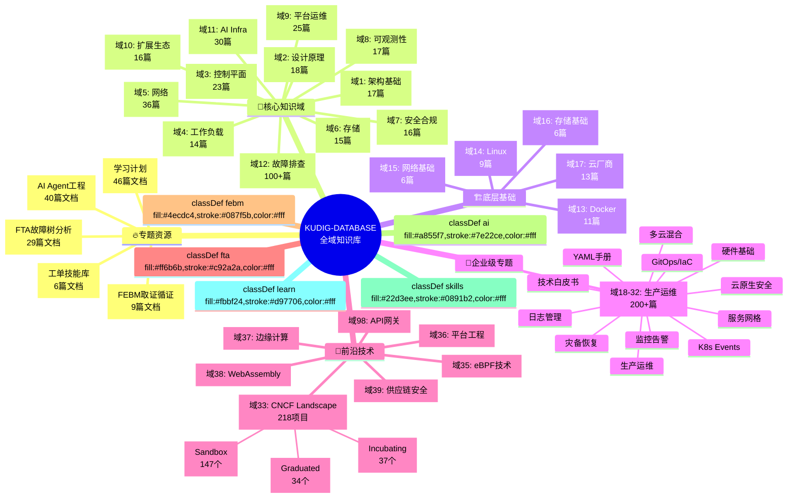
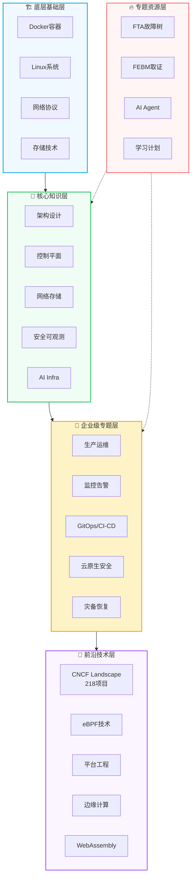
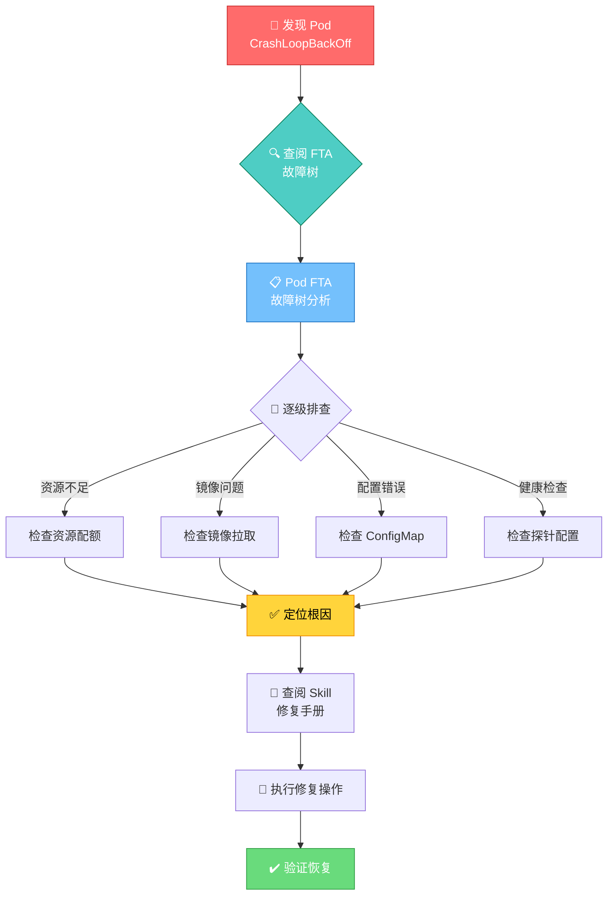
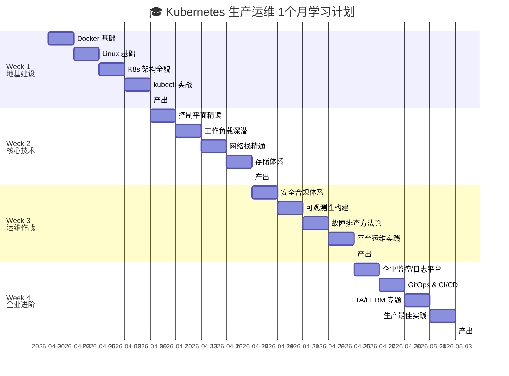
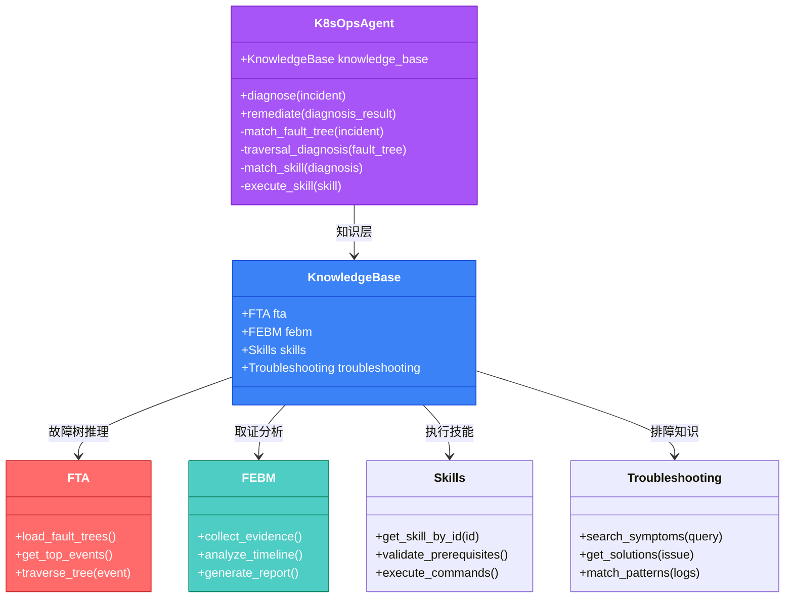
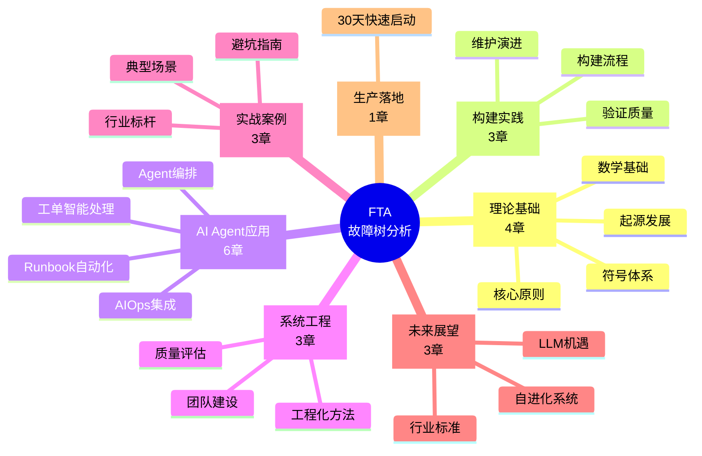
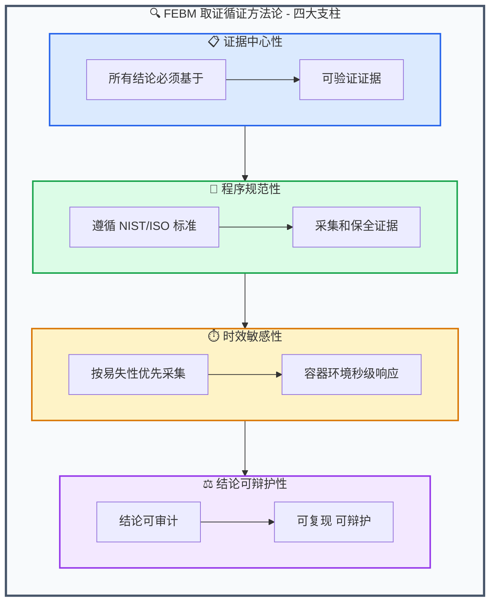
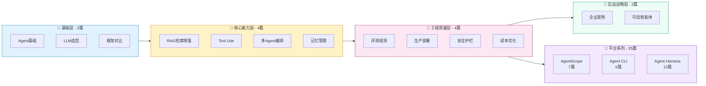

<div align="center">

<!-- Cool Logo with Gradient SVG -->
<svg width="800" height="200" viewBox="0 0 800 200" xmlns="http://www.w3.org/2000/svg">
  <defs>
    <!-- Gradient Definitions -->
    <linearGradient id="k8sBlue" x1="0%" y1="0%" x2="100%" y2="100%">
      <stop offset="0%" style="stop-color:#326ce5"/>
      <stop offset="100%" style="stop-color:#1a3a8f"/>
    </linearGradient>
    <linearGradient id="aiPurple" x1="0%" y1="0%" x2="100%" y2="100%">
      <stop offset="0%" style="stop-color:#9333ea"/>
      <stop offset="100%" style="stop-color:#581c87"/>
    </linearGradient>
    <linearGradient id="opsOrange" x1="0%" y1="0%" x2="100%" y2="100%">
      <stop offset="0%" style="stop-color:#f97316"/>
      <stop offset="100%" style="stop-color:#c2410c"/>
    </linearGradient>
    <linearGradient id="dbCyan" x1="0%" y1="0%" x2="100%" y2="100%">
      <stop offset="0%" style="stop-color:#06b6d4"/>
      <stop offset="100%" style="stop-color:#0891b2"/>
    </linearGradient>
    <filter id="glow">
      <feGaussianBlur stdDeviation="3" result="coloredBlur"/>
      <feMerge>
        <feMergeNode in="coloredBlur"/>
        <feMergeNode in="SourceGraphic"/>
      </feMerge>
    </filter>
  </defs>
  
  <!-- Background Decorative Elements -->
  <circle cx="50" cy="100" r="150" fill="url(#k8sBlue)" opacity="0.05"/>
  <circle cx="750" cy="100" r="120" fill="url(#aiPurple)" opacity="0.05"/>
  
  <!-- K Icon -->
  <g transform="translate(60, 50)">
    <rect x="0" y="0" width="80" height="100" rx="15" fill="url(#k8sBlue)" filter="url(#glow)"/>
    <text x="40" y="72" font-family="Arial Black, sans-serif" font-size="60" fill="white" text-anchor="middle" font-weight="bold">K</text>
  </g>
  
  <!-- Main Title -->
  <text x="400" y="70" font-family="Arial Black, sans-serif" font-size="52" fill="#1e293b" text-anchor="middle" font-weight="bold" letter-spacing="2">KUDIG</text>
  <text x="400" y="70" font-family="Arial Black, sans-serif" font-size="52" fill="url(#k8sBlue)" text-anchor="middle" font-weight="bold" letter-spacing="2" opacity="0.3">KUDIG</text>
  
  <!-- Subtitle -->
  <text x="400" y="105" font-family="system-ui, sans-serif" font-size="20" fill="#64748b" text-anchor="middle" font-weight="500">DATABASE</text>
  
  <!-- Description Line 1 -->
  <text x="400" y="145" font-family="system-ui, sans-serif" font-size="16" fill="#475569" text-anchor="middle">Kubernetes 生产运维全域知识库</text>
  
  <!-- Description Line 2 with AI Badge -->
  <rect x="280" y="160" width="240" height="28" rx="14" fill="url(#aiPurple)" opacity="0.1"/>
  <text x="400" y="179" font-family="system-ui, sans-serif" font-size="14" fill="url(#aiPurple)" text-anchor="middle" font-weight="600">🤖 AI Agent 首选语料库</text>
  
  <!-- Decorative Icons -->
  <g transform="translate(700, 60)" opacity="0.8">
    <!-- Database Cylinders -->
    <ellipse cx="30" cy="20" rx="25" ry="8" fill="url(#dbCyan)"/>
    <rect x="5" y="20" width="50" height="35" fill="url(#dbCyan)"/>
    <ellipse cx="30" cy="55" rx="25" ry="8" fill="url(#dbCyan)"/>
    <ellipse cx="30" cy="55" rx="25" ry="8" fill="none" stroke="#0891b2" stroke-width="2"/>
    <!-- Lines representing data -->
    <line x1="15" y1="30" x2="45" y2="30" stroke="white" stroke-width="2" opacity="0.5"/>
    <line x1="15" y1="40" x2="40" y2="40" stroke="white" stroke-width="2" opacity="0.5"/>
  </g>
  
  <!-- Gear Icon for Operations -->
  <g transform="translate(680, 120)" opacity="0.6">
    <circle cx="30" cy="30" r="18" fill="none" stroke="url(#opsOrange)" stroke-width="3"/>
    <path d="M30 5 L30 12 M30 48 L30 55 M5 30 L12 30 M48 30 L55 30 M14 14 L19 19 M41 41 L46 46 M14 46 L19 41 M41 19 L46 14" stroke="url(#opsOrange)" stroke-width="3" stroke-linecap="round"/>
  </g>
</svg>

<!-- Fallback Text Logo (for non-SVG rendering) -->
<!-- 
██╗  ██╗██╗   ██╗██████╗ ██╗ ██████╗     ██████╗  █████╗ ████████╗ █████╗ ██████╗ ███████╗
██║ ██╔╝██║   ██║██╔══██╗██║██╔════╝     ██╔══██╗██╔══██╗╚══██╔══╝██╔══██╗██╔══██╗██╔════╝
█████╔╝ ██║   ██║██║  ██║██║██║  ███╗    ██║  ██║███████║   ██║   ███████║██║  ██║█████╗  
██╔═██╗ ██║   ██║██║  ██║██║██║   ██║    ██║  ██║██╔══██║   ██║   ██╔══██║██║  ██║██╔══╝  
██║  ██╗╚██████╔╝██████╔╝██║╚██████╔╝    ██████╔╝██║  ██║   ██║   ██║  ██║██████╔╝███████╗
╚═╝  ╚═╝ ╚═════╝ ╚═════╝ ╚═╝ ╚═════╝     ╚═════╝ ╚═╝  ╚═╝   ╚═╝   ╚═╝  ╚═╝╚═════╝ ╚══════╝
-->

<!-- Badges Row -->
<p>
  
  
  
  
  
  
</p>

<p>
  
  
  
  
</p>

<!-- One-liner Description -->
<p align="center">
  <b>面向生产环境的 Kubernetes + AI Infrastructure 全域知识库</b><br/>
  <b>支持 NotebookLM / IMA / RAG 等 AI 问答场景</b><br/>
  <b>覆盖从基础架构到 LLM 工作负载的完整技术栈</b>
</p>

<!-- Quick Links -->
<p>
  <a href="#-快速开始">🚀 快速开始</a> •
  <a href="#-核心特性">✨ 核心特性</a> •
  <a href="#-知识体系架构">📚 知识体系</a> •
  <a href="#-ai-语料库场景">🤖 AI 语料库</a> •
  <a href="#-使用场景">🎯 使用场景</a> •
  <a href="#-内容统计">📊 统计</a>
</p>

</div>

---

## ✨ 核心特性

<table>
<tr>
<td width="50%">

### 🏭 生产级配置
所有 YAML/Shell 示例经过**万级节点生产环境验证**，可直接用于生产部署。非玩具示例，包含完整的监控告警、故障排查、安全加固方案。

### 🤖 AI 语料库就绪
专为 AI Agent 训练优化的知识组织：
- ✅ NotebookLM 原生支持
- ✅ 腾讯 IMA 知识库导入
- ✅ RAG 检索增强生成
- ✅ Agent 推理骨架（FTA/FEBM）

</td>
<td width="50%">

### 📚 内容全面性
- **4300万+** 字符（约1500万中文字）
- **950+** 篇技术文档
- **41** 个知识领域
- **218** 个 CNCF 开源项目
- **36** 个 FTA 故障树
- **40** 篇 AI Agent 工程

### 🔬 深度解析
- 控制平面组件源码级剖析
- CRI/CSI/CNI 接口详解
- 内核级性能调优
- 分布式系统原理

</td>
</tr>
</table>

---

## 🚀 快速开始

### 方式一：作为 AI 语料库使用

<details>
<summary>📱 <b>NotebookLM</b> - 生成专属技术播客</summary>

1. 访问 [notebooklm.google.com](https://notebooklm.google.com)
2. 创建新笔记本，添加本仓库 GitHub 链接
3. NotebookLM 自动解析所有 Markdown 文档
4. 使用「生成音频摘要」功能创建技术播客

> 💡 推荐组合：导入 `topic-fta/` + `domain-12-troubleshooting/` 生成故障排查专题播客
</details>

<details>
<summary>💬 <b>腾讯 IMA</b> - 构建个人知识库</summary>

1. 安装 IMA 知识库客户端
2. 导入本仓库文件夹（支持批量导入 Markdown）
3. 使用语义搜索快速定位知识点
4. 基于知识库进行问答对话

> 💡 推荐导入：`topic-dictionary/` + `topic-cheat-sheet/` 作为日常速查
</details>

<details>
<summary>🤖 <b>RAG 应用</b> - 构建智能运维助手</summary>

```python
# 使用 LangChain 加载知识库
from langchain.document_loaders import DirectoryLoader
from langchain.text_splitter import MarkdownHeaderTextSplitter

# 加载所有 Markdown 文档
loader = DirectoryLoader('./', glob='**/*.md')
docs = loader.load()

# 按标题层级分块（保持知识完整性）
splitter = MarkdownHeaderTextSplitter(
    headers_to_split_on=[('#', 'Header 1'), ('##', 'Header 2')]
)
chunks = splitter.split_text(docs)

# 构建向量库
# ... 接入 OpenAI /  Claude /  Qwen Embedding
```
</details>

### 方式二：作为学习资料使用

```bash
# 克隆仓库
git clone https://github.com/your-org/kudig-database.git
cd kudig-database

# 启动本地 GitBook 浏览（需要安装 mdBook）
cd gitbook
bash start.sh
# 浏览器访问 http://localhost:3000
```

### 方式三：Agent 训练语料

```yaml
# Agent Skill 示例：使用 topic-skills 作为训练数据
skill:
  name: k8s-troubleshooting
  corpus:
    - topic-skills/*.md      # 工单处理技能库
    - topic-fta/list/*.md    # 故障树分析
    - topic-febm/*.md        # 取证方法论
  agent_type: diagnostic    # 诊断型 Agent
```

---

## 📚 知识体系架构



### 知识层次结构



---

## 🤖 AI 语料库场景

本知识库专为 AI 时代的知识管理设计，完美适配以下场景：

### 1. NotebookLM - 音频学习

| 推荐导入内容 | 生成效果 | 适用人群 |
|-------------|---------|---------|
| `topic-learn/` 学习计划 | 系统化的技术播客系列 | 初学者 |
| `topic-fta/` 故障树分析 | 故障排查方法论播客 | SRE/运维 |
| `domain-11-ai-infra/` AI基础设施 | AI工程专题播客 | AI工程师 |

### 2. IMA / 豆包 / 文心一言 - 个人知识库

| 推荐导入内容 | 使用场景 | 预期效果 |
|-------------|---------|---------|
| `topic-dictionary/` 运维词典 | 日常查询术语 | 秒级概念检索 |
| `topic-cheat-sheet/` 速查卡 | 命令速查 | 提高操作效率 |
| `topic-structural-trouble-shooting/` | 故障排查 | 快速定位问题 |

### 3. RAG 应用 - 企业知识库

```python
# 推荐分块策略
├── domain-*/          # 按知识域分块，用于专业问答
├── topic-fta/          # 故障树结构，用于诊断推理
├── topic-skills/       # 技能库，用于 Agent 执行
└── topic-cheat-sheet/  # 速查卡，用于快速检索
```

### 4. Agent 训练语料

| 语料类型 | 用途 | 示例框架 |
|---------|------|---------|
| `topic-fta/*.md` | Agent 推理骨架 | AutoGen, CrewAI |
| `topic-skills/*.md` | 诊断-修复闭环 | AgentScope |
| `topic-febm/*.md` | 取证分析能力 | LangChain Agent |
| `domain-12-troubleshooting/*.md` | 故障排查知识 | Custom Agent |

---

## 🎯 使用场景

### 场景一：生产故障排查（SRE/运维）



**推荐路径**：
1. [FTA 生产快速落地](./topic-fta/23_fta_production_quick_start.md)
2. [Pod 故障树分析](./topic-fta/list/pod-fta.md)
3. [Pod CrashLoopBackOff Skill](./topic-skills/02-pod-crashloop-oomkilled.md)

### 场景二：系统学习 K8s（开发者/学生）



**完整计划**：[1个月学习计划](./topic-learn/public-training/one-month/README.md)

### 场景三：构建 K8s 运维 Agent（AI工程师）



---

## 📊 内容统计

<table>
<tr>
<td width="33%">

### 📈 整体规模
| 指标 | 数值 |
|------|------|
| 文件总数 | 1,477+ |
| Markdown 文档 | 950+ |
| 总字符数 | 4300万+ |
| 知识领域 | 41 |
| 开源产品 | 36 |

</td>
<td width="33%">

### 🤖 AI 相关
| 指标 | 数值 |
|------|------|
| AI Agent 文档 | 40 篇 |
| FTA 故障树 | 36 个 |
| FEBM 取证 | 9 篇 |
| 学习课程 | 46 篇 |
| CNCF 项目 | 218 个 |

</td>
<td width="33%">

### 🔧 运维专题
| 指标 | 数值 |
|------|------|
| 故障排查文档 | 150+ |
| 技能库 (Skills) | 6 个 |
| 速查卡 | 3 张 |
| 演示文档 | 12 篇 |
| 技术白皮书 | 16 篇 |

</td>
</tr>
</table>

### 各知识域文档分布

| 域 | 名称 | 文档数 | 关键内容 |
|:---:|:---|:---:|:---|
| 1 | 架构基础 | 17 | K8s 架构、核心组件、升级策略、性能调优 |
| 2 | 设计原理 | 18 | 声明式API、控制器模式、etcd共识、高可用 |
| 3 | 控制平面 | 23 | etcd、API Server、Scheduler、CRI/CSI/CNI |
| 4 | 工作负载 | 14 | Pod生命周期、调度器、HPA/VPA、资源管理 |
| 5 | 网络 | 36 | CNI、Service、DNS、Ingress、Gateway API |
| 6 | 存储 | 15 | PV/PVC、StorageClass、CSI驱动、备份恢复 |
| 7 | 安全合规 | 16 | RBAC、网络安全、运行时安全、审计合规 |
| 8 | 可观测性 | 17 | 监控指标、日志审计、链路追踪、混沌工程 |
| 9 | 平台运维 | 25 | 集群管理、GitOps、成本优化、灾备恢复 |
| 10 | 扩展生态 | 16 | CRD/Operator、Helm、CI/CD、服务网格 |
| 11 | AI基础设施 | 30 | GPU调度、分布式训练、LLM推理、成本优化 |
| 12 | 故障排查 | 150+ | 全组件故障排查、FTA故障树、结构化排障 |
| 13-17 | 底层基础 | 45 | Docker、Linux、网络/存储基础、云厂商 |
| 18-32 | 企业级专题 | 200+ | 生产运维、监控日志、GitOps、安全合规 |
| 33-39 | 前沿技术 | 300+ | CNCF项目、eBPF、平台工程、边缘计算 |

---

## 🧭 快速导航

### 按角色导航

<table>
<tr>
<td width="20%" align="center"><b>👨‍💻 开发者</b></td>
<td>
<a href="./domain-1-architecture-fundamentals/05-kubectl-commands-reference.md">kubectl 命令</a> → 
<a href="./domain-4-workloads/10-workload-controllers-overview.md">工作负载</a> → 
<a href="./domain-5-networking/11-service-concepts-types.md">Service</a> → 
<a href="./domain-10-extensions/08-cicd-pipelines.md">CI/CD</a>
</td>
</tr>
<tr>
<td align="center"><b>👨‍🔧 运维工程师</b></td>
<td>
<a href="./domain-3-control-plane/11-etcd-deep-dive.md">etcd 运维</a> → 
<a href="./domain-12-troubleshooting/">故障排查</a> → 
<a href="./domain-8-observability/06-monitoring-metrics-prometheus.md">监控告警</a> → 
<a href="./topic-fta/23_fta_production_quick_start.md">FTA 快速落地</a>
</td>
</tr>
<tr>
<td align="center"><b>🏗️ 架构师</b></td>
<td>
<a href="./domain-1-architecture-fundamentals/01-kubernetes-architecture-overview.md">架构基础</a> → 
<a href="./domain-2-design-principles/01-design-principles-foundations.md">设计原理</a> → 
<a href="./domain-2-design-principles/08-high-availability-patterns.md">高可用模式</a> → 
<a href="./domain-9-platform-ops/13-multi-cluster-management.md">多集群管理</a>
</td>
</tr>
<tr>
<td align="center"><b>🤖 AI工程师</b></td>
<td>
<a href="./domain-11-ai-infra/01-ai-infrastructure-overview.md">AI Infra</a> → 
<a href="./domain-11-ai-infra/03-gpu-scheduling-management.md">GPU调度</a> → 
<a href="./topic-ai-agent/01-ai-agent-fundamentals.md">Agent基础</a> → 
<a href="./topic-ai-agent/30-agent-harness-engineering.md">Harness工程</a>
</td>
</tr>
<tr>
<td align="center"><b>🎓 学习者</b></td>
<td>
<a href="./topic-learn/public-training/one-month/README.md">1个月计划</a> → 
<a href="./topic-cheat-sheet/k8s.md">K8s 速查卡</a> → 
<a href="./topic-dictionary/05-concept-reference.md">概念手册</a> → 
<a href="./domain-12-troubleshooting/">故障排查</a>
</td>
</tr>
<tr>
<td align="center"><b>🚨 SRE/故障调查</b></td>
<td>
<a href="./topic-fta/23_fta_production_quick_start.md">FTA 快速落地</a> → 
<a href="./topic-febm/8_febm_production_quick_start.md">FEBM 快速落地</a> → 
<a href="./topic-structural-trouble-shooting/">结构化排障</a> → 
<a href="./topic-skills/">工单技能库</a>
</td>
</tr>
</table>

### 按场景导航

| 场景 | 推荐起点 | 核心文档 |
|:---|:---|:---|
| **🔥 故障排查** | [topic-fta/README.md](./topic-fta/README.md) | 36个FTA故障树 + 100+篇排障文档 |
| **📚 系统学习** | [topic-learn/](./topic-learn/) | 1个月学习计划 + 46篇课程 |
| **🤖 Agent开发** | [topic-ai-agent/](./topic-ai-agent/) | 40篇AI Agent工程文档 |
| **⚡ 命令速查** | [topic-cheat-sheet/](./topic-cheat-sheet/) | K8s/Linux/Go 速查卡 |
| **🏢 企业部署** | [topic-deployment/](./topic-deployment/) | 从本地Demo到生产环境的完整路径 |
| **🔄 集群迁移** | [topic-migration/](./topic-migration/) | 10步完整迁移指南 |

---

## 🌟 特色专题

### 🧠 FTA 故障树分析 (Fault Tree Analysis)

> **29篇文档** | 行业级 FTA 方法论与 AI Agent 智能运维实践

FTA（故障树分析）是一套从传统安全工程理论到云原生 Kubernetes 智能运维实践的完整知识体系。

```


**核心文档**：
- [FTA 生产快速落地指南](./topic-fta/23_fta_production_quick_start.md) - 30天实施路线图
- [Kubernetes 全量故障树分析](./topic-fta/kubernetes_fta_full_analysis.md) - 8顶事件、63底事件
- [FTA 方法论与 AI Agent 实践合集](./topic-fta/fta_methodology_and_agentic_practices.md)

### 🔍 FEBM 取证循证方法论 (Forensic Evidence-Based Methodology)

> **9篇文档** | 从证据到结论的归纳式故障调查方法论

FEBM 与 FTA 形成**方法论互补**：
- **FTA** (演绎法): 自上而下，从假设到验证 —— "系统可能在哪里出问题？"
- **FEBM** (归纳法): 自下而上，从证据到结论 —— "系统实际发生了什么？"



**核心文档**：
- [FEBM 生产快速落地指南](./topic-febm/8_febm_production_quick_start.md) - 6个K8s故障取证Runbook
- [FEBM 方法论深度剖析](./topic-febm/febm_methodology_deep_dive.md)

### 🤖 AI Agent 工程

> **40篇文档** | 从基础概念到 Harness 工程的完整 Agent 构建指南

内容覆盖 **AI Agent 工程全生命周期**：


```

**核心文档**：
- [Agent Harness 工程](./topic-ai-agent/30-agent-harness-engineering.md) - 六层架构、质量门禁、K8S落地
- [Agent 赋能设计与落地路径](./topic-ai-agent/14-agent-kudig-design-strategy.md) - kudig知识底座 × Agent
- [Agent 语料库差距分析](./topic-ai-agent/15-agent-corpus-gap-analysis.md) - 10大类缺失分析

### 🎓 1个月学习计划

> **46篇文档** | 从零到全栈运维的完整学习路径

**Week 1: 地基建设期**
- Docker 基础 → Linux 基础 → K8s 架构 → kubectl 实战
- 产出：独立搭建 K8s 集群

**Week 2: 核心技术构建期**
- 控制平面精读 → 工作负载深潜 → 网络栈精通 → 存储体系
- 产出：生产级应用 YAML 编排

**Week 3: 运维作战能力期**
- 安全合规 → 可观测性构建 → 故障排查方法论 → 平台运维
- 产出：监控告警体系 + 排障手册

**Week 4: 企业级进阶期**
- 企业监控/日志 → GitOps → FTA/FEBM 专题 → 生产最佳实践
- 产出：GitOps 流水线 + Playbook

**完整计划**：[Kubernetes 生产运维 1 个月学习计划](./topic-learn/public-training/one-month/README.md)

### 🌐 CNCF Landscape 开源项目库

> **218篇文档** | CNCF 云原生全景图完整收录

| 成熟度 | 数量 | 代表项目 |
|:---|:---:|:---|
| **Graduated** | 34 | Kubernetes, Prometheus, Envoy, Helm, Istio, etcd, containerd, Argo, Cilium, Harbor, Falco |
| **Incubating** | 37 | OpenTelemetry, gRPC, Backstage, Kyverno, Kubeflow, Volcano, Chaos Mesh |
| **Sandbox** | 147 | k3s, MetalLB, K8sGPT, OpenEBS, Kuma |

**每篇文档包含**：架构图、核心概念、安装部署、使用示例、生态集成、参考资源

---

## 🏢 云厂商 Kubernetes 服务

| 云厂商 | 产品 | 特色 | 文档 |
|:---|:---|:---|:---|
| **阿里云** | ACK | 托管版/专有版、Terway网络、RRSA认证 | [查看](./domain-17-cloud-provider/01-alicloud-ack/) |
| **AWS** | EKS | IAM集成、EKS Anywhere混合云、Karpenter | [查看](./domain-17-cloud-provider/03-aws-eks/) |
| **Azure** | AKS | Azure AD集成、Confidential Containers | [查看](./domain-17-cloud-provider/04-azure-aks/) |
| **GCP** | GKE | Autopilot模式、Anthos多云、Borg传承 | [查看](./domain-17-cloud-provider/05-google-cloud-gke/) |
| **腾讯云** | TKE | 万级节点、VPC-CNI、超级节点 | [查看](./domain-17-cloud-provider/06-tencent-tke/) |
| **华为云** | CCE | GPU节点、ASM服务网格、鲲鹏ARM | [查看](./domain-17-cloud-provider/07-huawei-cce/) |
| **字节云** | VEK | 字节内部经验、高性能调度 | [查看](./domain-17-cloud-provider/13-volcengine-vek/) |

---

## 📖 速查资源

### 速查卡 (Cheat Sheet)

| 速查卡 | 内容 | 适用版本 |
|:---|:---|:---|
| [Kubernetes 速查卡](./topic-cheat-sheet/k8s.md) | kubectl、集群管理、Pod操作、网络、存储、RBAC、排障 | v1.25-v1.32 |
| [Linux 速查卡](./topic-cheat-sheet/linux.md) | 系统管理、进程、网络、存储、安全、Shell脚本 | RHEL 7-9, Ubuntu 20-24 |
| [Go 语言速查卡](./topic-cheat-sheet/go.md) | 语法、并发、网络、数据库、测试、性能优化 | Go 1.20-1.22 |

### 运维词典 (Dictionary)

**16篇专家级运维文档**，全面覆盖：
- 运维最佳实践、故障模式分析、性能调优专家指南
- SRE成熟度模型、概念参考手册、命令行清单
- AI基础设施专家指南、云原生安全专家指南
- 多云混合云运维手册、企业级运维最佳实践
- 生产事故管理Runbook、容量规划与资源预测
- 变更管理与发布策略、SLI/SLO/SLA工程实践
- 生产环境故障排查剧本

**查看全部**：[topic-dictionary/](./topic-dictionary/)

---

## 💻 本地 GitBook

本项目提供基于 [mdBook](https://rust-lang.github.io/mdBook/) 的本地文档浏览系统，支持全文搜索、目录折叠导航。

### 快速启动

```bash
# 安装 mdBook（需要 Rust 工具链）
cargo install mdbook

# 启动本地服务
cd gitbook
bash start.sh
# 浏览器访问 http://localhost:3000
```

### 常用命令

| 命令 | 说明 |
|:---|:---|
| `bash start.sh` | 初始化并启动本地服务（首次使用） |
| `PORT=8080 bash start.sh` | 指定端口启动 |
| `bash refresh.sh` | 完整刷新：更新符号链接 + 重新生成目录 + 重新构建 |
| `bash refresh.sh build` | 仅重新构建 |
| `bash export-static.sh` | 导出到 gitbook/dist/ 目录 |
| `bash export-static.sh --zip` | 导出并打包为 zip |

---

## 📝 版本说明

- **适用 Kubernetes 版本**: v1.25 - v1.32
- **最后更新时间**: 2026年4月
- **更新频率**: 持续更新，详见 [CHANGELOG.md](./CHANGELOG.md)

### 近期重大更新

| 日期 | 更新内容 |
|:---|:---|
| 2026-03 | **CNCF Landscape 218项目全量上线** - Graduated 34 + Incubating 37 + Sandbox 147 |
| 2026-03 | **Kubernetes 部署方案指南** - 从零到生产的完整部署路径 |
| 2026-03 | **1个月学习计划** - 46篇系统化学习课程 |
| 2026-03 | **FTA v2.0 全量故障树** - 36个组件故障树全面深化 |
| 2026-02 | **YAML配置清单手册** - 36篇K8s全资源YAML参考 |
| 2026-02 | **Domain 18-30 企业级专题** - 生产运维、监控日志、GitOps、安全合规等 |
| 2026-02 | **Agent Harness 工程** - 12篇2026最新范式 |

---

## 🤝 贡献指南

我们欢迎各种形式的贡献！

### 如何贡献

1. **Fork** 本仓库
2. **创建分支** (`git checkout -b feature/amazing-feature`)
3. **提交更改** (`git commit -m 'Add some amazing feature'`)
4. **推送分支** (`git push origin feature/amazing-feature`)
5. **创建 Pull Request**

### 贡献内容

- 📚 补充新的知识文档
- 🔧 修正现有文档错误
- 🌍 翻译文档
- 🐛 报告问题
- 💡 提出改进建议

### 文档规范

- 使用 Markdown 格式
- 遵循现有文档结构和风格
- 所有示例需经过验证
- 添加必要的引用和参考链接

---

## 📜 许可证

本项目采用 [CC BY-SA 4.0](https://creativecommons.org/licenses/by-sa/4.0/) 许可证。

您可以自由地：
- **共享** — 在任何媒介以任何形式复制、发行本作品
- **改编** — 修改、转换或以本作品为基础进行创作

惟须遵守下列条件：
- **署名** — 您必须给出适当的署名，提供指向本许可证的链接，同时标明是否作出了修改
- **相同方式共享** — 如果您再混合、转换或者基于本作品进行创作，您必须基于与原先许可协议相同的许可协议分发您贡献的作品

---

## 🙏 致谢

感谢所有为这个项目做出贡献的人！

### 特别感谢

- **Kubernetes 社区** - 提供了如此优秀的开源项目
- **CNCF** - 云原生计算基金会的所有项目
- **所有贡献者** - 你们的努力让这个项目变得更好

---

## 📮 联系我们

如有问题或建议，欢迎通过以下方式联系：

- 📧 邮箱: [your-email@example.com](mailto:your-email@example.com)
- 💬 Issues: [GitHub Issues](../../issues)
- 💭 Discussions: [GitHub Discussions](../../discussions)

---

<div align="center">

**如果觉得这个项目对您有帮助，请给我们一个 ⭐ Star！**

<p>
  <a href="../../stargazers">
    
  </a>
  <a href="../../forks">
    
  </a>
</p>

---

<p align="center">
  <sub>Built with ❤️ by the KUDIG team</sub>
</p>

<p align="center">
  <a href="#-kudig-database">
    
  </a>
</p>

</div>

---

<!-- 以下为完整的详细目录，默认折叠 -->

<details>
<summary><b>📂 点击查看完整目录结构</b></summary>

## 核心知识域 (Domain 1-12)

### 域1: 架构基础 (Architecture Fundamentals)
| # | 文档 | 关键内容 |
|:---:|:---|:---|
| 01 | [K8s架构概览](./domain-1-architecture-fundamentals/01-kubernetes-architecture-overview.md) | 企业级高可用架构、零信任安全、成本优化 |
| 02 | [核心组件深度解析](./domain-1-architecture-fundamentals/02-core-components-deep-dive.md) | 各组件职责与协作 |
| 05 | [kubectl命令参考](./domain-1-architecture-fundamentals/05-kubectl-commands-reference.md) | 命令大全、常用场景 |
| 07 | [升级策略](./domain-1-architecture-fundamentals/07-upgrade-paths-strategy.md) | 蓝绿部署、金丝雀升级、零停机方案 |
| 13 | [性能调优指南](./domain-1-architecture-fundamentals/13-performance-tuning-guide.md) | 超大规模集群优化、自动调优 |
| 14 | [安全架构](./domain-1-architecture-fundamentals/14-security-architecture.md) | 零信任架构、威胁检测、合规审计 |

### 域2: 设计原理 (Design Principles)
| # | 文档 | 关键内容 |
|:---:|:---|:---|
| 11 | [设计原则](./domain-2-design-principles/01-design-principles-foundations.md) | 核心设计哲学 |
| 12 | [声明式API](./domain-2-design-principles/02-declarative-api-pattern.md) | 声明式 vs 命令式 |
| 13 | [控制器模式](./domain-2-design-principles/03-controller-pattern.md) | Reconcile循环、最终一致性 |
| 17 | [etcd共识](./domain-2-design-principles/07-distributed-consensus-etcd.md) | Raft协议、数据一致性 |
| 22 | [Operator开发](./domain-2-design-principles/12-operator-development-guide.md) | Operator模式实践 |

### 域3: 控制平面 (Control Plane)
| # | 文档 | 关键内容 |
|:---:|:---|:---|
| 11 | [etcd深度解析](./domain-3-control-plane/11-etcd-deep-dive.md) | Raft共识、MVCC存储、备份恢复 |
| 12 | [API Server深度解析](./domain-3-control-plane/12-apiserver-deep-dive.md) | 认证授权、APF限流、审计日志 |
| 13 | [KCM深度解析](./domain-3-control-plane/13-kube-controller-manager-deep-dive.md) | 40+控制器、Leader选举 |
| 20 | [Scheduler深度解析](./domain-3-control-plane/20-kube-scheduler-deep-dive.md) | 调度框架、插件、抢占机制 |
| 21 | [CRI深度解析](./domain-3-control-plane/21-container-runtime-deep-dive.md) | containerd/CRI-O、安全容器 |
| 22 | [CSI深度解析](./domain-3-control-plane/22-container-storage-deep-dive.md) | CSI规范、驱动开发、快照功能 |
| 23 | [CNI深度解析](./domain-3-control-plane/23-container-network-deep-dive.md) | CNI规范、Calico/Cilium网络 |

### 域4: 工作负载 (Workloads)
| # | 文档 | 关键内容 |
|:---:|:---|:---|
| 10 | [工作负载控制器](./domain-4-workloads/10-workload-controllers-overview.md) | Deployment/StatefulSet/DaemonSet |
| 11 | [Pod生命周期](./domain-4-workloads/11-pod-lifecycle-events.md) | Phase、Condition、事件 |
| 30 | [调度器配置](./domain-4-workloads/30-scheduler-configuration.md) | 调度策略、亲和性 |
| 32 | [HPA/VPA](./domain-4-workloads/32-hpa-vpa-autoscaling.md) | 水平/垂直自动扩缩 |

### 域5: 网络 (Networking)
| # | 文档 | 关键内容 |
|:---:|:---|:---|
| 05 | [网络架构](./domain-5-networking/05-network-architecture-overview.md) | K8s网络模型、三层网络 |
| 07 | [CNI对比](./domain-5-networking/07-cni-plugins-comparison.md) | Flannel/Calico/Cilium对比 |
| 11 | [Service概念](./domain-5-networking/11-service-concepts-types.md) | ClusterIP/NodePort/LB |
| 16 | [DNS发现](./domain-5-networking/16-dns-service-discovery.md) | DNS服务发现机制 |
| 27 | [Ingress基础](./domain-5-networking/27-ingress-fundamentals.md) | Ingress核心架构、路由配置 |
| 35 | [Gateway API](./domain-5-networking/35-gateway-api-overview.md) | 新一代流量管理 |

### 域6: 存储 (Storage)
| # | 文档 | 关键内容 |
|:---:|:---|:---|
| 01 | [存储架构](./domain-6-storage/01-storage-architecture-overview.md) | 存储系统整体架构 |
| 02 | [PV架构](./domain-6-storage/02-pv-architecture-fundamentals.md) | PV/PVC工作机制 |
| 04 | [StorageClass](./domain-6-storage/04-storageclass-dynamic-provisioning.md) | 动态供给机制 |
| 05 | [CSI驱动](./domain-6-storage/05-csi-drivers-integration.md) | CSI驱动架构、故障处理 |

### 域7: 安全合规 (Security)
| # | 文档 | 关键内容 |
|:---:|:---|:---|
| 01 | [认证授权](./domain-7-security/01-authentication-authorization-system.md) | RBAC、OIDC、ServiceAccount |
| 02 | [网络安全](./domain-7-security/02-network-security-policies.md) | NetworkPolicy、零信任安全 |
| 03 | [运行时安全](./domain-7-security/03-runtime-security-defense.md) | Seccomp/AppArmor、Falco |
| 11 | [策略引擎](./domain-7-security/11-policy-engines-opa-kyverno.md) | OPA/Kyverno策略引擎对比 |

### 域8: 可观测性 (Observability)
| # | 文档 | 关键内容 |
|:---:|:---|:---|
| 01 | [架构概览](./domain-8-observability/01-observability-architecture-overview.md) | 可观测性架构体系 |
| 02 | [指标监控](./domain-8-observability/02-monitoring-metrics-system.md) | Prometheus监控体系 |
| 04 | [链路追踪](./domain-8-observability/04-distributed-tracing.md) | OpenTelemetry/Jaeger |
| 12 | [排障概览](./domain-8-observability/12-troubleshooting-overview.md) | 生产级故障排查全攻略 |
| 16 | [混沌工程](./domain-8-observability/16-chaos-engineering.md) | Chaos Mesh/Litmus |

### 域9: 平台运维 (Platform Operations)
| # | 文档 | 关键内容 |
|:---:|:---|:---|
| 01 | [运维概览](./domain-9-platform-ops/01-platform-ops-overview.md) | 平台运维职责、成熟度模型 |
| 02 | [集群管理](./domain-9-platform-ops/02-cluster-lifecycle-management.md) | 集群生命周期、扩缩容策略 |
| 06 | [监控告警](./domain-9-platform-ops/06-monitoring-alerting-system.md) | Prometheus/Grafana、SLO/SLI |
| 07 | [GitOps配置](./domain-9-platform-ops/07-gitops-configuration-management.md) | ArgoCD/FluxCD |
| 09 | [成本优化](./domain-9-platform-ops/09-cost-optimization-finops.md) | Kubecost、FinOps实践 |
| 13 | [多集群管理](./domain-9-platform-ops/13-multi-cluster-management.md) | 多集群联邦、统一管理 |

### 域10: 扩展生态 (Extensions)
| # | 文档 | 关键内容 |
|:---:|:---|:---|
| 01 | [CRD开发](./domain-10-extensions/01-crd-development-guide.md) | 自定义资源定义开发 |
| 05 | [包管理](./domain-10-extensions/05-package-management-tools.md) | Helm/Kustomize/Carvel对比 |
| 08 | [CI/CD流水线](./domain-10-extensions/08-cicd-pipelines.md) | Jenkins/Tekton/云效 |
| 09 | [ArgoCD](./domain-10-extensions/09-gitops-workflow-argocd.md) | GitOps工作流、多集群管理 |

### 域11: AI基础设施 (AI Infra)
| # | 文档 | 关键内容 |
|:---:|:---|:---|
| 01 | [AI Infra概览](./domain-11-ai-infra/01-ai-infrastructure-overview.md) | AI基础设施架构全景 |
| 03 | [GPU调度](./domain-11-ai-infra/03-gpu-scheduling-management.md) | GPU资源调度与管理 |
| 05 | [分布式训练](./domain-11-ai-infra/05-distributed-training-frameworks.md) | PyTorch DDP/FSDP |
| 17 | [LLM推理](./domain-11-ai-infra/17-llm-inference-serving.md) | vLLM/TGI部署 |
| 20 | [向量库/RAG](./domain-11-ai-infra/20-vector-database-rag.md) | Milvus/Qdrant/RAG |

### 域12: 故障排查 (Troubleshooting)

**结构化故障排查**: [topic-structural-trouble-shooting/](./topic-structural-trouble-shooting/)
- 控制平面、节点组件、网络、存储、工作负载
- 安全认证、资源调度、集群运维、云厂商集成
- AI/ML工作负载、GitOps/DevOps、可观测性

**FTA故障树**: [topic-fta/list/](./topic-fta/list/)
- Pod、Node、etcd、API Server、Scheduler、Ingress
- DNS、CSI、HPA/VPA、证书、RBAC、Helm、ArgoCD 等 36个

</details>
