<!-- condition: kubectl get pods -A -o json | jq '.items[] | select(.metadata.labels.app == "calico-node" or .metadata.labels.k8s-app == "calico-node") | {name: .metadata.name, status: .status.phase}' 显示 Calico Pod 异常 -->

# calico FTA 树：Calico CNI 故障诊断

> **fta_id**: FTA-CALICO-001
> **component**: cni / calico
> **severity**: P0-P2
> **k8s_versions**: ["1.28", "1.29", "1.30", "1.31", "1.32", "1.33"]
> **top_event_id**: TE-CALICO-001
> **last_updated**: 2026-05
> **authors**: KUDIG Team

---

## Mermaid FTA 树

```mermaid
flowchart TD
  TE["顶事件: Calico 网络异常<br/>Pod 无法通信 / 网络策略不生效 / BGP 会话断开"]
  OR0{{OR}}
  TE --> OR0

  %% ======== 一级分类 ========
  OR0 --> CAT_INSTALL["A. Calico 安装/初始化失败"]
  OR0 --> CAT_CNI["B. Calico CNI 配置加载失败"]
  OR0 --> CAT_FELIX["C. Felix/Bird BGP 会话异常"]
  OR0 --> CAT_NETPOL["D. NetworkPolicy 不生效"]
  OR0 --> CAT_TUNNEL["E. IPIP/VXLAN 隧道故障"]
  OR0 --> CAT_IPAM["F. IPAM 地址耗尽/冲突"]
  OR0 --> CAT_TYPHA["G. Felix-Typha 通信异常"]

  %% ======== A. 安装 ========
  A_OR{{OR}}
  CAT_INSTALL --> A_OR
  A_OR --> A1["A1. Typha/Confd 配置错误<br/>Calico manifest 不兼容 K8s 版本"]
  A_OR --> A2["A2. CNI 二进制文件未找到<br/>/opt/cni/bin/ 缺少 calico"]
  A_OR --> A3["A3. 容器镜像拉取失败<br/>quay.io/calico 访问超时/认证失败"]

  %% ======== B. CNI ========
  B_OR{{OR}}
  CAT_CNI --> B_OR
  B_OR --> B1["B1. CNI config 顺序错误<br/>calico.conflist 在错误位置或被覆盖"]
  B_OR --> B2["B2. CNI 网络类型错误<br/>type 参数与节点内核不匹配"]
  B_OR --> B3["B3. IPAM 配置错误<br/>CALICO_IPV4POOL_CIDR 与集群 CIDR 冲突"]

  %% ======== C. Felix/BGP ========
  C_OR{{OR}}
  CAT_FELIX --> C_OR
  C_OR --> C1["C1. Felix 健康检查失败<br/>birdc show protocols 显示会话 down"]
  C_OR --> C2["C2. Bird BGP 会话建立失败<br/>AS number 冲突 / BFD 未启用"]
  C_OR --> C3["C3. BGP Route Reflector 配置错误<br/>节点未在 routeReflectorClusterIds 中"]
  C_OR --> C4["C4. 全网状 BGP 需要大量连接<br/>节点数 > 50 时 BGP 连接数爆炸"]

  %% ======== D. NetworkPolicy ========
  D_OR{{OR}}
  CAT_NETPOL --> D_OR
  D_OR --> D1["D1. policy 顺序导致 deny-all 优先<br/>最后一条 deny-all 阻止了允许规则"]
  D_OR --> D2["D2. selector scope 不匹配<br/>namespaceSelector vs podSelector 范围混淆"]
  D_OR --> D3["D3. doNotTrack / preDNAT 规则冲突<br/>对已有流的策略不生效"]
  D_OR --> D4["D4. HostEndpoint 策略未生效<br/>节点未打标签 projectcalico.org/hostendpoint Created"]

  %% ======== E. Tunnel ========
  E_OR{{OR}}
  CAT_TUNNEL --> E_OR
  E_OR --> E1["E1. IPIP 隧道断裂<br/>encapMode=ipip 但网络不支持"]
  E_OR --> E2["E2. VXLAN 隧道无法建立<br/>2379/4789 端口被防火墙拦截"]
  E_OR --> E3["E3. 隧道加密（WireGuard）异常<br/>内核不支持 wireguard 或密钥分发失败"]

  %% ======== F. IPAM ========
  F_OR{{OR}}
  CAT_IPAM --> F_OR
  F_OR --> F1["F1. IP 地址池耗尽<br/>calicoctl ipam show 显示已无可用 IP"]
  F_OR --> F2["F2. IP 冲突（双鸟现象）<br/>两个节点使用相同 IP"]
  F_OR --> F3["F3. IPv4 CIDR 变更后路由冲突<br/>旧路由仍存在导致无法访问"]

  %% ======== G. Typha ========
  G_OR{{OR}}
  CAT_TYPHA --> G_OR
  G_OR --> G1["G1. Typha 连接不稳定<br/>Felix 无法与 Typha 建立长连接"]
  G_OR --> G2["G2. Typha 证书错误<br/>Felix 使用 TLS 但 Typha CA 配置错误"]
  G_OR --> G3["G3. Typha 内存压力导致 OOM<br/>节点数 > 100 时 Typha 成为瓶颈"]

  %% ======== 顶事件详细说明 ========
  TE_HL["顶事件详细说明"]
  TE --> TE_HL
  TE_HL --> HL1["症状: kubectl exec 进入 Pod 正常，但无法 ping 通其他 Pod"]
  TE_HL --> HL2["症状: Calico 已安装但容器网络异常（cni type 不支持）"]
  TE_HL --> HL3["症状: NetworkPolicy 配置后流量未被阻止"]
  TE_HL --> HL4["症状: 节点 NotReady，calico-node pod restart 循环"]
```



---

## A. Calico 安装/初始化失败

### A1. Typha/Confd 配置错误

**故障现象**: calico-node pod 处于 CrashLoopBackOff 或 Init:CrashLoopBackOff

**可能原因**：
- Calico manifest 版本与 K8s 版本不兼容（v3.24+ 支持 K8s 1.28+）
- Typha 数量配置错误导致资源配置不足

**排查步骤**：
```bash
# 1. 检查 calico-node pod 状态
kubectl get pods -n kube-system -l k8s-app=calico-node
# 2. 查看 init container 日志
kubectl logs -n kube-system <calico-node-pod> -c init | tail -50
# 3. 检查 Calico 版本兼容性
kubectl exec -n kube-system <calico-node-pod> -- calico-node --version
# 4. 查看 calico-node 主 container 日志
kubectl logs -n kube-system <calico-node-pod> --tail=100
# 5. 确认 K8s 版本对应的 Calico 最低版本要求
# K8s 1.28+ 需要 Calico v3.24+
```

### A2. CNI 二进制文件未找到

**故障现象**: kubelet 日志显示 `stat /opt/cni/bin/calico: no such file or directory`

**排查步骤**：
```bash
# 1. 检查 CNI bin 目录
ls -la /opt/cni/bin/
# 2. 如缺少 calico，使用以下方式安装
# 通过 DaemonSet init container 复制
kubectl get daemonset -n kube-system calico-node -o jsonpath='{.spec.template.spec.initContainers[*].image}'
# 或手动安装
wget https://github.com/projectcalico/cni-plugin/releases/download/v3.24.0/calico
mv calico /opt/cni/bin/calico && chmod +x /opt/cni/bin/calico
# 3. 确认 calico 配置存在
ls /etc/cni/net.d/
```

### A3. 容器镜像拉取失败

**故障现象**: calico-node pod 卡在 ImagePullBackOff

**排查步骤**：
```bash
# 1. 检查镜像地址
kubectl get pods -n kube-system -l k8s-app=calico-node -o jsonpath='{.items[*].spec.containers[*].image}'
# 2. 在节点上手动拉取
crictl pull quay.io/calico/node:v3.24.0
crictl pull calico/kube-controllers:v3.24.0
# 3. 如有认证问题，配置 imagePullSecrets
# 4. 或使用内网镜像仓库
```

---

## B. Calico CNI 配置加载失败

### B1. CNI config 顺序错误

**故障现象**: kubelet 日志显示使用了错误的 CNI 插件（flannel 而非 calico）

**排查步骤**：
```bash
# 1. 检查 CNI 配置目录顺序
ls -la /etc/cni/net.d/
# 2. Calico 要求配置文件名以字母顺序排在最前面或后缀为 .conflist/.conf
# 3. 确保 calico 的 conf 文件优先级最高（数字或字母排序）
mv /etc/cni/net.d/10-calico.conf /etc/cni/net.d/99-calico.conf
# 4. 删除 flannel 配置文件（如不需要）
rm /etc/cni/net.d/10-flannel.conflist
# 5. 重启 kubelet
systemctl restart kubelet
```

### B2. IPAM 配置错误

**故障现象**: Pod 分配到的 IP 不在预期的 CIDR 范围内，或分配失败

**排查步骤**：
```bash
# 1. 检查 Calico IPPool 配置
kubectl get ippool -o yaml
# 2. 查看 Calico 默认 IPPool 的 CIDR
# 3. 确认与 K8s service CIDR 不冲突
kubectl get svc -o jsonpath='{.items[*].spec.clusterIP}' | tr ' ' '\n' | head -5
# 4. 检查 IPAM 块分配情况
calicoctl ipam show --show-blocks
# 5. 如需修改 CIDR（谨慎）
# 先禁用 IPPool，再新建，再重启 calico-node
```

---

## C. Felix/Bird BGP 会话异常

### C1. Felix 健康检查失败

**故障现象**: `kubectl exec <calico-node-pod> -- calico-node node-status` 报错

**排查步骤**：
```bash
# 1. 检查 Felix 状态
kubectl exec -n kube-system <calico-node-pod> -- calico-node status
# 2. 查看 Bird 会话状态
kubectl exec -n kube-system <calico-node-pod> -- birdcl show protocols
# 3. 检查 Felix 与 Typha 的连接
kubectl exec -n kube-system <calico-node-pod> -- netstat -tlnp | grep 5473
# 4. 如需要，启用 Felix 的详细日志
kubectl exec -n kube-system <calico-node-pod> -- sed -i 's/LOG_LEVEL=info/LOG_LEVEL=debug/' /etc/calico/confd/config-node.env
kubectl exec -n kube-system <calico-node-pod> -- kill -HUP 1  # 重新加载配置
```

### C2. Bird BGP 会话建立失败

**故障现象**: `birdcl show protocols` 显示 BGP 会话 down

**排查步骤**：
```bash
# 1. 检查 AS number 是否冲突
# 两个节点不能使用相同的 AS number（除非使用 Route Reflector）
kubectl exec -n kube-system <calico-node-pod> -- birdcl show protocols | grep -i bgp
# 2. 检查 BGP 端口（TCP 179）是否被防火墙拦截
iptables -L -n | grep 179
# 3. 检查 BFD 配置（如启用）
kubectl exec -n kube-system <calico-node-pod> -- birdcl show bfd session
# 4. 查看 Bird 日志
kubectl exec -n kube-system <calico-node-pod> -- birdc show log
# 5. 常见原因：节点间路由不可达、AS 号冲突、防火墙阻止 179 端口
```

### C3. BGP Route Reflector 配置错误

**故障现象**: 超过 50 节点的全网状 BGP 连接数爆炸，新节点之间无法互通

**排查步骤**：
```bash
# 1. 检查 BGP 会话数
kubectl exec -n kube-system <calico-node-pod> -- birdcl show protocols | grep BGP | wc -l
# 2. 配置 Route Reflector（用于大规模集群）
# 在某个节点打标签: kubectl label node <node-name> calico-role=reflector
# 创建 BGPPeer 资源指向该节点
# 3. 查看已配置的 BGPPeer
kubectl get bgppeer -o yaml
# 4. 减少全局 BGP 会话数（改用 node-to-node mesh = false + RR）
```

---

## D. NetworkPolicy 不生效

### D1. Policy 顺序导致 deny-all 优先

**故障现象**: 配置了 allow 规则但流量仍然被阻止，或配置了 deny-all 后整个命名空间流量中断

**排查步骤**：
```bash
# 1. 查看 Calico NetworkPolicy 顺序
kubectl get networkpolicy -o yaml
# 2. Calico 的 NetworkPolicy 按 creationTimestamp 顺序评估
# deny-all 应放在 allow 规则之后，或在 allow 之前但使用更高优先级
# 3. 检查 Policy 优先级（spec order 字段，数字越小优先级越高）
# 4. 临时禁用 deny-all 测试
kubectl label namespace <ns> projectcalico.org/namespace-kind=production
# 或删除 deny-all policy 测试
# 5. 确认 namespace 有正确的 Calico profile
kubectl get profile
```

### D2. selector scope 不匹配

**故障现象**: Policy 选择器配置正确但流量未被正确允许/阻止

**排查步骤**：
```bash
# 1. 确认 Pod 的 labels 与 selector 匹配
kubectl get pod <pod-name> --show-labels
# 2. 检查 namespaceSelector vs podSelector 的区别
# namespaceSelector: 选择整个命名空间下的所有 Pod
# podSelector: 只选择匹配标签的 Pod（在当前命名空间）
# 3. 查看已应用的 Policy 规则
calicoctl get policy -o yaml
# 4. 在 workload 端点查看实际生效的策略
calicoctl get workloadendpoint -o yaml | grep -A10 policy
```

### D3. HostEndpoint 策略未生效

**故障现象**: 配置了针对 HostEndpoint 的 policy 但不生效

**排查步骤**：
```bash
# 1. 确认节点已创建 HostEndpoint 资源
kubectl get hostendpoint
# 2. 如 HostEndpoint 不存在，手动创建
cat <<EOF | kubectl apply -f -
apiVersion: projectcalico.org/v3
kind: HostEndpoint
metadata:
  name: node-1-eth0
  labels:
    node: node-1
spec:
  node: node-1
  interfaceName: eth0
  expectedIPs:
  - 192.168.1.10
EOF
# 3. 检查节点是否有标签 projectcalico.org/hostendpoint: created
kubectl get nodes <node-name> --show-labels | grep calico
# 4. 查看 Felix 的 policy 匹配情况
calicoctl policy ls | grep -i <policy-name>
```

---

## E. IPIP/VXLAN 隧道故障

### E1. IPIP 隧道断裂

**故障现象**: 跨节点 Pod 通信失败，`tcpdump` 显示 IPIP 包但无响应

**排查步骤**：
```bash
# 1. 检查 tunnel 配置
cat /etc/calico/confd/config/bird.cfg | grep -i tunnel
# 2. 确认 encapMode
# Calico 默认 IPIP 模式用于跨子网通信
# 3. 在节点上手动创建 IPIP 隧道测试
ip tunnel add tun-ipip mode ipip remote <remote-ip> dev eth0
# 4. 检查内核是否支持 IPIP
cat /proc/net/ipip  # 存在则支持
# 5. 如内核不支持，切换到 VXLAN 模式
kubectl patch felixconfiguration default -p '{"spec":{"vxlanEnabled":true}}'
```

### E2. VXLAN 隧道无法建立

**故障现象**: 使用 VXLAN 模式时跨节点 Pod 不通，`calicoctl show wireshark` 无数据

**排查步骤**：
```bash
# 1. 检查 VTEP 配置
ip addr show | grep vxlan.calico
# 2. 检查 UDP 端口 4789 是否开放（防火墙）
iptables -L -n | grep 4789
# 3. 确认节点 IP 可达
ping -c 3 <remote-node-ip>
# 4. 检查 Calico VXLAN 端口（男孩天朝：UDP 4789）
# 5. 查看 Felix 的 ARP 表
ip neigh show | grep vxlan
```

---

## F. IPAM 地址耗尽/冲突

### F1. IP 地址池耗尽

**故障现象**: 新建 Pod 无法分配 IP，`calicoctl ipam show` 显示无可用 IP

**排查步骤**：
```bash
# 1. 查看 IP 池使用情况
calicoctl ipam show --show-blocks
# 2. 检查是否有 IP 未释放（已分配但 Pod 已删除）
calicoctl ipam show --detail | grep -i "still in use"
# 3. 释放泄漏的 IP
calicoctl ipam release <ip-address>
# 4. 扩容 IP 池（如果集群支持新 CIDR）
kubectl apply -f - <<EOF
apiVersion: projectcalico.org/v3
kind: IPPool
metadata:
  name: my-new-pool
spec:
  cidr: 192.168.200.0/24
  natOutgoing: true
EOF
```

### F2. IP 冲突（双鸟现象）

**故障现象**: 两个 Pod 使用相同 IP，互相 ping 不通对方

**排查步骤**：
```bash
# 1. 查找冲突 IP 的持有者
calicoctl get hostendpoint -o yaml | grep -A5 <ip-address>
# 2. 查看分配了冲突 IP 的 WorkloadEndpoint
calicoctl get workloadendpoints --by-ip=<ip-address>
# 3. 删除泄漏的 WorkloadEndpoint
calicoctl delete workloadendpoint <name> --namespace=<ns>
# 4. 确认 Felix 中 ARP 表干净
ip neigh show | grep <ip-address>
```

---

## G. Felix-Typha 通信异常

### G1. Typha 连接不稳定

**故障现象**: calico-node pod 日志中频繁出现 "Typha connection reset"

**排查步骤**：
```bash
# 1. 检查 Typha pod 状态
kubectl get pods -n kube-system -l k8s-app=calico-typha
# 2. 查看 Typha 日志
kubectl logs -n kube-system calico-typha-xxx --tail=50
# 3. 检查 Felix 配置中 Typha 服务地址
kubectl get configmap -n kube-system calico-config -o yaml | grep typha
# 4. 调整 Typha 副本数（大规模集群建议 2-3 个）
kubectl scale deployment calico-typha -n kube-system --replicas=3
```

---

## 附录：关键命令索引

| 故障场景 | 诊断命令 |
|---------|---------|
| Calico 状态 | `calicoctl node status` |
| BGP 会话 | `birdcl show protocols` |
| IP 池使用 | `calicoctl ipam show --show-blocks` |
| NetworkPolicy | `calicoctl get policy -o yaml` |
| HostEndpoint | `calicoctl get hostendpoint -o yaml` |
| VTEP 配置 | `ip addr show | grep vxlan` |
| 路由表 | `ip route` |
| Felix 日志 | `kubectl logs -n kube-system calico-node-xxx --tail=50` |
| 隧道状态 | `calicoctl tunnel talk` |

---

```yaml
---
fta_id: FTA-CALICO-001
component: cni / calico
severity: P0-P2
k8s_versions: ["1.28", "1.29", "1.30", "1.31", "1.32", "1.33"]
top_event_id: TE-CALICO-001
related_skills: []
knowledge_refs:
  - domain-03-networking-traffic/03-cni-plugins-comparison.md
  - domain-03-networking-traffic/27-cni-troubleshooting-optimization.md
  - domain-10-troubleshooting-diagnostics/topic-fta/list/networkpolicy-fta.md
  - domain-10-troubleshooting-diagnostics/topic-fta/list/terway-fta.md
---
```

## Related

- [[skills/Agent Orchestration Patterns|Agent Orchestration Patterns for FTA]] — Cross-reference
- [[domain-19-landscape-references/topic-release-notes/networking/calico/RELEASE-NOTES-3.28|calico v3.28 Release Notes]]
- [[domain-19-landscape-references/topic-release-notes/networking/calico/RELEASE-NOTES-3.29|calico v3.29 Release Notes]]
- [[domain-19-landscape-references/topic-release-notes/networking/calico/RELEASE-NOTES-3.26|calico v3.26 Release Notes]]
- [[domain-19-landscape-references/topic-release-notes/networking/calico/RELEASE-NOTES-3.22|calico v3.22 Release Notes]]
- [[domain-19-landscape-references/topic-release-notes/networking/calico/RELEASE-NOTES-3.23|calico v3.23 Release Notes]]
- [[domain-19-landscape-references/topic-release-notes/networking/calico/RELEASE-NOTES-3.27|calico v3.27 Release Notes]]
- [[domain-19-landscape-references/topic-release-notes/networking/calico/RELEASE-NOTES-3.30|calico v3.30 Release Notes]]
- [[domain-19-landscape-references/topic-release-notes/networking/calico/RELEASE-NOTES-3.24|calico v3.24 Release Notes]]
- [[domain-19-landscape-references/topic-release-notes/networking/calico/RELEASE-NOTES-3.25|calico v3.25 Release Notes]]
- [[domain-19-landscape-references/topic-release-notes/networking/calico/RELEASE-NOTES-3.31|calico v3.31 Release Notes]]
- [[domain-19-landscape-references/topic-release-notes/networking/calico/RELEASE-NOTES-3.21|calico v3.21 Release Notes]]
