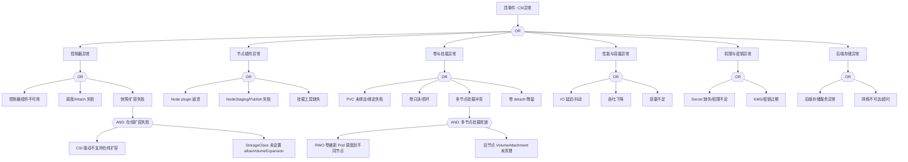

<!-- condition: kubectl describe pod <pod> -n <ns> | grep -E 'FailedMount|FailedAttachVolume' 显示存储挂载错误 -->

# CSI 存储异常 FTA 树

## 适用范围与说明
- **目标**：覆盖 CSI 存储在生产环境中的挂载、性能与可用性异常路径。
- **范围**：驱动与控制器、节点插件、卷与快照、权限与密钥、后端存储依赖。
- **符号**：
  - **OR 门**：任一子事件成立即可触发父事件
  - **AND 门**：所有子事件同时成立才触发父事件

---

## Mermaid FTA 树



---

## 生产级观测与证据
- **事件**：
  - FailedMount / FailedAttachVolume / VolumeAttachFailed
  - ProvisioningFailed / ProvisioningCleanupFailed
  - VolumeResizeFailed / FileSystemResizeFailed
  - ExternalExpanding / VolumeSnapshotFailed
- **关键指标**：
  - 卷挂载失败率 (kubelet_volume_stats_*)
  - IO 延迟 (node_disk_io_time_seconds_total)
  - PVC 绑定时长 (kube_persistentvolumeclaim_status_phase)
  - CSI 操作耗时 (csi_operations_seconds)
  - 卷容量使用率 (kubelet_volume_stats_used_bytes)
- **关键日志**：
  - CSI controller 日志 (csi-provisioner, csi-attacher, csi-resizer)
  - CSI node plugin 日志
  - kubelet 卷挂载日志
  - 后端存储系统日志
- **配置核对**：
  - StorageClass 配置 (provisioner, parameters, allowVolumeExpansion)
  - VolumeSnapshotClass 配置
  - Secret 引用完整性
  - 节点上挂载工具 (mount.nfs, iscsiadm, ceph-common)

---

## JSON 工作流（含与/或门控件）

```json
{
  "flow_steps": [
    { "name": "开始", "action": "start", "step": "start_csi_fta", "next_step": "event_csi_abnormal" },
    { "name": "顶事件: CSI异常", "action": "event", "step": "event_csi_abnormal", "description": "卷无法挂载/性能下降/扩容快照失败", "next_step": "gate_root_or" },
    { "name": "根因 OR 门", "action": "gate_or", "step": "gate_root_or", "control": "or_gate", "gate_type": "OR", "next_steps": ["cat_ctrl", "cat_node", "cat_vol", "cat_perf", "cat_auth", "cat_back"] },

    { "name": "类别: 控制器异常", "action": "category", "step": "cat_ctrl", "next_step": "gate_ctrl_or" },
    { "name": "控制器 OR 门", "action": "gate_or", "step": "gate_ctrl_or", "control": "or_gate", "gate_type": "OR", "next_steps": ["evt_ctrl_down", "evt_attach_fail", "evt_resize_fail"] },
    {
      "name": "底事件: 控制器组件不可用", "action": "bottom_event", "step": "evt_ctrl_down",
      "description": "CSI controller Pod（provisioner/attacher/resizer/snapshotter）不可用",
      "metadata": { "severity": "critical", "probability": "low", "mttr_minutes": 20,
        "detection": { "events": ["ProvisioningFailed"], "metrics": [], "logs": ["controller not ready", "leader election lost"] },
        "remediation": { "manual_steps": ["检查 CSI controller StatefulSet/Deployment 状态", "查看 controller Pod 日志", "确认 leader election 正常", "重启 controller Pod"], "auto_actions": [] } },
      "next_step": "gate_root_or"
    },
    {
      "name": "底事件: 调度/Attach 失败", "action": "bottom_event", "step": "evt_attach_fail",
      "description": "卷 Attach 到节点失败（VolumeAttachment 错误）",
      "metadata": { "severity": "high", "probability": "medium", "mttr_minutes": 30,
        "detection": { "events": ["FailedAttachVolume", "VolumeAttachFailed"], "metrics": [], "logs": ["AttachVolume failed", "volume is already exclusively attached"] },
        "remediation": { "manual_steps": ["检查 VolumeAttachment: kubectl get volumeattachment", "确认卷未被其他节点占用", "检查 CSI attacher 日志", "必要时手动删除残留 VolumeAttachment"], "auto_actions": [] } },
      "next_step": "gate_root_or"
    },
    {
      "name": "底事件: 快照/扩容失败", "action": "bottom_event", "step": "evt_resize_fail",
      "description": "卷在线扩容或快照创建失败",
      "metadata": { "severity": "medium", "probability": "medium", "mttr_minutes": 30,
        "detection": { "events": ["VolumeResizeFailed", "FileSystemResizeFailed", "VolumeSnapshotFailed"], "metrics": [], "logs": ["resize failed", "snapshot failed"] },
        "remediation": { "manual_steps": ["检查 StorageClass allowVolumeExpansion 配置", "确认 CSI 驱动支持扩容/快照", "检查后端存储容量", "查看 csi-resizer/csi-snapshotter 日志"], "auto_actions": [] } },
      "next_step": "gate_and_resize"
    },
    {
      "name": "AND 门: 在线扩容失败", "action": "gate_and", "step": "gate_and_resize", "control": "and_gate", "gate_type": "AND",
      "description": "CSI 驱动不支持在线扩容 + StorageClass 未配置 = 扩容失败",
      "conditions": ["CSI 驱动不支持在线扩容", "StorageClass 未设 allowVolumeExpansion"],
      "combined_severity": "high",
      "next_steps": ["evt_and_resize_nosupport", "evt_and_resize_noconfig"], "next_step": "gate_root_or"
    },
    { "name": "AND 条件1: 驱动不支持", "action": "and_condition", "step": "evt_and_resize_nosupport", "description": "CSI 驱动未实现 ControllerExpandVolume/NodeExpandVolume", "parent_gate": "gate_and_resize" },
    { "name": "AND 条件2: SC 未配置", "action": "and_condition", "step": "evt_and_resize_noconfig", "description": "StorageClass 未设置 allowVolumeExpansion: true", "parent_gate": "gate_and_resize" },

    { "name": "类别: 节点插件异常", "action": "category", "step": "cat_node", "next_step": "gate_node_or" },
    { "name": "节点插件 OR 门", "action": "gate_or", "step": "gate_node_or", "control": "or_gate", "gate_type": "OR", "next_steps": ["evt_node_crash", "evt_stage_fail", "evt_tool_missing"] },
    {
      "name": "底事件: Node plugin 崩溃", "action": "bottom_event", "step": "evt_node_crash",
      "description": "CSI node plugin DaemonSet Pod 崩溃或不可用",
      "metadata": { "severity": "critical", "probability": "low", "mttr_minutes": 20,
        "detection": { "events": ["FailedMount"], "metrics": [], "logs": ["node driver not found", "CSI node plugin not running"] },
        "remediation": { "manual_steps": ["检查 CSI node DaemonSet 状态", "查看 node plugin Pod 日志", "检查 CSI socket 注册: /var/lib/kubelet/plugins/", "重启 node plugin"], "auto_actions": [] } },
      "next_step": "gate_root_or"
    },
    {
      "name": "底事件: NodeStaging/Publish 失败", "action": "bottom_event", "step": "evt_stage_fail",
      "description": "卷 NodeStage 或 NodePublish 操作失败",
      "metadata": { "severity": "high", "probability": "medium", "mttr_minutes": 30,
        "detection": { "events": ["FailedMount"], "metrics": [], "logs": ["NodeStageVolume failed", "NodePublishVolume failed"] },
        "remediation": { "manual_steps": ["检查 node plugin 日志获取详细错误", "验证存储后端连通性", "检查设备路径和权限", "确认文件系统类型正确"], "auto_actions": [] } },
      "next_step": "gate_root_or"
    },
    {
      "name": "底事件: 挂载工具缺失", "action": "bottom_event", "step": "evt_tool_missing",
      "description": "节点上缺少 mount 工具（nfs-utils, iscsi-initiator, ceph-common）",
      "metadata": { "severity": "high", "probability": "medium", "mttr_minutes": 20,
        "detection": { "events": ["FailedMount"], "metrics": [], "logs": ["mount: command not found", "iscsiadm: not found"] },
        "remediation": { "manual_steps": ["安装对应存储客户端工具", "NFS: yum install nfs-utils", "iSCSI: yum install iscsi-initiator-utils", "Ceph: yum install ceph-common"], "auto_actions": [] } },
      "next_step": "gate_root_or"
    },

    { "name": "类别: 卷与挂载异常", "action": "category", "step": "cat_vol", "next_step": "gate_vol_or" },
    { "name": "卷 OR 门", "action": "gate_or", "step": "gate_vol_or", "control": "or_gate", "gate_type": "OR", "next_steps": ["evt_pvc_unbound", "evt_vol_readonly", "evt_mount_conflict", "evt_detach_stale"] },
    {
      "name": "底事件: PVC 未绑定/绑定失败", "action": "bottom_event", "step": "evt_pvc_unbound",
      "description": "PVC 处于 Pending 状态，动态供给失败或无匹配 PV",
      "metadata": { "severity": "high", "probability": "common", "mttr_minutes": 20,
        "detection": { "events": ["ProvisioningFailed", "FailedBinding"], "metrics": ["kube_persistentvolumeclaim_status_phase{phase='Pending'}"], "logs": ["no persistent volumes available", "provisioning failed"] },
        "remediation": { "manual_steps": ["检查 PVC 状态: kubectl describe pvc", "验证 StorageClass 存在且 provisioner 正常", "检查后端存储容量和配额", "确认 CSI controller 运行正常"], "auto_actions": [] } },
      "next_step": "gate_root_or"
    },
    {
      "name": "底事件: 卷只读/损坏", "action": "bottom_event", "step": "evt_vol_readonly",
      "description": "卷被标记为只读或文件系统损坏",
      "metadata": { "severity": "high", "probability": "low", "mttr_minutes": 60,
        "detection": { "events": [], "metrics": [], "logs": ["read-only file system", "filesystem corruption", "I/O error"] },
        "remediation": { "manual_steps": ["检查卷状态: kubectl describe pv", "在节点上检查设备: lsblk, fsck", "从快照恢复数据", "联系存储管理员检查后端"], "auto_actions": [] } },
      "next_step": "gate_root_or"
    },
    {
      "name": "底事件: 多节点挂载冲突", "action": "bottom_event", "step": "evt_mount_conflict",
      "description": "RWO 卷被多节点同时 Attach 导致冲突",
      "metadata": { "severity": "high", "probability": "medium", "mttr_minutes": 30,
        "detection": { "events": ["FailedAttachVolume"], "metrics": [], "logs": ["Multi-Attach error", "volume is already exclusively attached"] },
        "remediation": { "manual_steps": ["检查 VolumeAttachment 残留", "手动删除旧 VolumeAttachment", "确认 Pod 已从旧节点完全退出", "考虑使用 RWX 存储"], "auto_actions": [] } },
      "next_step": "gate_and_mount"
    },
    {
      "name": "AND 门: 多节点挂载死锁", "action": "gate_and", "step": "gate_and_mount", "control": "and_gate", "gate_type": "AND",
      "description": "RWO 卷被调度到新节点 + 旧节点 VolumeAttachment 未清理 = 死锁",
      "conditions": ["RWO 卷被新 Pod 调度到不同节点", "旧节点 VolumeAttachment 未清理"],
      "combined_severity": "high",
      "next_steps": ["evt_and_mount_reschedule", "evt_and_mount_stale"], "next_step": "gate_root_or"
    },
    { "name": "AND 条件1: Pod 重调度", "action": "and_condition", "step": "evt_and_mount_reschedule", "description": "Pod 被调度到与 PV 所在不同节点", "parent_gate": "gate_and_mount" },
    { "name": "AND 条件2: VA 未清理", "action": "and_condition", "step": "evt_and_mount_stale", "description": "旧节点上的 VolumeAttachment 对象未被及时删除", "parent_gate": "gate_and_mount" },
    {
      "name": "底事件: 卷 detach 残留", "action": "bottom_event", "step": "evt_detach_stale",
      "description": "卷 detach 操作未完成，VolumeAttachment 残留",
      "metadata": { "severity": "medium", "probability": "low", "mttr_minutes": 20,
        "detection": { "events": ["FailedAttachVolume"], "metrics": [], "logs": ["volume not yet detached"] },
        "remediation": { "manual_steps": ["kubectl get volumeattachment 检查残留", "确认旧 Pod 已退出", "手动删除残留 VolumeAttachment", "检查 CSI attacher 日志"], "auto_actions": [] } },
      "next_step": "gate_root_or"
    },

    { "name": "类别: 性能与容量异常", "action": "category", "step": "cat_perf", "next_step": "gate_perf_or" },
    { "name": "性能 OR 门", "action": "gate_or", "step": "gate_perf_or", "control": "or_gate", "gate_type": "OR", "next_steps": ["evt_io_latency", "evt_throughput_down", "evt_capacity_low"] },
    {
      "name": "底事件: IO 延迟/抖动", "action": "bottom_event", "step": "evt_io_latency",
      "description": "存储 IO 延迟高或抖动影响应用性能",
      "metadata": { "severity": "medium", "probability": "medium", "mttr_minutes": 60,
        "detection": { "events": [], "metrics": ["node_disk_io_time_seconds_total", "node_disk_read_time_seconds_total"], "logs": ["slow disk", "I/O timeout"] },
        "remediation": { "manual_steps": ["检查后端存储负载", "分析 IO 模式: iostat -x", "升级存储类型（HDD -> SSD）", "调整 IO scheduler"], "auto_actions": [] } },
      "next_step": "gate_root_or"
    },
    {
      "name": "底事件: 吞吐下降", "action": "bottom_event", "step": "evt_throughput_down",
      "description": "存储吞吐量低于预期",
      "metadata": { "severity": "medium", "probability": "low", "mttr_minutes": 60,
        "detection": { "events": [], "metrics": ["node_disk_read_bytes_total", "node_disk_written_bytes_total"], "logs": [] },
        "remediation": { "manual_steps": ["检查存储 IOPS 限制", "确认网络带宽充足", "检查后端存储健康", "调整存储类型或扩容"], "auto_actions": [] } },
      "next_step": "gate_root_or"
    },
    {
      "name": "底事件: 容量不足", "action": "bottom_event", "step": "evt_capacity_low",
      "description": "PV 容量耗尽或后端存储池容量不足",
      "metadata": { "severity": "high", "probability": "common", "mttr_minutes": 30,
        "detection": { "events": ["VolumeResizeRequired"], "metrics": ["kubelet_volume_stats_used_bytes", "kubelet_volume_stats_capacity_bytes"], "logs": ["no space left on device"] },
        "remediation": { "manual_steps": ["检查 PV 使用率: kubectl get pv", "扩容 PVC: kubectl edit pvc (增大 requests.storage)", "清理卷中无用数据", "检查后端存储池容量"], "auto_actions": [] },
        "version_notes": { "1.24+": "在线扩容 GA for 多数 CSI 驱动" } },
      "next_step": "gate_root_or"
    },

    { "name": "类别: 权限与密钥异常", "action": "category", "step": "cat_auth", "next_step": "gate_auth_or" },
    { "name": "权限 OR 门", "action": "gate_or", "step": "gate_auth_or", "control": "or_gate", "gate_type": "OR", "next_steps": ["evt_secret_missing", "evt_kms_expire"] },
    {
      "name": "底事件: Secret 缺失/权限不足", "action": "bottom_event", "step": "evt_secret_missing",
      "description": "StorageClass 引用的 Secret 不存在或 CSI 控制器无权读取",
      "metadata": { "severity": "high", "probability": "medium", "mttr_minutes": 15,
        "detection": { "events": ["ProvisioningFailed"], "metrics": [], "logs": ["secret not found", "forbidden: cannot get secrets"] },
        "remediation": { "manual_steps": ["确认 Secret 存在于正确命名空间", "检查 CSI controller ServiceAccount RBAC", "验证 Secret 内容（用户名/密码/token）"], "auto_actions": [] } },
      "next_step": "gate_root_or"
    },
    {
      "name": "底事件: KMS/密钥过期", "action": "bottom_event", "step": "evt_kms_expire",
      "description": "存储加密密钥过期或 KMS 服务不可用",
      "metadata": { "severity": "high", "probability": "low", "mttr_minutes": 30,
        "detection": { "events": ["ProvisioningFailed"], "metrics": [], "logs": ["KMS error", "key expired", "encryption failed"] },
        "remediation": { "manual_steps": ["检查 KMS 服务状态", "轮换加密密钥", "验证密钥 ARN/ID 配置正确"], "auto_actions": [] } },
      "next_step": "gate_root_or"
    },

    { "name": "类别: 后端存储异常", "action": "category", "step": "cat_back", "next_step": "gate_back_or" },
    { "name": "后端 OR 门", "action": "gate_or", "step": "gate_back_or", "control": "or_gate", "gate_type": "OR", "next_steps": ["evt_backend_down", "evt_backend_net"] },
    {
      "name": "底事件: 后端存储服务异常", "action": "bottom_event", "step": "evt_backend_down",
      "description": "后端存储系统（Ceph/NFS/云盘/对象存储）服务异常",
      "metadata": { "severity": "critical", "probability": "low", "mttr_minutes": 60,
        "detection": { "events": ["FailedMount", "ProvisioningFailed"], "metrics": [], "logs": ["backend storage error", "connection failed"] },
        "remediation": { "manual_steps": ["检查后端存储集群健康", "验证存储管理接口可达", "联系存储管理员", "检查存储告警和日志"], "auto_actions": [] } },
      "next_step": "gate_root_or"
    },
    {
      "name": "底事件: 网络不可达/超时", "action": "bottom_event", "step": "evt_backend_net",
      "description": "节点到存储后端网络不通或超时",
      "metadata": { "severity": "high", "probability": "low", "mttr_minutes": 30,
        "detection": { "events": ["FailedMount"], "metrics": [], "logs": ["connection timed out", "no route to host"] },
        "remediation": { "manual_steps": ["测试节点到存储后端连通性", "检查安全组/防火墙规则", "验证存储网络（iSCSI/NFS 端口）", "检查多路径配置"], "auto_actions": [] } },
      "next_step": "gate_root_or"
    },

    { "name": "结束", "action": "end", "step": "end_csi_fta" }
  ]
}
```

---

## 版本适配说明 (K8s 1.19-1.30)

| 版本范围 | 关键变更 | CSI 影响 |
|---------|---------|---------|
| 1.19-1.21 | VolumeSnapshot v1beta1, CSIMigration 逐步推进 | 快照 API 需关注版本 |
| 1.22 | VolumeSnapshot v1 GA | 升级 snapshot CRD 到 v1 |
| 1.23 | CSIMigration GA (AWS EBS, GCE PD) | in-tree 到 CSI 自动迁移 |
| 1.24 | 在线扩容 GA, CSIMigration 扩展 | 更多存储后端支持在线扩容 |
| 1.25 | CSIMigration GA (Azure Disk, vSphere) | 存储迁移覆盖面扩大 |
| 1.26 | 移除 in-tree GlusterFS/Portworx | 必须使用 CSI 驱动 |
| 1.28+ | CSI spec 持续演进 | 关注 CSI sidecar 版本兼容 |

## Related

- [[skills/ts-command-output|命令输出根因解析]] — Cross-reference
- [[domain-19-landscape-references/topic-index/backup-dr-index|Backup & DR 备份与灾备知识图谱索引]]
- [[domain-19-landscape-references/topic-index/pvc-index|PVC 知识图谱索引]]
- [[domain-19-landscape-references/topic-index/storage-index|Storage 存储知识图谱索引]]
- [[domain-19-landscape-references/topic-index/csi-index|CSI (Container Storage Interface) 知识图谱索引]]
