<!-- condition: kubectl get daemonset -A -o jsonpath='{range .items[?(@.status.desiredNumberScheduled != @.status.numberAvailable)]} {.metadata.namespace}/{.metadata.name}{\"\n\"}{end}' 显示节点覆盖不全 -->

# DaemonSet 异常 FTA 树

## 适用范围与说明
- **目标**：覆盖 DaemonSet Pod 未覆盖、更新失败与节点绑定异常的关键成因与路径。
- **范围**：节点选择与污点、镜像与探针、滚动更新、资源与配额、控制器依赖。
- **符号**：
  - **OR 门**：任一子事件成立即可触发父事件
  - **AND 门**：所有子事件同时成立才触发父事件

---

## Mermaid FTA 树

```mermaid
flowchart TD
  TE[顶事件: DaemonSet 异常]
  OR0{{OR}}
  TE --> OR0

  OR0 --> NODE[节点匹配异常]
  OR0 --> POD[Pod 启动异常]
  OR0 --> ROLL[滚动更新异常]
  OR0 --> RES[资源与配额异常]
  OR0 --> CTRL[控制器异常]

  %% 节点匹配异常分支 - 扩展到3-4层
  NODE_OR{{OR}}
  NODE --> NODE_OR
  NODE_OR --> NODE1[节点选择器不匹配]
  NODE_OR --> NODE2[污点/容忍配置问题]
  NODE_OR --> NODE3[节点状态异常]

  NODE1_OR{{OR}}
  NODE1 --> NODE1_OR
  NODE1_OR --> NODE1A[nodeSelector 标签不存在]
  NODE1_OR --> NODE1B[nodeAffinity 规则不满足]
  NODE1_OR --> NODE1C[节点标签被误修改]

  NODE2_OR{{OR}}
  NODE2 --> NODE2_OR
  NODE2_OR --> NODE2A[缺少关键污点容忍]
  NODE2_OR --> NODE2B[tolerationSeconds 过期]
  NODE2_OR --> NODE2C[NoExecute 污点驱逐]

  NODE3_OR{{OR}}
  NODE3 --> NODE3_OR
  NODE3_OR --> NODE3A[节点 NotReady]
  NODE3_OR --> NODE3B[节点 SchedulingDisabled]
  NODE3_OR --> NODE3C[节点网络不可达]

  %% Pod 启动异常分支 - 扩展到3-4层
  POD_OR{{OR}}
  POD --> POD_OR
  POD_OR --> POD1[镜像拉取失败]
  POD_OR --> POD2[探针失败]
  POD_OR --> POD3[容器启动失败]

  POD1_OR{{OR}}
  POD1 --> POD1_OR
  POD1_OR --> POD1A[ImagePullBackOff]
  POD1_OR --> POD1B[私有仓库认证失败]
  POD1_OR --> POD1C[镜像不存在/tag 错误]

  POD2_OR{{OR}}
  POD2 --> POD2_OR
  POD2_OR --> POD2A[livenessProbe 失败]
  POD2_OR --> POD2B[readinessProbe 失败]
  POD2_OR --> POD2C[startupProbe 超时]

  POD3_OR{{OR}}
  POD3 --> POD3_OR
  POD3_OR --> POD3A[CrashLoopBackOff]
  POD3_OR --> POD3B[OOMKilled]
  POD3_OR --> POD3C[配置/挂载错误]

  %% 滚动更新异常分支 - 扩展到3-4层 + AND 门
  ROLL_OR{{OR}}
  ROLL --> ROLL_OR
  ROLL_OR --> ROLL1[更新卡住]
  ROLL_OR --> ROLL2[回滚失败]
  ROLL_OR --> ROLL3[版本不一致]

  ROLL1_AND{{AND}}
  ROLL1 --> ROLL1_AND
  ROLL1_AND --> ROLL1A[新 Pod 启动失败]
  ROLL1_AND --> ROLL1B[maxUnavailable=0]

  ROLL2_OR{{OR}}
  ROLL2 --> ROLL2_OR
  ROLL2_OR --> ROLL2A[无可用历史版本]
  ROLL2_OR --> ROLL2B[回滚镜像也失败]

  ROLL3_OR{{OR}}
  ROLL3 --> ROLL3_OR
  ROLL3_OR --> ROLL3A[部分节点未更新]
  ROLL3_OR --> ROLL3B[updateStrategy 配置错误]

  %% 资源与配额异常分支 - 扩展到3-4层 + AND 门
  RES_OR{{OR}}
  RES --> RES_OR
  RES_OR --> RES1[节点资源不足]
  RES_OR --> RES2[配额限制]
  RES_OR --> RES3[优先级驱逐]

  RES1_AND{{AND}}
  RES1 --> RES1_AND
  RES1_AND --> RES1A[CPU/内存请求高]
  RES1_AND --> RES1B[节点可分配资源低]

  RES2_OR{{OR}}
  RES2 --> RES2_OR
  RES2_OR --> RES2A[namespace 配额耗尽]
  RES2_OR --> RES2B[LimitRange 限制]

  RES3_OR{{OR}}
  RES3 --> RES3_OR
  RES3_OR --> RES3A[低优先级被抢占]
  RES3_OR --> RES3B[节点压力驱逐]

  %% 控制器异常分支 - 扩展到3-4层
  CTRL_OR{{OR}}
  CTRL --> CTRL_OR
  CTRL_OR --> CTRL1[DaemonSet 控制器异常]
  CTRL_OR --> CTRL2[API Server 连接问题]
  CTRL_OR --> CTRL3[RBAC 权限不足]

  CTRL1_OR{{OR}}
  CTRL1 --> CTRL1_OR
  CTRL1_OR --> CTRL1A[controller-manager 异常]
  CTRL1_OR --> CTRL1B[控制器队列积压]
  CTRL1_OR --> CTRL1C[选主失败]

  CTRL2_OR{{OR}}
  CTRL2 --> CTRL2_OR
  CTRL2_OR --> CTRL2A[API Server 不可用]
  CTRL2_OR --> CTRL2B[网络分区]
  CTRL2_OR --> CTRL2C[证书过期]

  CTRL3_OR{{OR}}
  CTRL3 --> CTRL3_OR
  CTRL3_OR --> CTRL3A[ServiceAccount 缺失]
  CTRL3_OR --> CTRL3B[ClusterRole 权限不足]
```



---

## 生产级观测与证据
- **事件**：`FailedCreate`、`FailedScheduling`、`Unhealthy`、`FailedMount`、`Evicted`。
- **关键指标**：`kube_daemonset_status_number_ready`、`kube_daemonset_status_desired_number_scheduled`、`kube_daemonset_status_number_unavailable`、`kube_daemonset_updated_number_scheduled`。
- **关键日志**：`kube-controller-manager`、`kubelet`、应用容器日志。
- **配置核对**：节点选择器、污点容忍、滚动更新策略、资源请求、priorityClassName。

---

## JSON 工作流（含与/或门控件）

```json
{
  "flow_steps": [
    { "name": "开始", "action": "start", "step": "start_ds_fta", "next_step": "event_ds_abnormal" },
    { "name": "顶事件: DaemonSet 异常", "action": "event", "step": "event_ds_abnormal", "description": "节点未覆盖/更新失败", "next_step": "gate_root_or" },
    { "name": "根因 OR 门", "action": "gate_or", "step": "gate_root_or", "control": "or_gate", "gate_type": "OR", "next_steps": ["cat_node","cat_pod","cat_roll","cat_res","cat_ctrl"] },

    { "name": "节点匹配异常", "action": "category", "step": "cat_node", "next_step": "gate_node_or" },
    { "name": "节点匹配 OR 门", "action": "gate_or", "step": "gate_node_or", "control": "or_gate", "gate_type": "OR", "next_steps": ["cat_node_selector","cat_node_taint","cat_node_status"] },

    { "name": "节点选择器不匹配", "action": "category", "step": "cat_node_selector", "next_step": "gate_node_selector_or" },
    { "name": "节点选择器 OR 门", "action": "gate_or", "step": "gate_node_selector_or", "control": "or_gate", "gate_type": "OR", "next_steps": ["evt_nodeselector_missing","evt_nodeaffinity_fail","evt_label_changed"] },
    { "name": "nodeSelector 标签不存在", "action": "event", "step": "evt_nodeselector_missing", "severity": "high", "probability": "common", "mttr_minutes": 10, "detection": { "events": ["FailedScheduling"], "metrics": ["kube_daemonset_status_number_unavailable > 0"], "logs": ["scheduler: node selector not matching"] }, "remediation": { "manual_steps": ["检查 nodeSelector 配置", "为目标节点添加缺失标签"], "auto_actions": ["kubectl label nodes <node> <key>=<value>"] } },
    { "name": "nodeAffinity 规则不满足", "action": "event", "step": "evt_nodeaffinity_fail", "severity": "high", "probability": "medium", "mttr_minutes": 15, "detection": { "events": ["FailedScheduling"], "metrics": ["kube_daemonset_status_desired_number_scheduled != kube_daemonset_status_number_ready"], "logs": ["scheduler: node affinity not satisfied"] }, "remediation": { "manual_steps": ["检查 nodeAffinity 规则", "确认节点标签满足条件"], "auto_actions": ["修改 DaemonSet affinity 配置"] } },
    { "name": "节点标签被误修改", "action": "event", "step": "evt_label_changed", "severity": "medium", "probability": "rare", "mttr_minutes": 10, "detection": { "events": ["FailedScheduling"], "metrics": ["kube_daemonset_status_number_unavailable 突增"], "logs": ["audit: node label changed"] }, "remediation": { "manual_steps": ["检查节点标签变更历史", "恢复正确标签"], "auto_actions": ["kubectl label nodes <node> <key>=<value> --overwrite"] } },

    { "name": "污点/容忍配置问题", "action": "category", "step": "cat_node_taint", "next_step": "gate_node_taint_or" },
    { "name": "污点容忍 OR 门", "action": "gate_or", "step": "gate_node_taint_or", "control": "or_gate", "gate_type": "OR", "next_steps": ["evt_toleration_missing","evt_toleration_expired","evt_noexecute_evict"] },
    { "name": "缺少关键污点容忍", "action": "event", "step": "evt_toleration_missing", "severity": "high", "probability": "common", "mttr_minutes": 10, "detection": { "events": ["FailedScheduling: node(s) had taints that the pod didn't tolerate"], "metrics": ["kube_daemonset_status_number_unavailable > 0"], "logs": ["scheduler: pod tolerations not matching node taints"] }, "remediation": { "manual_steps": ["检查节点污点配置", "在 DaemonSet 中添加对应 tolerations"], "auto_actions": ["kubectl patch ds <name> --type=merge -p '{\"spec\":{\"template\":{\"spec\":{\"tolerations\":[...]}}}}'"] } },
    { "name": "tolerationSeconds 过期", "action": "event", "step": "evt_toleration_expired", "severity": "medium", "probability": "rare", "mttr_minutes": 15, "detection": { "events": ["Evicted"], "metrics": ["kube_pod_status_reason{reason=\"Evicted\"} > 0"], "logs": ["kubelet: evicting pod due to taint"] }, "remediation": { "manual_steps": ["检查 tolerationSeconds 配置", "增加容忍时间或移除 tolerationSeconds"], "auto_actions": ["修改 DaemonSet tolerations 配置"] } },
    { "name": "NoExecute 污点驱逐", "action": "event", "step": "evt_noexecute_evict", "severity": "high", "probability": "medium", "mttr_minutes": 10, "detection": { "events": ["Evicted", "TaintManagerEviction"], "metrics": ["kube_pod_status_reason{reason=\"Evicted\"} > 0"], "logs": ["kubelet: evicting pod due to NoExecute taint"] }, "remediation": { "manual_steps": ["检查节点是否被添加 NoExecute 污点", "确认 DaemonSet 是否需要容忍该污点"], "auto_actions": ["添加 NoExecute 污点的 toleration"] } },

    { "name": "节点状态异常", "action": "category", "step": "cat_node_status", "next_step": "gate_node_status_or" },
    { "name": "节点状态 OR 门", "action": "gate_or", "step": "gate_node_status_or", "control": "or_gate", "gate_type": "OR", "next_steps": ["evt_node_notready","evt_node_cordon","evt_node_unreachable"] },
    { "name": "节点 NotReady", "action": "event", "step": "evt_node_notready", "severity": "critical", "probability": "medium", "mttr_minutes": 20, "detection": { "events": ["NodeNotReady"], "metrics": ["kube_node_status_condition{condition=\"Ready\",status=\"false\"} == 1"], "logs": ["kubelet: node not ready"] }, "remediation": { "manual_steps": ["检查 kubelet 状态", "检查节点资源和网络"], "auto_actions": ["systemctl restart kubelet"] } },
    { "name": "节点 SchedulingDisabled", "action": "event", "step": "evt_node_cordon", "severity": "medium", "probability": "common", "mttr_minutes": 5, "detection": { "events": ["NodeCordon"], "metrics": ["kube_node_spec_unschedulable == 1"], "logs": ["kubectl cordon executed"] }, "remediation": { "manual_steps": ["确认节点是否应该被 cordon", "如需恢复调度执行 uncordon"], "auto_actions": ["kubectl uncordon <node>"] } },
    { "name": "节点网络不可达", "action": "event", "step": "evt_node_unreachable", "severity": "critical", "probability": "rare", "mttr_minutes": 30, "detection": { "events": ["NodeNotReady"], "metrics": ["up{job=\"kubelet\"} == 0"], "logs": ["controller-manager: node unreachable"] }, "remediation": { "manual_steps": ["检查节点网络连接", "检查节点物理状态"], "auto_actions": ["网络恢复后自动重连"] } },

    { "name": "Pod 启动异常", "action": "category", "step": "cat_pod", "next_step": "gate_pod_or" },
    { "name": "Pod 启动 OR 门", "action": "gate_or", "step": "gate_pod_or", "control": "or_gate", "gate_type": "OR", "next_steps": ["cat_image","cat_probe","cat_container"] },

    { "name": "镜像拉取失败", "action": "category", "step": "cat_image", "next_step": "gate_image_or" },
    { "name": "镜像拉取 OR 门", "action": "gate_or", "step": "gate_image_or", "control": "or_gate", "gate_type": "OR", "next_steps": ["evt_imagepullbackoff","evt_registry_auth","evt_image_notfound"] },
    { "name": "ImagePullBackOff", "action": "event", "step": "evt_imagepullbackoff", "severity": "high", "probability": "common", "mttr_minutes": 15, "detection": { "events": ["Failed to pull image", "ImagePullBackOff"], "metrics": ["kube_pod_container_status_waiting_reason{reason=\"ImagePullBackOff\"} > 0"], "logs": ["kubelet: Failed to pull image"] }, "remediation": { "manual_steps": ["检查镜像地址是否正确", "检查网络连接到镜像仓库"], "auto_actions": ["crictl pull <image>"] } },
    { "name": "私有仓库认证失败", "action": "event", "step": "evt_registry_auth", "severity": "high", "probability": "common", "mttr_minutes": 10, "detection": { "events": ["Failed to pull image: unauthorized"], "metrics": ["kube_pod_container_status_waiting_reason{reason=\"ErrImagePull\"} > 0"], "logs": ["kubelet: unauthorized: authentication required"] }, "remediation": { "manual_steps": ["检查 imagePullSecrets 配置", "确认 Secret 中的认证信息正确"], "auto_actions": ["kubectl create secret docker-registry ..."] } },
    { "name": "镜像不存在/tag 错误", "action": "event", "step": "evt_image_notfound", "severity": "high", "probability": "common", "mttr_minutes": 10, "detection": { "events": ["Failed to pull image: not found"], "metrics": ["kube_pod_container_status_waiting_reason{reason=\"ErrImagePull\"} > 0"], "logs": ["kubelet: manifest unknown"] }, "remediation": { "manual_steps": ["确认镜像名称和 tag 正确", "检查镜像是否已推送到仓库"], "auto_actions": ["修正镜像地址"] } },

    { "name": "探针失败", "action": "category", "step": "cat_probe", "next_step": "gate_probe_or" },
    { "name": "探针失败 OR 门", "action": "gate_or", "step": "gate_probe_or", "control": "or_gate", "gate_type": "OR", "next_steps": ["evt_liveness_fail","evt_readiness_fail","evt_startup_timeout"] },
    { "name": "livenessProbe 失败", "action": "event", "step": "evt_liveness_fail", "severity": "high", "probability": "common", "mttr_minutes": 15, "detection": { "events": ["Unhealthy: Liveness probe failed"], "metrics": ["kube_pod_container_status_restarts_total 持续增加"], "logs": ["kubelet: Liveness probe failed"] }, "remediation": { "manual_steps": ["检查应用健康状态", "调整探针参数 (initialDelaySeconds, timeoutSeconds)"], "auto_actions": ["修改探针配置"] } },
    { "name": "readinessProbe 失败", "action": "event", "step": "evt_readiness_fail", "severity": "medium", "probability": "common", "mttr_minutes": 10, "detection": { "events": ["Unhealthy: Readiness probe failed"], "metrics": ["kube_pod_status_ready == 0"], "logs": ["kubelet: Readiness probe failed"] }, "remediation": { "manual_steps": ["检查应用是否正常响应", "检查探针端口和路径配置"], "auto_actions": ["调整探针参数"] } },
    { "name": "startupProbe 超时", "action": "event", "step": "evt_startup_timeout", "severity": "high", "probability": "medium", "mttr_minutes": 15, "detection": { "events": ["Unhealthy: Startup probe failed"], "metrics": ["kube_pod_container_status_waiting_reason{reason=\"CrashLoopBackOff\"} > 0"], "logs": ["kubelet: Startup probe failed, killing container"] }, "remediation": { "manual_steps": ["增加 failureThreshold 或 periodSeconds", "优化应用启动时间"], "auto_actions": ["修改 startupProbe 配置"] } },

    { "name": "容器启动失败", "action": "category", "step": "cat_container", "next_step": "gate_container_or" },
    { "name": "容器启动 OR 门", "action": "gate_or", "step": "gate_container_or", "control": "or_gate", "gate_type": "OR", "next_steps": ["evt_crashloop","evt_oomkilled","evt_config_error"] },
    { "name": "CrashLoopBackOff", "action": "event", "step": "evt_crashloop", "severity": "high", "probability": "common", "mttr_minutes": 20, "detection": { "events": ["BackOff: Back-off restarting failed container"], "metrics": ["kube_pod_container_status_waiting_reason{reason=\"CrashLoopBackOff\"} > 0"], "logs": ["kubelet: Back-off restarting failed container"] }, "remediation": { "manual_steps": ["查看容器日志定位崩溃原因", "检查应用配置和依赖"], "auto_actions": ["kubectl logs <pod> -c <container> --previous"] } },
    { "name": "OOMKilled", "action": "event", "step": "evt_oomkilled", "severity": "high", "probability": "common", "mttr_minutes": 15, "detection": { "events": ["OOMKilled"], "metrics": ["kube_pod_container_status_last_terminated_reason{reason=\"OOMKilled\"} > 0"], "logs": ["kubelet: Container killed due to OOM"] }, "remediation": { "manual_steps": ["增加 memory limits", "优化应用内存使用"], "auto_actions": ["kubectl patch ds <name> -p '{\"spec\":{\"template\":{\"spec\":{\"containers\":[{\"name\":\"...\",\"resources\":{\"limits\":{\"memory\":\"...\"}}}]}}}}'"] } },
    { "name": "配置/挂载错误", "action": "event", "step": "evt_config_error", "severity": "high", "probability": "medium", "mttr_minutes": 15, "detection": { "events": ["FailedMount", "CreateContainerConfigError"], "metrics": ["kube_pod_container_status_waiting_reason{reason=\"CreateContainerConfigError\"} > 0"], "logs": ["kubelet: Error: configmap/secret not found"] }, "remediation": { "manual_steps": ["检查 ConfigMap/Secret 是否存在", "检查卷挂载配置"], "auto_actions": ["创建缺失的 ConfigMap/Secret"] } },

    { "name": "滚动更新异常", "action": "category", "step": "cat_roll", "next_step": "gate_roll_or" },
    { "name": "滚动更新 OR 门", "action": "gate_or", "step": "gate_roll_or", "control": "or_gate", "gate_type": "OR", "next_steps": ["cat_roll_stuck","cat_roll_rollback","cat_roll_inconsistent"] },

    { "name": "更新卡住", "action": "category", "step": "cat_roll_stuck", "next_step": "gate_roll_stuck_and" },
    { "name": "更新卡住 AND 门", "action": "gate_and", "step": "gate_roll_stuck_and", "control": "and_gate", "gate_type": "AND", "description": "新 Pod 启动失败 且 maxUnavailable=0 导致更新无法继续", "next_steps": ["evt_new_pod_fail","evt_maxunavailable_zero"] },
    { "name": "新 Pod 启动失败", "action": "event", "step": "evt_new_pod_fail", "severity": "high", "probability": "common", "mttr_minutes": 20, "detection": { "events": ["FailedCreate", "Unhealthy"], "metrics": ["kube_daemonset_status_number_unavailable > 0"], "logs": ["controller-manager: DaemonSet update failed"] }, "remediation": { "manual_steps": ["检查新版本 Pod 的启动日志", "修复镜像或配置问题"], "auto_actions": ["回滚到上一版本"] } },
    { "name": "maxUnavailable=0 阻塞", "action": "event", "step": "evt_maxunavailable_zero", "severity": "medium", "probability": "medium", "mttr_minutes": 10, "detection": { "events": ["DaemonSet update blocked"], "metrics": ["kube_daemonset_updated_number_scheduled < kube_daemonset_status_desired_number_scheduled"], "logs": ["controller-manager: cannot delete pod, maxUnavailable reached"] }, "remediation": { "manual_steps": ["临时调整 maxUnavailable 允许更新", "修复新版本问题后恢复配置"], "auto_actions": ["kubectl patch ds <name> -p '{\"spec\":{\"updateStrategy\":{\"rollingUpdate\":{\"maxUnavailable\":1}}}}'"] } },

    { "name": "回滚失败", "action": "category", "step": "cat_roll_rollback", "next_step": "gate_roll_rollback_or" },
    { "name": "回滚失败 OR 门", "action": "gate_or", "step": "gate_roll_rollback_or", "control": "or_gate", "gate_type": "OR", "next_steps": ["evt_no_history","evt_rollback_image_fail"] },
    { "name": "无可用历史版本", "action": "event", "step": "evt_no_history", "severity": "high", "probability": "rare", "mttr_minutes": 30, "detection": { "events": ["rollback failed"], "metrics": [], "logs": ["controller-manager: no revision found"] }, "remediation": { "manual_steps": ["手动指定已知可用的镜像版本", "从 Git 或 CI/CD 系统获取历史配置"], "auto_actions": ["kubectl set image ds/<name> <container>=<old-image>"] } },
    { "name": "回滚镜像也失败", "action": "event", "step": "evt_rollback_image_fail", "severity": "critical", "probability": "rare", "mttr_minutes": 30, "detection": { "events": ["ImagePullBackOff after rollback"], "metrics": ["kube_pod_container_status_waiting_reason{reason=\"ImagePullBackOff\"} > 0"], "logs": ["kubelet: Failed to pull image after rollback"] }, "remediation": { "manual_steps": ["检查回滚镜像是否被删除", "从备份恢复镜像或使用其他可用版本"], "auto_actions": ["推送镜像到仓库后重试"] } },

    { "name": "版本不一致", "action": "category", "step": "cat_roll_inconsistent", "next_step": "gate_roll_inconsistent_or" },
    { "name": "版本不一致 OR 门", "action": "gate_or", "step": "gate_roll_inconsistent_or", "control": "or_gate", "gate_type": "OR", "next_steps": ["evt_partial_update","evt_strategy_error"] },
    { "name": "部分节点未更新", "action": "event", "step": "evt_partial_update", "severity": "medium", "probability": "medium", "mttr_minutes": 15, "detection": { "events": [], "metrics": ["kube_daemonset_updated_number_scheduled < kube_daemonset_status_desired_number_scheduled"], "logs": ["controller-manager: some nodes not updated"] }, "remediation": { "manual_steps": ["检查未更新节点的状态", "手动删除旧 Pod 触发更新"], "auto_actions": ["kubectl delete pod <old-pod> --grace-period=0"] } },
    { "name": "updateStrategy 配置错误", "action": "event", "step": "evt_strategy_error", "severity": "medium", "probability": "rare", "mttr_minutes": 10, "detection": { "events": [], "metrics": [], "logs": ["controller-manager: invalid updateStrategy"] }, "remediation": { "manual_steps": ["检查 updateStrategy 配置", "确认 type 为 RollingUpdate 或 OnDelete"], "auto_actions": ["修正 updateStrategy 配置"] } },

    { "name": "资源与配额异常", "action": "category", "step": "cat_res", "next_step": "gate_res_or" },
    { "name": "资源配额 OR 门", "action": "gate_or", "step": "gate_res_or", "control": "or_gate", "gate_type": "OR", "next_steps": ["cat_res_node","cat_res_quota","cat_res_evict"] },

    { "name": "节点资源不足", "action": "category", "step": "cat_res_node", "next_step": "gate_res_node_and" },
    { "name": "节点资源不足 AND 门", "action": "gate_and", "step": "gate_res_node_and", "control": "and_gate", "gate_type": "AND", "description": "Pod 资源请求高 且 节点可分配资源不足", "next_steps": ["evt_request_high","evt_allocatable_low"] },
    { "name": "CPU/内存请求高", "action": "event", "step": "evt_request_high", "severity": "medium", "probability": "common", "mttr_minutes": 15, "detection": { "events": ["FailedScheduling: Insufficient cpu/memory"], "metrics": ["sum(kube_pod_container_resource_requests) > node_allocatable"], "logs": ["scheduler: pod requests exceed node capacity"] }, "remediation": { "manual_steps": ["评估 Pod 实际资源需求", "适当降低 requests"], "auto_actions": ["调整资源请求配置"] } },
    { "name": "节点可分配资源低", "action": "event", "step": "evt_allocatable_low", "severity": "high", "probability": "medium", "mttr_minutes": 20, "detection": { "events": ["FailedScheduling"], "metrics": ["node_allocatable_cpu/memory 接近 0"], "logs": ["scheduler: insufficient resources on node"] }, "remediation": { "manual_steps": ["清理节点上不必要的 Pod", "扩容节点或添加新节点"], "auto_actions": ["触发 Cluster Autoscaler 扩容"] } },

    { "name": "配额限制", "action": "category", "step": "cat_res_quota", "next_step": "gate_res_quota_or" },
    { "name": "配额限制 OR 门", "action": "gate_or", "step": "gate_res_quota_or", "control": "or_gate", "gate_type": "OR", "next_steps": ["evt_ns_quota","evt_limitrange"] },
    { "name": "namespace 配额耗尽", "action": "event", "step": "evt_ns_quota", "severity": "high", "probability": "medium", "mttr_minutes": 15, "detection": { "events": ["FailedCreate: exceeded quota"], "metrics": ["kube_resourcequota_hard == kube_resourcequota_used"], "logs": ["controller-manager: quota exceeded"] }, "remediation": { "manual_steps": ["检查并清理 namespace 中的资源", "申请增加配额"], "auto_actions": ["kubectl patch resourcequota ..."] } },
    { "name": "LimitRange 限制", "action": "event", "step": "evt_limitrange", "severity": "medium", "probability": "rare", "mttr_minutes": 10, "detection": { "events": ["FailedCreate: exceeds the max limit"], "metrics": [], "logs": ["admission: pod exceeds LimitRange"] }, "remediation": { "manual_steps": ["检查 LimitRange 配置", "调整 Pod 资源配置符合限制"], "auto_actions": ["修改 LimitRange 或 Pod 资源配置"] } },

    { "name": "优先级驱逐", "action": "category", "step": "cat_res_evict", "next_step": "gate_res_evict_or" },
    { "name": "优先级驱逐 OR 门", "action": "gate_or", "step": "gate_res_evict_or", "control": "or_gate", "gate_type": "OR", "next_steps": ["evt_preemption","evt_pressure_evict"] },
    { "name": "低优先级被抢占", "action": "event", "step": "evt_preemption", "severity": "medium", "probability": "medium", "mttr_minutes": 10, "detection": { "events": ["Preempted"], "metrics": ["kube_pod_status_reason{reason=\"Preempted\"} > 0"], "logs": ["scheduler: preempting pod"] }, "remediation": { "manual_steps": ["提高 DaemonSet Pod 优先级", "检查是否需要 PriorityClass"], "auto_actions": ["设置 system-node-critical 或 system-cluster-critical 优先级"] } },
    { "name": "节点压力驱逐", "action": "event", "step": "evt_pressure_evict", "severity": "high", "probability": "medium", "mttr_minutes": 15, "detection": { "events": ["Evicted: The node was low on resource"], "metrics": ["kube_pod_status_reason{reason=\"Evicted\"} > 0"], "logs": ["kubelet: evicting pod due to NodeMemoryPressure"] }, "remediation": { "manual_steps": ["检查节点资源压力", "清理占用大量资源的 Pod"], "auto_actions": ["设置高优先级防止被驱逐"] } },

    { "name": "控制器异常", "action": "category", "step": "cat_ctrl", "next_step": "gate_ctrl_or" },
    { "name": "控制器 OR 门", "action": "gate_or", "step": "gate_ctrl_or", "control": "or_gate", "gate_type": "OR", "next_steps": ["cat_ctrl_ds","cat_ctrl_api","cat_ctrl_rbac"] },

    { "name": "DaemonSet 控制器异常", "action": "category", "step": "cat_ctrl_ds", "next_step": "gate_ctrl_ds_or" },
    { "name": "DS 控制器 OR 门", "action": "gate_or", "step": "gate_ctrl_ds_or", "control": "or_gate", "gate_type": "OR", "next_steps": ["evt_cm_abnormal","evt_queue_backlog","evt_leader_fail"] },
    { "name": "controller-manager 异常", "action": "event", "step": "evt_cm_abnormal", "severity": "critical", "probability": "rare", "mttr_minutes": 20, "detection": { "events": [], "metrics": ["up{job=\"kube-controller-manager\"} == 0"], "logs": ["controller-manager: process exited"] }, "remediation": { "manual_steps": ["检查 controller-manager 状态", "查看日志定位异常原因"], "auto_actions": ["systemctl restart kube-controller-manager"] } },
    { "name": "控制器队列积压", "action": "event", "step": "evt_queue_backlog", "severity": "medium", "probability": "rare", "mttr_minutes": 15, "detection": { "events": [], "metrics": ["workqueue_depth{name=\"daemonset\"} > 100"], "logs": ["controller-manager: queue depth high"] }, "remediation": { "manual_steps": ["检查控制器性能", "增加控制器资源或副本"], "auto_actions": ["重启 controller-manager 清理积压"] } },
    { "name": "选主失败", "action": "event", "step": "evt_leader_fail", "severity": "critical", "probability": "rare", "mttr_minutes": 20, "detection": { "events": [], "metrics": ["leader_election_master_status == 0"], "logs": ["controller-manager: failed to acquire leader lease"] }, "remediation": { "manual_steps": ["检查 etcd 和 API Server 状态", "检查选主锁资源"], "auto_actions": ["kubectl delete lease -n kube-system kube-controller-manager"] } },

    { "name": "API Server 连接问题", "action": "category", "step": "cat_ctrl_api", "next_step": "gate_ctrl_api_or" },
    { "name": "API Server 连接 OR 门", "action": "gate_or", "step": "gate_ctrl_api_or", "control": "or_gate", "gate_type": "OR", "next_steps": ["evt_apiserver_down","evt_network_partition","evt_cert_expired"] },
    { "name": "API Server 不可用", "action": "event", "step": "evt_apiserver_down", "severity": "critical", "probability": "rare", "mttr_minutes": 30, "detection": { "events": [], "metrics": ["up{job=\"kube-apiserver\"} == 0"], "logs": ["connection refused to apiserver"] }, "remediation": { "manual_steps": ["检查 API Server 状态", "查看日志定位问题"], "auto_actions": ["systemctl restart kube-apiserver"] } },
    { "name": "网络分区", "action": "event", "step": "evt_network_partition", "severity": "critical", "probability": "rare", "mttr_minutes": 30, "detection": { "events": [], "metrics": ["apiserver_request_duration_seconds 异常高"], "logs": ["controller-manager: context deadline exceeded"] }, "remediation": { "manual_steps": ["检查网络连通性", "排查网络设备故障"], "auto_actions": ["网络恢复后自动重连"] } },
    { "name": "证书过期", "action": "event", "step": "evt_cert_expired", "severity": "critical", "probability": "rare", "mttr_minutes": 30, "detection": { "events": [], "metrics": [], "logs": ["x509: certificate has expired"] }, "remediation": { "manual_steps": ["检查证书有效期", "使用 kubeadm certs renew 更新证书"], "auto_actions": ["kubeadm certs renew all"] } },

    { "name": "RBAC 权限不足", "action": "category", "step": "cat_ctrl_rbac", "next_step": "gate_ctrl_rbac_or" },
    { "name": "RBAC 权限 OR 门", "action": "gate_or", "step": "gate_ctrl_rbac_or", "control": "or_gate", "gate_type": "OR", "next_steps": ["evt_sa_missing","evt_role_insufficient"] },
    { "name": "ServiceAccount 缺失", "action": "event", "step": "evt_sa_missing", "severity": "high", "probability": "rare", "mttr_minutes": 10, "detection": { "events": ["FailedCreate: serviceaccount not found"], "metrics": [], "logs": ["controller-manager: serviceaccount not found"] }, "remediation": { "manual_steps": ["创建所需的 ServiceAccount", "检查 namespace 配置"], "auto_actions": ["kubectl create sa <name>"] } },
    { "name": "ClusterRole 权限不足", "action": "event", "step": "evt_role_insufficient", "severity": "high", "probability": "rare", "mttr_minutes": 15, "detection": { "events": ["Forbidden"], "metrics": [], "logs": ["controller-manager: forbidden: user does not have permission"] }, "remediation": { "manual_steps": ["检查 ClusterRoleBinding 配置", "添加必要权限"], "auto_actions": ["kubectl create clusterrolebinding ..."] } },

    { "name": "结束", "action": "end", "step": "end_ds_fta" }
  ]
}
```

---

## 版本适配（1.19–1.30）
- **1.19–1.23**：节点选择与污点容忍字段需核对；旧版事件可能不全。
- **1.24–1.27**：运行时切换后日志路径需更新。
- **1.28–1.30**：稳定 API 为主，滚动策略与审计链路需统一。
- **共性**：遵循 `fta-methodology-and-agentic-practices.md` 中的"版本适配基线"。
