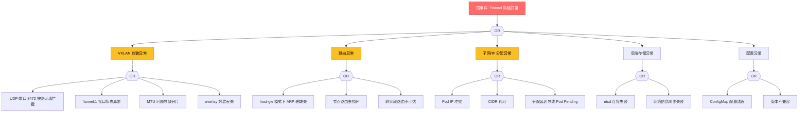

# Flannel 网络异常 FTA 树

## 适用范围与说明
- **目标**：覆盖 Flannel CNI 网络插件在生产环境中的网络连通性问题。
- **范围**：VXLAN 封装、host-gw 路由、跨节点通信、IP 分配、子网冲突。
- **符号**：
  - **OR 门**：任一子事件成立即可触发父事件
  - **AND 门**：所有子事件同时成立才触发父事件

---

## Mermaid FTA 树



---

## 常见故障场景

### 场景 1: Pod 无法跨节点通信

**顶事件**: Pod A (Node-1) 无法访问 Pod B (Node-2)

```
诊断路径:
1. 检查 flannel.1 接口状态
   - ip addr show flannel.1
   - 状态应为 UP，IP 应为子网网关

2. 检查 VXLAN 端口
   - netstat -ulnp | grep 8472
   - 确认 UDP 端口未被防火墙拦截

3. 检查路由表
   - ip route show
   - 确认到目标 Pod 子网的路由指向 flannel.1

4. 检查 ARP 表 (host-gw 模式)
   - ip neigh show
   - 确认目标节点 MAC 地址存在

5. 测试 MTU
   - ping -M do -s 1400 <target-pod-ip>
   - MTU 问题通常表现为大包丢包
```

### 场景 2: Pod IP 分配失败

**顶事件**: Pod 启动卡在 Pending，Events 显示 "Failed to allocate IP"

```
诊断路径:
1. 检查 Flannel ConfigMap
   kubectl get configmap -n kube-system flannel -o yaml

2. 检查 etcd 中存储的网络信息
   etcdctl get /coreos.com/network/subnets

3. 检查是否有 IP 池耗尽
   kubectl get nodes -o wide
   检查每个节点的 Pod 数量

4. 检查是否有残留的 stale 资源
   kubectl get pods -A | grep -v Running | grep -v Completed
```

### 场景 3: Flannel DaemonSet 不正常

**顶事件**: flannel Pod 持续重启或处于 CrashLoopBackOff

```
诊断路径:
1. 检查 flannel 日志
   kubectl logs -n kube-system -l app=flannel --tail=100

2. 检查 etcd 连接
   kubectl exec -n kube-system <flannel-pod> -- etcdctl endpoint health

3. 检查 kubeconfig 权限
   kubectl auth can-i get pods --as=system:serviceaccount:kube-system:flannel

4. 检查 CNI 配置
   cat /etc/cni/net.d/10-flannel.conflist
```

---

## 故障排查命令速查

```bash
# 1. 检查 flannel 接口状态
ip addr show flannel.1
ip link show flannel.1

# 2. 检查 flannel 路由
ip route show | grep flannel

# 3. 检查 VXLAN 端口
netstat -ulnp | grep 8472

# 4. 检查 etcd 中的子网信息
etcdctl get /coreos.com/network/subnets --prefix

# 5. 检查 flannel ConfigMap
kubectl get configmap -n kube-system flannel -o yaml

# 6. 检查 flannel DaemonSet 状态
kubectl get pods -n kube-system -l app=flannel

# 7. 测试跨节点连通性
ping -I flannel.1 <target-pod-ip>
traceroute -i flannel.1 <target-pod-ip>

# 8. 检查 ARP 表 (host-gw)
ip neigh show | grep flannel

# 9. MTU 测试
ping -M do -s 1400 <target-ip>
```

---

## 相关文档

- [Flannel 完全指南](./domain-03-networking-traffic/04-flannel-complete-guide.md)
- [Flannel 故障排查](./domain-10-troubleshooting-diagnostics/topic-structural-trouble-shooting/03-networking/08-flannel-troubleshooting.md)
- [CNI 网络故障排查](./domain-10-troubleshooting-diagnostics/topic-structural-trouble-shooting/03-networking/01-cni-troubleshooting.md)
- [Flannel 全局索引](./domain-19-landscape-references/topic-index/flannel-index.md)

## Related

- [[skills/ts-command-output|命令输出根因解析]] — Cross-reference
- [[skills/skill-22-daemonset-failure|DaemonSet 故障诊断与修复 / DaemonSet Failure Diagnosis & Remediation]] — Cross-reference
- [[domain-19-landscape-references/topic-index/flannel-index|Flannel 知识图谱索引]]
