<!-- condition: kubectl get pods -n ingress-nginx -l app=ingress-nginx -o jsonpath='{range .items[?(@.status.phase!=\"Running\")]} {.metadata.name}{\"\n\"}{end}' 显示 Ingress Controller 异常 -->

# Ingress 异常 FTA 树

## 适用范围与说明
- **目标**：覆盖 Ingress 请求失败、证书异常与路由错误的关键成因与路径。
- **范围**：Ingress Controller、规则配置、TLS 证书、后端服务、网络与 DNS。
- **符号**：
  - **OR 门**：任一子事件成立即可触发父事件
  - **AND 门**：所有子事件同时成立才触发父事件

---

## 诊断命令快速参考表

### 1. Ingress Controller 诊断

| 节点 ID | 名称 | 诊断命令 | 预期输出模式 | 判定 |
|---------|------|----------|--------------|------|
| CTRL1A | OOMKilled | `kubectl get pods -n ${INGRESS_NS} -l app.kubernetes.io/name=ingress-nginx -o jsonpath='{range .items[*]}{.status.containerStatuses[*].lastState.terminated.reason}{"\n"}{end}'` | `OOMKilled` | 确认内存溢出 |
| CTRL1B | CrashLoopBackOff | `kubectl get pods -n ${INGRESS_NS} -l app.kubernetes.io/name=ingress-nginx -o wide` | `CrashLoopBackOff` | 确认容器崩溃 |
| CTRL1C | 镜像拉取失败 | `kubectl get pods -n ${INGRESS_NS} -l app.kubernetes.io/name=ingress-nginx -o jsonpath='{.items[*].status.containerStatuses[*].state.waiting.reason}'` | `ImagePullBackOff\|ErrImagePull` | 确认镜像问题 |
| CTRL3 | 配置重载失败 | `kubectl logs -n ${INGRESS_NS} -l app.kubernetes.io/name=ingress-nginx --tail=100 \| grep -iE "reload.*fail\|error.*config"` | `reload.*fail\|error` | 确认配置重载问题 |
| CTRL4 | 资源压力 | `kubectl top pods -n ${INGRESS_NS} -l app.kubernetes.io/name=ingress-nginx` | CPU/内存使用 | 检查资源消耗 |

### 2. 规则/路由诊断

| 节点 ID | 名称 | 诊断命令 | 预期输出模式 | 判定 |
|---------|------|----------|--------------|------|
| RULE1A | Host 不匹配 | `kubectl get ingress -n ${NAMESPACE} ${INGRESS_NAME} -o jsonpath='{.spec.rules[*].host}'` | Host 列表 | 验证 Host 配置 |
| RULE1B | Path 正则错误 | `kubectl get ingress -n ${NAMESPACE} ${INGRESS_NAME} -o jsonpath='{.spec.rules[*].http.paths[*].path}'` | Path 列表 | 检查 Path 配置 |
| RULE2 | Backend 端口错误 | `kubectl get ingress -n ${NAMESPACE} ${INGRESS_NAME} -o jsonpath='{.spec.rules[*].http.paths[*].backend}'` | Backend 配置 | 验证端口映射 |
| RULE3 | Annotation 配置 | `kubectl get ingress -n ${NAMESPACE} ${INGRESS_NAME} -o jsonpath='{.metadata.annotations}'` | Annotations | 检查注解配置 |
| RULE4 | IngressClass | `kubectl get ingress -n ${NAMESPACE} ${INGRESS_NAME} -o jsonpath='{.spec.ingressClassName}'` | IngressClass 名称 | 验证 Class 匹配 |

### 3. TLS 证书诊断

| 节点 ID | 名称 | 诊断命令 | 预期输出模式 | 判定 |
|---------|------|----------|--------------|------|
| TLS1A | 证书过期 | `kubectl get secret ${TLS_SECRET} -n ${NAMESPACE} -o jsonpath='{.data.tls\.crt}' \| base64 -d \| openssl x509 -noout -dates` | 证书有效期 | 检查是否过期 |
| TLS1B | 证书链不完整 | `kubectl get secret ${TLS_SECRET} -n ${NAMESPACE} -o jsonpath='{.data.tls\.crt}' \| base64 -d \| openssl x509 -noout -issuer` | 颁发者信息 | 检查证书链 |
| TLS1C | 域名匹配 | `kubectl get secret ${TLS_SECRET} -n ${NAMESPACE} -o jsonpath='{.data.tls\.crt}' \| base64 -d \| openssl x509 -noout -text \| grep DNS` | SAN 列表 | 检查域名匹配 |
| TLS2 | Secret 存在性 | `kubectl get secret ${TLS_SECRET} -n ${NAMESPACE} -o name 2>/dev/null \|\| echo "NOT_FOUND"` | Secret 名称 | 验证 Secret 存在 |
| TLS4 | SNI 配置 | `kubectl get ingress -n ${NAMESPACE} ${INGRESS_NAME} -o jsonpath='{.spec.tls[*].hosts}'` | TLS Hosts | 检查 SNI 配置 |

### 4. 后端 Service 诊断

| 节点 ID | 名称 | 诊断命令 | 预期输出模式 | 判定 |
|---------|------|----------|--------------|------|
| SVC1 | 无可用 Endpoint | `kubectl get endpoints ${SERVICE_NAME} -n ${NAMESPACE} -o jsonpath='{.subsets[*].addresses[*].ip}'` | IP 列表 | 空表示无 Endpoint |
| SVC1A | Pod 不健康 | `kubectl get pods -n ${NAMESPACE} -l ${SELECTOR} -o jsonpath='{range .items[*]}{.metadata.name}: Ready={.status.conditions[?(@.type=="Ready")].status}{"\n"}{end}'` | Ready 状态 | 检查 Pod 健康 |
| SVC2 | Service 端口 | `kubectl get svc ${SERVICE_NAME} -n ${NAMESPACE} -o jsonpath='{.spec.ports[*]}'` | 端口配置 | 验证端口映射 |
| SVC4 | 后端响应时间 | `kubectl logs -n ${INGRESS_NS} -l app.kubernetes.io/name=ingress-nginx --tail=100 \| grep "${SERVICE_NAME}" \| grep -oE "upstream_response_time=[0-9.]+"` | 响应时间 | 检查超时 |

### 5. 网络与 DNS 诊断

| 节点 ID | 名称 | 诊断命令 | 预期输出模式 | 判定 |
|---------|------|----------|--------------|------|
| NET1A | DNS 记录检查 | `nslookup ${INGRESS_HOST}` | A/CNAME 记录 | 验证 DNS 解析 |
| NET1B | DNS 指向 IP | `dig +short ${INGRESS_HOST}` | IP 地址 | 验证解析结果 |
| NET2 | NetworkPolicy | `kubectl get networkpolicy -n ${NAMESPACE} -o wide` | 策略列表 | 检查网络策略 |
| NET3 | 跨节点网络 | `kubectl run net-test --rm -i --restart=Never --image=busybox -- ping -c 3 ${BACKEND_POD_IP}` | ping 结果 | 检查跨节点连通 |
| NET4 | 安全组/防火墙 | 检查云平台安全组配置 | 入向规则 | 验证 80/443 端口 |

---

## Mermaid FTA 树

```mermaid
flowchart TD
  TE[顶事件: Ingress 访问异常]
  OR0{{OR}}
  TE --> OR0

  OR0 --> CTRL[Ingress Controller 异常]
  OR0 --> RULE[规则/路由配置错误]
  OR0 --> TLS[TLS 证书异常]
  OR0 --> SVC[后端 Service 异常]
  OR0 --> NET[网络与 DNS 异常]

  CTRL_OR{{OR}}
  CTRL --> CTRL_OR
  CTRL_OR --> CTRL1[Controller Pod 异常]
  CTRL_OR --> CTRL2[负载均衡健康检查失败]
  CTRL_OR --> CTRL3[配置重载失败]
  CTRL_OR --> CTRL4[资源压力过大]

  CTRL1_OR{{OR}}
  CTRL1 --> CTRL1_OR
  CTRL1_OR --> CTRL1A[OOMKilled]
  CTRL1_OR --> CTRL1B[CrashLoopBackOff]
  CTRL1_OR --> CTRL1C[镜像拉取失败]

  CTRL2_OR{{OR}}
  CTRL2 --> CTRL2_OR
  CTRL2_OR --> CTRL2A[健康检查路径错误]
  CTRL2_OR --> CTRL2B[健康检查超时]
  CTRL2_OR --> CTRL2C[Controller 启动慢]

  RULE_OR{{OR}}
  RULE --> RULE_OR
  RULE_OR --> RULE1[Host/Path 规则错误]
  RULE_OR --> RULE2[Backend 端口配置错误]
  RULE_OR --> RULE3[Annotation 配置错误]
  RULE_OR --> RULE4[IngressClass 不匹配]

  RULE1_OR{{OR}}
  RULE1 --> RULE1_OR
  RULE1_OR --> RULE1A[Host 不匹配]
  RULE1_OR --> RULE1B[Path 正则错误]
  RULE1_OR --> RULE1C[路径优先级冲突]

  TLS_OR{{OR}}
  TLS --> TLS_OR
  TLS_OR --> TLS1[证书过期/链不完整]
  TLS_OR --> TLS2[证书未加载]
  TLS_OR --> TLS3[TLS 握手失败连锁]
  TLS_OR --> TLS4[SNI 配置错误]

  TLS1_OR{{OR}}
  TLS1 --> TLS1_OR
  TLS1_OR --> TLS1A[证书过期]
  TLS1_OR --> TLS1B[证书链不完整]
  TLS1_OR --> TLS1C[证书与域名不匹配]

  AND_TLS_FAIL{{AND}}
  TLS3 --> AND_TLS_FAIL
  AND_TLS_FAIL --> TLS3A[证书异常/过期]
  AND_TLS_FAIL --> TLS3B[客户端强制校验证书]

  SVC_OR{{OR}}
  SVC --> SVC_OR
  SVC_OR --> SVC1[无可用 Endpoint]
  SVC_OR --> SVC2[Service 端口错误]
  SVC_OR --> SVC3[503 错误连锁]
  SVC_OR --> SVC4[后端响应超时]

  SVC1_OR{{OR}}
  SVC1 --> SVC1_OR
  SVC1_OR --> SVC1A[Pod 不健康]
  SVC1_OR --> SVC1B[Selector 不匹配]
  SVC1_OR --> SVC1C[副本数为 0]

  AND_503{{AND}}
  SVC3 --> AND_503
  AND_503 --> SVC3A[后端无可用 Endpoint]
  AND_503 --> SVC3B[LB 健康检查失败]

  NET_OR{{OR}}
  NET --> NET_OR
  NET_OR --> NET1[DNS 解析异常]
  NET_OR --> NET2[网络策略阻断]
  NET_OR --> NET3[跨节点网络不通]
  NET_OR --> NET4[防火墙/安全组拦截]

  NET1_OR{{OR}}
  NET1 --> NET1_OR
  NET1_OR --> NET1A[DNS 记录不存在]
  NET1_OR --> NET1B[DNS 指向错误 IP]
  NET1_OR --> NET1C[DNS TTL 过长导致更新延迟]
```



---

## 生产级观测与证据
- **事件**：`503/502/504`、证书错误、访问超时、`Connection refused`。
- **关键指标**：Ingress Controller 响应延迟、`4xx/5xx` 比例、LB 健康状态、upstream_response_time、request_time。
- **关键日志**：Ingress Controller 日志（nginx-ingress/traefik/等）、LB 日志、[[domain-19-landscape-references/01-cncf-landscape/graduated/cert-manager/cert-manager|cert-manager]] 日志。
- **配置核对**：Ingress 规则、TLS Secret、Service 端口、DNS 记录、IngressClass、Annotations。

---

## JSON 工作流（含与/或门控件）

```json
{
  "flow_steps": [
    {
      "name": "开始",
      "action": "start",
      "step": "start_ingress_fta",
      "next_step": "event_ingress_abnormal"
    },
    {
      "name": "顶事件: Ingress 访问异常",
      "action": "event",
      "step": "event_ingress_abnormal",
      "description": "访问失败/证书错误/502/503/504",
      "next_step": "gate_root_or",
      "cmd": {
        "type": "parallel",
        "commands": [
          { "id": "ingress_status", "description": "检查Ingress状态", "exec": "kubectl get ingress ${INGRESS_NAME} -n ${NAMESPACE} -o wide 2>/dev/null || echo 'INGRESS_NOT_FOUND'", "timeout": 5 },
          { "id": "controller_status", "description": "检查Controller状态", "exec": "kubectl get pods -n ${INGRESS_NS} -l app.kubernetes.io/name=ingress-nginx -o wide 2>/dev/null || kubectl get pods -n ${INGRESS_NS} -l app=nginx-ingress -o wide 2>/dev/null || echo 'CONTROLLER_NOT_FOUND'", "timeout": 5 },
          { "id": "http_test", "description": "测试HTTP访问", "exec": "kubectl run http-test-${RANDOM} --rm -i --restart=Never --image=curlimages/curl:latest --timeout=30s -- curl -sI -o /dev/null -w '%{http_code}' --connect-timeout 5 http://${INGRESS_HOST}${PATH} 2>&1 || echo 'CURL_FAILED'", "timeout": 35 }
        ]
      },
      "match": {
        "rules": [
          { "if": "ingress_status contains 'INGRESS_NOT_FOUND'", "then": "Ingress资源不存在", "confidence": 0.95 },
          { "if": "controller_status contains 'CONTROLLER_NOT_FOUND'", "then": "Ingress Controller未找到", "confidence": 0.95 },
          { "if": "http_test == 502 OR http_test == 503 OR http_test == 504", "then": "HTTP错误响应", "confidence": 0.9 },
          { "if": "http_test contains 'CURL_FAILED'", "then": "连接失败", "confidence": 0.9 }
        ],
        "default": "继续诊断根因"
      }
    },
    {
      "name": "根因 OR 门",
      "action": "gate_or",
      "step": "gate_root_or",
      "control": "or_gate",
      "gate_type": "OR",
      "next_steps": ["cat_ctrl", "cat_rule", "cat_tls", "cat_svc", "cat_net"],
      "cmd": {
        "type": "parallel",
        "commands": [
          { "id": "ctrl_health", "description": "检查Controller健康", "exec": "kubectl get pods -n ${INGRESS_NS} -l app.kubernetes.io/name=ingress-nginx -o jsonpath='{range .items[*]}{.metadata.name}: Ready={.status.conditions[?(@.type==\"Ready\")].status}, restarts={.status.containerStatuses[0].restartCount}{\"\\n\"}{end}' 2>/dev/null", "timeout": 5 },
          { "id": "backend_ep", "description": "检查后端Endpoint", "exec": "kubectl get endpoints ${SERVICE_NAME} -n ${NAMESPACE} -o jsonpath='{.subsets[*].addresses}' 2>/dev/null || echo 'NO_ENDPOINTS'", "timeout": 5 },
          { "id": "tls_secret", "description": "检查TLS Secret", "exec": "kubectl get ingress ${INGRESS_NAME} -n ${NAMESPACE} -o jsonpath='{.spec.tls[*].secretName}' 2>/dev/null | xargs -I {} kubectl get secret {} -n ${NAMESPACE} -o name 2>/dev/null || echo 'TLS_NOT_CONFIGURED'", "timeout": 10 },
          { "id": "ctrl_logs", "description": "获取Controller错误日志", "exec": "kubectl logs -n ${INGRESS_NS} -l app.kubernetes.io/name=ingress-nginx --tail=30 2>/dev/null | grep -iE 'error|failed|503|502' | head -10", "timeout": 10 }
        ]
      },
      "match": {
        "rules": [
          { "if": "ctrl_health contains 'Ready=False' OR ctrl_health contains 'restarts>3'", "then": "route_to: cat_ctrl", "confidence": 0.9 },
          { "if": "ctrl_logs contains 'reload.*failed' OR ctrl_logs contains 'configuration'", "then": "route_to: cat_rule", "confidence": 0.85 },
          { "if": "ctrl_logs contains 'SSL' OR ctrl_logs contains 'certificate'", "then": "route_to: cat_tls", "confidence": 0.85 },
          { "if": "backend_ep contains 'NO_ENDPOINTS' OR backend_ep is_empty", "then": "route_to: cat_svc", "confidence": 0.9 }
        ],
        "default": "route_to: cat_ctrl (优先检查Controller)"
      }
    },

    {
      "name": "Ingress Controller 异常",
      "action": "category",
      "step": "cat_ctrl",
      "description": "Controller 组件问题",
      "next_step": "gate_ctrl_or",
      "cmd": {
        "type": "parallel",
        "commands": [
          { "id": "ctrl_pods", "description": "获取Controller Pod详情", "exec": "kubectl get pods -n ${INGRESS_NS} -l app.kubernetes.io/name=ingress-nginx -o wide", "timeout": 5 },
          { "id": "ctrl_events", "description": "获取Controller事件", "exec": "kubectl get events -n ${INGRESS_NS} --sort-by='.lastTimestamp' | grep -i ingress | tail -15", "timeout": 5 },
          { "id": "ctrl_resources", "description": "检查资源使用", "exec": "kubectl top pods -n ${INGRESS_NS} -l app.kubernetes.io/name=ingress-nginx --no-headers 2>/dev/null || echo 'METRICS_UNAVAILABLE'", "timeout": 10 }
        ]
      },
      "match": {
        "rules": [
          { "if": "ctrl_pods contains 'CrashLoopBackOff' OR ctrl_pods contains 'Error'", "then": "Controller Pod异常", "confidence": 0.95 },
          { "if": "ctrl_events contains 'OOMKilled'", "then": "内存溢出", "confidence": 0.95 },
          { "if": "ctrl_resources CPU > 90% OR Memory > 90%", "then": "资源压力过大", "confidence": 0.85 }
        ],
        "default": "检查具体Controller问题"
      }
    },
    {
      "name": "Controller OR 门",
      "action": "gate_or",
      "step": "gate_ctrl_or",
      "control": "or_gate",
      "gate_type": "OR",
      "next_steps": ["evt_ctrl_pod", "evt_ctrl_lb", "evt_ctrl_reload", "evt_ctrl_pressure"],
      "cmd": {
        "type": "parallel",
        "commands": [
          { "id": "pod_state", "description": "检查Pod状态", "exec": "kubectl get pods -n ${INGRESS_NS} -l app.kubernetes.io/name=ingress-nginx -o jsonpath='{range .items[*]}{.metadata.name}: phase={.status.phase}, waiting={.status.containerStatuses[0].state.waiting.reason}, lastTerminated={.status.containerStatuses[0].lastState.terminated.reason}{\"\\n\"}{end}'", "timeout": 5 },
          { "id": "reload_status", "description": "检查配置重载状态", "exec": "kubectl logs -n ${INGRESS_NS} -l app.kubernetes.io/name=ingress-nginx --tail=50 2>/dev/null | grep -iE 'reload|configuration' | tail -10", "timeout": 10 }
        ]
      },
      "match": {
        "rules": [
          { "if": "pod_state contains 'OOMKilled' OR pod_state contains 'CrashLoopBackOff'", "then": "route_to: evt_ctrl_pod", "confidence": 0.95 },
          { "if": "reload_status contains 'reload.*failed'", "then": "route_to: evt_ctrl_reload", "confidence": 0.9 }
        ],
        "default": "route_to: evt_ctrl_pod"
      }
    },

    {
      "name": "Controller Pod 异常",
      "action": "event",
      "step": "evt_ctrl_pod",
      "description": "Controller Pod 不健康",
      "next_step": "gate_ctrl_pod_or",
      "cmd": {
        "type": "parallel",
        "commands": [
          { "id": "pod_detail", "description": "获取Pod详细状态", "exec": "kubectl get pods -n ${INGRESS_NS} -l app.kubernetes.io/name=ingress-nginx -o jsonpath='{range .items[*]}{.metadata.name}: waiting={.status.containerStatuses[0].state.waiting.reason}, terminated={.status.containerStatuses[0].lastState.terminated.reason}{\"\\n\"}{end}'", "timeout": 5 },
          { "id": "describe_pod", "description": "描述Pod", "exec": "kubectl describe pods -n ${INGRESS_NS} -l app.kubernetes.io/name=ingress-nginx 2>/dev/null | grep -A20 'Events:' | head -25", "timeout": 10 }
        ]
      },
      "match": {
        "rules": [
          { "if": "pod_detail contains 'OOMKilled'", "then": "内存溢出", "confidence": 0.95 },
          { "if": "pod_detail contains 'CrashLoopBackOff'", "then": "容器崩溃循环", "confidence": 0.95 },
          { "if": "pod_detail contains 'ImagePullBackOff' OR pod_detail contains 'ErrImagePull'", "then": "镜像拉取失败", "confidence": 0.95 }
        ],
        "default": "继续检查具体原因"
      }
    },
    {
      "name": "Controller Pod OR 门",
      "action": "gate_or",
      "step": "gate_ctrl_pod_or",
      "control": "or_gate",
      "gate_type": "OR",
      "next_steps": ["evt_ctrl_oom", "evt_ctrl_crashloop", "evt_ctrl_image"],
      "cmd": {
        "type": "single",
        "commands": [
          { "id": "termination_reason", "description": "获取终止原因", "exec": "kubectl get pods -n ${INGRESS_NS} -l app.kubernetes.io/name=ingress-nginx -o jsonpath='{.items[*].status.containerStatuses[*].lastState.terminated.reason}'", "timeout": 5 }
        ]
      },
      "match": {
        "rules": [
          { "if": "termination_reason contains 'OOMKilled'", "then": "route_to: evt_ctrl_oom", "confidence": 0.95 },
          { "if": "termination_reason contains 'Error'", "then": "route_to: evt_ctrl_crashloop", "confidence": 0.9 }
        ],
        "default": "route_to: evt_ctrl_crashloop"
      }
    },
    {
      "name": "OOMKilled",
      "action": "bottom_event",
      "step": "evt_ctrl_oom",
      "severity": "critical",
      "probability": "medium",
      "mttr_minutes": 15,
      "detection": {
        "events": ["OOMKilled"],
        "metrics": ["kube_pod_container_status_last_terminated_reason{reason='OOMKilled',pod=~'ingress.*'}"],
        "logs": ["kernel: Out of memory"]
      },
      "remediation": {
        "manual_steps": ["检查 Controller 内存限制", "分析连接数和请求量"],
        "auto_actions": ["提升内存限制", "扩展 Controller 副本"]
      },
      "cmd": {
        "type": "parallel",
        "commands": [
          { "id": "memory_limit", "description": "检查内存限制", "exec": "kubectl get deployment -n ${INGRESS_NS} -l app.kubernetes.io/name=ingress-nginx -o jsonpath='{.items[0].spec.template.spec.containers[0].resources.limits.memory}'", "timeout": 5 },
          { "id": "memory_usage", "description": "检查内存使用", "exec": "kubectl top pods -n ${INGRESS_NS} -l app.kubernetes.io/name=ingress-nginx --no-headers 2>/dev/null | awk '{print $3}'", "timeout": 10 },
          { "id": "oom_events", "description": "获取OOM事件", "exec": "kubectl get events -n ${INGRESS_NS} --field-selector reason=OOMKilled --sort-by='.lastTimestamp' | tail -5", "timeout": 5 }
        ]
      },
      "match": {
        "rules": [
          { "if": "memory_limit < 512Mi AND memory_usage close to limit", "then": "confirm: 内存限制过低，建议提升至1Gi", "confidence": 0.95 },
          { "if": "oom_events count > 2", "then": "confirm: 频繁OOM，需要分析流量模式", "confidence": 0.9 }
        ],
        "default": "建议增加内存限制"
      }
    },
    {
      "name": "CrashLoopBackOff",
      "action": "bottom_event",
      "step": "evt_ctrl_crashloop",
      "severity": "critical",
      "probability": "medium",
      "mttr_minutes": 15,
      "detection": {
        "events": ["BackOff", "CrashLoopBackOff"],
        "metrics": ["kube_pod_container_status_waiting_reason{reason='CrashLoopBackOff'}"],
        "logs": ["Back-off restarting failed container"]
      },
      "remediation": {
        "manual_steps": ["检查 Controller 日志", "验证配置正确性"],
        "auto_actions": ["回滚到上一个版本"]
      },
      "cmd": {
        "type": "sequence",
        "commands": [
          { "id": "crash_logs", "description": "获取崩溃日志", "exec": "kubectl logs -n ${INGRESS_NS} -l app.kubernetes.io/name=ingress-nginx --previous --tail=50 2>/dev/null | head -50", "timeout": 10 },
          { "id": "configmap_check", "description": "检查ConfigMap", "exec": "kubectl get cm -n ${INGRESS_NS} -l app.kubernetes.io/name=ingress-nginx -o name", "timeout": 5 }
        ]
      },
      "match": {
        "rules": [
          { "if": "crash_logs contains 'configuration' AND crash_logs contains 'error'", "then": "confirm: 配置错误导致崩溃", "confidence": 0.9 },
          { "if": "crash_logs contains 'panic'", "then": "confirm: 程序panic", "confidence": 0.95 }
        ],
        "default": "需要进一步分析崩溃日志"
      }
    },
    {
      "name": "镜像拉取失败",
      "action": "bottom_event",
      "step": "evt_ctrl_image",
      "severity": "high",
      "probability": "medium",
      "mttr_minutes": 15,
      "detection": {
        "events": ["ErrImagePull", "ImagePullBackOff"],
        "metrics": ["kube_pod_container_status_waiting_reason{reason='ImagePullBackOff'}"],
        "logs": ["Failed to pull image"]
      },
      "remediation": {
        "manual_steps": ["检查镜像名称和标签", "验证镜像仓库凭据"],
        "auto_actions": ["更新 imagePullSecrets"]
      },
      "cmd": {
        "type": "parallel",
        "commands": [
          { "id": "image_name", "description": "获取镜像名称", "exec": "kubectl get pods -n ${INGRESS_NS} -l app.kubernetes.io/name=ingress-nginx -o jsonpath='{.items[0].spec.containers[0].image}'", "timeout": 5 },
          { "id": "pull_events", "description": "获取拉取事件", "exec": "kubectl get events -n ${INGRESS_NS} --field-selector reason=Failed,reason=ErrImagePull --sort-by='.lastTimestamp' | tail -10", "timeout": 5 }
        ]
      },
      "match": {
        "rules": [
          { "if": "pull_events contains 'unauthorized' OR pull_events contains '401'", "then": "confirm: 镜像仓库认证失败", "confidence": 0.95 },
          { "if": "pull_events contains 'not found' OR pull_events contains '404'", "then": "confirm: 镜像不存在", "confidence": 0.95 }
        ],
        "default": "检查镜像配置和仓库访问"
      }
    },

    {
      "name": "负载均衡健康检查失败",
      "action": "event",
      "step": "evt_ctrl_lb",
      "description": "LB 健康检查异常",
      "next_step": "gate_ctrl_lb_or",
      "cmd": {
        "type": "parallel",
        "commands": [
          { "id": "lb_svc", "description": "检查LB Service", "exec": "kubectl get svc -n ${INGRESS_NS} -l app.kubernetes.io/name=ingress-nginx -o jsonpath='{.items[*].status.loadBalancer}'", "timeout": 5 },
          { "id": "health_port", "description": "检查健康检查端口", "exec": "kubectl get pods -n ${INGRESS_NS} -l app.kubernetes.io/name=ingress-nginx -o jsonpath='{.items[0].spec.containers[0].ports}' | grep -i health", "timeout": 5 }
        ]
      },
      "match": {
        "rules": [
          { "if": "lb_svc not contains 'ingress'", "then": "LB未正确配置", "confidence": 0.8 }
        ],
        "default": "检查健康检查配置"
      }
    },
    {
      "name": "LB 健康检查 OR 门",
      "action": "gate_or",
      "step": "gate_ctrl_lb_or",
      "control": "or_gate",
      "gate_type": "OR",
      "next_steps": ["evt_lb_path_bad", "evt_lb_timeout", "evt_lb_slow_start"],
      "cmd": {
        "type": "single",
        "commands": [
          { "id": "health_config", "description": "获取健康检查配置", "exec": "kubectl get svc -n ${INGRESS_NS} -l app.kubernetes.io/name=ingress-nginx -o yaml 2>/dev/null | grep -A10 'health'", "timeout": 5 }
        ]
      },
      "match": {
        "rules": [
          { "if": "health_config path wrong", "then": "route_to: evt_lb_path_bad", "confidence": 0.8 },
          { "if": "health_config timeout < 3", "then": "route_to: evt_lb_timeout", "confidence": 0.8 }
        ],
        "default": "route_to: evt_lb_slow_start"
      }
    },
    {
      "name": "健康检查路径错误",
      "action": "bottom_event",
      "step": "evt_lb_path_bad",
      "severity": "high",
      "probability": "common",
      "mttr_minutes": 10,
      "detection": {
        "events": [],
        "metrics": [],
        "logs": ["health check failed", "404"]
      },
      "remediation": {
        "manual_steps": ["检查 LB 健康检查路径", "验证 Controller 健康检查端点"],
        "auto_actions": ["修正健康检查配置"]
      },
      "cmd": {
        "type": "parallel",
        "commands": [
          { "id": "healthz_test", "description": "测试健康端点", "exec": "kubectl run healthz-test-${RANDOM} --rm -i --restart=Never --image=curlimages/curl:latest --timeout=15s -- curl -s http://$(kubectl get pods -n ${INGRESS_NS} -l app.kubernetes.io/name=ingress-nginx -o jsonpath='{.items[0].status.podIP}'):10254/healthz 2>&1", "timeout": 20 },
          { "id": "svc_annotations", "description": "获取Service注解", "exec": "kubectl get svc -n ${INGRESS_NS} -l app.kubernetes.io/name=ingress-nginx -o jsonpath='{.items[0].metadata.annotations}'", "timeout": 5 }
        ]
      },
      "match": {
        "rules": [
          { "if": "healthz_test contains '404' OR healthz_test contains 'Connection refused'", "then": "confirm: 健康检查端点不可达", "confidence": 0.9 }
        ],
        "default": "健康检查路径正常"
      }
    },
    {
      "name": "健康检查超时",
      "action": "bottom_event",
      "step": "evt_lb_timeout",
      "severity": "high",
      "probability": "common",
      "mttr_minutes": 10,
      "detection": {
        "events": [],
        "metrics": [],
        "logs": ["health check timeout"]
      },
      "remediation": {
        "manual_steps": ["增加健康检查超时时间", "检查 Controller 响应延迟"],
        "auto_actions": ["调整超时配置"]
      },
      "cmd": {
        "type": "single",
        "commands": [
          { "id": "timeout_config", "description": "获取超时配置", "exec": "kubectl get svc -n ${INGRESS_NS} -l app.kubernetes.io/name=ingress-nginx -o yaml 2>/dev/null | grep -iE 'timeout|interval'", "timeout": 5 }
        ]
      },
      "match": {
        "rules": [
          { "if": "timeout_config timeout < 3", "then": "confirm: 健康检查超时设置过短", "confidence": 0.85 }
        ],
        "default": "超时配置正常"
      }
    },
    {
      "name": "Controller 启动慢",
      "action": "bottom_event",
      "step": "evt_lb_slow_start",
      "severity": "medium",
      "probability": "common",
      "mttr_minutes": 15,
      "detection": {
        "events": [],
        "metrics": [],
        "logs": []
      },
      "remediation": {
        "manual_steps": ["增加健康检查初始延迟", "优化 Controller 启动时间"],
        "auto_actions": ["配置 slow start"]
      },
      "cmd": {
        "type": "single",
        "commands": [
          { "id": "startup_time", "description": "检查启动时间", "exec": "kubectl get pods -n ${INGRESS_NS} -l app.kubernetes.io/name=ingress-nginx -o jsonpath='{range .items[*]}startTime={.status.startTime}, ready={.status.conditions[?(@.type==\"Ready\")].lastTransitionTime}{\"\\n\"}{end}'", "timeout": 5 }
        ]
      },
      "match": {
        "rules": [
          { "if": "startup_time ready - startTime > 60s", "then": "confirm: Controller启动时间较长", "confidence": 0.8 }
        ],
        "default": "启动时间正常"
      }
    },

    {
      "name": "配置重载失败",
      "action": "bottom_event",
      "step": "evt_ctrl_reload",
      "severity": "high",
      "probability": "medium",
      "mttr_minutes": 15,
      "detection": {
        "events": [],
        "metrics": ["nginx_ingress_controller_config_last_reload_successful==0"],
        "logs": ["nginx: configuration file test failed", "error reloading"]
      },
      "remediation": {
        "manual_steps": ["检查 Ingress 配置语法", "验证 Annotation 正确性"],
        "auto_actions": ["回滚问题 Ingress 配置"]
      },
      "cmd": {
        "type": "parallel",
        "commands": [
          { "id": "reload_logs", "description": "获取重载日志", "exec": "kubectl logs -n ${INGRESS_NS} -l app.kubernetes.io/name=ingress-nginx --tail=100 2>/dev/null | grep -iE 'reload|configuration|error' | tail -20", "timeout": 10 },
          { "id": "recent_ingress", "description": "检查最近修改的Ingress", "exec": "kubectl get ingress -A --sort-by='.metadata.creationTimestamp' | tail -5", "timeout": 5 }
        ]
      },
      "match": {
        "rules": [
          { "if": "reload_logs contains 'configuration.*failed' OR reload_logs contains 'error.*reload'", "then": "confirm: 配置重载失败，检查最近修改的Ingress", "confidence": 0.95 }
        ],
        "default": "配置重载正常"
      }
    },
    {
      "name": "资源压力过大",
      "action": "bottom_event",
      "step": "evt_ctrl_pressure",
      "severity": "high",
      "probability": "common",
      "mttr_minutes": 15,
      "detection": {
        "events": [],
        "metrics": ["container_cpu_usage_seconds_total{pod=~'ingress.*'}", "nginx_ingress_controller_nginx_process_connections"],
        "logs": ["worker_connections are not enough"]
      },
      "remediation": {
        "manual_steps": ["检查连接数和请求量", "评估是否需要扩展"],
        "auto_actions": ["扩展 Controller 副本", "提升资源限制"]
      },
      "cmd": {
        "type": "parallel",
        "commands": [
          { "id": "resource_usage", "description": "检查资源使用", "exec": "kubectl top pods -n ${INGRESS_NS} -l app.kubernetes.io/name=ingress-nginx", "timeout": 10 },
          { "id": "connections", "description": "检查连接数", "exec": "kubectl exec -n ${INGRESS_NS} $(kubectl get pods -n ${INGRESS_NS} -l app.kubernetes.io/name=ingress-nginx -o jsonpath='{.items[0].metadata.name}') -- cat /etc/nginx/nginx.conf 2>/dev/null | grep worker_connections", "timeout": 10 },
          { "id": "replica_count", "description": "检查副本数", "exec": "kubectl get deployment -n ${INGRESS_NS} -l app.kubernetes.io/name=ingress-nginx -o jsonpath='replicas={.items[0].spec.replicas}'", "timeout": 5 }
        ]
      },
      "match": {
        "rules": [
          { "if": "resource_usage CPU > 80% OR resource_usage Memory > 80%", "then": "confirm: 资源使用率高，需要扩容", "confidence": 0.9 }
        ],
        "default": "资源使用正常"
      }
    },

    {
      "name": "规则/路由配置错误",
      "action": "category",
      "step": "cat_rule",
      "description": "Ingress 规则问题",
      "next_step": "gate_rule_or",
      "cmd": {
        "type": "parallel",
        "commands": [
          { "id": "ingress_rules", "description": "获取Ingress规则", "exec": "kubectl get ingress ${INGRESS_NAME} -n ${NAMESPACE} -o yaml 2>/dev/null | head -80", "timeout": 5 },
          { "id": "ingress_events", "description": "获取Ingress事件", "exec": "kubectl get events -n ${NAMESPACE} --field-selector involvedObject.name=${INGRESS_NAME} --sort-by='.lastTimestamp' | tail -10", "timeout": 5 }
        ]
      },
      "match": {
        "rules": [
          { "if": "ingress_events contains 'error' OR ingress_events contains 'invalid'", "then": "Ingress配置存在问题", "confidence": 0.9 }
        ],
        "default": "检查具体规则问题"
      }
    },
    {
      "name": "规则 OR 门",
      "action": "gate_or",
      "step": "gate_rule_or",
      "control": "or_gate",
      "gate_type": "OR",
      "next_steps": ["evt_host_path", "evt_backend_port", "evt_annotation", "evt_ingressclass"],
      "cmd": {
        "type": "parallel",
        "commands": [
          { "id": "host_rules", "description": "获取Host规则", "exec": "kubectl get ingress ${INGRESS_NAME} -n ${NAMESPACE} -o jsonpath='{.spec.rules[*].host}'", "timeout": 5 },
          { "id": "backend_config", "description": "获取Backend配置", "exec": "kubectl get ingress ${INGRESS_NAME} -n ${NAMESPACE} -o jsonpath='{.spec.rules[*].http.paths[*].backend}'", "timeout": 5 },
          { "id": "ingress_class", "description": "获取IngressClass", "exec": "kubectl get ingress ${INGRESS_NAME} -n ${NAMESPACE} -o jsonpath='{.spec.ingressClassName}'", "timeout": 5 }
        ]
      },
      "match": {
        "rules": [
          { "if": "host_rules is_empty", "then": "route_to: evt_host_path", "confidence": 0.8 },
          { "if": "backend_config contains error", "then": "route_to: evt_backend_port", "confidence": 0.85 },
          { "if": "ingress_class is_empty OR ingress_class wrong", "then": "route_to: evt_ingressclass", "confidence": 0.8 }
        ],
        "default": "route_to: evt_host_path"
      }
    },

    {
      "name": "Host/Path 规则错误",
      "action": "event",
      "step": "evt_host_path",
      "description": "路由匹配失败",
      "next_step": "gate_host_path_or",
      "cmd": {
        "type": "parallel",
        "commands": [
          { "id": "host_list", "description": "获取Host列表", "exec": "kubectl get ingress ${INGRESS_NAME} -n ${NAMESPACE} -o jsonpath='{range .spec.rules[*]}{.host}{\"\\n\"}{end}'", "timeout": 5 },
          { "id": "path_list", "description": "获取Path列表", "exec": "kubectl get ingress ${INGRESS_NAME} -n ${NAMESPACE} -o jsonpath='{range .spec.rules[*].http.paths[*]}{.path} ({.pathType}){\"\\n\"}{end}'", "timeout": 5 }
        ]
      },
      "match": {
        "rules": [
          { "if": "host_list not contains ${INGRESS_HOST}", "then": "Host不匹配", "confidence": 0.9 },
          { "if": "path_list not contains ${PATH}", "then": "Path不匹配", "confidence": 0.85 }
        ],
        "default": "检查具体规则"
      }
    },
    {
      "name": "Host/Path OR 门",
      "action": "gate_or",
      "step": "gate_host_path_or",
      "control": "or_gate",
      "gate_type": "OR",
      "next_steps": ["evt_host_mismatch", "evt_path_regex", "evt_path_priority"],
      "cmd": {
        "type": "single",
        "commands": [
          { "id": "all_ingress_hosts", "description": "获取所有Ingress Host", "exec": "kubectl get ingress -A -o jsonpath='{range .items[*]}{.metadata.namespace}/{.metadata.name}: {.spec.rules[*].host}{\"\\n\"}{end}' | grep ${INGRESS_HOST}", "timeout": 5 }
        ]
      },
      "match": {
        "rules": [
          { "if": "all_ingress_hosts is_empty", "then": "route_to: evt_host_mismatch", "confidence": 0.9 },
          { "if": "all_ingress_hosts count > 1", "then": "route_to: evt_path_priority", "confidence": 0.8 }
        ],
        "default": "route_to: evt_host_mismatch"
      }
    },
    {
      "name": "Host 不匹配",
      "action": "bottom_event",
      "step": "evt_host_mismatch",
      "severity": "high",
      "probability": "common",
      "mttr_minutes": 10,
      "detection": {
        "events": [],
        "metrics": ["nginx_ingress_controller_requests{status='404'}"],
        "logs": ["no server is currently configured for the requested host"]
      },
      "remediation": {
        "manual_steps": ["检查 Ingress host 配置", "验证 DNS 指向"],
        "auto_actions": ["修正 host 配置"]
      },
      "cmd": {
        "type": "parallel",
        "commands": [
          { "id": "configured_hosts", "description": "获取配置的Host", "exec": "kubectl get ingress ${INGRESS_NAME} -n ${NAMESPACE} -o jsonpath='{.spec.rules[*].host}'", "timeout": 5 },
          { "id": "ctrl_hosts", "description": "检查Controller识别的Host", "exec": "kubectl exec -n ${INGRESS_NS} $(kubectl get pods -n ${INGRESS_NS} -l app.kubernetes.io/name=ingress-nginx -o jsonpath='{.items[0].metadata.name}') -- cat /etc/nginx/nginx.conf 2>/dev/null | grep server_name | head -10", "timeout": 10 }
        ]
      },
      "match": {
        "rules": [
          { "if": "configured_hosts not contains ${INGRESS_HOST}", "then": "confirm: Ingress未配置该Host", "confidence": 0.95 },
          { "if": "ctrl_hosts not contains ${INGRESS_HOST}", "then": "confirm: Controller未加载该Host配置", "confidence": 0.9 }
        ],
        "default": "Host配置正常"
      }
    },
    {
      "name": "Path 正则错误",
      "action": "bottom_event",
      "step": "evt_path_regex",
      "severity": "medium",
      "probability": "medium",
      "mttr_minutes": 10,
      "detection": {
        "events": [],
        "metrics": [],
        "logs": ["invalid regex"]
      },
      "remediation": {
        "manual_steps": ["检查 path 正则表达式语法", "验证 pathType 配置"],
        "auto_actions": ["修正 path 配置"]
      },
      "cmd": {
        "type": "single",
        "commands": [
          { "id": "path_config", "description": "获取Path配置", "exec": "kubectl get ingress ${INGRESS_NAME} -n ${NAMESPACE} -o jsonpath='{range .spec.rules[*].http.paths[*]}path={.path}, pathType={.pathType}{\"\\n\"}{end}'", "timeout": 5 }
        ]
      },
      "match": {
        "rules": [
          { "if": "path_config contains invalid regex", "then": "confirm: Path正则表达式错误", "confidence": 0.9 }
        ],
        "default": "Path配置正常"
      }
    },
    {
      "name": "路径优先级冲突",
      "action": "bottom_event",
      "step": "evt_path_priority",
      "severity": "medium",
      "probability": "medium",
      "mttr_minutes": 15,
      "detection": {
        "events": [],
        "metrics": [],
        "logs": []
      },
      "remediation": {
        "manual_steps": ["检查多个 Ingress 规则的路径优先级", "验证 pathType 设置"],
        "auto_actions": ["调整路径优先级"]
      },
      "cmd": {
        "type": "single",
        "commands": [
          { "id": "conflicting_paths", "description": "检查冲突的Path", "exec": "kubectl get ingress -A -o jsonpath='{range .items[*]}{.metadata.namespace}/{.metadata.name}: host={.spec.rules[*].host}, paths={.spec.rules[*].http.paths[*].path}{\"\\n\"}{end}' | grep ${INGRESS_HOST}", "timeout": 5 }
        ]
      },
      "match": {
        "rules": [
          { "if": "conflicting_paths count > 1 AND same path", "then": "confirm: 存在路径冲突", "confidence": 0.85 }
        ],
        "default": "无路径冲突"
      }
    },

    {
      "name": "Backend 端口配置错误",
      "action": "bottom_event",
      "step": "evt_backend_port",
      "severity": "high",
      "probability": "common",
      "mttr_minutes": 10,
      "detection": {
        "events": [],
        "metrics": ["nginx_ingress_controller_requests{status='503'}"],
        "logs": ["upstream connect error", "Connection refused"]
      },
      "remediation": {
        "manual_steps": ["检查 Ingress backend service port", "验证 Service 端口配置"],
        "auto_actions": ["修正端口配置"]
      },
      "cmd": {
        "type": "parallel",
        "commands": [
          { "id": "ingress_backend", "description": "获取Ingress Backend", "exec": "kubectl get ingress ${INGRESS_NAME} -n ${NAMESPACE} -o jsonpath='{.spec.rules[*].http.paths[*].backend}'", "timeout": 5 },
          { "id": "svc_ports", "description": "获取Service端口", "exec": "kubectl get svc ${SERVICE_NAME} -n ${NAMESPACE} -o jsonpath='{.spec.ports[*]}'", "timeout": 5 }
        ]
      },
      "match": {
        "rules": [
          { "if": "ingress_backend port != svc_ports port", "then": "confirm: Backend端口与Service端口不匹配", "confidence": 0.95 }
        ],
        "default": "端口配置正常"
      }
    },
    {
      "name": "Annotation 配置错误",
      "action": "bottom_event",
      "step": "evt_annotation",
      "severity": "medium",
      "probability": "common",
      "mttr_minutes": 10,
      "detection": {
        "events": [],
        "metrics": [],
        "logs": ["error parsing annotation", "unknown annotation"]
      },
      "remediation": {
        "manual_steps": ["检查 Ingress annotation 语法", "验证 Controller 支持的 annotation"],
        "auto_actions": ["移除错误 annotation"]
      },
      "cmd": {
        "type": "parallel",
        "commands": [
          { "id": "annotations", "description": "获取Annotations", "exec": "kubectl get ingress ${INGRESS_NAME} -n ${NAMESPACE} -o jsonpath='{.metadata.annotations}'", "timeout": 5 },
          { "id": "annotation_errors", "description": "搜索注解错误", "exec": "kubectl logs -n ${INGRESS_NS} -l app.kubernetes.io/name=ingress-nginx --tail=50 2>/dev/null | grep -i 'annotation' | head -10", "timeout": 10 }
        ]
      },
      "match": {
        "rules": [
          { "if": "annotation_errors contains 'error' OR annotation_errors contains 'unknown'", "then": "confirm: Annotation配置错误", "confidence": 0.9 }
        ],
        "default": "Annotation配置正常"
      }
    },
    {
      "name": "IngressClass 不匹配",
      "action": "bottom_event",
      "step": "evt_ingressclass",
      "severity": "high",
      "probability": "medium",
      "mttr_minutes": 10,
      "detection": {
        "events": [],
        "metrics": [],
        "logs": ["ingress class does not match"]
      },
      "remediation": {
        "manual_steps": ["检查 Ingress ingressClassName", "验证可用的 IngressClass"],
        "auto_actions": ["修正 ingressClassName"]
      },
      "cmd": {
        "type": "parallel",
        "commands": [
          { "id": "ingress_class", "description": "获取Ingress的IngressClass", "exec": "kubectl get ingress ${INGRESS_NAME} -n ${NAMESPACE} -o jsonpath='{.spec.ingressClassName}'", "timeout": 5 },
          { "id": "available_classes", "description": "获取可用的IngressClass", "exec": "kubectl get ingressclass -o jsonpath='{range .items[*]}{.metadata.name}{\"\\n\"}{end}'", "timeout": 5 }
        ]
      },
      "match": {
        "rules": [
          { "if": "ingress_class not in available_classes", "then": "confirm: IngressClass不存在或不匹配", "confidence": 0.95 }
        ],
        "default": "IngressClass配置正常"
      }
    },

    {
      "name": "TLS 证书异常",
      "action": "category",
      "step": "cat_tls",
      "description": "HTTPS/TLS 问题",
      "next_step": "gate_tls_or",
      "cmd": {
        "type": "parallel",
        "commands": [
          { "id": "tls_config", "description": "获取TLS配置", "exec": "kubectl get ingress ${INGRESS_NAME} -n ${NAMESPACE} -o jsonpath='{.spec.tls}'", "timeout": 5 },
          { "id": "tls_secret", "description": "检查TLS Secret", "exec": "kubectl get ingress ${INGRESS_NAME} -n ${NAMESPACE} -o jsonpath='{.spec.tls[*].secretName}' | xargs -I {} kubectl get secret {} -n ${NAMESPACE} -o jsonpath='{.metadata.name}: type={.type}' 2>/dev/null || echo 'SECRET_NOT_FOUND'", "timeout": 10 }
        ]
      },
      "match": {
        "rules": [
          { "if": "tls_config is_empty", "then": "未配置TLS", "confidence": 0.8 },
          { "if": "tls_secret contains 'SECRET_NOT_FOUND'", "then": "TLS Secret不存在", "confidence": 0.95 }
        ],
        "default": "检查具体TLS问题"
      }
    },
    {
      "name": "TLS OR 门",
      "action": "gate_or",
      "step": "gate_tls_or",
      "control": "or_gate",
      "gate_type": "OR",
      "next_steps": ["evt_cert_expired", "evt_cert_not_loaded", "evt_tls_handshake", "evt_sni_bad"],
      "cmd": {
        "type": "parallel",
        "commands": [
          { "id": "cert_expiry", "description": "检查证书有效期", "exec": "kubectl get secret $(kubectl get ingress ${INGRESS_NAME} -n ${NAMESPACE} -o jsonpath='{.spec.tls[0].secretName}') -n ${NAMESPACE} -o jsonpath='{.data.tls\\.crt}' 2>/dev/null | base64 -d | openssl x509 -noout -dates 2>/dev/null || echo 'CERT_CHECK_FAILED'", "timeout": 10 },
          { "id": "ssl_logs", "description": "搜索SSL错误", "exec": "kubectl logs -n ${INGRESS_NS} -l app.kubernetes.io/name=ingress-nginx --tail=50 2>/dev/null | grep -iE 'ssl|certificate|tls' | head -10", "timeout": 10 }
        ]
      },
      "match": {
        "rules": [
          { "if": "cert_expiry contains 'notAfter' AND date < now", "then": "route_to: evt_cert_expired", "confidence": 0.95 },
          { "if": "cert_expiry contains 'CERT_CHECK_FAILED'", "then": "route_to: evt_cert_not_loaded", "confidence": 0.9 },
          { "if": "ssl_logs contains 'handshake'", "then": "route_to: evt_tls_handshake", "confidence": 0.85 }
        ],
        "default": "route_to: evt_cert_expired"
      }
    },

    {
      "name": "证书过期/链不完整",
      "action": "event",
      "step": "evt_cert_expired",
      "description": "证书问题",
      "next_step": "gate_cert_or",
      "cmd": {
        "type": "parallel",
        "commands": [
          { "id": "cert_dates", "description": "获取证书日期", "exec": "kubectl get secret $(kubectl get ingress ${INGRESS_NAME} -n ${NAMESPACE} -o jsonpath='{.spec.tls[0].secretName}') -n ${NAMESPACE} -o jsonpath='{.data.tls\\.crt}' 2>/dev/null | base64 -d | openssl x509 -noout -dates 2>/dev/null", "timeout": 10 },
          { "id": "cert_subject", "description": "获取证书主题", "exec": "kubectl get secret $(kubectl get ingress ${INGRESS_NAME} -n ${NAMESPACE} -o jsonpath='{.spec.tls[0].secretName}') -n ${NAMESPACE} -o jsonpath='{.data.tls\\.crt}' 2>/dev/null | base64 -d | openssl x509 -noout -subject -issuer 2>/dev/null", "timeout": 10 }
        ]
      },
      "match": {
        "rules": [
          { "if": "cert_dates notAfter < now", "then": "证书已过期", "confidence": 0.95 }
        ],
        "default": "检查具体证书问题"
      }
    },
    {
      "name": "证书 OR 门",
      "action": "gate_or",
      "step": "gate_cert_or",
      "control": "or_gate",
      "gate_type": "OR",
      "next_steps": ["evt_cert_expire", "evt_cert_chain", "evt_cert_domain"],
      "cmd": {
        "type": "single",
        "commands": [
          { "id": "cert_verify", "description": "验证证书", "exec": "kubectl get secret $(kubectl get ingress ${INGRESS_NAME} -n ${NAMESPACE} -o jsonpath='{.spec.tls[0].secretName}') -n ${NAMESPACE} -o jsonpath='{.data.tls\\.crt}' 2>/dev/null | base64 -d | openssl x509 -noout -text 2>/dev/null | grep -E 'Not After|DNS:' | head -10", "timeout": 10 }
        ]
      },
      "match": {
        "rules": [
          { "if": "cert_verify 'Not After' < now", "then": "route_to: evt_cert_expire", "confidence": 0.95 },
          { "if": "cert_verify DNS not contains ${INGRESS_HOST}", "then": "route_to: evt_cert_domain", "confidence": 0.9 }
        ],
        "default": "route_to: evt_cert_expire"
      }
    },
    {
      "name": "证书过期",
      "action": "bottom_event",
      "step": "evt_cert_expire",
      "severity": "critical",
      "probability": "medium",
      "mttr_minutes": 20,
      "detection": {
        "events": [],
        "metrics": ["nginx_ingress_controller_ssl_expire_time_seconds < time()"],
        "logs": ["certificate has expired", "SSL_ERROR_EXPIRED_CERT"]
      },
      "remediation": {
        "manual_steps": ["检查证书有效期", "更新 TLS Secret"],
        "auto_actions": ["触发 cert-manager 续期"]
      },
      "cmd": {
        "type": "parallel",
        "commands": [
          { "id": "expiry_check", "description": "检查过期时间", "exec": "kubectl get secret $(kubectl get ingress ${INGRESS_NAME} -n ${NAMESPACE} -o jsonpath='{.spec.tls[0].secretName}') -n ${NAMESPACE} -o jsonpath='{.data.tls\\.crt}' 2>/dev/null | base64 -d | openssl x509 -noout -enddate 2>/dev/null", "timeout": 10 },
          { "id": "cert_manager", "description": "检查cert-manager证书", "exec": "kubectl get certificate -n ${NAMESPACE} -o wide 2>/dev/null || echo 'NO_CERT_MANAGER'", "timeout": 5 }
        ]
      },
      "match": {
        "rules": [
          { "if": "expiry_check notAfter < now", "then": "confirm: 证书已过期，需要立即更新", "confidence": 0.98 }
        ],
        "default": "证书未过期"
      }
    },
    {
      "name": "证书链不完整",
      "action": "bottom_event",
      "step": "evt_cert_chain",
      "severity": "high",
      "probability": "medium",
      "mttr_minutes": 15,
      "detection": {
        "events": [],
        "metrics": [],
        "logs": ["unable to get local issuer certificate", "certificate verify failed"]
      },
      "remediation": {
        "manual_steps": ["检查证书链是否完整", "补充中间证书"],
        "auto_actions": ["更新 TLS Secret 包含完整证书链"]
      },
      "cmd": {
        "type": "single",
        "commands": [
          { "id": "chain_check", "description": "检查证书链", "exec": "kubectl get secret $(kubectl get ingress ${INGRESS_NAME} -n ${NAMESPACE} -o jsonpath='{.spec.tls[0].secretName}') -n ${NAMESPACE} -o jsonpath='{.data.tls\\.crt}' 2>/dev/null | base64 -d | openssl x509 -noout -issuer 2>/dev/null", "timeout": 10 }
        ]
      },
      "match": {
        "rules": [
          { "if": "chain_check issuer self-signed OR chain incomplete", "then": "confirm: 证书链不完整", "confidence": 0.85 }
        ],
        "default": "证书链正常"
      }
    },
    {
      "name": "证书与域名不匹配",
      "action": "bottom_event",
      "step": "evt_cert_domain",
      "severity": "high",
      "probability": "medium",
      "mttr_minutes": 15,
      "detection": {
        "events": [],
        "metrics": [],
        "logs": ["certificate name does not match", "SSL_ERROR_BAD_CERT_DOMAIN"]
      },
      "remediation": {
        "manual_steps": ["检查证书 SAN 和 CN", "验证域名配置"],
        "auto_actions": ["申请正确域名的证书"]
      },
      "cmd": {
        "type": "parallel",
        "commands": [
          { "id": "cert_san", "description": "获取证书SAN", "exec": "kubectl get secret $(kubectl get ingress ${INGRESS_NAME} -n ${NAMESPACE} -o jsonpath='{.spec.tls[0].secretName}') -n ${NAMESPACE} -o jsonpath='{.data.tls\\.crt}' 2>/dev/null | base64 -d | openssl x509 -noout -text 2>/dev/null | grep 'DNS:' | head -5", "timeout": 10 },
          { "id": "ingress_hosts", "description": "获取Ingress Hosts", "exec": "kubectl get ingress ${INGRESS_NAME} -n ${NAMESPACE} -o jsonpath='{.spec.tls[*].hosts}'", "timeout": 5 }
        ]
      },
      "match": {
        "rules": [
          { "if": "cert_san not contains ${INGRESS_HOST}", "then": "confirm: 证书SAN不包含目标域名", "confidence": 0.95 }
        ],
        "default": "证书域名匹配"
      }
    },

    {
      "name": "证书未加载",
      "action": "bottom_event",
      "step": "evt_cert_not_loaded",
      "severity": "critical",
      "probability": "medium",
      "mttr_minutes": 10,
      "detection": {
        "events": [],
        "metrics": [],
        "logs": ["secret not found", "failed to get secret"]
      },
      "remediation": {
        "manual_steps": ["检查 TLS Secret 是否存在", "验证 Ingress tls 配置"],
        "auto_actions": ["创建 TLS Secret"]
      },
      "cmd": {
        "type": "parallel",
        "commands": [
          { "id": "secret_check", "description": "检查Secret存在性", "exec": "kubectl get secret $(kubectl get ingress ${INGRESS_NAME} -n ${NAMESPACE} -o jsonpath='{.spec.tls[0].secretName}') -n ${NAMESPACE} -o name 2>/dev/null || echo 'SECRET_NOT_FOUND'", "timeout": 5 },
          { "id": "secret_type", "description": "检查Secret类型", "exec": "kubectl get secret $(kubectl get ingress ${INGRESS_NAME} -n ${NAMESPACE} -o jsonpath='{.spec.tls[0].secretName}') -n ${NAMESPACE} -o jsonpath='{.type}' 2>/dev/null || echo 'TYPE_UNKNOWN'", "timeout": 5 }
        ]
      },
      "match": {
        "rules": [
          { "if": "secret_check contains 'SECRET_NOT_FOUND'", "then": "confirm: TLS Secret不存在", "confidence": 0.95 },
          { "if": "secret_type != 'kubernetes.io/tls'", "then": "confirm: Secret类型不正确", "confidence": 0.9 }
        ],
        "default": "TLS Secret存在"
      }
    },

    {
      "name": "TLS 握手失败连锁",
      "action": "event",
      "step": "evt_tls_handshake",
      "severity": "critical",
      "probability": "medium",
      "mttr_minutes": 20,
      "detection": {
        "events": [],
        "metrics": [],
        "logs": ["SSL handshake failed", "tlsv1 alert"]
      },
      "remediation": {
        "manual_steps": ["检查证书状态", "验证 TLS 版本兼容性"],
        "auto_actions": ["更新证书", "调整 TLS 配置"]
      },
      "next_step": "gate_tls_handshake_and",
      "cmd": {
        "type": "parallel",
        "commands": [
          { "id": "handshake_logs", "description": "搜索握手错误", "exec": "kubectl logs -n ${INGRESS_NS} -l app.kubernetes.io/name=ingress-nginx --tail=100 2>/dev/null | grep -iE 'ssl.*handshake|alert' | head -10", "timeout": 10 },
          { "id": "tls_test", "description": "测试TLS连接", "exec": "kubectl run tls-test-${RANDOM} --rm -i --restart=Never --image=curlimages/curl:latest --timeout=15s -- curl -svI --connect-timeout 5 https://${INGRESS_HOST}${PATH} 2>&1 | grep -iE 'ssl|tls|certificate' | head -10", "timeout": 20 }
        ]
      },
      "match": {
        "rules": [
          { "if": "handshake_logs contains 'handshake failed'", "then": "TLS握手失败", "confidence": 0.9 },
          { "if": "tls_test contains 'certificate problem'", "then": "证书问题导致握手失败", "confidence": 0.9 }
        ],
        "default": "检查TLS配置"
      }
    },
    {
      "name": "TLS 握手 AND 门",
      "action": "gate_and",
      "step": "gate_tls_handshake_and",
      "control": "and_gate",
      "gate_type": "AND",
      "next_steps": ["evt_cert_issue", "evt_client_strict"],
      "cmd": {
        "type": "parallel",
        "commands": [
          { "id": "cert_status", "description": "检查证书状态", "exec": "kubectl get secret $(kubectl get ingress ${INGRESS_NAME} -n ${NAMESPACE} -o jsonpath='{.spec.tls[0].secretName}') -n ${NAMESPACE} -o jsonpath='{.data.tls\\.crt}' 2>/dev/null | base64 -d | openssl x509 -noout -dates 2>/dev/null || echo 'CERT_ERROR'", "timeout": 10 },
          { "id": "client_info", "description": "获取客户端信息", "exec": "echo '客户端TLS版本和证书校验设置需要在客户端检查'", "timeout": 5 }
        ]
      },
      "match": {
        "rules": [
          { "if": "cert_status contains 'CERT_ERROR' OR cert_status expired", "then": "AND条件满足: 证书异常", "confidence": 0.85 }
        ],
        "default": "需要同时满足证书异常和客户端强制校验"
      }
    },
    {
      "name": "证书异常/过期",
      "action": "and_condition",
      "step": "evt_cert_issue",
      "severity": "high",
      "probability": "medium",
      "mttr_minutes": 15,
      "detection": {
        "events": [],
        "metrics": [],
        "logs": []
      },
      "remediation": {
        "manual_steps": ["更新证书"],
        "auto_actions": ["触发证书续期"]
      },
      "cmd": {
        "type": "single",
        "commands": [
          { "id": "cert_health", "description": "检查证书健康", "exec": "kubectl get secret $(kubectl get ingress ${INGRESS_NAME} -n ${NAMESPACE} -o jsonpath='{.spec.tls[0].secretName}') -n ${NAMESPACE} -o jsonpath='{.data.tls\\.crt}' 2>/dev/null | base64 -d | openssl x509 -noout -checkend 86400 2>/dev/null && echo 'CERT_OK' || echo 'CERT_EXPIRING'", "timeout": 10 }
        ]
      },
      "match": {
        "rules": [
          { "if": "cert_health contains 'CERT_EXPIRING'", "then": "confirm: 证书即将过期或已过期", "confidence": 0.9 }
        ],
        "default": "证书健康"
      }
    },
    {
      "name": "客户端强制校验证书",
      "action": "and_condition",
      "step": "evt_client_strict",
      "severity": "medium",
      "probability": "common",
      "mttr_minutes": 10,
      "detection": {
        "events": [],
        "metrics": [],
        "logs": []
      },
      "remediation": {
        "manual_steps": ["验证客户端证书校验设置", "确保证书有效"],
        "auto_actions": ["更新有效证书"]
      },
      "cmd": {
        "type": "single",
        "commands": [
          { "id": "client_check", "description": "客户端检查提示", "exec": "echo '请在客户端检查TLS版本和证书校验设置'", "timeout": 5 }
        ]
      },
      "match": {
        "rules": [
          { "if": "client enforces strict verification", "then": "confirm: 客户端强制校验证书", "confidence": 0.7 }
        ],
        "default": "客户端设置正常"
      }
    },

    {
      "name": "SNI 配置错误",
      "action": "bottom_event",
      "step": "evt_sni_bad",
      "severity": "medium",
      "probability": "medium",
      "mttr_minutes": 15,
      "detection": {
        "events": [],
        "metrics": [],
        "logs": ["no SNI provided"]
      },
      "remediation": {
        "manual_steps": ["检查 Ingress tls hosts 配置", "验证 SNI 设置"],
        "auto_actions": ["修正 tls 配置"]
      },
      "cmd": {
        "type": "parallel",
        "commands": [
          { "id": "tls_hosts", "description": "获取TLS Hosts", "exec": "kubectl get ingress ${INGRESS_NAME} -n ${NAMESPACE} -o jsonpath='{.spec.tls[*].hosts}'", "timeout": 5 },
          { "id": "sni_logs", "description": "搜索SNI日志", "exec": "kubectl logs -n ${INGRESS_NS} -l app.kubernetes.io/name=ingress-nginx --tail=50 2>/dev/null | grep -i 'sni' | head -10", "timeout": 10 }
        ]
      },
      "match": {
        "rules": [
          { "if": "tls_hosts not contains ${INGRESS_HOST}", "then": "confirm: TLS hosts未包含目标域名", "confidence": 0.9 },
          { "if": "sni_logs contains 'no SNI'", "then": "confirm: SNI配置缺失", "confidence": 0.85 }
        ],
        "default": "SNI配置正常"
      }
    },

    {
      "name": "后端 Service 异常",
      "action": "category",
      "step": "cat_svc",
      "description": "后端服务问题",
      "next_step": "gate_svc_or",
      "cmd": {
        "type": "parallel",
        "commands": [
          { "id": "svc_status", "description": "检查Service状态", "exec": "kubectl get svc ${SERVICE_NAME} -n ${NAMESPACE} -o wide 2>/dev/null || echo 'SERVICE_NOT_FOUND'", "timeout": 5 },
          { "id": "endpoints", "description": "检查Endpoints", "exec": "kubectl get endpoints ${SERVICE_NAME} -n ${NAMESPACE} -o jsonpath='{.subsets[*].addresses[*].ip}' 2>/dev/null || echo 'NO_ENDPOINTS'", "timeout": 5 }
        ]
      },
      "match": {
        "rules": [
          { "if": "svc_status contains 'SERVICE_NOT_FOUND'", "then": "Service不存在", "confidence": 0.95 },
          { "if": "endpoints is_empty OR endpoints contains 'NO_ENDPOINTS'", "then": "无可用Endpoint", "confidence": 0.95 }
        ],
        "default": "检查具体Service问题"
      }
    },
    {
      "name": "Service OR 门",
      "action": "gate_or",
      "step": "gate_svc_or",
      "control": "or_gate",
      "gate_type": "OR",
      "next_steps": ["evt_no_endpoint", "evt_svc_port_bad", "evt_503_cascade", "evt_backend_timeout"],
      "cmd": {
        "type": "parallel",
        "commands": [
          { "id": "ep_count", "description": "统计Endpoint数量", "exec": "kubectl get endpoints ${SERVICE_NAME} -n ${NAMESPACE} -o jsonpath='{.subsets[*].addresses}' 2>/dev/null | jq -r 'length' 2>/dev/null || echo '0'", "timeout": 5 },
          { "id": "backend_logs", "description": "检查后端错误日志", "exec": "kubectl logs -n ${INGRESS_NS} -l app.kubernetes.io/name=ingress-nginx --tail=50 2>/dev/null | grep -iE 'upstream|503|502|timeout' | head -10", "timeout": 10 }
        ]
      },
      "match": {
        "rules": [
          { "if": "ep_count == 0", "then": "route_to: evt_no_endpoint", "confidence": 0.95 },
          { "if": "backend_logs contains '503'", "then": "route_to: evt_503_cascade", "confidence": 0.9 },
          { "if": "backend_logs contains 'timeout'", "then": "route_to: evt_backend_timeout", "confidence": 0.85 }
        ],
        "default": "route_to: evt_no_endpoint"
      }
    },

    {
      "name": "无可用 Endpoint",
      "action": "event",
      "step": "evt_no_endpoint",
      "description": "后端无可用地址",
      "next_step": "gate_no_ep_or",
      "cmd": {
        "type": "parallel",
        "commands": [
          { "id": "svc_selector", "description": "获取Service selector", "exec": "kubectl get svc ${SERVICE_NAME} -n ${NAMESPACE} -o jsonpath='{.spec.selector}'", "timeout": 5 },
          { "id": "matching_pods", "description": "查找匹配的Pod", "exec": "kubectl get pods -n ${NAMESPACE} -l $(kubectl get svc ${SERVICE_NAME} -n ${NAMESPACE} -o jsonpath='{.spec.selector}' 2>/dev/null | jq -r 'to_entries | map(\"\\(.key)=\\(.value)\") | join(\",\")' 2>/dev/null) -o wide 2>/dev/null || echo 'NO_MATCHING_PODS'", "timeout": 10 }
        ]
      },
      "match": {
        "rules": [
          { "if": "matching_pods contains 'NO_MATCHING_PODS'", "then": "没有匹配的Pod", "confidence": 0.9 },
          { "if": "matching_pods not contains 'Running'", "then": "匹配的Pod不健康", "confidence": 0.9 }
        ],
        "default": "继续检查具体原因"
      }
    },
    {
      "name": "无 Endpoint OR 门",
      "action": "gate_or",
      "step": "gate_no_ep_or",
      "control": "or_gate",
      "gate_type": "OR",
      "next_steps": ["evt_pod_unhealthy", "evt_selector_bad", "evt_replica_zero"],
      "cmd": {
        "type": "parallel",
        "commands": [
          { "id": "pod_ready", "description": "检查Pod Ready状态", "exec": "kubectl get pods -n ${NAMESPACE} -l $(kubectl get svc ${SERVICE_NAME} -n ${NAMESPACE} -o jsonpath='{.spec.selector}' 2>/dev/null | jq -r 'to_entries | map(\"\\(.key)=\\(.value)\") | join(\",\")' 2>/dev/null) -o jsonpath='{range .items[*]}{.metadata.name}: Ready={.status.conditions[?(@.type==\"Ready\")].status}{\"\\n\"}{end}' 2>/dev/null", "timeout": 10 },
          { "id": "replica_count", "description": "检查副本数", "exec": "kubectl get deployment -n ${NAMESPACE} -o jsonpath='{range .items[*]}{.metadata.name}: replicas={.spec.replicas}{\"\\n\"}{end}' 2>/dev/null | head -10", "timeout": 5 }
        ]
      },
      "match": {
        "rules": [
          { "if": "pod_ready contains 'Ready=False'", "then": "route_to: evt_pod_unhealthy", "confidence": 0.9 },
          { "if": "replica_count contains 'replicas=0'", "then": "route_to: evt_replica_zero", "confidence": 0.95 }
        ],
        "default": "route_to: evt_pod_unhealthy"
      }
    },
    {
      "name": "Pod 不健康",
      "action": "bottom_event",
      "step": "evt_pod_unhealthy",
      "severity": "high",
      "probability": "common",
      "mttr_minutes": 15,
      "detection": {
        "events": ["Unhealthy"],
        "metrics": ["kube_pod_status_ready==0"],
        "logs": []
      },
      "remediation": {
        "manual_steps": ["检查后端 Pod 状态", "参考 pod-fta.md 诊断"],
        "auto_actions": ["重启不健康 Pod"]
      },
      "cmd": {
        "type": "parallel",
        "commands": [
          { "id": "pod_status", "description": "获取Pod状态", "exec": "kubectl get pods -n ${NAMESPACE} -l $(kubectl get svc ${SERVICE_NAME} -n ${NAMESPACE} -o jsonpath='{.spec.selector}' 2>/dev/null | jq -r 'to_entries | map(\"\\(.key)=\\(.value)\") | join(\",\")' 2>/dev/null) -o wide 2>/dev/null", "timeout": 10 },
          { "id": "pod_events", "description": "获取Pod事件", "exec": "kubectl get events -n ${NAMESPACE} --field-selector reason=Unhealthy --sort-by='.lastTimestamp' | tail -10", "timeout": 5 }
        ]
      },
      "match": {
        "rules": [
          { "if": "pod_events contains 'Unhealthy'", "then": "confirm: Pod健康检查失败，参考pod-fta.md诊断", "confidence": 0.9 }
        ],
        "default": "检查Pod健康状态"
      }
    },
    {
      "name": "Selector 不匹配",
      "action": "bottom_event",
      "step": "evt_selector_bad",
      "severity": "high",
      "probability": "medium",
      "mttr_minutes": 10,
      "detection": {
        "events": [],
        "metrics": ["kube_endpoint_address_available==0"],
        "logs": []
      },
      "remediation": {
        "manual_steps": ["检查 Service selector", "验证 Pod labels"],
        "auto_actions": ["修正 selector"]
      },
      "cmd": {
        "type": "sequence",
        "commands": [
          { "id": "svc_selector", "description": "获取Service selector", "exec": "kubectl get svc ${SERVICE_NAME} -n ${NAMESPACE} -o jsonpath='selector: {.spec.selector}'", "timeout": 5 },
          { "id": "pod_labels", "description": "获取Pod标签", "exec": "kubectl get pods -n ${NAMESPACE} -o jsonpath='{range .items[*]}{.metadata.name}: {.metadata.labels}{\"\\n\"}{end}' | head -10", "timeout": 5 }
        ]
      },
      "match": {
        "rules": [
          { "if": "svc_selector not match pod_labels", "then": "confirm: Service selector与Pod标签不匹配", "confidence": 0.95 }
        ],
        "default": "Selector配置正常"
      }
    },
    {
      "name": "副本数为 0",
      "action": "bottom_event",
      "step": "evt_replica_zero",
      "severity": "critical",
      "probability": "medium",
      "mttr_minutes": 10,
      "detection": {
        "events": [],
        "metrics": ["kube_deployment_spec_replicas==0"],
        "logs": []
      },
      "remediation": {
        "manual_steps": ["检查 Deployment 副本配置", "验证 HPA 设置"],
        "auto_actions": ["增加副本数"]
      },
      "cmd": {
        "type": "parallel",
        "commands": [
          { "id": "deployment_replicas", "description": "获取Deployment副本数", "exec": "kubectl get deployment -n ${NAMESPACE} -o jsonpath='{range .items[*]}{.metadata.name}: replicas={.spec.replicas}, ready={.status.readyReplicas}{\"\\n\"}{end}'", "timeout": 5 },
          { "id": "hpa_status", "description": "检查HPA", "exec": "kubectl get hpa -n ${NAMESPACE} -o wide 2>/dev/null || echo 'NO_HPA'", "timeout": 5 }
        ]
      },
      "match": {
        "rules": [
          { "if": "deployment_replicas contains 'replicas=0'", "then": "confirm: Deployment副本数为0", "confidence": 0.95 }
        ],
        "default": "副本数正常"
      }
    },

    {
      "name": "Service 端口错误",
      "action": "bottom_event",
      "step": "evt_svc_port_bad",
      "severity": "high",
      "probability": "common",
      "mttr_minutes": 10,
      "detection": {
        "events": [],
        "metrics": [],
        "logs": ["Connection refused"]
      },
      "remediation": {
        "manual_steps": ["检查 Service port/targetPort 配置", "验证 Pod 监听端口"],
        "auto_actions": ["修正端口配置"]
      },
      "cmd": {
        "type": "parallel",
        "commands": [
          { "id": "svc_ports", "description": "获取Service端口", "exec": "kubectl get svc ${SERVICE_NAME} -n ${NAMESPACE} -o jsonpath='{.spec.ports[*]}'", "timeout": 5 },
          { "id": "pod_ports", "description": "获取Pod端口", "exec": "kubectl get pods -n ${NAMESPACE} -l $(kubectl get svc ${SERVICE_NAME} -n ${NAMESPACE} -o jsonpath='{.spec.selector}' 2>/dev/null | jq -r 'to_entries | map(\"\\(.key)=\\(.value)\") | join(\",\")' 2>/dev/null) -o jsonpath='{.items[0].spec.containers[0].ports}' 2>/dev/null", "timeout": 10 }
        ]
      },
      "match": {
        "rules": [
          { "if": "svc_ports targetPort != pod_ports containerPort", "then": "confirm: Service targetPort与容器端口不匹配", "confidence": 0.95 }
        ],
        "default": "端口配置正常"
      }
    },

    {
      "name": "503 错误连锁",
      "action": "event",
      "step": "evt_503_cascade",
      "severity": "critical",
      "probability": "common",
      "mttr_minutes": 20,
      "detection": {
        "events": [],
        "metrics": ["nginx_ingress_controller_requests{status='503'}"],
        "logs": ["no live upstreams", "upstream connect error"]
      },
      "remediation": {
        "manual_steps": ["检查后端健康状态", "验证 LB 健康检查"],
        "auto_actions": ["修复后端服务", "调整健康检查"]
      },
      "next_step": "gate_503_and",
      "cmd": {
        "type": "parallel",
        "commands": [
          { "id": "upstream_logs", "description": "获取upstream错误日志", "exec": "kubectl logs -n ${INGRESS_NS} -l app.kubernetes.io/name=ingress-nginx --tail=100 2>/dev/null | grep -iE 'upstream|503' | head -15", "timeout": 10 },
          { "id": "backend_status", "description": "检查后端状态", "exec": "kubectl get endpoints ${SERVICE_NAME} -n ${NAMESPACE} -o jsonpath='{.subsets}'", "timeout": 5 }
        ]
      },
      "match": {
        "rules": [
          { "if": "upstream_logs contains 'no live upstreams'", "then": "后端全部不可用", "confidence": 0.95 },
          { "if": "backend_status is_empty", "then": "无可用Endpoint", "confidence": 0.95 }
        ],
        "default": "检查具体503原因"
      }
    },
    {
      "name": "503 AND 门",
      "action": "gate_and",
      "step": "gate_503_and",
      "control": "and_gate",
      "gate_type": "AND",
      "next_steps": ["evt_backend_no_ep", "evt_lb_health_fail"],
      "cmd": {
        "type": "parallel",
        "commands": [
          { "id": "ep_status", "description": "检查Endpoint状态", "exec": "kubectl get endpoints ${SERVICE_NAME} -n ${NAMESPACE} -o jsonpath='{.subsets[*].addresses}' 2>/dev/null", "timeout": 5 },
          { "id": "health_status", "description": "检查健康检查状态", "exec": "kubectl logs -n ${INGRESS_NS} -l app.kubernetes.io/name=ingress-nginx --tail=30 2>/dev/null | grep -i 'health' | head -10", "timeout": 10 }
        ]
      },
      "match": {
        "rules": [
          { "if": "ep_status is_empty AND health_status contains 'failed'", "then": "AND条件满足: 无Endpoint + 健康检查失败", "confidence": 0.9 }
        ],
        "default": "需要同时满足无Endpoint和健康检查失败"
      }
    },
    {
      "name": "后端无可用 Endpoint",
      "action": "and_condition",
      "step": "evt_backend_no_ep",
      "severity": "high",
      "probability": "common",
      "mttr_minutes": 15,
      "detection": {
        "events": ["No endpoints available"],
        "metrics": ["kube_endpoint_address_available==0"],
        "logs": []
      },
      "remediation": {
        "manual_steps": ["修复后端 Pod"],
        "auto_actions": ["扩展副本"]
      },
      "cmd": {
        "type": "single",
        "commands": [
          { "id": "ep_check", "description": "检查Endpoint", "exec": "kubectl get endpoints ${SERVICE_NAME} -n ${NAMESPACE} -o yaml 2>/dev/null | head -30", "timeout": 5 }
        ]
      },
      "match": {
        "rules": [
          { "if": "ep_check not contains 'addresses'", "then": "confirm: 无可用Endpoint地址", "confidence": 0.95 }
        ],
        "default": "Endpoint存在"
      }
    },
    {
      "name": "LB 健康检查失败",
      "action": "and_condition",
      "step": "evt_lb_health_fail",
      "severity": "high",
      "probability": "common",
      "mttr_minutes": 15,
      "detection": {
        "events": [],
        "metrics": [],
        "logs": ["health check failed"]
      },
      "remediation": {
        "manual_steps": ["修正健康检查配置"],
        "auto_actions": ["调整健康检查参数"]
      },
      "cmd": {
        "type": "single",
        "commands": [
          { "id": "health_logs", "description": "搜索健康检查日志", "exec": "kubectl logs -n ${INGRESS_NS} -l app.kubernetes.io/name=ingress-nginx --tail=50 2>/dev/null | grep -i 'health' | head -10", "timeout": 10 }
        ]
      },
      "match": {
        "rules": [
          { "if": "health_logs contains 'failed'", "then": "confirm: 健康检查失败", "confidence": 0.9 }
        ],
        "default": "健康检查正常"
      }
    },

    {
      "name": "后端响应超时",
      "action": "bottom_event",
      "step": "evt_backend_timeout",
      "severity": "high",
      "probability": "common",
      "mttr_minutes": 15,
      "detection": {
        "events": [],
        "metrics": ["nginx_ingress_controller_requests{status='504'}"],
        "logs": ["upstream timed out"]
      },
      "remediation": {
        "manual_steps": ["检查后端服务响应时间", "调整超时配置"],
        "auto_actions": ["增加 proxy_read_timeout"]
      },
      "cmd": {
        "type": "parallel",
        "commands": [
          { "id": "timeout_logs", "description": "搜索超时日志", "exec": "kubectl logs -n ${INGRESS_NS} -l app.kubernetes.io/name=ingress-nginx --tail=100 2>/dev/null | grep -iE 'upstream.*timed out|504' | head -10", "timeout": 10 },
          { "id": "timeout_config", "description": "获取超时配置", "exec": "kubectl get ingress ${INGRESS_NAME} -n ${NAMESPACE} -o jsonpath='{.metadata.annotations}' 2>/dev/null | grep -i timeout", "timeout": 5 }
        ]
      },
      "match": {
        "rules": [
          { "if": "timeout_logs contains 'timed out'", "then": "confirm: 后端响应超时，需要调整超时配置或优化后端性能", "confidence": 0.9 }
        ],
        "default": "响应时间正常"
      }
    },

    {
      "name": "网络与 DNS 异常",
      "action": "category",
      "step": "cat_net",
      "description": "网络层问题",
      "next_step": "gate_net_or",
      "cmd": {
        "type": "parallel",
        "commands": [
          { "id": "dns_test", "description": "测试DNS解析", "exec": "nslookup ${INGRESS_HOST} 2>&1 || echo 'DNS_FAILED'", "timeout": 10 },
          { "id": "netpol_list", "description": "列出NetworkPolicy", "exec": "kubectl get networkpolicy -n ${NAMESPACE} -o wide 2>/dev/null || echo 'NO_NETPOL'", "timeout": 5 }
        ]
      },
      "match": {
        "rules": [
          { "if": "dns_test contains 'DNS_FAILED' OR dns_test contains 'NXDOMAIN'", "then": "DNS解析问题", "confidence": 0.9 },
          { "if": "netpol_list not contains 'NO_NETPOL'", "then": "存在NetworkPolicy，可能阻断流量", "confidence": 0.7 }
        ],
        "default": "检查具体网络问题"
      }
    },
    {
      "name": "网络 OR 门",
      "action": "gate_or",
      "step": "gate_net_or",
      "control": "or_gate",
      "gate_type": "OR",
      "next_steps": ["evt_dns_fail", "evt_netpolicy", "evt_crossnode", "evt_firewall"],
      "cmd": {
        "type": "parallel",
        "commands": [
          { "id": "dns_resolve", "description": "解析域名", "exec": "dig +short ${INGRESS_HOST} 2>/dev/null || echo 'DIG_FAILED'", "timeout": 10 },
          { "id": "expected_ip", "description": "获取预期IP", "exec": "kubectl get svc -n ${INGRESS_NS} -l app.kubernetes.io/name=ingress-nginx -o jsonpath='{.items[0].status.loadBalancer.ingress[0].ip}'", "timeout": 5 }
        ]
      },
      "match": {
        "rules": [
          { "if": "dns_resolve contains 'DIG_FAILED' OR dns_resolve is_empty", "then": "route_to: evt_dns_fail", "confidence": 0.9 },
          { "if": "dns_resolve != expected_ip", "then": "route_to: evt_dns_fail", "confidence": 0.85 }
        ],
        "default": "route_to: evt_netpolicy"
      }
    },

    {
      "name": "DNS 解析异常",
      "action": "event",
      "step": "evt_dns_fail",
      "description": "DNS 问题",
      "next_step": "gate_dns_or",
      "cmd": {
        "type": "parallel",
        "commands": [
          { "id": "dns_a_record", "description": "获取A记录", "exec": "dig +short A ${INGRESS_HOST} 2>/dev/null", "timeout": 10 },
          { "id": "dns_cname", "description": "获取CNAME记录", "exec": "dig +short CNAME ${INGRESS_HOST} 2>/dev/null", "timeout": 10 }
        ]
      },
      "match": {
        "rules": [
          { "if": "dns_a_record is_empty AND dns_cname is_empty", "then": "DNS记录不存在", "confidence": 0.9 }
        ],
        "default": "检查DNS配置"
      }
    },
    {
      "name": "DNS OR 门",
      "action": "gate_or",
      "step": "gate_dns_or",
      "control": "or_gate",
      "gate_type": "OR",
      "next_steps": ["evt_dns_no_record", "evt_dns_wrong_ip", "evt_dns_ttl"],
      "cmd": {
        "type": "single",
        "commands": [
          { "id": "dns_check", "description": "完整DNS检查", "exec": "dig ${INGRESS_HOST} 2>/dev/null | head -30", "timeout": 10 }
        ]
      },
      "match": {
        "rules": [
          { "if": "dns_check contains 'NXDOMAIN'", "then": "route_to: evt_dns_no_record", "confidence": 0.95 },
          { "if": "dns_check answer != expected_ip", "then": "route_to: evt_dns_wrong_ip", "confidence": 0.85 }
        ],
        "default": "route_to: evt_dns_no_record"
      }
    },
    {
      "name": "DNS 记录不存在",
      "action": "bottom_event",
      "step": "evt_dns_no_record",
      "severity": "critical",
      "probability": "medium",
      "mttr_minutes": 15,
      "detection": {
        "events": [],
        "metrics": [],
        "logs": ["NXDOMAIN"]
      },
      "remediation": {
        "manual_steps": ["检查 DNS 记录配置", "验证域名注册"],
        "auto_actions": ["创建 DNS 记录"]
      },
      "cmd": {
        "type": "single",
        "commands": [
          { "id": "nxdomain_check", "description": "验证NXDOMAIN", "exec": "dig ${INGRESS_HOST} 2>&1 | grep -i 'NXDOMAIN\\|status: NXDOMAIN' || echo 'RECORD_EXISTS'", "timeout": 10 }
        ]
      },
      "match": {
        "rules": [
          { "if": "nxdomain_check contains 'NXDOMAIN'", "then": "confirm: DNS记录不存在", "confidence": 0.95 }
        ],
        "default": "DNS记录存在"
      }
    },
    {
      "name": "DNS 指向错误 IP",
      "action": "bottom_event",
      "step": "evt_dns_wrong_ip",
      "severity": "high",
      "probability": "medium",
      "mttr_minutes": 15,
      "detection": {
        "events": [],
        "metrics": [],
        "logs": []
      },
      "remediation": {
        "manual_steps": ["检查 DNS 记录 A/CNAME 配置", "验证 LB IP"],
        "auto_actions": ["更新 DNS 记录"]
      },
      "cmd": {
        "type": "parallel",
        "commands": [
          { "id": "resolved_ip", "description": "获取解析IP", "exec": "dig +short ${INGRESS_HOST} 2>/dev/null", "timeout": 10 },
          { "id": "lb_ip", "description": "获取LB IP", "exec": "kubectl get svc -n ${INGRESS_NS} -l app.kubernetes.io/name=ingress-nginx -o jsonpath='{.items[0].status.loadBalancer.ingress[0].ip}'", "timeout": 5 }
        ]
      },
      "match": {
        "rules": [
          { "if": "resolved_ip != lb_ip", "then": "confirm: DNS解析IP与LB IP不一致", "confidence": 0.9 }
        ],
        "default": "DNS指向正确"
      }
    },
    {
      "name": "DNS TTL 过长导致更新延迟",
      "action": "bottom_event",
      "step": "evt_dns_ttl",
      "severity": "medium",
      "probability": "common",
      "mttr_minutes": 30,
      "detection": {
        "events": [],
        "metrics": [],
        "logs": []
      },
      "remediation": {
        "manual_steps": ["等待 TTL 过期", "降低 TTL 值"],
        "auto_actions": ["调整 DNS TTL"]
      },
      "cmd": {
        "type": "single",
        "commands": [
          { "id": "ttl_check", "description": "获取DNS TTL", "exec": "dig ${INGRESS_HOST} 2>/dev/null | grep -E 'IN\\s+A|IN\\s+CNAME' | awk '{print $2}'", "timeout": 10 }
        ]
      },
      "match": {
        "rules": [
          { "if": "ttl_check > 3600", "then": "confirm: DNS TTL过长(>1小时)", "confidence": 0.8 }
        ],
        "default": "TTL设置合理"
      }
    },

    {
      "name": "网络策略阻断",
      "action": "bottom_event",
      "step": "evt_netpolicy",
      "severity": "high",
      "probability": "common",
      "mttr_minutes": 15,
      "detection": {
        "events": [],
        "metrics": [],
        "logs": ["connection refused", "connection timed out"]
      },
      "remediation": {
        "manual_steps": ["检查 NetworkPolicy 配置", "验证 Ingress Controller 访问后端的规则"],
        "auto_actions": ["添加允许规则"]
      },
      "cmd": {
        "type": "parallel",
        "commands": [
          { "id": "netpol_rules", "description": "获取NetworkPolicy规则", "exec": "kubectl get networkpolicy -n ${NAMESPACE} -o yaml 2>/dev/null | head -50", "timeout": 5 },
          { "id": "ingress_ns_netpol", "description": "获取Ingress命名空间NetworkPolicy", "exec": "kubectl get networkpolicy -n ${INGRESS_NS} -o yaml 2>/dev/null | head -50", "timeout": 5 }
        ]
      },
      "match": {
        "rules": [
          { "if": "netpol_rules contains 'Ingress' AND netpol_rules not allows ingress controller", "then": "confirm: NetworkPolicy阻断Ingress Controller访问后端", "confidence": 0.85 }
        ],
        "default": "NetworkPolicy配置正常"
      }
    },
    {
      "name": "跨节点网络不通",
      "action": "bottom_event",
      "step": "evt_crossnode",
      "severity": "critical",
      "probability": "medium",
      "mttr_minutes": 30,
      "detection": {
        "events": [],
        "metrics": [],
        "logs": ["no route to host"]
      },
      "remediation": {
        "manual_steps": ["检查 CNI 状态", "验证节点间网络"],
        "auto_actions": ["重启 CNI"]
      },
      "cmd": {
        "type": "parallel",
        "commands": [
          { "id": "cni_status", "description": "检查CNI状态", "exec": "kubectl get pods -n kube-system -l k8s-app=calico-node -o wide 2>/dev/null || kubectl get pods -n kube-system -l app=terway -o wide 2>/dev/null || echo 'CNI_CHECK'", "timeout": 5 },
          { "id": "node_status", "description": "检查节点网络状态", "exec": "kubectl get nodes -o jsonpath='{range .items[*]}{.metadata.name}: NetworkUnavailable={.status.conditions[?(@.type==\"NetworkUnavailable\")].status}{\"\\n\"}{end}'", "timeout": 5 }
        ]
      },
      "match": {
        "rules": [
          { "if": "cni_status not contains 'Running'", "then": "confirm: CNI Pod异常", "confidence": 0.9 },
          { "if": "node_status contains 'True'", "then": "confirm: 节点网络不可用", "confidence": 0.95 }
        ],
        "default": "跨节点网络正常"
      }
    },
    {
      "name": "防火墙/安全组拦截",
      "action": "bottom_event",
      "step": "evt_firewall",
      "severity": "high",
      "probability": "common",
      "mttr_minutes": 15,
      "detection": {
        "events": [],
        "metrics": [],
        "logs": ["connection timed out"]
      },
      "remediation": {
        "manual_steps": ["检查安全组入向规则", "验证防火墙配置"],
        "auto_actions": ["更新安全组规则"]
      },
      "cmd": {
        "type": "parallel",
        "commands": [
          { "id": "lb_ports", "description": "获取LB监听端口", "exec": "kubectl get svc -n ${INGRESS_NS} -l app.kubernetes.io/name=ingress-nginx -o jsonpath='{.items[0].spec.ports[*]}'", "timeout": 5 },
          { "id": "external_test", "description": "外部连通性测试", "exec": "echo '请从外部网络测试到LB IP的80/443端口连通性'", "timeout": 5 }
        ]
      },
      "match": {
        "rules": [
          { "if": "external_test timeout", "then": "confirm: 防火墙/安全组可能阻断入向流量", "confidence": 0.8 }
        ],
        "default": "防火墙配置正常"
      }
    },

    {
      "name": "结束",
      "action": "end",
      "step": "end_ingress_fta"
    }
  ]
}
```

---

## 版本适配（1.19–1.30）
- **1.19–1.23**：`networking.k8s.io/v1` 已 GA，1.22 起移除 `v1beta1`，需统一迁移；pathType 成为必填字段。
- **1.24–1.27**：Ingress API 稳定，证书与 Controller 版本需与集群对齐；IngressClass 成为推荐配置方式。
- **1.28–1.30**：稳定 API 为主，需补充 Gateway API 并行存在的路由差异说明；考虑迁移到 Gateway API。
- **共性**：遵循 `fta-methodology-and-agentic-practices.md` 中的"版本适配基线"。

## Related

- [[domain-19-landscape-references/topic-index/terway-index|Terway 知识图谱索引]]
- [[domain-19-landscape-references/topic-index/network-index|Network 网络知识图谱索引]]
