<!-- condition: kubectl get pods -n monitoring -o jsonpath='{range .items[?(@.status.phase!="Running")]} {.metadata.name}{\"\n\"}{end}' 显示监控组件异常 -->

# 监控与告警异常 FTA 树

## 适用范围与说明
- **目标**：覆盖 Prometheus 采集失败、服务发现异常、告警规则不触发、存储容量不足、远程写入失败与 Alertmanager 通知异常的关键成因与路径。
- **范围**：Prometheus 采集（scrape）、ServiceMonitor/PodMonitor 目标发现、告警规则（PrometheusRule）、Alertmanager 通知链路、TSDB 本地存储、远程写入/读取（Thanos/Mimir/VictoriaMetrics）。
- **符号**：
  - **OR 门**：任一子事件成立即可触发父事件
  - **AND 门**：所有子事件同时成立才触发父事件

---

## Mermaid FTA 树

```mermaid
flowchart TD
  TE["顶事件: 监控/告警异常<br/>指标缺失 / 告警不触发 / 通知失败"]
  OR0{{OR}}
  TE --> OR0

  %% ======== 一级分类 ========
  OR0 --> CAT_SCRAPE["A. 采集异常"]
  OR0 --> CAT_DISC["B. 服务发现异常"]
  OR0 --> CAT_ALERT["C. 告警规则异常"]
  OR0 --> CAT_AM["D. Alertmanager 通知异常"]
  OR0 --> CAT_STORE["E. 存储异常"]
  OR0 --> CAT_REMOTE["F. 远程写入/读取异常"]

  %% ======== A. 采集异常 ========
  A_OR{{OR}}
  CAT_SCRAPE --> A_OR
  A_OR --> A1["A1. Target 不可达<br/>网络/端口/路径错误"]
  A_OR --> A2["A2. 采集超时<br/>指标量过大/目标响应慢"]
  A_OR --> A3["A3. 指标格式错误<br/>非标准 Exposition format"]
  A_OR --> A4["A4. 认证/TLS 失败<br/>bearer_token/cert 错误"]
  A_OR --> A5_AND["A5. 采集黑洞<br/>(AND 门)"]

  A5_AND_GATE{{"AND"}}
  A5_AND --> A5_AND_GATE
  A5_AND_GATE --> A5C1["Target 采集持续失败"]
  A5_AND_GATE --> A5C2["缺少 up==0 告警规则"]

  %% ======== B. 服务发现 ========
  B_OR{{OR}}
  CAT_DISC --> B_OR
  B_OR --> B1["B1. ServiceMonitor 未匹配<br/>selector/namespace 不一致"]
  B_OR --> B2["B2. RBAC 权限不足<br/>无法 list/watch Endpoints"]
  B_OR --> B3["B3. EndpointSlice 发现异常<br/>控制器版本问题"]
  B_OR --> B4["B4. Target 频繁变更<br/>Pod 反复重建"]

  %% ======== C. 告警规则 ========
  C_OR{{OR}}
  CAT_ALERT --> C_OR
  C_OR --> C1["C1. 规则语法错误<br/>PromQL 不合法"]
  C_OR --> C2["C2. 阈值配置不当<br/>过高/过低/硬编码"]
  C_OR --> C3["C3. for 持续时间过长<br/>短暂故障无法触发"]
  C_OR --> C4["C4. 规则评估失败<br/>依赖指标不存在"]
  C_OR --> C5_AND["C5. 告警完全失效<br/>(AND 门)"]

  C5_AND_GATE{{"AND"}}
  C5_AND --> C5_AND_GATE
  C5_AND_GATE --> C5C1["规则评估持续报错"]
  C5_AND_GATE --> C5C2["缺少元告警监控规则评估状态"]

  %% ======== D. Alertmanager ========
  D_OR{{OR}}
  CAT_AM --> D_OR
  D_OR --> D1["D1. Alertmanager 不可用<br/>Pod 崩溃/未部署"]
  D_OR --> D2["D2. 路由配置错误<br/>告警匹配到错误接收者"]
  D_OR --> D3["D3. 通知渠道异常<br/>Webhook/Email/IM 不可达"]
  D_OR --> D4["D4. 静默/抑制规则误配<br/>合法告警被抑制"]
  D_OR --> D5_AND["D5. 通知静默丢失<br/>(AND 门)"]

  D5_AND_GATE{{"AND"}}
  D5_AND --> D5_AND_GATE
  D5_AND_GATE --> D5C1["通知渠道发送失败"]
  D5_AND_GATE --> D5C2["缺少通知失败的元告警"]

  %% ======== E. 存储 ========
  E_OR{{OR}}
  CAT_STORE --> E_OR
  E_OR --> E1["E1. TSDB 磁盘空间不足<br/>retention 过长"]
  E_OR --> E2["E2. TSDB 损坏<br/>WAL/块文件损坏"]
  E_OR --> E3["E3. 高基数问题<br/>label 爆炸导致 OOM"]
  E_OR --> E4["E4. 查询超时<br/>数据量过大/查询过重"]

  %% ======== F. 远程写入 ========
  F_OR{{OR}}
  CAT_REMOTE --> F_OR
  F_OR --> F1["F1. 远端不可达<br/>网络/Endpoint 异常"]
  F_OR --> F2["F2. 鉴权失败<br/>Token/Password 过期"]
  F_OR --> F3["F3. 远端限流/拒绝<br/>写入速率超限"]
  F_OR --> F4["F4. WAL 持续增长<br/>远程写入滞后"]
```



---

## 生产级观测与证据

| 类别 | 关键信号 |
|------|---------|
| **事件** | Prometheus Operator PrometheusRule 同步事件、ServiceMonitor 发现事件、Alertmanager 告警发送事件 |
| **关键指标** | `up{job="xxx"}`、`prometheus_target_scrape_pool_targets`、`prometheus_target_scrape_pool_sync_total`、`prometheus_rule_evaluation_failures_total`、`prometheus_rule_group_last_evaluation_timestamp_seconds`、`prometheus_notifications_errors_total`、`prometheus_remote_storage_samples_failed_total`、`prometheus_remote_storage_highest_timestamp_in_seconds`、`prometheus_tsdb_head_series`、`prometheus_tsdb_storage_blocks_bytes`、`alertmanager_notifications_failed_total`、`alertmanager_alerts_received_total` |
| **关键日志** | Prometheus Pod 日志（scrape errors / rule evaluation / remote write）、Alertmanager 日志（notification errors / routing）、Prometheus Operator 日志（sync errors） |
| **配置核对** | Prometheus CR（scrapeInterval / retention / remoteWrite）、ServiceMonitor/PodMonitor（selector / endpoints）、PrometheusRule（groups / rules）、Alertmanager CR（route / receivers）、Secret（auth tokens / TLS certs） |

---

## JSON 工作流（含与/或门控件）

```json
{
  "flow_steps": [
    { "name": "开始", "action": "start", "step": "start_monitor_fta", "next_step": "event_monitor_abnormal" },
    { "name": "顶事件: 监控/告警异常", "action": "event", "step": "event_monitor_abnormal", "description": "指标缺失 / 告警不触发 / 通知失败", "next_step": "gate_root_or" },
    { "name": "根因 OR 门", "action": "gate_or", "step": "gate_root_or", "control": "or_gate", "gate_type": "OR", "next_steps": ["cat_scrape", "cat_disc", "cat_alert", "cat_am", "cat_store", "cat_remote"] },

    { "name": "A. 采集异常", "action": "category", "step": "cat_scrape", "next_step": "gate_scrape_or" },
    { "name": "采集 OR 门", "action": "gate_or", "step": "gate_scrape_or", "control": "or_gate", "gate_type": "OR", "next_steps": ["event_target_unreachable", "event_scrape_timeout", "event_metric_format", "event_scrape_auth", "event_scrape_blackhole"] },

    {
      "name": "A1. Target 不可达", "action": "bottom_event", "step": "event_target_unreachable",
      "description": "Prometheus 无法连接到采集目标，网络/端口/路径错误",
      "next_step": "end",
      "metadata": {
        "severity": "high",
        "probability": "common",
        "mttr_minutes": 10,
        "detection": {
          "events": ["up{job='xxx'} == 0"],
          "metrics": ["up == 0", "prometheus_target_scrape_pool_targets{health='down'}"],
          "logs": ["server returned HTTP status 404", "dial tcp: connection refused", "no route to host"]
        },
        "remediation": {
          "manual_steps": ["确认目标 Pod 运行且端口正确", "检查 Service/Endpoint 状态", "确认 NetworkPolicy 允许 Prometheus → Target 流量", "检查 scrape 配置中 port/path 是否正确"],
          "auto_actions": []
        },
        "version_notes": ""
      }
    },
    {
      "name": "A2. 采集超时", "action": "bottom_event", "step": "event_scrape_timeout",
      "description": "目标指标量过大或响应过慢，采集在 scrapeTimeout 内未完成",
      "next_step": "end",
      "metadata": {
        "severity": "high",
        "probability": "medium",
        "mttr_minutes": 15,
        "detection": {
          "events": ["up == 0 且目标实际在线"],
          "metrics": ["prometheus_target_interval_length_seconds{quantile='0.99'}", "scrape_duration_seconds > scrapeTimeout"],
          "logs": ["context deadline exceeded", "scrape timeout"]
        },
        "remediation": {
          "manual_steps": ["增大 scrapeTimeout（不超过 scrapeInterval）", "减少目标暴露的指标数量（减少 label 维度）", "使用 metric_relabel_configs 过滤不需要的指标", "目标应用优化 /metrics 响应时间"],
          "auto_actions": []
        },
        "version_notes": ""
      }
    },
    {
      "name": "A3. 指标格式错误", "action": "bottom_event", "step": "event_metric_format",
      "description": "目标暴露的指标不符合 Prometheus Exposition format",
      "next_step": "end",
      "metadata": {
        "severity": "medium",
        "probability": "low",
        "mttr_minutes": 15,
        "detection": {
          "events": ["up == 0 或部分指标缺失"],
          "metrics": ["prometheus_target_scrapes_sample_out_of_order_total"],
          "logs": ["error parsing metric", "invalid metric name", "out of order sample"]
        },
        "remediation": {
          "manual_steps": ["curl <target>/metrics 检查输出格式", "确认使用标准 Prometheus client 库", "检查是否有重复 metric name / label 组合", "修复应用 metric 暴露代码"],
          "auto_actions": []
        },
        "version_notes": ""
      }
    },
    {
      "name": "A4. 认证/TLS 失败", "action": "bottom_event", "step": "event_scrape_auth",
      "description": "采集目标需要认证（bearer_token / basic_auth / TLS）但配置错误",
      "next_step": "end",
      "metadata": {
        "severity": "high",
        "probability": "low",
        "mttr_minutes": 10,
        "detection": {
          "events": ["up == 0"],
          "metrics": [],
          "logs": ["server returned HTTP status 401/403", "TLS handshake error", "x509: certificate signed by unknown authority"]
        },
        "remediation": {
          "manual_steps": ["检查 ServiceMonitor 中 bearerTokenSecret / tlsConfig 配置", "确认 Secret 存在且内容正确", "确认 CA 证书信任链完整", "测试: curl -k --header 'Authorization: Bearer <token>' <target>/metrics"],
          "auto_actions": []
        },
        "version_notes": ""
      }
    },
    {
      "name": "A5. 采集黑洞 (AND)", "action": "gate_and", "step": "event_scrape_blackhole",
      "control": "and_gate", "gate_type": "AND",
      "conditions": ["Target 采集持续失败（up == 0）", "缺少 up==0 的告警规则"],
      "combined_severity": "critical",
      "description": "采集失败但无告警，指标静默丢失，故障时无数据可查",
      "next_steps": ["event_target_down_persistent", "event_no_up_alert"],
      "metadata": {
        "severity": "critical",
        "probability": "medium",
        "mttr_minutes": 20,
        "detection": {
          "events": ["事后排查发现指标断档"],
          "metrics": ["absent(up{job='xxx'})"],
          "logs": []
        },
        "remediation": {
          "manual_steps": ["为所有关键 Job 配置 up==0 告警: alert: TargetDown expr: up == 0 for: 5m", "使用 absent() 函数检测指标消失", "定期审计 Prometheus Targets 页面", "配置 Watchdog 告警验证告警链路完整性"],
          "auto_actions": ["配置标准 TargetDown 告警规则"]
        },
        "version_notes": ""
      }
    },
    { "name": "Target 采集持续失败", "action": "and_condition", "step": "event_target_down_persistent", "next_step": "end" },
    { "name": "缺少 up==0 告警规则", "action": "and_condition", "step": "event_no_up_alert", "next_step": "end" },

    { "name": "B. 服务发现异常", "action": "category", "step": "cat_disc", "next_step": "gate_disc_or" },
    { "name": "服务发现 OR 门", "action": "gate_or", "step": "gate_disc_or", "control": "or_gate", "gate_type": "OR", "next_steps": ["event_sm_mismatch", "event_disc_rbac", "event_endpointslice", "event_target_churn"] },

    {
      "name": "B1. ServiceMonitor 未匹配", "action": "bottom_event", "step": "event_sm_mismatch",
      "description": "ServiceMonitor selector 与 Service label 不匹配，或 namespace 不在 Prometheus 监控范围",
      "next_step": "end",
      "metadata": {
        "severity": "high",
        "probability": "common",
        "mttr_minutes": 10,
        "detection": {
          "events": ["Target 不出现在 Prometheus Targets 页面"],
          "metrics": ["prometheus_target_scrape_pool_targets{scrape_job='xxx'} == 0"],
          "logs": ["no ServiceMonitor found for service"]
        },
        "remediation": {
          "manual_steps": ["确认 ServiceMonitor selector 与 Service labels 匹配", "确认 ServiceMonitor namespace 在 Prometheus serviceMonitorNamespaceSelector 范围内", "检查 Prometheus CR 的 serviceMonitorSelector", "使用 kubectl get servicemonitor -A 列出所有 SM"],
          "auto_actions": []
        },
        "version_notes": ""
      }
    },
    {
      "name": "B2. RBAC 权限不足", "action": "bottom_event", "step": "event_disc_rbac",
      "description": "Prometheus SA 缺少 list/watch Endpoints/EndpointSlice/Pods 权限",
      "next_step": "end",
      "metadata": {
        "severity": "high",
        "probability": "low",
        "mttr_minutes": 10,
        "detection": {
          "events": ["部分 Namespace 的 Target 缺失"],
          "metrics": [],
          "logs": ["forbidden: User 'prometheus' cannot list resource 'endpoints'"]
        },
        "remediation": {
          "manual_steps": ["检查 Prometheus ClusterRole 权限", "确认包含 endpoints/endpointslices/pods/services/nodes 的 list/watch", "kubectl auth can-i --as=system:serviceaccount:monitoring:prometheus list endpoints -n <ns>"],
          "auto_actions": []
        },
        "version_notes": "1.21+ 默认使用 EndpointSlice 替代 Endpoints"
      }
    },
    {
      "name": "B3. EndpointSlice 发现异常", "action": "bottom_event", "step": "event_endpointslice",
      "description": "使用 EndpointSlice 发现模式时配置不正确或版本不兼容",
      "next_step": "end",
      "metadata": {
        "severity": "medium",
        "probability": "low",
        "mttr_minutes": 15,
        "detection": {
          "events": ["Target 列表不完整"],
          "metrics": ["prometheus_target_scrape_pool_targets 与预期不符"],
          "logs": ["failed to list endpointslices"]
        },
        "remediation": {
          "manual_steps": ["确认 Prometheus 使用的发现 role（endpointslice vs endpoints）", "检查 K8s 版本是否支持 EndpointSlice", "确认 RBAC 包含 endpointslices 权限"],
          "auto_actions": []
        },
        "version_notes": "EndpointSlice 1.21+ GA"
      }
    },
    {
      "name": "B4. Target 频繁变更", "action": "bottom_event", "step": "event_target_churn",
      "description": "Pod 频繁重建导致 Target 列表频繁变更，产生大量 staleness markers",
      "next_step": "end",
      "metadata": {
        "severity": "medium",
        "probability": "medium",
        "mttr_minutes": 15,
        "detection": {
          "events": [],
          "metrics": ["prometheus_target_scrape_pool_reloads_total 频繁", "prometheus_sd_discovered_targets 波动"],
          "logs": ["target disappeared", "target appeared"]
        },
        "remediation": {
          "manual_steps": ["减少 Pod 不必要的重建（检查 Deployment rollingUpdate 策略）", "使用 honor_labels 或 metric_relabel_configs 保持 label 稳定", "调整 sample_limit 防止新 Target 冲击"],
          "auto_actions": []
        },
        "version_notes": ""
      }
    },

    { "name": "C. 告警规则异常", "action": "category", "step": "cat_alert", "next_step": "gate_alert_or" },
    { "name": "告警规则 OR 门", "action": "gate_or", "step": "gate_alert_or", "control": "or_gate", "gate_type": "OR", "next_steps": ["event_rule_syntax", "event_threshold_wrong", "event_for_too_long", "event_rule_eval_fail", "event_alert_dead"] },

    {
      "name": "C1. 规则语法错误", "action": "bottom_event", "step": "event_rule_syntax",
      "description": "PrometheusRule 中 PromQL 表达式语法错误，规则无法加载",
      "next_step": "end",
      "metadata": {
        "severity": "high",
        "probability": "medium",
        "mttr_minutes": 10,
        "detection": {
          "events": ["PrometheusRule 同步失败"],
          "metrics": ["prometheus_rule_group_rules == 0（对应 group）"],
          "logs": ["error loading rule group", "parse error"]
        },
        "remediation": {
          "manual_steps": ["promtool check rules <file> 验证规则语法", "使用 Prometheus Operator 的 PrometheusRule validation webhook", "检查 Prometheus Operator 日志中的 sync 错误"],
          "auto_actions": []
        },
        "version_notes": ""
      }
    },
    {
      "name": "C2. 阈值配置不当", "action": "bottom_event", "step": "event_threshold_wrong",
      "description": "告警阈值过高/过低/硬编码，无法反映实际异常状态",
      "next_step": "end",
      "metadata": {
        "severity": "medium",
        "probability": "common",
        "mttr_minutes": 15,
        "detection": {
          "events": ["告警噪声过多或关键故障未触发告警"],
          "metrics": [],
          "logs": []
        },
        "remediation": {
          "manual_steps": ["根据历史数据和 SLO 调整阈值", "使用动态阈值（基于 predict_linear / rate 等）", "避免硬编码绝对值，使用百分比或比率", "定期审计告警规则有效性"],
          "auto_actions": []
        },
        "version_notes": ""
      }
    },
    {
      "name": "C3. for 持续时间过长", "action": "bottom_event", "step": "event_for_too_long",
      "description": "告警规则 for 持续时间设置过长，短暂但严重的故障无法触发告警",
      "next_step": "end",
      "metadata": {
        "severity": "medium",
        "probability": "medium",
        "mttr_minutes": 10,
        "detection": {
          "events": ["Prometheus Alerts 页面显示 Pending 但未 Firing"],
          "metrics": ["ALERTS{alertstate='pending'} 持续存在但未转为 firing"],
          "logs": []
        },
        "remediation": {
          "manual_steps": ["根据故障严重程度调整 for 时间（critical: 1-5m, warning: 5-15m）", "对关键告警减小 for 时间", "使用不同 severity 设置不同 for 持续时间"],
          "auto_actions": []
        },
        "version_notes": ""
      }
    },
    {
      "name": "C4. 规则评估失败", "action": "bottom_event", "step": "event_rule_eval_fail",
      "description": "规则引用的指标不存在或查询超时，评估返回空结果",
      "next_step": "end",
      "metadata": {
        "severity": "high",
        "probability": "medium",
        "mttr_minutes": 15,
        "detection": {
          "events": [],
          "metrics": ["prometheus_rule_evaluation_failures_total 增长", "prometheus_rule_group_last_evaluation_timestamp_seconds 停止更新"],
          "logs": ["rule evaluation error", "query timed out", "no data"]
        },
        "remediation": {
          "manual_steps": ["检查规则引用的指标是否存在: Prometheus Graph 页面查询", "确认采集目标正常", "优化慢查询（减少 label 维度、缩短 range）", "增大 evaluation_interval 或 query_timeout"],
          "auto_actions": []
        },
        "version_notes": ""
      }
    },
    {
      "name": "C5. 告警完全失效 (AND)", "action": "gate_and", "step": "event_alert_dead",
      "control": "and_gate", "gate_type": "AND",
      "conditions": ["规则评估持续报错（无法产生告警）", "缺少元告警监控规则评估状态"],
      "combined_severity": "critical",
      "description": "告警系统本身失效但无人知晓，关键故障发生时无告警通知",
      "next_steps": ["event_rule_eval_broken", "event_no_meta_alert"],
      "metadata": {
        "severity": "critical",
        "probability": "low",
        "mttr_minutes": 30,
        "detection": {
          "events": ["事后排查发现告警系统在故障期间不工作"],
          "metrics": ["absent(ALERTS{alertname='Watchdog'})"],
          "logs": []
        },
        "remediation": {
          "manual_steps": ["配置 Watchdog 告警（always-firing alert）验证告警链路", "配置 DeadMansSnitch: Watchdog → Alertmanager → 外部检测服务", "对 prometheus_rule_evaluation_failures_total > 0 设置告警", "定期执行告警演练"],
          "auto_actions": ["配置 Watchdog + DeadMansSnitch 链路"]
        },
        "version_notes": ""
      }
    },
    { "name": "规则评估持续报错", "action": "and_condition", "step": "event_rule_eval_broken", "next_step": "end" },
    { "name": "缺少元告警", "action": "and_condition", "step": "event_no_meta_alert", "next_step": "end" },

    { "name": "D. Alertmanager 通知异常", "action": "category", "step": "cat_am", "next_step": "gate_am_or" },
    { "name": "Alertmanager OR 门", "action": "gate_or", "step": "gate_am_or", "control": "or_gate", "gate_type": "OR", "next_steps": ["event_am_down", "event_am_route_error", "event_am_channel_fail", "event_am_silence", "event_am_notify_lost"] },

    {
      "name": "D1. Alertmanager 不可用", "action": "bottom_event", "step": "event_am_down",
      "description": "Alertmanager Pod 崩溃或未部署，Prometheus 发送告警失败",
      "next_step": "end",
      "metadata": {
        "severity": "critical",
        "probability": "low",
        "mttr_minutes": 10,
        "detection": {
          "events": ["CrashLoopBackOff (alertmanager)"],
          "metrics": ["prometheus_notifications_errors_total 增长", "up{job='alertmanager'} == 0"],
          "logs": ["error sending alert: connection refused"]
        },
        "remediation": {
          "manual_steps": ["检查 Alertmanager Pod 状态和日志", "确认 Alertmanager Service 存在", "确认 Prometheus 配置中 alertmanagers 地址正确", "部署 Alertmanager HA（3 副本集群）"],
          "auto_actions": []
        },
        "version_notes": ""
      }
    },
    {
      "name": "D2. 路由配置错误", "action": "bottom_event", "step": "event_am_route_error",
      "description": "Alertmanager route/match 配置错误，告警路由到错误的 receiver 或被丢弃",
      "next_step": "end",
      "metadata": {
        "severity": "high",
        "probability": "medium",
        "mttr_minutes": 15,
        "detection": {
          "events": ["告警到达但未收到通知"],
          "metrics": ["alertmanager_alerts_received_total > 0 但 alertmanager_notifications_total == 0"],
          "logs": ["no matching route"]
        },
        "remediation": {
          "manual_steps": ["amtool config routes test <labels> 测试路由匹配", "检查 route tree 中的 match/match_re 条件", "确认 default receiver 配置正确", "使用 Alertmanager UI 查看 Alert 分组"],
          "auto_actions": []
        },
        "version_notes": ""
      }
    },
    {
      "name": "D3. 通知渠道异常", "action": "bottom_event", "step": "event_am_channel_fail",
      "description": "Webhook/Email/Slack/DingTalk 等通知渠道不可达或鉴权失败",
      "next_step": "end",
      "metadata": {
        "severity": "high",
        "probability": "medium",
        "mttr_minutes": 15,
        "detection": {
          "events": ["告警 Firing 但无通知"],
          "metrics": ["alertmanager_notifications_failed_total{integration='xxx'} 增长"],
          "logs": ["error sending notification", "webhook returned HTTP 400/500", "dial tcp: timeout"]
        },
        "remediation": {
          "manual_steps": ["检查 receiver 配置中的 URL/Token/密码", "确认通知目标可达（curl 测试）", "检查 NetworkPolicy / 防火墙规则", "检查 Alertmanager 日志中的具体错误"],
          "auto_actions": []
        },
        "version_notes": ""
      }
    },
    {
      "name": "D4. 静默/抑制规则误配", "action": "bottom_event", "step": "event_am_silence",
      "description": "Silence 规则或 inhibit_rules 配置过宽，合法告警被误抑制",
      "next_step": "end",
      "metadata": {
        "severity": "high",
        "probability": "medium",
        "mttr_minutes": 10,
        "detection": {
          "events": ["Alertmanager UI 显示 Silenced 状态"],
          "metrics": ["alertmanager_silences_active > 预期"],
          "logs": ["alert silenced"]
        },
        "remediation": {
          "manual_steps": ["Alertmanager UI 审查当前 Silence 列表", "检查 Silence 的 matcher 范围是否过宽", "审查 inhibit_rules 配置", "设置 Silence 过期时间，避免永久静默"],
          "auto_actions": []
        },
        "version_notes": ""
      }
    },
    {
      "name": "D5. 通知静默丢失 (AND)", "action": "gate_and", "step": "event_am_notify_lost",
      "control": "and_gate", "gate_type": "AND",
      "conditions": ["通知渠道发送失败", "缺少通知失败的元告警"],
      "combined_severity": "critical",
      "description": "通知渠道失败但无人知晓，告警虽然触发但无法送达运维人员",
      "next_steps": ["event_channel_send_fail", "event_no_notify_alert"],
      "metadata": {
        "severity": "critical",
        "probability": "low",
        "mttr_minutes": 20,
        "detection": {
          "events": ["事后发现告警未送达"],
          "metrics": ["alertmanager_notifications_failed_total 持续增长"],
          "logs": []
        },
        "remediation": {
          "manual_steps": ["配置多通道通知（主 + 备）", "对 alertmanager_notifications_failed_total > 0 配置元告警", "使用 Watchdog → DeadMansSnitch 检测整条链路", "定期测试通知渠道可用性"],
          "auto_actions": ["配置多通道冗余通知"]
        },
        "version_notes": ""
      }
    },
    { "name": "通知渠道发送失败", "action": "and_condition", "step": "event_channel_send_fail", "next_step": "end" },
    { "name": "缺少通知失败元告警", "action": "and_condition", "step": "event_no_notify_alert", "next_step": "end" },

    { "name": "E. 存储异常", "action": "category", "step": "cat_store", "next_step": "gate_store_or" },
    { "name": "存储 OR 门", "action": "gate_or", "step": "gate_store_or", "control": "or_gate", "gate_type": "OR", "next_steps": ["event_tsdb_full", "event_tsdb_corrupt", "event_high_cardinality", "event_query_timeout"] },

    {
      "name": "E1. TSDB 磁盘空间不足", "action": "bottom_event", "step": "event_tsdb_full",
      "description": "Prometheus TSDB 数据目录磁盘已满，无法写入新数据",
      "next_step": "end",
      "metadata": {
        "severity": "critical",
        "probability": "medium",
        "mttr_minutes": 15,
        "detection": {
          "events": ["Prometheus Pod 重启 / 写入停止"],
          "metrics": ["prometheus_tsdb_storage_blocks_bytes", "kubelet_volume_stats_available_bytes"],
          "logs": ["no space left on device", "WAL write error"]
        },
        "remediation": {
          "manual_steps": ["扩容 PVC: kubectl edit pvc prometheus-data", "减小 retention 时间: --storage.tsdb.retention.time", "减小 retention 大小: --storage.tsdb.retention.size", "清理不需要的时序数据（使用 delete API）"],
          "auto_actions": ["配置磁盘使用率告警"]
        },
        "version_notes": ""
      }
    },
    {
      "name": "E2. TSDB 损坏", "action": "bottom_event", "step": "event_tsdb_corrupt",
      "description": "WAL 或数据块损坏，Prometheus 启动失败或数据丢失",
      "next_step": "end",
      "metadata": {
        "severity": "critical",
        "probability": "rare",
        "mttr_minutes": 30,
        "detection": {
          "events": ["Prometheus Pod CrashLoopBackOff"],
          "metrics": [],
          "logs": ["WAL corrupted", "block corruption detected", "invalid segment"]
        },
        "remediation": {
          "manual_steps": ["尝试: promtool tsdb repair <path>", "删除损坏的 WAL 段", "如无法修复，删除数据目录重新开始（数据丢失）", "从远程存储恢复历史数据"],
          "auto_actions": []
        },
        "version_notes": ""
      }
    },
    {
      "name": "E3. 高基数问题", "action": "bottom_event", "step": "event_high_cardinality",
      "description": "Label 维度爆炸（如 user_id/request_id）导致时序数量暴增，Prometheus OOM",
      "next_step": "end",
      "metadata": {
        "severity": "critical",
        "probability": "medium",
        "mttr_minutes": 30,
        "detection": {
          "events": ["OOMKilled (prometheus)"],
          "metrics": ["prometheus_tsdb_head_series 快速增长", "prometheus_tsdb_head_active_appenders"],
          "logs": ["out of memory", "too many samples"]
        },
        "remediation": {
          "manual_steps": ["promtool tsdb analyze <path> 分析高基数指标", "Prometheus UI: Status → TSDB 查看 top 10 labels", "使用 metric_relabel_configs drop 高基数指标", "在应用层修复: 不应将高基数值作为 label"],
          "auto_actions": ["配置 sample_limit 限制单 target 指标数"]
        },
        "version_notes": ""
      }
    },
    {
      "name": "E4. 查询超时", "action": "bottom_event", "step": "event_query_timeout",
      "description": "PromQL 查询涉及大量数据导致超时，仪表盘/告警规则评估失败",
      "next_step": "end",
      "metadata": {
        "severity": "high",
        "probability": "medium",
        "mttr_minutes": 15,
        "detection": {
          "events": ["Grafana 仪表盘报错 / 告警规则评估超时"],
          "metrics": ["prometheus_engine_query_duration_seconds 持续增长"],
          "logs": ["query timed out", "context deadline exceeded"]
        },
        "remediation": {
          "manual_steps": ["优化 PromQL 查询（使用 recording rules 预计算）", "减少查询 range 范围", "增大 --query.timeout 配置", "使用 Thanos/Mimir 分布式查询分担负载"],
          "auto_actions": []
        },
        "version_notes": ""
      }
    },

    { "name": "F. 远程写入/读取异常", "action": "category", "step": "cat_remote", "next_step": "gate_remote_or" },
    { "name": "远程写入 OR 门", "action": "gate_or", "step": "gate_remote_or", "control": "or_gate", "gate_type": "OR", "next_steps": ["event_remote_unreachable", "event_remote_auth", "event_remote_throttle", "event_wal_lag"] },

    {
      "name": "F1. 远端不可达", "action": "bottom_event", "step": "event_remote_unreachable",
      "description": "远程存储端点不可达，数据无法写入",
      "next_step": "end",
      "metadata": {
        "severity": "critical",
        "probability": "low",
        "mttr_minutes": 15,
        "detection": {
          "events": [],
          "metrics": ["prometheus_remote_storage_samples_failed_total 增长", "prometheus_remote_storage_shards_pending"],
          "logs": ["remote write: connection refused", "dial tcp: timeout"]
        },
        "remediation": {
          "manual_steps": ["检查远端存储服务状态", "确认 URL/端口配置正确", "检查网络连通性和 DNS 解析", "检查 NetworkPolicy/防火墙规则"],
          "auto_actions": []
        },
        "version_notes": ""
      }
    },
    {
      "name": "F2. 鉴权失败", "action": "bottom_event", "step": "event_remote_auth",
      "description": "远程存储认证 Token 或密码过期/错误",
      "next_step": "end",
      "metadata": {
        "severity": "critical",
        "probability": "medium",
        "mttr_minutes": 10,
        "detection": {
          "events": [],
          "metrics": ["prometheus_remote_storage_samples_failed_total{error='401/403'}"],
          "logs": ["remote write: 401 Unauthorized", "remote write: 403 Forbidden"]
        },
        "remediation": {
          "manual_steps": ["检查 remoteWrite 配置中的认证信息", "更新 Secret 中的 Token/Password", "确认 IAM/RBAC 策略未变更", "测试: curl -H 'Authorization: Bearer <token>' <remote_write_url>"],
          "auto_actions": ["配置 Token 自动轮换"]
        },
        "version_notes": ""
      }
    },
    {
      "name": "F3. 远端限流/拒绝", "action": "bottom_event", "step": "event_remote_throttle",
      "description": "远程存储限流或拒绝写入，数据样本被丢弃",
      "next_step": "end",
      "metadata": {
        "severity": "high",
        "probability": "medium",
        "mttr_minutes": 20,
        "detection": {
          "events": [],
          "metrics": ["prometheus_remote_storage_samples_failed_total 增长", "prometheus_remote_storage_samples_retried_total"],
          "logs": ["remote write: 429 Too Many Requests", "remote write: 503 Service Unavailable"]
        },
        "remediation": {
          "manual_steps": ["增大远端存储写入配额", "调整 remote_write 队列配置（max_shards / capacity）", "减少不必要的远程写入指标（使用 write_relabel_configs）", "使用多远端分摊写入负载"],
          "auto_actions": []
        },
        "version_notes": ""
      }
    },
    {
      "name": "F4. WAL 持续增长", "action": "bottom_event", "step": "event_wal_lag",
      "description": "远程写入滞后导致 WAL 无法清理，磁盘持续增长",
      "next_step": "end",
      "metadata": {
        "severity": "high",
        "probability": "medium",
        "mttr_minutes": 20,
        "detection": {
          "events": [],
          "metrics": ["prometheus_remote_storage_highest_timestamp_in_seconds - prometheus_remote_storage_queue_highest_sent_timestamp_seconds > 300", "prometheus_wal_storage_size_bytes 持续增长"],
          "logs": ["remote write lag increasing"]
        },
        "remediation": {
          "manual_steps": ["增大 max_shards 提高并行度", "检查远端存储写入性能", "使用 write_relabel_configs 减少写入数据量", "临时增大 Prometheus 磁盘"],
          "auto_actions": []
        },
        "version_notes": ""
      }
    },

    { "name": "结束", "action": "end", "step": "end" }
  ]
}
```

---

## 版本适配（1.19–1.30）

| 版本范围 | 关键变化 |
|---------|---------|
| **1.19–1.20** | Endpoints 发现模式为主；PSP 限制 Prometheus Pod 权限 |
| **1.21** | EndpointSlice GA，Prometheus 需相应调整 SD role |
| **1.22** | admissionregistration v1beta1 移除，Prometheus Operator webhook 需更新 |
| **1.24** | ServiceAccount Token 不再自动创建 Secret，影响采集认证 |
| **1.25** | PSP 移除，Prometheus/Alertmanager Pod 安全上下文需调整为 PodSecurity Admission |
| **1.26–1.28** | 稳定 API 为主；kube-state-metrics 需更新以支持新资源类型 |
| **1.29–1.30** | 新增资源类型的监控（如 Gateway API 资源）需补充 ServiceMonitor |
| **共性** | 遵循 `fta-methodology-and-agentic-practices.md` 中的"版本适配基线"；**必须配置 Watchdog 告警和 DeadMansSnitch 验证告警链路完整性** |
