<!-- condition: kubectl get networkpolicy -A -o jsonpath='{range .items[?(@.spec.policyTypes!=null)]} {.metadata.namespace}/{.metadata.name}{\"\n\"}{end}' 显示有策略但存在网络不通问题 -->

# NetworkPolicy 异常 FTA 树

## 适用范围与说明
- **目标**：覆盖 NetworkPolicy 误拦截、策略冲突与生效异常的关键成因与路径。
- **范围**：策略配置、命名空间隔离、CNI 实现、服务发现与 DNS、审计与回滚。
- **符号**：
  - **OR 门**：任一子事件成立即可触发父事件
  - **AND 门**：所有子事件同时成立才触发父事件

---

## 诊断命令快速参考

### 1. 策略配置诊断命令

| 节点 ID | 名称 | 诊断命令 | 预期输出模式 | 判定 |
|---------|------|----------|--------------|------|
| evt_podselector_error | podSelector 选择错误 | `kubectl get networkpolicy ${NP_NAME} -n ${NAMESPACE} -o jsonpath='{.spec.podSelector}'` | 返回 podSelector 配置 | 检查 selector 是否匹配目标 Pod 标签 |
| evt_nsselector_error | namespaceSelector 错误 | `kubectl get networkpolicy ${NP_NAME} -n ${NAMESPACE} -o jsonpath='{.spec.ingress[*].from[*].namespaceSelector}'` | 返回 namespaceSelector 配置 | 检查是否正确选择源命名空间 |
| evt_label_mismatch | 标签不匹配 | `kubectl get pods -n ${NAMESPACE} -l "${LABEL_SELECTOR}" --show-labels` | 列出匹配的 Pod | 无输出表示标签不匹配 |
| evt_ingress_missing | 入站规则缺失 | `kubectl get networkpolicy ${NP_NAME} -n ${NAMESPACE} -o jsonpath='{.spec.ingress}'` | 返回 ingress 规则 | null/空表示缺失入站规则 |
| evt_egress_missing | 出站规则缺失 | `kubectl get networkpolicy ${NP_NAME} -n ${NAMESPACE} -o jsonpath='{.spec.egress}'` | 返回 egress 规则 | null/空表示缺失出站规则 |
| evt_rule_logic_error | 规则逻辑错误 | `kubectl describe networkpolicy ${NP_NAME} -n ${NAMESPACE}` | 显示完整策略详情 | 审查规则逻辑是否正确 |
| evt_port_number_error | 端口号错误 | `kubectl get networkpolicy ${NP_NAME} -n ${NAMESPACE} -o jsonpath='{.spec..ports}'` | 返回端口配置 | 检查端口号是否正确 |
| evt_protocol_error | 协议类型错误 | `kubectl get networkpolicy ${NP_NAME} -n ${NAMESPACE} -o jsonpath='{.spec..ports[*].protocol}'` | 返回协议配置 | 检查协议类型是否正确 |

### 2. CNI 实现诊断命令

| 节点 ID | 名称 | 诊断命令 | 预期输出模式 | 判定 |
|---------|------|----------|--------------|------|
| evt_cni_not_support | CNI 不支持 NetworkPolicy | `kubectl get pods -n kube-system -l k8s-app=calico-node -o name \|\| kubectl get pods -n kube-system -l k8s-app=cilium -o name` | 返回 CNI Pod 名称 | 无输出表示可能使用不支持策略的 CNI |
| evt_policy_mode_disabled | 策略模式未启用 | `kubectl get configmap -n kube-system calico-config -o jsonpath='{.data.cni_network_config}' 2>/dev/null \|\| kubectl get configmap -n kube-system cilium-config -o yaml` | 返回 CNI 配置 | 检查 policy 相关配置是否启用 |
| evt_sync_delay | 策略同步延迟 | `kubectl get networkpolicy ${NP_NAME} -n ${NAMESPACE} -o jsonpath='{.metadata.creationTimestamp}'` | 返回创建时间 | 对比当前时间判断同步延迟 |
| evt_sync_fail | 下发失败 | `kubectl logs -n kube-system -l k8s-app=calico-node --tail=100 \| grep -i 'policy\|error'` | CNI 策略日志 | 包含 error/failed 表示下发失败 |
| evt_rule_limit | 规则数量超限 | `kubectl get networkpolicy -A --no-headers \| wc -l` | 返回策略数量 | 数量过高(>1000)可能导致性能问题 |
| evt_iptables_error | iptables/eBPF 规则错误 | `ssh ${NODE_NAME} 'iptables -L -n \| grep -i cali \| head -20'` | 返回 Calico iptables 规则 | 规则缺失或错误表示问题 |
| evt_rule_conflict | 规则冲突 | `kubectl get networkpolicy -n ${NAMESPACE} -o name \| wc -l` | 返回命名空间内策略数量 | 多策略可能导致冲突 |

### 3. 命名空间隔离诊断命令

| 节点 ID | 名称 | 诊断命令 | 预期输出模式 | 判定 |
|---------|------|----------|--------------|------|
| evt_default_deny_strict | 默认拒绝策略过严 | `kubectl get networkpolicy -n ${NAMESPACE} -o jsonpath='{range .items[*]}{.metadata.name}: policyTypes={.spec.policyTypes}{"\n"}{end}'` | 列出策略类型 | 检查是否存在 default-deny 策略 |
| evt_default_allow_wide | 默认允许策略过宽 | `kubectl get networkpolicy -n ${NAMESPACE} -o yaml \| grep -A5 'ingress:\|egress:'` | 显示规则配置 | 检查是否存在过于宽松的 allow-all 规则 |
| evt_priority_conflict | 多策略优先级冲突 | `kubectl get networkpolicy -n ${NAMESPACE} -o jsonpath='{range .items[*]}{.metadata.name}: selector={.spec.podSelector}{"\n"}{end}'` | 列出策略选择器 | 相同选择器的多策略可能冲突 |
| evt_overlay_unexpected | 策略叠加效果异常 | `kubectl describe networkpolicy -n ${NAMESPACE}` | 显示所有策略详情 | 分析策略叠加效果 |
| evt_cross_ns_denied | 跨 NS 访问被拒绝 | `kubectl exec ${POD_NAME} -n ${NAMESPACE} -- nc -zv ${TARGET_SVC}.${TARGET_NS}.svc.cluster.local ${PORT} -w 3` | 连接测试结果 | Connection refused/timed out 表示被拒绝 |
| evt_ns_selector_error | namespaceSelector 配置错误 | `kubectl get ns ${TARGET_NS} --show-labels` | 显示命名空间标签 | 检查标签是否与策略选择器匹配 |

### 4. DNS 访问诊断命令

| 节点 ID | 名称 | 诊断命令 | 预期输出模式 | 判定 |
|---------|------|----------|--------------|------|
| evt_dns_port_blocked | 出站 DNS 端口未放通 | `kubectl exec ${POD_NAME} -n ${NAMESPACE} -- nc -uzv ${DNS_IP} 53 -w 3` | UDP 53 连接测试 | Connection refused 表示被阻断 |
| evt_default_deny_active | 默认拒绝策略生效 | `kubectl get networkpolicy -n ${NAMESPACE} -o jsonpath='{range .items[*]}{.metadata.name}: egress={.spec.egress}{"\n"}{end}'` | 列出出站规则 | 检查是否允许 DNS 出站 |
| evt_kube_system_denied | kube-system NS 访问被拒 | `kubectl exec ${POD_NAME} -n ${NAMESPACE} -- nc -zv kube-dns.kube-system.svc.cluster.local 53 -w 3` | DNS 服务连接测试 | 超时表示被拒绝 |
| evt_coredns_pod_denied | CoreDNS Pod 访问被拒 | `kubectl exec ${POD_NAME} -n ${NAMESPACE} -- nslookup kubernetes.default.svc.cluster.local` | DNS 解析测试 | 解析失败表示访问被拒 |

### 5. 审计与回滚诊断命令

| 节点 ID | 名称 | 诊断命令 | 预期输出模式 | 判定 |
|---------|------|----------|--------------|------|
| evt_no_audit_log | 无审计日志 | `kubectl get pods -n kube-system -l component=kube-apiserver -o jsonpath='{.items[*].spec.containers[*].command}' \| grep -o 'audit-log-path=[^ ]*'` | 审计日志路径配置 | 无输出表示未启用审计 |
| evt_audit_granularity | 审计粒度不足 | `kubectl get configmap -n kube-system audit-policy -o yaml 2>/dev/null` | 审计策略配置 | 检查 NetworkPolicy 资源是否被审计 |
| evt_no_backup | 无历史版本备份 | `kubectl get networkpolicy ${NP_NAME} -n ${NAMESPACE} -o jsonpath='{.metadata.annotations}'` | 策略注解 | 检查是否有版本管理注解 |
| evt_rollback_fail | 回滚操作失败 | `kubectl rollout history -n ${NAMESPACE} 2>/dev/null \|\| echo "NetworkPolicy 不支持原生 rollout"` | rollout 历史 | NetworkPolicy 需手动备份回滚 |

---

## Mermaid FTA 树

```mermaid
flowchart TD
  TE[顶事件: NetworkPolicy 异常]
  OR0{{OR}}
  TE --> OR0

  OR0 --> CFG[策略配置错误]
  OR0 --> CNI[CNI 实现异常]
  OR0 --> NS[命名空间隔离异常]
  OR0 --> DNS[DNS 访问被阻断]
  OR0 --> AUDIT[审计/回滚缺失]

  %% 策略配置错误分支 - 扩展到3-4层
  CFG_OR{{OR}}
  CFG --> CFG_OR
  CFG_OR --> CFG1[Selector 配置问题]
  CFG_OR --> CFG2[规则配置问题]
  CFG_OR --> CFG3[端口配置问题]

  CFG1_OR{{OR}}
  CFG1 --> CFG1_OR
  CFG1_OR --> CFG1A[podSelector 选择错误]
  CFG1_OR --> CFG1B[namespaceSelector 错误]
  CFG1_OR --> CFG1C[标签不匹配]

  CFG2_OR{{OR}}
  CFG2 --> CFG2_OR
  CFG2_OR --> CFG2A[入站规则缺失]
  CFG2_OR --> CFG2B[出站规则缺失]
  CFG2_OR --> CFG2C[规则逻辑错误]

  CFG3_OR{{OR}}
  CFG3 --> CFG3_OR
  CFG3_OR --> CFG3A[端口号错误]
  CFG3_OR --> CFG3B[协议类型错误]

  %% CNI 实现异常分支 - 扩展到3-4层 + AND 门
  CNI_OR{{OR}}
  CNI --> CNI_OR
  CNI_OR --> CNI1[CNI 能力问题]
  CNI_OR --> CNI2[策略下发问题]
  CNI_OR --> CNI3[策略执行问题]

  CNI1_AND{{AND}}
  CNI1 --> CNI1_AND
  CNI1_AND --> CNI1A[CNI 不支持 NetworkPolicy]
  CNI1_AND --> CNI1B[策略模式未启用]

  CNI2_OR{{OR}}
  CNI2 --> CNI2_OR
  CNI2_OR --> CNI2A[策略同步延迟]
  CNI2_OR --> CNI2B[下发失败]
  CNI2_OR --> CNI2C[规则数量超限]

  CNI3_OR{{OR}}
  CNI3 --> CNI3_OR
  CNI3_OR --> CNI3A[iptables/eBPF 规则错误]
  CNI3_OR --> CNI3B[规则冲突]

  %% 命名空间隔离异常分支 - 扩展到3-4层
  NS_OR{{OR}}
  NS --> NS_OR
  NS_OR --> NS1[默认策略问题]
  NS_OR --> NS2[策略优先级问题]
  NS_OR --> NS3[跨命名空间问题]

  NS1_OR{{OR}}
  NS1 --> NS1_OR
  NS1_OR --> NS1A[默认拒绝策略过严]
  NS1_OR --> NS1B[默认允许策略过宽]

  NS2_OR{{OR}}
  NS2 --> NS2_OR
  NS2_OR --> NS2A[多策略优先级冲突]
  NS2_OR --> NS2B[策略叠加效果异常]

  NS3_OR{{OR}}
  NS3 --> NS3_OR
  NS3_OR --> NS3A[跨 NS 访问被拒绝]
  NS3_OR --> NS3B[namespaceSelector 配置错误]

  %% DNS 访问被阻断分支 - 扩展到3-4层 + AND 门
  DNS_OR{{OR}}
  DNS --> DNS_OR
  DNS_OR --> DNS1[DNS 规则问题]
  DNS_OR --> DNS2[CoreDNS 访问问题]

  DNS1_AND{{AND}}
  DNS1 --> DNS1_AND
  DNS1_AND --> DNS1A[出站 DNS 端口未放通]
  DNS1_AND --> DNS1B[默认拒绝策略生效]

  DNS2_OR{{OR}}
  DNS2 --> DNS2_OR
  DNS2_OR --> DNS2A[kube-system NS 访问被拒]
  DNS2_OR --> DNS2B[CoreDNS Pod 访问被拒]

  %% 审计/回滚缺失分支 - 扩展到3-4层
  AUDIT_OR{{OR}}
  AUDIT --> AUDIT_OR
  AUDIT_OR --> AUD1[审计问题]
  AUDIT_OR --> AUD2[回滚问题]

  AUD1_OR{{OR}}
  AUD1 --> AUD1_OR
  AUD1_OR --> AUD1A[无审计日志]
  AUD1_OR --> AUD1B[审计粒度不足]

  AUD2_OR{{OR}}
  AUD2 --> AUD2_OR
  AUD2_OR --> AUD2A[无历史版本备份]
  AUD2_OR --> AUD2B[回滚操作失败]
```



---

## 生产级观测与证据
- **事件**：应用连通性下降、DNS 解析失败、特定流量被阻断、`connection refused`、`connection timed out`。
- **关键指标**：策略命中率、丢包率、连接失败率、CNI 策略同步延迟。
- **关键日志**：CNI policy 日志、审计日志、CoreDNS 日志、应用连接错误日志。
- **配置核对**：NetworkPolicy 规则、命名空间默认策略、CNI 策略能力、DNS 放通规则。

---

## JSON 工作流（含与/或门控件）

```json
{
  "flow_steps": [
    {
      "name": "开始",
      "action": "start",
      "step": "start_np_fta",
      "next_step": "event_np_abnormal",
      "cmd": {
        "type": "single",
        "commands": [
          {
            "id": "init_context",
            "description": "初始化 NetworkPolicy 诊断上下文",
            "exec": "kubectl config current-context && kubectl get networkpolicy -A --no-headers | wc -l",
            "timeout": "5s"
          }
        ]
      },
      "match": {
        "rules": [
          { "if": "命令执行成功", "then": "proceed", "confidence": 1.0 }
        ],
        "default": "proceed"
      }
    },
    {
      "name": "顶事件: NetworkPolicy 异常",
      "action": "event",
      "step": "event_np_abnormal",
      "description": "误拦截/策略不生效",
      "next_step": "gate_root_or",
      "cmd": {
        "type": "parallel",
        "commands": [
          {
            "id": "check_connectivity",
            "description": "检查应用连通性问题",
            "exec": "kubectl get events -A --field-selector reason=NetworkPolicyDenied --sort-by='.lastTimestamp' | tail -20 2>/dev/null || echo 'No NetworkPolicy events found'",
            "timeout": "10s"
          },
          {
            "id": "check_np_status",
            "description": "检查 NetworkPolicy 状态",
            "exec": "kubectl get networkpolicy -n ${NAMESPACE} -o wide 2>/dev/null || kubectl get networkpolicy -A -o wide | head -20",
            "timeout": "5s"
          },
          {
            "id": "check_cni_pods",
            "description": "检查 CNI 组件状态",
            "exec": "kubectl get pods -n kube-system -l 'k8s-app in (calico-node,cilium,terway-eniip)' -o wide",
            "timeout": "5s"
          }
        ]
      },
      "match": {
        "rules": [
          { "if": "NetworkPolicyDenied 事件存在", "then": "route_to:cat_cfg", "confidence": 0.8 },
          { "if": "CNI Pod 状态异常", "then": "route_to:cat_cni", "confidence": 0.85 },
          { "if": "跨命名空间连接失败", "then": "route_to:cat_ns", "confidence": 0.8 },
          { "if": "DNS 解析失败相关事件", "then": "route_to:cat_dns", "confidence": 0.9 }
        ],
        "default": "continue_to:gate_root_or"
      }
    },
    {
      "name": "根因 OR 门",
      "action": "gate_or",
      "step": "gate_root_or",
      "control": "or_gate",
      "gate_type": "OR",
      "next_steps": ["cat_cfg", "cat_cni", "cat_ns", "cat_dns", "cat_audit"],
      "cmd": {
        "type": "parallel",
        "commands": [
          {
            "id": "quick_cfg_check",
            "description": "快速检查策略配置问题",
            "exec": "kubectl get networkpolicy -n ${NAMESPACE} -o jsonpath='{range .items[*]}{.metadata.name}: podSelector={.spec.podSelector}, policyTypes={.spec.policyTypes}{\"\\n\"}{end}'",
            "timeout": "5s"
          },
          {
            "id": "quick_cni_check",
            "description": "快速检查 CNI 状态",
            "exec": "kubectl get pods -n kube-system -l 'k8s-app in (calico-node,cilium)' --no-headers | awk '{print $1,$3,$4}'",
            "timeout": "5s"
          },
          {
            "id": "quick_dns_check",
            "description": "快速检查 DNS 访问",
            "exec": "kubectl exec ${POD_NAME} -n ${NAMESPACE} -- nslookup kubernetes.default.svc.cluster.local 2>&1 | head -10",
            "timeout": "10s"
          }
        ]
      },
      "match": {
        "rules": [
          { "if": "策略配置显示选择器或规则问题", "then": "prioritize:cat_cfg", "confidence": 0.85 },
          { "if": "CNI Pod 非 Running 状态", "then": "prioritize:cat_cni", "confidence": 0.9 },
          { "if": "DNS 解析失败", "then": "prioritize:cat_dns", "confidence": 0.9 }
        ],
        "default": "check_all_branches"
      }
    },

    {
      "name": "策略配置错误",
      "action": "category",
      "step": "cat_cfg",
      "next_step": "gate_cfg_or",
      "cmd": {
        "type": "sequence",
        "commands": [
          {
            "id": "list_policies",
            "description": "列出命名空间内所有 NetworkPolicy",
            "exec": "kubectl get networkpolicy -n ${NAMESPACE} -o wide",
            "timeout": "5s"
          },
          {
            "id": "describe_policies",
            "description": "获取策略详细信息",
            "exec": "kubectl describe networkpolicy -n ${NAMESPACE}",
            "timeout": "10s"
          }
        ]
      },
      "match": {
        "rules": [
          { "if": "策略列表为空", "then": "no_policy_defined", "confidence": 0.9 },
          { "if": "策略存在但详情显示配置问题", "then": "continue_to:gate_cfg_or", "confidence": 0.85 }
        ],
        "default": "continue_to:gate_cfg_or"
      }
    },
    {
      "name": "策略配置 OR 门",
      "action": "gate_or",
      "step": "gate_cfg_or",
      "control": "or_gate",
      "gate_type": "OR",
      "next_steps": ["cat_selector", "cat_rule", "cat_port"],
      "cmd": {
        "type": "parallel",
        "commands": [
          {
            "id": "check_selectors",
            "description": "检查选择器配置",
            "exec": "kubectl get networkpolicy -n ${NAMESPACE} -o jsonpath='{range .items[*]}{.metadata.name}: podSelector={.spec.podSelector}{\"\\n\"}{end}'",
            "timeout": "5s"
          },
          {
            "id": "check_rules",
            "description": "检查规则配置",
            "exec": "kubectl get networkpolicy -n ${NAMESPACE} -o jsonpath='{range .items[*]}{.metadata.name}: ingress={.spec.ingress}, egress={.spec.egress}{\"\\n\"}{end}'",
            "timeout": "5s"
          },
          {
            "id": "check_ports",
            "description": "检查端口配置",
            "exec": "kubectl get networkpolicy -n ${NAMESPACE} -o jsonpath='{range .items[*]}{.metadata.name}: ports={.spec..ports}{\"\\n\"}{end}'",
            "timeout": "5s"
          }
        ]
      },
      "match": {
        "rules": [
          { "if": "podSelector 为空或匹配所有", "then": "check:cat_selector", "confidence": 0.8 },
          { "if": "ingress/egress 规则缺失", "then": "check:cat_rule", "confidence": 0.85 },
          { "if": "端口配置异常", "then": "check:cat_port", "confidence": 0.8 }
        ],
        "default": "check_all_sub_categories"
      }
    },

    {
      "name": "Selector 配置问题",
      "action": "category",
      "step": "cat_selector",
      "next_step": "gate_selector_or",
      "cmd": {
        "type": "sequence",
        "commands": [
          {
            "id": "get_pod_labels",
            "description": "获取目标 Pod 标签",
            "exec": "kubectl get pods -n ${NAMESPACE} --show-labels | head -20",
            "timeout": "5s"
          },
          {
            "id": "get_ns_labels",
            "description": "获取命名空间标签",
            "exec": "kubectl get ns --show-labels | head -20",
            "timeout": "5s"
          }
        ]
      },
      "match": {
        "rules": [
          { "if": "Pod 标签与策略选择器不匹配", "then": "continue_to:gate_selector_or", "confidence": 0.85 }
        ],
        "default": "continue_to:gate_selector_or"
      }
    },
    {
      "name": "Selector OR 门",
      "action": "gate_or",
      "step": "gate_selector_or",
      "control": "or_gate",
      "gate_type": "OR",
      "next_steps": ["evt_podselector_error", "evt_nsselector_error", "evt_label_mismatch"],
      "cmd": {
        "type": "parallel",
        "commands": [
          {
            "id": "verify_pod_selector",
            "description": "验证 podSelector 匹配",
            "exec": "NP_SELECTOR=$(kubectl get networkpolicy ${NP_NAME} -n ${NAMESPACE} -o jsonpath='{.spec.podSelector.matchLabels}' 2>/dev/null); echo \"Policy selector: $NP_SELECTOR\"; kubectl get pods -n ${NAMESPACE} -l \"$(echo $NP_SELECTOR | tr -d '{}\"' | sed 's/:/=/g')\" --no-headers 2>/dev/null | wc -l",
            "timeout": "10s"
          },
          {
            "id": "verify_ns_selector",
            "description": "验证 namespaceSelector 匹配",
            "exec": "kubectl get networkpolicy ${NP_NAME} -n ${NAMESPACE} -o jsonpath='{.spec.ingress[*].from[*].namespaceSelector}' 2>/dev/null",
            "timeout": "5s"
          }
        ]
      },
      "match": {
        "rules": [
          { "if": "podSelector 匹配 Pod 数为 0", "then": "check:evt_podselector_error", "confidence": 0.9 },
          { "if": "namespaceSelector 配置存在但目标 NS 无匹配", "then": "check:evt_nsselector_error", "confidence": 0.85 }
        ],
        "default": "check_all_events"
      }
    },
    {
      "name": "podSelector 选择错误",
      "action": "bottom_event",
      "step": "evt_podselector_error",
      "severity": "high",
      "probability": "common",
      "mttr_minutes": 15,
      "detection": {
        "events": ["连接被拒绝"],
        "metrics": ["网络策略命中但流量被拒"],
        "logs": ["CNI: packet dropped by policy"]
      },
      "remediation": {
        "manual_steps": ["检查 podSelector 配置", "验证目标 Pod 标签"],
        "auto_actions": ["kubectl get pods --show-labels"]
      },
      "cmd": {
        "type": "sequence",
        "commands": [
          {
            "id": "get_policy_selector",
            "description": "获取策略 podSelector",
            "exec": "kubectl get networkpolicy ${NP_NAME} -n ${NAMESPACE} -o jsonpath='{.spec.podSelector}'",
            "timeout": "5s"
          },
          {
            "id": "list_matching_pods",
            "description": "列出匹配的 Pod",
            "exec": "kubectl get pods -n ${NAMESPACE} -l \"${LABEL_SELECTOR}\" --show-labels 2>/dev/null || echo 'No matching pods found'",
            "timeout": "5s"
          },
          {
            "id": "compare_labels",
            "description": "对比预期与实际标签",
            "exec": "echo '--- Expected Pod Labels from Policy ---'; kubectl get networkpolicy ${NP_NAME} -n ${NAMESPACE} -o jsonpath='{.spec.podSelector.matchLabels}'; echo ''; echo '--- Actual Pod Labels ---'; kubectl get pods -n ${NAMESPACE} ${POD_NAME} -o jsonpath='{.metadata.labels}'",
            "timeout": "5s"
          }
        ]
      },
      "match": {
        "rules": [
          { "if": "策略选择器与 Pod 标签不匹配", "then": "confirm:podSelector_error", "confidence": 0.95 },
          { "if": "No matching pods found", "then": "confirm:podSelector_error", "confidence": 0.9 },
          { "if": "标签键值不一致", "then": "confirm:podSelector_error", "confidence": 0.9 }
        ],
        "default": "inconclusive"
      }
    },
    {
      "name": "namespaceSelector 错误",
      "action": "bottom_event",
      "step": "evt_nsselector_error",
      "severity": "high",
      "probability": "common",
      "mttr_minutes": 15,
      "detection": {
        "events": ["跨命名空间连接失败"],
        "metrics": ["跨 NS 流量被拒"],
        "logs": ["CNI: cross-namespace traffic denied"]
      },
      "remediation": {
        "manual_steps": ["检查 namespaceSelector 配置", "验证命名空间标签"],
        "auto_actions": ["kubectl get ns --show-labels"]
      },
      "cmd": {
        "type": "sequence",
        "commands": [
          {
            "id": "get_ns_selector",
            "description": "获取策略 namespaceSelector",
            "exec": "kubectl get networkpolicy ${NP_NAME} -n ${NAMESPACE} -o jsonpath='{.spec.ingress[*].from[*].namespaceSelector}'",
            "timeout": "5s"
          },
          {
            "id": "list_ns_labels",
            "description": "列出源命名空间标签",
            "exec": "kubectl get ns ${SOURCE_NS} --show-labels 2>/dev/null || kubectl get ns --show-labels",
            "timeout": "5s"
          },
          {
            "id": "verify_ns_match",
            "description": "验证命名空间是否匹配选择器",
            "exec": "NS_SELECTOR=$(kubectl get networkpolicy ${NP_NAME} -n ${NAMESPACE} -o jsonpath='{.spec.ingress[0].from[0].namespaceSelector.matchLabels}' 2>/dev/null); echo \"NS Selector: $NS_SELECTOR\"; kubectl get ns -l \"$(echo $NS_SELECTOR | tr -d '{}\"' | sed 's/:/=/g')\" --no-headers 2>/dev/null | wc -l",
            "timeout": "10s"
          }
        ]
      },
      "match": {
        "rules": [
          { "if": "命名空间选择器匹配数为 0", "then": "confirm:namespaceSelector_error", "confidence": 0.95 },
          { "if": "源命名空间缺少所需标签", "then": "confirm:namespaceSelector_error", "confidence": 0.9 },
          { "if": "namespaceSelector 配置为空但期望跨 NS 访问", "then": "confirm:namespaceSelector_error", "confidence": 0.85 }
        ],
        "default": "inconclusive"
      }
    },
    {
      "name": "标签不匹配",
      "action": "bottom_event",
      "step": "evt_label_mismatch",
      "severity": "medium",
      "probability": "common",
      "mttr_minutes": 10,
      "detection": {
        "events": [],
        "metrics": ["策略未命中预期 Pod"],
        "logs": []
      },
      "remediation": {
        "manual_steps": ["对比策略 selector 与 Pod 标签", "修正标签或策略"],
        "auto_actions": ["kubectl label pod <pod> <key>=<value>"]
      },
      "cmd": {
        "type": "parallel",
        "commands": [
          {
            "id": "diff_labels",
            "description": "对比策略与 Pod 标签差异",
            "exec": "echo '=== Policy Selector ===' && kubectl get networkpolicy ${NP_NAME} -n ${NAMESPACE} -o jsonpath='{.spec.podSelector.matchLabels}' && echo '' && echo '=== Target Pod Labels ===' && kubectl get pod ${POD_NAME} -n ${NAMESPACE} -o jsonpath='{.metadata.labels}'",
            "timeout": "5s"
          },
          {
            "id": "list_all_pod_labels",
            "description": "列出命名空间所有 Pod 标签",
            "exec": "kubectl get pods -n ${NAMESPACE} --show-labels --no-headers | awk '{print $1\": \"$NF}'",
            "timeout": "5s"
          }
        ]
      },
      "match": {
        "rules": [
          { "if": "标签键存在但值不同", "then": "confirm:label_value_mismatch", "confidence": 0.9 },
          { "if": "缺少必需的标签键", "then": "confirm:label_key_missing", "confidence": 0.95 },
          { "if": "标签完全匹配", "then": "exclude:label_mismatch", "confidence": 0.9 }
        ],
        "default": "inconclusive"
      }
    },

    {
      "name": "规则配置问题",
      "action": "category",
      "step": "cat_rule",
      "next_step": "gate_rule_or",
      "cmd": {
        "type": "single",
        "commands": [
          {
            "id": "analyze_rules",
            "description": "分析策略规则配置",
            "exec": "kubectl get networkpolicy ${NP_NAME} -n ${NAMESPACE} -o yaml | grep -A50 'spec:' | head -60",
            "timeout": "5s"
          }
        ]
      },
      "match": {
        "rules": [
          { "if": "ingress 或 egress 部分为空", "then": "continue_to:gate_rule_or", "confidence": 0.85 }
        ],
        "default": "continue_to:gate_rule_or"
      }
    },
    {
      "name": "规则 OR 门",
      "action": "gate_or",
      "step": "gate_rule_or",
      "control": "or_gate",
      "gate_type": "OR",
      "next_steps": ["evt_ingress_missing", "evt_egress_missing", "evt_rule_logic_error"],
      "cmd": {
        "type": "parallel",
        "commands": [
          {
            "id": "check_ingress",
            "description": "检查入站规则",
            "exec": "kubectl get networkpolicy ${NP_NAME} -n ${NAMESPACE} -o jsonpath='{.spec.ingress}' 2>/dev/null || echo 'null'",
            "timeout": "5s"
          },
          {
            "id": "check_egress",
            "description": "检查出站规则",
            "exec": "kubectl get networkpolicy ${NP_NAME} -n ${NAMESPACE} -o jsonpath='{.spec.egress}' 2>/dev/null || echo 'null'",
            "timeout": "5s"
          },
          {
            "id": "check_policy_types",
            "description": "检查策略类型",
            "exec": "kubectl get networkpolicy ${NP_NAME} -n ${NAMESPACE} -o jsonpath='{.spec.policyTypes}'",
            "timeout": "5s"
          }
        ]
      },
      "match": {
        "rules": [
          { "if": "policyTypes 包含 Ingress 但 ingress 为 null", "then": "check:evt_ingress_missing", "confidence": 0.9 },
          { "if": "policyTypes 包含 Egress 但 egress 为 null", "then": "check:evt_egress_missing", "confidence": 0.9 }
        ],
        "default": "check_all_events"
      }
    },
    {
      "name": "入站规则缺失",
      "action": "bottom_event",
      "step": "evt_ingress_missing",
      "severity": "high",
      "probability": "common",
      "mttr_minutes": 15,
      "detection": {
        "events": ["入站连接被拒"],
        "metrics": ["ingress 流量被拒"],
        "logs": ["CNI: ingress denied"]
      },
      "remediation": {
        "manual_steps": ["添加 ingress 规则", "检查 from 配置"],
        "auto_actions": ["kubectl apply -f networkpolicy-ingress.yaml"]
      },
      "cmd": {
        "type": "sequence",
        "commands": [
          {
            "id": "verify_ingress_missing",
            "description": "验证入站规则是否缺失",
            "exec": "INGRESS=$(kubectl get networkpolicy ${NP_NAME} -n ${NAMESPACE} -o jsonpath='{.spec.ingress}'); PTYPES=$(kubectl get networkpolicy ${NP_NAME} -n ${NAMESPACE} -o jsonpath='{.spec.policyTypes}'); echo \"Ingress rules: $INGRESS\"; echo \"Policy types: $PTYPES\"",
            "timeout": "5s"
          },
          {
            "id": "test_ingress_connectivity",
            "description": "测试入站连通性",
            "exec": "kubectl exec ${SOURCE_POD} -n ${SOURCE_NS} -- nc -zv ${POD_IP} ${PORT} -w 3 2>&1 || echo 'Connection failed'",
            "timeout": "10s"
          }
        ]
      },
      "match": {
        "rules": [
          { "if": "Ingress rules 为空且 policyTypes 包含 Ingress", "then": "confirm:ingress_default_deny", "confidence": 0.95 },
          { "if": "入站连接测试失败", "then": "confirm:ingress_blocked", "confidence": 0.85 }
        ],
        "default": "inconclusive"
      }
    },
    {
      "name": "出站规则缺失",
      "action": "bottom_event",
      "step": "evt_egress_missing",
      "severity": "high",
      "probability": "common",
      "mttr_minutes": 15,
      "detection": {
        "events": ["出站连接被拒"],
        "metrics": ["egress 流量被拒"],
        "logs": ["CNI: egress denied"]
      },
      "remediation": {
        "manual_steps": ["添加 egress 规则", "检查 to 配置"],
        "auto_actions": ["kubectl apply -f networkpolicy-egress.yaml"]
      },
      "cmd": {
        "type": "sequence",
        "commands": [
          {
            "id": "verify_egress_missing",
            "description": "验证出站规则是否缺失",
            "exec": "EGRESS=$(kubectl get networkpolicy ${NP_NAME} -n ${NAMESPACE} -o jsonpath='{.spec.egress}'); PTYPES=$(kubectl get networkpolicy ${NP_NAME} -n ${NAMESPACE} -o jsonpath='{.spec.policyTypes}'); echo \"Egress rules: $EGRESS\"; echo \"Policy types: $PTYPES\"",
            "timeout": "5s"
          },
          {
            "id": "test_egress_connectivity",
            "description": "测试出站连通性",
            "exec": "kubectl exec ${POD_NAME} -n ${NAMESPACE} -- nc -zv ${TARGET_IP} ${TARGET_PORT} -w 3 2>&1 || echo 'Connection failed'",
            "timeout": "10s"
          }
        ]
      },
      "match": {
        "rules": [
          { "if": "Egress rules 为空且 policyTypes 包含 Egress", "then": "confirm:egress_default_deny", "confidence": 0.95 },
          { "if": "出站连接测试失败", "then": "confirm:egress_blocked", "confidence": 0.85 }
        ],
        "default": "inconclusive"
      }
    },
    {
      "name": "规则逻辑错误",
      "action": "bottom_event",
      "step": "evt_rule_logic_error",
      "severity": "medium",
      "probability": "medium",
      "mttr_minutes": 20,
      "detection": {
        "events": [],
        "metrics": ["策略效果与预期不符"],
        "logs": []
      },
      "remediation": {
        "manual_steps": ["审查策略逻辑", "使用 kubectl describe 分析"],
        "auto_actions": ["kubectl describe networkpolicy <name>"]
      },
      "cmd": {
        "type": "sequence",
        "commands": [
          {
            "id": "full_policy_describe",
            "description": "获取策略完整描述",
            "exec": "kubectl describe networkpolicy ${NP_NAME} -n ${NAMESPACE}",
            "timeout": "5s"
          },
          {
            "id": "analyze_rule_structure",
            "description": "分析规则结构",
            "exec": "kubectl get networkpolicy ${NP_NAME} -n ${NAMESPACE} -o yaml | grep -E '(ingress:|egress:|from:|to:|ports:|podSelector:|namespaceSelector:|ipBlock:)' | head -40",
            "timeout": "5s"
          }
        ]
      },
      "match": {
        "rules": [
          { "if": "from/to 配置与预期流量方向不符", "then": "confirm:rule_logic_error", "confidence": 0.85 },
          { "if": "规则存在但连通性测试与预期不符", "then": "confirm:rule_logic_error", "confidence": 0.8 }
        ],
        "default": "inconclusive"
      }
    },

    {
      "name": "端口配置问题",
      "action": "category",
      "step": "cat_port",
      "next_step": "gate_port_or",
      "cmd": {
        "type": "single",
        "commands": [
          {
            "id": "analyze_ports",
            "description": "分析端口配置",
            "exec": "kubectl get networkpolicy ${NP_NAME} -n ${NAMESPACE} -o jsonpath='{.spec..ports}' | python3 -m json.tool 2>/dev/null || kubectl get networkpolicy ${NP_NAME} -n ${NAMESPACE} -o jsonpath='{.spec..ports}'",
            "timeout": "5s"
          }
        ]
      },
      "match": {
        "rules": [
          { "if": "端口配置存在", "then": "continue_to:gate_port_or", "confidence": 0.8 }
        ],
        "default": "continue_to:gate_port_or"
      }
    },
    {
      "name": "端口 OR 门",
      "action": "gate_or",
      "step": "gate_port_or",
      "control": "or_gate",
      "gate_type": "OR",
      "next_steps": ["evt_port_number_error", "evt_protocol_error"],
      "cmd": {
        "type": "parallel",
        "commands": [
          {
            "id": "get_policy_ports",
            "description": "获取策略端口配置",
            "exec": "kubectl get networkpolicy ${NP_NAME} -n ${NAMESPACE} -o jsonpath='{range .spec..ports[*]}port={.port}, protocol={.protocol}{\"\\n\"}{end}'",
            "timeout": "5s"
          },
          {
            "id": "get_target_ports",
            "description": "获取目标 Pod 端口",
            "exec": "kubectl get pod ${POD_NAME} -n ${NAMESPACE} -o jsonpath='{range .spec.containers[*].ports[*]}containerPort={.containerPort}, protocol={.protocol}{\"\\n\"}{end}'",
            "timeout": "5s"
          }
        ]
      },
      "match": {
        "rules": [
          { "if": "策略端口与容器端口不匹配", "then": "check:evt_port_number_error", "confidence": 0.9 },
          { "if": "协议类型不匹配", "then": "check:evt_protocol_error", "confidence": 0.85 }
        ],
        "default": "check_all_events"
      }
    },
    {
      "name": "端口号错误",
      "action": "bottom_event",
      "step": "evt_port_number_error",
      "severity": "medium",
      "probability": "common",
      "mttr_minutes": 10,
      "detection": {
        "events": ["特定端口连接被拒"],
        "metrics": [],
        "logs": ["CNI: port not allowed"]
      },
      "remediation": {
        "manual_steps": ["检查策略中的端口配置", "确认应用实际端口"],
        "auto_actions": ["修正端口号"]
      },
      "cmd": {
        "type": "sequence",
        "commands": [
          {
            "id": "compare_ports",
            "description": "对比策略端口与应用端口",
            "exec": "echo '=== Policy Allowed Ports ===' && kubectl get networkpolicy ${NP_NAME} -n ${NAMESPACE} -o jsonpath='{.spec..ports}' && echo '' && echo '=== Application Container Ports ===' && kubectl get pod ${POD_NAME} -n ${NAMESPACE} -o jsonpath='{.spec.containers[*].ports}'",
            "timeout": "5s"
          },
          {
            "id": "test_port_access",
            "description": "测试端口访问",
            "exec": "kubectl exec ${SOURCE_POD} -n ${SOURCE_NS} -- nc -zv ${POD_IP} ${PORT} -w 3 2>&1",
            "timeout": "10s"
          }
        ]
      },
      "match": {
        "rules": [
          { "if": "策略端口与容器端口数值不同", "then": "confirm:port_number_mismatch", "confidence": 0.95 },
          { "if": "端口访问测试失败且端口配置正确", "then": "exclude:port_number_error", "confidence": 0.8 }
        ],
        "default": "inconclusive"
      }
    },
    {
      "name": "协议类型错误",
      "action": "bottom_event",
      "step": "evt_protocol_error",
      "severity": "medium",
      "probability": "rare",
      "mttr_minutes": 10,
      "detection": {
        "events": ["特定协议连接被拒"],
        "metrics": [],
        "logs": ["CNI: protocol mismatch"]
      },
      "remediation": {
        "manual_steps": ["检查协议配置 (TCP/UDP/SCTP)", "修正协议类型"],
        "auto_actions": ["修正协议配置"]
      },
      "cmd": {
        "type": "sequence",
        "commands": [
          {
            "id": "check_protocol_config",
            "description": "检查协议配置",
            "exec": "kubectl get networkpolicy ${NP_NAME} -n ${NAMESPACE} -o jsonpath='{range .spec..ports[*]}port={.port}, protocol={.protocol}{\"\\n\"}{end}'",
            "timeout": "5s"
          },
          {
            "id": "check_app_protocol",
            "description": "检查应用使用的协议",
            "exec": "kubectl get svc -n ${NAMESPACE} -o jsonpath='{range .items[*].spec.ports[*]}name={.name}, port={.port}, protocol={.protocol}{\"\\n\"}{end}' | head -10",
            "timeout": "5s"
          }
        ]
      },
      "match": {
        "rules": [
          { "if": "策略协议为 TCP 但应用使用 UDP", "then": "confirm:protocol_mismatch", "confidence": 0.95 },
          { "if": "策略未指定协议(默认TCP)但应用使用 UDP/SCTP", "then": "confirm:protocol_mismatch", "confidence": 0.9 }
        ],
        "default": "inconclusive"
      }
    },

    {
      "name": "CNI 实现异常",
      "action": "category",
      "step": "cat_cni",
      "next_step": "gate_cni_or",
      "cmd": {
        "type": "parallel",
        "commands": [
          {
            "id": "identify_cni",
            "description": "识别 CNI 类型",
            "exec": "kubectl get pods -n kube-system -o wide | grep -E '(calico|cilium|terway|weave|flannel)' | head -5",
            "timeout": "5s"
          },
          {
            "id": "check_cni_status",
            "description": "检查 CNI 组件状态",
            "exec": "kubectl get pods -n kube-system -l 'k8s-app in (calico-node,cilium,terway-eniip)' -o wide",
            "timeout": "5s"
          }
        ]
      },
      "match": {
        "rules": [
          { "if": "无 CNI Pod 运行", "then": "critical:no_cni", "confidence": 0.95 },
          { "if": "CNI Pod 状态非 Running", "then": "continue_to:gate_cni_or", "confidence": 0.85 }
        ],
        "default": "continue_to:gate_cni_or"
      }
    },
    {
      "name": "CNI OR 门",
      "action": "gate_or",
      "step": "gate_cni_or",
      "control": "or_gate",
      "gate_type": "OR",
      "next_steps": ["cat_cni_cap", "cat_cni_sync", "cat_cni_exec"],
      "cmd": {
        "type": "parallel",
        "commands": [
          {
            "id": "check_cni_capability",
            "description": "检查 CNI 策略能力",
            "exec": "kubectl get configmap -n kube-system -o name | grep -E '(calico-config|cilium-config)' | head -1 | xargs kubectl get -n kube-system -o yaml 2>/dev/null | grep -i policy | head -5",
            "timeout": "10s"
          },
          {
            "id": "check_cni_logs",
            "description": "检查 CNI 日志错误",
            "exec": "kubectl logs -n kube-system -l 'k8s-app in (calico-node,cilium)' --tail=50 2>/dev/null | grep -iE '(error|failed|policy)' | tail -10",
            "timeout": "15s"
          }
        ]
      },
      "match": {
        "rules": [
          { "if": "CNI 配置中 policy 相关配置为 disabled", "then": "check:cat_cni_cap", "confidence": 0.9 },
          { "if": "CNI 日志中包含 policy 相关错误", "then": "check:cat_cni_sync", "confidence": 0.85 }
        ],
        "default": "check_all_sub_categories"
      }
    },

    {
      "name": "CNI 能力问题",
      "action": "category",
      "step": "cat_cni_cap",
      "next_step": "gate_cni_cap_and",
      "cmd": {
        "type": "single",
        "commands": [
          {
            "id": "verify_cni_type",
            "description": "验证 CNI 类型及其 NetworkPolicy 支持",
            "exec": "CNI_POD=$(kubectl get pods -n kube-system -o name | grep -E '(calico|cilium|terway)' | head -1); echo \"CNI Pod: $CNI_POD\"; if [ -z \"$CNI_POD\" ]; then echo 'WARNING: No policy-capable CNI detected (flannel/bridge do not support NetworkPolicy)'; fi",
            "timeout": "5s"
          }
        ]
      },
      "match": {
        "rules": [
          { "if": "未检测到支持策略的 CNI", "then": "continue_to:gate_cni_cap_and", "confidence": 0.9 }
        ],
        "default": "continue_to:gate_cni_cap_and"
      }
    },
    {
      "name": "CNI 能力 AND 门",
      "action": "gate_and",
      "step": "gate_cni_cap_and",
      "control": "and_gate",
      "gate_type": "AND",
      "description": "CNI 不支持 NetworkPolicy 且 策略模式未启用导致策略无效",
      "next_steps": ["evt_cni_not_support", "evt_policy_mode_disabled"],
      "cmd": {
        "type": "parallel",
        "commands": [
          {
            "id": "check_cni_support",
            "description": "检查 CNI 是否支持 NetworkPolicy",
            "exec": "kubectl get pods -n kube-system -o name | grep -E '(calico|cilium|terway|weave)' | wc -l",
            "timeout": "5s"
          },
          {
            "id": "check_policy_mode",
            "description": "检查策略模式是否启用",
            "exec": "kubectl get configmap -n kube-system calico-config -o jsonpath='{.data}' 2>/dev/null | grep -i policy || kubectl get configmap -n kube-system cilium-config -o yaml 2>/dev/null | grep -i policy",
            "timeout": "10s"
          }
        ]
      },
      "match": {
        "rules": [
          { "if": "CNI 支持数为 0 且 策略模式配置为空", "then": "and_gate_satisfied", "confidence": 0.95 }
        ],
        "default": "and_gate_partial"
      }
    },
    {
      "name": "CNI 不支持 NetworkPolicy",
      "action": "bottom_event",
      "step": "evt_cni_not_support",
      "severity": "critical",
      "probability": "rare",
      "mttr_minutes": 60,
      "detection": {
        "events": [],
        "metrics": ["策略创建但无效果"],
        "logs": ["CNI does not support NetworkPolicy"]
      },
      "remediation": {
        "manual_steps": ["确认 CNI 类型 (Calico/Cilium/Weave等)", "迁移到支持策略的 CNI"],
        "auto_actions": ["部署支持 NetworkPolicy 的 CNI"]
      },
      "cmd": {
        "type": "sequence",
        "commands": [
          {
            "id": "detect_cni_type",
            "description": "检测当前 CNI 类型",
            "exec": "kubectl get pods -n kube-system -o wide | grep -E '(calico|cilium|terway|weave|flannel|canal|aws-node|azure-cni)' | awk '{print $1}' | head -5",
            "timeout": "5s"
          },
          {
            "id": "check_cni_binary",
            "description": "检查节点 CNI 配置",
            "exec": "kubectl get nodes -o jsonpath='{.items[0].status.nodeInfo.containerRuntimeVersion}' && echo '' && kubectl get configmap -n kube-system -l 'app in (flannel,calico,cilium)' -o name | head -3",
            "timeout": "5s"
          },
          {
            "id": "list_policy_support",
            "description": "列出 CNI 策略支持情况",
            "exec": "echo '支持 NetworkPolicy 的 CNI: Calico, Cilium, Terway, Weave, Canal'; echo '不支持 NetworkPolicy 的 CNI: Flannel, Bridge'",
            "timeout": "2s"
          }
        ]
      },
      "match": {
        "rules": [
          { "if": "仅检测到 flannel/bridge CNI", "then": "confirm:cni_not_support_policy", "confidence": 0.95 },
          { "if": "检测到 calico/cilium/terway/weave", "then": "exclude:cni_not_support", "confidence": 0.9 }
        ],
        "default": "inconclusive"
      }
    },
    {
      "name": "策略模式未启用",
      "action": "bottom_event",
      "step": "evt_policy_mode_disabled",
      "severity": "high",
      "probability": "rare",
      "mttr_minutes": 30,
      "detection": {
        "events": [],
        "metrics": [],
        "logs": ["CNI: policy enforcement disabled"]
      },
      "remediation": {
        "manual_steps": ["检查 CNI 配置", "启用策略执行模式"],
        "auto_actions": ["修改 CNI 配置启用 policy"]
      },
      "cmd": {
        "type": "sequence",
        "commands": [
          {
            "id": "check_calico_policy",
            "description": "检查 Calico 策略配置",
            "exec": "kubectl get felixconfiguration default -o yaml 2>/dev/null | grep -E '(policySyncPathPrefix|defaultEndpointToHostAction)' || echo 'Calico Felix config not found'",
            "timeout": "5s"
          },
          {
            "id": "check_cilium_policy",
            "description": "检查 Cilium 策略配置",
            "exec": "kubectl get configmap -n kube-system cilium-config -o yaml 2>/dev/null | grep -E '(enable-policy|policy-enforcement)' || echo 'Cilium config not found'",
            "timeout": "5s"
          },
          {
            "id": "check_terway_policy",
            "description": "检查 Terway 策略配置",
            "exec": "kubectl get configmap -n kube-system eni-config -o yaml 2>/dev/null | grep -i policy || echo 'Terway config not found'",
            "timeout": "5s"
          }
        ]
      },
      "match": {
        "rules": [
          { "if": "policy 配置为 disabled/never/false", "then": "confirm:policy_mode_disabled", "confidence": 0.95 },
          { "if": "policy 配置为 enabled/default/always", "then": "exclude:policy_mode_disabled", "confidence": 0.9 }
        ],
        "default": "inconclusive"
      }
    },

    {
      "name": "策略下发问题",
      "action": "category",
      "step": "cat_cni_sync",
      "next_step": "gate_cni_sync_or",
      "cmd": {
        "type": "single",
        "commands": [
          {
            "id": "check_policy_sync_status",
            "description": "检查策略同步状态",
            "exec": "kubectl get networkpolicy -n ${NAMESPACE} -o jsonpath='{range .items[*]}{.metadata.name}: created={.metadata.creationTimestamp}{\"\\n\"}{end}'",
            "timeout": "5s"
          }
        ]
      },
      "match": {
        "rules": [
          { "if": "策略创建时间较近但未生效", "then": "continue_to:gate_cni_sync_or", "confidence": 0.85 }
        ],
        "default": "continue_to:gate_cni_sync_or"
      }
    },
    {
      "name": "策略下发 OR 门",
      "action": "gate_or",
      "step": "gate_cni_sync_or",
      "control": "or_gate",
      "gate_type": "OR",
      "next_steps": ["evt_sync_delay", "evt_sync_fail", "evt_rule_limit"],
      "cmd": {
        "type": "parallel",
        "commands": [
          {
            "id": "check_sync_delay",
            "description": "检查同步延迟",
            "exec": "kubectl logs -n kube-system -l 'k8s-app in (calico-node,cilium)' --tail=30 2>/dev/null | grep -i 'sync' | tail -5",
            "timeout": "10s"
          },
          {
            "id": "count_policies",
            "description": "统计策略数量",
            "exec": "echo \"Total NetworkPolicies: $(kubectl get networkpolicy -A --no-headers 2>/dev/null | wc -l)\"",
            "timeout": "5s"
          }
        ]
      },
      "match": {
        "rules": [
          { "if": "日志显示 sync 进行中", "then": "check:evt_sync_delay", "confidence": 0.85 },
          { "if": "策略数量超过 500", "then": "check:evt_rule_limit", "confidence": 0.8 }
        ],
        "default": "check_all_events"
      }
    },
    {
      "name": "策略同步延迟",
      "action": "bottom_event",
      "step": "evt_sync_delay",
      "severity": "medium",
      "probability": "medium",
      "mttr_minutes": 15,
      "detection": {
        "events": [],
        "metrics": ["策略创建后延迟生效"],
        "logs": ["CNI: policy sync in progress"]
      },
      "remediation": {
        "manual_steps": ["检查 CNI 控制器状态", "等待同步完成"],
        "auto_actions": ["kubectl rollout restart -n kube-system ds/calico-node"]
      },
      "cmd": {
        "type": "sequence",
        "commands": [
          {
            "id": "check_policy_age",
            "description": "检查策略创建时间",
            "exec": "kubectl get networkpolicy ${NP_NAME} -n ${NAMESPACE} -o jsonpath='Created: {.metadata.creationTimestamp}'",
            "timeout": "5s"
          },
          {
            "id": "check_cni_controller_logs",
            "description": "检查 CNI 控制器同步日志",
            "exec": "kubectl logs -n kube-system -l 'k8s-app in (calico-kube-controllers,cilium-operator)' --tail=50 2>/dev/null | grep -iE '(sync|policy|reconcil)' | tail -10",
            "timeout": "15s"
          },
          {
            "id": "force_sync",
            "description": "触发强制同步(仅诊断)",
            "exec": "echo 'To force sync, consider: kubectl rollout restart -n kube-system ds/calico-node OR kubectl rollout restart -n kube-system ds/cilium'",
            "timeout": "2s"
          }
        ]
      },
      "match": {
        "rules": [
          { "if": "策略创建时间在 5 分钟内且未生效", "then": "confirm:sync_delay", "confidence": 0.85 },
          { "if": "日志显示 reconciling/syncing", "then": "confirm:sync_in_progress", "confidence": 0.9 }
        ],
        "default": "inconclusive"
      }
    },
    {
      "name": "下发失败",
      "action": "bottom_event",
      "step": "evt_sync_fail",
      "severity": "high",
      "probability": "rare",
      "mttr_minutes": 20,
      "detection": {
        "events": [],
        "metrics": ["策略状态异常"],
        "logs": ["CNI: failed to apply policy"]
      },
      "remediation": {
        "manual_steps": ["检查 CNI 日志", "重新应用策略"],
        "auto_actions": ["kubectl delete/apply networkpolicy"]
      },
      "cmd": {
        "type": "sequence",
        "commands": [
          {
            "id": "check_cni_errors",
            "description": "检查 CNI 错误日志",
            "exec": "kubectl logs -n kube-system -l 'k8s-app in (calico-node,cilium)' --tail=100 2>/dev/null | grep -iE '(error|failed|unable)' | grep -i policy | tail -10",
            "timeout": "15s"
          },
          {
            "id": "check_api_server_connectivity",
            "description": "检查 CNI 到 API Server 连通性",
            "exec": "kubectl get endpoints kubernetes -o jsonpath='{.subsets[*].addresses[*].ip}'",
            "timeout": "5s"
          }
        ]
      },
      "match": {
        "rules": [
          { "if": "日志包含 failed to apply/sync policy", "then": "confirm:sync_failed", "confidence": 0.95 },
          { "if": "API Server endpoint 不可达", "then": "confirm:api_connectivity_issue", "confidence": 0.9 }
        ],
        "default": "inconclusive"
      }
    },
    {
      "name": "规则数量超限",
      "action": "bottom_event",
      "step": "evt_rule_limit",
      "severity": "high",
      "probability": "rare",
      "mttr_minutes": 30,
      "detection": {
        "events": [],
        "metrics": ["策略数量/规则数量高"],
        "logs": ["CNI: rule limit exceeded"]
      },
      "remediation": {
        "manual_steps": ["合并优化策略", "清理无用策略"],
        "auto_actions": ["合并相似规则"]
      },
      "cmd": {
        "type": "sequence",
        "commands": [
          {
            "id": "count_total_policies",
            "description": "统计总策略数",
            "exec": "echo \"Total NetworkPolicies: $(kubectl get networkpolicy -A --no-headers | wc -l)\"",
            "timeout": "5s"
          },
          {
            "id": "count_per_ns",
            "description": "统计每个命名空间策略数",
            "exec": "kubectl get networkpolicy -A --no-headers | awk '{print $1}' | sort | uniq -c | sort -rn | head -10",
            "timeout": "10s"
          },
          {
            "id": "check_iptables_rules",
            "description": "检查节点 iptables 规则数量",
            "exec": "ssh ${NODE_NAME} 'iptables -L -n | wc -l' 2>/dev/null || echo 'SSH not available, check manually'",
            "timeout": "15s"
          }
        ]
      },
      "match": {
        "rules": [
          { "if": "策略总数超过 1000", "then": "confirm:policy_count_high", "confidence": 0.85 },
          { "if": "单命名空间策略数超过 100", "then": "confirm:ns_policy_count_high", "confidence": 0.8 },
          { "if": "iptables 规则数超过 10000", "then": "confirm:iptables_rule_limit", "confidence": 0.9 }
        ],
        "default": "inconclusive"
      }
    },

    {
      "name": "策略执行问题",
      "action": "category",
      "step": "cat_cni_exec",
      "next_step": "gate_cni_exec_or",
      "cmd": {
        "type": "single",
        "commands": [
          {
            "id": "check_datapath",
            "description": "检查数据平面状态",
            "exec": "kubectl exec -n kube-system $(kubectl get pods -n kube-system -l 'k8s-app in (calico-node,cilium)' -o name | head -1) -- calico-node -felix-live 2>/dev/null || kubectl exec -n kube-system $(kubectl get pods -n kube-system -l k8s-app=cilium -o name | head -1) -- cilium status 2>/dev/null || echo 'Datapath check not available'",
            "timeout": "15s"
          }
        ]
      },
      "match": {
        "rules": [
          { "if": "数据平面状态异常", "then": "continue_to:gate_cni_exec_or", "confidence": 0.85 }
        ],
        "default": "continue_to:gate_cni_exec_or"
      }
    },
    {
      "name": "策略执行 OR 门",
      "action": "gate_or",
      "step": "gate_cni_exec_or",
      "control": "or_gate",
      "gate_type": "OR",
      "next_steps": ["evt_iptables_error", "evt_rule_conflict"],
      "cmd": {
        "type": "parallel",
        "commands": [
          {
            "id": "check_iptables",
            "description": "检查 iptables 策略规则",
            "exec": "ssh ${NODE_NAME} 'iptables -L FORWARD -n | grep -iE \"(cali|CILIUM)\" | head -10' 2>/dev/null || echo 'SSH check not available'",
            "timeout": "15s"
          },
          {
            "id": "check_bpf",
            "description": "检查 eBPF 程序",
            "exec": "ssh ${NODE_NAME} 'bpftool prog list 2>/dev/null | grep -i cilium | head -5' 2>/dev/null || echo 'BPF check not available'",
            "timeout": "15s"
          }
        ]
      },
      "match": {
        "rules": [
          { "if": "iptables 规则显示错误", "then": "check:evt_iptables_error", "confidence": 0.85 },
          { "if": "eBPF 程序加载失败", "then": "check:evt_iptables_error", "confidence": 0.85 }
        ],
        "default": "check_all_events"
      }
    },
    {
      "name": "iptables/eBPF 规则错误",
      "action": "bottom_event",
      "step": "evt_iptables_error",
      "severity": "high",
      "probability": "rare",
      "mttr_minutes": 30,
      "detection": {
        "events": [],
        "metrics": [],
        "logs": ["iptables: rule error", "eBPF: program error"]
      },
      "remediation": {
        "manual_steps": ["检查节点 iptables/eBPF 状态", "重启 CNI agent"],
        "auto_actions": ["kubectl rollout restart -n kube-system ds/calico-node"]
      },
      "cmd": {
        "type": "sequence",
        "commands": [
          {
            "id": "check_iptables_detailed",
            "description": "检查详细 iptables 规则",
            "exec": "ssh ${NODE_NAME} 'iptables-save | grep -iE \"(cali-|CILIUM)\" | head -30' 2>/dev/null || echo 'SSH not available'",
            "timeout": "15s"
          },
          {
            "id": "check_felix_status",
            "description": "检查 Calico Felix 状态",
            "exec": "kubectl exec -n kube-system $(kubectl get pods -n kube-system -l k8s-app=calico-node -o name | head -1) -- calico-node -felix-live 2>/dev/null || echo 'Not Calico'",
            "timeout": "10s"
          },
          {
            "id": "check_cilium_status",
            "description": "检查 Cilium 状态",
            "exec": "kubectl exec -n kube-system $(kubectl get pods -n kube-system -l k8s-app=cilium -o name | head -1) -- cilium status --brief 2>/dev/null || echo 'Not Cilium'",
            "timeout": "10s"
          }
        ]
      },
      "match": {
        "rules": [
          { "if": "iptables 规则缺失或格式错误", "then": "confirm:iptables_error", "confidence": 0.9 },
          { "if": "Felix 状态非 live", "then": "confirm:calico_datapath_error", "confidence": 0.9 },
          { "if": "Cilium status 显示错误", "then": "confirm:cilium_datapath_error", "confidence": 0.9 }
        ],
        "default": "inconclusive"
      }
    },
    {
      "name": "规则冲突",
      "action": "bottom_event",
      "step": "evt_rule_conflict",
      "severity": "medium",
      "probability": "medium",
      "mttr_minutes": 20,
      "detection": {
        "events": [],
        "metrics": [],
        "logs": ["CNI: conflicting rules detected"]
      },
      "remediation": {
        "manual_steps": ["分析规则冲突", "调整策略优先级"],
        "auto_actions": ["修正冲突规则"]
      },
      "cmd": {
        "type": "sequence",
        "commands": [
          {
            "id": "list_overlapping_policies",
            "description": "列出可能重叠的策略",
            "exec": "kubectl get networkpolicy -n ${NAMESPACE} -o jsonpath='{range .items[*]}{.metadata.name}: selector={.spec.podSelector}{\"\\n\"}{end}' | sort",
            "timeout": "5s"
          },
          {
            "id": "analyze_policy_overlap",
            "description": "分析策略重叠情况",
            "exec": "for np in $(kubectl get networkpolicy -n ${NAMESPACE} -o name); do echo \"=== $np ===\"; kubectl get $np -n ${NAMESPACE} -o jsonpath='{.spec.podSelector}'; echo ''; done",
            "timeout": "15s"
          }
        ]
      },
      "match": {
        "rules": [
          { "if": "多个策略使用相同 podSelector", "then": "confirm:policy_overlap", "confidence": 0.85 },
          { "if": "策略规则相互矛盾(一个 allow 一个 deny)", "then": "confirm:rule_conflict", "confidence": 0.9 }
        ],
        "default": "inconclusive"
      }
    },

    {
      "name": "命名空间隔离异常",
      "action": "category",
      "step": "cat_ns",
      "next_step": "gate_ns_or",
      "cmd": {
        "type": "parallel",
        "commands": [
          {
            "id": "list_ns_policies",
            "description": "列出命名空间内所有策略",
            "exec": "kubectl get networkpolicy -n ${NAMESPACE} -o wide",
            "timeout": "5s"
          },
          {
            "id": "check_ns_labels",
            "description": "检查相关命名空间标签",
            "exec": "kubectl get ns ${NAMESPACE} ${TARGET_NS} --show-labels 2>/dev/null || kubectl get ns --show-labels | head -10",
            "timeout": "5s"
          }
        ]
      },
      "match": {
        "rules": [
          { "if": "存在 default-deny 类型策略", "then": "continue_to:gate_ns_or", "confidence": 0.85 }
        ],
        "default": "continue_to:gate_ns_or"
      }
    },
    {
      "name": "命名空间 OR 门",
      "action": "gate_or",
      "step": "gate_ns_or",
      "control": "or_gate",
      "gate_type": "OR",
      "next_steps": ["cat_default_policy", "cat_priority", "cat_cross_ns"],
      "cmd": {
        "type": "parallel",
        "commands": [
          {
            "id": "check_default_policies",
            "description": "检查默认拒绝策略",
            "exec": "kubectl get networkpolicy -n ${NAMESPACE} -o jsonpath='{range .items[*]}{.metadata.name}: policyTypes={.spec.policyTypes}, podSelector={.spec.podSelector}{\"\\n\"}{end}' | grep -E '(default|deny)'",
            "timeout": "5s"
          },
          {
            "id": "test_cross_ns",
            "description": "测试跨命名空间连通性",
            "exec": "kubectl exec ${POD_NAME} -n ${NAMESPACE} -- nc -zv ${TARGET_SVC}.${TARGET_NS}.svc.cluster.local ${PORT} -w 3 2>&1 || echo 'Cross-NS connection test failed'",
            "timeout": "10s"
          }
        ]
      },
      "match": {
        "rules": [
          { "if": "存在 default-deny 策略", "then": "check:cat_default_policy", "confidence": 0.85 },
          { "if": "跨命名空间连接失败", "then": "check:cat_cross_ns", "confidence": 0.9 }
        ],
        "default": "check_all_sub_categories"
      }
    },

    {
      "name": "默认策略问题",
      "action": "category",
      "step": "cat_default_policy",
      "next_step": "gate_default_policy_or",
      "cmd": {
        "type": "single",
        "commands": [
          {
            "id": "list_default_policies",
            "description": "列出默认拒绝/允许策略",
            "exec": "kubectl get networkpolicy -n ${NAMESPACE} -o yaml | grep -B5 -A20 'policyTypes:' | head -50",
            "timeout": "5s"
          }
        ]
      },
      "match": {
        "rules": [
          { "if": "存在空规则的 Ingress/Egress 策略", "then": "continue_to:gate_default_policy_or", "confidence": 0.85 }
        ],
        "default": "continue_to:gate_default_policy_or"
      }
    },
    {
      "name": "默认策略 OR 门",
      "action": "gate_or",
      "step": "gate_default_policy_or",
      "control": "or_gate",
      "gate_type": "OR",
      "next_steps": ["evt_default_deny_strict", "evt_default_allow_wide"],
      "cmd": {
        "type": "parallel",
        "commands": [
          {
            "id": "check_deny_policies",
            "description": "检查默认拒绝策略",
            "exec": "kubectl get networkpolicy -n ${NAMESPACE} -o jsonpath='{range .items[?(@.spec.podSelector.matchLabels==\"{}\")]}{.metadata.name}{\"\\n\"}{end}' 2>/dev/null || kubectl get networkpolicy -n ${NAMESPACE} -o name",
            "timeout": "5s"
          },
          {
            "id": "check_allow_all",
            "description": "检查允许所有策略",
            "exec": "kubectl get networkpolicy -n ${NAMESPACE} -o yaml | grep -B10 -A5 'from: \\[\\]' || echo 'No allow-all found'",
            "timeout": "5s"
          }
        ]
      },
      "match": {
        "rules": [
          { "if": "存在选择所有 Pod 的拒绝策略", "then": "check:evt_default_deny_strict", "confidence": 0.9 },
          { "if": "存在 from: [] 允许所有源", "then": "check:evt_default_allow_wide", "confidence": 0.85 }
        ],
        "default": "check_all_events"
      }
    },
    {
      "name": "默认拒绝策略过严",
      "action": "bottom_event",
      "step": "evt_default_deny_strict",
      "severity": "high",
      "probability": "common",
      "mttr_minutes": 15,
      "detection": {
        "events": ["所有入站/出站被拒"],
        "metrics": ["NS 内流量全部被拒"],
        "logs": ["default deny policy active"]
      },
      "remediation": {
        "manual_steps": ["添加必要的允许规则", "检查默认拒绝策略"],
        "auto_actions": ["添加 allow 规则"]
      },
      "cmd": {
        "type": "sequence",
        "commands": [
          {
            "id": "identify_deny_policy",
            "description": "识别默认拒绝策略",
            "exec": "kubectl get networkpolicy -n ${NAMESPACE} -o jsonpath='{range .items[*]}{.metadata.name}: podSelector={.spec.podSelector}, ingress={.spec.ingress}, egress={.spec.egress}{\"\\n\"}{end}' | grep -E '(\\{\\}|null)'",
            "timeout": "5s"
          },
          {
            "id": "test_internal_connectivity",
            "description": "测试内部连通性",
            "exec": "kubectl exec ${POD_NAME} -n ${NAMESPACE} -- nc -zv ${TARGET_POD_IP} ${PORT} -w 3 2>&1 || echo 'Internal connectivity blocked'",
            "timeout": "10s"
          },
          {
            "id": "suggest_fix",
            "description": "建议修复方案",
            "exec": "echo '修复建议: 1) 添加明确的 ingress/egress 规则 2) 或删除默认拒绝策略 3) 或调整 podSelector 范围'",
            "timeout": "2s"
          }
        ]
      },
      "match": {
        "rules": [
          { "if": "存在空 podSelector 且无 ingress/egress 规则", "then": "confirm:default_deny_all", "confidence": 0.95 },
          { "if": "内部连通性测试失败", "then": "confirm:deny_policy_blocking", "confidence": 0.9 }
        ],
        "default": "inconclusive"
      }
    },
    {
      "name": "默认允许策略过宽",
      "action": "bottom_event",
      "step": "evt_default_allow_wide",
      "severity": "medium",
      "probability": "medium",
      "mttr_minutes": 20,
      "detection": {
        "events": [],
        "metrics": ["策略未生效"],
        "logs": []
      },
      "remediation": {
        "manual_steps": ["审查策略覆盖范围", "添加拒绝规则"],
        "auto_actions": ["添加 deny 规则"]
      },
      "cmd": {
        "type": "sequence",
        "commands": [
          {
            "id": "identify_allow_all",
            "description": "识别允许所有的策略",
            "exec": "kubectl get networkpolicy -n ${NAMESPACE} -o yaml | grep -B20 'from:' | grep -E '(name:|from: \\[\\])' | head -20",
            "timeout": "5s"
          },
          {
            "id": "check_security_impact",
            "description": "检查安全影响",
            "exec": "echo '安全风险检查: 允许所有源/目标的策略可能导致安全漏洞'; kubectl get networkpolicy -n ${NAMESPACE} -o jsonpath='{range .items[*]}{.metadata.name}: ingress_from={.spec.ingress[*].from}, egress_to={.spec.egress[*].to}{\"\\n\"}{end}'",
            "timeout": "5s"
          }
        ]
      },
      "match": {
        "rules": [
          { "if": "ingress.from 或 egress.to 为空数组", "then": "confirm:allow_all_policy", "confidence": 0.9 },
          { "if": "策略存在但任意源/目标可访问", "then": "confirm:policy_too_permissive", "confidence": 0.85 }
        ],
        "default": "inconclusive"
      }
    },

    {
      "name": "策略优先级问题",
      "action": "category",
      "step": "cat_priority",
      "next_step": "gate_priority_or",
      "cmd": {
        "type": "single",
        "commands": [
          {
            "id": "list_policy_order",
            "description": "列出策略及其创建顺序",
            "exec": "kubectl get networkpolicy -n ${NAMESPACE} -o jsonpath='{range .items[*]}{.metadata.creationTimestamp} {.metadata.name}{\"\\n\"}{end}' | sort",
            "timeout": "5s"
          }
        ]
      },
      "match": {
        "rules": [
          { "if": "存在多个策略", "then": "continue_to:gate_priority_or", "confidence": 0.8 }
        ],
        "default": "continue_to:gate_priority_or"
      }
    },
    {
      "name": "优先级 OR 门",
      "action": "gate_or",
      "step": "gate_priority_or",
      "control": "or_gate",
      "gate_type": "OR",
      "next_steps": ["evt_priority_conflict", "evt_overlay_unexpected"],
      "cmd": {
        "type": "parallel",
        "commands": [
          {
            "id": "analyze_selectors",
            "description": "分析策略选择器重叠",
            "exec": "kubectl get networkpolicy -n ${NAMESPACE} -o jsonpath='{range .items[*]}{.metadata.name}: {.spec.podSelector}{\"\\n\"}{end}'",
            "timeout": "5s"
          },
          {
            "id": "count_matching",
            "description": "统计匹配同一 Pod 的策略数",
            "exec": "for np in $(kubectl get networkpolicy -n ${NAMESPACE} -o name); do SELECTOR=$(kubectl get $np -n ${NAMESPACE} -o jsonpath='{.spec.podSelector.matchLabels}' | tr -d '{}\"' | sed 's/:/=/g'); echo \"$np matches: $(kubectl get pods -n ${NAMESPACE} -l \"$SELECTOR\" --no-headers 2>/dev/null | wc -l) pods\"; done",
            "timeout": "15s"
          }
        ]
      },
      "match": {
        "rules": [
          { "if": "多个策略匹配同一组 Pod", "then": "check:evt_priority_conflict", "confidence": 0.85 }
        ],
        "default": "check_all_events"
      }
    },
    {
      "name": "多策略优先级冲突",
      "action": "bottom_event",
      "step": "evt_priority_conflict",
      "severity": "medium",
      "probability": "medium",
      "mttr_minutes": 20,
      "detection": {
        "events": [],
        "metrics": ["策略效果不一致"],
        "logs": ["policy priority conflict"]
      },
      "remediation": {
        "manual_steps": ["理解策略叠加逻辑", "调整策略设计"],
        "auto_actions": ["合并或调整策略"]
      },
      "cmd": {
        "type": "sequence",
        "commands": [
          {
            "id": "find_conflicting",
            "description": "查找可能冲突的策略",
            "exec": "kubectl get networkpolicy -n ${NAMESPACE} -o yaml | grep -E '(name:|podSelector:)' | head -30",
            "timeout": "5s"
          },
          {
            "id": "explain_priority",
            "description": "解释 NetworkPolicy 优先级规则",
            "exec": "echo 'NetworkPolicy 规则说明:'; echo '1. 所有匹配的策略按 OR 逻辑合并'; echo '2. 如果任一策略允许流量,则流量被允许'; echo '3. 只有所有匹配策略都拒绝时,流量才被拒绝'; echo '4. K8s 原生 NetworkPolicy 不支持优先级,需使用 CNI 扩展(如 Calico GlobalNetworkPolicy)'",
            "timeout": "2s"
          }
        ]
      },
      "match": {
        "rules": [
          { "if": "多个策略使用相同选择器但规则不同", "then": "confirm:priority_conflict", "confidence": 0.85 },
          { "if": "策略合并效果与预期不符", "then": "confirm:policy_merge_issue", "confidence": 0.8 }
        ],
        "default": "inconclusive"
      }
    },
    {
      "name": "策略叠加效果异常",
      "action": "bottom_event",
      "step": "evt_overlay_unexpected",
      "severity": "medium",
      "probability": "medium",
      "mttr_minutes": 20,
      "detection": {
        "events": [],
        "metrics": [],
        "logs": []
      },
      "remediation": {
        "manual_steps": ["分析多策略叠加效果", "简化策略设计"],
        "auto_actions": ["kubectl describe networkpolicy"]
      },
      "cmd": {
        "type": "sequence",
        "commands": [
          {
            "id": "describe_all_policies",
            "description": "获取所有策略详情",
            "exec": "kubectl describe networkpolicy -n ${NAMESPACE}",
            "timeout": "10s"
          },
          {
            "id": "simulate_overlay",
            "description": "模拟策略叠加效果",
            "exec": "echo '策略叠加分析:'; kubectl get networkpolicy -n ${NAMESPACE} -o jsonpath='{range .items[*]}Policy: {.metadata.name}\\n  Selector: {.spec.podSelector}\\n  Ingress: {.spec.ingress}\\n  Egress: {.spec.egress}\\n---\\n{end}'",
            "timeout": "5s"
          }
        ]
      },
      "match": {
        "rules": [
          { "if": "多策略叠加后允许了不应该允许的流量", "then": "confirm:overlay_too_permissive", "confidence": 0.8 },
          { "if": "多策略叠加后拒绝了应该允许的流量", "then": "confirm:overlay_too_restrictive", "confidence": 0.8 }
        ],
        "default": "inconclusive"
      }
    },

    {
      "name": "跨命名空间问题",
      "action": "category",
      "step": "cat_cross_ns",
      "next_step": "gate_cross_ns_or",
      "cmd": {
        "type": "single",
        "commands": [
          {
            "id": "check_cross_ns_config",
            "description": "检查跨命名空间配置",
            "exec": "kubectl get networkpolicy -n ${NAMESPACE} -o jsonpath='{range .items[*]}{.metadata.name}: namespaceSelector={.spec.ingress[*].from[*].namespaceSelector}{\"\\n\"}{end}'",
            "timeout": "5s"
          }
        ]
      },
      "match": {
        "rules": [
          { "if": "存在 namespaceSelector 配置", "then": "continue_to:gate_cross_ns_or", "confidence": 0.8 }
        ],
        "default": "continue_to:gate_cross_ns_or"
      }
    },
    {
      "name": "跨 NS OR 门",
      "action": "gate_or",
      "step": "gate_cross_ns_or",
      "control": "or_gate",
      "gate_type": "OR",
      "next_steps": ["evt_cross_ns_denied", "evt_ns_selector_error"],
      "cmd": {
        "type": "parallel",
        "commands": [
          {
            "id": "test_cross_ns_connectivity",
            "description": "测试跨命名空间连通性",
            "exec": "kubectl exec ${POD_NAME} -n ${NAMESPACE} -- nc -zv ${TARGET_SVC}.${TARGET_NS}.svc.cluster.local ${PORT} -w 3 2>&1 || echo 'Cross-NS test failed'",
            "timeout": "10s"
          },
          {
            "id": "check_ns_selector_match",
            "description": "检查 namespaceSelector 匹配",
            "exec": "kubectl get ns ${TARGET_NS} --show-labels",
            "timeout": "5s"
          }
        ]
      },
      "match": {
        "rules": [
          { "if": "跨命名空间连接测试失败", "then": "check:evt_cross_ns_denied", "confidence": 0.9 },
          { "if": "命名空间标签与选择器不匹配", "then": "check:evt_ns_selector_error", "confidence": 0.85 }
        ],
        "default": "check_all_events"
      }
    },
    {
      "name": "跨 NS 访问被拒绝",
      "action": "bottom_event",
      "step": "evt_cross_ns_denied",
      "severity": "high",
      "probability": "common",
      "mttr_minutes": 15,
      "detection": {
        "events": ["跨命名空间连接失败"],
        "metrics": [],
        "logs": ["cross-namespace traffic denied"]
      },
      "remediation": {
        "manual_steps": ["添加 namespaceSelector 规则", "配置跨 NS 访问策略"],
        "auto_actions": ["添加跨 NS 允许规则"]
      },
      "cmd": {
        "type": "sequence",
        "commands": [
          {
            "id": "verify_cross_ns_block",
            "description": "验证跨命名空间是否被阻断",
            "exec": "kubectl exec ${POD_NAME} -n ${NAMESPACE} -- nc -zv ${TARGET_SVC}.${TARGET_NS}.svc.cluster.local ${PORT} -w 5 2>&1",
            "timeout": "10s"
          },
          {
            "id": "check_ingress_ns_selector",
            "description": "检查 ingress namespaceSelector",
            "exec": "kubectl get networkpolicy -n ${TARGET_NS} -o jsonpath='{range .items[*]}{.metadata.name}: from.namespaceSelector={.spec.ingress[*].from[*].namespaceSelector}{\"\\n\"}{end}'",
            "timeout": "5s"
          },
          {
            "id": "check_egress_ns_selector",
            "description": "检查 egress namespaceSelector",
            "exec": "kubectl get networkpolicy -n ${NAMESPACE} -o jsonpath='{range .items[*]}{.metadata.name}: to.namespaceSelector={.spec.egress[*].to[*].namespaceSelector}{\"\\n\"}{end}'",
            "timeout": "5s"
          }
        ]
      },
      "match": {
        "rules": [
          { "if": "连接超时且无 namespaceSelector 配置", "then": "confirm:cross_ns_blocked_no_selector", "confidence": 0.95 },
          { "if": "存在 namespaceSelector 但配置不匹配", "then": "continue_to:evt_ns_selector_error", "confidence": 0.9 }
        ],
        "default": "inconclusive"
      }
    },
    {
      "name": "namespaceSelector 配置错误",
      "action": "bottom_event",
      "step": "evt_ns_selector_error",
      "severity": "high",
      "probability": "common",
      "mttr_minutes": 15,
      "detection": {
        "events": [],
        "metrics": [],
        "logs": []
      },
      "remediation": {
        "manual_steps": ["检查 namespaceSelector 配置", "验证 NS 标签"],
        "auto_actions": ["修正 namespaceSelector"]
      },
      "cmd": {
        "type": "sequence",
        "commands": [
          {
            "id": "get_ns_selector_from_policy",
            "description": "获取策略中的 namespaceSelector",
            "exec": "kubectl get networkpolicy ${NP_NAME} -n ${NAMESPACE} -o jsonpath='{.spec.ingress[*].from[*].namespaceSelector}'",
            "timeout": "5s"
          },
          {
            "id": "compare_with_ns_labels",
            "description": "与目标命名空间标签对比",
            "exec": "echo '=== Policy namespaceSelector ===' && kubectl get networkpolicy ${NP_NAME} -n ${NAMESPACE} -o jsonpath='{.spec.ingress[*].from[*].namespaceSelector.matchLabels}' && echo '' && echo '=== Target Namespace Labels ===' && kubectl get ns ${TARGET_NS} -o jsonpath='{.metadata.labels}'",
            "timeout": "5s"
          },
          {
            "id": "list_matching_ns",
            "description": "列出匹配选择器的命名空间",
            "exec": "NS_SELECTOR=$(kubectl get networkpolicy ${NP_NAME} -n ${NAMESPACE} -o jsonpath='{.spec.ingress[0].from[0].namespaceSelector.matchLabels}' 2>/dev/null | tr -d '{}\"' | sed 's/:/=/g'); echo \"Matching namespaces: $(kubectl get ns -l \"$NS_SELECTOR\" --no-headers 2>/dev/null | wc -l)\"",
            "timeout": "10s"
          }
        ]
      },
      "match": {
        "rules": [
          { "if": "目标命名空间缺少所需标签", "then": "confirm:ns_label_missing", "confidence": 0.95 },
          { "if": "匹配的命名空间数为 0", "then": "confirm:ns_selector_no_match", "confidence": 0.9 }
        ],
        "default": "inconclusive"
      }
    },

    {
      "name": "DNS 访问被阻断",
      "action": "category",
      "step": "cat_dns",
      "next_step": "gate_dns_or",
      "cmd": {
        "type": "parallel",
        "commands": [
          {
            "id": "test_dns_resolution",
            "description": "测试 DNS 解析",
            "exec": "kubectl exec ${POD_NAME} -n ${NAMESPACE} -- nslookup kubernetes.default.svc.cluster.local 2>&1 | head -10",
            "timeout": "10s"
          },
          {
            "id": "check_dns_egress",
            "description": "检查 DNS 出站规则",
            "exec": "kubectl get networkpolicy -n ${NAMESPACE} -o yaml | grep -A20 'egress:' | grep -E '(port: 53|protocol: UDP)' | head -5",
            "timeout": "5s"
          }
        ]
      },
      "match": {
        "rules": [
          { "if": "DNS 解析失败", "then": "continue_to:gate_dns_or", "confidence": 0.9 }
        ],
        "default": "continue_to:gate_dns_or"
      }
    },
    {
      "name": "DNS OR 门",
      "action": "gate_or",
      "step": "gate_dns_or",
      "control": "or_gate",
      "gate_type": "OR",
      "next_steps": ["cat_dns_rule", "cat_coredns_access"],
      "cmd": {
        "type": "parallel",
        "commands": [
          {
            "id": "check_dns_port_rule",
            "description": "检查 DNS 端口规则",
            "exec": "kubectl get networkpolicy -n ${NAMESPACE} -o jsonpath='{range .items[*]}{.metadata.name}: egress_ports={.spec.egress[*].ports}{\"\\n\"}{end}' | grep -i 53 || echo 'No DNS port rule found'",
            "timeout": "5s"
          },
          {
            "id": "check_kube_system_access",
            "description": "检查 kube-system 访问规则",
            "exec": "kubectl get networkpolicy -n ${NAMESPACE} -o yaml | grep -A10 'namespaceSelector:' | grep -E '(kube-system|name: kube-system)' || echo 'No kube-system access rule'",
            "timeout": "5s"
          }
        ]
      },
      "match": {
        "rules": [
          { "if": "无 DNS 端口(53)规则", "then": "check:cat_dns_rule", "confidence": 0.9 },
          { "if": "无 kube-system 命名空间访问规则", "then": "check:cat_coredns_access", "confidence": 0.85 }
        ],
        "default": "check_all_sub_categories"
      }
    },

    {
      "name": "DNS 规则问题",
      "action": "category",
      "step": "cat_dns_rule",
      "next_step": "gate_dns_rule_and",
      "cmd": {
        "type": "single",
        "commands": [
          {
            "id": "analyze_dns_rules",
            "description": "分析 DNS 相关规则",
            "exec": "kubectl get networkpolicy -n ${NAMESPACE} -o yaml | grep -B5 -A15 'egress:' | head -40",
            "timeout": "5s"
          }
        ]
      },
      "match": {
        "rules": [
          { "if": "egress 规则存在但不包含 DNS", "then": "continue_to:gate_dns_rule_and", "confidence": 0.85 }
        ],
        "default": "continue_to:gate_dns_rule_and"
      }
    },
    {
      "name": "DNS 规则 AND 门",
      "action": "gate_and",
      "step": "gate_dns_rule_and",
      "control": "and_gate",
      "gate_type": "AND",
      "description": "出站 DNS 端口未放通 且 默认拒绝策略生效导致 DNS 解析失败",
      "next_steps": ["evt_dns_port_blocked", "evt_default_deny_active"],
      "cmd": {
        "type": "parallel",
        "commands": [
          {
            "id": "check_dns_port_blocked",
            "description": "检查 DNS 端口是否被阻断",
            "exec": "kubectl exec ${POD_NAME} -n ${NAMESPACE} -- nc -uzv ${DNS_IP:-10.96.0.10} 53 -w 3 2>&1 || echo 'DNS UDP port blocked'",
            "timeout": "10s"
          },
          {
            "id": "check_default_egress_deny",
            "description": "检查默认出站拒绝",
            "exec": "kubectl get networkpolicy -n ${NAMESPACE} -o jsonpath='{range .items[*]}{.metadata.name}: policyTypes={.spec.policyTypes}, egress={.spec.egress}{\"\\n\"}{end}' | grep 'Egress'",
            "timeout": "5s"
          }
        ]
      },
      "match": {
        "rules": [
          { "if": "DNS 端口被阻断 且 存在 Egress 策略类型", "then": "and_gate_satisfied", "confidence": 0.95 }
        ],
        "default": "and_gate_partial"
      }
    },
    {
      "name": "出站 DNS 端口未放通",
      "action": "bottom_event",
      "step": "evt_dns_port_blocked",
      "severity": "critical",
      "probability": "common",
      "mttr_minutes": 10,
      "detection": {
        "events": ["DNS 解析失败"],
        "metrics": ["DNS 请求被拒"],
        "logs": ["CNI: DNS port 53 blocked"]
      },
      "remediation": {
        "manual_steps": ["添加 UDP/TCP 53 端口出站规则", "放通到 kube-dns Service"],
        "auto_actions": ["添加 DNS 允许规则"]
      },
      "cmd": {
        "type": "sequence",
        "commands": [
          {
            "id": "test_dns_udp",
            "description": "测试 DNS UDP 端口",
            "exec": "kubectl exec ${POD_NAME} -n ${NAMESPACE} -- nc -uzv ${DNS_IP:-10.96.0.10} 53 -w 3 2>&1",
            "timeout": "10s"
          },
          {
            "id": "test_dns_tcp",
            "description": "测试 DNS TCP 端口",
            "exec": "kubectl exec ${POD_NAME} -n ${NAMESPACE} -- nc -zv ${DNS_IP:-10.96.0.10} 53 -w 3 2>&1",
            "timeout": "10s"
          },
          {
            "id": "check_egress_ports",
            "description": "检查出站端口配置",
            "exec": "kubectl get networkpolicy -n ${NAMESPACE} -o jsonpath='{range .items[*]}{.metadata.name}: egress_ports={.spec.egress[*].ports}{\"\\n\"}{end}'",
            "timeout": "5s"
          },
          {
            "id": "suggest_dns_rule",
            "description": "建议 DNS 规则配置",
            "exec": "echo '建议添加以下 egress 规则:'; echo '- to:'; echo '  - namespaceSelector:'; echo '      matchLabels:'; echo '        kubernetes.io/metadata.name: kube-system'; echo '  ports:'; echo '  - protocol: UDP'; echo '    port: 53'; echo '  - protocol: TCP'; echo '    port: 53'",
            "timeout": "2s"
          }
        ]
      },
      "match": {
        "rules": [
          { "if": "DNS UDP 和 TCP 端口均不可达", "then": "confirm:dns_port_blocked", "confidence": 0.95 },
          { "if": "出站端口配置不包含 53", "then": "confirm:dns_port_not_allowed", "confidence": 0.9 }
        ],
        "default": "inconclusive"
      }
    },
    {
      "name": "默认拒绝策略生效",
      "action": "bottom_event",
      "step": "evt_default_deny_active",
      "severity": "high",
      "probability": "common",
      "mttr_minutes": 10,
      "detection": {
        "events": [],
        "metrics": ["默认拒绝策略命中"],
        "logs": ["default deny egress active"]
      },
      "remediation": {
        "manual_steps": ["确认默认拒绝策略", "添加必要例外"],
        "auto_actions": ["添加 DNS 例外规则"]
      },
      "cmd": {
        "type": "sequence",
        "commands": [
          {
            "id": "find_default_deny_egress",
            "description": "查找默认拒绝出站策略",
            "exec": "kubectl get networkpolicy -n ${NAMESPACE} -o jsonpath='{range .items[*]}{.metadata.name}: policyTypes={.spec.policyTypes}, egress={.spec.egress}{\"\\n\"}{end}' | grep -E 'Egress.*null|Egress.*\\[\\]'",
            "timeout": "5s"
          },
          {
            "id": "identify_blocking_policy",
            "description": "识别阻断流量的策略",
            "exec": "for np in $(kubectl get networkpolicy -n ${NAMESPACE} -o name); do PTYPES=$(kubectl get $np -n ${NAMESPACE} -o jsonpath='{.spec.policyTypes}'); EGRESS=$(kubectl get $np -n ${NAMESPACE} -o jsonpath='{.spec.egress}'); if \"$PTYPES\" == *\"Egress\"* && (\"$EGRESS\" == \"\"; then echo \"Blocking policy: $np\"; fi; done",
            "timeout": "15s"
          }
        ]
      },
      "match": {
        "rules": [
          { "if": "存在 policyTypes 包含 Egress 但 egress 为空的策略", "then": "confirm:default_deny_egress_active", "confidence": 0.95 },
          { "if": "识别到阻断策略", "then": "confirm:blocking_policy_found", "confidence": 0.9 }
        ],
        "default": "inconclusive"
      }
    },

    {
      "name": "CoreDNS 访问问题",
      "action": "category",
      "step": "cat_coredns_access",
      "next_step": "gate_coredns_access_or",
      "cmd": {
        "type": "parallel",
        "commands": [
          {
            "id": "get_coredns_info",
            "description": "获取 CoreDNS 信息",
            "exec": "kubectl get svc kube-dns -n kube-system -o wide && kubectl get pods -n kube-system -l k8s-app=kube-dns -o wide",
            "timeout": "5s"
          },
          {
            "id": "test_coredns_access",
            "description": "测试 CoreDNS 访问",
            "exec": "kubectl exec ${POD_NAME} -n ${NAMESPACE} -- nc -zv kube-dns.kube-system.svc.cluster.local 53 -w 3 2>&1",
            "timeout": "10s"
          }
        ]
      },
      "match": {
        "rules": [
          { "if": "CoreDNS 服务/Pod 正常但访问失败", "then": "continue_to:gate_coredns_access_or", "confidence": 0.9 }
        ],
        "default": "continue_to:gate_coredns_access_or"
      }
    },
    {
      "name": "CoreDNS 访问 OR 门",
      "action": "gate_or",
      "step": "gate_coredns_access_or",
      "control": "or_gate",
      "gate_type": "OR",
      "next_steps": ["evt_kube_system_denied", "evt_coredns_pod_denied"],
      "cmd": {
        "type": "parallel",
        "commands": [
          {
            "id": "check_kube_system_access_rule",
            "description": "检查 kube-system 访问规则",
            "exec": "kubectl get networkpolicy -n ${NAMESPACE} -o yaml | grep -B5 -A10 'namespaceSelector:' | grep -E '(kube-system|kubernetes.io/metadata.name)' || echo 'No kube-system access rule'",
            "timeout": "5s"
          },
          {
            "id": "check_coredns_pod_access",
            "description": "检查 CoreDNS Pod 访问规则",
            "exec": "kubectl get networkpolicy -n ${NAMESPACE} -o yaml | grep -B5 -A10 'podSelector:' | grep -E '(k8s-app|kube-dns|coredns)' || echo 'No CoreDNS pod access rule'",
            "timeout": "5s"
          }
        ]
      },
      "match": {
        "rules": [
          { "if": "无 kube-system 命名空间访问规则", "then": "check:evt_kube_system_denied", "confidence": 0.9 },
          { "if": "无 CoreDNS Pod 访问规则", "then": "check:evt_coredns_pod_denied", "confidence": 0.85 }
        ],
        "default": "check_all_events"
      }
    },
    {
      "name": "kube-system NS 访问被拒",
      "action": "bottom_event",
      "step": "evt_kube_system_denied",
      "severity": "critical",
      "probability": "common",
      "mttr_minutes": 10,
      "detection": {
        "events": ["DNS 解析失败"],
        "metrics": [],
        "logs": ["access to kube-system denied"]
      },
      "remediation": {
        "manual_steps": ["添加到 kube-system 的访问规则", "使用 namespaceSelector"],
        "auto_actions": ["添加 kube-system 访问规则"]
      },
      "cmd": {
        "type": "sequence",
        "commands": [
          {
            "id": "test_kube_system_connectivity",
            "description": "测试到 kube-system 的连通性",
            "exec": "kubectl exec ${POD_NAME} -n ${NAMESPACE} -- nc -zv kube-dns.kube-system.svc.cluster.local 53 -w 5 2>&1",
            "timeout": "10s"
          },
          {
            "id": "check_egress_to_kube_system",
            "description": "检查是否允许出站到 kube-system",
            "exec": "kubectl get networkpolicy -n ${NAMESPACE} -o yaml | grep -B10 -A10 'kube-system' | head -30",
            "timeout": "5s"
          },
          {
            "id": "suggest_kube_system_rule",
            "description": "建议 kube-system 访问规则",
            "exec": "echo '建议添加以下 egress 规则以允许 DNS 访问:'; echo '- to:'; echo '  - namespaceSelector:'; echo '      matchLabels:'; echo '        kubernetes.io/metadata.name: kube-system'; echo '    podSelector:'; echo '      matchLabels:'; echo '        k8s-app: kube-dns'; echo '  ports:'; echo '  - protocol: UDP'; echo '    port: 53'",
            "timeout": "2s"
          }
        ]
      },
      "match": {
        "rules": [
          { "if": "到 kube-system 连接超时", "then": "confirm:kube_system_access_denied", "confidence": 0.95 },
          { "if": "无 kube-system namespaceSelector 规则", "then": "confirm:missing_kube_system_rule", "confidence": 0.9 }
        ],
        "default": "inconclusive"
      }
    },
    {
      "name": "CoreDNS Pod 访问被拒",
      "action": "bottom_event",
      "step": "evt_coredns_pod_denied",
      "severity": "critical",
      "probability": "common",
      "mttr_minutes": 10,
      "detection": {
        "events": ["DNS 解析超时"],
        "metrics": [],
        "logs": ["access to coredns denied"]
      },
      "remediation": {
        "manual_steps": ["添加到 CoreDNS Pod 的访问规则", "使用 podSelector 匹配 CoreDNS"],
        "auto_actions": ["添加 CoreDNS 访问规则"]
      },
      "cmd": {
        "type": "sequence",
        "commands": [
          {
            "id": "get_coredns_pod_ip",
            "description": "获取 CoreDNS Pod IP",
            "exec": "kubectl get pods -n kube-system -l k8s-app=kube-dns -o jsonpath='{range .items[*]}{.metadata.name}: {.status.podIP}{\"\\n\"}{end}'",
            "timeout": "5s"
          },
          {
            "id": "test_coredns_pod_direct",
            "description": "直接测试 CoreDNS Pod",
            "exec": "COREDNS_IP=$(kubectl get pods -n kube-system -l k8s-app=kube-dns -o jsonpath='{.items[0].status.podIP}'); kubectl exec ${POD_NAME} -n ${NAMESPACE} -- nc -uzv $COREDNS_IP 53 -w 3 2>&1",
            "timeout": "10s"
          },
          {
            "id": "suggest_coredns_rule",
            "description": "建议 CoreDNS 访问规则",
            "exec": "echo '建议添加以下 egress 规则:'; echo '- to:'; echo '  - namespaceSelector:'; echo '      matchLabels:'; echo '        kubernetes.io/metadata.name: kube-system'; echo '    podSelector:'; echo '      matchLabels:'; echo '        k8s-app: kube-dns'; echo '  ports:'; echo '  - protocol: UDP'; echo '    port: 53'",
            "timeout": "2s"
          }
        ]
      },
      "match": {
        "rules": [
          { "if": "CoreDNS Pod IP 直接访问失败", "then": "confirm:coredns_pod_access_denied", "confidence": 0.95 },
          { "if": "无 CoreDNS podSelector 规则", "then": "confirm:missing_coredns_rule", "confidence": 0.9 }
        ],
        "default": "inconclusive"
      }
    },

    {
      "name": "审计/回滚缺失",
      "action": "category",
      "step": "cat_audit",
      "next_step": "gate_audit_or",
      "cmd": {
        "type": "parallel",
        "commands": [
          {
            "id": "check_audit_config",
            "description": "检查审计配置",
            "exec": "kubectl get pods -n kube-system -l component=kube-apiserver -o jsonpath='{.items[*].spec.containers[*].command}' | tr ' ' '\\n' | grep -E 'audit' || echo 'No audit config found'",
            "timeout": "10s"
          },
          {
            "id": "check_backup_mechanism",
            "description": "检查备份机制",
            "exec": "kubectl get networkpolicy -n ${NAMESPACE} -o jsonpath='{range .items[*]}{.metadata.name}: annotations={.metadata.annotations}{\"\\n\"}{end}' | head -10",
            "timeout": "5s"
          }
        ]
      },
      "match": {
        "rules": [
          { "if": "无审计配置", "then": "continue_to:gate_audit_or", "confidence": 0.85 }
        ],
        "default": "continue_to:gate_audit_or"
      }
    },
    {
      "name": "审计 OR 门",
      "action": "gate_or",
      "step": "gate_audit_or",
      "control": "or_gate",
      "gate_type": "OR",
      "next_steps": ["cat_audit_issue", "cat_rollback_issue"],
      "cmd": {
        "type": "parallel",
        "commands": [
          {
            "id": "check_audit_logs",
            "description": "检查审计日志",
            "exec": "kubectl logs -n kube-system -l component=kube-apiserver --tail=50 2>/dev/null | grep -i 'networkpolic' | head -5 || echo 'No audit logs found'",
            "timeout": "15s"
          },
          {
            "id": "check_version_control",
            "description": "检查版本控制",
            "exec": "kubectl get networkpolicy -n ${NAMESPACE} -o jsonpath='{range .items[*]}{.metadata.name}: resourceVersion={.metadata.resourceVersion}{\"\\n\"}{end}'",
            "timeout": "5s"
          }
        ]
      },
      "match": {
        "rules": [
          { "if": "无审计日志", "then": "check:cat_audit_issue", "confidence": 0.85 },
          { "if": "无版本控制", "then": "check:cat_rollback_issue", "confidence": 0.8 }
        ],
        "default": "check_all_sub_categories"
      }
    },

    {
      "name": "审计问题",
      "action": "category",
      "step": "cat_audit_issue",
      "next_step": "gate_audit_issue_or",
      "cmd": {
        "type": "single",
        "commands": [
          {
            "id": "analyze_audit_setup",
            "description": "分析审计设置",
            "exec": "kubectl get configmap -n kube-system audit-policy -o yaml 2>/dev/null || echo 'No audit policy configmap found'",
            "timeout": "5s"
          }
        ]
      },
      "match": {
        "rules": [
          { "if": "审计策略不存在", "then": "continue_to:gate_audit_issue_or", "confidence": 0.85 }
        ],
        "default": "continue_to:gate_audit_issue_or"
      }
    },
    {
      "name": "审计问题 OR 门",
      "action": "gate_or",
      "step": "gate_audit_issue_or",
      "control": "or_gate",
      "gate_type": "OR",
      "next_steps": ["evt_no_audit_log", "evt_audit_granularity"],
      "cmd": {
        "type": "parallel",
        "commands": [
          {
            "id": "check_audit_enabled",
            "description": "检查审计是否启用",
            "exec": "kubectl get pods -n kube-system -l component=kube-apiserver -o jsonpath='{.items[*].spec.containers[*].command}' | grep -o 'audit-log-path=[^ ]*' || echo 'Audit not enabled'",
            "timeout": "10s"
          },
          {
            "id": "check_audit_level",
            "description": "检查审计级别",
            "exec": "kubectl get configmap -n kube-system audit-policy -o yaml 2>/dev/null | grep -E '(level:|resources:)' | head -10 || echo 'No audit level config'",
            "timeout": "5s"
          }
        ]
      },
      "match": {
        "rules": [
          { "if": "Audit not enabled", "then": "check:evt_no_audit_log", "confidence": 0.95 },
          { "if": "审计级别配置不足", "then": "check:evt_audit_granularity", "confidence": 0.8 }
        ],
        "default": "check_all_events"
      }
    },
    {
      "name": "无审计日志",
      "action": "bottom_event",
      "step": "evt_no_audit_log",
      "severity": "medium",
      "probability": "medium",
      "mttr_minutes": 30,
      "detection": {
        "events": [],
        "metrics": [],
        "logs": ["audit: no events"]
      },
      "remediation": {
        "manual_steps": ["启用 API Server 审计", "配置审计策略"],
        "auto_actions": ["配置 --audit-log-path"]
      },
      "cmd": {
        "type": "sequence",
        "commands": [
          {
            "id": "verify_audit_disabled",
            "description": "验证审计是否禁用",
            "exec": "kubectl get pods -n kube-system -l component=kube-apiserver -o jsonpath='{.items[*].spec.containers[*].command}' | tr ' ' '\\n' | grep -E '^--audit' || echo 'No audit flags found'",
            "timeout": "10s"
          },
          {
            "id": "check_audit_backend",
            "description": "检查审计后端配置",
            "exec": "kubectl get pods -n kube-system -l component=kube-apiserver -o jsonpath='{.items[*].spec.containers[*].volumeMounts}' | grep -i audit || echo 'No audit volume mounts'",
            "timeout": "5s"
          },
          {
            "id": "suggest_audit_config",
            "description": "建议审计配置",
            "exec": "echo '建议启用审计:'; echo '1. 创建审计策略文件 /etc/kubernetes/audit-policy.yaml'; echo '2. 添加 kube-apiserver 参数:'; echo '   --audit-log-path=/var/log/kubernetes/audit.log'; echo '   --audit-policy-file=/etc/kubernetes/audit-policy.yaml'; echo '   --audit-log-maxage=30'; echo '   --audit-log-maxbackup=10'",
            "timeout": "2s"
          }
        ]
      },
      "match": {
        "rules": [
          { "if": "无 --audit 相关参数", "then": "confirm:audit_disabled", "confidence": 0.95 },
          { "if": "无审计卷挂载", "then": "confirm:audit_not_configured", "confidence": 0.9 }
        ],
        "default": "inconclusive"
      }
    },
    {
      "name": "审计粒度不足",
      "action": "bottom_event",
      "step": "evt_audit_granularity",
      "severity": "low",
      "probability": "medium",
      "mttr_minutes": 20,
      "detection": {
        "events": [],
        "metrics": [],
        "logs": []
      },
      "remediation": {
        "manual_steps": ["调整审计策略级别", "增加 NetworkPolicy 审计"],
        "auto_actions": ["修改审计策略"]
      },
      "cmd": {
        "type": "sequence",
        "commands": [
          {
            "id": "check_np_audit_level",
            "description": "检查 NetworkPolicy 审计级别",
            "exec": "kubectl get configmap -n kube-system audit-policy -o yaml 2>/dev/null | grep -B5 -A5 'networkpolic' || echo 'NetworkPolicy not in audit policy'",
            "timeout": "5s"
          },
          {
            "id": "suggest_np_audit_rule",
            "description": "建议 NetworkPolicy 审计规则",
            "exec": "echo '建议添加以下审计规则:'; echo '- level: RequestResponse'; echo '  resources:'; echo '  - group: networking.k8s.io'; echo '    resources: [\"networkpolicies\"]'",
            "timeout": "2s"
          }
        ]
      },
      "match": {
        "rules": [
          { "if": "NetworkPolicy 未包含在审计策略中", "then": "confirm:np_audit_missing", "confidence": 0.9 },
          { "if": "审计级别为 None 或 Metadata", "then": "confirm:audit_level_insufficient", "confidence": 0.85 }
        ],
        "default": "inconclusive"
      }
    },

    {
      "name": "回滚问题",
      "action": "category",
      "step": "cat_rollback_issue",
      "next_step": "gate_rollback_issue_or",
      "cmd": {
        "type": "single",
        "commands": [
          {
            "id": "check_backup_status",
            "description": "检查备份状态",
            "exec": "kubectl get networkpolicy -n ${NAMESPACE} -o jsonpath='{range .items[*]}{.metadata.name}: annotations={.metadata.annotations}{\"\\n\"}{end}'",
            "timeout": "5s"
          }
        ]
      },
      "match": {
        "rules": [
          { "if": "无版本或备份注解", "then": "continue_to:gate_rollback_issue_or", "confidence": 0.8 }
        ],
        "default": "continue_to:gate_rollback_issue_or"
      }
    },
    {
      "name": "回滚问题 OR 门",
      "action": "gate_or",
      "step": "gate_rollback_issue_or",
      "control": "or_gate",
      "gate_type": "OR",
      "next_steps": ["evt_no_backup", "evt_rollback_fail"],
      "cmd": {
        "type": "parallel",
        "commands": [
          {
            "id": "check_gitops",
            "description": "检查 GitOps 配置",
            "exec": "kubectl get pods -A -l 'app in (argocd-server,flux)' --no-headers 2>/dev/null | head -3 || echo 'No GitOps found'",
            "timeout": "10s"
          },
          {
            "id": "check_backup_annotations",
            "description": "检查备份注解",
            "exec": "kubectl get networkpolicy -n ${NAMESPACE} -o jsonpath='{range .items[*]}{.metadata.name}: backup={.metadata.annotations.backup}, version={.metadata.annotations.version}{\"\\n\"}{end}'",
            "timeout": "5s"
          }
        ]
      },
      "match": {
        "rules": [
          { "if": "无 GitOps 且无备份注解", "then": "check:evt_no_backup", "confidence": 0.85 }
        ],
        "default": "check_all_events"
      }
    },
    {
      "name": "无历史版本备份",
      "action": "bottom_event",
      "step": "evt_no_backup",
      "severity": "medium",
      "probability": "common",
      "mttr_minutes": 30,
      "detection": {
        "events": [],
        "metrics": [],
        "logs": []
      },
      "remediation": {
        "manual_steps": ["建立策略备份机制", "使用 GitOps 管理策略"],
        "auto_actions": ["配置策略版本管理"]
      },
      "cmd": {
        "type": "sequence",
        "commands": [
          {
            "id": "check_version_history",
            "description": "检查版本历史",
            "exec": "kubectl get networkpolicy ${NP_NAME} -n ${NAMESPACE} -o jsonpath='resourceVersion: {.metadata.resourceVersion}, generation: {.metadata.generation}'",
            "timeout": "5s"
          },
          {
            "id": "check_gitops_integration",
            "description": "检查 GitOps 集成",
            "exec": "kubectl get pods -A -l 'app.kubernetes.io/name in (argocd,flux,fluxcd)' --no-headers 2>/dev/null | head -3 || echo 'No GitOps controller found'",
            "timeout": "10s"
          },
          {
            "id": "suggest_backup_strategy",
            "description": "建议备份策略",
            "exec": "echo '建议备份策略:'; echo '1. 使用 GitOps (ArgoCD/Flux) 管理 NetworkPolicy'; echo '2. 在 CI/CD 中备份策略到 Git'; echo '3. 使用 Velero 进行集群备份'; echo '4. 添加版本注解: kubectl annotate networkpolicy <name> version=$(date +%Y%m%d%H%M%S)'",
            "timeout": "2s"
          }
        ]
      },
      "match": {
        "rules": [
          { "if": "无 GitOps 控制器", "then": "confirm:no_gitops_backup", "confidence": 0.8 },
          { "if": "策略无版本管理注解", "then": "confirm:no_version_annotation", "confidence": 0.75 }
        ],
        "default": "inconclusive"
      }
    },
    {
      "name": "回滚操作失败",
      "action": "bottom_event",
      "step": "evt_rollback_fail",
      "severity": "high",
      "probability": "rare",
      "mttr_minutes": 20,
      "detection": {
        "events": [],
        "metrics": [],
        "logs": ["rollback failed"]
      },
      "remediation": {
        "manual_steps": ["手动恢复上一版本", "检查回滚脚本"],
        "auto_actions": ["kubectl apply -f <backup>"]
      },
      "cmd": {
        "type": "sequence",
        "commands": [
          {
            "id": "check_last_applied",
            "description": "检查上次应用的配置",
            "exec": "kubectl get networkpolicy ${NP_NAME} -n ${NAMESPACE} -o jsonpath='{.metadata.annotations.kubectl\\.kubernetes\\.io/last-applied-configuration}' | head -c 500",
            "timeout": "5s"
          },
          {
            "id": "attempt_rollback",
            "description": "尝试回滚操作(仅诊断)",
            "exec": "echo 'NetworkPolicy 回滚方式:'; echo '1. 从 Git 恢复: kubectl apply -f <git-path>/networkpolicy.yaml'; echo '2. 从备份恢复: kubectl apply -f <backup-path>/networkpolicy.yaml'; echo '3. 手动删除并重建: kubectl delete networkpolicy <name> && kubectl apply -f <original>'",
            "timeout": "2s"
          }
        ]
      },
      "match": {
        "rules": [
          { "if": "last-applied-configuration 不存在", "then": "confirm:no_rollback_data", "confidence": 0.85 },
          { "if": "回滚应用失败", "then": "confirm:rollback_apply_error", "confidence": 0.9 }
        ],
        "default": "inconclusive"
      }
    },

    {
      "name": "结束",
      "action": "end",
      "step": "end_np_fta",
      "cmd": {
        "type": "single",
        "commands": [
          {
            "id": "summary",
            "description": "生成诊断摘要",
            "exec": "echo '=== NetworkPolicy FTA 诊断完成 ===' && echo '检查的策略: ${NP_NAME:-all}' && echo '命名空间: ${NAMESPACE:-default}' && echo '建议: 查看上述诊断结果确定根因'",
            "timeout": "2s"
          }
        ]
      },
      "match": {
        "rules": [
          { "if": "诊断完成", "then": "end", "confidence": 1.0 }
        ],
        "default": "end"
      }
    }
  ]
}
```

---

## 版本适配（1.19–1.30）
- **1.19–1.23**：部分 CNI 策略能力受限，需在 FTA 中标注实现差异；egress 策略支持需确认。
- **1.24–1.27**：运行时切换后策略下发/审计链路需校验；关注 endPort 字段支持。
- **1.28–1.30**：稳定 API 为主，策略冲突与审计证据闭环需补全；关注 AdminNetworkPolicy 新特性。
- **共性**：遵循 `fta-methodology-and-agentic-practices.md` 中的"版本适配基线"。

## Related

- [[domain-19-landscape-references/topic-index/terway-index|Terway 知识图谱索引]]
- [[domain-19-landscape-references/topic-index/network-index|Network 网络知识图谱索引]]
