<!-- condition: kubectl get pods -A --field-selector=status.phase!=Running -o jsonpath='{range .items[?(@.status.phase!=\"Running\")]} {.metadata.namespace}/{.metadata.name}{\"\n\"}{end}' 显示异常 Pod -->

# Pod 异常 FTA 树

## 适用范围与说明
- **目标**：覆盖 Pod 异常的主要成因与路径，便于在 AIOps/Agent Workflow 中进行根因定位与自动化处置。
- **范围**：以 Kubernetes Pod 生命周期为主线，包含调度、镜像、运行时、健康检查、网络、存储、资源配额、安全策略、节点与控制面等因素。
- **符号**：
  - **OR 门**：任一子事件成立即可触发父事件
  - **AND 门**：所有子事件同时成立才触发父事件

---

## Mermaid FTA 树

```mermaid
flowchart TD
  TE[顶事件: Pod异常]
  OR0{{OR}}
  TE --> OR0

  OR0 --> SCH[调度失败/挂起]
  OR0 --> IMG[镜像相关异常]
  OR0 --> RT[运行时/启动异常]
  OR0 --> HC[健康检查失败]
  OR0 --> NET[网络异常]
  OR0 --> STO[存储异常]
  OR0 --> RES[资源与配额异常]
  OR0 --> SEC[安全与策略异常]
  OR0 --> NODE[节点与基础设施异常]
  OR0 --> CP[控制面与集群异常]
  OR0 --> LIFE[生命周期管理异常]
  OR0 --> CFG[配置与依赖异常]
  OR0 --> TIME[时间与证书异常]

  %% ========== 1. 调度失败/挂起 ==========
  SCHOR{{OR}}
  SCH --> SCHOR
  SCHOR --> SCH1[节点不可用/污点无法容忍]
  SCHOR --> SCH2[资源不足导致无法调度]
  SCHOR --> SCH3[亲和/反亲和冲突]
  SCHOR --> SCH4[调度器异常或不可达]
  SCHOR --> SCH5[配额/命名空间限制]
  SCHOR --> SCH6[节点选择器/拓扑约束冲突]
  SCHOR --> SCH7[资源碎片化导致放置失败]

  %% ========== 2. 镜像相关异常 ==========
  IMGOR{{OR}}
  IMG --> IMGOR
  IMGOR --> IMG1[镜像不存在或标签错误]
  IMGOR --> IMG2[镜像仓库认证失败]
  IMGOR --> IMG3[镜像拉取网络失败]
  IMGOR --> IMG4[镜像格式/架构不匹配]
  IMGOR --> IMG5[镜像仓库限流/配额限制]
  IMGOR --> IMG6[镜像签名/校验失败]

  %% ========== 3. 运行时/启动异常 ==========
  RTOR{{OR}}
  RT --> RTOR
  RTOR --> RT1[容器启动命令错误]
  RTOR --> RT2[容器依赖或配置缺失]
  RTOR --> RT3[容器运行时异常]
  RTOR --> RT4[频繁重启-CrashLoopBackOff]
  RTOR --> RT5[OOMKilled]
  RTOR --> RT6[Init 容器失败]
  RTOR --> RT7[文件系统只读/权限异常]

  AND_RT4{{"AND: CrashLoop"}}
  RT4 --> AND_RT4
  AND_RT4 --> RT4A[容器进程异常退出]
  AND_RT4 --> RT4B[重启策略为 Always 或 OnFailure]

  AND_RT5{{"AND: OOM"}}
  RT5 --> AND_RT5
  AND_RT5 --> RT5A[内存上限过低]
  AND_RT5 --> RT5B[内存峰值增长或泄漏]

  %% ========== 4. 健康检查失败 ==========
  HCOR{{OR}}
  HC --> HCOR
  HCOR --> HC1[探针配置错误]
  HCOR --> HC2[应用启动耗时过长]
  HCOR --> HC3[依赖服务不可用]
  HCOR --> HC4[探针端口/协议不一致]

  AND_HC2{{"AND: 启动超时"}}
  HC2 --> AND_HC2
  AND_HC2 --> HC2A[启动耗时过长]
  AND_HC2 --> HC2B[启动探针/超时设置过短]

  %% ========== 5. 网络异常 ==========
  NETOR{{OR}}
  NET --> NETOR
  NETOR --> NET1[DNS 解析失败]
  NETOR --> NET2[CNI 插件异常]
  NETOR --> NET3[网络策略阻断]
  NETOR --> NET4[Service/Endpoint 配置错误]
  NETOR --> NET5[跨节点网络不通]
  NETOR --> NET6[kube-proxy/iptables/ipvs 异常]
  NETOR --> NET7[CoreDNS 异常/延迟升高]

  %% ========== 6. 存储异常 ==========
  STOOR{{OR}}
  STO --> STOOR
  STOOR --> STO1[PVC 未绑定或绑定失败]
  STOOR --> STO2[存储类/CSI 驱动异常]
  STOOR --> STO3[挂载权限/路径错误]
  STOOR --> STO4[存储性能/IO 异常]
  STOOR --> STO5[卷只读/卷损坏]
  STOOR --> STO6[多副本写冲突/RWX 争用]

  %% ========== 7. 资源与配额异常 ==========
  RESOR{{OR}}
  RES --> RESOR
  RESOR --> RES1[Requests/limits 配置不合理]
  RESOR --> RES2[命名空间资源配额不足]
  RESOR --> RES3[节点资源压力触发驱逐]
  RESOR --> RES4[CPU Throttling 严重]

  AND_RES3{{"AND: 节点驱逐"}}
  RES3 --> AND_RES3
  AND_RES3 --> RES3A[节点资源压力]
  AND_RES3 --> RES3B[Pod 优先级低或 QoS 低]

  %% ========== 8. 安全与策略异常 ==========
  SECOR{{OR}}
  SEC --> SECOR
  SECOR --> SEC1[RBAC 权限不足]
  SECOR --> SEC2[Pod 安全策略/准入策略阻断]
  SECOR --> SEC3[镜像安全/签名校验失败]
  SECOR --> SEC4[Seccomp/AppArmor/SELinux 拦截]
  SECOR --> SEC5[准入 Webhook 超时/失败]

  %% ========== 9. 节点与基础设施异常 ==========
  NODEOR{{OR}}
  NODE --> NODEOR
  NODEOR --> NODE1[节点 NotReady/不可达]
  NODEOR --> NODE2[节点时钟漂移]
  NODEOR --> NODE3[内核/驱动异常]
  NODEOR --> NODE4[容器运行时服务异常]
  NODEOR --> NODE5[kubelet 异常或驱逐]
  NODEOR --> NODE6[磁盘满/镜像垃圾回收失败]

  %% ========== 10. 控制面与集群异常 ==========
  CPOR{{OR}}
  CP --> CPOR
  CPOR --> CP1[API Server 不可用/超时]
  CPOR --> CP2[调度器异常]
  CPOR --> CP3[控制器管理器异常]
  CPOR --> CP4[etcd 异常]
  CPOR --> CP5[集群升级/版本兼容问题]

  %% ========== 11. 生命周期管理异常 ==========
  LIFEOR{{OR}}
  LIFE --> LIFEOR
  LIFEOR --> LIFE1[优雅终止失败]
  LIFEOR --> LIFE2[探针失败触发重建]
  LIFEOR --> LIFE3[滚动升级配置错误]
  LIFEOR --> LIFE4[preStop/terminationGracePeriod 失效]

  %% ========== 12. 配置与依赖异常 ==========
  CFGOR{{OR}}
  CFG --> CFGOR
  CFGOR --> CFG1[ConfigMap 缺失/未挂载]
  CFGOR --> CFG2[Secret 缺失/无权限]
  CFGOR --> CFG3[环境变量配置错误]
  CFGOR --> CFG4[ServiceAccount/Token 异常]
  CFGOR --> CFG5[依赖服务地址/证书配置错误]

  %% ========== 13. 时间与证书异常 ==========
  TIMEOR{{OR}}
  TIME --> TIMEOR
  TIMEOR --> TIME1[集群/节点证书过期]
  TIMEOR --> TIME2[时间同步失败导致 TLS 失败]
  TIMEOR --> TIME3[证书链不完整/根证书变更]
```



---

## 诊断命令速查表

> 本表列出 FTA 树各节点的实际诊断命令，供 SRE 手工执行或 AI Agent 自动化调用。
> 变量说明: `${POD_NAME}` - Pod 名称 | `${NAMESPACE}` - 命名空间 | `${NODE_NAME}` - 节点名称 | `${CONTAINER_NAME}` - 容器名称

### 1. 调度失败/挂起

| 节点 ID | 名称 | 诊断命令 | 预期输出模式 | 判定 |
|---------|------|---------|------------|------|
| `cat_scheduling` | 调度失败分类 | `kubectl get pod ${POD_NAME} -n ${NAMESPACE} -o jsonpath='{.status.phase}'` | `Pending` | → 进入调度子树 |
| | | `kubectl get events -n ${NAMESPACE} --field-selector involvedObject.name=${POD_NAME},reason=FailedScheduling -o jsonpath='{.items[-1:].message}'` | 包含 `no nodes available` | → 进入调度子树 |
| `evt_node_unready` | 节点不可用/污点 | `kubectl get nodes -o json \| jq '[.items[] \| select(.status.conditions[] \| .type=="Ready" and .status=="True")] \| length'` | `0` | **确认根因** |
| | | `kubectl get events -n ${NAMESPACE} --field-selector involvedObject.name=${POD_NAME},reason=FailedScheduling -o json \| jq -r '.items[-1].message'` | 包含 `had taint` 或 `didn't match` | **确认根因** |
| `evt_resource_insufficient` | 资源不足 | `kubectl describe nodes \| grep -A 5 'Allocated resources'` | CPU/Memory 接近 100% | **确认根因** |
| | | `kubectl get events -n ${NAMESPACE} --field-selector reason=FailedScheduling -o json \| jq -r '.items[].message' \| grep 'Insufficient'` | 包含 `Insufficient cpu/memory` | **确认根因** |
| `evt_affinity_conflict` | 亲和性冲突 | `kubectl get pod ${POD_NAME} -n ${NAMESPACE} -o json \| jq '.spec.affinity'` | 配置了 `requiredDuringScheduling` | 进一步检查 |
| | | `kubectl describe pod ${POD_NAME} -n ${NAMESPACE} \| grep "didn't match pod affinity"` | 包含亲和性不匹配信息 | **确认根因** |
| `evt_scheduler_down` | 调度器异常 | `kubectl get pods -n kube-system -l component=kube-scheduler -o wide` | Pod 非 Running | **确认根因** |
| `evt_ns_quota` | 配额限制 | `kubectl describe quota -n ${NAMESPACE}` | Used 接近 Hard | **确认根因** |
| `evt_node_selector_conflict` | 节点选择器冲突 | `kubectl get pod ${POD_NAME} -n ${NAMESPACE} -o json \| jq '.spec.nodeSelector'` | 有 nodeSelector | 检查匹配 |
| | | `kubectl get nodes --show-labels \| grep '<label-key>'` | 无匹配节点 | **确认根因** |
| `evt_fragmentation` | 资源碎片化 | `kubectl describe nodes \| grep -E 'Allocatable\|Allocated'` | 总量充足但单节点不足 | **确认根因** |

### 2. 镜像相关异常

| 节点 ID | 名称 | 诊断命令 | 预期输出模式 | 判定 |
|---------|------|---------|------------|------|
| `cat_image` | 镜像异常分类 | `kubectl get pod ${POD_NAME} -n ${NAMESPACE} -o json \| jq -r '.status.containerStatuses[]?.state.waiting.reason'` | `ImagePullBackOff` / `ErrImagePull` | → 进入镜像子树 |
| `evt_image_not_found` | 镜像不存在 | `kubectl describe pod ${POD_NAME} -n ${NAMESPACE} \| grep -A 3 'Failed to pull image'` | 包含 `manifest unknown` / `not found` | **确认根因** |
| `evt_image_auth_fail` | 镜像认证失败 | `kubectl describe pod ${POD_NAME} -n ${NAMESPACE} \| grep -E 'unauthorized\|authentication required'` | 包含认证失败信息 | **确认根因** |
| | | `kubectl get pod ${POD_NAME} -n ${NAMESPACE} -o json \| jq '.spec.imagePullSecrets'` | `null` 或 Secret 不存在 | **确认根因** |
| `evt_image_network_fail` | 镜像拉取网络失败 | `kubectl describe pod ${POD_NAME} -n ${NAMESPACE} \| grep -E 'dial tcp\|timeout\|no such host'` | 包含网络错误 | **确认根因** |
| `evt_image_arch_mismatch` | 镜像架构不匹配 | `kubectl describe pod ${POD_NAME} -n ${NAMESPACE} \| grep -E 'exec format error\|no matching manifest'` | 包含架构错误 | **确认根因** |
| `evt_image_rate_limit` | 镜像仓库限流 | `kubectl describe pod ${POD_NAME} -n ${NAMESPACE} \| grep -E 'toomanyrequests\|rate limit'` | 包含限流信息 | **确认根因** |
| `evt_image_signature_fail` | 镜像签名失败 | `kubectl describe pod ${POD_NAME} -n ${NAMESPACE} \| grep -E 'signature verification\|image policy'` | 包含签名失败 | **确认根因** |

### 3. 运行时/启动异常

| 节点 ID | 名称 | 诊断命令 | 预期输出模式 | 判定 |
|---------|------|---------|------------|------|
| `cat_runtime` | 运行时异常分类 | `kubectl get pod ${POD_NAME} -n ${NAMESPACE} -o json \| jq -r '.status.containerStatuses[0].state.waiting.reason // .status.containerStatuses[0].lastState.terminated.reason'` | `CrashLoopBackOff` / `Error` / `OOMKilled` | → 进入运行时子树 |
| `evt_cmd_error` | 启动命令错误 | `kubectl logs ${POD_NAME} -n ${NAMESPACE} --previous --tail=20 2>&1` | 包含 `exec:` / `no such file` / `permission denied` | **确认根因** |
| `evt_dependency_missing` | 依赖缺失 | `kubectl logs ${POD_NAME} -n ${NAMESPACE} --previous --tail=50 2>&1` | 包含 `config file not found` / `connection refused` | **确认根因** |
| `evt_runtime_error` | 容器运行时异常 | `kubectl describe pod ${POD_NAME} -n ${NAMESPACE} \| grep -A 3 'FailedCreatePodSandBox'` | 包含运行时错误 | **确认根因** |
| `evt_crashloop` | CrashLoopBackOff | `kubectl get pod ${POD_NAME} -n ${NAMESPACE} -o json \| jq '.status.containerStatuses[0].restartCount'` | `> 3` | → 进入 AND 门 |
| `evt_oomkilled` | OOMKilled | `kubectl get pod ${POD_NAME} -n ${NAMESPACE} -o json \| jq -r '.status.containerStatuses[0].lastState.terminated.reason'` | `OOMKilled` | → 进入 AND 门 |
| `evt_init_fail` | Init 容器失败 | `kubectl get pod ${POD_NAME} -n ${NAMESPACE} -o json \| jq '.status.initContainerStatuses[].state'` | 包含 `Error` | **确认根因** |
| `evt_fs_readonly` | 文件系统只读 | `kubectl logs ${POD_NAME} -n ${NAMESPACE} --previous --tail=20 2>&1 \| grep -E 'read-only file system\|permission denied'` | 包含文件系统错误 | **确认根因** |

### 4. 健康检查失败

| 节点 ID | 名称 | 诊断命令 | 预期输出模式 | 判定 |
|---------|------|---------|------------|------|
| `cat_healthcheck` | 健康检查分类 | `kubectl get events -n ${NAMESPACE} --field-selector involvedObject.name=${POD_NAME},reason=Unhealthy -o json \| jq '.items \| length'` | `> 0` | → 进入健康检查子树 |
| `evt_probe_bad` | 探针配置错误 | `kubectl get pod ${POD_NAME} -n ${NAMESPACE} -o json \| jq '.spec.containers[0].livenessProbe // .spec.containers[0].readinessProbe'` | 检查路径/端口配置 | 进一步检查 |
| | | `kubectl describe pod ${POD_NAME} -n ${NAMESPACE} \| grep -E 'Liveness probe failed\|Readiness probe failed'` | 包含探针失败 | **确认根因** |
| `evt_startup_timeout` | 启动超时 | `kubectl describe pod ${POD_NAME} -n ${NAMESPACE} \| grep 'Startup probe failed'` | 包含启动探针失败 | → 进入 AND 门 |
| `evt_dependency_down` | 依赖服务不可用 | `kubectl exec ${POD_NAME} -n ${NAMESPACE} -- curl -s <health-endpoint> 2>&1` | 包含 `connection refused` / `timeout` | **确认根因** |
| `evt_probe_port_mismatch` | 探针端口不匹配 | `kubectl exec ${POD_NAME} -n ${NAMESPACE} -- ss -tlnp 2>&1` | 端口与探针配置不一致 | **确认根因** |

### 5. 网络异常

| 节点 ID | 名称 | 诊断命令 | 预期输出模式 | 判定 |
|---------|------|---------|------------|------|
| `cat_network` | 网络异常分类 | `kubectl describe pod ${POD_NAME} -n ${NAMESPACE} \| grep -E 'FailedCreatePodSandBox\|NetworkNotReady'` | 包含网络相关错误 | → 进入网络子树 |
| `evt_dns_fail` | DNS 解析失败 | `kubectl exec ${POD_NAME} -n ${NAMESPACE} -- nslookup kubernetes.default 2>&1` | 包含 `NXDOMAIN` / `server can't find` | **确认根因** |
| `evt_cni_fail` | CNI 插件异常 | `kubectl describe pod ${POD_NAME} -n ${NAMESPACE} \| grep -E 'cni plugin\|failed to set up sandbox'` | 包含 CNI 错误 | **确认根因** |
| `evt_netpolicy_block` | 网络策略阻断 | `kubectl get networkpolicy -n ${NAMESPACE} -o json \| jq '.items[].spec'` | 存在限制性策略 | 进一步检查 |
| `evt_service_misconfig` | Service 配置错误 | `kubectl get endpoints <service-name> -n ${NAMESPACE}` | Endpoints 为空 | **确认根因** |
| `evt_crossnode_unreachable` | 跨节点网络不通 | `kubectl exec ${POD_NAME} -n ${NAMESPACE} -- ping -c 3 <other-pod-ip> 2>&1` | 包含 `unreachable` / 无响应 | **确认根因** |
| `evt_kubeproxy_fail` | kube-proxy 异常 | `kubectl get pods -n kube-system -l k8s-app=kube-proxy -o wide` | Pod 非 Running | **确认根因** |
| `evt_coredns_slow` | CoreDNS 延迟 | `kubectl top pods -n kube-system -l k8s-app=kube-dns` | CPU/Memory 使用高 | **确认根因** |

### 6. 存储异常

| 节点 ID | 名称 | 诊断命令 | 预期输出模式 | 判定 |
|---------|------|---------|------------|------|
| `cat_storage` | 存储异常分类 | `kubectl describe pod ${POD_NAME} -n ${NAMESPACE} \| grep -E 'FailedMount\|FailedAttachVolume'` | 包含存储错误 | → 进入存储子树 |
| `evt_pvc_unbound` | PVC 未绑定 | `kubectl get pvc -n ${NAMESPACE} -o json \| jq '.items[] \| select(.status.phase!="Bound") \| .metadata.name'` | 返回未绑定 PVC | **确认根因** |
| `evt_csi_fail` | CSI 驱动异常 | `kubectl get pods -n kube-system -l app=csi-driver -o wide` | Pod 非 Running | **确认根因** |
| `evt_mount_perm` | 挂载权限错误 | `kubectl describe pod ${POD_NAME} -n ${NAMESPACE} \| grep -E 'mount failed\|permission denied'` | 包含权限错误 | **确认根因** |
| `evt_io_latency` | 存储 IO 异常 | `kubectl logs ${POD_NAME} -n ${NAMESPACE} --tail=50 2>&1 \| grep -E 'slow disk\|I/O timeout'` | 包含 IO 错误 | **确认根因** |
| `evt_volume_readonly` | 卷只读/损坏 | `kubectl logs ${POD_NAME} -n ${NAMESPACE} --tail=50 2>&1 \| grep -E 'read-only file system\|filesystem corruption'` | 包含文件系统错误 | **确认根因** |
| `evt_rwx_contention` | 多副本写冲突 | `kubectl describe pod ${POD_NAME} -n ${NAMESPACE} \| grep 'Multi-Attach error'` | 包含多挂载错误 | **确认根因** |

### 7. 资源与配额异常

| 节点 ID | 名称 | 诊断命令 | 预期输出模式 | 判定 |
|---------|------|---------|------------|------|
| `cat_resource` | 资源异常分类 | `kubectl describe pod ${POD_NAME} -n ${NAMESPACE} \| grep -E 'Evicted\|OOMKilling'` | 包含资源相关事件 | → 进入资源子树 |
| `evt_limits_bad` | requests/limits 不合理 | `kubectl get pod ${POD_NAME} -n ${NAMESPACE} -o json \| jq '.spec.containers[0].resources'` | 检查配置是否合理 | 进一步检查 |
| `evt_quota_low` | 配额不足 | `kubectl describe quota -n ${NAMESPACE}` | Used 接近/达到 Hard | **确认根因** |
| `evt_evicted` | 驱逐 | `kubectl get pod ${POD_NAME} -n ${NAMESPACE} -o json \| jq '.status.reason'` | `Evicted` | → 进入 AND 门 |
| `evt_cpu_throttle` | CPU 节流 | `kubectl top pod ${POD_NAME} -n ${NAMESPACE}` | CPU 使用接近 limits | **确认根因** |

### 8. 安全与策略异常

| 节点 ID | 名称 | 诊断命令 | 预期输出模式 | 判定 |
|---------|------|---------|------------|------|
| `cat_security` | 安全异常分类 | `kubectl describe pod ${POD_NAME} -n ${NAMESPACE} \| grep -E 'forbidden\|denied\|violates'` | 包含安全相关错误 | → 进入安全子树 |
| `evt_rbac_denied` | RBAC 权限不足 | `kubectl auth can-i --as=system:serviceaccount:${NAMESPACE}:<sa-name> get pods` | `no` | **确认根因** |
| `evt_admission_block` | 准入策略阻断 | `kubectl describe pod ${POD_NAME} -n ${NAMESPACE} \| grep -E 'violates PodSecurity\|admission webhook denied'` | 包含准入拒绝 | **确认根因** |
| `evt_image_policy` | 镜像安全策略 | `kubectl describe pod ${POD_NAME} -n ${NAMESPACE} \| grep 'image policy denied'` | 包含策略拒绝 | **确认根因** |
| `evt_seccomp_block` | Seccomp/AppArmor 拦截 | `journalctl -u kubelet --since '10 min ago' \| grep -E 'seccomp\|apparmor\|avc: denied'` | 包含安全模块拦截 | **确认根因** |
| `evt_webhook_timeout` | Webhook 超时 | `kubectl describe pod ${POD_NAME} -n ${NAMESPACE} \| grep -E 'webhook timeout\|webhook connection refused'` | 包含 Webhook 错误 | **确认根因** |

### 9. 节点与基础设施异常

| 节点 ID | 名称 | 诊断命令 | 预期输出模式 | 判定 |
|---------|------|---------|------------|------|
| `cat_node` | 节点异常分类 | `kubectl get node ${NODE_NAME} -o json \| jq '.status.conditions[] \| select(.type=="Ready") \| .status'` | `False` / `Unknown` | → 进入节点子树 |
| `evt_node_notready` | 节点 NotReady | `kubectl get nodes \| grep NotReady` | 包含 NotReady 节点 | **确认根因** |
| `evt_clock_skew` | 时钟漂移 | `ssh ${NODE_NAME} 'timedatectl status'` | NTP 未同步 | **确认根因** |
| `evt_kernel_issue` | 内核异常 | `ssh ${NODE_NAME} 'dmesg \| tail -50 \| grep -E "kernel:\|BUG:\|Out of memory"'` | 包含内核错误 | **确认根因** |
| `evt_runtime_service` | 运行时服务异常 | `ssh ${NODE_NAME} 'systemctl status containerd'` | 服务非 active | **确认根因** |
| `evt_kubelet_issue` | kubelet 异常 | `ssh ${NODE_NAME} 'journalctl -u kubelet --since "10 min ago" \| grep -E "PLEG\|evict"'` | 包含 kubelet 错误 | **确认根因** |
| `evt_disk_full` | 磁盘满 | `ssh ${NODE_NAME} 'df -h \| grep -E "9[0-9]%\|100%"'` | 磁盘使用率 > 90% | **确认根因** |

### 10. 控制面与集群异常

| 节点 ID | 名称 | 诊断命令 | 预期输出模式 | 判定 |
|---------|------|---------|------------|------|
| `cat_controlplane` | 控制面异常分类 | `kubectl get componentstatuses 2>&1` | 包含 Unhealthy | → 进入控制面子树 |
| `evt_apiserver_down` | API Server 不可用 | `kubectl get pods -n kube-system -l component=kube-apiserver -o wide` | Pod 非 Running | **确认根因** |
| `evt_scheduler_issue` | 调度器异常 | `kubectl get pods -n kube-system -l component=kube-scheduler -o wide` | Pod 非 Running | **确认根因** |
| `evt_controller_issue` | 控制器管理器异常 | `kubectl get pods -n kube-system -l component=kube-controller-manager -o wide` | Pod 非 Running | **确认根因** |
| `evt_etcd_issue` | etcd 异常 | `kubectl get pods -n kube-system -l component=etcd -o wide` | Pod 非 Running | **确认根因** |
| `evt_upgrade_incompat` | 版本兼容问题 | `kubectl version --short` | 版本偏差过大 | **确认根因** |

### 11. 生命周期管理异常

| 节点 ID | 名称 | 诊断命令 | 预期输出模式 | 判定 |
|---------|------|---------|------------|------|
| `cat_lifecycle` | 生命周期异常分类 | `kubectl get events -n ${NAMESPACE} --field-selector involvedObject.name=${POD_NAME},reason=Killing -o json \| jq '.items \| length'` | `> 0` | → 进入生命周期子树 |
| `evt_graceful_fail` | 优雅终止失败 | `kubectl describe pod ${POD_NAME} -n ${NAMESPACE} \| grep 'Container killed with signal SIGKILL'` | 包含 SIGKILL | **确认根因** |
| `evt_probe_recreate` | 探针触发重建 | `kubectl get events -n ${NAMESPACE} --field-selector involvedObject.name=${POD_NAME},reason=Killing -o json \| jq -r '.items[].message'` | 包含 Liveness probe failed | **确认根因** |
| `evt_rollout_bad` | 滚动升级配置错误 | `kubectl get deployment <deployment-name> -n ${NAMESPACE} -o json \| jq '.spec.strategy'` | maxUnavailable 配置不当 | **确认根因** |
| `evt_prestop_fail` | preStop 失效 | `kubectl describe pod ${POD_NAME} -n ${NAMESPACE} \| grep 'FailedPreStopHook'` | 包含 preStop 错误 | **确认根因** |

### 12. 配置与依赖异常

| 节点 ID | 名称 | 诊断命令 | 预期输出模式 | 判定 |
|---------|------|---------|------------|------|
| `cat_config` | 配置异常分类 | `kubectl describe pod ${POD_NAME} -n ${NAMESPACE} \| grep -E 'CreateContainerConfigError\|FailedMount.*configmap\|FailedMount.*secret'` | 包含配置错误 | → 进入配置子树 |
| `evt_cfg_missing` | ConfigMap 缺失 | `kubectl describe pod ${POD_NAME} -n ${NAMESPACE} \| grep 'configmap.*not found'` | 包含 ConfigMap 未找到 | **确认根因** |
| `evt_secret_missing` | Secret 缺失 | `kubectl describe pod ${POD_NAME} -n ${NAMESPACE} \| grep 'secret.*not found'` | 包含 Secret 未找到 | **确认根因** |
| `evt_env_bad` | 环境变量错误 | `kubectl describe pod ${POD_NAME} -n ${NAMESPACE} \| grep "couldn't find key"` | 包含 key 未找到 | **确认根因** |
| `evt_sa_token_bad` | ServiceAccount 异常 | `kubectl describe pod ${POD_NAME} -n ${NAMESPACE} \| grep 'serviceaccount.*not found'` | 包含 SA 未找到 | **确认根因** |
| `evt_dep_endpoint_bad` | 依赖服务配置错误 | `kubectl logs ${POD_NAME} -n ${NAMESPACE} --tail=50 2>&1 \| grep -E 'connection refused\|TLS handshake error\|no route to host'` | 包含连接错误 | **确认根因** |

### 13. 时间与证书异常

| 节点 ID | 名称 | 诊断命令 | 预期输出模式 | 判定 |
|---------|------|---------|------------|------|
| `cat_time` | 时间证书分类 | `kubectl logs ${POD_NAME} -n ${NAMESPACE} --tail=50 2>&1 \| grep -E 'x509:\|certificate\|clock skew'` | 包含证书/时间错误 | → 进入时间证书子树 |
| `evt_cert_expired` | 证书过期 | `kubeadm certs check-expiration 2>&1` | 证书已过期或即将过期 | **确认根因** |
| `evt_time_skew_tls` | 时间同步失败 | `ssh ${NODE_NAME} 'timedatectl status \| grep -E "NTP synchronized: no\|System clock synchronized: no"'` | NTP 未同步 | **确认根因** |
| `evt_ca_chain_bad` | 证书链不完整 | `kubectl logs ${POD_NAME} -n ${NAMESPACE} --tail=50 2>&1 \| grep 'certificate signed by unknown authority'` | 包含 CA 验证错误 | **确认根因** |

---

## 生产级观测与证据
- **事件**：
  - FailedScheduling / Unschedulable
  - ImagePullBackOff / ErrImagePull
  - BackOff / CrashLoopBackOff
  - Unhealthy (Readiness/Liveness/Startup)
  - FailedMount / FailedAttachVolume
  - Evicted / OOMKilling
  - FailedCreatePodSandBox (CNI)
  - CannotEvictPod (PDB)
- **关键指标**：
  - kube_pod_status_phase / kube_pod_container_status_restarts_total
  - kube_pod_container_status_last_terminated_reason
  - container_memory_working_set_bytes / container_cpu_cfs_throttled_seconds_total
  - node_memory_MemAvailable_bytes / node_filesystem_avail_bytes
  - kube_node_status_condition{condition="Ready"}
  - coredns_dns_request_duration_seconds / coredns_dns_responses_total
  - apiserver_request_total{code=~"5.."}
- **关键日志**：
  - kubelet (journalctl -u kubelet)
  - containerd/CRI-O 运行时日志
  - apiserver / scheduler / controller-manager / etcd
  - coredns / cni / csi driver
  - admission webhook 日志
- **配置核对**：
  - Deployment/StatefulSet spec
  - ConfigMap / Secret 引用完整性
  - 探针参数 (initialDelaySeconds, timeoutSeconds, periodSeconds)
  - requests/limits 配置
  - imagePullSecrets / securityContext / networkPolicy

---

## JSON 工作流（含与/或门控件）

```json
{
  "flow_steps": [
    { "name": "开始", "action": "start", "step": "start_pod_fta", "next_step": "event_pod_abnormal" },
    { "name": "顶事件: Pod异常", "action": "event", "step": "event_pod_abnormal", "description": "Pod Pending/CrashLoopBackOff/OOMKilled/NotReady/Evicted", "next_step": "gate_root_or" },
    { "name": "根因 OR 门", "action": "gate_or", "step": "gate_root_or", "control": "or_gate", "gate_type": "OR", "next_steps": ["cat_scheduling", "cat_image", "cat_runtime", "cat_healthcheck", "cat_network", "cat_storage", "cat_resource", "cat_security", "cat_node", "cat_controlplane", "cat_lifecycle", "cat_config", "cat_time"] },

    {
      "name": "类别: 调度失败/挂起", "action": "category", "step": "cat_scheduling",
      "cmd": {
        "type": "sequence",
        "commands": [
          { "id": "check_pod_phase", "description": "检查 Pod 是否 Pending", "exec": "kubectl get pod ${POD_NAME} -n ${NAMESPACE} -o jsonpath='{.status.phase}'", "timeout": "5s" },
          { "id": "check_scheduling_events", "description": "获取调度失败事件", "exec": "kubectl get events -n ${NAMESPACE} --field-selector involvedObject.name=${POD_NAME},reason=FailedScheduling --sort-by='.lastTimestamp' -o json | jq -r '.items[-1].message // empty'", "timeout": "10s" }
        ]
      },
      "match": {
        "rules": [
          { "if": { "source": "check_pod_phase.stdout", "type": "contains", "pattern": "Pending" }, "then": { "action": "goto", "target": "gate_scheduling_or", "confidence": 0.9, "annotation": "Pod Pending,进入调度子树" } },
          { "if": { "source": "check_scheduling_events.stdout", "type": "regex", "pattern": "FailedScheduling|no nodes available|Insufficient|didn't match" }, "then": { "action": "goto", "target": "gate_scheduling_or", "confidence": 0.95, "annotation": "检测到调度失败事件" } }
        ],
        "default": { "action": "skip", "next_step": "gate_root_or", "annotation": "非调度问题,跳过" }
      },
      "next_step": "gate_scheduling_or"
    },
    {
      "name": "调度 OR 门", "action": "gate_or", "step": "gate_scheduling_or", "control": "or_gate", "gate_type": "OR",
      "cmd": {
        "type": "parallel",
        "commands": [
          { "id": "parallel_check_nodes", "description": "并行检查节点状态", "exec": "kubectl get nodes -o json | jq '[.items[] | {name: .metadata.name, ready: (.status.conditions[] | select(.type==\"Ready\") | .status), taints: .spec.taints}]'", "timeout": "10s" },
          { "id": "parallel_check_resources", "description": "并行检查资源分配", "exec": "kubectl describe nodes | grep -A 5 'Allocated resources' | head -20", "timeout": "15s" },
          { "id": "parallel_check_event", "description": "并行检查调度事件详情", "exec": "kubectl get events -n ${NAMESPACE} --field-selector involvedObject.name=${POD_NAME},reason=FailedScheduling -o json | jq -r '.items[-1].message // empty'", "timeout": "10s" }
        ]
      },
      "match": {
        "rules": [
          { "if": { "source": "parallel_check_event.stdout", "type": "regex", "pattern": "had taint|node affinity|didn't match" }, "then": { "action": "goto", "target": "evt_node_unready", "confidence": 0.9, "annotation": "节点污点或亲和性问题" } },
          { "if": { "source": "parallel_check_event.stdout", "type": "contains", "pattern": "Insufficient" }, "then": { "action": "goto", "target": "evt_resource_insufficient", "confidence": 0.9, "annotation": "资源不足" } },
          { "if": { "source": "parallel_check_event.stdout", "type": "contains", "pattern": "affinity" }, "then": { "action": "goto", "target": "evt_affinity_conflict", "confidence": 0.85, "annotation": "亲和性冲突" } }
        ],
        "default": { "action": "goto", "target": "evt_node_unready", "annotation": "默认从节点检查开始" }
      },
      "next_steps": ["evt_node_unready", "evt_resource_insufficient", "evt_affinity_conflict", "evt_scheduler_down", "evt_ns_quota", "evt_node_selector_conflict", "evt_fragmentation"]
    },
    {
      "name": "底事件: 节点不可用/污点无法容忍", "action": "bottom_event", "step": "evt_node_unready",
      "description": "所有节点 NotReady 或 Pod 不容忍节点污点",
      "cmd": {
        "type": "parallel",
        "commands": [
          { "id": "check_ready_nodes", "description": "统计可用节点数", "exec": "kubectl get nodes -o json | jq '[.items[] | select(.status.conditions[] | .type==\"Ready\" and .status==\"True\")] | length'", "timeout": "10s" },
          { "id": "check_node_taints", "description": "检查节点污点", "exec": "kubectl get nodes -o json | jq '.items[] | {name: .metadata.name, taints: .spec.taints}'", "timeout": "10s" },
          { "id": "check_pod_tolerations", "description": "检查 Pod 容忍度", "exec": "kubectl get pod ${POD_NAME} -n ${NAMESPACE} -o json | jq '.spec.tolerations'", "timeout": "5s" },
          { "id": "check_event_detail", "description": "获取调度失败详细原因", "exec": "kubectl get events -n ${NAMESPACE} --field-selector involvedObject.name=${POD_NAME},reason=FailedScheduling -o json | jq -r '.items[-1].message // empty'", "timeout": "10s" }
        ]
      },
      "match": {
        "rules": [
          { "if": { "source": "check_ready_nodes.stdout", "type": "numeric_compare", "operator": "==", "value": 0 }, "then": { "action": "confirm", "confidence": 1.0, "annotation": "集群无可用节点" } },
          { "if": { "source": "check_event_detail.stdout", "type": "regex", "pattern": "had taint .* that the pod didn't tolerate" }, "then": { "action": "confirm", "confidence": 0.95, "annotation": "Pod 不容忍节点污点" } },
          { "if": { "source": "check_event_detail.stdout", "type": "contains", "pattern": "didn't match Pod's node affinity" }, "then": { "action": "confirm", "confidence": 0.9, "annotation": "节点亲和性不匹配" } }
        ],
        "default": { "action": "skip", "next_step": "gate_scheduling_or", "annotation": "节点状态正常,排除此根因" }
      },
      "metadata": { "severity": "high", "probability": "common", "mttr_minutes": 15, "detection": { "events": ["FailedScheduling"], "metrics": ["kube_node_status_condition{condition='Ready',status='true'}"], "logs": ["didn't match Pod's node affinity", "had taint"] }, "remediation": { "manual_steps": ["检查节点状态: kubectl get nodes", "检查 Pod tolerations 配置", "移除或修改节点污点"], "auto_actions": [] } },
      "next_step": "gate_root_or"
    },
    {
      "name": "底事件: 资源不足导致无法调度", "action": "bottom_event", "step": "evt_resource_insufficient",
      "description": "集群 CPU/内存不足，无节点满足 Pod requests",
      "cmd": {
        "type": "parallel",
        "commands": [
          { "id": "check_node_allocatable", "description": "检查节点可分配资源", "exec": "kubectl describe nodes | grep -A 10 'Allocated resources' | grep -E 'cpu|memory'", "timeout": "15s" },
          { "id": "check_pod_requests", "description": "获取 Pod 资源请求", "exec": "kubectl get pod ${POD_NAME} -n ${NAMESPACE} -o json | jq '.spec.containers[].resources.requests'", "timeout": "5s" },
          { "id": "check_scheduling_reason", "description": "获取调度失败详细原因", "exec": "kubectl get events -n ${NAMESPACE} --field-selector involvedObject.name=${POD_NAME},reason=FailedScheduling -o json | jq -r '.items[].message' | grep -E 'Insufficient|fit' || true", "timeout": "10s" }
        ]
      },
      "match": {
        "rules": [
          { "if": { "source": "check_scheduling_reason.stdout", "type": "contains", "pattern": "Insufficient cpu" }, "then": { "action": "confirm", "confidence": 0.95, "annotation": "集群 CPU 资源不足" } },
          { "if": { "source": "check_scheduling_reason.stdout", "type": "contains", "pattern": "Insufficient memory" }, "then": { "action": "confirm", "confidence": 0.95, "annotation": "集群内存资源不足" } },
          { "if": { "source": "check_node_allocatable.stdout", "type": "regex", "pattern": "(cpu|memory).*9[0-9]%|100%" }, "then": { "action": "confirm", "confidence": 0.85, "annotation": "节点资源分配率超过 90%" } }
        ],
        "default": { "action": "skip", "next_step": "gate_scheduling_or", "annotation": "资源充足,排除此根因" }
      },
      "metadata": { "severity": "high", "probability": "common", "mttr_minutes": 30, "detection": { "events": ["FailedScheduling"], "metrics": ["kube_node_status_allocatable"], "logs": ["Insufficient cpu", "Insufficient memory"] }, "remediation": { "manual_steps": ["检查节点可用资源: kubectl describe nodes", "调整 Pod requests", "扩容节点或启用 Cluster Autoscaler"], "auto_actions": ["cluster-autoscaler 自动扩容"] } },
      "next_step": "gate_root_or"
    },
    {
      "name": "底事件: 亲和/反亲和冲突", "action": "bottom_event", "step": "evt_affinity_conflict",
      "description": "Pod 亲和性/反亲和性规则无法满足",
      "cmd": {
        "type": "sequence",
        "commands": [
          { "id": "check_pod_affinity", "description": "获取 Pod 亲和性配置", "exec": "kubectl get pod ${POD_NAME} -n ${NAMESPACE} -o json | jq '.spec.affinity'", "timeout": "5s" },
          { "id": "check_affinity_event", "description": "检查亲和性相关事件", "exec": "kubectl get events -n ${NAMESPACE} --field-selector involvedObject.name=${POD_NAME},reason=FailedScheduling -o json | jq -r '.items[].message' | grep -i affinity || true", "timeout": "10s" }
        ]
      },
      "match": {
        "rules": [
          { "if": { "source": "check_affinity_event.stdout", "type": "contains", "pattern": "didn't match pod affinity" }, "then": { "action": "confirm", "confidence": 0.95, "annotation": "Pod 亲和性规则无法满足" } },
          { "if": { "source": "check_affinity_event.stdout", "type": "contains", "pattern": "didn't match pod anti-affinity" }, "then": { "action": "confirm", "confidence": 0.95, "annotation": "Pod 反亲和性规则无法满足" } },
          { "if": { "source": "check_pod_affinity.stdout", "type": "contains", "pattern": "requiredDuringScheduling" }, "then": { "action": "confirm", "confidence": 0.8, "annotation": "配置了硬性亲和性规则" } }
        ],
        "default": { "action": "skip", "next_step": "gate_scheduling_or", "annotation": "无亲和性冲突" }
      },
      "metadata": { "severity": "medium", "probability": "medium", "mttr_minutes": 15, "detection": { "events": ["FailedScheduling"], "metrics": [], "logs": ["didn't match pod affinity", "didn't match pod anti-affinity"] }, "remediation": { "manual_steps": ["检查 affinity/anti-affinity 规则", "使用 preferredDuringScheduling 替代 required", "确认目标节点存在匹配标签"], "auto_actions": [] } },
      "next_step": "gate_root_or"
    },
    {
      "name": "底事件: 调度器异常或不可达", "action": "bottom_event", "step": "evt_scheduler_down",
      "description": "kube-scheduler 不可用或异常",
      "cmd": {
        "type": "sequence",
        "commands": [
          { "id": "check_scheduler_pod", "description": "检查 scheduler Pod 状态", "exec": "kubectl get pods -n kube-system -l component=kube-scheduler -o json | jq '.items[] | {name: .metadata.name, phase: .status.phase, ready: .status.containerStatuses[0].ready}'", "timeout": "10s" },
          { "id": "check_scheduler_leader", "description": "检查 scheduler leader 选举", "exec": "kubectl get endpoints kube-scheduler -n kube-system -o json | jq '.metadata.annotations' 2>/dev/null || echo 'N/A'", "timeout": "10s" }
        ]
      },
      "match": {
        "rules": [
          { "if": { "source": "check_scheduler_pod.stdout", "type": "regex", "pattern": "phase.*:.*(?!Running)" }, "then": { "action": "confirm", "confidence": 0.95, "annotation": "scheduler Pod 非 Running 状态" } },
          { "if": { "source": "check_scheduler_pod.stdout", "type": "contains", "pattern": "\"ready\": false" }, "then": { "action": "confirm", "confidence": 0.9, "annotation": "scheduler 容器未就绪" } }
        ],
        "default": { "action": "skip", "next_step": "gate_scheduling_or", "annotation": "调度器正常" }
      },
      "metadata": { "severity": "critical", "probability": "rare", "mttr_minutes": 30, "detection": { "events": [], "metrics": ["up{job='kube-scheduler'}"], "logs": ["scheduler error"] }, "remediation": { "manual_steps": ["检查 scheduler Pod 状态", "查看 scheduler 日志", "确认 leader election 正常"], "auto_actions": [] } },
      "next_step": "gate_root_or"
    },
    {
      "name": "底事件: 配额/命名空间限制", "action": "bottom_event", "step": "evt_ns_quota",
      "description": "命名空间 ResourceQuota 或 LimitRange 阻止 Pod 创建",
      "cmd": {
        "type": "sequence",
        "commands": [
          { "id": "check_quota", "description": "检查配额使用情况", "exec": "kubectl describe quota -n ${NAMESPACE}", "timeout": "10s" },
          { "id": "check_quota_event", "description": "检查配额相关事件", "exec": "kubectl get events -n ${NAMESPACE} --field-selector reason=FailedCreate -o json | jq -r '.items[].message' | grep -i quota || true", "timeout": "10s" }
        ]
      },
      "match": {
        "rules": [
          { "if": { "source": "check_quota_event.stdout", "type": "contains", "pattern": "exceeded quota" }, "then": { "action": "confirm", "confidence": 0.95, "annotation": "超出命名空间配额" } },
          { "if": { "source": "check_quota_event.stdout", "type": "contains", "pattern": "forbidden" }, "then": { "action": "confirm", "confidence": 0.9, "annotation": "配额策略禁止创建" } }
        ],
        "default": { "action": "skip", "next_step": "gate_scheduling_or", "annotation": "配额正常" }
      },
      "metadata": { "severity": "medium", "probability": "common", "mttr_minutes": 15, "detection": { "events": ["FailedCreate"], "metrics": ["kube_resourcequota"], "logs": ["exceeded quota", "forbidden: exceeded quota"] }, "remediation": { "manual_steps": ["检查配额: kubectl describe quota -n <ns>", "调整配额或优化 Pod requests", "清理不需要的资源释放配额"], "auto_actions": [] } },
      "next_step": "gate_root_or"
    },
    {
      "name": "底事件: 节点选择器/拓扑约束冲突", "action": "bottom_event", "step": "evt_node_selector_conflict",
      "description": "nodeSelector 或 topologySpreadConstraints 无法满足",
      "cmd": {
        "type": "sequence",
        "commands": [
          { "id": "check_node_selector", "description": "获取 Pod nodeSelector", "exec": "kubectl get pod ${POD_NAME} -n ${NAMESPACE} -o json | jq '.spec.nodeSelector'", "timeout": "5s" },
          { "id": "check_topology_constraints", "description": "获取拓扑分布约束", "exec": "kubectl get pod ${POD_NAME} -n ${NAMESPACE} -o json | jq '.spec.topologySpreadConstraints'", "timeout": "5s" },
          { "id": "check_node_labels", "description": "检查节点标签", "exec": "kubectl get nodes --show-labels | head -20", "timeout": "10s" },
          { "id": "check_selector_event", "description": "检查选择器相关事件", "exec": "kubectl get events -n ${NAMESPACE} --field-selector involvedObject.name=${POD_NAME},reason=FailedScheduling -o json | jq -r '.items[].message' | grep -E 'node selector|topology' || true", "timeout": "10s" }
        ]
      },
      "match": {
        "rules": [
          { "if": { "source": "check_selector_event.stdout", "type": "contains", "pattern": "didn't match node selector" }, "then": { "action": "confirm", "confidence": 0.95, "annotation": "nodeSelector 无匹配节点" } },
          { "if": { "source": "check_selector_event.stdout", "type": "contains", "pattern": "topology spread constraint" }, "then": { "action": "confirm", "confidence": 0.9, "annotation": "拓扑约束无法满足" } }
        ],
        "default": { "action": "skip", "next_step": "gate_scheduling_or", "annotation": "选择器配置正常" }
      },
      "metadata": { "severity": "medium", "probability": "medium", "mttr_minutes": 15, "detection": { "events": ["FailedScheduling"], "metrics": [], "logs": ["didn't match node selector", "topology spread constraint"] }, "remediation": { "manual_steps": ["检查 nodeSelector 标签是否存在", "调整 topologySpreadConstraints 的 maxSkew", "使用 whenUnsatisfiable: ScheduleAnyway"], "auto_actions": [] }, "version_notes": { "1.19+": "topologySpreadConstraints GA" } },
      "next_step": "gate_root_or"
    },
    {
      "name": "底事件: 资源碎片化导致放置失败", "action": "bottom_event", "step": "evt_fragmentation",
      "description": "集群总资源够但单节点剩余不足以承载 Pod",
      "cmd": {
        "type": "sequence",
        "commands": [
          { "id": "check_cluster_resources", "description": "检查集群总资源", "exec": "kubectl top nodes --no-headers 2>/dev/null || kubectl describe nodes | grep -E 'Allocatable|Allocated' | head -20", "timeout": "15s" },
          { "id": "check_pod_requests", "description": "获取 Pod 资源请求", "exec": "kubectl get pod ${POD_NAME} -n ${NAMESPACE} -o json | jq '.spec.containers[].resources.requests'", "timeout": "5s" },
          { "id": "check_per_node_available", "description": "检查各节点剩余资源", "exec": "kubectl describe nodes | grep -A 15 'Allocated resources' | grep -E 'cpu|memory'", "timeout": "15s" }
        ]
      },
      "match": {
        "rules": [
          { "if": { "source": "check_per_node_available.stdout", "type": "regex", "pattern": "cpu.*9[0-9]%|100%" }, "then": { "action": "confirm", "confidence": 0.85, "annotation": "所有节点 CPU 使用率超过 90%" } },
          { "if": { "source": "check_per_node_available.stdout", "type": "regex", "pattern": "memory.*9[0-9]%|100%" }, "then": { "action": "confirm", "confidence": 0.85, "annotation": "所有节点内存使用率超过 90%" } }
        ],
        "default": { "action": "skip", "next_step": "gate_scheduling_or", "annotation": "资源分布正常" }
      },
      "metadata": { "severity": "medium", "probability": "medium", "mttr_minutes": 30, "detection": { "events": ["FailedScheduling"], "metrics": ["kube_node_status_allocatable", "kube_pod_resource_request"], "logs": ["Insufficient"] }, "remediation": { "manual_steps": ["分析各节点资源使用分布", "考虑 Pod 碎片整理（Descheduler）", "调整节点规格或添加大规格节点"], "auto_actions": [] } },
      "next_step": "gate_root_or"
    },

    {
      "name": "类别: 镜像相关异常", "action": "category", "step": "cat_image",
      "cmd": {
        "type": "single",
        "commands": [
          { "id": "check_image_status", "description": "检查容器镜像状态", "exec": "kubectl get pod ${POD_NAME} -n ${NAMESPACE} -o json | jq -r '.status.containerStatuses[]? | select(.state.waiting.reason) | .state.waiting.reason'", "timeout": "5s" }
        ]
      },
      "match": {
        "rules": [
          { "if": { "source": "check_image_status.stdout", "type": "regex", "pattern": "ImagePullBackOff|ErrImagePull" }, "then": { "action": "goto", "target": "gate_image_or", "confidence": 0.95, "annotation": "检测到镜像拉取失败" } }
        ],
        "default": { "action": "skip", "next_step": "gate_root_or", "annotation": "非镜像问题" }
      },
      "next_step": "gate_image_or"
    },
    {
      "name": "镜像 OR 门", "action": "gate_or", "step": "gate_image_or", "control": "or_gate", "gate_type": "OR",
      "cmd": {
        "type": "single",
        "commands": [
          { "id": "check_image_pull_error", "description": "获取镜像拉取错误详情", "exec": "kubectl describe pod ${POD_NAME} -n ${NAMESPACE} | grep -A 5 'Failed to pull image' || kubectl get events -n ${NAMESPACE} --field-selector involvedObject.name=${POD_NAME},reason=Failed -o json | jq -r '.items[].message' | head -5", "timeout": "15s" }
        ]
      },
      "match": {
        "rules": [
          { "if": { "source": "check_image_pull_error.stdout", "type": "regex", "pattern": "manifest unknown|not found|MANIFEST_UNKNOWN" }, "then": { "action": "goto", "target": "evt_image_not_found", "confidence": 0.95, "annotation": "镜像不存在" } },
          { "if": { "source": "check_image_pull_error.stdout", "type": "regex", "pattern": "unauthorized|authentication required" }, "then": { "action": "goto", "target": "evt_image_auth_fail", "confidence": 0.95, "annotation": "认证失败" } },
          { "if": { "source": "check_image_pull_error.stdout", "type": "regex", "pattern": "dial tcp|timeout|no such host" }, "then": { "action": "goto", "target": "evt_image_network_fail", "confidence": 0.9, "annotation": "网络问题" } },
          { "if": { "source": "check_image_pull_error.stdout", "type": "regex", "pattern": "exec format error|no matching manifest" }, "then": { "action": "goto", "target": "evt_image_arch_mismatch", "confidence": 0.9, "annotation": "架构不匹配" } },
          { "if": { "source": "check_image_pull_error.stdout", "type": "regex", "pattern": "toomanyrequests|rate limit" }, "then": { "action": "goto", "target": "evt_image_rate_limit", "confidence": 0.9, "annotation": "限流" } }
        ],
        "default": { "action": "goto", "target": "evt_image_not_found", "annotation": "默认从镜像不存在开始检查" }
      },
      "next_steps": ["evt_image_not_found", "evt_image_auth_fail", "evt_image_network_fail", "evt_image_arch_mismatch", "evt_image_rate_limit", "evt_image_signature_fail"]
    },
    {
      "name": "底事件: 镜像不存在或标签错误", "action": "bottom_event", "step": "evt_image_not_found",
      "description": "镜像名称拼写错误或指定 tag 不存在",
      "cmd": {
        "type": "sequence",
        "commands": [
          { "id": "get_image_name", "description": "获取镜像名称", "exec": "kubectl get pod ${POD_NAME} -n ${NAMESPACE} -o json | jq -r '.spec.containers[0].image'", "timeout": "5s" },
          { "id": "check_pull_error", "description": "检查拉取错误信息", "exec": "kubectl describe pod ${POD_NAME} -n ${NAMESPACE} | grep -A 5 'Failed to pull image'", "timeout": "10s" }
        ]
      },
      "match": {
        "rules": [
          { "if": { "source": "check_pull_error.stdout", "type": "regex", "pattern": "manifest unknown|not found|MANIFEST_UNKNOWN" }, "then": { "action": "confirm", "confidence": 0.95, "annotation": "镜像仓库中不存在该镜像或标签" } }
        ],
        "default": { "action": "skip", "next_step": "gate_image_or", "annotation": "镜像存在,排除此根因" }
      },
      "metadata": { "severity": "high", "probability": "common", "mttr_minutes": 10, "detection": { "events": ["ErrImagePull", "ImagePullBackOff"], "metrics": [], "logs": ["manifest unknown", "not found"] }, "remediation": { "manual_steps": ["验证镜像名称和标签", "手动 pull 测试: crictl pull <image>", "确认镜像仓库中镜像存在"], "auto_actions": [] } },
      "next_step": "gate_root_or"
    },
    {
      "name": "底事件: 镜像仓库认证失败", "action": "bottom_event", "step": "evt_image_auth_fail",
      "description": "imagePullSecrets 缺失或凭证过期",
      "cmd": {
        "type": "parallel",
        "commands": [
          { "id": "check_pull_secret", "description": "检查 imagePullSecrets 配置", "exec": "kubectl get pod ${POD_NAME} -n ${NAMESPACE} -o json | jq '.spec.imagePullSecrets'", "timeout": "5s" },
          { "id": "check_auth_error", "description": "检查认证错误信息", "exec": "kubectl describe pod ${POD_NAME} -n ${NAMESPACE} | grep -E 'unauthorized|authentication required'", "timeout": "10s" }
        ]
      },
      "match": {
        "rules": [
          { "if": { "source": "check_auth_error.stdout", "type": "contains", "pattern": "unauthorized" }, "then": { "action": "confirm", "confidence": 0.95, "annotation": "镜像仓库返回认证失败" } },
          { "if": { "source": "check_auth_error.stdout", "type": "contains", "pattern": "authentication required" }, "then": { "action": "confirm", "confidence": 0.95, "annotation": "镜像仓库要求认证" } },
          { "if": { "source": "check_pull_secret.stdout", "type": "contains", "pattern": "null" }, "then": { "action": "confirm", "confidence": 0.85, "annotation": "Pod 未配置 imagePullSecrets" } }
        ],
        "default": { "action": "skip", "next_step": "gate_image_or", "annotation": "认证正常" }
      },
      "metadata": { "severity": "high", "probability": "common", "mttr_minutes": 15, "detection": { "events": ["ErrImagePull"], "metrics": [], "logs": ["unauthorized", "authentication required"] }, "remediation": { "manual_steps": ["检查 imagePullSecrets 配置", "验证 Secret 中凭证有效性", "更新 docker-registry Secret"], "auto_actions": [] } },
      "next_step": "gate_root_or"
    },
    {
      "name": "底事件: 镜像拉取网络失败", "action": "bottom_event", "step": "evt_image_network_fail",
      "description": "节点无法连接镜像仓库（网络/DNS/代理问题）",
      "cmd": {
        "type": "single",
        "commands": [
          { "id": "check_network_error", "description": "检查网络错误信息", "exec": "kubectl describe pod ${POD_NAME} -n ${NAMESPACE} | grep -E 'dial tcp|timeout|no such host|connection refused'", "timeout": "10s" }
        ]
      },
      "match": {
        "rules": [
          { "if": { "source": "check_network_error.stdout", "type": "regex", "pattern": "dial tcp.*timeout|connection timed out" }, "then": { "action": "confirm", "confidence": 0.95, "annotation": "连接镜像仓库超时" } },
          { "if": { "source": "check_network_error.stdout", "type": "contains", "pattern": "no such host" }, "then": { "action": "confirm", "confidence": 0.95, "annotation": "DNS 解析镜像仓库失败" } },
          { "if": { "source": "check_network_error.stdout", "type": "contains", "pattern": "connection refused" }, "then": { "action": "confirm", "confidence": 0.9, "annotation": "镜像仓库连接被拒绝" } }
        ],
        "default": { "action": "skip", "next_step": "gate_image_or", "annotation": "网络正常" }
      },
      "metadata": { "severity": "high", "probability": "medium", "mttr_minutes": 30, "detection": { "events": ["ErrImagePull"], "metrics": [], "logs": ["dial tcp", "timeout", "no such host"] }, "remediation": { "manual_steps": ["从节点测试仓库连通性", "检查 DNS 解析", "检查代理配置: containerd/docker proxy"], "auto_actions": [] } },
      "next_step": "gate_root_or"
    },
    {
      "name": "底事件: 镜像格式/架构不匹配", "action": "bottom_event", "step": "evt_image_arch_mismatch",
      "description": "镜像架构与节点 CPU 架构不匹配（如 arm64 节点拉取 amd64 镜像）",
      "cmd": {
        "type": "sequence",
        "commands": [
          { "id": "check_arch_error", "description": "检查架构错误信息", "exec": "kubectl describe pod ${POD_NAME} -n ${NAMESPACE} | grep -E 'exec format error|no matching manifest'", "timeout": "10s" },
          { "id": "check_node_arch", "description": "检查节点架构", "exec": "kubectl get node $(kubectl get pod ${POD_NAME} -n ${NAMESPACE} -o jsonpath='{.spec.nodeName}') -o json | jq -r '.status.nodeInfo.architecture'", "timeout": "10s" }
        ]
      },
      "match": {
        "rules": [
          { "if": { "source": "check_arch_error.stdout", "type": "contains", "pattern": "exec format error" }, "then": { "action": "confirm", "confidence": 0.95, "annotation": "镜像架构与节点不匹配" } },
          { "if": { "source": "check_arch_error.stdout", "type": "contains", "pattern": "no matching manifest" }, "then": { "action": "confirm", "confidence": 0.9, "annotation": "无匹配当前架构的镜像 manifest" } }
        ],
        "default": { "action": "skip", "next_step": "gate_image_or", "annotation": "架构匹配" }
      },
      "metadata": { "severity": "high", "probability": "low", "mttr_minutes": 20, "detection": { "events": ["ErrImagePull"], "metrics": [], "logs": ["exec format error", "no matching manifest"] }, "remediation": { "manual_steps": ["检查节点架构: uname -m", "使用多架构镜像 manifest", "构建对应架构镜像"], "auto_actions": [] } },
      "next_step": "gate_root_or"
    },
    {
      "name": "底事件: 镜像仓库限流/配额", "action": "bottom_event", "step": "evt_image_rate_limit",
      "description": "镜像仓库请求限流（如 Docker Hub rate limit）",
      "cmd": {
        "type": "single",
        "commands": [
          { "id": "check_rate_limit", "description": "检查限流错误", "exec": "kubectl describe pod ${POD_NAME} -n ${NAMESPACE} | grep -E 'toomanyrequests|rate limit|429'", "timeout": "10s" }
        ]
      },
      "match": {
        "rules": [
          { "if": { "source": "check_rate_limit.stdout", "type": "regex", "pattern": "toomanyrequests|rate limit" }, "then": { "action": "confirm", "confidence": 0.95, "annotation": "镜像仓库触发限流" } }
        ],
        "default": { "action": "skip", "next_step": "gate_image_or", "annotation": "未触发限流" }
      },
      "metadata": { "severity": "medium", "probability": "medium", "mttr_minutes": 30, "detection": { "events": ["ErrImagePull"], "metrics": [], "logs": ["toomanyrequests", "rate limit"] }, "remediation": { "manual_steps": ["配置镜像缓存/代理", "使用私有镜像仓库", "配置 Docker Hub 认证提升限额"], "auto_actions": [] } },
      "next_step": "gate_root_or"
    },
    {
      "name": "底事件: 镜像签名/校验失败", "action": "bottom_event", "step": "evt_image_signature_fail",
      "description": "镜像签名验证失败被准入策略拒绝",
      "cmd": {
        "type": "single",
        "commands": [
          { "id": "check_signature_error", "description": "检查签名校验错误", "exec": "kubectl describe pod ${POD_NAME} -n ${NAMESPACE} | grep -E 'signature verification|image policy'", "timeout": "10s" }
        ]
      },
      "match": {
        "rules": [
          { "if": { "source": "check_signature_error.stdout", "type": "contains", "pattern": "signature verification failed" }, "then": { "action": "confirm", "confidence": 0.95, "annotation": "镜像签名验证失败" } },
          { "if": { "source": "check_signature_error.stdout", "type": "contains", "pattern": "image policy" }, "then": { "action": "confirm", "confidence": 0.9, "annotation": "镜像策略拒绝" } }
        ],
        "default": { "action": "skip", "next_step": "gate_image_or", "annotation": "签名校验通过" }
      },
      "metadata": { "severity": "medium", "probability": "low", "mttr_minutes": 30, "detection": { "events": ["FailedCreate"], "metrics": [], "logs": ["image signature verification failed", "image policy webhook denied"] }, "remediation": { "manual_steps": ["检查镜像签名策略", "使用 cosign 重新签名镜像", "更新签名验证策略"], "auto_actions": [] } },
      "next_step": "gate_root_or"
    },

    {
      "name": "类别: 运行时/启动异常", "action": "category", "step": "cat_runtime",
      "cmd": {
        "type": "single",
        "commands": [
          { "id": "check_runtime_status", "description": "检查容器运行状态", "exec": "kubectl get pod ${POD_NAME} -n ${NAMESPACE} -o json | jq -r '.status.containerStatuses[0] | (.state.waiting.reason // .lastState.terminated.reason // \"Running\")'", "timeout": "5s" }
        ]
      },
      "match": {
        "rules": [
          { "if": { "source": "check_runtime_status.stdout", "type": "regex", "pattern": "CrashLoopBackOff|Error|OOMKilled" }, "then": { "action": "goto", "target": "gate_runtime_or", "confidence": 0.95, "annotation": "检测到运行时异常" } }
        ],
        "default": { "action": "skip", "next_step": "gate_root_or", "annotation": "非运行时问题" }
      },
      "next_step": "gate_runtime_or"
    },
    {
      "name": "运行时 OR 门", "action": "gate_or", "step": "gate_runtime_or", "control": "or_gate", "gate_type": "OR",
      "cmd": {
        "type": "parallel",
        "commands": [
          { "id": "check_restart_count", "description": "检查重启次数", "exec": "kubectl get pod ${POD_NAME} -n ${NAMESPACE} -o json | jq '.status.containerStatuses[0].restartCount'", "timeout": "5s" },
          { "id": "check_last_terminated", "description": "检查上次终止原因", "exec": "kubectl get pod ${POD_NAME} -n ${NAMESPACE} -o json | jq -r '.status.containerStatuses[0].lastState.terminated | \"\\(.reason // \"N/A\") exitCode=\\(.exitCode // \"N/A\")\"'", "timeout": "5s" },
          { "id": "check_container_logs", "description": "获取容器日志", "exec": "kubectl logs ${POD_NAME} -n ${NAMESPACE} --previous --tail=20 2>&1 || kubectl logs ${POD_NAME} -n ${NAMESPACE} --tail=20 2>&1", "timeout": "15s" }
        ]
      },
      "match": {
        "rules": [
          { "if": { "source": "check_last_terminated.stdout", "type": "contains", "pattern": "OOMKilled" }, "then": { "action": "goto", "target": "evt_oomkilled", "confidence": 0.95, "annotation": "OOM 导致终止" } },
          { "if": { "source": "check_restart_count.stdout", "type": "numeric_compare", "operator": ">", "value": 3 }, "then": { "action": "goto", "target": "evt_crashloop", "confidence": 0.9, "annotation": "频繁重启" } },
          { "if": { "source": "check_container_logs.stdout", "type": "regex", "pattern": "exec:.*no such file|permission denied" }, "then": { "action": "goto", "target": "evt_cmd_error", "confidence": 0.9, "annotation": "启动命令错误" } }
        ],
        "default": { "action": "goto", "target": "evt_cmd_error", "annotation": "默认从启动命令检查开始" }
      },
      "next_steps": ["evt_cmd_error", "evt_dependency_missing", "evt_runtime_error", "evt_crashloop", "evt_oomkilled", "evt_init_fail", "evt_fs_readonly"]
    },
    {
      "name": "底事件: 容器启动命令错误", "action": "bottom_event", "step": "evt_cmd_error",
      "description": "容器 command/args 配置错误，进程无法启动",
      "cmd": {
        "type": "sequence",
        "commands": [
          { "id": "check_container_command", "description": "获取容器启动命令", "exec": "kubectl get pod ${POD_NAME} -n ${NAMESPACE} -o json | jq '.spec.containers[0] | {command, args}'", "timeout": "5s" },
          { "id": "check_error_logs", "description": "检查启动错误日志", "exec": "kubectl logs ${POD_NAME} -n ${NAMESPACE} --previous --tail=30 2>&1 | grep -E 'exec:|no such file|permission denied|not found' || true", "timeout": "10s" }
        ]
      },
      "match": {
        "rules": [
          { "if": { "source": "check_error_logs.stdout", "type": "contains", "pattern": "no such file or directory" }, "then": { "action": "confirm", "confidence": 0.95, "annotation": "命令或脚本不存在" } },
          { "if": { "source": "check_error_logs.stdout", "type": "contains", "pattern": "permission denied" }, "then": { "action": "confirm", "confidence": 0.95, "annotation": "命令权限不足" } },
          { "if": { "source": "check_error_logs.stdout", "type": "contains", "pattern": "exec:" }, "then": { "action": "confirm", "confidence": 0.9, "annotation": "exec 执行失败" } }
        ],
        "default": { "action": "skip", "next_step": "gate_runtime_or", "annotation": "启动命令正常" }
      },
      "metadata": { "severity": "high", "probability": "common", "mttr_minutes": 10, "detection": { "events": ["BackOff"], "metrics": ["kube_pod_container_status_last_terminated_reason{reason='Error'}"], "logs": ["exec:", "no such file or directory", "permission denied"] }, "remediation": { "manual_steps": ["检查容器 command 和 args", "使用 kubectl exec 进入容器调试", "验证入口脚本路径和权限"], "auto_actions": [] } },
      "next_step": "gate_root_or"
    },
    {
      "name": "底事件: 容器依赖或配置缺失", "action": "bottom_event", "step": "evt_dependency_missing",
      "description": "应用运行依赖的配置文件、环境变量或外部服务缺失",
      "cmd": {
        "type": "sequence",
        "commands": [
          { "id": "check_dep_logs", "description": "检查依赖相关日志", "exec": "kubectl logs ${POD_NAME} -n ${NAMESPACE} --previous --tail=50 2>&1 | grep -E 'config.*not found|connection refused|environment variable|ECONNREFUSED' || true", "timeout": "10s" },
          { "id": "check_env_vars", "description": "检查环境变量", "exec": "kubectl get pod ${POD_NAME} -n ${NAMESPACE} -o json | jq '.spec.containers[0].env // \"No env vars\"'", "timeout": "5s" }
        ]
      },
      "match": {
        "rules": [
          { "if": { "source": "check_dep_logs.stdout", "type": "contains", "pattern": "config file not found" }, "then": { "action": "confirm", "confidence": 0.95, "annotation": "配置文件缺失" } },
          { "if": { "source": "check_dep_logs.stdout", "type": "regex", "pattern": "connection refused|ECONNREFUSED" }, "then": { "action": "confirm", "confidence": 0.9, "annotation": "依赖服务不可达" } },
          { "if": { "source": "check_dep_logs.stdout", "type": "contains", "pattern": "environment variable" }, "then": { "action": "confirm", "confidence": 0.85, "annotation": "环境变量问题" } }
        ],
        "default": { "action": "skip", "next_step": "gate_runtime_or", "annotation": "依赖配置正常" }
      },
      "metadata": { "severity": "high", "probability": "common", "mttr_minutes": 15, "detection": { "events": ["BackOff"], "metrics": [], "logs": ["config file not found", "connection refused", "environment variable not set"] }, "remediation": { "manual_steps": ["检查 ConfigMap/Secret 挂载", "验证环境变量注入", "确认依赖服务可达"], "auto_actions": [] } },
      "next_step": "gate_root_or"
    },
    {
      "name": "底事件: 容器运行时异常", "action": "bottom_event", "step": "evt_runtime_error",
      "description": "containerd/CRI-O 运行时异常导致容器创建或启动失败",
      "cmd": {
        "type": "single",
        "commands": [
          { "id": "check_runtime_error", "description": "检查运行时错误", "exec": "kubectl describe pod ${POD_NAME} -n ${NAMESPACE} | grep -E 'FailedCreatePodSandBox|runtime error|containerd'", "timeout": "10s" }
        ]
      },
      "match": {
        "rules": [
          { "if": { "source": "check_runtime_error.stdout", "type": "contains", "pattern": "FailedCreatePodSandBox" }, "then": { "action": "confirm", "confidence": 0.95, "annotation": "Pod Sandbox 创建失败" } },
          { "if": { "source": "check_runtime_error.stdout", "type": "contains", "pattern": "runtime error" }, "then": { "action": "confirm", "confidence": 0.9, "annotation": "容器运行时错误" } }
        ],
        "default": { "action": "skip", "next_step": "gate_runtime_or", "annotation": "运行时正常" }
      },
      "metadata": { "severity": "critical", "probability": "rare", "mttr_minutes": 45, "detection": { "events": ["FailedCreatePodSandBox"], "metrics": [], "logs": ["runtime error", "containerd: "] }, "remediation": { "manual_steps": ["检查运行时状态: systemctl status containerd", "查看运行时日志: journalctl -u containerd", "重启容器运行时"], "auto_actions": [] } },
      "next_step": "gate_root_or"
    },
    {
      "name": "底事件: 频繁重启(CrashLoopBackOff)", "action": "bottom_event", "step": "evt_crashloop",
      "description": "容器反复启动后退出，进入指数退避重启循环",
      "cmd": {
        "type": "parallel",
        "commands": [
          { "id": "check_restarts", "description": "检查重启次数", "exec": "kubectl get pod ${POD_NAME} -n ${NAMESPACE} -o json | jq '.status.containerStatuses[0].restartCount'", "timeout": "5s" },
          { "id": "check_exit_code", "description": "获取退出码", "exec": "kubectl get pod ${POD_NAME} -n ${NAMESPACE} -o json | jq '.status.containerStatuses[0].lastState.terminated.exitCode'", "timeout": "5s" },
          { "id": "check_crash_logs", "description": "获取崩溃日志", "exec": "kubectl logs ${POD_NAME} -n ${NAMESPACE} --previous --tail=30 2>&1", "timeout": "10s" }
        ]
      },
      "match": {
        "rules": [
          { "if": { "source": "check_restarts.stdout", "type": "numeric_compare", "operator": ">", "value": 3 }, "then": { "action": "goto", "target": "gate_crashloop_and", "confidence": 0.95, "annotation": "重启次数 > 3,进入 CrashLoop AND 门分析" } }
        ],
        "default": { "action": "skip", "next_step": "gate_runtime_or", "annotation": "重启次数正常" }
      },
      "metadata": { "severity": "high", "probability": "common", "mttr_minutes": 30, "detection": { "events": ["BackOff"], "metrics": ["kube_pod_container_status_restarts_total", "kube_pod_container_status_last_terminated_reason"], "logs": ["Back-off restarting failed container"] }, "remediation": { "manual_steps": ["查看容器日志: kubectl logs <pod> --previous", "检查退出码: kubectl describe pod", "定位应用崩溃原因"], "auto_actions": [] } },
      "next_step": "gate_crashloop_and"
    },
    {
      "name": "CrashLoop AND 门", "action": "gate_and", "step": "gate_crashloop_and", "control": "and_gate", "gate_type": "AND",
      "description": "容器进程异常退出 + 重启策略触发自动重启 = CrashLoopBackOff",
      "cmd": {
        "type": "sequence",
        "commands": [
          { "id": "verify_exit_nonzero", "description": "验证非零退出码", "exec": "kubectl get pod ${POD_NAME} -n ${NAMESPACE} -o json | jq '.status.containerStatuses[0].lastState.terminated.exitCode'", "timeout": "5s" },
          { "id": "verify_restart_policy", "description": "验证重启策略", "exec": "kubectl get pod ${POD_NAME} -n ${NAMESPACE} -o json | jq -r '.spec.restartPolicy'", "timeout": "5s" }
        ]
      },
      "match": {
        "rules": [
          { "if": { "source": "verify_exit_nonzero.stdout", "type": "regex", "pattern": "^[1-9][0-9]*$" }, "then": { "action": "goto", "target": "evt_container_exit", "confidence": 1.0, "annotation": "确认容器非零退出码" } }
        ],
        "default": { "action": "skip", "next_step": "gate_runtime_or", "annotation": "非典型 CrashLoop" }
      },
      "conditions": ["容器进程异常退出", "重启策略为 Always 或 OnFailure"],
      "combined_severity": "high",
      "next_steps": ["evt_container_exit", "evt_restart_policy"], "next_step": "gate_root_or"
    },
    {
      "name": "AND 条件1: 容器进程异常退出", "action": "and_condition", "step": "evt_container_exit",
      "description": "容器主进程以非零退出码退出",
      "cmd": {
        "type": "sequence",
        "commands": [
          { "id": "get_exit_code", "description": "获取退出码", "exec": "kubectl get pod ${POD_NAME} -n ${NAMESPACE} -o json | jq '.status.containerStatuses[0].lastState.terminated.exitCode'", "timeout": "5s" },
          { "id": "get_exit_reason", "description": "获取退出原因", "exec": "kubectl get pod ${POD_NAME} -n ${NAMESPACE} -o json | jq -r '.status.containerStatuses[0].lastState.terminated.reason'", "timeout": "5s" }
        ]
      },
      "match": {
        "rules": [
          { "if": { "source": "get_exit_code.stdout", "type": "regex", "pattern": "^[1-9][0-9]*$" }, "then": { "action": "confirm", "confidence": 1.0, "annotation": "容器以非零退出码退出" } }
        ],
        "default": { "action": "skip", "next_step": "gate_crashloop_and", "annotation": "退出码为 0 或空" }
      },
      "parent_gate": "gate_crashloop_and"
    },
    {
      "name": "AND 条件2: 重启策略触发", "action": "and_condition", "step": "evt_restart_policy",
      "description": "Pod restartPolicy 为 Always 或 OnFailure 导致持续重启",
      "cmd": {
        "type": "single",
        "commands": [
          { "id": "get_restart_policy", "description": "获取重启策略", "exec": "kubectl get pod ${POD_NAME} -n ${NAMESPACE} -o json | jq -r '.spec.restartPolicy'", "timeout": "5s" }
        ]
      },
      "match": {
        "rules": [
          { "if": { "source": "get_restart_policy.stdout", "type": "regex", "pattern": "Always|OnFailure" }, "then": { "action": "confirm", "confidence": 1.0, "annotation": "重启策略会触发自动重启" } }
        ],
        "default": { "action": "skip", "next_step": "gate_crashloop_and", "annotation": "重启策略为 Never,不会自动重启" }
      },
      "parent_gate": "gate_crashloop_and"
    },
    {
      "name": "底事件: OOMKilled", "action": "bottom_event", "step": "evt_oomkilled",
      "description": "容器内存使用超过 limits 被内核 OOM Killer 终止",
      "cmd": {
        "type": "parallel",
        "commands": [
          { "id": "check_oom_reason", "description": "检查终止原因", "exec": "kubectl get pod ${POD_NAME} -n ${NAMESPACE} -o json | jq -r '.status.containerStatuses[0].lastState.terminated.reason'", "timeout": "5s" },
          { "id": "check_memory_limit", "description": "获取内存限制", "exec": "kubectl get pod ${POD_NAME} -n ${NAMESPACE} -o json | jq -r '.spec.containers[0].resources.limits.memory'", "timeout": "5s" },
          { "id": "check_oom_events", "description": "检查 OOM 事件", "exec": "kubectl get events -n ${NAMESPACE} --field-selector involvedObject.name=${POD_NAME},reason=OOMKilling -o json | jq -r '.items[].message' || true", "timeout": "10s" }
        ]
      },
      "match": {
        "rules": [
          { "if": { "source": "check_oom_reason.stdout", "type": "contains", "pattern": "OOMKilled" }, "then": { "action": "goto", "target": "gate_oom_and", "confidence": 1.0, "annotation": "确认 OOM,进入 AND 门分析根因" } }
        ],
        "default": { "action": "skip", "next_step": "gate_runtime_or", "annotation": "非 OOM 问题" }
      },
      "metadata": { "severity": "high", "probability": "common", "mttr_minutes": 20, "detection": { "events": ["OOMKilling"], "metrics": ["container_memory_working_set_bytes", "kube_pod_container_status_last_terminated_reason{reason='OOMKilled'}"], "logs": ["OOMKilled", "Memory cgroup out of memory"] }, "remediation": { "manual_steps": ["增大 memory limits", "排查内存泄漏", "优化应用内存使用"], "auto_actions": ["VPA 自动调整资源"] } },
      "next_step": "gate_oom_and"
    },
    {
      "name": "OOM AND 门", "action": "gate_and", "step": "gate_oom_and", "control": "and_gate", "gate_type": "AND",
      "description": "内存限制偏低 + 内存使用飙升 = OOMKilled",
      "cmd": {
        "type": "parallel",
        "commands": [
          { "id": "analyze_mem_limit", "description": "分析内存限制", "exec": "kubectl get pod ${POD_NAME} -n ${NAMESPACE} -o json | jq -r '.spec.containers[0].resources.limits.memory // \"No limit\"'", "timeout": "5s" },
          { "id": "analyze_mem_usage", "description": "分析内存使用", "exec": "kubectl top pod ${POD_NAME} -n ${NAMESPACE} --no-headers 2>/dev/null | awk '{print $3}' || echo 'N/A'", "timeout": "10s" }
        ]
      },
      "match": {
        "rules": [
          { "if": { "source": "analyze_mem_limit.stdout", "type": "regex", "pattern": "^[0-9]{1,3}Mi$" }, "then": { "action": "goto", "target": "evt_mem_limit_low", "confidence": 0.8, "annotation": "内存限制 < 1Gi,可能过低" } }
        ],
        "default": { "action": "goto", "target": "evt_mem_limit_low", "annotation": "分析 OOM 根因" }
      },
      "conditions": ["内存上限过低", "内存峰值增长或泄漏"],
      "combined_severity": "high",
      "next_steps": ["evt_mem_limit_low", "evt_mem_spike"], "next_step": "gate_root_or"
    },
    {
      "name": "AND 条件1: 内存上限过低", "action": "and_condition", "step": "evt_mem_limit_low",
      "description": "容器 memory limits 设置偏低，不足以支撑正常负载",
      "cmd": {
        "type": "sequence",
        "commands": [
          { "id": "get_mem_limit", "description": "获取内存限制", "exec": "kubectl get pod ${POD_NAME} -n ${NAMESPACE} -o json | jq -r '.spec.containers[0].resources.limits.memory'", "timeout": "5s" },
          { "id": "get_vpa_rec", "description": "获取 VPA 推荐值", "exec": "kubectl get vpa -n ${NAMESPACE} -o json 2>/dev/null | jq -r '.items[] | select(.spec.targetRef.name==\"${WORKLOAD_NAME}\") | .status.recommendation.containerRecommendations[0].target.memory' || echo 'N/A'", "timeout": "10s" }
        ]
      },
      "match": {
        "rules": [
          { "if": { "source": "get_mem_limit.stdout", "type": "regex", "pattern": "^[0-9]{1,3}Mi$" }, "then": { "action": "confirm", "confidence": 0.8, "annotation": "内存限制可能过低 (< 1Gi)" } }
        ],
        "default": { "action": "skip", "next_step": "gate_oom_and", "annotation": "内存限制设置合理" }
      },
      "parent_gate": "gate_oom_and"
    },
    {
      "name": "AND 条件2: 内存峰值/泄漏", "action": "and_condition", "step": "evt_mem_spike",
      "description": "应用内存使用持续增长或突发峰值",
      "cmd": {
        "type": "single",
        "commands": [
          { "id": "check_mem_usage", "description": "检查内存使用", "exec": "kubectl top pod ${POD_NAME} -n ${NAMESPACE} --no-headers 2>/dev/null | awk '{print $3}' || echo 'N/A'", "timeout": "10s" }
        ]
      },
      "match": {
        "rules": [
          { "if": { "source": "check_mem_usage.stdout", "type": "regex", "pattern": "9[0-9]%|100%" }, "then": { "action": "confirm", "confidence": 0.85, "annotation": "内存使用率超过 90%" } }
        ],
        "default": { "action": "skip", "next_step": "gate_oom_and", "annotation": "内存使用正常" }
      },
      "parent_gate": "gate_oom_and"
    },
    {
      "name": "底事件: Init 容器失败", "action": "bottom_event", "step": "evt_init_fail",
      "description": "Init 容器未成功完成，阻塞主容器启动",
      "cmd": {
        "type": "sequence",
        "commands": [
          { "id": "check_init_status", "description": "检查 init 容器状态", "exec": "kubectl get pod ${POD_NAME} -n ${NAMESPACE} -o json | jq '.status.initContainerStatuses[]? | {name: .name, state: .state, lastState: .lastState}'", "timeout": "5s" },
          { "id": "check_init_logs", "description": "获取 init 容器日志", "exec": "kubectl logs ${POD_NAME} -n ${NAMESPACE} -c $(kubectl get pod ${POD_NAME} -n ${NAMESPACE} -o json | jq -r '.spec.initContainers[0].name') --tail=30 2>&1 || true", "timeout": "15s" }
        ]
      },
      "match": {
        "rules": [
          { "if": { "source": "check_init_status.stdout", "type": "contains", "pattern": "\"Error\"" }, "then": { "action": "confirm", "confidence": 0.95, "annotation": "Init 容器出错" } },
          { "if": { "source": "check_init_status.stdout", "type": "contains", "pattern": "CrashLoopBackOff" }, "then": { "action": "confirm", "confidence": 0.95, "annotation": "Init 容器 CrashLoop" } }
        ],
        "default": { "action": "skip", "next_step": "gate_runtime_or", "annotation": "Init 容器正常" }
      },
      "metadata": { "severity": "high", "probability": "medium", "mttr_minutes": 20, "detection": { "events": ["BackOff"], "metrics": ["kube_pod_init_container_status_last_terminated_reason"], "logs": ["Init:Error", "Init:CrashLoopBackOff"] }, "remediation": { "manual_steps": ["检查 init 容器日志: kubectl logs <pod> -c <init-container>", "验证 init 容器依赖（数据库/配置可达）", "检查 init 容器命令和权限"], "auto_actions": [] } },
      "next_step": "gate_root_or"
    },
    {
      "name": "底事件: 文件系统只读/权限异常", "action": "bottom_event", "step": "evt_fs_readonly",
      "description": "readOnlyRootFilesystem 或 securityContext 导致写入失败",
      "cmd": {
        "type": "parallel",
        "commands": [
          { "id": "check_readonly_fs", "description": "检查只读文件系统配置", "exec": "kubectl get pod ${POD_NAME} -n ${NAMESPACE} -o json | jq '.spec.containers[0].securityContext.readOnlyRootFilesystem'", "timeout": "5s" },
          { "id": "check_fs_logs", "description": "检查文件系统错误日志", "exec": "kubectl logs ${POD_NAME} -n ${NAMESPACE} --previous --tail=30 2>&1 | grep -E 'read-only file system|permission denied' || true", "timeout": "10s" }
        ]
      },
      "match": {
        "rules": [
          { "if": { "source": "check_fs_logs.stdout", "type": "contains", "pattern": "read-only file system" }, "then": { "action": "confirm", "confidence": 0.95, "annotation": "文件系统只读导致写入失败" } },
          { "if": { "source": "check_readonly_fs.stdout", "type": "contains", "pattern": "true" }, "then": { "action": "confirm", "confidence": 0.85, "annotation": "配置了 readOnlyRootFilesystem" } }
        ],
        "default": { "action": "skip", "next_step": "gate_runtime_or", "annotation": "文件系统权限正常" }
      },
      "metadata": { "severity": "medium", "probability": "medium", "mttr_minutes": 15, "detection": { "events": [], "metrics": [], "logs": ["read-only file system", "permission denied"] }, "remediation": { "manual_steps": ["检查 securityContext.readOnlyRootFilesystem", "添加 emptyDir 卷挂载到可写路径", "调整 runAsUser/fsGroup 权限"], "auto_actions": [] } },
      "next_step": "gate_root_or"
    },

    {
      "name": "类别: 健康检查失败", "action": "category", "step": "cat_healthcheck",
      "cmd": {
        "type": "single",
        "commands": [
          { "id": "check_unhealthy_events", "description": "检查健康检查失败事件", "exec": "kubectl get events -n ${NAMESPACE} --field-selector involvedObject.name=${POD_NAME},reason=Unhealthy -o json | jq '.items | length'", "timeout": "10s" }
        ]
      },
      "match": {
        "rules": [
          { "if": { "source": "check_unhealthy_events.stdout", "type": "numeric_compare", "operator": ">", "value": 0 }, "then": { "action": "goto", "target": "gate_hc_or", "confidence": 0.95, "annotation": "检测到健康检查失败事件" } }
        ],
        "default": { "action": "skip", "next_step": "gate_root_or", "annotation": "无健康检查问题" }
      },
      "next_step": "gate_hc_or"
    },
    {
      "name": "健康检查 OR 门", "action": "gate_or", "step": "gate_hc_or", "control": "or_gate", "gate_type": "OR",
      "cmd": {
        "type": "parallel",
        "commands": [
          { "id": "check_probe_config", "description": "获取探针配置", "exec": "kubectl get pod ${POD_NAME} -n ${NAMESPACE} -o json | jq '{livenessProbe: .spec.containers[0].livenessProbe, readinessProbe: .spec.containers[0].readinessProbe, startupProbe: .spec.containers[0].startupProbe}'", "timeout": "5s" },
          { "id": "check_probe_events", "description": "获取探针失败事件", "exec": "kubectl get events -n ${NAMESPACE} --field-selector involvedObject.name=${POD_NAME},reason=Unhealthy -o json | jq -r '.items[].message' | head -5", "timeout": "10s" }
        ]
      },
      "match": {
        "rules": [
          { "if": { "source": "check_probe_events.stdout", "type": "contains", "pattern": "Startup probe failed" }, "then": { "action": "goto", "target": "evt_startup_timeout", "confidence": 0.9, "annotation": "启动探针失败" } },
          { "if": { "source": "check_probe_events.stdout", "type": "contains", "pattern": "Liveness probe failed" }, "then": { "action": "goto", "target": "evt_probe_bad", "confidence": 0.85, "annotation": "存活探针失败" } },
          { "if": { "source": "check_probe_events.stdout", "type": "contains", "pattern": "Readiness probe failed" }, "then": { "action": "goto", "target": "evt_probe_bad", "confidence": 0.85, "annotation": "就绪探针失败" } }
        ],
        "default": { "action": "goto", "target": "evt_probe_bad", "annotation": "默认从探针配置检查开始" }
      },
      "next_steps": ["evt_probe_bad", "evt_startup_timeout", "evt_dependency_down", "evt_probe_port_mismatch"]
    },
    {
      "name": "底事件: 探针配置错误", "action": "bottom_event", "step": "evt_probe_bad",
      "description": "探针路径/端口/协议/阈值配置不正确",
      "cmd": {
        "type": "parallel",
        "commands": [
          { "id": "check_probe_detail", "description": "获取探针详细配置", "exec": "kubectl get pod ${POD_NAME} -n ${NAMESPACE} -o json | jq '.spec.containers[0].livenessProbe // .spec.containers[0].readinessProbe'", "timeout": "5s" },
          { "id": "check_probe_failure", "description": "获取探针失败详情", "exec": "kubectl describe pod ${POD_NAME} -n ${NAMESPACE} | grep -E 'Liveness probe failed|Readiness probe failed' -A 2", "timeout": "10s" }
        ]
      },
      "match": {
        "rules": [
          { "if": { "source": "check_probe_failure.stdout", "type": "regex", "pattern": "probe failed:.*connection refused" }, "then": { "action": "confirm", "confidence": 0.95, "annotation": "探针端口未监听" } },
          { "if": { "source": "check_probe_failure.stdout", "type": "regex", "pattern": "probe failed:.*404|probe failed:.*Not Found" }, "then": { "action": "confirm", "confidence": 0.95, "annotation": "探针路径不存在" } },
          { "if": { "source": "check_probe_failure.stdout", "type": "contains", "pattern": "probe failed" }, "then": { "action": "confirm", "confidence": 0.85, "annotation": "探针配置问题" } }
        ],
        "default": { "action": "skip", "next_step": "gate_hc_or", "annotation": "探针配置正常" }
      },
      "metadata": { "severity": "high", "probability": "common", "mttr_minutes": 10, "detection": { "events": ["Unhealthy"], "metrics": [], "logs": ["Liveness probe failed", "Readiness probe failed"] }, "remediation": { "manual_steps": ["验证探针路径: curl localhost:<port><path>", "检查端口和协议是否与应用一致", "调整 failureThreshold 和 periodSeconds"], "auto_actions": [] } },
      "next_step": "gate_root_or"
    },
    {
      "name": "底事件: 应用启动耗时过长", "action": "bottom_event", "step": "evt_startup_timeout",
      "description": "应用启动时间超过探针初始延迟",
      "cmd": {
        "type": "sequence",
        "commands": [
          { "id": "check_startup_probe", "description": "检查启动探针配置", "exec": "kubectl get pod ${POD_NAME} -n ${NAMESPACE} -o json | jq '.spec.containers[0].startupProbe // .spec.containers[0].livenessProbe | {initialDelaySeconds, failureThreshold, periodSeconds}'", "timeout": "5s" },
          { "id": "check_startup_events", "description": "检查启动探针失败事件", "exec": "kubectl describe pod ${POD_NAME} -n ${NAMESPACE} | grep 'Startup probe failed'", "timeout": "10s" }
        ]
      },
      "match": {
        "rules": [
          { "if": { "source": "check_startup_events.stdout", "type": "contains", "pattern": "Startup probe failed" }, "then": { "action": "goto", "target": "gate_startup_and", "confidence": 0.95, "annotation": "启动探针失败,进入 AND 门分析" } }
        ],
        "default": { "action": "skip", "next_step": "gate_hc_or", "annotation": "启动探针正常" }
      },
      "metadata": { "severity": "medium", "probability": "common", "mttr_minutes": 10, "detection": { "events": ["Unhealthy", "Killing"], "metrics": ["kube_pod_container_status_restarts_total"], "logs": ["Startup probe failed"] }, "remediation": { "manual_steps": ["增加 initialDelaySeconds", "使用 startupProbe 替代大的 initialDelay", "优化应用启动速度"], "auto_actions": [] }, "version_notes": { "1.20+": "startupProbe GA" } },
      "next_step": "gate_startup_and"
    },
    {
      "name": "启动超时 AND 门", "action": "gate_and", "step": "gate_startup_and", "control": "and_gate", "gate_type": "AND",
      "description": "应用启动慢 + 探针等待时间短 = 误判为不健康",
      "cmd": {
        "type": "parallel",
        "commands": [
          { "id": "analyze_startup_time", "description": "分析应用启动时间", "exec": "kubectl logs ${POD_NAME} -n ${NAMESPACE} --tail=50 2>&1 | head -20", "timeout": "10s" },
          { "id": "analyze_probe_timeout", "description": "分析探针超时配置", "exec": "kubectl get pod ${POD_NAME} -n ${NAMESPACE} -o json | jq '.spec.containers[0].startupProbe // .spec.containers[0].livenessProbe | .initialDelaySeconds // 0'", "timeout": "5s" }
        ]
      },
      "match": {
        "rules": [
          { "if": { "source": "analyze_probe_timeout.stdout", "type": "numeric_compare", "operator": "<", "value": 30 }, "then": { "action": "goto", "target": "evt_probe_timeout_short", "confidence": 0.85, "annotation": "initialDelaySeconds < 30s,可能过短" } }
        ],
        "default": { "action": "goto", "target": "evt_startup_slow", "annotation": "分析启动超时根因" }
      },
      "conditions": ["启动耗时过长", "启动探针/超时设置过短"],
      "combined_severity": "high",
      "next_steps": ["evt_startup_slow", "evt_probe_timeout_short"], "next_step": "gate_root_or"
    },
    {
      "name": "AND 条件1: 启动耗时长", "action": "and_condition", "step": "evt_startup_slow",
      "description": "应用需要较长时间初始化（加载数据/建立连接等）",
      "cmd": {
        "type": "single",
        "commands": [
          { "id": "check_startup_logs", "description": "检查启动日志", "exec": "kubectl logs ${POD_NAME} -n ${NAMESPACE} --tail=50 2>&1 | grep -E 'start|init|load|connect' | head -10 || true", "timeout": "10s" }
        ]
      },
      "match": {
        "rules": [
          { "if": { "source": "check_startup_logs.stdout", "type": "regex", "pattern": "loading|initializing|connecting|starting" }, "then": { "action": "confirm", "confidence": 0.8, "annotation": "应用正在初始化" } }
        ],
        "default": { "action": "skip", "next_step": "gate_startup_and", "annotation": "启动时间正常" }
      },
      "parent_gate": "gate_startup_and"
    },
    {
      "name": "AND 条件2: 探针超时短", "action": "and_condition", "step": "evt_probe_timeout_short",
      "description": "startupProbe 或 livenessProbe 的 initialDelay/timeout 设置过短",
      "cmd": {
        "type": "single",
        "commands": [
          { "id": "check_probe_timeouts", "description": "获取探针超时配置", "exec": "kubectl get pod ${POD_NAME} -n ${NAMESPACE} -o json | jq '.spec.containers[0] | {startupProbe: .startupProbe, livenessProbe: .livenessProbe} | {startup_initial: .startupProbe.initialDelaySeconds, startup_timeout: .startupProbe.timeoutSeconds, liveness_initial: .livenessProbe.initialDelaySeconds}'", "timeout": "5s" }
        ]
      },
      "match": {
        "rules": [
          { "if": { "source": "check_probe_timeouts.stdout", "type": "regex", "pattern": "initial.*[0-9]|initial.*null" }, "then": { "action": "confirm", "confidence": 0.85, "annotation": "探针超时配置可能不足" } }
        ],
        "default": { "action": "skip", "next_step": "gate_startup_and", "annotation": "探针超时配置合理" }
      },
      "parent_gate": "gate_startup_and"
    },
    {
      "name": "底事件: 依赖服务不可用", "action": "bottom_event", "step": "evt_dependency_down",
      "description": "健康检查依赖的后端服务不可用导致探针失败",
      "cmd": {
        "type": "single",
        "commands": [
          { "id": "check_dependency_logs", "description": "检查依赖相关日志", "exec": "kubectl logs ${POD_NAME} -n ${NAMESPACE} --tail=30 2>&1 | grep -E 'connection refused|timeout|unreachable|ECONNREFUSED' || true", "timeout": "10s" }
        ]
      },
      "match": {
        "rules": [
          { "if": { "source": "check_dependency_logs.stdout", "type": "regex", "pattern": "connection refused|ECONNREFUSED" }, "then": { "action": "confirm", "confidence": 0.9, "annotation": "探针依赖的服务连接被拒绝" } },
          { "if": { "source": "check_dependency_logs.stdout", "type": "contains", "pattern": "timeout" }, "then": { "action": "confirm", "confidence": 0.85, "annotation": "探针依赖的服务超时" } }
        ],
        "default": { "action": "skip", "next_step": "gate_hc_or", "annotation": "依赖服务正常" }
      },
      "metadata": { "severity": "medium", "probability": "medium", "mttr_minutes": 30, "detection": { "events": ["Unhealthy"], "metrics": [], "logs": ["connection refused", "timeout"] }, "remediation": { "manual_steps": ["检查探针依赖链", "避免在探针中检查外部依赖", "使用本地健康检查端点"], "auto_actions": [] } },
      "next_step": "gate_root_or"
    },
    {
      "name": "底事件: 探针端口/协议不一致", "action": "bottom_event", "step": "evt_probe_port_mismatch",
      "description": "探针配置的端口或协议与容器实际不一致",
      "cmd": {
        "type": "parallel",
        "commands": [
          { "id": "check_probe_port", "description": "获取探针端口配置", "exec": "kubectl get pod ${POD_NAME} -n ${NAMESPACE} -o json | jq '.spec.containers[0].livenessProbe.httpGet.port // .spec.containers[0].livenessProbe.tcpSocket.port // .spec.containers[0].readinessProbe.httpGet.port // \"N/A\"'", "timeout": "5s" },
          { "id": "check_container_port", "description": "获取容器端口配置", "exec": "kubectl get pod ${POD_NAME} -n ${NAMESPACE} -o json | jq '.spec.containers[0].ports'", "timeout": "5s" }
        ]
      },
      "match": {
        "rules": [
          { "if": { "source": "check_probe_port.stdout", "type": "contains", "pattern": "N/A" }, "then": { "action": "confirm", "confidence": 0.7, "annotation": "探针端口配置异常" } }
        ],
        "default": { "action": "skip", "next_step": "gate_hc_or", "annotation": "端口配置正常" }
      },
      "metadata": { "severity": "high", "probability": "medium", "mttr_minutes": 10, "detection": { "events": ["Unhealthy"], "metrics": [], "logs": ["probe failed: connection refused", "probe failed: HTTP probe failed"] }, "remediation": { "manual_steps": ["确认容器监听端口: kubectl exec -- ss -tlnp", "匹配探针 port/httpGet.scheme 与容器配置"], "auto_actions": [] } },
      "next_step": "gate_root_or"
    },

    {
      "name": "类别: 网络异常", "action": "category", "step": "cat_network",
      "cmd": {
        "type": "sequence",
        "commands": [
          { "id": "check_network_events", "description": "检查网络相关事件", "exec": "kubectl get events -n ${NAMESPACE} --field-selector involvedObject.name=${POD_NAME} -o json | jq -r '[.items[] | select(.reason | test(\"Network|DNS|CNI|Sandbox\"))] | length'", "timeout": "10s" },
          { "id": "check_pod_ip", "description": "检查 Pod 是否获取 IP", "exec": "kubectl get pod ${POD_NAME} -n ${NAMESPACE} -o jsonpath='{.status.podIP}'", "timeout": "5s" }
        ]
      },
      "match": {
        "rules": [
          { "if": { "source": "check_pod_ip.stdout", "type": "regex", "pattern": "^$" }, "then": { "action": "goto", "target": "gate_net_or", "confidence": 0.95, "annotation": "Pod 未获取 IP，网络异常" } },
          { "if": { "source": "check_network_events.stdout", "type": "numeric_compare", "operator": ">", "value": 0 }, "then": { "action": "goto", "target": "gate_net_or", "confidence": 0.9, "annotation": "检测到网络相关事件" } }
        ],
        "default": { "action": "skip", "next_step": "gate_root_or", "annotation": "无网络问题" }
      },
      "next_step": "gate_net_or"
    },
    {
      "name": "网络 OR 门", "action": "gate_or", "step": "gate_net_or", "control": "or_gate", "gate_type": "OR",
      "cmd": {
        "type": "parallel",
        "commands": [
          { "id": "parallel_check_dns", "description": "并行检查 DNS 解析", "exec": "kubectl exec ${POD_NAME} -n ${NAMESPACE} -- nslookup kubernetes.default.svc.cluster.local 2>&1 | head -10 || echo 'DNS_CHECK_FAILED'", "timeout": "15s" },
          { "id": "parallel_check_cni", "description": "并行检查 CNI 状态", "exec": "kubectl get events -n ${NAMESPACE} --field-selector involvedObject.name=${POD_NAME},reason=FailedCreatePodSandBox -o json | jq '.items | length'", "timeout": "10s" },
          { "id": "parallel_check_netpolicy", "description": "并行检查网络策略", "exec": "kubectl get networkpolicies -n ${NAMESPACE} -o json | jq '.items | length'", "timeout": "10s" }
        ]
      },
      "match": {
        "rules": [
          { "if": { "source": "parallel_check_dns.stdout", "type": "regex", "pattern": "DNS_CHECK_FAILED|NXDOMAIN|timed out|connection refused" }, "then": { "action": "goto", "target": "evt_dns_fail", "confidence": 0.9, "annotation": "DNS 解析异常" } },
          { "if": { "source": "parallel_check_cni.stdout", "type": "numeric_compare", "operator": ">", "value": 0 }, "then": { "action": "goto", "target": "evt_cni_fail", "confidence": 0.95, "annotation": "CNI 创建 sandbox 失败" } },
          { "if": { "source": "parallel_check_netpolicy.stdout", "type": "numeric_compare", "operator": ">", "value": 0 }, "then": { "action": "goto", "target": "evt_netpolicy_block", "confidence": 0.7, "annotation": "存在 NetworkPolicy，检查是否阻断流量" } }
        ],
        "default": { "action": "goto", "target": "evt_dns_fail", "annotation": "默认从 DNS 检查开始" }
      },
      "next_steps": ["evt_dns_fail", "evt_cni_fail", "evt_netpolicy_block", "evt_service_misconfig", "evt_crossnode_unreachable", "evt_kubeproxy_fail", "evt_coredns_slow"]
    },
    {
      "name": "底事件: DNS 解析失败", "action": "bottom_event", "step": "evt_dns_fail",
      "description": "Pod 内 DNS 解析失败",
      "cmd": {
        "type": "parallel",
        "commands": [
          { "id": "test_dns_resolution", "description": "测试 DNS 解析", "exec": "kubectl exec ${POD_NAME} -n ${NAMESPACE} -- nslookup kubernetes.default.svc.cluster.local 2>&1 || echo 'DNS_EXEC_FAILED'", "timeout": "15s" },
          { "id": "check_coredns_pods", "description": "检查 CoreDNS Pod 状态", "exec": "kubectl get pods -n kube-system -l k8s-app=kube-dns -o json | jq '[.items[] | {name: .metadata.name, ready: .status.containerStatuses[0].ready, restarts: .status.containerStatuses[0].restartCount}]'", "timeout": "10s" },
          { "id": "check_resolv_conf", "description": "检查 resolv.conf", "exec": "kubectl exec ${POD_NAME} -n ${NAMESPACE} -- cat /etc/resolv.conf 2>&1 || echo 'RESOLV_CHECK_FAILED'", "timeout": "10s" }
        ]
      },
      "match": {
        "rules": [
          { "if": { "source": "test_dns_resolution.stdout", "type": "regex", "pattern": "NXDOMAIN|server can't find|timed out|connection refused" }, "then": { "action": "confirm", "confidence": 0.95, "annotation": "DNS 解析失败" } },
          { "if": { "source": "check_coredns_pods.stdout", "type": "contains", "pattern": "\"ready\": false" }, "then": { "action": "confirm", "confidence": 0.9, "annotation": "CoreDNS Pod 不健康" } },
          { "if": { "source": "check_resolv_conf.stdout", "type": "regex", "pattern": "RESOLV_CHECK_FAILED|nameserver.*$" }, "then": { "action": "confirm", "confidence": 0.8, "annotation": "resolv.conf 配置异常" } }
        ],
        "default": { "action": "skip", "next_step": "gate_net_or", "annotation": "DNS 正常" }
      },
      "metadata": { "severity": "high", "probability": "common", "mttr_minutes": 20, "detection": { "events": [], "metrics": ["coredns_dns_responses_total{rcode='SERVFAIL'}"], "logs": ["dns: lookup failed", "NXDOMAIN"] }, "remediation": { "manual_steps": ["检查 CoreDNS Pod 状态", "测试 DNS: kubectl exec -- nslookup kubernetes", "检查 /etc/resolv.conf"], "auto_actions": [] } },
      "next_step": "gate_root_or"
    },
    {
      "name": "底事件: CNI 插件异常", "action": "bottom_event", "step": "evt_cni_fail",
      "description": "CNI 插件异常导致 Pod 网络不可用",
      "cmd": {
        "type": "parallel",
        "commands": [
          { "id": "check_sandbox_events", "description": "检查 sandbox 创建事件", "exec": "kubectl get events -n ${NAMESPACE} --field-selector involvedObject.name=${POD_NAME},reason=FailedCreatePodSandBox -o json | jq -r '.items[-1].message // empty'", "timeout": "10s" },
          { "id": "check_cni_pods", "description": "检查 CNI DaemonSet", "exec": "kubectl get pods -n kube-system -l k8s-app=calico-node -o json 2>/dev/null | jq '[.items[] | {name: .metadata.name, ready: .status.containerStatuses[0].ready}]' || kubectl get pods -n kube-system -l app=flannel -o json | jq '[.items[] | {name: .metadata.name, ready: .status.containerStatuses[0].ready}]' || echo '[]'", "timeout": "10s" },
          { "id": "check_node_network_ready", "description": "检查节点 NetworkReady 状态", "exec": "kubectl get nodes -o json | jq '.items[] | {name: .metadata.name, networkReady: (.status.conditions[] | select(.type==\"NetworkUnavailable\") | .status)}'", "timeout": "10s" }
        ]
      },
      "match": {
        "rules": [
          { "if": { "source": "check_sandbox_events.stdout", "type": "regex", "pattern": "cni plugin not initialized|failed to set up sandbox|network not ready" }, "then": { "action": "confirm", "confidence": 0.95, "annotation": "CNI 插件未就绪" } },
          { "if": { "source": "check_cni_pods.stdout", "type": "contains", "pattern": "\"ready\": false" }, "then": { "action": "confirm", "confidence": 0.9, "annotation": "CNI Pod 不健康" } },
          { "if": { "source": "check_node_network_ready.stdout", "type": "contains", "pattern": "\"networkReady\": \"True\"" }, "then": { "action": "confirm", "confidence": 0.85, "annotation": "节点网络不可用" } }
        ],
        "default": { "action": "skip", "next_step": "gate_net_or", "annotation": "CNI 正常" }
      },
      "metadata": { "severity": "critical", "probability": "low", "mttr_minutes": 30, "detection": { "events": ["FailedCreatePodSandBox", "NetworkNotReady"], "metrics": [], "logs": ["cni plugin not initialized", "failed to set up sandbox"] }, "remediation": { "manual_steps": ["检查 CNI DaemonSet 状态", "验证 /etc/cni/net.d/ 配置", "重启 CNI 插件 Pod"], "auto_actions": [] } },
      "next_step": "gate_root_or"
    },
    {
      "name": "底事件: 网络策略阻断", "action": "bottom_event", "step": "evt_netpolicy_block",
      "description": "NetworkPolicy 规则阻断 Pod 入站或出站流量",
      "cmd": {
        "type": "sequence",
        "commands": [
          { "id": "list_netpolicies", "description": "列出命名空间网络策略", "exec": "kubectl get networkpolicies -n ${NAMESPACE} -o json | jq '.items[] | {name: .metadata.name, podSelector: .spec.podSelector, policyTypes: .spec.policyTypes}'", "timeout": "10s" },
          { "id": "check_pod_labels", "description": "获取 Pod 标签用于匹配策略", "exec": "kubectl get pod ${POD_NAME} -n ${NAMESPACE} -o json | jq '.metadata.labels'", "timeout": "5s" }
        ]
      },
      "match": {
        "rules": [
          { "if": { "source": "list_netpolicies.stdout", "type": "regex", "pattern": "\"Ingress\"|\"Egress\"" }, "then": { "action": "confirm", "confidence": 0.7, "annotation": "存在可能影响流量的 NetworkPolicy" } }
        ],
        "default": { "action": "skip", "next_step": "gate_net_or", "annotation": "无阻断性网络策略" }
      },
      "metadata": { "severity": "medium", "probability": "medium", "mttr_minutes": 15, "detection": { "events": [], "metrics": [], "logs": ["connection timed out", "connection refused"] }, "remediation": { "manual_steps": ["检查命名空间 NetworkPolicy: kubectl get netpol -n <ns>", "验证策略 podSelector 和 ingress/egress 规则", "使用 kubectl exec 测试连通性"], "auto_actions": [] } },
      "next_step": "gate_root_or"
    },
    {
      "name": "底事件: Service/Endpoint 配置错误", "action": "bottom_event", "step": "evt_service_misconfig",
      "description": "Service selector 不匹配 Pod 标签或 Endpoint 为空",
      "cmd": {
        "type": "parallel",
        "commands": [
          { "id": "check_endpoints", "description": "检查 Endpoints", "exec": "kubectl get endpoints -n ${NAMESPACE} -o json | jq '.items[] | {name: .metadata.name, addresses: (.subsets[0].addresses // []) | length}'", "timeout": "10s" },
          { "id": "check_service_selector", "description": "检查 Service selector", "exec": "kubectl get svc -n ${NAMESPACE} -o json | jq '.items[] | {name: .metadata.name, selector: .spec.selector}'", "timeout": "10s" }
        ]
      },
      "match": {
        "rules": [
          { "if": { "source": "check_endpoints.stdout", "type": "contains", "pattern": "\"addresses\": 0" }, "then": { "action": "confirm", "confidence": 0.9, "annotation": "Endpoint 为空，Service selector 可能不匹配" } }
        ],
        "default": { "action": "skip", "next_step": "gate_net_or", "annotation": "Service 配置正常" }
      },
      "metadata": { "severity": "medium", "probability": "common", "mttr_minutes": 10, "detection": { "events": [], "metrics": ["kube_endpoint_address_available"], "logs": [] }, "remediation": { "manual_steps": ["检查 Endpoints: kubectl get ep <svc>", "验证 Service selector 与 Pod label 匹配", "检查目标端口与容器端口一致"], "auto_actions": [] } },
      "next_step": "gate_root_or"
    },
    {
      "name": "底事件: 跨节点网络不通", "action": "bottom_event", "step": "evt_crossnode_unreachable",
      "description": "不同节点上的 Pod 之间网络不通",
      "cmd": {
        "type": "sequence",
        "commands": [
          { "id": "get_pod_node", "description": "获取 Pod 所在节点", "exec": "kubectl get pod ${POD_NAME} -n ${NAMESPACE} -o jsonpath='{.spec.nodeName}'", "timeout": "5s" },
          { "id": "check_node_conditions", "description": "检查各节点状态", "exec": "kubectl get nodes -o json | jq '.items[] | {name: .metadata.name, ready: (.status.conditions[] | select(.type==\"Ready\") | .status)}'", "timeout": "10s" }
        ]
      },
      "match": {
        "rules": [
          { "if": { "source": "check_node_conditions.stdout", "type": "contains", "pattern": "\"ready\": \"False\"" }, "then": { "action": "confirm", "confidence": 0.85, "annotation": "部分节点 NotReady 可能导致跨节点通信异常" } }
        ],
        "default": { "action": "skip", "next_step": "gate_net_or", "annotation": "节点间网络正常" }
      },
      "metadata": { "severity": "high", "probability": "low", "mttr_minutes": 45, "detection": { "events": [], "metrics": [], "logs": ["unreachable", "timeout"] }, "remediation": { "manual_steps": ["检查节点间网络连通性", "验证 CNI overlay/underlay 配置", "检查安全组/防火墙规则", "检查 VXLAN/IPIP 隧道状态"], "auto_actions": [] } },
      "next_step": "gate_root_or"
    },
    {
      "name": "底事件: kube-proxy/iptables/ipvs 异常", "action": "bottom_event", "step": "evt_kubeproxy_fail",
      "description": "kube-proxy 异常导致 Service 转发失败",
      "cmd": {
        "type": "parallel",
        "commands": [
          { "id": "check_kubeproxy_pods", "description": "检查 kube-proxy Pod 状态", "exec": "kubectl get pods -n kube-system -l k8s-app=kube-proxy -o json | jq '[.items[] | {name: .metadata.name, ready: .status.containerStatuses[0].ready, restarts: .status.containerStatuses[0].restartCount}]'", "timeout": "10s" },
          { "id": "check_kubeproxy_logs", "description": "检查 kube-proxy 日志", "exec": "kubectl logs -n kube-system -l k8s-app=kube-proxy --tail=20 2>&1 | grep -E 'error|Error|failed' || echo 'NO_ERRORS'", "timeout": "15s" }
        ]
      },
      "match": {
        "rules": [
          { "if": { "source": "check_kubeproxy_pods.stdout", "type": "contains", "pattern": "\"ready\": false" }, "then": { "action": "confirm", "confidence": 0.95, "annotation": "kube-proxy Pod 不健康" } },
          { "if": { "source": "check_kubeproxy_logs.stdout", "type": "regex", "pattern": "error|Error|failed" }, "then": { "action": "confirm", "confidence": 0.8, "annotation": "kube-proxy 日志中有错误" } }
        ],
        "default": { "action": "skip", "next_step": "gate_net_or", "annotation": "kube-proxy 正常" }
      },
      "metadata": { "severity": "high", "probability": "low", "mttr_minutes": 30, "detection": { "events": [], "metrics": ["kubeproxy_sync_proxy_rules_duration_seconds"], "logs": ["kube-proxy error", "iptables: "] }, "remediation": { "manual_steps": ["检查 kube-proxy Pod 状态", "验证 iptables/ipvs 规则", "查看 kube-proxy 日志"], "auto_actions": [] } },
      "next_step": "gate_root_or"
    },
    {
      "name": "底事件: CoreDNS 异常/延迟升高", "action": "bottom_event", "step": "evt_coredns_slow",
      "description": "CoreDNS 响应慢或异常影响 Pod DNS 解析",
      "cmd": {
        "type": "parallel",
        "commands": [
          { "id": "check_coredns_status", "description": "检查 CoreDNS 状态", "exec": "kubectl get pods -n kube-system -l k8s-app=kube-dns -o json | jq '[.items[] | {name: .metadata.name, ready: .status.containerStatuses[0].ready, restarts: .status.containerStatuses[0].restartCount}]'", "timeout": "10s" },
          { "id": "check_coredns_resources", "description": "检查 CoreDNS 资源使用", "exec": "kubectl top pods -n kube-system -l k8s-app=kube-dns 2>&1 || echo 'METRICS_UNAVAILABLE'", "timeout": "15s" },
          { "id": "check_coredns_logs", "description": "检查 CoreDNS 日志", "exec": "kubectl logs -n kube-system -l k8s-app=kube-dns --tail=20 2>&1 | grep -E 'error|timeout|SERVFAIL' || echo 'NO_ERRORS'", "timeout": "15s" }
        ]
      },
      "match": {
        "rules": [
          { "if": { "source": "check_coredns_status.stdout", "type": "contains", "pattern": "\"ready\": false" }, "then": { "action": "confirm", "confidence": 0.95, "annotation": "CoreDNS Pod 不健康" } },
          { "if": { "source": "check_coredns_logs.stdout", "type": "regex", "pattern": "error|timeout|SERVFAIL" }, "then": { "action": "confirm", "confidence": 0.85, "annotation": "CoreDNS 日志显示异常" } }
        ],
        "default": { "action": "skip", "next_step": "gate_net_or", "annotation": "CoreDNS 正常" }
      },
      "metadata": { "severity": "medium", "probability": "medium", "mttr_minutes": 20, "detection": { "events": [], "metrics": ["coredns_dns_request_duration_seconds", "coredns_dns_responses_total"], "logs": ["i/o timeout", "SERVFAIL"] }, "remediation": { "manual_steps": ["检查 CoreDNS Pod 资源使用", "调整 CoreDNS 副本数", "检查 CoreDNS Corefile 配置"], "auto_actions": ["CoreDNS HPA 自动扩缩"] } },
      "next_step": "gate_root_or"
    },

    {
      "name": "类别: 存储异常", "action": "category", "step": "cat_storage",
      "cmd": {
        "type": "sequence",
        "commands": [
          { "id": "check_storage_events", "description": "检查存储相关事件", "exec": "kubectl get events -n ${NAMESPACE} --field-selector involvedObject.name=${POD_NAME} -o json | jq '[.items[] | select(.reason | test(\"FailedMount|FailedAttach|Provision|Volume\"))] | length'", "timeout": "10s" },
          { "id": "check_pod_volumes", "description": "获取 Pod 卷信息", "exec": "kubectl get pod ${POD_NAME} -n ${NAMESPACE} -o json | jq '.spec.volumes'", "timeout": "5s" }
        ]
      },
      "match": {
        "rules": [
          { "if": { "source": "check_storage_events.stdout", "type": "numeric_compare", "operator": ">", "value": 0 }, "then": { "action": "goto", "target": "gate_storage_or", "confidence": 0.95, "annotation": "检测到存储相关事件" } }
        ],
        "default": { "action": "skip", "next_step": "gate_root_or", "annotation": "无存储问题" }
      },
      "next_step": "gate_storage_or"
    },
    {
      "name": "存储 OR 门", "action": "gate_or", "step": "gate_storage_or", "control": "or_gate", "gate_type": "OR",
      "cmd": {
        "type": "parallel",
        "commands": [
          { "id": "parallel_check_pvc", "description": "并行检查 PVC 状态", "exec": "kubectl get pvc -n ${NAMESPACE} -o json | jq '.items[] | {name: .metadata.name, phase: .status.phase, storageClass: .spec.storageClassName}'", "timeout": "10s" },
          { "id": "parallel_check_mount_events", "description": "并行检查挂载事件", "exec": "kubectl get events -n ${NAMESPACE} --field-selector involvedObject.name=${POD_NAME},reason=FailedMount -o json | jq -r '.items[-1].message // empty'", "timeout": "10s" },
          { "id": "parallel_check_attach_events", "description": "并行检查 Attach 事件", "exec": "kubectl get events -n ${NAMESPACE} --field-selector involvedObject.name=${POD_NAME},reason=FailedAttachVolume -o json | jq -r '.items[-1].message // empty'", "timeout": "10s" }
        ]
      },
      "match": {
        "rules": [
          { "if": { "source": "parallel_check_pvc.stdout", "type": "contains", "pattern": "\"phase\": \"Pending\"" }, "then": { "action": "goto", "target": "evt_pvc_unbound", "confidence": 0.95, "annotation": "PVC 处于 Pending 状态" } },
          { "if": { "source": "parallel_check_mount_events.stdout", "type": "regex", "pattern": "permission denied|access denied" }, "then": { "action": "goto", "target": "evt_mount_perm", "confidence": 0.9, "annotation": "挂载权限问题" } },
          { "if": { "source": "parallel_check_attach_events.stdout", "type": "regex", "pattern": "Multi-Attach|already attached" }, "then": { "action": "goto", "target": "evt_rwx_contention", "confidence": 0.9, "annotation": "卷多重挂载冲突" } }
        ],
        "default": { "action": "goto", "target": "evt_pvc_unbound", "annotation": "默认从 PVC 检查开始" }
      },
      "next_steps": ["evt_pvc_unbound", "evt_csi_fail", "evt_mount_perm", "evt_io_latency", "evt_volume_readonly", "evt_rwx_contention"]
    },
    {
      "name": "底事件: PVC 未绑定或绑定失败", "action": "bottom_event", "step": "evt_pvc_unbound",
      "description": "PVC 处于 Pending 状态，无匹配 PV 或存储类无法动态供给",
      "cmd": {
        "type": "parallel",
        "commands": [
          { "id": "check_pvc_status", "description": "检查 PVC 状态", "exec": "kubectl get pvc -n ${NAMESPACE} -o json | jq '.items[] | {name: .metadata.name, phase: .status.phase, capacity: .status.capacity, storageClass: .spec.storageClassName}'", "timeout": "10s" },
          { "id": "check_pv_available", "description": "检查可用 PV", "exec": "kubectl get pv -o json | jq '[.items[] | select(.status.phase==\"Available\")] | length'", "timeout": "10s" },
          { "id": "check_sc_exists", "description": "检查 StorageClass", "exec": "kubectl get sc -o json | jq '.items[] | {name: .metadata.name, provisioner: .provisioner, default: .metadata.annotations[\"storageclass.kubernetes.io/is-default-class\"]}'", "timeout": "10s" }
        ]
      },
      "match": {
        "rules": [
          { "if": { "source": "check_pvc_status.stdout", "type": "contains", "pattern": "\"phase\": \"Pending\"" }, "then": { "action": "confirm", "confidence": 0.95, "annotation": "PVC 处于 Pending 状态" } },
          { "if": { "source": "check_pv_available.stdout", "type": "regex", "pattern": "^0$" }, "then": { "action": "confirm", "confidence": 0.8, "annotation": "无可用 PV" } }
        ],
        "default": { "action": "skip", "next_step": "gate_storage_or", "annotation": "PVC 正常绑定" }
      },
      "metadata": { "severity": "high", "probability": "common", "mttr_minutes": 20, "detection": { "events": ["FailedBinding", "ProvisioningFailed"], "metrics": ["kube_persistentvolumeclaim_status_phase{phase='Pending'}"], "logs": ["no persistent volumes available"] }, "remediation": { "manual_steps": ["检查 PVC 状态: kubectl get pvc", "验证 StorageClass 存在且可用", "检查存储后端容量和配额"], "auto_actions": [] } },
      "next_step": "gate_root_or"
    },
    {
      "name": "底事件: 存储类/CSI 驱动异常", "action": "bottom_event", "step": "evt_csi_fail",
      "description": "CSI 驱动不可用或存储类配置错误",
      "cmd": {
        "type": "parallel",
        "commands": [
          { "id": "check_csi_drivers", "description": "检查 CSI 驱动", "exec": "kubectl get csidrivers -o json | jq '.items[] | {name: .metadata.name}'", "timeout": "10s" },
          { "id": "check_csi_nodes", "description": "检查 CSI Node 状态", "exec": "kubectl get csinodes -o json | jq '.items[] | {name: .metadata.name, drivers: [.spec.drivers[].name]}'", "timeout": "10s" },
          { "id": "check_provisioner_events", "description": "检查供给失败事件", "exec": "kubectl get events -n ${NAMESPACE} --field-selector reason=ProvisioningFailed -o json | jq -r '.items[-1].message // empty'", "timeout": "10s" }
        ]
      },
      "match": {
        "rules": [
          { "if": { "source": "check_provisioner_events.stdout", "type": "regex", "pattern": "provisioner|driver|CSI" }, "then": { "action": "confirm", "confidence": 0.9, "annotation": "CSI 供给失败" } },
          { "if": { "source": "check_csi_nodes.stdout", "type": "contains", "pattern": "\"drivers\": []" }, "then": { "action": "confirm", "confidence": 0.85, "annotation": "节点无 CSI 驱动" } }
        ],
        "default": { "action": "skip", "next_step": "gate_storage_or", "annotation": "CSI 驱动正常" }
      },
      "metadata": { "severity": "high", "probability": "low", "mttr_minutes": 30, "detection": { "events": ["FailedAttachVolume", "ProvisioningFailed"], "metrics": [], "logs": ["CSI driver error", "volume plugin not found"] }, "remediation": { "manual_steps": ["检查 CSI driver Pod 状态", "验证 StorageClass provisioner 配置", "检查 CSI node plugin 日志"], "auto_actions": [] } },
      "next_step": "gate_root_or"
    },
    {
      "name": "底事件: 挂载权限/路径错误", "action": "bottom_event", "step": "evt_mount_perm",
      "description": "卷挂载失败：权限不足或路径不存在",
      "cmd": {
        "type": "parallel",
        "commands": [
          { "id": "check_mount_events", "description": "检查挂载事件", "exec": "kubectl get events -n ${NAMESPACE} --field-selector involvedObject.name=${POD_NAME},reason=FailedMount -o json | jq -r '.items[-1].message // empty'", "timeout": "10s" },
          { "id": "check_security_context", "description": "检查安全上下文", "exec": "kubectl get pod ${POD_NAME} -n ${NAMESPACE} -o json | jq '{podSecurityContext: .spec.securityContext, containerSecurityContext: .spec.containers[0].securityContext}'", "timeout": "5s" }
        ]
      },
      "match": {
        "rules": [
          { "if": { "source": "check_mount_events.stdout", "type": "regex", "pattern": "permission denied|access denied|Operation not permitted" }, "then": { "action": "confirm", "confidence": 0.95, "annotation": "挂载权限被拒绝" } },
          { "if": { "source": "check_mount_events.stdout", "type": "regex", "pattern": "no such file|does not exist|not found" }, "then": { "action": "confirm", "confidence": 0.9, "annotation": "挂载路径不存在" } }
        ],
        "default": { "action": "skip", "next_step": "gate_storage_or", "annotation": "挂载权限正常" }
      },
      "metadata": { "severity": "medium", "probability": "medium", "mttr_minutes": 15, "detection": { "events": ["FailedMount"], "metrics": [], "logs": ["mount failed", "permission denied"] }, "remediation": { "manual_steps": ["检查 fsGroup/runAsUser 设置", "验证 PV 路径存在", "检查节点存储设备权限"], "auto_actions": [] } },
      "next_step": "gate_root_or"
    },
    {
      "name": "底事件: 存储性能/IO 异常", "action": "bottom_event", "step": "evt_io_latency",
      "description": "存储 IO 延迟高导致应用超时或性能下降",
      "cmd": {
        "type": "single",
        "commands": [
          { "id": "check_io_logs", "description": "检查 IO 相关日志", "exec": "kubectl logs ${POD_NAME} -n ${NAMESPACE} --tail=50 2>&1 | grep -iE 'slow|timeout|I/O|latency|disk' || echo 'NO_IO_ISSUES'", "timeout": "15s" }
        ]
      },
      "match": {
        "rules": [
          { "if": { "source": "check_io_logs.stdout", "type": "regex", "pattern": "slow disk|I/O timeout|high latency" }, "then": { "action": "confirm", "confidence": 0.85, "annotation": "检测到 IO 性能问题" } }
        ],
        "default": { "action": "skip", "next_step": "gate_storage_or", "annotation": "IO 性能正常" }
      },
      "metadata": { "severity": "medium", "probability": "medium", "mttr_minutes": 60, "detection": { "events": [], "metrics": ["node_disk_io_time_seconds_total", "container_fs_writes_bytes_total"], "logs": ["slow disk", "I/O timeout"] }, "remediation": { "manual_steps": ["检查存储后端性能", "升级存储类型（如 SSD）", "检查节点 IO 负载"], "auto_actions": [] } },
      "next_step": "gate_root_or"
    },
    {
      "name": "底事件: 卷只读/卷损坏", "action": "bottom_event", "step": "evt_volume_readonly",
      "description": "卷被标记为只读或文件系统损坏",
      "cmd": {
        "type": "parallel",
        "commands": [
          { "id": "check_readonly_logs", "description": "检查只读日志", "exec": "kubectl logs ${POD_NAME} -n ${NAMESPACE} --tail=50 2>&1 | grep -iE 'read-only|readonly|corruption|corrupt|fsck' || echo 'NO_READONLY_ISSUES'", "timeout": "15s" },
          { "id": "check_pv_status", "description": "检查 PV 状态", "exec": "kubectl get pv -o json | jq '.items[] | {name: .metadata.name, phase: .status.phase, message: .status.message}'", "timeout": "10s" }
        ]
      },
      "match": {
        "rules": [
          { "if": { "source": "check_readonly_logs.stdout", "type": "regex", "pattern": "read-only file system|filesystem corruption" }, "then": { "action": "confirm", "confidence": 0.95, "annotation": "卷只读或损坏" } },
          { "if": { "source": "check_pv_status.stdout", "type": "contains", "pattern": "\"phase\": \"Failed\"" }, "then": { "action": "confirm", "confidence": 0.9, "annotation": "PV 状态为 Failed" } }
        ],
        "default": { "action": "skip", "next_step": "gate_storage_or", "annotation": "卷状态正常" }
      },
      "metadata": { "severity": "high", "probability": "low", "mttr_minutes": 60, "detection": { "events": [], "metrics": [], "logs": ["read-only file system", "filesystem corruption"] }, "remediation": { "manual_steps": ["检查卷状态: kubectl describe pv", "在节点上检查文件系统: fsck", "从备份恢复数据"], "auto_actions": [] } },
      "next_step": "gate_root_or"
    },
    {
      "name": "底事件: 多副本写冲突/RWX 争用", "action": "bottom_event", "step": "evt_rwx_contention",
      "description": "多个 Pod 同时写入 RWX 卷导致冲突或使用 RWO 卷被多节点调度",
      "cmd": {
        "type": "parallel",
        "commands": [
          { "id": "check_multi_attach", "description": "检查多挂载事件", "exec": "kubectl get events -n ${NAMESPACE} --field-selector reason=FailedAttachVolume -o json | jq -r '.items[] | select(.message | test(\"Multi-Attach|already attached\")) | .message'", "timeout": "10s" },
          { "id": "check_pvc_access_mode", "description": "检查 PVC 访问模式", "exec": "kubectl get pvc -n ${NAMESPACE} -o json | jq '.items[] | {name: .metadata.name, accessModes: .spec.accessModes}'", "timeout": "10s" }
        ]
      },
      "match": {
        "rules": [
          { "if": { "source": "check_multi_attach.stdout", "type": "regex", "pattern": "Multi-Attach|already exclusively attached" }, "then": { "action": "confirm", "confidence": 0.95, "annotation": "卷多重挂载冲突" } },
          { "if": { "source": "check_pvc_access_mode.stdout", "type": "contains", "pattern": "ReadWriteOnce" }, "then": { "action": "confirm", "confidence": 0.7, "annotation": "使用 RWO 模式，可能存在调度冲突" } }
        ],
        "default": { "action": "skip", "next_step": "gate_storage_or", "annotation": "无多挂载冲突" }
      },
      "metadata": { "severity": "medium", "probability": "low", "mttr_minutes": 30, "detection": { "events": ["FailedAttachVolume"], "metrics": [], "logs": ["Multi-Attach error", "volume is already exclusively attached"] }, "remediation": { "manual_steps": ["确认卷 accessMode 与使用场景匹配", "使用 RWX 类型存储支持多写", "避免多节点竞争 RWO 卷"], "auto_actions": [] } },
      "next_step": "gate_root_or"
    },

    {
      "name": "类别: 资源与配额异常", "action": "category", "step": "cat_resource",
      "cmd": {
        "type": "sequence",
        "commands": [
          { "id": "check_resource_events", "description": "检查资源相关事件", "exec": "kubectl get events -n ${NAMESPACE} --field-selector involvedObject.name=${POD_NAME} -o json | jq '[.items[] | select(.reason | test(\"Evicted|OOMKill|FailedScheduling|ExceededGracePeriod\"))] | length'", "timeout": "10s" },
          { "id": "check_qos_class", "description": "获取 Pod QoS 类别", "exec": "kubectl get pod ${POD_NAME} -n ${NAMESPACE} -o jsonpath='{.status.qosClass}'", "timeout": "5s" }
        ]
      },
      "match": {
        "rules": [
          { "if": { "source": "check_resource_events.stdout", "type": "numeric_compare", "operator": ">", "value": 0 }, "then": { "action": "goto", "target": "gate_resource_or", "confidence": 0.95, "annotation": "检测到资源相关事件" } }
        ],
        "default": { "action": "skip", "next_step": "gate_root_or", "annotation": "无资源问题" }
      },
      "next_step": "gate_resource_or"
    },
    {
      "name": "资源 OR 门", "action": "gate_or", "step": "gate_resource_or", "control": "or_gate", "gate_type": "OR",
      "cmd": {
        "type": "parallel",
        "commands": [
          { "id": "parallel_check_quota", "description": "并行检查配额使用", "exec": "kubectl describe resourcequota -n ${NAMESPACE} 2>&1 | grep -E 'Used|Hard' || echo 'NO_QUOTA'", "timeout": "10s" },
          { "id": "parallel_check_limits", "description": "并行检查 Pod 资源配置", "exec": "kubectl get pod ${POD_NAME} -n ${NAMESPACE} -o json | jq '.spec.containers[0].resources'", "timeout": "5s" },
          { "id": "parallel_check_eviction", "description": "并行检查驱逐事件", "exec": "kubectl get events -n ${NAMESPACE} --field-selector involvedObject.name=${POD_NAME},reason=Evicted -o json | jq '.items | length'", "timeout": "10s" }
        ]
      },
      "match": {
        "rules": [
          { "if": { "source": "parallel_check_eviction.stdout", "type": "numeric_compare", "operator": ">", "value": 0 }, "then": { "action": "goto", "target": "evt_evicted", "confidence": 0.95, "annotation": "检测到驱逐事件" } },
          { "if": { "source": "parallel_check_limits.stdout", "type": "regex", "pattern": "\"limits\":\\s*null|\"requests\":\\s*null" }, "then": { "action": "goto", "target": "evt_limits_bad", "confidence": 0.7, "annotation": "资源 limits 未配置" } }
        ],
        "default": { "action": "goto", "target": "evt_limits_bad", "annotation": "默认从资源配置检查开始" }
      },
      "next_steps": ["evt_limits_bad", "evt_quota_low", "evt_evicted", "evt_cpu_throttle"]
    },
    {
      "name": "底事件: Requests/limits 配置不合理", "action": "bottom_event", "step": "evt_limits_bad",
      "description": "资源 requests 过大导致调度困难或 limits 过低导致 OOM/Throttle",
      "cmd": {
        "type": "parallel",
        "commands": [
          { "id": "check_resource_config", "description": "获取资源配置", "exec": "kubectl get pod ${POD_NAME} -n ${NAMESPACE} -o json | jq '.spec.containers[] | {name: .name, resources: .resources}'", "timeout": "5s" },
          { "id": "check_actual_usage", "description": "获取实际资源使用", "exec": "kubectl top pod ${POD_NAME} -n ${NAMESPACE} 2>&1 || echo 'METRICS_UNAVAILABLE'", "timeout": "15s" },
          { "id": "check_throttle_events", "description": "检查 OOM/Throttle 相关事件", "exec": "kubectl get events -n ${NAMESPACE} --field-selector involvedObject.name=${POD_NAME} -o json | jq '[.items[] | select(.reason | test(\"OOMKill|OOMKilled\"))] | length'", "timeout": "10s" }
        ]
      },
      "match": {
        "rules": [
          { "if": { "source": "check_throttle_events.stdout", "type": "numeric_compare", "operator": ">", "value": 0 }, "then": { "action": "confirm", "confidence": 0.95, "annotation": "发生 OOM" } },
          { "if": { "source": "check_resource_config.stdout", "type": "contains", "pattern": "\"limits\": null" }, "then": { "action": "confirm", "confidence": 0.7, "annotation": "未配置资源 limits" } }
        ],
        "default": { "action": "skip", "next_step": "gate_resource_or", "annotation": "资源配置正常" }
      },
      "metadata": { "severity": "medium", "probability": "common", "mttr_minutes": 15, "detection": { "events": ["FailedScheduling", "OOMKilling"], "metrics": ["container_cpu_cfs_throttled_seconds_total", "container_memory_working_set_bytes"], "logs": [] }, "remediation": { "manual_steps": ["分析实际资源使用量调整 requests/limits", "使用 VPA 获取推荐值", "确保 requests ≤ limits"], "auto_actions": ["VPA 自动推荐"] } },
      "next_step": "gate_root_or"
    },
    {
      "name": "底事件: 命名空间资源配额不足", "action": "bottom_event", "step": "evt_quota_low",
      "description": "命名空间 ResourceQuota 耗尽",
      "cmd": {
        "type": "sequence",
        "commands": [
          { "id": "check_quota_status", "description": "检查配额状态", "exec": "kubectl get resourcequota -n ${NAMESPACE} -o json | jq '.items[] | {name: .metadata.name, hard: .status.hard, used: .status.used}'", "timeout": "10s" },
          { "id": "check_quota_events", "description": "检查配额超限事件", "exec": "kubectl get events -n ${NAMESPACE} --field-selector reason=FailedCreate -o json | jq '[.items[] | select(.message | test(\"exceeded quota\"))] | length'", "timeout": "10s" }
        ]
      },
      "match": {
        "rules": [
          { "if": { "source": "check_quota_events.stdout", "type": "numeric_compare", "operator": ">", "value": 0 }, "then": { "action": "confirm", "confidence": 0.95, "annotation": "配额超限" } }
        ],
        "default": { "action": "skip", "next_step": "gate_resource_or", "annotation": "配额充足" }
      },
      "metadata": { "severity": "medium", "probability": "common", "mttr_minutes": 15, "detection": { "events": ["FailedCreate"], "metrics": ["kube_resourcequota"], "logs": ["exceeded quota"] }, "remediation": { "manual_steps": ["检查配额使用: kubectl describe quota -n <ns>", "调整配额上限", "清理不需要的资源"], "auto_actions": [] } },
      "next_step": "gate_root_or"
    },
    {
      "name": "底事件: 节点资源压力触发驱逐", "action": "bottom_event", "step": "evt_evicted",
      "description": "kubelet 检测到节点资源压力，驱逐低优先级 Pod",
      "cmd": {
        "type": "parallel",
        "commands": [
          { "id": "check_eviction_events", "description": "检查驱逐事件", "exec": "kubectl get events -n ${NAMESPACE} --field-selector involvedObject.name=${POD_NAME},reason=Evicted -o json | jq -r '.items[-1].message // empty'", "timeout": "10s" },
          { "id": "check_node_conditions", "description": "检查节点压力状态", "exec": "kubectl get nodes -o json | jq '.items[] | {name: .metadata.name, memoryPressure: (.status.conditions[] | select(.type==\"MemoryPressure\") | .status), diskPressure: (.status.conditions[] | select(.type==\"DiskPressure\") | .status)}'", "timeout": "10s" },
          { "id": "check_pod_priority", "description": "检查 Pod 优先级", "exec": "kubectl get pod ${POD_NAME} -n ${NAMESPACE} -o json | jq '{priorityClassName: .spec.priorityClassName, priority: .spec.priority, qosClass: .status.qosClass}'", "timeout": "5s" }
        ]
      },
      "match": {
        "rules": [
          { "if": { "source": "check_eviction_events.stdout", "type": "regex", "pattern": "evicted|eviction|pressure" }, "then": { "action": "goto", "target": "gate_evicted_and", "confidence": 0.95, "annotation": "Pod 被驱逐，进入 AND 门分析" } },
          { "if": { "source": "check_node_conditions.stdout", "type": "contains", "pattern": "\"memoryPressure\": \"True\"" }, "then": { "action": "confirm", "confidence": 0.9, "annotation": "节点内存压力" } },
          { "if": { "source": "check_node_conditions.stdout", "type": "contains", "pattern": "\"diskPressure\": \"True\"" }, "then": { "action": "confirm", "confidence": 0.9, "annotation": "节点磁盘压力" } }
        ],
        "default": { "action": "skip", "next_step": "gate_resource_or", "annotation": "无驱逐" }
      },
      "metadata": { "severity": "high", "probability": "medium", "mttr_minutes": 30, "detection": { "events": ["Evicted"], "metrics": ["kube_node_status_condition{condition='MemoryPressure'}", "kube_node_status_condition{condition='DiskPressure'}"], "logs": ["evicting pod", "node has condition"] }, "remediation": { "manual_steps": ["检查节点资源压力", "增加节点资源或扩容", "调整 Pod QoS 类别和优先级"], "auto_actions": ["cluster-autoscaler 自动扩容"] } },
      "next_step": "gate_evicted_and"
    },
    {
      "name": "驱逐 AND 门", "action": "gate_and", "step": "gate_evicted_and", "control": "and_gate", "gate_type": "AND",
      "description": "节点资源压力 + Pod 优先级低 = 被驱逐",
      "cmd": {
        "type": "parallel",
        "commands": [
          { "id": "verify_node_pressure", "description": "验证节点压力", "exec": "kubectl get nodes -o json | jq '[.items[] | select((.status.conditions[] | select(.type | test(\"Pressure\")) | .status) == \"True\")] | length'", "timeout": "10s" },
          { "id": "verify_pod_qos", "description": "验证 Pod QoS", "exec": "kubectl get pod ${POD_NAME} -n ${NAMESPACE} -o jsonpath='{.status.qosClass}'", "timeout": "5s" }
        ]
      },
      "match": {
        "rules": [
          { "if": { "source": "verify_node_pressure.stdout", "type": "numeric_compare", "operator": ">", "value": 0 }, "then": { "action": "goto", "target": "evt_node_pressure", "confidence": 0.95, "annotation": "存在节点压力" } },
          { "if": { "source": "verify_pod_qos.stdout", "type": "contains", "pattern": "BestEffort" }, "then": { "action": "goto", "target": "evt_low_priority", "confidence": 0.9, "annotation": "Pod QoS 为 BestEffort" } }
        ],
        "default": { "action": "goto", "target": "evt_node_pressure", "annotation": "分析驱逐根因" }
      },
      "conditions": ["节点资源压力(内存/磁盘)", "Pod 优先级低或 QoS 低(BestEffort)"],
      "combined_severity": "high",
      "next_steps": ["evt_node_pressure", "evt_low_priority"], "next_step": "gate_root_or"
    },
    {
      "name": "AND 条件1: 节点资源压力", "action": "and_condition", "step": "evt_node_pressure",
      "description": "节点内存/磁盘/PID 达到驱逐阈值",
      "cmd": {
        "type": "parallel",
        "commands": [
          { "id": "check_memory_pressure", "description": "检查内存压力", "exec": "kubectl get nodes -o json | jq '.items[] | {name: .metadata.name, memoryPressure: (.status.conditions[] | select(.type==\"MemoryPressure\") | .status)}'", "timeout": "10s" },
          { "id": "check_disk_pressure", "description": "检查磁盘压力", "exec": "kubectl get nodes -o json | jq '.items[] | {name: .metadata.name, diskPressure: (.status.conditions[] | select(.type==\"DiskPressure\") | .status)}'", "timeout": "10s" },
          { "id": "check_pid_pressure", "description": "检查 PID 压力", "exec": "kubectl get nodes -o json | jq '.items[] | {name: .metadata.name, pidPressure: (.status.conditions[] | select(.type==\"PIDPressure\") | .status)}'", "timeout": "10s" }
        ]
      },
      "match": {
        "rules": [
          { "if": { "source": "check_memory_pressure.stdout", "type": "contains", "pattern": "\"memoryPressure\": \"True\"" }, "then": { "action": "confirm", "confidence": 1.0, "annotation": "节点内存压力" } },
          { "if": { "source": "check_disk_pressure.stdout", "type": "contains", "pattern": "\"diskPressure\": \"True\"" }, "then": { "action": "confirm", "confidence": 1.0, "annotation": "节点磁盘压力" } },
          { "if": { "source": "check_pid_pressure.stdout", "type": "contains", "pattern": "\"pidPressure\": \"True\"" }, "then": { "action": "confirm", "confidence": 1.0, "annotation": "节点 PID 压力" } }
        ],
        "default": { "action": "skip", "next_step": "gate_evicted_and", "annotation": "节点无压力" }
      },
      "parent_gate": "gate_evicted_and"
    },
    {
      "name": "AND 条件2: Pod 优先级低", "action": "and_condition", "step": "evt_low_priority",
      "description": "Pod QoS 为 BestEffort 或 PriorityClass 低，优先被驱逐",
      "cmd": {
        "type": "single",
        "commands": [
          { "id": "check_pod_priority_class", "description": "获取 Pod 优先级信息", "exec": "kubectl get pod ${POD_NAME} -n ${NAMESPACE} -o json | jq '{priorityClassName: .spec.priorityClassName, priority: .spec.priority, qosClass: .status.qosClass}'", "timeout": "5s" }
        ]
      },
      "match": {
        "rules": [
          { "if": { "source": "check_pod_priority_class.stdout", "type": "contains", "pattern": "\"qosClass\": \"BestEffort\"" }, "then": { "action": "confirm", "confidence": 1.0, "annotation": "Pod QoS 为 BestEffort，最易被驱逐" } },
          { "if": { "source": "check_pod_priority_class.stdout", "type": "regex", "pattern": "\"priority\":\\s*(null|0)" }, "then": { "action": "confirm", "confidence": 0.85, "annotation": "Pod 优先级为空或 0" } }
        ],
        "default": { "action": "skip", "next_step": "gate_evicted_and", "annotation": "Pod 优先级正常" }
      },
      "parent_gate": "gate_evicted_and"
    },
    {
      "name": "底事件: CPU Throttling 严重", "action": "bottom_event", "step": "evt_cpu_throttle",
      "description": "CPU limits 过低导致严重节流影响性能",
      "cmd": {
        "type": "parallel",
        "commands": [
          { "id": "check_cpu_limits", "description": "检查 CPU limits 配置", "exec": "kubectl get pod ${POD_NAME} -n ${NAMESPACE} -o json | jq '.spec.containers[] | {name: .name, cpuLimit: .resources.limits.cpu, cpuRequest: .resources.requests.cpu}'", "timeout": "5s" },
          { "id": "check_cpu_usage", "description": "检查 CPU 使用", "exec": "kubectl top pod ${POD_NAME} -n ${NAMESPACE} 2>&1 || echo 'METRICS_UNAVAILABLE'", "timeout": "15s" }
        ]
      },
      "match": {
        "rules": [
          { "if": { "source": "check_cpu_limits.stdout", "type": "regex", "pattern": "\"cpuLimit\":\\s*\"[0-9]+m\"" }, "then": { "action": "confirm", "confidence": 0.7, "annotation": "CPU limits 配置较低，可能导致 throttling" } }
        ],
        "default": { "action": "skip", "next_step": "gate_resource_or", "annotation": "CPU 配置正常" }
      },
      "metadata": { "severity": "medium", "probability": "common", "mttr_minutes": 15, "detection": { "events": [], "metrics": ["container_cpu_cfs_throttled_seconds_total", "container_cpu_cfs_throttled_periods_total"], "logs": [] }, "remediation": { "manual_steps": ["增大 CPU limits 或移除限制", "分析 CPU 使用模式", "考虑 Burstable QoS"], "auto_actions": ["VPA 自动调整"] } },
      "next_step": "gate_root_or"
    },

    {
      "name": "类别: 安全与策略异常", "action": "category", "step": "cat_security",
      "cmd": {
        "type": "sequence",
        "commands": [
          { "id": "check_security_events", "description": "检查安全相关事件", "exec": "kubectl get events -n ${NAMESPACE} --field-selector involvedObject.name=${POD_NAME} -o json | jq '[.items[] | select(.message | test(\"forbidden|denied|violates|webhook\"))] | length'", "timeout": "10s" },
          { "id": "check_psa_labels", "description": "检查命名空间 PSA 标签", "exec": "kubectl get ns ${NAMESPACE} -o json | jq '.metadata.labels | with_entries(select(.key | startswith(\"pod-security\")))'", "timeout": "5s" }
        ]
      },
      "match": {
        "rules": [
          { "if": { "source": "check_security_events.stdout", "type": "numeric_compare", "operator": ">", "value": 0 }, "then": { "action": "goto", "target": "gate_security_or", "confidence": 0.95, "annotation": "检测到安全相关事件" } }
        ],
        "default": { "action": "skip", "next_step": "gate_root_or", "annotation": "无安全策略问题" }
      },
      "next_step": "gate_security_or"
    },
    {
      "name": "安全 OR 门", "action": "gate_or", "step": "gate_security_or", "control": "or_gate", "gate_type": "OR",
      "cmd": {
        "type": "parallel",
        "commands": [
          { "id": "parallel_check_rbac", "description": "并行检查 RBAC 权限", "exec": "kubectl auth can-i --list --as=system:serviceaccount:${NAMESPACE}:${SA_NAME:-default} 2>&1 | head -20 || echo 'RBAC_CHECK_FAILED'", "timeout": "10s" },
          { "id": "parallel_check_admission", "description": "并行检查准入事件", "exec": "kubectl get events -n ${NAMESPACE} --field-selector involvedObject.name=${POD_NAME} -o json | jq '[.items[] | select(.message | test(\"admission|violates|denied\"))] | .[-1].message // empty'", "timeout": "10s" },
          { "id": "parallel_check_webhook", "description": "并行检查 webhook 事件", "exec": "kubectl get events -n ${NAMESPACE} --field-selector reason=FailedCallingWebhook -o json | jq '.items | length'", "timeout": "10s" }
        ]
      },
      "match": {
        "rules": [
          { "if": { "source": "parallel_check_rbac.stdout", "type": "contains", "pattern": "RBAC_CHECK_FAILED" }, "then": { "action": "goto", "target": "evt_rbac_denied", "confidence": 0.8, "annotation": "RBAC 检查失败" } },
          { "if": { "source": "parallel_check_admission.stdout", "type": "regex", "pattern": "violates PodSecurity|admission webhook denied" }, "then": { "action": "goto", "target": "evt_admission_block", "confidence": 0.95, "annotation": "准入策略阻断" } },
          { "if": { "source": "parallel_check_webhook.stdout", "type": "numeric_compare", "operator": ">", "value": 0 }, "then": { "action": "goto", "target": "evt_webhook_timeout", "confidence": 0.9, "annotation": "Webhook 异常" } }
        ],
        "default": { "action": "goto", "target": "evt_rbac_denied", "annotation": "默认从 RBAC 检查开始" }
      },
      "next_steps": ["evt_rbac_denied", "evt_admission_block", "evt_image_policy", "evt_seccomp_block", "evt_webhook_timeout"]
    },
    {
      "name": "底事件: RBAC 权限不足", "action": "bottom_event", "step": "evt_rbac_denied",
      "description": "ServiceAccount RBAC 权限不足",
      "cmd": {
        "type": "parallel",
        "commands": [
          { "id": "check_sa_permissions", "description": "检查 SA 权限", "exec": "kubectl auth can-i --list --as=system:serviceaccount:${NAMESPACE}:${SA_NAME:-default} -n ${NAMESPACE} 2>&1 | head -30 || echo 'PERMISSION_CHECK_FAILED'", "timeout": "15s" },
          { "id": "check_sa_bindings", "description": "检查 SA 角色绑定", "exec": "kubectl get rolebindings,clusterrolebindings -o json | jq '.items[] | select(.subjects[]? | .kind==\"ServiceAccount\" and .name==\"'${SA_NAME:-default}'\" and .namespace==\"'${NAMESPACE}'\") | {name: .metadata.name, roleRef: .roleRef}'", "timeout": "15s" },
          { "id": "check_forbidden_logs", "description": "检查 forbidden 日志", "exec": "kubectl logs ${POD_NAME} -n ${NAMESPACE} --tail=30 2>&1 | grep -i 'forbidden\\|cannot\\|denied' || echo 'NO_FORBIDDEN_LOGS'", "timeout": "15s" }
        ]
      },
      "match": {
        "rules": [
          { "if": { "source": "check_forbidden_logs.stdout", "type": "regex", "pattern": "forbidden|User cannot|is forbidden" }, "then": { "action": "confirm", "confidence": 0.95, "annotation": "RBAC 权限被拒绝" } },
          { "if": { "source": "check_sa_bindings.stdout", "type": "regex", "pattern": "^\\[\\]$|^$" }, "then": { "action": "confirm", "confidence": 0.8, "annotation": "SA 无角色绑定" } }
        ],
        "default": { "action": "skip", "next_step": "gate_security_or", "annotation": "RBAC 权限正常" }
      },
      "metadata": { "severity": "medium", "probability": "common", "mttr_minutes": 15, "detection": { "events": [], "metrics": [], "logs": ["forbidden", "User cannot"] }, "remediation": { "manual_steps": ["检查 SA 绑定: kubectl auth can-i --as=system:serviceaccount:<ns>:<sa>", "创建/更新 Role/ClusterRole", "绑定到 ServiceAccount"], "auto_actions": [] } },
      "next_step": "gate_root_or"
    },
    {
      "name": "底事件: 准入策略/PSA/OPA 阻断", "action": "bottom_event", "step": "evt_admission_block",
      "description": "Pod Security Admission/OPA/Kyverno 策略拒绝 Pod 创建",
      "cmd": {
        "type": "parallel",
        "commands": [
          { "id": "check_psa_ns_labels", "description": "检查 PSA 命名空间标签", "exec": "kubectl get ns ${NAMESPACE} -o json | jq '.metadata.labels | with_entries(select(.key | startswith(\"pod-security\")))'", "timeout": "5s" },
          { "id": "check_admission_events", "description": "检查准入拒绝事件", "exec": "kubectl get events -n ${NAMESPACE} --field-selector involvedObject.name=${POD_NAME} -o json | jq '[.items[] | select(.message | test(\"violates|denied|rejected\"))] | .[-1].message // empty'", "timeout": "10s" },
          { "id": "check_security_context", "description": "检查 Pod 安全上下文", "exec": "kubectl get pod ${POD_NAME} -n ${NAMESPACE} -o json | jq '.spec.securityContext // {} | {runAsNonRoot, runAsUser, fsGroup, seccompProfile}'", "timeout": "5s" }
        ]
      },
      "match": {
        "rules": [
          { "if": { "source": "check_admission_events.stdout", "type": "regex", "pattern": "violates PodSecurity|restricted|baseline" }, "then": { "action": "confirm", "confidence": 0.95, "annotation": "PSA 策略拒绝" } },
          { "if": { "source": "check_admission_events.stdout", "type": "regex", "pattern": "kyverno|gatekeeper|OPA" }, "then": { "action": "confirm", "confidence": 0.95, "annotation": "策略引擎拒绝" } }
        ],
        "default": { "action": "skip", "next_step": "gate_security_or", "annotation": "准入策略通过" }
      },
      "metadata": { "severity": "medium", "probability": "medium", "mttr_minutes": 20, "detection": { "events": ["FailedCreate"], "metrics": [], "logs": ["violates PodSecurity", "admission webhook denied"] }, "remediation": { "manual_steps": ["检查命名空间 PSA 标签", "调整 securityContext 满足策略", "检查 OPA/Kyverno 策略规则"], "auto_actions": [] }, "version_notes": { "1.23": "PSA beta", "1.25": "PSA GA, PSP 移除" } },
      "next_step": "gate_root_or"
    },
    {
      "name": "底事件: 镜像安全/签名校验失败", "action": "bottom_event", "step": "evt_image_policy",
      "description": "镜像不满足安全策略要求",
      "cmd": {
        "type": "single",
        "commands": [
          { "id": "check_image_policy_events", "description": "检查镜像策略事件", "exec": "kubectl get events -n ${NAMESPACE} --field-selector involvedObject.name=${POD_NAME} -o json | jq '[.items[] | select(.message | test(\"image policy|signature|trust\"))] | .[-1].message // empty'", "timeout": "10s" }
        ]
      },
      "match": {
        "rules": [
          { "if": { "source": "check_image_policy_events.stdout", "type": "regex", "pattern": "image policy denied|signature verification|untrusted" }, "then": { "action": "confirm", "confidence": 0.95, "annotation": "镜像安全策略拒绝" } }
        ],
        "default": { "action": "skip", "next_step": "gate_security_or", "annotation": "镜像策略通过" }
      },
      "metadata": { "severity": "medium", "probability": "low", "mttr_minutes": 30, "detection": { "events": ["FailedCreate"], "metrics": [], "logs": ["image policy denied", "signature verification"] }, "remediation": { "manual_steps": ["确认镜像来源满足策略", "签名镜像: cosign sign", "更新镜像白名单"], "auto_actions": [] } },
      "next_step": "gate_root_or"
    },
    {
      "name": "底事件: Seccomp/AppArmor/SELinux 拦截", "action": "bottom_event", "step": "evt_seccomp_block",
      "description": "内核安全模块拦截容器系统调用",
      "cmd": {
        "type": "parallel",
        "commands": [
          { "id": "check_seccomp_config", "description": "检查 seccomp 配置", "exec": "kubectl get pod ${POD_NAME} -n ${NAMESPACE} -o json | jq '.spec.securityContext.seccompProfile // .spec.containers[0].securityContext.seccompProfile // \"not_set\"'", "timeout": "5s" },
          { "id": "check_security_logs", "description": "检查安全模块日志", "exec": "kubectl logs ${POD_NAME} -n ${NAMESPACE} --tail=30 2>&1 | grep -iE 'seccomp|apparmor|selinux|avc:|denied' || echo 'NO_SECURITY_BLOCKS'", "timeout": "15s" }
        ]
      },
      "match": {
        "rules": [
          { "if": { "source": "check_security_logs.stdout", "type": "regex", "pattern": "seccomp.*blocked|apparmor.*DENIED|avc:.*denied" }, "then": { "action": "confirm", "confidence": 0.95, "annotation": "内核安全模块拦截系统调用" } }
        ],
        "default": { "action": "skip", "next_step": "gate_security_or", "annotation": "无安全模块拦截" }
      },
      "metadata": { "severity": "medium", "probability": "low", "mttr_minutes": 30, "detection": { "events": [], "metrics": [], "logs": ["seccomp: blocked", "apparmor: DENIED", "avc: denied"] }, "remediation": { "manual_steps": ["检查 securityContext seccomp/apparmor 配置", "调整安全 profile 允许必要系统调用", "使用 audit 模式定位被拦截调用"], "auto_actions": [] } },
      "next_step": "gate_root_or"
    },
    {
      "name": "底事件: 准入 Webhook 超时/失败", "action": "bottom_event", "step": "evt_webhook_timeout",
      "description": "Webhook 服务不可用或响应超时",
      "cmd": {
        "type": "parallel",
        "commands": [
          { "id": "check_webhook_events", "description": "检查 webhook 事件", "exec": "kubectl get events -n ${NAMESPACE} --field-selector reason=FailedCallingWebhook -o json | jq '.items[-1].message // empty'", "timeout": "10s" },
          { "id": "list_validating_webhooks", "description": "列出验证 webhook", "exec": "kubectl get validatingwebhookconfigurations -o json | jq '.items[] | {name: .metadata.name, webhooks: [.webhooks[].name]}'", "timeout": "10s" },
          { "id": "list_mutating_webhooks", "description": "列出变更 webhook", "exec": "kubectl get mutatingwebhookconfigurations -o json | jq '.items[] | {name: .metadata.name, webhooks: [.webhooks[].name]}'", "timeout": "10s" }
        ]
      },
      "match": {
        "rules": [
          { "if": { "source": "check_webhook_events.stdout", "type": "regex", "pattern": "webhook.*timeout|webhook.*refused|webhook.*failed" }, "then": { "action": "confirm", "confidence": 0.95, "annotation": "Webhook 超时或失败" } }
        ],
        "default": { "action": "skip", "next_step": "gate_security_or", "annotation": "Webhook 正常" }
      },
      "metadata": { "severity": "high", "probability": "low", "mttr_minutes": 20, "detection": { "events": ["FailedCallingWebhook"], "metrics": ["apiserver_admission_webhook_rejection_count"], "logs": ["webhook timeout", "webhook connection refused"] }, "remediation": { "manual_steps": ["检查 Webhook 服务状态", "配置 failurePolicy: Ignore 作为临时措施", "增加 timeoutSeconds"], "auto_actions": [] } },
      "next_step": "gate_root_or"
    },

    {
      "name": "类别: 节点与基础设施异常", "action": "category", "step": "cat_node",
      "cmd": {
        "type": "sequence",
        "commands": [
          { "id": "check_node_status", "description": "检查 Pod 所在节点状态", "exec": "kubectl get node $(kubectl get pod ${POD_NAME} -n ${NAMESPACE} -o jsonpath='{.spec.nodeName}') -o json | jq '.status.conditions[] | select(.type==\"Ready\") | {ready: .status, reason: .reason, message: .message}'", "timeout": "10s" },
          { "id": "check_node_events", "description": "检查节点相关事件", "exec": "kubectl get events -A --field-selector reason=NodeNotReady -o json | jq '.items | length'", "timeout": "10s" }
        ]
      },
      "match": {
        "rules": [
          { "if": { "source": "check_node_status.stdout", "type": "contains", "pattern": "\"ready\": \"False\"" }, "then": { "action": "goto", "target": "gate_node_or", "confidence": 0.95, "annotation": "节点 NotReady" } },
          { "if": { "source": "check_node_events.stdout", "type": "numeric_compare", "operator": ">", "value": 0 }, "then": { "action": "goto", "target": "gate_node_or", "confidence": 0.9, "annotation": "检测到节点异常事件" } }
        ],
        "default": { "action": "skip", "next_step": "gate_root_or", "annotation": "节点状态正常" }
      },
      "next_step": "gate_node_or"
    },
    {
      "name": "节点 OR 门", "action": "gate_or", "step": "gate_node_or", "control": "or_gate", "gate_type": "OR",
      "cmd": {
        "type": "parallel",
        "commands": [
          { "id": "parallel_check_kubelet", "description": "并行检查 kubelet 状态", "exec": "kubectl get nodes -o json | jq '.items[] | {name: .metadata.name, kubeletReady: (.status.conditions[] | select(.type==\"Ready\") | .status), kubeletVersion: .status.nodeInfo.kubeletVersion}'", "timeout": "10s" },
          { "id": "parallel_check_runtime", "description": "并行检查容器运行时", "exec": "kubectl get nodes -o json | jq '.items[] | {name: .metadata.name, containerRuntime: .status.nodeInfo.containerRuntimeVersion}'", "timeout": "10s" },
          { "id": "parallel_check_disk", "description": "并行检查磁盘压力", "exec": "kubectl get nodes -o json | jq '.items[] | {name: .metadata.name, diskPressure: (.status.conditions[] | select(.type==\"DiskPressure\") | .status)}'", "timeout": "10s" }
        ]
      },
      "match": {
        "rules": [
          { "if": { "source": "parallel_check_kubelet.stdout", "type": "contains", "pattern": "\"kubeletReady\": \"False\"" }, "then": { "action": "goto", "target": "evt_kubelet_issue", "confidence": 0.95, "annotation": "kubelet 异常" } },
          { "if": { "source": "parallel_check_disk.stdout", "type": "contains", "pattern": "\"diskPressure\": \"True\"" }, "then": { "action": "goto", "target": "evt_disk_full", "confidence": 0.9, "annotation": "节点磁盘压力" } }
        ],
        "default": { "action": "goto", "target": "evt_node_notready", "annotation": "默认从节点 Ready 状态检查开始" }
      },
      "next_steps": ["evt_node_notready", "evt_clock_skew", "evt_kernel_issue", "evt_runtime_service", "evt_kubelet_issue", "evt_disk_full"]
    },
    {
      "name": "底事件: 节点 NotReady/不可达", "action": "bottom_event", "step": "evt_node_notready",
      "description": "节点状态 NotReady 导致 Pod 被驱逐或无法调度",
      "cmd": {
        "type": "parallel",
        "commands": [
          { "id": "check_node_conditions", "description": "检查节点所有状态", "exec": "kubectl get nodes -o json | jq '.items[] | {name: .metadata.name, conditions: [.status.conditions[] | {type, status, reason}]}'", "timeout": "10s" },
          { "id": "check_node_info", "description": "获取节点信息", "exec": "kubectl get node $(kubectl get pod ${POD_NAME} -n ${NAMESPACE} -o jsonpath='{.spec.nodeName}') -o json | jq '.status.nodeInfo'", "timeout": "10s" }
        ]
      },
      "match": {
        "rules": [
          { "if": { "source": "check_node_conditions.stdout", "type": "regex", "pattern": "\"type\":\\s*\"Ready\".*\"status\":\\s*\"False\"" }, "then": { "action": "confirm", "confidence": 0.95, "annotation": "节点 NotReady" } },
          { "if": { "source": "check_node_conditions.stdout", "type": "regex", "pattern": "\"type\":\\s*\"Ready\".*\"status\":\\s*\"Unknown\"" }, "then": { "action": "confirm", "confidence": 0.95, "annotation": "节点状态 Unknown，可能不可达" } }
        ],
        "default": { "action": "skip", "next_step": "gate_node_or", "annotation": "节点状态正常" }
      },
      "metadata": { "severity": "critical", "probability": "low", "mttr_minutes": 30, "detection": { "events": ["NodeNotReady"], "metrics": ["kube_node_status_condition{condition='Ready',status='false'}"], "logs": ["node not ready"] }, "remediation": { "manual_steps": ["检查 kubelet 状态: systemctl status kubelet", "检查节点网络连通性", "查看节点系统日志: dmesg / journalctl"], "auto_actions": [] } },
      "next_step": "gate_root_or"
    },
    {
      "name": "底事件: 节点时钟漂移", "action": "bottom_event", "step": "evt_clock_skew",
      "description": "节点时钟偏差导致 TLS/证书/Token 验证失败",
      "cmd": {
        "type": "single",
        "commands": [
          { "id": "check_clock_logs", "description": "检查时钟相关日志", "exec": "kubectl logs ${POD_NAME} -n ${NAMESPACE} --tail=50 2>&1 | grep -iE 'clock|time|expired|x509|certificate' || echo 'NO_CLOCK_ISSUES'", "timeout": "15s" }
        ]
      },
      "match": {
        "rules": [
          { "if": { "source": "check_clock_logs.stdout", "type": "regex", "pattern": "x509:.*expired|clock skew|time.*mismatch" }, "then": { "action": "confirm", "confidence": 0.9, "annotation": "可能存在时钟偏差" } }
        ],
        "default": { "action": "skip", "next_step": "gate_node_or", "annotation": "时钟正常" }
      },
      "metadata": { "severity": "medium", "probability": "low", "mttr_minutes": 15, "detection": { "events": [], "metrics": ["node_timex_offset_seconds"], "logs": ["x509: certificate has expired", "token expired"] }, "remediation": { "manual_steps": ["检查 NTP 同步: timedatectl status", "配置 chrony/ntpd", "验证时钟偏差: date 对比"], "auto_actions": [] } },
      "next_step": "gate_root_or"
    },
    {
      "name": "底事件: 内核/驱动异常", "action": "bottom_event", "step": "evt_kernel_issue",
      "description": "内核 panic/OOM/驱动异常影响 Pod 运行",
      "cmd": {
        "type": "single",
        "commands": [
          { "id": "check_kernel_logs", "description": "检查内核相关日志", "exec": "kubectl logs ${POD_NAME} -n ${NAMESPACE} --tail=50 2>&1 | grep -iE 'kernel|panic|BUG:|driver|OOM' || echo 'NO_KERNEL_ISSUES'", "timeout": "15s" }
        ]
      },
      "match": {
        "rules": [
          { "if": { "source": "check_kernel_logs.stdout", "type": "regex", "pattern": "kernel.*panic|BUG:|driver.*error" }, "then": { "action": "confirm", "confidence": 0.9, "annotation": "内核或驱动异常" } }
        ],
        "default": { "action": "skip", "next_step": "gate_node_or", "annotation": "内核正常" }
      },
      "metadata": { "severity": "critical", "probability": "rare", "mttr_minutes": 60, "detection": { "events": ["NodeNotReady"], "metrics": [], "logs": ["kernel:", "Out of memory", "BUG:"] }, "remediation": { "manual_steps": ["检查 dmesg 日志", "更新内核到稳定版本", "检查驱动兼容性"], "auto_actions": [] } },
      "next_step": "gate_root_or"
    },
    {
      "name": "底事件: 容器运行时服务异常", "action": "bottom_event", "step": "evt_runtime_service",
      "description": "containerd/CRI-O 服务崩溃或无响应",
      "cmd": {
        "type": "parallel",
        "commands": [
          { "id": "check_runtime_version", "description": "检查运行时版本", "exec": "kubectl get nodes -o json | jq '.items[] | {name: .metadata.name, runtime: .status.nodeInfo.containerRuntimeVersion}'", "timeout": "10s" },
          { "id": "check_runtime_events", "description": "检查运行时相关事件", "exec": "kubectl get events -A --field-selector reason=ContainerGCFailed -o json | jq '.items | length'", "timeout": "10s" }
        ]
      },
      "match": {
        "rules": [
          { "if": { "source": "check_runtime_events.stdout", "type": "numeric_compare", "operator": ">", "value": 0 }, "then": { "action": "confirm", "confidence": 0.8, "annotation": "容器 GC 失败，运行时可能异常" } }
        ],
        "default": { "action": "skip", "next_step": "gate_node_or", "annotation": "运行时正常" }
      },
      "metadata": { "severity": "critical", "probability": "rare", "mttr_minutes": 30, "detection": { "events": ["NodeNotReady"], "metrics": [], "logs": ["containerd: exit", "runtime not running"] }, "remediation": { "manual_steps": ["检查运行时: systemctl status containerd", "重启运行时: systemctl restart containerd", "检查运行时日志和配置"], "auto_actions": [] } },
      "next_step": "gate_root_or"
    },
    {
      "name": "底事件: kubelet 异常或驱逐", "action": "bottom_event", "step": "evt_kubelet_issue",
      "description": "kubelet 异常、PLEG 不健康或触发资源驱逐",
      "cmd": {
        "type": "parallel",
        "commands": [
          { "id": "check_kubelet_status", "description": "检查 kubelet 状态", "exec": "kubectl get nodes -o json | jq '.items[] | {name: .metadata.name, ready: (.status.conditions[] | select(.type==\"Ready\") | .status), reason: (.status.conditions[] | select(.type==\"Ready\") | .reason)}'", "timeout": "10s" },
          { "id": "check_pleg_events", "description": "检查 PLEG 相关事件", "exec": "kubectl get events -A -o json | jq '[.items[] | select(.message | test(\"PLEG|kubelet\"))] | length'", "timeout": "10s" }
        ]
      },
      "match": {
        "rules": [
          { "if": { "source": "check_kubelet_status.stdout", "type": "contains", "pattern": "\"reason\": \"KubeletNotReady\"" }, "then": { "action": "confirm", "confidence": 0.95, "annotation": "kubelet NotReady" } },
          { "if": { "source": "check_pleg_events.stdout", "type": "numeric_compare", "operator": ">", "value": 0 }, "then": { "action": "confirm", "confidence": 0.8, "annotation": "检测到 PLEG 相关事件" } }
        ],
        "default": { "action": "skip", "next_step": "gate_node_or", "annotation": "kubelet 正常" }
      },
      "metadata": { "severity": "high", "probability": "low", "mttr_minutes": 30, "detection": { "events": ["NodeNotReady", "Evicted"], "metrics": ["kubelet_pleg_relist_duration_seconds"], "logs": ["PLEG is not healthy", "kubelet eviction"] }, "remediation": { "manual_steps": ["检查 kubelet 日志: journalctl -u kubelet", "检查 PLEG 延迟", "重启 kubelet: systemctl restart kubelet"], "auto_actions": [] } },
      "next_step": "gate_root_or"
    },
    {
      "name": "底事件: 磁盘满/镜像回收失败", "action": "bottom_event", "step": "evt_disk_full",
      "description": "节点磁盘空间耗尽或镜像垃圾回收失败",
      "cmd": {
        "type": "parallel",
        "commands": [
          { "id": "check_disk_pressure", "description": "检查磁盘压力", "exec": "kubectl get nodes -o json | jq '.items[] | {name: .metadata.name, diskPressure: (.status.conditions[] | select(.type==\"DiskPressure\") | .status)}'", "timeout": "10s" },
          { "id": "check_disk_events", "description": "检查磁盘相关事件", "exec": "kubectl get events -A --field-selector reason=FreeDiskSpaceFailed -o json | jq '.items | length'", "timeout": "10s" }
        ]
      },
      "match": {
        "rules": [
          { "if": { "source": "check_disk_pressure.stdout", "type": "contains", "pattern": "\"diskPressure\": \"True\"" }, "then": { "action": "confirm", "confidence": 0.95, "annotation": "节点磁盘压力" } },
          { "if": { "source": "check_disk_events.stdout", "type": "numeric_compare", "operator": ">", "value": 0 }, "then": { "action": "confirm", "confidence": 0.9, "annotation": "磁盘空间释放失败" } }
        ],
        "default": { "action": "skip", "next_step": "gate_node_or", "annotation": "磁盘正常" }
      },
      "metadata": { "severity": "high", "probability": "medium", "mttr_minutes": 30, "detection": { "events": ["Evicted", "FreeDiskSpaceFailed"], "metrics": ["node_filesystem_avail_bytes", "kubelet_eviction_stats_age_seconds"], "logs": ["DiskPressure", "no space left on device"] }, "remediation": { "manual_steps": ["清理无用镜像: crictl rmi --prune", "清理已终止容器: crictl rm", "检查 kubelet GC 配置"], "auto_actions": [] } },
      "next_step": "gate_root_or"
    },

    {
      "name": "类别: 控制面与集群异常", "action": "category", "step": "cat_controlplane",
      "cmd": {
        "type": "sequence",
        "commands": [
          { "id": "check_api_health", "description": "检查 API Server 健康状态", "exec": "kubectl get --raw /healthz 2>&1 || echo 'API_UNHEALTHY'", "timeout": "10s" },
          { "id": "check_cp_pods", "description": "检查控制面 Pod 状态", "exec": "kubectl get pods -n kube-system -l tier=control-plane -o json | jq '[.items[] | {name: .metadata.name, ready: .status.containerStatuses[0].ready}]' 2>/dev/null || echo '[]'", "timeout": "15s" }
        ]
      },
      "match": {
        "rules": [
          { "if": { "source": "check_api_health.stdout", "type": "contains", "pattern": "API_UNHEALTHY" }, "then": { "action": "goto", "target": "gate_cp_or", "confidence": 0.95, "annotation": "API Server 不健康" } },
          { "if": { "source": "check_cp_pods.stdout", "type": "contains", "pattern": "\"ready\": false" }, "then": { "action": "goto", "target": "gate_cp_or", "confidence": 0.9, "annotation": "控制面 Pod 不健康" } }
        ],
        "default": { "action": "skip", "next_step": "gate_root_or", "annotation": "控制面正常" }
      },
      "next_step": "gate_cp_or"
    },
    {
      "name": "控制面 OR 门", "action": "gate_or", "step": "gate_cp_or", "control": "or_gate", "gate_type": "OR",
      "cmd": {
        "type": "parallel",
        "commands": [
          { "id": "parallel_check_apiserver", "description": "并行检查 API Server", "exec": "kubectl get pods -n kube-system -l component=kube-apiserver -o json | jq '[.items[] | {name: .metadata.name, ready: .status.containerStatuses[0].ready, restarts: .status.containerStatuses[0].restartCount}]' 2>/dev/null || echo '[]'", "timeout": "15s" },
          { "id": "parallel_check_scheduler", "description": "并行检查调度器", "exec": "kubectl get pods -n kube-system -l component=kube-scheduler -o json | jq '[.items[] | {name: .metadata.name, ready: .status.containerStatuses[0].ready}]' 2>/dev/null || echo '[]'", "timeout": "15s" },
          { "id": "parallel_check_etcd", "description": "并行检查 etcd", "exec": "kubectl get pods -n kube-system -l component=etcd -o json | jq '[.items[] | {name: .metadata.name, ready: .status.containerStatuses[0].ready}]' 2>/dev/null || echo '[]'", "timeout": "15s" }
        ]
      },
      "match": {
        "rules": [
          { "if": { "source": "parallel_check_apiserver.stdout", "type": "contains", "pattern": "\"ready\": false" }, "then": { "action": "goto", "target": "evt_apiserver_down", "confidence": 0.95, "annotation": "API Server 异常" } },
          { "if": { "source": "parallel_check_scheduler.stdout", "type": "contains", "pattern": "\"ready\": false" }, "then": { "action": "goto", "target": "evt_scheduler_issue", "confidence": 0.95, "annotation": "调度器异常" } },
          { "if": { "source": "parallel_check_etcd.stdout", "type": "contains", "pattern": "\"ready\": false" }, "then": { "action": "goto", "target": "evt_etcd_issue", "confidence": 0.95, "annotation": "etcd 异常" } }
        ],
        "default": { "action": "goto", "target": "evt_apiserver_down", "annotation": "默认从 API Server 检查开始" }
      },
      "next_steps": ["evt_apiserver_down", "evt_scheduler_issue", "evt_controller_issue", "evt_etcd_issue", "evt_upgrade_incompat"]
    },
    {
      "name": "底事件: API Server 不可用/超时", "action": "bottom_event", "step": "evt_apiserver_down",
      "description": "API Server 不可达导致所有操作失败",
      "cmd": {
        "type": "parallel",
        "commands": [
          { "id": "check_api_pods", "description": "检查 API Server Pod", "exec": "kubectl get pods -n kube-system -l component=kube-apiserver -o json | jq '[.items[] | {name: .metadata.name, ready: .status.containerStatuses[0].ready, restarts: .status.containerStatuses[0].restartCount}]' 2>/dev/null || echo 'API_CHECK_FAILED'", "timeout": "15s" },
          { "id": "check_api_endpoints", "description": "检查 API 端点", "exec": "kubectl get endpoints kubernetes -n default -o json | jq '.subsets[0].addresses | length' 2>/dev/null || echo '0'", "timeout": "10s" }
        ]
      },
      "match": {
        "rules": [
          { "if": { "source": "check_api_pods.stdout", "type": "contains", "pattern": "API_CHECK_FAILED" }, "then": { "action": "confirm", "confidence": 0.95, "annotation": "无法检查 API Server，可能不可用" } },
          { "if": { "source": "check_api_pods.stdout", "type": "contains", "pattern": "\"ready\": false" }, "then": { "action": "confirm", "confidence": 0.95, "annotation": "API Server Pod 不健康" } },
          { "if": { "source": "check_api_endpoints.stdout", "type": "regex", "pattern": "^0$" }, "then": { "action": "confirm", "confidence": 0.9, "annotation": "API Server 端点为空" } }
        ],
        "default": { "action": "skip", "next_step": "gate_cp_or", "annotation": "API Server 正常" }
      },
      "metadata": { "severity": "critical", "probability": "rare", "mttr_minutes": 30, "detection": { "events": [], "metrics": ["up{job='kubernetes-apiservers'}"], "logs": ["connection refused", "timeout"] }, "remediation": { "manual_steps": ["检查 apiserver Pod 状态", "检查 etcd 连接性", "查看 apiserver 日志"], "auto_actions": [] } },
      "next_step": "gate_root_or"
    },
    {
      "name": "底事件: 调度器异常", "action": "bottom_event", "step": "evt_scheduler_issue",
      "description": "kube-scheduler 异常导致 Pod 无法调度",
      "cmd": {
        "type": "parallel",
        "commands": [
          { "id": "check_scheduler_pods", "description": "检查调度器 Pod", "exec": "kubectl get pods -n kube-system -l component=kube-scheduler -o json | jq '[.items[] | {name: .metadata.name, ready: .status.containerStatuses[0].ready, restarts: .status.containerStatuses[0].restartCount}]' 2>/dev/null || echo '[]'", "timeout": "15s" },
          { "id": "check_scheduling_events", "description": "检查调度事件", "exec": "kubectl get events -n ${NAMESPACE} --field-selector reason=FailedScheduling -o json | jq '.items | length'", "timeout": "10s" }
        ]
      },
      "match": {
        "rules": [
          { "if": { "source": "check_scheduler_pods.stdout", "type": "contains", "pattern": "\"ready\": false" }, "then": { "action": "confirm", "confidence": 0.95, "annotation": "调度器 Pod 不健康" } },
          { "if": { "source": "check_scheduling_events.stdout", "type": "numeric_compare", "operator": ">", "value": 5 }, "then": { "action": "confirm", "confidence": 0.8, "annotation": "大量调度失败事件" } }
        ],
        "default": { "action": "skip", "next_step": "gate_cp_or", "annotation": "调度器正常" }
      },
      "metadata": { "severity": "high", "probability": "rare", "mttr_minutes": 20, "detection": { "events": ["FailedScheduling"], "metrics": ["up{job='kube-scheduler'}"], "logs": ["scheduler error"] }, "remediation": { "manual_steps": ["检查 scheduler 状态", "确认 leader election", "查看 scheduler 日志"], "auto_actions": [] } },
      "next_step": "gate_root_or"
    },
    {
      "name": "底事件: 控制器管理器异常", "action": "bottom_event", "step": "evt_controller_issue",
      "description": "controller-manager 异常导致副本/状态不同步",
      "cmd": {
        "type": "parallel",
        "commands": [
          { "id": "check_cm_pods", "description": "检查控制器管理器 Pod", "exec": "kubectl get pods -n kube-system -l component=kube-controller-manager -o json | jq '[.items[] | {name: .metadata.name, ready: .status.containerStatuses[0].ready, restarts: .status.containerStatuses[0].restartCount}]' 2>/dev/null || echo '[]'", "timeout": "15s" },
          { "id": "check_replica_sync", "description": "检查副本同步状态", "exec": "kubectl get deployments -n ${NAMESPACE} -o json | jq '[.items[] | select(.status.replicas != .status.readyReplicas) | {name: .metadata.name, desired: .status.replicas, ready: .status.readyReplicas}]'", "timeout": "10s" }
        ]
      },
      "match": {
        "rules": [
          { "if": { "source": "check_cm_pods.stdout", "type": "contains", "pattern": "\"ready\": false" }, "then": { "action": "confirm", "confidence": 0.95, "annotation": "控制器管理器 Pod 不健康" } },
          { "if": { "source": "check_replica_sync.stdout", "type": "regex", "pattern": "\\{.*\\}" }, "then": { "action": "confirm", "confidence": 0.7, "annotation": "存在副本不同步" } }
        ],
        "default": { "action": "skip", "next_step": "gate_cp_or", "annotation": "控制器管理器正常" }
      },
      "metadata": { "severity": "high", "probability": "rare", "mttr_minutes": 20, "detection": { "events": [], "metrics": ["up{job='kube-controller-manager'}"], "logs": ["controller-manager error"] }, "remediation": { "manual_steps": ["检查 controller-manager 状态", "确认 leader election", "查看 CM 日志"], "auto_actions": [] } },
      "next_step": "gate_root_or"
    },
    {
      "name": "底事件: etcd 异常", "action": "bottom_event", "step": "evt_etcd_issue",
      "description": "etcd 集群异常影响整个控制面",
      "cmd": {
        "type": "parallel",
        "commands": [
          { "id": "check_etcd_pods", "description": "检查 etcd Pod", "exec": "kubectl get pods -n kube-system -l component=etcd -o json | jq '[.items[] | {name: .metadata.name, ready: .status.containerStatuses[0].ready, restarts: .status.containerStatuses[0].restartCount}]' 2>/dev/null || echo '[]'", "timeout": "15s" },
          { "id": "check_etcd_health", "description": "检查 etcd 健康", "exec": "kubectl get componentstatuses 2>&1 | grep etcd || echo 'ETCD_STATUS_UNAVAILABLE'", "timeout": "10s" }
        ]
      },
      "match": {
        "rules": [
          { "if": { "source": "check_etcd_pods.stdout", "type": "contains", "pattern": "\"ready\": false" }, "then": { "action": "confirm", "confidence": 0.95, "annotation": "etcd Pod 不健康" } },
          { "if": { "source": "check_etcd_health.stdout", "type": "contains", "pattern": "Unhealthy" }, "then": { "action": "confirm", "confidence": 0.95, "annotation": "etcd 不健康" } }
        ],
        "default": { "action": "skip", "next_step": "gate_cp_or", "annotation": "etcd 正常" }
      },
      "metadata": { "severity": "critical", "probability": "rare", "mttr_minutes": 45, "detection": { "events": [], "metrics": ["etcd_server_has_leader", "etcd_mvcc_db_total_size_in_bytes"], "logs": ["etcd cluster error", "raft:"] }, "remediation": { "manual_steps": ["检查 etcd 健康: etcdctl endpoint health", "检查 etcd 成员状态", "确认磁盘 IO 性能"], "auto_actions": [] } },
      "next_step": "gate_root_or"
    },
    {
      "name": "底事件: 集群升级/版本兼容问题", "action": "bottom_event", "step": "evt_upgrade_incompat",
      "description": "集群升级后版本不兼容导致 Pod 异常",
      "cmd": {
        "type": "parallel",
        "commands": [
          { "id": "check_cluster_version", "description": "检查集群版本", "exec": "kubectl version -o json | jq '{client: .clientVersion.gitVersion, server: .serverVersion.gitVersion}'", "timeout": "10s" },
          { "id": "check_api_deprecations", "description": "检查已弃用 API", "exec": "kubectl get events -A -o json | jq '[.items[] | select(.message | test(\"deprecated|removed\"))] | length'", "timeout": "10s" }
        ]
      },
      "match": {
        "rules": [
          { "if": { "source": "check_api_deprecations.stdout", "type": "numeric_compare", "operator": ">", "value": 0 }, "then": { "action": "confirm", "confidence": 0.8, "annotation": "存在弃用 API 使用" } }
        ],
        "default": { "action": "skip", "next_step": "gate_cp_or", "annotation": "版本兼容性正常" }
      },
      "metadata": { "severity": "high", "probability": "low", "mttr_minutes": 60, "detection": { "events": [], "metrics": ["kubernetes_build_info"], "logs": ["version incompatible", "deprecated"] }, "remediation": { "manual_steps": ["检查版本兼容矩阵", "验证废弃 API 使用情况", "参考 cluster-upgrade-fta.md"], "auto_actions": [] } },
      "next_step": "gate_root_or"
    },

    {
      "name": "类别: 生命周期管理异常", "action": "category", "step": "cat_lifecycle",
      "cmd": {
        "type": "sequence",
        "commands": [
          { "id": "check_lifecycle_events", "description": "检查生命周期相关事件", "exec": "kubectl get events -n ${NAMESPACE} --field-selector involvedObject.name=${POD_NAME} -o json | jq '[.items[] | select(.reason | test(\"Killing|FailedPreStopHook|Unhealthy\"))] | length'", "timeout": "10s" },
          { "id": "check_restart_count", "description": "检查重启次数", "exec": "kubectl get pod ${POD_NAME} -n ${NAMESPACE} -o json | jq '[.status.containerStatuses[].restartCount] | add'", "timeout": "5s" }
        ]
      },
      "match": {
        "rules": [
          { "if": { "source": "check_lifecycle_events.stdout", "type": "numeric_compare", "operator": ">", "value": 0 }, "then": { "action": "goto", "target": "gate_life_or", "confidence": 0.9, "annotation": "检测到生命周期相关事件" } },
          { "if": { "source": "check_restart_count.stdout", "type": "numeric_compare", "operator": ">", "value": 3 }, "then": { "action": "goto", "target": "gate_life_or", "confidence": 0.85, "annotation": "容器频繁重启" } }
        ],
        "default": { "action": "skip", "next_step": "gate_root_or", "annotation": "无生命周期问题" }
      },
      "next_step": "gate_life_or"
    },
    {
      "name": "生命周期 OR 门", "action": "gate_or", "step": "gate_life_or", "control": "or_gate", "gate_type": "OR",
      "cmd": {
        "type": "parallel",
        "commands": [
          { "id": "parallel_check_termination", "description": "并行检查终止配置", "exec": "kubectl get pod ${POD_NAME} -n ${NAMESPACE} -o json | jq '{terminationGracePeriodSeconds: .spec.terminationGracePeriodSeconds, preStop: .spec.containers[0].lifecycle.preStop}'", "timeout": "5s" },
          { "id": "parallel_check_restarts", "description": "并行检查重启状态", "exec": "kubectl get pod ${POD_NAME} -n ${NAMESPACE} -o json | jq '.status.containerStatuses[] | {name: .name, restartCount: .restartCount, lastState: .lastState}'", "timeout": "5s" },
          { "id": "parallel_check_killing", "description": "并行检查 Killing 事件", "exec": "kubectl get events -n ${NAMESPACE} --field-selector involvedObject.name=${POD_NAME},reason=Killing -o json | jq '.items | length'", "timeout": "10s" }
        ]
      },
      "match": {
        "rules": [
          { "if": { "source": "parallel_check_killing.stdout", "type": "numeric_compare", "operator": ">", "value": 0 }, "then": { "action": "goto", "target": "evt_graceful_fail", "confidence": 0.85, "annotation": "容器被强制终止" } },
          { "if": { "source": "parallel_check_restarts.stdout", "type": "regex", "pattern": "\"restartCount\":\\s*[3-9]|\"restartCount\":\\s*[1-9][0-9]" }, "then": { "action": "goto", "target": "evt_probe_recreate", "confidence": 0.9, "annotation": "容器频繁重启" } }
        ],
        "default": { "action": "goto", "target": "evt_graceful_fail", "annotation": "默认从优雅终止检查开始" }
      },
      "next_steps": ["evt_graceful_fail", "evt_probe_recreate", "evt_rollout_bad", "evt_prestop_fail"]
    },
    {
      "name": "底事件: 优雅终止失败", "action": "bottom_event", "step": "evt_graceful_fail",
      "description": "Pod 删除后未在 terminationGracePeriodSeconds 内退出被强制 kill",
      "cmd": {
        "type": "parallel",
        "commands": [
          { "id": "check_grace_period", "description": "检查优雅终止时间", "exec": "kubectl get pod ${POD_NAME} -n ${NAMESPACE} -o jsonpath='{.spec.terminationGracePeriodSeconds}'", "timeout": "5s" },
          { "id": "check_sigkill_events", "description": "检查 SIGKILL 事件", "exec": "kubectl get events -n ${NAMESPACE} --field-selector involvedObject.name=${POD_NAME},reason=Killing -o json | jq -r '.items[-1].message // empty'", "timeout": "10s" }
        ]
      },
      "match": {
        "rules": [
          { "if": { "source": "check_sigkill_events.stdout", "type": "contains", "pattern": "Stopping container" }, "then": { "action": "confirm", "confidence": 0.85, "annotation": "容器被强制停止" } },
          { "if": { "source": "check_grace_period.stdout", "type": "numeric_compare", "operator": "<", "value": 30 }, "then": { "action": "confirm", "confidence": 0.7, "annotation": "优雅终止时间可能过短" } }
        ],
        "default": { "action": "skip", "next_step": "gate_life_or", "annotation": "优雅终止正常" }
      },
      "metadata": { "severity": "medium", "probability": "medium", "mttr_minutes": 15, "detection": { "events": ["Killing"], "metrics": [], "logs": ["Container killed with signal SIGKILL"] }, "remediation": { "manual_steps": ["增加 terminationGracePeriodSeconds", "确保应用处理 SIGTERM 信号", "检查 preStop hook 执行时间"], "auto_actions": [] } },
      "next_step": "gate_root_or"
    },
    {
      "name": "底事件: 探针失败触发重建", "action": "bottom_event", "step": "evt_probe_recreate",
      "description": "livenessProbe 持续失败导致容器被反复重启",
      "cmd": {
        "type": "parallel",
        "commands": [
          { "id": "check_restart_count", "description": "检查重启次数", "exec": "kubectl get pod ${POD_NAME} -n ${NAMESPACE} -o json | jq '.status.containerStatuses[] | {name: .name, restartCount: .restartCount}'", "timeout": "5s" },
          { "id": "check_unhealthy_events", "description": "检查 Unhealthy 事件", "exec": "kubectl get events -n ${NAMESPACE} --field-selector involvedObject.name=${POD_NAME},reason=Unhealthy -o json | jq '.items | length'", "timeout": "10s" },
          { "id": "check_liveness_config", "description": "检查存活探针配置", "exec": "kubectl get pod ${POD_NAME} -n ${NAMESPACE} -o json | jq '.spec.containers[0].livenessProbe'", "timeout": "5s" }
        ]
      },
      "match": {
        "rules": [
          { "if": { "source": "check_restart_count.stdout", "type": "regex", "pattern": "\"restartCount\":\\s*[5-9]|\"restartCount\":\\s*[1-9][0-9]" }, "then": { "action": "confirm", "confidence": 0.95, "annotation": "容器频繁重启" } },
          { "if": { "source": "check_unhealthy_events.stdout", "type": "numeric_compare", "operator": ">", "value": 3 }, "then": { "action": "confirm", "confidence": 0.9, "annotation": "多次 Unhealthy 事件" } }
        ],
        "default": { "action": "skip", "next_step": "gate_life_or", "annotation": "探针正常" }
      },
      "metadata": { "severity": "medium", "probability": "common", "mttr_minutes": 15, "detection": { "events": ["Unhealthy", "Killing"], "metrics": ["kube_pod_container_status_restarts_total"], "logs": ["Liveness probe failed", "Container will be restarted"] }, "remediation": { "manual_steps": ["检查 livenessProbe 配置", "增加 failureThreshold", "定位应用不健康原因"], "auto_actions": [] } },
      "next_step": "gate_root_or"
    },
    {
      "name": "底事件: 滚动升级配置错误", "action": "bottom_event", "step": "evt_rollout_bad",
      "description": "maxUnavailable/maxSurge 配置不当导致更新期间服务中断",
      "cmd": {
        "type": "parallel",
        "commands": [
          { "id": "check_rollout_status", "description": "检查滚动更新状态", "exec": "kubectl rollout status deployment -n ${NAMESPACE} --timeout=5s 2>&1 || echo 'ROLLOUT_STATUS_FAILED'", "timeout": "10s" },
          { "id": "check_deployment_strategy", "description": "检查部署策略", "exec": "kubectl get deployments -n ${NAMESPACE} -o json | jq '.items[] | {name: .metadata.name, strategy: .spec.strategy}'", "timeout": "10s" }
        ]
      },
      "match": {
        "rules": [
          { "if": { "source": "check_rollout_status.stdout", "type": "contains", "pattern": "ROLLOUT_STATUS_FAILED" }, "then": { "action": "confirm", "confidence": 0.8, "annotation": "滚动更新异常" } }
        ],
        "default": { "action": "skip", "next_step": "gate_life_or", "annotation": "滚动更新正常" }
      },
      "metadata": { "severity": "medium", "probability": "medium", "mttr_minutes": 15, "detection": { "events": [], "metrics": ["kube_deployment_status_replicas_unavailable"], "logs": [] }, "remediation": { "manual_steps": ["调整 strategy.rollingUpdate 参数", "确保 readinessProbe 正确配置", "使用 kubectl rollout undo 回滚"], "auto_actions": [] } },
      "next_step": "gate_root_or"
    },
    {
      "name": "底事件: preStop/terminationGracePeriod 失效", "action": "bottom_event", "step": "evt_prestop_fail",
      "description": "preStop hook 执行失败或 terminationGracePeriod 设置不当",
      "cmd": {
        "type": "parallel",
        "commands": [
          { "id": "check_prestop_config", "description": "检查 preStop 配置", "exec": "kubectl get pod ${POD_NAME} -n ${NAMESPACE} -o json | jq '.spec.containers[0].lifecycle.preStop // \"not_configured\"'", "timeout": "5s" },
          { "id": "check_prestop_events", "description": "检查 preStop 失败事件", "exec": "kubectl get events -n ${NAMESPACE} --field-selector involvedObject.name=${POD_NAME},reason=FailedPreStopHook -o json | jq '.items | length'", "timeout": "10s" }
        ]
      },
      "match": {
        "rules": [
          { "if": { "source": "check_prestop_events.stdout", "type": "numeric_compare", "operator": ">", "value": 0 }, "then": { "action": "confirm", "confidence": 0.95, "annotation": "preStop hook 执行失败" } }
        ],
        "default": { "action": "skip", "next_step": "gate_life_or", "annotation": "preStop 配置正常" }
      },
      "metadata": { "severity": "medium", "probability": "low", "mttr_minutes": 15, "detection": { "events": ["FailedPreStopHook"], "metrics": [], "logs": ["preStop hook failed", "failed to exec"] }, "remediation": { "manual_steps": ["检查 preStop hook 命令/脚本", "确保 terminationGracePeriodSeconds > preStop 执行时间", "验证 hook 脚本权限"], "auto_actions": [] } },
      "next_step": "gate_root_or"
    },

    {
      "name": "类别: 配置与依赖异常", "action": "category", "step": "cat_config",
      "cmd": {
        "type": "sequence",
        "commands": [
          { "id": "check_config_events", "description": "检查配置相关事件", "exec": "kubectl get events -n ${NAMESPACE} --field-selector involvedObject.name=${POD_NAME} -o json | jq '[.items[] | select(.reason | test(\"FailedMount|CreateContainerConfigError\"))] | length'", "timeout": "10s" },
          { "id": "check_configmaps", "description": "检查 Pod 引用的 ConfigMap", "exec": "kubectl get pod ${POD_NAME} -n ${NAMESPACE} -o json | jq '[.spec.volumes[]? | select(.configMap) | .configMap.name] | unique'", "timeout": "5s" }
        ]
      },
      "match": {
        "rules": [
          { "if": { "source": "check_config_events.stdout", "type": "numeric_compare", "operator": ">", "value": 0 }, "then": { "action": "goto", "target": "gate_config_or", "confidence": 0.95, "annotation": "检测到配置相关事件" } }
        ],
        "default": { "action": "skip", "next_step": "gate_root_or", "annotation": "无配置问题" }
      },
      "next_step": "gate_config_or"
    },
    {
      "name": "配置 OR 门", "action": "gate_or", "step": "gate_config_or", "control": "or_gate", "gate_type": "OR",
      "cmd": {
        "type": "parallel",
        "commands": [
          { "id": "parallel_check_cm_mount", "description": "并行检查 ConfigMap 挂载", "exec": "kubectl get events -n ${NAMESPACE} --field-selector involvedObject.name=${POD_NAME} -o json | jq '[.items[] | select(.message | test(\"configmap.*not found\"))] | length'", "timeout": "10s" },
          { "id": "parallel_check_secret_mount", "description": "并行检查 Secret 挂载", "exec": "kubectl get events -n ${NAMESPACE} --field-selector involvedObject.name=${POD_NAME} -o json | jq '[.items[] | select(.message | test(\"secret.*not found\"))] | length'", "timeout": "10s" },
          { "id": "parallel_check_env_error", "description": "并行检查环境变量错误", "exec": "kubectl get events -n ${NAMESPACE} --field-selector involvedObject.name=${POD_NAME},reason=CreateContainerConfigError -o json | jq '.items | length'", "timeout": "10s" }
        ]
      },
      "match": {
        "rules": [
          { "if": { "source": "parallel_check_cm_mount.stdout", "type": "numeric_compare", "operator": ">", "value": 0 }, "then": { "action": "goto", "target": "evt_cfg_missing", "confidence": 0.95, "annotation": "ConfigMap 未找到" } },
          { "if": { "source": "parallel_check_secret_mount.stdout", "type": "numeric_compare", "operator": ">", "value": 0 }, "then": { "action": "goto", "target": "evt_secret_missing", "confidence": 0.95, "annotation": "Secret 未找到" } },
          { "if": { "source": "parallel_check_env_error.stdout", "type": "numeric_compare", "operator": ">", "value": 0 }, "then": { "action": "goto", "target": "evt_env_bad", "confidence": 0.9, "annotation": "环境变量配置错误" } }
        ],
        "default": { "action": "goto", "target": "evt_cfg_missing", "annotation": "默认从 ConfigMap 检查开始" }
      },
      "next_steps": ["evt_cfg_missing", "evt_secret_missing", "evt_env_bad", "evt_sa_token_bad", "evt_dep_endpoint_bad"]
    },
    {
      "name": "底事件: ConfigMap 缺失/未挂载", "action": "bottom_event", "step": "evt_cfg_missing",
      "description": "引用的 ConfigMap 不存在或挂载配置错误",
      "cmd": {
        "type": "parallel",
        "commands": [
          { "id": "list_pod_configmaps", "description": "列出 Pod 引用的 ConfigMap", "exec": "kubectl get pod ${POD_NAME} -n ${NAMESPACE} -o json | jq '[.spec.volumes[]? | select(.configMap) | .configMap.name] | unique'", "timeout": "5s" },
          { "id": "check_cm_exists", "description": "检查 ConfigMap 是否存在", "exec": "kubectl get configmaps -n ${NAMESPACE} -o json | jq '[.items[].metadata.name]'", "timeout": "10s" },
          { "id": "check_cm_events", "description": "检查 ConfigMap 挂载事件", "exec": "kubectl get events -n ${NAMESPACE} --field-selector involvedObject.name=${POD_NAME} -o json | jq '[.items[] | select(.message | test(\"configmap\"))] | .[-1].message // empty'", "timeout": "10s" }
        ]
      },
      "match": {
        "rules": [
          { "if": { "source": "check_cm_events.stdout", "type": "regex", "pattern": "configmap.*not found|MountVolume.*failed.*configmap" }, "then": { "action": "confirm", "confidence": 0.95, "annotation": "ConfigMap 未找到" } }
        ],
        "default": { "action": "skip", "next_step": "gate_config_or", "annotation": "ConfigMap 正常" }
      },
      "metadata": { "severity": "high", "probability": "common", "mttr_minutes": 10, "detection": { "events": ["FailedMount"], "metrics": [], "logs": ["configmap not found", "MountVolume.SetUp failed"] }, "remediation": { "manual_steps": ["确认 ConfigMap 存在: kubectl get cm <name> -n <ns>", "检查 volumes/volumeMounts 配置", "使用 optional: true 避免阻塞启动"], "auto_actions": [] } },
      "next_step": "gate_root_or"
    },
    {
      "name": "底事件: Secret 缺失/无权限", "action": "bottom_event", "step": "evt_secret_missing",
      "description": "引用的 Secret 不存在或 SA 无权访问",
      "cmd": {
        "type": "parallel",
        "commands": [
          { "id": "list_pod_secrets", "description": "列出 Pod 引用的 Secret", "exec": "kubectl get pod ${POD_NAME} -n ${NAMESPACE} -o json | jq '[.spec.volumes[]? | select(.secret) | .secret.secretName] | unique'", "timeout": "5s" },
          { "id": "check_secret_events", "description": "检查 Secret 挂载事件", "exec": "kubectl get events -n ${NAMESPACE} --field-selector involvedObject.name=${POD_NAME} -o json | jq '[.items[] | select(.message | test(\"secret\"))] | .[-1].message // empty'", "timeout": "10s" }
        ]
      },
      "match": {
        "rules": [
          { "if": { "source": "check_secret_events.stdout", "type": "regex", "pattern": "secret.*not found|MountVolume.*failed.*secret|cannot get secrets" }, "then": { "action": "confirm", "confidence": 0.95, "annotation": "Secret 未找到或无权限" } }
        ],
        "default": { "action": "skip", "next_step": "gate_config_or", "annotation": "Secret 正常" }
      },
      "metadata": { "severity": "high", "probability": "common", "mttr_minutes": 10, "detection": { "events": ["FailedMount"], "metrics": [], "logs": ["secret not found", "forbidden: cannot get secrets"] }, "remediation": { "manual_steps": ["确认 Secret 存在", "检查 RBAC 权限", "使用 optional: true 配置"], "auto_actions": [] } },
      "next_step": "gate_root_or"
    },
    {
      "name": "底事件: 环境变量配置错误", "action": "bottom_event", "step": "evt_env_bad",
      "description": "环境变量引用不存在的 ConfigMap/Secret key 或值错误",
      "cmd": {
        "type": "parallel",
        "commands": [
          { "id": "check_env_config", "description": "检查环境变量配置", "exec": "kubectl get pod ${POD_NAME} -n ${NAMESPACE} -o json | jq '.spec.containers[0].env // [] | [.[] | select(.valueFrom)]'", "timeout": "5s" },
          { "id": "check_env_error_events", "description": "检查环境变量错误事件", "exec": "kubectl get events -n ${NAMESPACE} --field-selector involvedObject.name=${POD_NAME},reason=CreateContainerConfigError -o json | jq -r '.items[-1].message // empty'", "timeout": "10s" }
        ]
      },
      "match": {
        "rules": [
          { "if": { "source": "check_env_error_events.stdout", "type": "regex", "pattern": "couldn't find key|invalid reference|key.*not found" }, "then": { "action": "confirm", "confidence": 0.95, "annotation": "环境变量引用 key 不存在" } }
        ],
        "default": { "action": "skip", "next_step": "gate_config_or", "annotation": "环境变量正常" }
      },
      "metadata": { "severity": "medium", "probability": "common", "mttr_minutes": 10, "detection": { "events": ["CreateContainerConfigError"], "metrics": [], "logs": ["couldn't find key", "invalid reference"] }, "remediation": { "manual_steps": ["检查 env/envFrom 引用", "确认 ConfigMap/Secret 中 key 存在", "验证环境变量值格式"], "auto_actions": [] } },
      "next_step": "gate_root_or"
    },
    {
      "name": "底事件: ServiceAccount/Token 异常", "action": "bottom_event", "step": "evt_sa_token_bad",
      "description": "ServiceAccount 不存在或 Token 挂载异常",
      "cmd": {
        "type": "parallel",
        "commands": [
          { "id": "check_pod_sa", "description": "检查 Pod ServiceAccount", "exec": "kubectl get pod ${POD_NAME} -n ${NAMESPACE} -o jsonpath='{.spec.serviceAccountName}'", "timeout": "5s" },
          { "id": "check_sa_exists", "description": "检查 SA 是否存在", "exec": "kubectl get sa -n ${NAMESPACE} -o json | jq '[.items[].metadata.name]'", "timeout": "10s" },
          { "id": "check_sa_events", "description": "检查 SA 相关事件", "exec": "kubectl get events -n ${NAMESPACE} --field-selector involvedObject.name=${POD_NAME} -o json | jq '[.items[] | select(.message | test(\"serviceaccount|token\"))] | .[-1].message // empty'", "timeout": "10s" }
        ]
      },
      "match": {
        "rules": [
          { "if": { "source": "check_sa_events.stdout", "type": "regex", "pattern": "serviceaccount.*not found|token.*not found" }, "then": { "action": "confirm", "confidence": 0.95, "annotation": "ServiceAccount 或 Token 未找到" } }
        ],
        "default": { "action": "skip", "next_step": "gate_config_or", "annotation": "ServiceAccount 正常" }
      },
      "metadata": { "severity": "medium", "probability": "low", "mttr_minutes": 15, "detection": { "events": ["FailedCreate"], "metrics": [], "logs": ["serviceaccount not found", "token not found"] }, "remediation": { "manual_steps": ["确认 SA 存在: kubectl get sa -n <ns>", "检查 automountServiceAccountToken 配置", "验证 Token Projection 配置"], "auto_actions": [] }, "version_notes": { "1.24+": "不再自动创建永久 Secret Token" } },
      "next_step": "gate_root_or"
    },
    {
      "name": "底事件: 依赖服务地址/证书配置错误", "action": "bottom_event", "step": "evt_dep_endpoint_bad",
      "description": "应用配置的外部服务地址、证书或连接参数错误",
      "cmd": {
        "type": "single",
        "commands": [
          { "id": "check_connection_logs", "description": "检查连接错误日志", "exec": "kubectl logs ${POD_NAME} -n ${NAMESPACE} --tail=50 2>&1 | grep -iE 'connection refused|TLS handshake|no route|unreachable|ECONNREFUSED' || echo 'NO_CONNECTION_ERRORS'", "timeout": "15s" }
        ]
      },
      "match": {
        "rules": [
          { "if": { "source": "check_connection_logs.stdout", "type": "regex", "pattern": "connection refused|TLS handshake error|no route to host|ECONNREFUSED" }, "then": { "action": "confirm", "confidence": 0.85, "annotation": "依赖服务连接失败" } }
        ],
        "default": { "action": "skip", "next_step": "gate_config_or", "annotation": "依赖服务正常" }
      },
      "metadata": { "severity": "medium", "probability": "common", "mttr_minutes": 20, "detection": { "events": [], "metrics": [], "logs": ["connection refused", "TLS handshake error", "no route to host"] }, "remediation": { "manual_steps": ["验证服务地址可达", "检查 TLS 证书链完整性", "确认端口和协议配置"], "auto_actions": [] } },
      "next_step": "gate_root_or"
    },

    {
      "name": "类别: 时间与证书异常", "action": "category", "step": "cat_time",
      "cmd": {
        "type": "sequence",
        "commands": [
          { "id": "check_cert_logs", "description": "检查证书相关日志", "exec": "kubectl logs ${POD_NAME} -n ${NAMESPACE} --tail=50 2>&1 | grep -iE 'x509|certificate|expired|TLS' || echo 'NO_CERT_ISSUES'", "timeout": "15s" },
          { "id": "check_api_cert", "description": "检查 API 证书状态", "exec": "kubectl get --raw /readyz 2>&1 || echo 'API_READYZ_FAILED'", "timeout": "10s" }
        ]
      },
      "match": {
        "rules": [
          { "if": { "source": "check_cert_logs.stdout", "type": "regex", "pattern": "x509.*expired|certificate.*expired|TLS.*failed" }, "then": { "action": "goto", "target": "gate_time_or", "confidence": 0.95, "annotation": "检测到证书相关错误" } }
        ],
        "default": { "action": "skip", "next_step": "gate_root_or", "annotation": "无时间/证书问题" }
      },
      "next_step": "gate_time_or"
    },
    {
      "name": "时间/证书 OR 门", "action": "gate_or", "step": "gate_time_or", "control": "or_gate", "gate_type": "OR",
      "cmd": {
        "type": "parallel",
        "commands": [
          { "id": "parallel_check_cert_expiry", "description": "并行检查证书过期", "exec": "kubectl logs ${POD_NAME} -n ${NAMESPACE} --tail=30 2>&1 | grep -i 'expired' || echo 'NO_EXPIRY'", "timeout": "15s" },
          { "id": "parallel_check_clock", "description": "并行检查时钟问题", "exec": "kubectl logs ${POD_NAME} -n ${NAMESPACE} --tail=30 2>&1 | grep -iE 'clock|time.*skew|NTP' || echo 'NO_CLOCK_ISSUE'", "timeout": "15s" },
          { "id": "parallel_check_ca", "description": "并行检查 CA 问题", "exec": "kubectl logs ${POD_NAME} -n ${NAMESPACE} --tail=30 2>&1 | grep -iE 'unknown authority|CA|certificate chain' || echo 'NO_CA_ISSUE'", "timeout": "15s" }
        ]
      },
      "match": {
        "rules": [
          { "if": { "source": "parallel_check_cert_expiry.stdout", "type": "regex", "pattern": "expired|has expired" }, "then": { "action": "goto", "target": "evt_cert_expired", "confidence": 0.95, "annotation": "证书已过期" } },
          { "if": { "source": "parallel_check_clock.stdout", "type": "regex", "pattern": "clock|skew|NTP" }, "then": { "action": "goto", "target": "evt_time_skew_tls", "confidence": 0.85, "annotation": "时钟偏差" } },
          { "if": { "source": "parallel_check_ca.stdout", "type": "regex", "pattern": "unknown authority|certificate chain" }, "then": { "action": "goto", "target": "evt_ca_chain_bad", "confidence": 0.9, "annotation": "CA 链问题" } }
        ],
        "default": { "action": "goto", "target": "evt_cert_expired", "annotation": "默认从证书过期检查开始" }
      },
      "next_steps": ["evt_cert_expired", "evt_time_skew_tls", "evt_ca_chain_bad"]
    },
    {
      "name": "底事件: 集群/节点证书过期", "action": "bottom_event", "step": "evt_cert_expired",
      "description": "控制面或节点证书过期导致通信失败",
      "cmd": {
        "type": "parallel",
        "commands": [
          { "id": "check_cert_expiry_logs", "description": "检查证书过期日志", "exec": "kubectl logs ${POD_NAME} -n ${NAMESPACE} --tail=50 2>&1 | grep -iE 'x509.*expired|certificate has expired' || echo 'NO_EXPIRY_LOG'", "timeout": "15s" },
          { "id": "check_api_certs", "description": "检查 API 证书", "exec": "kubectl get --raw /healthz/poststarthook/start-kube-apiserver-admission-initializer 2>&1 || echo 'API_HEALTH_CHECK'", "timeout": "10s" }
        ]
      },
      "match": {
        "rules": [
          { "if": { "source": "check_cert_expiry_logs.stdout", "type": "regex", "pattern": "x509.*expired|certificate has expired" }, "then": { "action": "confirm", "confidence": 0.95, "annotation": "证书已过期" } }
        ],
        "default": { "action": "skip", "next_step": "gate_time_or", "annotation": "证书有效" }
      },
      "metadata": { "severity": "critical", "probability": "low", "mttr_minutes": 60, "detection": { "events": [], "metrics": ["apiserver_client_certificate_expiration_seconds"], "logs": ["x509: certificate has expired"] }, "remediation": { "manual_steps": ["检查证书有效期: kubeadm certs check-expiration", "续签证书: kubeadm certs renew all", "重启受影响组件"], "auto_actions": [] } },
      "next_step": "gate_root_or"
    },
    {
      "name": "底事件: 时间同步失败导致 TLS 失败", "action": "bottom_event", "step": "evt_time_skew_tls",
      "description": "节点时钟偏差导致证书验证失败",
      "cmd": {
        "type": "parallel",
        "commands": [
          { "id": "check_time_logs", "description": "检查时间相关日志", "exec": "kubectl logs ${POD_NAME} -n ${NAMESPACE} --tail=50 2>&1 | grep -iE 'clock|time|skew|NTP|not yet valid' || echo 'NO_TIME_ISSUE'", "timeout": "15s" },
          { "id": "check_node_time", "description": "检查节点时间配置", "exec": "kubectl get nodes -o json | jq '.items[] | {name: .metadata.name, kubeletVersion: .status.nodeInfo.kubeletVersion}'", "timeout": "10s" }
        ]
      },
      "match": {
        "rules": [
          { "if": { "source": "check_time_logs.stdout", "type": "regex", "pattern": "clock skew|not yet valid|time.*incorrect" }, "then": { "action": "confirm", "confidence": 0.9, "annotation": "时间同步问题" } }
        ],
        "default": { "action": "skip", "next_step": "gate_time_or", "annotation": "时间同步正常" }
      },
      "metadata": { "severity": "medium", "probability": "low", "mttr_minutes": 15, "detection": { "events": [], "metrics": ["node_timex_offset_seconds"], "logs": ["x509: certificate", "clock skew"] }, "remediation": { "manual_steps": ["配置 NTP 时间同步", "检查 chrony/ntpd 状态", "手动同步: ntpdate"], "auto_actions": [] } },
      "next_step": "gate_root_or"
    },
    {
      "name": "底事件: 证书链不完整/根证书变更", "action": "bottom_event", "step": "evt_ca_chain_bad",
      "description": "CA 证书链不完整或根证书已轮换",
      "cmd": {
        "type": "single",
        "commands": [
          { "id": "check_ca_logs", "description": "检查 CA 相关日志", "exec": "kubectl logs ${POD_NAME} -n ${NAMESPACE} --tail=50 2>&1 | grep -iE 'unknown authority|verify.*certificate|certificate chain|CA' || echo 'NO_CA_ISSUE'", "timeout": "15s" }
        ]
      },
      "match": {
        "rules": [
          { "if": { "source": "check_ca_logs.stdout", "type": "regex", "pattern": "unknown authority|unable to verify|certificate chain.*incomplete" }, "then": { "action": "confirm", "confidence": 0.9, "annotation": "CA 证书链问题" } }
        ],
        "default": { "action": "skip", "next_step": "gate_time_or", "annotation": "CA 证书链正常" }
      },
      "metadata": { "severity": "high", "probability": "rare", "mttr_minutes": 60, "detection": { "events": [], "metrics": [], "logs": ["x509: certificate signed by unknown authority", "unable to verify"] }, "remediation": { "manual_steps": ["检查 CA 证书链完整性", "分发更新后的 CA 证书", "重启受影响的组件和 Pod"], "auto_actions": [] } },
      "next_step": "gate_root_or"
    },

    { "name": "结束", "action": "end", "step": "end_pod_fta" }
  ]
}
```

---

## 版本适配说明 (K8s 1.19–1.30)

| 版本范围 | 关键变更 | Pod 影响 |
|---------|---------|---------|
| 1.19-1.20 | startupProbe GA, Docker 弃用警告 | 启动探针可用，运行时信号同时覆盖 Docker/containerd |
| 1.21-1.23 | PSA beta, 证书自动轮换 | 准入策略分支变化，证书轮换默认启用 |
| 1.24 | 移除 dockershim, SA Token 不再自动创建永久 Secret | 运行时迁移（重大），Token 挂载机制变化 |
| 1.25 | PSP 移除, PSA GA | 安全策略从 PSP 迁移到 PSA/OPA |
| 1.26-1.27 | 移除 in-tree 存储插件, kubelet 废弃 flag 清理 | CSI 迁移影响存储，kubelet 配置更新 |
| 1.28+ | kubelet 版本偏差 N-3, sidecar containers (1.28 alpha) | 节点升级灵活度提升，sidecar 生命周期改善 |
| 1.29-1.30 | 持续 API 清理, 容器运行时接口演进 | 关注 Release Notes 中的废弃和移除 |

## Related

- [[domain-19-landscape-references/topic-index/pod-index|Pod 知识图谱索引]]
