> **生产环境安全提示**
>
> 本文档包含可直接执行的运维命令。执行前请确认：当前目标集群与 Namespace 是否正确；是否具备足够的 RBAC 权限；是否已在非生产环境验证。命令风险等级标注：🔴 高风险（可能造成数据丢失或服务中断）、🟡 中风险（会修改集群状态，但通常可回滚）、🟢 低风险/只读（信息收集，无副作用）。


<!-- condition: kubectl get events -A | grep -E 'Forbidden|violates PodSecurity' 显示安全策略拒绝 -->

# PSP/SCC 异常 FTA 树

## 适用范围与说明
- **目标**：覆盖 Pod Security 策略阻断、误放行与迁移冲突的关键成因与路径。
- **范围**：PSP/SCC/PSA 策略、准入链路、策略审计、回滚与合规。
- **符号**：
  - **OR 门**：任一子事件成立即可触发父事件
  - **AND 门**：所有子事件同时成立才触发父事件

---

## Mermaid FTA 树

```mermaid
flowchart TD
  TE[顶事件: Pod Security 策略异常]
  OR0{{OR}}
  TE --> OR0

  OR0 --> POL[策略配置异常]
  OR0 --> MIG[迁移与兼容异常]
  OR0 --> AUTH[准入链路异常]
  OR0 --> BIND[绑定与授权异常]
  OR0 --> AUDIT[审计与回滚缺失]

  %% ========== 1. 策略配置异常 ==========
  POL_OR{{OR}}
  POL --> POL_OR
  POL_OR --> POL_STRICT[策略过严]
  POL_OR --> POL_LOOSE[策略过宽]
  POL_OR --> POL_CONFLICT[策略冲突]

  %% 1.1 策略过严
  POL_STRICT_OR{{OR}}
  POL_STRICT --> POL_STRICT_OR
  POL_STRICT_OR --> POL_STRICT1[runAsNonRoot 阻断需 root 的应用]
  POL_STRICT_OR --> POL_STRICT2[禁止 privileged 容器]
  POL_STRICT_OR --> POL_STRICT3[禁止 hostPath/hostNetwork]
  POL_STRICT_OR --> POL_STRICT4[capabilities 限制过严]

  %% 1.2 策略过宽
  POL_LOOSE_OR{{OR}}
  POL_LOOSE --> POL_LOOSE_OR
  POL_LOOSE_OR --> POL_LOOSE1[允许 privileged 容器]
  POL_LOOSE_OR --> POL_LOOSE2[允许 hostPID/hostIPC]
  POL_LOOSE_OR --> POL_LOOSE3[未限制 capabilities]
  POL_LOOSE_OR --> POL_LOOSE4[allowPrivilegeEscalation: true]

  %% 1.3 策略冲突
  POL_CONFLICT_OR{{OR}}
  POL_CONFLICT --> POL_CONFLICT_OR
  POL_CONFLICT_OR --> POL_CONFLICT1[多 PSP 优先级冲突]
  POL_CONFLICT_OR --> POL_CONFLICT2[PSA 与 OPA/Gatekeeper 冲突]
  POL_CONFLICT_OR --> POL_CONFLICT3[命名空间标签与策略不一致]

  %% ========== 2. 迁移与兼容异常 ==========
  MIG_OR{{OR}}
  MIG --> MIG_OR
  MIG_OR --> MIG_PSA[PSP → PSA 迁移]
  MIG_OR --> MIG_OPA[OPA/Gatekeeper 迁移]
  MIG_OR --> MIG_SCC[OpenShift SCC 迁移]

  %% 2.1 PSP → PSA 迁移
  MIG_PSA_OR{{OR}}
  MIG_PSA --> MIG_PSA_OR
  MIG_PSA_OR --> MIG_PSA1[PSA 标签未配置]
  MIG_PSA_OR --> MIG_PSA2[PSA 级别选择不当]
  MIG_PSA_OR --> MIG_PSA3[迁移期间双重校验]

  %% AND 门：PSP 已移除 + PSA 未配置
  AND_PSA{{"AND: PSP 移除 + PSA 未配置"}}
  MIG_PSA --> AND_PSA
  AND_PSA --> AND_PSA1[K8s >= 1.25 已移除 PSP]
  AND_PSA --> AND_PSA2[命名空间未配置 PSA 标签]

  %% 2.2 OPA/Gatekeeper 迁移
  MIG_OPA_OR{{OR}}
  MIG_OPA --> MIG_OPA_OR
  MIG_OPA_OR --> MIG_OPA1[ConstraintTemplate 缺失]
  MIG_OPA_OR --> MIG_OPA2[Constraint 配置错误]
  MIG_OPA_OR --> MIG_OPA3[Gatekeeper 与 PSA 重复校验]

  %% 2.3 OpenShift SCC 迁移
  MIG_SCC_OR{{OR}}
  MIG_SCC --> MIG_SCC_OR
  MIG_SCC_OR --> MIG_SCC1[SCC 优先级配置错误]
  MIG_SCC_OR --> MIG_SCC2[ServiceAccount 绑定 SCC 错误]
  MIG_SCC_OR --> MIG_SCC3[SCC 与 PSA 冲突]

  %% ========== 3. 准入链路异常 ==========
  AUTH_OR{{OR}}
  AUTH --> AUTH_OR
  AUTH_OR --> AUTH_WEBHOOK[Webhook 准入异常]
  AUTH_OR --> AUTH_API[API Server 异常]
  AUTH_OR --> AUTH_ORDER[准入顺序异常]

  %% 3.1 Webhook 准入异常
  AUTH_WEBHOOK_OR{{OR}}
  AUTH_WEBHOOK --> AUTH_WEBHOOK_OR
  AUTH_WEBHOOK_OR --> AUTH_WEBHOOK1[Gatekeeper Webhook 超时]
  AUTH_WEBHOOK_OR --> AUTH_WEBHOOK2[OPA Webhook 不可用]
  AUTH_WEBHOOK_OR --> AUTH_WEBHOOK3[Kyverno Webhook 异常]

  %% 3.2 API Server 异常
  AUTH_API_OR{{OR}}
  AUTH_API --> AUTH_API_OR
  AUTH_API_OR --> AUTH_API1[准入控制器未启用]
  AUTH_API_OR --> AUTH_API2[PodSecurity 准入控制器配置错误]
  AUTH_API_OR --> AUTH_API3[API Server 过载导致超时]

  %% 3.3 准入顺序异常
  AUTH_ORDER_OR{{OR}}
  AUTH_ORDER --> AUTH_ORDER_OR
  AUTH_ORDER_OR --> AUTH_ORDER1[Mutating 在 Validating 之后]
  AUTH_ORDER_OR --> AUTH_ORDER2[多准入控制器顺序错误]

  %% ========== 4. 绑定与授权异常 ==========
  BIND_OR{{OR}}
  BIND --> BIND_OR
  BIND_OR --> BIND_SA[ServiceAccount 绑定异常]
  BIND_OR --> BIND_RBAC[RBAC 授权异常]
  BIND_OR --> BIND_NS[命名空间配置异常]

  %% 4.1 ServiceAccount 绑定异常
  BIND_SA_OR{{OR}}
  BIND_SA --> BIND_SA_OR
  BIND_SA_OR --> BIND_SA1[SA 未绑定正确的 PSP/SCC]
  BIND_SA_OR --> BIND_SA2[SA 绑定多个冲突策略]
  BIND_SA_OR --> BIND_SA3[默认 SA 权限过宽]

  %% 4.2 RBAC 授权异常
  BIND_RBAC_OR{{OR}}
  BIND_RBAC --> BIND_RBAC_OR
  BIND_RBAC_OR --> BIND_RBAC1[缺少 use PSP 权限]
  BIND_RBAC_OR --> BIND_RBAC2[ClusterRole 配置错误]
  BIND_RBAC_OR --> BIND_RBAC3[RoleBinding 作用域错误]

  %% AND 门：SA 存在 + PSP 绑定缺失
  AND_BIND{{"AND: SA 存在 + PSP 绑定缺失"}}
  BIND_SA --> AND_BIND
  AND_BIND --> AND_BIND1[ServiceAccount 已创建]
  AND_BIND --> AND_BIND2[未创建 RoleBinding 绑定 PSP]

  %% 4.3 命名空间配置异常
  BIND_NS_OR{{OR}}
  BIND_NS --> BIND_NS_OR
  BIND_NS_OR --> BIND_NS1[PSA 标签缺失]
  BIND_NS_OR --> BIND_NS2[PSA 级别设置错误]
  BIND_NS_OR --> BIND_NS3[豁免配置缺失]

  %% ========== 5. 审计与回滚缺失 ==========
  AUDIT_OR{{OR}}
  AUDIT --> AUDIT_OR
  AUDIT_OR --> AUDIT1[策略变更未记录审计]
  AUDIT_OR --> AUDIT2[违规 Pod 未告警]
  AUDIT_OR --> AUDIT3[无策略回滚机制]
  AUDIT_OR --> AUDIT4[合规报告缺失]
```



---

## 生产级观测与证据
- **事件**：
  - `FailedCreate` - Pod 创建被策略拒绝
  - `Warning PolicyViolation` - 策略违规告警
- **关键指标**：
  - `gatekeeper_constraint_violations` - Gatekeeper 违规数
  - `kyverno_policy_rule_results_total` - Kyverno 策略结果
  - Pod 创建拒绝率
- **关键日志**：
  - `apiserver` 审计日志 - 准入决策记录
  - Gatekeeper/OPA 日志 - 策略评估详情
  - Kyverno 日志 - 策略执行日志
- **配置核对**：
  - PSP/SCC 配置 (K8s < 1.25)
  - 命名空间 PSA 标签 (K8s >= 1.23)
  - OPA/Gatekeeper Constraint
  - Kyverno ClusterPolicy/Policy

---

## JSON 工作流（含与/或门控件）

```json
{
  "flow_steps": [
    { "name": "开始", "action": "start", "step": "start_psp_fta", "next_step": "event_psp_abnormal" },
    { "name": "顶事件: Pod Security 策略异常", "action": "event", "step": "event_psp_abnormal", "description": "策略阻断/误放行/迁移失败", "next_step": "gate_root_or" },
    { "name": "根因 OR 门", "action": "gate_or", "step": "gate_root_or", "control": "or_gate", "gate_type": "OR", "next_steps": ["cat_pol", "cat_mig", "cat_auth", "cat_bind", "cat_audit"] },

    { "name": "类别: 策略配置异常", "action": "category", "step": "cat_pol", "next_step": "gate_pol_or" },
    { "name": "策略配置 OR 门", "action": "gate_or", "step": "gate_pol_or", "control": "or_gate", "gate_type": "OR", "next_steps": ["subcat_pol_strict", "subcat_pol_loose", "subcat_pol_conflict"] },

    { "name": "子类: 策略过严", "action": "subcategory", "step": "subcat_pol_strict", "next_step": "gate_pol_strict_or" },
    { "name": "策略过严 OR 门", "action": "gate_or", "step": "gate_pol_strict_or", "control": "or_gate", "gate_type": "OR", "next_steps": ["event_pol_strict_root", "event_pol_strict_priv", "event_pol_strict_host", "event_pol_strict_cap"] },
    {
      "name": "底事件: runAsNonRoot 阻断需 root 的应用",
      "action": "bottom_event",
      "step": "event_pol_strict_root",
      "description": "策略要求 runAsNonRoot 但应用需要 root 运行",
      "metadata": {
        "severity": "high",
        "probability": "common",
        "mttr_minutes": 30,
        "detection": {
          "events": ["FailedCreate", "Error: container has runAsNonRoot"],
          "metrics": [],
          "logs": ["container has runAsNonRoot and image will run as root"]
        },
        "remediation": {
          "manual_steps": [
            "修改容器镜像以非 root 用户运行",
            "在 Pod spec 中指定 runAsUser",
            "或创建允许 root 的策略豁免"
          ],
          "auto_actions": []
        }
      },
      "next_step": "gate_root_or"
    },
    {
      "name": "底事件: 禁止 privileged 容器",
      "action": "bottom_event",
      "step": "event_pol_strict_priv",
      "description": "策略禁止 privileged 但应用需要特权模式",
      "metadata": {
        "severity": "high",
        "probability": "medium",
        "mttr_minutes": 45,
        "detection": {
          "events": ["FailedCreate", "privileged containers are not allowed"],
          "metrics": [],
          "logs": ["Privileged containers are not allowed"]
        },
        "remediation": {
          "manual_steps": [
            "评估是否真的需要 privileged",
            "使用 capabilities 替代 privileged",
            "为特定应用创建豁免策略"
          ],
          "auto_actions": []
        }
      },
      "next_step": "gate_root_or"
    },
    {
      "name": "底事件: 禁止 hostPath/hostNetwork",
      "action": "bottom_event",
      "step": "event_pol_strict_host",
      "description": "策略禁止使用 hostPath 或 hostNetwork",
      "metadata": {
        "severity": "medium",
        "probability": "common",
        "mttr_minutes": 30,
        "detection": {
          "events": ["FailedCreate", "hostPath volumes are not allowed"],
          "metrics": [],
          "logs": ["hostPath volumes are not allowed", "hostNetwork is not allowed"]
        },
        "remediation": {
          "manual_steps": [
            "使用 PV/PVC 替代 hostPath",
            "使用 Service 网络替代 hostNetwork",
            "为系统组件配置豁免"
          ],
          "auto_actions": []
        }
      },
      "next_step": "gate_root_or"
    },
    {
      "name": "底事件: capabilities 限制过严",
      "action": "bottom_event",
      "step": "event_pol_strict_cap",
      "description": "策略限制 capabilities 但应用需要特定能力",
      "metadata": {
        "severity": "medium",
        "probability": "medium",
        "mttr_minutes": 30,
        "detection": {
          "events": ["FailedCreate", "capability may not be added"],
          "metrics": [],
          "logs": ["capability X may not be added"]
        },
        "remediation": {
          "manual_steps": [
            "识别应用所需的最小 capabilities",
            "在策略中允许特定 capabilities",
            "使用 allowedCapabilities 字段"
          ],
          "auto_actions": []
        }
      },
      "next_step": "gate_root_or"
    },

    { "name": "子类: 策略过宽", "action": "subcategory", "step": "subcat_pol_loose", "next_step": "gate_pol_loose_or" },
    { "name": "策略过宽 OR 门", "action": "gate_or", "step": "gate_pol_loose_or", "control": "or_gate", "gate_type": "OR", "next_steps": ["event_pol_loose_priv", "event_pol_loose_pid", "event_pol_loose_cap", "event_pol_loose_esc"] },
    {
      "name": "底事件: 允许 privileged 容器",
      "action": "bottom_event",
      "step": "event_pol_loose_priv",
      "description": "策略允许 privileged 容器存在安全风险",
      "metadata": {
        "severity": "critical",
        "probability": "medium",
        "mttr_minutes": 45,
        "detection": {
          "events": [],
          "metrics": [],
          "logs": []
        },
        "remediation": {
          "manual_steps": [
            "审计使用 privileged 的 Pod",
            "评估是否可以使用 capabilities 替代",
            "限制 privileged 只在特定命名空间"
          ],
          "auto_actions": ["配置策略违规告警"]
        }
      },
      "next_step": "gate_root_or"
    },
    {
      "name": "底事件: 允许 hostPID/hostIPC",
      "action": "bottom_event",
      "step": "event_pol_loose_pid",
      "description": "策略允许 hostPID/hostIPC 存在容器逃逸风险",
      "metadata": {
        "severity": "critical",
        "probability": "low",
        "mttr_minutes": 30,
        "detection": {
          "events": [],
          "metrics": [],
          "logs": []
        },
        "remediation": {
          "manual_steps": [
            "禁用 hostPID 和 hostIPC",
            "审计使用这些选项的 Pod",
            "仅在必要时为特定应用豁免"
          ],
          "auto_actions": []
        }
      },
      "next_step": "gate_root_or"
    },
    {
      "name": "底事件: 未限制 capabilities",
      "action": "bottom_event",
      "step": "event_pol_loose_cap",
      "description": "策略未限制 capabilities 导致权限过宽",
      "metadata": {
        "severity": "high",
        "probability": "common",
        "mttr_minutes": 30,
        "detection": {
          "events": [],
          "metrics": [],
          "logs": []
        },
        "remediation": {
          "manual_steps": [
            "配置 requiredDropCapabilities: ALL",
            "仅允许必要的 capabilities",
            "使用 allowedCapabilities 白名单"
          ],
          "auto_actions": []
        }
      },
      "next_step": "gate_root_or"
    },
    {
      "name": "底事件: allowPrivilegeEscalation: true",
      "action": "bottom_event",
      "step": "event_pol_loose_esc",
      "description": "允许权限提升存在安全风险",
      "metadata": {
        "severity": "high",
        "probability": "medium",
        "mttr_minutes": 20,
        "detection": {
          "events": [],
          "metrics": [],
          "logs": []
        },
        "remediation": {
          "manual_steps": [
            "设置 allowPrivilegeEscalation: false",
            "审计需要权限提升的应用",
            "评估是否可以重构应用"
          ],
          "auto_actions": []
        }
      },
      "next_step": "gate_root_or"
    },

    { "name": "子类: 策略冲突", "action": "subcategory", "step": "subcat_pol_conflict", "next_step": "gate_pol_conflict_or" },
    { "name": "策略冲突 OR 门", "action": "gate_or", "step": "gate_pol_conflict_or", "control": "or_gate", "gate_type": "OR", "next_steps": ["event_pol_conflict_psp", "event_pol_conflict_psa", "event_pol_conflict_ns"] },
    {
      "name": "底事件: 多 PSP 优先级冲突",
      "action": "bottom_event",
      "step": "event_pol_conflict_psp",
      "description": "多个 PSP 可用时优先级选择不当",
      "metadata": {
        "severity": "medium",
        "probability": "medium",
        "mttr_minutes": 30,
        "detection": {
          "events": [],
          "metrics": [],
          "logs": ["using PSP: X"]
        },
        "remediation": {
          "manual_steps": [
            "检查 PSP 的 metadata.annotations['seccomp.security.alpha.kubernetes.io/allowedProfiles']",
            "使用字母顺序控制优先级",
            "精确控制 RBAC 绑定到特定 PSP"
          ],
          "auto_actions": []
        }
      },
      "next_step": "gate_root_or"
    },
    {
      "name": "底事件: PSA 与 OPA/Gatekeeper 冲突",
      "action": "bottom_event",
      "step": "event_pol_conflict_psa",
      "description": "PSA 和 OPA/Gatekeeper 策略重复或冲突",
      "metadata": {
        "severity": "medium",
        "probability": "medium",
        "mttr_minutes": 45,
        "detection": {
          "events": [],
          "metrics": [],
          "logs": []
        },
        "remediation": {
          "manual_steps": [
            "统一策略管理方案 (选择 PSA 或 OPA)",
            "如需并行使用，确保策略一致",
            "使用 PSA 做基线，OPA 做细粒度控制"
          ],
          "auto_actions": []
        }
      },
      "next_step": "gate_root_or"
    },
    {
      "name": "底事件: 命名空间标签与策略不一致",
      "action": "bottom_event",
      "step": "event_pol_conflict_ns",
      "description": "命名空间 PSA 标签与实际需求不一致",
      "metadata": {
        "severity": "medium",
        "probability": "common",
        "mttr_minutes": 15,
        "detection": {
          "events": [],
          "metrics": [],
          "logs": []
        },
        "remediation": {
          "manual_steps": [
            "检查命名空间标签: kubectl get ns --show-labels",
            "调整 pod-security.kubernetes.io/enforce 标签",
            "使用 warn 模式预评估影响"
          ],
          "auto_actions": []
        }
      },
      "next_step": "gate_root_or"
    },

    { "name": "类别: 迁移与兼容异常", "action": "category", "step": "cat_mig", "next_step": "gate_mig_or" },
    { "name": "迁移兼容 OR 门", "action": "gate_or", "step": "gate_mig_or", "control": "or_gate", "gate_type": "OR", "next_steps": ["subcat_mig_psa", "subcat_mig_opa", "subcat_mig_scc"] },

    { "name": "子类: PSP → PSA 迁移", "action": "subcategory", "step": "subcat_mig_psa", "next_step": "gate_mig_psa_or" },
    { "name": "PSA 迁移 OR 门", "action": "gate_or", "step": "gate_mig_psa_or", "control": "or_gate", "gate_type": "OR", "next_steps": ["event_mig_psa_label", "event_mig_psa_level", "event_mig_psa_double", "gate_and_psa"] },
    {
      "name": "底事件: PSA 标签未配置",
      "action": "bottom_event",
      "step": "event_mig_psa_label",
      "description": "命名空间未配置 PSA 标签导致无策略生效",
      "metadata": {
        "severity": "high",
        "probability": "common",
        "mttr_minutes": 15,
        "detection": {
          "events": [],
          "metrics": [],
          "logs": []
        },
        "remediation": {
          "manual_steps": [
            "添加 PSA 标签: kubectl label ns <name> pod-security.kubernetes.io/enforce=baseline",
            "同时配置 warn 和 audit 标签",
            "参考官方迁移指南"
          ],
          "auto_actions": []
        }
      },
      "next_step": "gate_root_or"
    },
    {
      "name": "底事件: PSA 级别选择不当",
      "action": "bottom_event",
      "step": "event_mig_psa_level",
      "description": "PSA 级别 (privileged/baseline/restricted) 选择不当",
      "metadata": {
        "severity": "medium",
        "probability": "common",
        "mttr_minutes": 30,
        "detection": {
          "events": [],
          "metrics": [],
          "logs": []
        },
        "remediation": {
          "manual_steps": [
            "评估应用安全需求选择合适级别",
            "生产环境推荐 baseline 或 restricted",
            "先用 warn 模式测试再 enforce"
          ],
          "auto_actions": []
        }
      },
      "next_step": "gate_root_or"
    },
    {
      "name": "底事件: 迁移期间双重校验",
      "action": "bottom_event",
      "step": "event_mig_psa_double",
      "description": "PSP 和 PSA 同时生效导致双重校验",
      "metadata": {
        "severity": "medium",
        "probability": "low",
        "mttr_minutes": 30,
        "detection": {
          "events": [],
          "metrics": [],
          "logs": []
        },
        "remediation": {
          "manual_steps": [
            "在 K8s 1.23-1.24 迁移期间注意双重校验",
            "先用 PSA warn 模式评估",
            "确认 PSA 正常后再移除 PSP"
          ],
          "auto_actions": []
        }
      },
      "next_step": "gate_root_or"
    },
    {
      "name": "AND 门: PSP 移除 + PSA 未配置",
      "action": "gate_and",
      "step": "gate_and_psa",
      "control": "and_gate",
      "gate_type": "AND",
      "description": "K8s 1.25+ 移除 PSP 但未配置 PSA 导致无策略保护",
      "conditions": ["K8s >= 1.25 已移除 PSP", "命名空间未配置 PSA 标签"],
      "combined_severity": "critical",
      "next_steps": ["event_and_psa_version", "event_and_psa_label"],
      "next_step": "gate_root_or"
    },
    {
      "name": "AND 条件1: K8s >= 1.25",
      "action": "and_condition",
      "step": "event_and_psa_version",
      "description": "Kubernetes 版本 >= 1.25，PSP 已被完全移除",
      "parent_gate": "gate_and_psa"
    },
    {
      "name": "AND 条件2: PSA 标签缺失",
      "action": "and_condition",
      "step": "event_and_psa_label",
      "description": "命名空间未配置 pod-security.kubernetes.io 标签",
      "parent_gate": "gate_and_psa"
    },

    { "name": "子类: OPA/Gatekeeper 迁移", "action": "subcategory", "step": "subcat_mig_opa", "next_step": "gate_mig_opa_or" },
    { "name": "OPA 迁移 OR 门", "action": "gate_or", "step": "gate_mig_opa_or", "control": "or_gate", "gate_type": "OR", "next_steps": ["event_mig_opa_template", "event_mig_opa_constraint", "event_mig_opa_dup"] },
    {
      "name": "底事件: ConstraintTemplate 缺失",
      "action": "bottom_event",
      "step": "event_mig_opa_template",
      "description": "Gatekeeper ConstraintTemplate 未创建或创建失败",
      "metadata": {
        "severity": "high",
        "probability": "medium",
        "mttr_minutes": 30,
        "detection": {
          "events": [],
          "metrics": ["gatekeeper_constraint_template_status"],
          "logs": ["failed to create ConstraintTemplate"]
        },
        "remediation": {
          "manual_steps": [
            "检查 ConstraintTemplate 状态: kubectl get constrainttemplate",
            "查看详细错误: kubectl describe constrainttemplate <name>",
            "验证 Rego 语法正确性"
          ],
          "auto_actions": []
        }
      },
      "next_step": "gate_root_or"
    },
    {
      "name": "底事件: Constraint 配置错误",
      "action": "bottom_event",
      "step": "event_mig_opa_constraint",
      "description": "Gatekeeper Constraint 配置参数错误",
      "metadata": {
        "severity": "high",
        "probability": "medium",
        "mttr_minutes": 30,
        "detection": {
          "events": [],
          "metrics": ["gatekeeper_constraint_status"],
          "logs": ["failed to enforce constraint"]
        },
        "remediation": {
          "manual_steps": [
            "检查 Constraint 状态: kubectl get constraints",
            "验证 match 和 parameters 配置",
            "使用 dry-run 测试策略"
          ],
          "auto_actions": []
        }
      },
      "next_step": "gate_root_or"
    },
    {
      "name": "底事件: Gatekeeper 与 PSA 重复校验",
      "action": "bottom_event",
      "step": "event_mig_opa_dup",
      "description": "Gatekeeper 和 PSA 对同一规则重复校验",
      "metadata": {
        "severity": "low",
        "probability": "medium",
        "mttr_minutes": 30,
        "detection": {
          "events": [],
          "metrics": [],
          "logs": []
        },
        "remediation": {
          "manual_steps": [
            "选择主要的策略引擎 (PSA 或 Gatekeeper)",
            "移除重复的 Constraint",
            "使用 Gatekeeper 做 PSA 的补充而非替代"
          ],
          "auto_actions": []
        }
      },
      "next_step": "gate_root_or"
    },

    { "name": "子类: OpenShift SCC 迁移", "action": "subcategory", "step": "subcat_mig_scc", "next_step": "gate_mig_scc_or" },
    { "name": "SCC 迁移 OR 门", "action": "gate_or", "step": "gate_mig_scc_or", "control": "or_gate", "gate_type": "OR", "next_steps": ["event_mig_scc_priority", "event_mig_scc_bind", "event_mig_scc_conflict"] },
    {
      "name": "底事件: SCC 优先级配置错误",
      "action": "bottom_event",
      "step": "event_mig_scc_priority",
      "description": "OpenShift SCC 优先级配置不当",
      "metadata": {
        "severity": "medium",
        "probability": "low",
        "mttr_minutes": 30,
        "detection": {
          "events": [],
          "metrics": [],
          "logs": ["using SCC: X"]
        },
        "remediation": {
          "manual_steps": [
            "检查 SCC 优先级: oc get scc -o wide",
            "调整 priority 字段",
            "验证 Pod 使用的 SCC: oc get pod -o yaml | grep scc"
          ],
          "auto_actions": []
        }
      },
      "next_step": "gate_root_or"
    },
    {
      "name": "底事件: ServiceAccount 绑定 SCC 错误",
      "action": "bottom_event",
      "step": "event_mig_scc_bind",
      "description": "ServiceAccount 未正确绑定 SCC",
      "metadata": {
        "severity": "high",
        "probability": "medium",
        "mttr_minutes": 20,
        "detection": {
          "events": ["FailedCreate"],
          "metrics": [],
          "logs": ["unable to validate against any security context constraint"]
        },
        "remediation": {
          "manual_steps": [
            "添加 SA 到 SCC: oc adm policy add-scc-to-user <scc> -z <sa>",
            "验证绑定: oc get scc <scc> -o yaml",
            "检查 SA 权限"
          ],
          "auto_actions": []
        }
      },
      "next_step": "gate_root_or"
    },
    {
      "name": "底事件: SCC 与 PSA 冲突",
      "action": "bottom_event",
      "step": "event_mig_scc_conflict",
      "description": "OpenShift 4.x 中 SCC 与 PSA 同时生效产生冲突",
      "metadata": {
        "severity": "medium",
        "probability": "low",
        "mttr_minutes": 45,
        "detection": {
          "events": [],
          "metrics": [],
          "logs": []
        },
        "remediation": {
          "manual_steps": [
            "了解 OpenShift 4.x 中 SCC 和 PSA 的关系",
            "优先使用 SCC 作为主要策略",
            "PSA 作为补充或监控"
          ],
          "auto_actions": []
        }
      },
      "next_step": "gate_root_or"
    },

    { "name": "类别: 准入链路异常", "action": "category", "step": "cat_auth", "next_step": "gate_auth_or" },
    { "name": "准入链路 OR 门", "action": "gate_or", "step": "gate_auth_or", "control": "or_gate", "gate_type": "OR", "next_steps": ["subcat_auth_webhook", "subcat_auth_api", "subcat_auth_order"] },

    { "name": "子类: Webhook 准入异常", "action": "subcategory", "step": "subcat_auth_webhook", "next_step": "gate_auth_webhook_or" },
    { "name": "Webhook 准入 OR 门", "action": "gate_or", "step": "gate_auth_webhook_or", "control": "or_gate", "gate_type": "OR", "next_steps": ["event_auth_webhook_gk", "event_auth_webhook_opa", "event_auth_webhook_ky"] },
    {
      "name": "底事件: Gatekeeper Webhook 超时",
      "action": "bottom_event",
      "step": "event_auth_webhook_gk",
      "description": "Gatekeeper Webhook 响应超时",
      "metadata": {
        "severity": "high",
        "probability": "medium",
        "mttr_minutes": 30,
        "detection": {
          "events": ["FailedCallingWebhook"],
          "metrics": ["gatekeeper_webhook_duration_seconds"],
          "logs": ["context deadline exceeded"]
        },
        "remediation": {
          "manual_steps": [
            "检查 Gatekeeper Pod 状态",
            "增加 Webhook timeoutSeconds",
            "优化 Rego 策略复杂度"
          ],
          "auto_actions": ["配置 Gatekeeper 高可用"]
        }
      },
      "next_step": "gate_root_or"
    },
    {
      "name": "底事件: OPA Webhook 不可用",
      "action": "bottom_event",
      "step": "event_auth_webhook_opa",
      "description": "OPA Webhook 服务不可用",
      "metadata": {
        "severity": "critical",
        "probability": "low",
        "mttr_minutes": 30,
        "detection": {
          "events": ["FailedCallingWebhook"],
          "metrics": [],
          "logs": ["connection refused", "no endpoints available"]
        },
        "remediation": {
          "manual_steps": [
            "检查 OPA Pod 状态: kubectl get pods -n opa-system",
            "验证 OPA Service 和 Endpoint",
            "检查 OPA 配置和策略加载"
          ],
          "auto_actions": []
        }
      },
      "next_step": "gate_root_or"
    },
    {
      "name": "底事件: Kyverno Webhook 异常",
      "action": "bottom_event",
      "step": "event_auth_webhook_ky",
      "description": "Kyverno Webhook 异常导致策略不生效",
      "metadata": {
        "severity": "high",
        "probability": "medium",
        "mttr_minutes": 30,
        "detection": {
          "events": ["FailedCallingWebhook"],
          "metrics": ["kyverno_policy_execution_duration_seconds"],
          "logs": ["failed to call webhook"]
        },
        "remediation": {
          "manual_steps": [
            "检查 Kyverno Pod 状态: kubectl get pods -n kyverno",
            "查看 Kyverno 日志: kubectl logs -n kyverno deploy/kyverno",
            "验证策略配置"
          ],
          "auto_actions": []
        }
      },
      "next_step": "gate_root_or"
    },

    { "name": "子类: API Server 异常", "action": "subcategory", "step": "subcat_auth_api", "next_step": "gate_auth_api_or" },
    { "name": "API Server 异常 OR 门", "action": "gate_or", "step": "gate_auth_api_or", "control": "or_gate", "gate_type": "OR", "next_steps": ["event_auth_api_ac", "event_auth_api_psa", "event_auth_api_load"] },
    {
      "name": "底事件: 准入控制器未启用",
      "action": "bottom_event",
      "step": "event_auth_api_ac",
      "description": "PodSecurity 准入控制器未在 API Server 启用",
      "metadata": {
        "severity": "critical",
        "probability": "low",
        "mttr_minutes": 45,
        "detection": {
          "events": [],
          "metrics": [],
          "logs": []
        },
        "remediation": {
          "manual_steps": [
            "检查 API Server 启动参数: --enable-admission-plugins",
            "确保包含 PodSecurity (K8s 1.22+)",
            "托管集群联系云厂商确认"
          ],
          "auto_actions": []
        }
      },
      "next_step": "gate_root_or"
    },
    {
      "name": "底事件: PodSecurity 准入控制器配置错误",
      "action": "bottom_event",
      "step": "event_auth_api_psa",
      "description": "PodSecurity 准入控制器配置文件错误",
      "metadata": {
        "severity": "high",
        "probability": "low",
        "mttr_minutes": 45,
        "detection": {
          "events": [],
          "metrics": [],
          "logs": ["failed to load admission configuration"]
        },
        "remediation": {
          "manual_steps": [
            "检查 AdmissionConfiguration 文件",
            "验证配置语法",
            "检查豁免配置"
          ],
          "auto_actions": []
        }
      },
      "next_step": "gate_root_or"
    },
    {
      "name": "底事件: API Server 过载导致超时",
      "action": "bottom_event",
      "step": "event_auth_api_load",
      "description": "API Server 高负载导致准入处理超时",
      "metadata": {
        "severity": "high",
        "probability": "low",
        "mttr_minutes": 30,
        "detection": {
          "events": [],
          "metrics": ["apiserver_request_duration_seconds", "apiserver_current_inflight_requests"],
          "logs": ["request timeout"]
        },
        "remediation": {
          "manual_steps": [
            "检查 API Server 负载",
            "增加 API Server 副本",
            "优化高频请求"
          ],
          "auto_actions": []
        }
      },
      "next_step": "gate_root_or"
    },

    { "name": "子类: 准入顺序异常", "action": "subcategory", "step": "subcat_auth_order", "next_step": "gate_auth_order_or" },
    { "name": "准入顺序 OR 门", "action": "gate_or", "step": "gate_auth_order_or", "control": "or_gate", "gate_type": "OR", "next_steps": ["event_auth_order_mut", "event_auth_order_multi"] },
    {
      "name": "底事件: Mutating 在 Validating 之后",
      "action": "bottom_event",
      "step": "event_auth_order_mut",
      "description": "MutatingWebhook 结果未被 ValidatingWebhook 验证",
      "metadata": {
        "severity": "medium",
        "probability": "low",
        "mttr_minutes": 30,
        "detection": {
          "events": [],
          "metrics": [],
          "logs": []
        },
        "remediation": {
          "manual_steps": [
            "理解准入顺序: Mutating -> Object Schema Validation -> Validating",
            "确保 Validating Webhook 能验证 Mutating 后的对象",
            "必要时配置 reinvocationPolicy"
          ],
          "auto_actions": []
        }
      },
      "next_step": "gate_root_or"
    },
    {
      "name": "底事件: 多准入控制器顺序错误",
      "action": "bottom_event",
      "step": "event_auth_order_multi",
      "description": "内置准入控制器顺序配置不当",
      "metadata": {
        "severity": "medium",
        "probability": "rare",
        "mttr_minutes": 45,
        "detection": {
          "events": [],
          "metrics": [],
          "logs": []
        },
        "remediation": {
          "manual_steps": [
            "检查 --enable-admission-plugins 顺序",
            "参考官方推荐顺序",
            "确保 MutatingAdmissionWebhook 在 ValidatingAdmissionWebhook 之前"
          ],
          "auto_actions": []
        }
      },
      "next_step": "gate_root_or"
    },

    { "name": "类别: 绑定与授权异常", "action": "category", "step": "cat_bind", "next_step": "gate_bind_or" },
    { "name": "绑定授权 OR 门", "action": "gate_or", "step": "gate_bind_or", "control": "or_gate", "gate_type": "OR", "next_steps": ["subcat_bind_sa", "subcat_bind_rbac", "subcat_bind_ns"] },

    { "name": "子类: ServiceAccount 绑定异常", "action": "subcategory", "step": "subcat_bind_sa", "next_step": "gate_bind_sa_or" },
    { "name": "SA 绑定 OR 门", "action": "gate_or", "step": "gate_bind_sa_or", "control": "or_gate", "gate_type": "OR", "next_steps": ["event_bind_sa_psp", "event_bind_sa_conflict", "event_bind_sa_default", "gate_and_bind"] },
    {
      "name": "底事件: SA 未绑定正确的 PSP/SCC",
      "action": "bottom_event",
      "step": "event_bind_sa_psp",
      "description": "ServiceAccount 未绑定到正确的安全策略",
      "metadata": {
        "severity": "high",
        "probability": "common",
        "mttr_minutes": 20,
        "detection": {
          "events": ["FailedCreate"],
          "metrics": [],
          "logs": ["unable to validate against any security context constraint"]
        },
        "remediation": {
          "manual_steps": [
            "创建 RoleBinding 绑定 SA 到 PSP",
            "或使用 oc adm policy add-scc-to-user 绑定 SCC",
            "验证绑定生效"
          ],
          "auto_actions": []
        }
      },
      "next_step": "gate_root_or"
    },
    {
      "name": "底事件: SA 绑定多个冲突策略",
      "action": "bottom_event",
      "step": "event_bind_sa_conflict",
      "description": "ServiceAccount 绑定了多个相互冲突的策略",
      "metadata": {
        "severity": "medium",
        "probability": "low",
        "mttr_minutes": 30,
        "detection": {
          "events": [],
          "metrics": [],
          "logs": []
        },
        "remediation": {
          "manual_steps": [
            "检查 SA 绑定的所有策略",
            "移除不必要的绑定",
            "确保策略之间不冲突"
          ],
          "auto_actions": []
        }
      },
      "next_step": "gate_root_or"
    },
    {
      "name": "底事件: 默认 SA 权限过宽",
      "action": "bottom_event",
      "step": "event_bind_sa_default",
      "description": "命名空间默认 ServiceAccount 绑定了过宽的策略",
      "metadata": {
        "severity": "high",
        "probability": "medium",
        "mttr_minutes": 30,
        "detection": {
          "events": [],
          "metrics": [],
          "logs": []
        },
        "remediation": {
          "manual_steps": [
            "限制默认 SA 的策略绑定",
            "为不同应用创建专用 SA",
            "最小权限原则配置绑定"
          ],
          "auto_actions": []
        }
      },
      "next_step": "gate_root_or"
    },
    {
      "name": "AND 门: SA 存在 + PSP 绑定缺失",
      "action": "gate_and",
      "step": "gate_and_bind",
      "control": "and_gate",
      "gate_type": "AND",
      "description": "ServiceAccount 存在但未创建到 PSP 的 RoleBinding",
      "conditions": ["ServiceAccount 已创建", "未创建 RoleBinding 绑定 PSP"],
      "combined_severity": "high",
      "next_steps": ["event_and_bind_sa", "event_and_bind_rb"],
      "next_step": "gate_root_or"
    },
    {
      "name": "AND 条件1: SA 已创建",
      "action": "and_condition",
      "step": "event_and_bind_sa",
      "description": "ServiceAccount 已在命名空间中创建",
      "parent_gate": "gate_and_bind"
    },
    {
      "name": "AND 条件2: RoleBinding 缺失",
      "action": "and_condition",
      "step": "event_and_bind_rb",
      "description": "未创建 RoleBinding 将 SA 绑定到允许使用 PSP 的 Role",
      "parent_gate": "gate_and_bind"
    },

    { "name": "子类: RBAC 授权异常", "action": "subcategory", "step": "subcat_bind_rbac", "next_step": "gate_bind_rbac_or" },
    { "name": "RBAC 授权 OR 门", "action": "gate_or", "step": "gate_bind_rbac_or", "control": "or_gate", "gate_type": "OR", "next_steps": ["event_bind_rbac_use", "event_bind_rbac_role", "event_bind_rbac_scope"] },
    {
      "name": "底事件: 缺少 use PSP 权限",
      "action": "bottom_event",
      "step": "event_bind_rbac_use",
      "description": "Role 中缺少对 PSP 的 use 权限",
      "metadata": {
        "severity": "high",
        "probability": "medium",
        "mttr_minutes": 20,
        "detection": {
          "events": ["FailedCreate"],
          "metrics": [],
          "logs": ["cannot use PSP"]
        },
        "remediation": {
          "manual_steps": ["在 Role 中添加 use verb 对 PSP 资源", "创建 RoleBinding 绑定到 SA"],
          "auto_actions": []
        }
      },
      "next_step": "gate_root_or"
    },
    {
      "name": "底事件: ClusterRole 配置错误",
      "action": "bottom_event",
      "step": "event_bind_rbac_role",
      "description": "ClusterRole 中 PSP 权限配置错误",
      "metadata": {
        "severity": "high",
        "probability": "low",
        "mttr_minutes": 30,
        "detection": {
          "events": [],
          "metrics": [],
          "logs": []
        },
        "remediation": {
          "manual_steps": ["检查 ClusterRole 配置", "验证 apiGroups、resources、verbs"],
          "auto_actions": []
        }
      },
      "next_step": "gate_root_or"
    },
    {
      "name": "底事件: RoleBinding 作用域错误",
      "action": "bottom_event",
      "step": "event_bind_rbac_scope",
      "description": "RoleBinding 作用域配置错误",
      "metadata": {
        "severity": "medium",
        "probability": "low",
        "mttr_minutes": 20,
        "detection": {
          "events": [],
          "metrics": [],
          "logs": []
        },
        "remediation": {
          "manual_steps": ["检查 RoleBinding 的 subjects 配置", "验证命名空间作用域"],
          "auto_actions": []
        }
      },
      "next_step": "gate_root_or"
    },

    { "name": "子类: 命名空间配置异常", "action": "subcategory", "step": "subcat_bind_ns", "next_step": "gate_bind_ns_or" },
    { "name": "命名空间配置 OR 门", "action": "gate_or", "step": "gate_bind_ns_or", "control": "or_gate", "gate_type": "OR", "next_steps": ["event_bind_ns_label", "event_bind_ns_level", "event_bind_ns_exempt"] },
    {
      "name": "底事件: PSA 标签缺失",
      "action": "bottom_event",
      "step": "event_bind_ns_label",
      "description": "命名空间缺少 PSA 标签",
      "metadata": {
        "severity": "high",
        "probability": "common",
        "mttr_minutes": 10,
        "detection": {
          "events": [],
          "metrics": [],
          "logs": []
        },
        "remediation": {
          "manual_steps": ["添加 pod-security.kubernetes.io/enforce 标签", "同时配置 warn 和 audit 标签"],
          "auto_actions": []
        }
      },
      "next_step": "gate_root_or"
    },
    {
      "name": "底事件: PSA 级别设置错误",
      "action": "bottom_event",
      "step": "event_bind_ns_level",
      "description": "PSA 级别与实际需求不匹配",
      "metadata": {
        "severity": "medium",
        "probability": "common",
        "mttr_minutes": 15,
        "detection": {
          "events": [],
          "metrics": [],
          "logs": []
        },
        "remediation": {
          "manual_steps": ["评估应用安全需求", "调整 enforce 级别"],
          "auto_actions": []
        }
      },
      "next_step": "gate_root_or"
    },
    {
      "name": "底事件: 豁免配置缺失",
      "action": "bottom_event",
      "step": "event_bind_ns_exempt",
      "description": "系统组件未配置 PSA 豁免",
      "metadata": {
        "severity": "medium",
        "probability": "medium",
        "mttr_minutes": 30,
        "detection": {
          "events": ["FailedCreate"],
          "metrics": [],
          "logs": []
        },
        "remediation": {
          "manual_steps": ["配置 AdmissionConfiguration 豁免", "为系统命名空间添加豁免标签"],
          "auto_actions": []
        }
      },
      "next_step": "gate_root_or"
    },

    { "name": "类别: 审计与回滚缺失", "action": "category", "step": "cat_audit", "next_step": "gate_audit_or" },
    { "name": "审计回滚 OR 门", "action": "gate_or", "step": "gate_audit_or", "control": "or_gate", "gate_type": "OR", "next_steps": ["event_audit_log", "event_audit_alert", "event_audit_rollback", "event_audit_report"] },
    {
      "name": "底事件: 策略变更未记录审计",
      "action": "bottom_event",
      "step": "event_audit_log",
      "description": "策略变更未记录审计日志",
      "metadata": {
        "severity": "medium",
        "probability": "common",
        "mttr_minutes": 30,
        "detection": {
          "events": [],
          "metrics": [],
          "logs": []
        },
        "remediation": {
          "manual_steps": ["配置 API Server 审计策略", "将策略纳入 GitOps 管理"],
          "auto_actions": []
        }
      },
      "next_step": "gate_root_or"
    },
    {
      "name": "底事件: 违规 Pod 未告警",
      "action": "bottom_event",
      "step": "event_audit_alert",
      "description": "策略违规未触发告警",
      "metadata": {
        "severity": "high",
        "probability": "medium",
        "mttr_minutes": 30,
        "detection": {
          "events": [],
          "metrics": [],
          "logs": []
        },
        "remediation": {
          "manual_steps": ["配置 Gatekeeper/Kyverno 违规告警", "集成到告警系统"],
          "auto_actions": []
        }
      },
      "next_step": "gate_root_or"
    },
    {
      "name": "底事件: 无策略回滚机制",
      "action": "bottom_event",
      "step": "event_audit_rollback",
      "description": "策略变更后无法快速回滚",
      "metadata": {
        "severity": "high",
        "probability": "common",
        "mttr_minutes": 30,
        "detection": {
          "events": [],
          "metrics": [],
          "logs": []
        },
        "remediation": {
          "manual_steps": ["建立策略变更回滚流程", "使用 GitOps 版本控制"],
          "auto_actions": []
        }
      },
      "next_step": "gate_root_or"
    },
    {
      "name": "底事件: 合规报告缺失",
      "action": "bottom_event",
      "step": "event_audit_report",
      "description": "无策略合规状态报告",
      "metadata": {
        "severity": "medium",
        "probability": "common",
        "mttr_minutes": 45,
        "detection": {
          "events": [],
          "metrics": [],
          "logs": []
        },
        "remediation": {
          "manual_steps": ["配置 Gatekeeper audit 功能", "生成定期合规报告"],
          "auto_actions": []
        }
      },
      "next_step": "gate_root_or"
    },

    { "name": "结束", "action": "end", "step": "end_psp_fta" }
  ]
}
```

---

## 版本适配（1.19–1.30）
- **1.19–1.23**：
  - PSP 仍可用，需在 FTA 中明确 PSP 策略路径
  - PSP 优先级通过字母顺序和注解控制
- **1.24**：
  - PSP 被标记为废弃
  - PSA 进入 Beta，可开始迁移
- **1.25+**：
  - PSP 被完全移除
  - 必须使用 PSA 或 OPA/Gatekeeper/Kyverno
  - PSA 进入 GA
- **1.28–1.30**：
  - 以 PSA/OPA 为主
  - 审计与回滚路径需补全
  - ValidatingAdmissionPolicy 可作为补充
- **共性**：
  - 迁移期间需要谨慎评估影响
  - 推荐先用 warn 模式测试
  - 遵循 `fta-methodology-and-agentic-practices.md` 中的"版本适配基线"

## Related

- [[skills/skill-reference-remediation-playbook|Remediation Playbook]] — Cross-reference
- [[domain-19-landscape-references/topic-index/security-index|Security 安全知识图谱索引]]


<!-- risk-assessed -->
