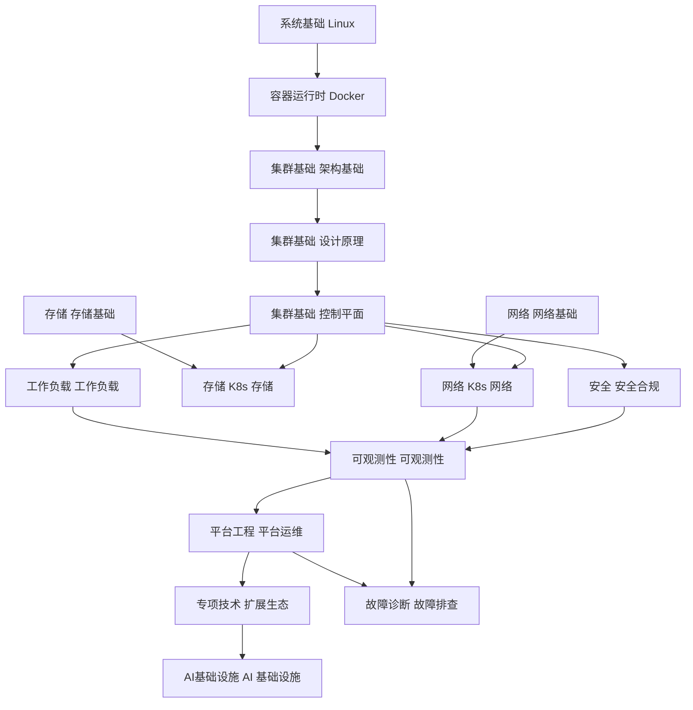
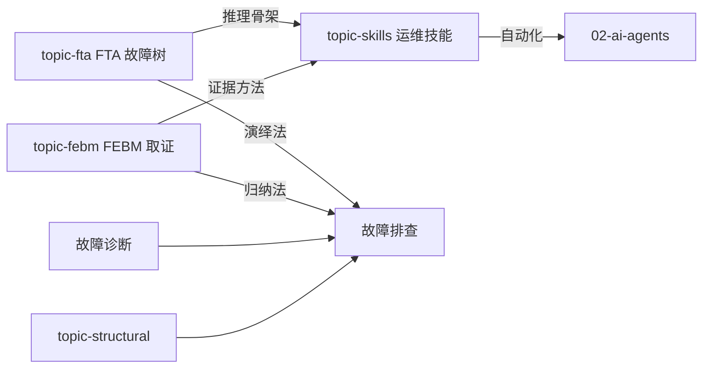
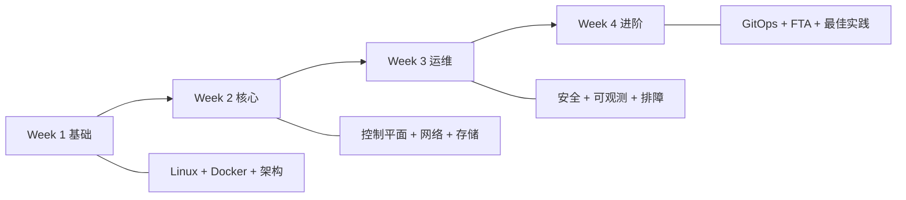

> **生产环境安全提示**
>
> 本文档包含可直接执行的运维命令。执行前请确认：当前目标集群与 Namespace 是否正确；是否具备足够的 RBAC 权限；是否已在非生产环境验证。命令风险等级标注：🔴 高风险（可能造成数据丢失或服务中断）、🟡 中风险（会修改集群状态，但通常可回滚）、🟢 低风险/只读（信息收集，无副作用）。

# 知识图谱 (Knowledge Map)

> 知识模块间的依赖关系和学习路径

---

## 核心知识图谱

---

## 方法论关系

---

## 学习路径

---

## 模块间依赖矩阵

| 模块 | 前置依赖 | 推荐后续 |
|:---|:---|:---|
| 集群基础 架构 | 容器运行时 Docker | 集群基础 设计原理 |
| 集群基础 设计 | 集群基础 架构 | 集群基础 控制平面 |
| 集群基础 控制平面 | 集群基础 设计 | 工作负载/5/6/7 |
| 网络 网络 | 网络 网络基础 | 故障诊断 排障 |
| 存储 存储 | 存储 存储基础 | 故障诊断 排障 |
| 可观测性 可观测 | 集群基础/4/5 | 平台工程 平台运维 |
| AI基础设施 AI | 工作负载 工作负载 | 02-ai-agents |
| 故障诊断 排障 | domain-1~8 任一 | 故障诊断/topic-fta/skills |
| topic-fta | 故障诊断 排障基础 | topic-skills |
| topic-skills | topic-fta + 故障诊断 | 02-ai-agents |

## Related

- [[生态参考/topic-index/gitops-cicd-index.md|GitOps / CI-CD 全局索引]]

<!-- risk-assessed -->
