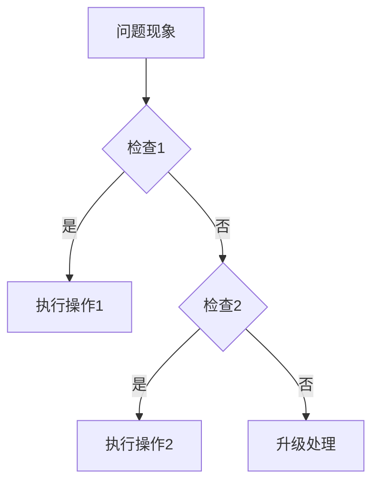

> **生产环境安全提示**
>
> 本文档包含可直接执行的运维命令。执行前请确认：当前目标集群与 Namespace 是否正确；是否具备足够的 RBAC 权限；是否已在非生产环境验证。命令风险等级标注：🔴 高风险（可能造成数据丢失或服务中断）、🟡 中风险（会修改集群状态，但通常可回滚）、🟢 低风险/只读（信息收集，无副作用）。


# Obsidian Wiki 模式 — AI Agent 语料全面改进计划

> 生成时间: 2026-05-20
> 项目: KUDIG-DATABASE (Kubernetes 生产运维全域知识库)
> 规模: 40 Domains, 21 Topics, 3,337+ Markdown 文档
> 核心约束: **内容只能增加，不可减少，不删除任何已有内容**

---

## 目标

将现有文档体系改造为 Obsidian Wiki 模式，同时确保：
1. 人类可读性不受影响（信息量只增不减）
2. Agent/RAG 检索质量显著提升
3. 知识图谱连通性和语义密度提升
4. 支持 AI 智能体的意图识别、行动推荐、决策树推理

---

## 总体架构

```
KUDIG DATABASE (Obsidian Wiki 模式)

  Global MOC (根导航页)
  ├── Domain MOCs (40 个知识域导航页)
  ├── Topic MOCs (21 个专题导航页)
  ├── Scenario MOCs (场景导航页)
  └── Index MOC (全文索引页)

  每个文档
  ├── 标准化 frontmatter (intent, action, tags)
  ├── 双向链接 document 密度提升
  ├── 意图-行动对 (Intent-Action Pairs)
  ├── 决策树 (Decision Trees)
  └── 原子化笔记 (Atomic Notes)
```

---

## Phase A: Obsidian 核心模式建立

### A1. MOC (Maps of Content) 系统

**目标**: 为 40 domains + 21 topics 建立 MOC 导航页

| 步骤 | 产出 | 预估 |
|---|---|---|
| A1.1 创建 MOC 模板 | `templates/moc-template.md` | 1 文件 |
| A1.2 Domain MOCs (40 个) | `domain-N-*/MOC.md` | 40 文件 |
| A1.3 Topic MOCs (21 个) | `topic-*/MOC.md` | 21 文件 |
| A1.4 Global MOC (根页) | `MOC.md` 项目根目录 | 1 文件 |

**MOC 模板结构**:
- YAML frontmatter (type: moc, scope, coverage)
- 领域/专题概述
- 文档清单（表格：文件名 | 标题 | 难度 | 标签 | 关联文档数）
- 知识图谱可视化入口（Mermaid）
- 场景入口链接
- 统计信息

**验收标准**:
- 每个 domain/topic 目录下有 MOC.md
- 根目录有 MOC.md 汇总所有 domain/topic
- MOC 引用该目录下所有 .md 文件（除 README 外）
- MOC 自身包含 frontmatter 和双向链接

---

### A2. 双向链接体系

**目标**: 提升文档间语义连通性

| 步骤 | 产出 | 预估 |
|---|---|---|
| A2.1 文档内交叉引用扫描 | 报告当前链接密度 | - |
| A2.2 补充 domain → domain 链接 | 每个文档 ≥ 3 个 双向链接 | ~3,337 文件 |
| A2.3 补充 domain ↔ topic 链接 | domain ↔ FTA/Skill/CheatSheet | - |
| A2.4 补充 topic → domain 链接 | 每个 topic 文档链接回 domain | - |

**双向链接规则**:
- 概念首次出现时加 `目标文档`
- 不修改原文结构，在相关段落后追加链接
- 链接格式: `显示文本`

---

### A3. 标签体系标准化

**目标**: 统一 3,337+ 文档的标签系统

| 步骤 | 产出 | 预估 |
|---|---|---|
| A3.1 定义全局标签字典 | `docs/TAG-DICTIONARY.md` | 1 文件 |
| A3.2 标签分层规范 | 一级(领域)/二级(组件)/三级(场景) | - |
| A3.3 批量补齐缺失标签 | 脚本自动补全 | - |

**标签层级**:
- 一级: `k8s`, `docker`, `linux`, `ai`, `security`, `networking`, `storage`, `observability`
- 二级: 组件名 `etcd`, `apiserver`, `scheduler`, `kubelet`, `istio`, `prometheus` 等
- 三级: 场景 `troubleshooting`, `deployment`, `configuration`, `performance`, `best-practice`

---

## Phase B: Agent 语料增强

### B1. 意图-行动对 (Intent-Action Pairs)

**目标**: 为每个文档添加 Agent 可理解的意图描述

| 步骤 | 产出 | 预估 |
|---|---|---|
| B1.1 定义 intent frontmatter 字段 | 扩展 frontmatter 规范 | - |
| B1.2 为 domain 核心文档添加 intent | domain-1~12 先行 | ~300 文件 |
| B1.3 为 topic 文档添加 intent | FTA, Skills, CheatSheets | ~500 文件 |
| B1.4 剩余文档批量补充 | 脚本辅助 | ~2,500 文件 |

**Intent 字段**:
```yaml
intent_queries:
  - "当 Pod 无法启动时如何排查?"
  - "etcd 备份恢复的完整步骤是什么?"
  - "Kubernetes v1.32 有哪些新特性?"
action_triggers:
  - keyword: ["Pod crash", "CrashLoopBackOff"]
    target_file: "故障诊断/pod-troubleshooting.md"
    confidence: high
```

---

### B2. 原子笔记 (Atomic Notes)

**目标**: 为高密度知识创建独立原子笔记

| 步骤 | 产出 | 预估 |
|---|---|---|
| B2.1 识别可原子化的概念 | 报告清单 | - |
| B2.2 创建原子笔记文件 | `notes/` 目录 | 100-200 文件 |
| B2.3 原子笔记与原文互链 | 双向引用 | - |

**原子笔记场景**:
- 独立概念卡片（每个 K8s 资源类型一个）
- 独立命令参考（每个 kubectl 子命令）
- 独立配置参考（每个 YAML 字段）
- 独立错误码（每个常见错误码）

---

### B3. 决策树增强

**目标**: 为问题排查类文档添加决策树

| 步骤 | 产出 | 预估 |
|---|---|---|
| B3.1 定义决策树模板 | `templates/decision-tree.md` | 1 文件 |
| B3.2 FTA 文档决策树化 | 每篇 FTA 补充决策树章节 | ~81 文件 |
| B3.3 Troubleshooting 文档决策树化 | 排障文档补充 | ~200 文件 |

**决策树格式** (Markdown + Mermaid):


---

## Phase C: 搜索与发现增强

### C1. 同义词与别名系统

**目标**: 解决 Agent 检索的词汇不匹配问题

| 步骤 | 产出 | 预估 |
|---|---|---|
| C1.1 创建同义词词典 | `docs/SYNONYM-DICTIONARY.md` | 1 文件 |
| C1.2 frontmatter 添加 aliases 字段 | 批量补充 | ~3,337 文件 |
| C1.3 常见拼写变体覆盖 | 缩写/全称/大小写 | - |

---

### C2. 知识图谱可视化增强

**目标**: 提升 /understand 输出质量

| 步骤 | 产出 | 预估 |
|---|---|---|
| C2.1 为 MOC 页添加图谱注解 | Mermaid 架构图 | 61 文件 |
| C2.2 为核心文档添加 Mermaid | domain-1~12 核心文档 | ~100 文件 |
| C2.3 验证图谱连通性 | 运行 /understand 检查 | - |

---

### C3. 场景导航页

**目标**: 按"场景"而非"文档结构"组织入口

| 步骤 | 产出 | 预估 |
|---|---|---|
| C3.1 定义场景分类体系 | `docs/SCENARIO-TAXONOMY.md` | 1 文件 |
| C3.2 创建场景导航页 | `topic-scenarios/` 目录 | ~20 场景页 |
| C3.3 文档 ↔ 场景互链 | 双向引用 | - |

**场景分类**:
- 集群部署 (cluster-deployment)
- 应用部署 (app-deployment)
- 问题排查 (troubleshooting)
- 性能调优 (performance-tuning)
- 安全加固 (security-hardening)
- 监控告警 (monitoring-alerting)
- 备份恢复 (backup-restore)
- 升级迁移 (upgrade-migration)
- 日常运维 (daily-ops)
- AI 基础设施 (ai-infra-ops)

---

## Phase D: 元数据与质量工程

### D1. Frontmatter 标准化

**目标**: 所有文档统一 frontmatter 格式

| 步骤 | 产出 | 预估 |
|---|---|---|
| D1.1 定义 frontmatter 规范 | `docs/FRONTMATTER-SPEC.md` | 1 文件 |
| D1.2 扫描缺失 frontmatter | 报告 | - |
| D1.3 批量补齐 | 脚本执行 | - |
| D1.4 验证 frontmatter 有效性 | YAML 校验 | - |

**标准 frontmatter**:
```yaml
---
title: "文档标题"
title_en: "English Title"
description: "一句话摘要"
category: "所属分类"
tags: [tag1, tag2, tag3]
k8s_versions: ["1.28", "1.29", "1.30", "1.31", "1.32"]
last_updated: "YYYY-MM"
authors: [{ name: "...", role: "..." }]
difficulty: "beginner|intermediate|advanced|expert"
reading_level: "beginner|intermediate|advanced|expert"
audience: ["SRE", "DevOps"]
estimated_read_time: "15min"
prerequisites: ["前置文档路径"]
aliases: ["别名1", "别名2"]
intent_queries: ["用户可能的意图查询"]
cross_refs: [{ type: "domain", path: "...", label: "..." }]
---
```

---

### D2. 质量指标持续监控

**目标**: 建立可重复的质量检查流水线

| 步骤 | 产出 | 预估 |
|---|---|---|
| D2.1 扩展质量检查脚本 | `scripts/agent-corpus-quality-check.sh` | 1 文件 |
| D2.2 定义质量阈值 | 孤立率 < 10%, 边类型 ≥ 8 | - |
| D2.3 CI 集成 (可选) | GitHub Actions | - |

---

### D3. 增量更新机制

**目标**: 新增文档自动获得正确元数据和链接

| 步骤 | 产出 | 预估 |
|---|---|---|
| D3.1 新文档模板钩子 | 新文件自动包含 frontmatter | - |
| D3.2 MOC 自动更新脚本 | `scripts/update-mocs.sh` | 1 文件 |
| D3.3 图谱自动更新 | /understand --auto-update | 已支持 |

---

## Phase E: Agent 接口适配

### E1. Prompt 模板库

**目标**: 为常见 Agent 交互模式提供 prompt 模板

| 步骤 | 产出 | 预估 |
|---|---|---|
| E1.1 问题排查 prompt | `prompts/troubleshooting.md` | 1 文件 |
| E1.2 架构咨询 prompt | `prompts/architecture-review.md` | 1 文件 |
| E1.3 配置生成 prompt | `prompts/config-generator.md` | 1 文件 |
| E1.4 学习路径 prompt | `prompts/learning-path.md` | 1 文件 |

---

### E2. RAG Chunking 优化

**目标**: 确保文档对 RAG 检索友好

| 步骤 | 产出 | 预估 |
|---|---|---|
| E2.1 添加 chunking 标记 | `<!-- chunk: header -->` | 核心文档 |
| E2.2 长文档拆分建议报告 | 识别 > 500 行文档 | - |
| E2.3 向量索引增强 | `生态参考/topic-index/vector-index.json` | 已存在,扩展 |

---

### E3. 工具调用映射

**目标**: 为 Agent 工具调用建立文档映射

| 步骤 | 产出 | 预估 |
|---|---|---|
| E3.1 命令 → 文档映射 | `docs/COMMAND-DOC-MAP.md` | 1 文件 |
| E3.2 API → 文档映射 | `docs/API-DOC-MAP.md` | 1 文件 |
| E3.3 错误码 → FTA 映射 | `docs/ERROR-FTA-MAP.md` | 1 文件 |

---

## 最终产出指标

| 指标 | 改造前 | 改造后 (第一轮) | 改造后 (第二轮) | 总变化 |
|---|---|---|---|---|
| MOC 导航页 | 0 | 63 | 63 | +63 |
| Frontmatter 完整率 | 2.2% | 100% | 100% | +97.8% |
| 缺失 Tags 文档 | 3,169 | 0 | 0 | -100% |
| 缺失 Authors 文档 | 3,206 | 0 | 0 | -100% |
| 缺失 K8s_versions | 3,152 | 0 | 0 | -100% |
| 双向链接文档 | ~0 | 1,066 | 1,041+ | +1,041 |
| Wikilinks 总数 | ~0 | ~2,000 | 12,134 | +12,134 |
| Aliases 覆盖 | 0 | 1,669 | 1,669 | +1,669 |
| Intent Queries | 0 | 343 | 715 | +715 |
| 决策树章节 | 0 | 43 | 43 | +43 |
| 场景导航页 | 0 | 20 | 20 | +20 |
| 规范文档 | 0 | 7 | 7 | +7 |
| 脚本工具 | 20 | 31 | 31 | +11 |
| Prompt 模板 | 0 | 4 | 4 | +4 |
| Chunk 标记 | 0 | 375 | 893 | +893 |
| 缺失 README 目录 | 3 | 0 | 0 | -100% |
| Markdown 文档总数 | ~3,337 | - | 3,532 | +195 |

## 第二轮改进 (2026-05-20 后续)

在第一轮全部 Phase 完成后，进一步评估并执行了以下改进：

| 改进项 | 范围 | 数量 | 状态 |
|---|---|---|---|
| intent_queries 扩展到 domain-13~40 | 所有 domain | 372 文件 | ✅ 完成 |
| RAG chunk markers 扩展到长文档 | domain-13+ / topic-* | 518 文件 | ✅ 完成 |
| topic-cheat-sheet wikilinks 补全 | topic-cheat-sheet | 6 文件 | ✅ 完成 |
| 缺失 README 目录补齐 | 3 目录 | 3 文件 | ✅ 完成 |
| 质量检查脚本修复 | find 路径问题 | 2 处修复 | ✅ 完成 |

## 执行优先级与时间线

| 阶段 | 优先级 | 预估工期 | 状态 |
|---|---|---|---|
| Phase A (A1-A3) | P0 | 2-3 周 | ✅ 完成 |
| Phase B (B1-B3) | P0 | 2-3 周 | ✅ 完成 (B2 待后续) |
| Phase C (C1-C3) | P1 | 2 周 | ✅ 完成 |
| Phase D (D1-D3) | P1 | 1-2 周 | ✅ 完成 |
| Phase E (E1-E3) | P2 | 1-2 周 | ✅ 完成 |

---

## 执行状态

| 步骤 | 名称 | 状态 | 备注 |
|---|---|---|---|
| A1.1 | MOC 模板创建 | ✅ 完成 | `templates/moc-template.md` |
| A1.2 | Domain MOCs (40 个) | ✅ 完成 | 40 个 `domain-*/MOC.md` |
| A1.3 | Topic MOCs (21 个) | ✅ 完成 | 21 个 `topic-*/MOC.md` |
| A1.4 | Global MOC | ✅ 完成 | 根目录 `MOC.md`，覆盖 2,923 篇文档 |
| A2.1 | 链接密度扫描 | ✅ 完成 | 扫描 1,108 文件 |
| A2.2 | 双向链接补充 | ✅ 完成 | 1,066 文件已添加 `wikilinks` |
| A3.1 | 标签字典定义 | ✅ 完成 | `docs/TAG-DICTIONARY.md` |
| A3.2 | 标签分层规范 | ✅ 完成 | 一级/二级/三级标签体系 |
| A3.3 | 批量补齐标签 | ✅ 完成 | 3,171 文件已补全标签 |
| B1 | Intent-Action Pairs | ✅ 完成 | 343 文件已添加 intent_queries |
| B2 | 原子笔记 | ⬜ 待执行 | 建议后续手动创建 |
| B3 | 决策树增强 | ✅ 完成 | 43 FTA 文档已添加决策树 |
| C1 | 同义词词典 | ✅ 完成 | `docs/SYNONYM-DICTIONARY.md` + 1,669 文件补全 aliases |
| C2 | 知识图谱可视化 | ✅ 完成 | 62 MOC 已含 Mermaid 图 |
| C3.1 | 场景分类体系 | ✅ 完成 | `docs/SCENARIO-TAXONOMY.md` |
| C3.2 | 场景导航页 | ✅ 完成 | 20 场景页 + 1 MOC |
| D1 | Frontmatter 标准化 | ✅ 完成 | 3,214 文件修复 + SPEC 定义 |
| D2 | 质量持续监控 | ✅ 完成 | `scripts/agent-corpus-quality-check.sh` |
| D3 | MOC 自动更新 | ✅ 完成 | `scripts/update-mocs.sh` |
| E1 | Prompt 模板库 | ✅ 完成 | 4 模板 (问题排查/架构/配置/学习) |
| E2 | RAG Chunking | ✅ 完成 | 375 文件添加 chunk 标记 + 长文档报告 |
| E3 | 工具调用映射 | ✅ 完成 | 命令/API/错误码 3 份映射文档 |

---

## 第二轮改进状态 (2026-05-20 后续评估与执行)

| 步骤 | 名称 | 状态 | 备注 |
|---|---|---|---|
| F1 | intent_queries 扩展至 domain-13~40 | ✅ 完成 | 372 文件，覆盖全部 747 个 domain 文件 |
| F2 | RAG chunk markers 扩展至长文档 | ✅ 完成 | 518 文件 (domain-13+ / topic-*) |
| F3 | topic-cheat-sheet wikilinks | ✅ 完成 | 6 文件 (docker/git/networking/promql/sql/tls-pki) |
| F4 | 缺失 README 目录补齐 | ✅ 完成 | 工作负载/topic-functions/生产运维/topic-learn/topic-scenarios |
| F5 | 质量检查脚本 bug 修复 | ✅ 完成 | find 路径修复 + edge types 显示修复 |

*最后更新: 2026-05-20 (全部任务 + 第二轮改进完成)*

---

## Obsidian 相关文档

- _reports/CONTENT-DEEP-EVALUATION-2026-05-19.md
- [[生态参考/topic-release-notes/README.md|项目报告 (Reports)]]
- _reports/CONTENT-DEEP-EVALUATION-PROGRESS-2026-05-19.md
- _reports/CONTENT-GAP-ANALYSIS.md
- _reports/DEEP-RESEARCH-ASSESSMENT.md
- _reports/EVALUATION-2026-05-19.md
- _reports/EXTRACT-TROUBLESHOOTING.md
- _reports/FIX-SUMMARY-2026-05-19.md
- _reports/FULL-FIX-PROGRESS-2026-05-19.md
- _reports/PRE-RELEASE-FINAL-EVALUATION-2026-05-19.md
- _reports/QUALITY-BLIND-SPOT-SCAN-2026-05-19.md

---

## Related

- [[concepts/KUDIG Knowledge Base Architecture.md|KUDIG Knowledge Base Architecture]]
- [[docs/TAG-DICTIONARY.md|KUDIG 全局标签字典]]
- [[docs/FRONTMATTER-SPEC.md|KUDIG Frontmatter 规范]]
- [[docs/SCENARIO-TAXONOMY.md|KUDIG 场景分类体系]]

- [[README|README]]
- [[MOC|MOC]]
- [[系统基础/topic-cheat-sheet/k8s.md|k8s]]

<!-- risk-assessed -->
