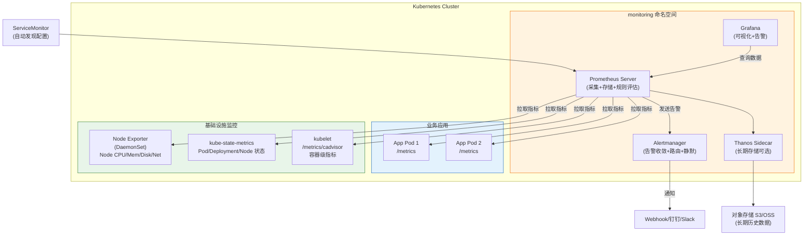
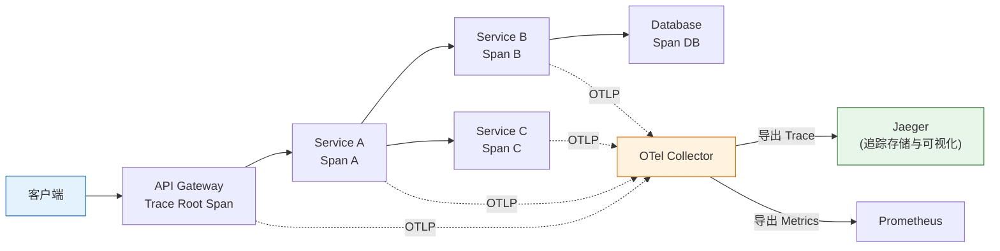
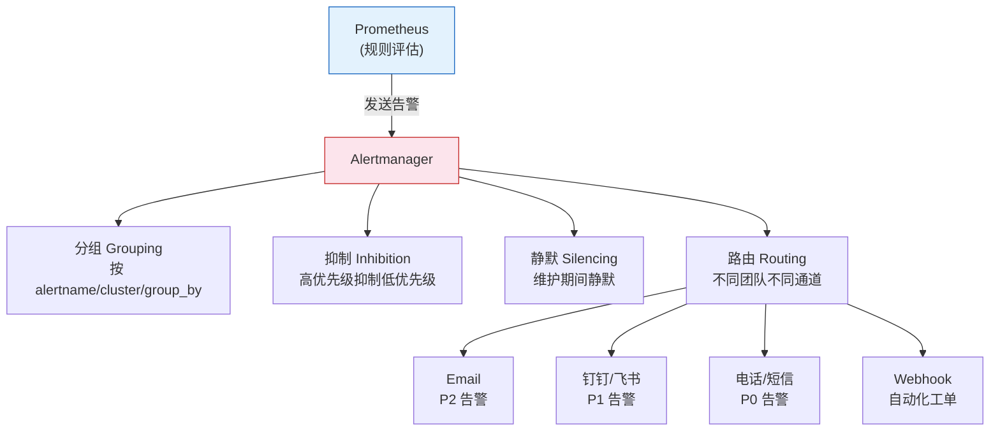

# Kubernetes 可观测性全栈培训 (监控、日志、追踪)

> **适用版本**: Kubernetes v1.28 - v1.32 | **文档类型**: 运维可观测性专项
> **核心原则**: 黄金指标驱动、白盒监控、全链路追踪

---

## 演讲概述

### 目标受众

- SRE 工程师：构建完整的可观测性体系
- 全栈开发：理解应用的监控与日志最佳实践
- 监控架构师：设计大规模集群的监控架构
- 运维工程师：掌握 Prometheus 查询和告警配置

### 预计时长

| 阶段 | 内容 | 时长 |
|------|------|------|
| 第一阶段 | 可观测性三大支柱与基础概念 | 30 分钟 |
| 第二阶段 | Prometheus 监控架构与 PromQL | 40 分钟 |
| 第三阶段 | ServiceMonitor 自动发现与指标采集 | 25 分钟 |
| 第四阶段 | 日志采集架构与链路追踪 | 35 分钟 |
| 第五阶段 | 实战演示与动手实验 | 35 分钟 |
| 第六阶段 | 告警管理与自愈体系 | 25 分钟 |
| Q&A | 互动问答 | 15 分钟 |
| **合计** | | **约 3.5 小时** |

### 核心学习目标

完成本次培训后，学员能够：

1. 区分监控（Monitoring）和可观测性（Observability）的概念差异
2. 部署完整的 Prometheus + Grafana + Alertmanager 监控栈
3. 编写 PromQL 查询实现黄金指标的监控面板
4. 配置 ServiceMonitor 实现应用的自动监控发现
5. 选择合适的日志采集方案并部署 Loki/ELK
6. 设计高质量的告警规则，避免告警疲劳

### 核心要点

1. 可观测性三大支柱：Metrics（指标）、Logging（日志）、Tracing（追踪）
2. 黄金指标（Golden Signals）驱动监控体系设计
3. Prometheus 是 Kubernetes 监控的事实标准
4. 日志采集方案选择：DaemonSet vs Sidecar
5. OpenTelemetry 统一可观测性数据采集
6. 高质量告警的核心：可操作性

---

## 课程大纲

| 序号 | 章节 | 关键知识点 | 时长 |
|------|------|-----------|------|
| 1 | 可观测性概述 | 三大支柱、监控分层模型 | 15min |
| 2 | 黄金指标 | Latency/Traffic/Errors/Saturation | 15min |
| 3 | USE 方法 | Utilization/Saturation/Errors | 10min |
| 4 | Prometheus 架构 | Pull 模式、TSDB、Exporter | 20min |
| 5 | PromQL 实战 | 查询语法、聚合函数、子查询 | 20min |
| 6 | ServiceMonitor | 自动发现、标签匹配、端点配置 | 15min |
| 7 | 日志采集 | DaemonSet/Sidecar、PLG/ELK 方案 | 20min |
| 8 | 链路追踪 | OpenTelemetry、Jaeger、Span/Trace | 15min |
| 9 | 告警设计 | 告警分级、收敛机制、Runbook | 15min |
| 10 | 实战演示 | 部署监控栈、配置告警、查询分析 | 35min |

---

## 核心概念讲解

### 什么是可观测性？

可观测性（Observability）不同于监控（Monitoring）。监控告诉你"系统出了什么问题"，可观测性让你理解"为什么会出问题"。监控是可观测性的一个子集。

**可观测性三大支柱：**

| 支柱 | 类比 | 回答的问题 | 典型工具 | 数据特征 |
|------|------|-----------|---------|---------|
| **Metrics (指标)** | 体温计 | 系统发生了什么？ | Prometheus | 数值型、可聚合、低基数 |
| **Logging (日志)** | 日记本 | 为什么发生？ | Loki / ELK | 文本型、离散事件、高基数 |
| **Tracing (追踪)** | 监控录像 | 流量在哪里卡住了？ | Jaeger / Tempo | 有向无环图、因果链 |

**三者之间的关系：**

```
指标发现异常 → 日志定位上下文 → 追踪找到根因
    ↑                                    │
    └────── 验证修复效果 ←───────────────┘
```

**监控的分层模型：**

```
┌─────────────────────────────────────────────┐
│              业务指标层 (Business)              │  订单量、转化率、收入、用户活跃数
├─────────────────────────────────────────────┤
│              应用层 (Application)              │  QPS、响应时间、错误率、慢查询
├─────────────────────────────────────────────┤
│              容器/Pod 层 (Container)           │  重启次数、资源限额、OOM、探针状态
├─────────────────────────────────────────────┤
│              基础架构层 (Infrastructure)        │  Node CPU/内存/网络/磁盘、etcd 延迟
└─────────────────────────────────────────────┘
```

每一层都是上一层的根基——如果基础架构层出问题，应用层必然异常。设计监控时应该自底向上：先确保基础架构层有完整监控，再逐层向上建设。

### 黄金指标 (Google's Four Golden Signals)

Google SRE 手册定义了四个黄金指标，这是设计监控体系的起点：

| 指标 | 含义 | 用户体验影响 | Prometheus 表达式示例 |
|------|------|------------|---------------------|
| **Latency（延迟）** | 请求响应时间 | 用户感知"慢" | `histogram_quantile(0.99, sum(rate(http_request_duration_seconds_bucket[5m])) by (le, service))` |
| **Traffic（流量）** | 系统承受的请求量 | 影响容量规划 | `sum(rate(http_requests_total[5m])) by (service)` |
| **Errors（错误）** | 请求失败率 | 用户感知"不能用" | `sum(rate(http_requests_total{status=~"5.."}[5m])) by (service) / sum(rate(http_requests_total[5m])) by (service) * 100` |
| **Saturation（饱和度）** | 资源使用程度 | 即将"崩溃"的前兆 | `kubelet_volume_stats_used_bytes / kubelet_volume_stats_capacity_bytes` |

**延迟的细分：**

延迟不能只看平均值，必须区分成功请求和失败请求的延迟。一个返回 500 的请求可能响应极快（因为立即返回了错误），如果把这种请求计入平均延迟，会掩盖真正的延迟问题。

```promql
# 成功请求的 P99 延迟
histogram_quantile(0.99, sum(rate(http_request_duration_seconds_bucket{status!~"5.."}[5m])) by (le, service))

# 失败请求的 P99 延迟
histogram_quantile(0.99, sum(rate(http_request_duration_seconds_bucket{status=~"5.."}[5m])) by (le, service))
```

**USE 方法（基础设施层）：**

| 维度 | 说明 | 示例 | PromQL |
|------|------|------|--------|
| **Utilization（使用率）** | 资源忙碌的时间比例 | CPU 使用率 80% | `100 - (avg by (instance) (rate(node_cpu_seconds_total{mode="idle"}[5m])) * 100)` |
| **Saturation（饱和度）** | 资源排队/溢出的程度 | 磁盘 I/O 等待队列 | `rate(node_disk_io_time_seconds_total[5m])` |
| **Errors（错误）** | 错误事件计数 | 网络丢包率 | `rate(node_netstat_Tcp_RetransSegs[5m])` |

### Prometheus 监控架构

Prometheus 是 Kubernetes 监控的事实标准，采用 **Pull 模式**主动拉取指标：

```
┌──────────────────────────────────────────────────────────┐
│                    Prometheus 生态                         │
│                                                            │
│  ┌──────────────┐    ┌──────────────┐    ┌──────────────┐│
│  │  Prometheus   │    │  Alertmanager │    │   Grafana    ││
│  │  Server       │───>│  (告警管理)    │    │  (可视化)     ││
│  │  (采集+存储)   │    └──────────────┘    └──────────────┘│
│  └──────┬───────┘           ^                    ^         │
│         │                   │                    │         │
│    Pull │              PushAlert              Query        │
│         │                   │                    │         │
│  ┌──────┴───────┐    ┌──────┴───────┐                    │
│  │  Exporter     │    │  Pushgateway  │                    │
│  │  (指标暴露)    │    │  (Push 桥接)   │                    │
│  └──────────────┘    └──────────────┘                     │
│                                                            │
│  ┌──────────────┐    ┌──────────────┐                     │
│  │ServiceMonitor │    │ PodMonitor   │                     │
│  │ (自动发现)     │    │ (自动发现)    │                     │
│  └──────────────┘    └──────────────┘                     │
└──────────────────────────────────────────────────────────┘
```

**关键概念：**

| 概念 | 说明 | 注意事项 |
|------|------|---------|
| **Pull 模式** | Prometheus 主动拉取目标指标，无需在应用侧安装 Agent | 目标必须有可访问的 /metrics 端点 |
| **Exporter** | 将非 Prometheus 格式的指标转化为标准格式 | 如 NodeExporter、kube-state-metrics |
| **ServiceMonitor** | Operator 模式下的自动化监控发现 | 需要安装 Prometheus Operator |
| **PromQL** | Prometheus 查询语言，用于数据查询和告警规则 | 支持 rate、histogram_quantile 等函数 |
| **TSDB** | 时序数据库，存储指标数据 | 默认保留 15 天，建议持久化存储 |
| **Relabeling** | 在采集前对标签进行重写、过滤 | 是 Prometheus 高级配置的核心 |
| **Recording Rules** | 预计算常用查询，减轻实时查询压力 | 适合复杂聚合表达式 |

**PromQL 常用函数速查：**

| 函数 | 用途 | 示例 |
|------|------|------|
| `rate()` | 计算计数器的每秒增长速率 | `rate(http_requests_total[5m])` |
| `irate()` | 计算瞬时增长速率（更灵敏） | `irate(http_requests_total[5m])` |
| `histogram_quantile()` | 计算分位数 | `histogram_quantile(0.99, rate(http_duration_bucket[5m]))` |
| `sum()` | 聚合求和 | `sum(rate(http_requests_total[5m])) by (service)` |
| `avg()` | 聚合求平均 | `avg by (node) (node_cpu_seconds_total{mode="idle"})` |
| `topk()` | 取前 N 个值 | `topk(10, rate(http_requests_total[5m]))` |
| `predict_linear()` | 线性预测 | `predict_linear(node_filesystem_free_bytes[1h], 3600)` |
| `absent()` | 检测指标是否缺失 | `absent(up{job="my-app"})` |

### 日志采集方案

**DaemonSet 模式 vs Sidecar 模式：**

| 维度 | DaemonSet 模式 | Sidecar 模式 |
|------|---------------|-------------|
| 资源消耗 | 低（每节点一个采集器） | 高（每个 Pod 一个采集器） |
| 隔离性 | 共享采集器，一个问题影响全节点 | 独立采集器，故障隔离 |
| 适用场景 | 标准日志（stdout/stderr） | 特殊格式日志、多文件日志 |
| 运维复杂度 | 低 | 高 |
| 推荐 | 通用场景首选 | 特殊需求使用 |

**日志方案对比：**

| 方案 | 组件 | 优势 | 劣势 | 适用场景 |
|------|------|------|------|---------|
| **PLG** | Promtail + Loki + Grafana | 轻量、与 Prometheus 生态统一 | 全文搜索能力弱 | 中小规模、已有 Grafana |
| **ELK** | Elasticsearch + Logstash + Kibana | 功能强大、全文搜索 | 资源消耗大 | 大规模、复杂查询需求 |
| **EFK** | Elasticsearch + [[fluentd|Fluentd]] + Kibana | Fluentd 比 Logstash 更轻量 | 学习曲线陡 | Kubernetes 原生日志 |

**LogQL 常用查询语法（Loki）：**

```
# 基本过滤
{app="my-app"} |= "error" != "timeout"

# JSON 日志解析
{app="my-app"} | json | level="error" | line_format "{{.timestamp}} {{.message}}"

# 统计错误率
sum(count_over_time({app="my-app"} |= "error" [5m])) by (level)
/ sum(count_over_time({app="my-app"} [5m])) by (level) * 100

# 提取标签并过滤
{app="my-app"} | logfmt | level="error" | status >= 500
```

### 全链路追踪 (Tracing)

在微服务架构中，一个用户请求可能经过多个服务。当出现延迟时，"谁慢了？"是最关键的问题——这正是链路追踪要解决的。

**核心概念：**

| 概念 | 说明 | 类比 |
|------|------|------|
| **Trace** | 一次完整的请求链路，由多个 Span 组成 | 一次快递的完整路径 |
| **Span** | 单个服务的处理过程，包含开始时间、持续时间、标签 | 快递的一个中转站 |
| **Context Propagation** | 跨服务传递 Trace ID 的机制 | 快递单号 |
| **Sampling** | 采样策略，不是每个请求都追踪 | 抽检 |

**OpenTelemetry 统一标准：**

OpenTelemetry（OTel）是 CNCF 的可观测性统一标准，合并了 OpenTracing 和 OpenCensus 项目。它提供：

- **统一的 API/SDK**：一套代码同时生成 Metrics、Logs、Traces
- **统一的采集器（Collector）**：接收、处理、导出可观测性数据
- **多后端支持**：可以同时发送到 Jaeger、Tempo、Zipkin 等

```
应用 (OTel SDK)
    │
    ├── Traces ──┐
    ├── Metrics ─┤──> OpenTelemetry Collector ──> Jaeger / Prometheus / Loki
    └── Logs ────┘         │
                           ├── receivers (OTLP, Jaeger, Zipkin...)
                           ├── processors (batch, filter, sampling...)
                           └── exporters (Jaeger, Prometheus, Loki...)
```

---

## 架构图

### Prometheus 监控架构



### 日志采集架构 (DaemonSet 模式)

```mermaid
graph TB
    subgraph Node1["Node 1"]
        P1["Pod A<br/>stdout → /var/log/pods/"]
        P2["Pod B<br/>stdout → /var/log/pods/"]
        FL1["Fluentd DaemonSet<br/>(读取日志文件)<br/>解析+过滤+标签"]
    end

    subgraph Node2["Node 2"]
        P3["Pod C<br/>stdout → /var/log/pods/"]
        P4["Pod D<br/>stdout → /var/log/pods/"]
        FL2["Fluentd DaemonSet<br/>(读取日志文件)"]
    end

    subgraph Storage["日志存储"]
        LOKI["Loki<br/>(轻量级，索引标签)"]
        ES["Elasticsearch<br/>(全文索引，强大搜索)"]
    end

    FL1 --> LOKI
    FL1 --> ES
    FL2 --> LOKI
    FL2 --> ES

    GRAF["Grafana<br/>(查询与可视化)"] --> LOKI
    KIBANA["Kibana<br/">(查询与可视化)"] --> ES

    style Node1 fill:#e8eaf6,stroke:#283593
    style Node2 fill:#e8eaf6,stroke:#283593
    style Storage fill:#fff3e0,stroke:#ef6c00
```

### 全链路追踪架构



### Alertmanager 告警收敛架构



---

## 实战演示步骤

### 演示 1：部署 Prometheus + Grafana 监控栈

> ⚠️ **🟡 中危变更** — 变更集群资源状态，建议先 --dry-run 或 diff 确认
> - `helm upgrade/install`：部署/升级 release

```bash
# 步骤 1: 添加 Helm 仓库
helm repo add prometheus-community https://prometheus-community.github.io/helm-charts
helm repo update
# 预期输出:
# Hang tight while we grab the latest from your chart repositories...
# ...Successfully got an update from the "prometheus-community" chart repository
# Update Complete. ⎈Happy Helming!⎈

# 步骤 2: 部署 kube-prometheus-stack（包含 Prometheus + Grafana + Alertmanager + Exporters）
helm install monitoring prometheus-community/kube-prometheus-stack \
  --namespace monitoring \
  --create-namespace \
  --set prometheus.prometheusSpec.retention=15d \
  --set prometheus.prometheusSpec.storageSpec.volumeClaimTemplate.spec.storageClassName=standard \
  --set prometheus.prometheusSpec.storageSpec.volumeClaimTemplate.spec.resources.requests.storage=50Gi \
  --set grafana.adminPassword=admin123 \
  --set grafana.persistence.enabled=true \
  --set grafana.persistence.size=10Gi

# 预期输出:
# NAME: monitoring
# LAST DEPLOYED: Mon May 18 2026
# NAMESPACE: monitoring
# STATUS: deployed

# 步骤 3: 验证组件状态
kubectl get pods -n monitoring
# 预期输出:
# NAME                                                         READY   STATUS    RESTARTS   AGE
# monitoring-grafana-xxxxxx-yyyy                               1/1     Running   0          2m
# monitoring-kube-prometheus-operator-xxxxxx-yyyy              1/1     Running   0          2m
# monitoring-kube-state-metrics-xxxxxx-yyyy                    1/1     Running   0          2m
# monitoring-prometheus-node-exporter-xxxxx                    1/1     Running   0          2m
# prometheus-monitoring-kube-prometheus-prometheus-0           2/2     Running   0          2m
# alertmanager-monitoring-kube-prometheus-alertmanager-0       2/2     Running   0          2m

kubectl get svc -n monitoring
# 预期输出:
# NAME                                          TYPE        CLUSTER-IP       PORT(S)
# monitoring-grafana                             ClusterIP   10.96.100.1      80/TCP
# monitoring-kube-prometheus-prometheus          ClusterIP   10.96.100.2      9090/TCP
# monitoring-kube-prometheus-alertmanager        ClusterIP   10.96.100.3      9093/TCP

# 步骤 4: 访问 Grafana
kubectl port-forward svc/monitoring-grafana 3000:80 -n monitoring
# 浏览器访问 http://localhost:3000
# 用户名: admin  密码: admin123

# 步骤 5: 访问 Prometheus UI
kubectl port-forward svc/monitoring-kube-prometheus-prometheus 9090:9090 -n monitoring
# 浏览器访问 http://localhost:9090
```

### 演示 2：黄金指标查询实战

```bash
# 在 Prometheus UI (http://localhost:9090) 中执行以下查询

# ========== Latency（延迟）==========

# P50 响应时间
histogram_quantile(0.50, sum(rate(http_request_duration_seconds_bucket[5m])) by (le, service))

# P99 响应时间（按服务分组）
histogram_quantile(0.99, sum(rate(http_request_duration_seconds_bucket[5m])) by (le, service))

# ========== Traffic（流量）==========

# 每秒总请求数
sum(rate(http_requests_total[5m]))

# 每秒请求数（按服务分组）
sum(rate(http_requests_total[5m])) by (service)

# ========== Errors（错误率）==========

# 5xx 错误率百分比
sum(rate(http_requests_total{status=~"5.."}[5m])) by (service) 
/ sum(rate(http_requests_total[5m])) by (service) * 100

# 错误请求数（按状态码分组）
sum(rate(http_requests_total{status=~"[45].."}[5m])) by (status)

# ========== Saturation（饱和度）==========

# CPU 使用率
100 - (avg by (instance) (rate(node_cpu_seconds_total{mode="idle"}[5m])) * 100)

# 内存使用率
(1 - (node_memory_MemAvailable_bytes / node_memory_MemTotal_bytes)) * 100

# 磁盘使用率
(node_filesystem_size_bytes - node_filesystem_avail_bytes) / node_filesystem_size_bytes * 100

# 磁盘空间预测（4小时后剩余空间）
predict_linear(node_filesystem_avail_bytes[1h], 4*3600)

# Pod 重启次数
rate(kube_pod_container_status_restarts_total[15m]) > 0
```

### 演示 3：ServiceMonitor 自动发现

> ⚠️ **🟡 中危变更** — 变更集群资源状态，建议先 --dry-run 或 diff 确认
> - `kubectl apply/create/replace`：创建/变更集群资源

```bash
# 步骤 1: 部署一个带 metrics 端点的应用
cat <<EOF | kubectl apply -f -
apiVersion: apps/v1
kind: Deployment
metadata:
  name: demo-app
spec:
  replicas: 2
  selector:
    matchLabels:
      app: demo-app
  template:
    metadata:
      labels:
        app: demo-app
    spec:
      containers:
      - name: app
        image: prom/node-exporter
        ports:
        - containerPort: 9100
          name: metrics
        resources:
          requests:
            cpu: 100m
            memory: 64Mi
          limits:
            cpu: 200m
            memory: 128Mi
---
apiVersion: v1
kind: Service
metadata:
  name: demo-app
  labels:
    app: demo-app
    release: monitoring
spec:
  selector:
    app: demo-app
  ports:
  - port: 9100
    targetPort: 9100
    name: metrics
---
apiVersion: monitoring.coreos.com/v1
kind: ServiceMonitor
metadata:
  name: demo-app
  labels:
    release: monitoring
spec:
  selector:
    matchLabels:
      app: demo-app
  endpoints:
  - port: metrics
    interval: 15s
    path: /metrics
EOF
# 预期输出:
# deployment.apps/demo-app created
# service/demo-app created
# servicemonitor.monitoring.coreos.com/demo-app created

# 步骤 2: 验证 ServiceMonitor 被发现
kubectl get servicemonitor -n monitoring
# 预期输出:
# NAME       AGE
# demo-app   10s

# 步骤 3: 在 Prometheus UI → Status → Targets 中查看
# 应该能看到 demo-app 的 Target，状态为 UP
kubectl port-forward svc/monitoring-kube-prometheus-prometheus 9090:9090 -n monitoring

# 步骤 4: 查询 demo-app 的指标
# 在 Prometheus UI 中输入: up{job="demo-app"}
# 预期输出: up{job="demo-app",instance="10.244.x.x:9100"} 1
```

### 演示 4：告警规则配置

> ⚠️ **🟡 中危变更** — 变更集群资源状态，建议先 --dry-run 或 diff 确认
> - `kubectl apply/create/replace`：创建/变更集群资源

```bash
cat <<EOF | kubectl apply -f -
apiVersion: monitoring.coreos.com/v1
kind: PrometheusRule
metadata:
  name: application-alerts
  namespace: monitoring
  labels:
    release: monitoring
spec:
  groups:
  - name: application.rules
    rules:
    - alert: HighErrorRate
      expr: |
        sum(rate(http_requests_total{status=~"5.."}[5m])) by (service)
        / sum(rate(http_requests_total[5m])) by (service) > 0.05
      for: 5m
      labels:
        severity: critical
        team: sre
      annotations:
        summary: "Service {{ \$labels.service }} 5xx 错误率超过 5%"
        description: "当前错误率: {{ \$value | humanizePercentage }}"
        runbook: "https://wiki.internal/runbooks/high-error-rate"

    - alert: HighLatency
      expr: |
        histogram_quantile(0.99, sum(rate(http_request_duration_seconds_bucket[5m])) by (le, service)) > 2
      for: 5m
      labels:
        severity: warning
        team: sre
      annotations:
        summary: "Service {{ \$labels.service }} P99 延迟超过 2 秒"

    - alert: PodCrashLooping
      expr: rate(kube_pod_container_status_restarts_total[15m]) > 0
      for: 5m
      labels:
        severity: critical
        team: sre
      annotations:
        summary: "Pod {{ \$labels.namespace }}/{{ \$labels.pod }} 持续重启"
        description: "过去15分钟重启 {{ \$value }} 次/秒"

    - alert: NodeNotReady
      expr: kube_node_status_condition{condition="Ready",status="true"} == 0
      for: 3m
      labels:
        severity: critical
        team: infra
      annotations:
        summary: "Node {{ \$labels.node }} NotReady 超过 3 分钟"

    - alert: PVCAlmostFull
      expr: kubelet_volume_stats_used_bytes / kubelet_volume_stats_capacity_bytes > 0.85
      for: 5m
      labels:
        severity: warning
        team: sre
      annotations:
        summary: "PVC {{ \$labels.persistentvolumeclaim }} 使用率超过 85%"
        description: "当前使用率: {{ \$value | humanizePercentage }}"

    - alert: CoreDNSHighLatency
      expr: histogram_quantile(0.99, rate(coredns_dns_request_duration_seconds_bucket[5m])) > 0.1
      for: 5m
      labels:
        severity: warning
        team: infra
      annotations:
        summary: "CoreDNS P99 延迟超过 100ms"

    - alert: EtcdHighFsyncLatency
      expr: histogram_quantile(0.99, rate(etcd_disk_wal_fsync_duration_seconds_bucket[5m])) > 0.01
      for: 5m
      labels:
        severity: critical
        team: infra
      annotations:
        summary: "etcd WAL fsync P99 延迟超过 10ms"
EOF

# 验证告警规则
kubectl get prometheusrule -n monitoring
# 预期输出:
# NAME                  AGE
# application-alerts    10s

# 在 Prometheus UI → Alerts 页面查看所有告警规则
```

### 演示 5：日志查询 (Loki)

> ⚠️ **🟡 中危变更** — 变更集群资源状态，建议先 --dry-run 或 diff 确认
> - `helm upgrade/install`：部署/升级 release

```bash
# 步骤 1: 部署 Loki + Promtail
helm repo add grafana https://grafana.github.io/helm-charts
helm repo update

helm install loki grafana/loki-stack \
  --namespace monitoring \
  --set loki.persistence.enabled=true \
  --set loki.persistence.size=10Gi \
  --set promtail.enabled=true

# 步骤 2: 验证组件
kubectl get pods -n monitoring -l app=loki
kubectl get pods -n monitoring -l app=promtail

# 步骤 3: 在 Grafana 中查询日志 (LogQL)
# 先添加 Loki 数据源: Grafana → Configuration → Data Sources → Add Loki
# URL: http://loki.monitoring:3100

# 查看特定 Pod 的日志
{app="demo-app"}

# 查看错误日志
{app="demo-app"} |= "error"

# 统计错误日志频率
sum(count_over_time({app="demo-app"} |= "error" [5m])) by (level)

# 提取 JSON 日志字段
{app="demo-app"} | json | line_format "{{.message}}"

# 查看所有命名空间的错误日志
{namespace=~".+"} |= "error" | json | level="error"

# 统计每个服务的错误率
sum(count_over_time({app=~".+"} |= "error" [5m])) by (app)
/ sum(count_over_time({app=~".+"} [5m])) by (app)
```

---

## 动手实验

### 实验 1：为应用添加自定义指标

**目标**：理解白盒监控的实现方式

> ⚠️ **🟡 中危变更** — 变更集群资源状态，建议先 --dry-run 或 diff 确认
> - `kubectl apply/create/replace`：创建/变更集群资源

```bash
# 1. 部署一个暴露自定义指标的应用
cat <<EOF | kubectl apply -f -
apiVersion: apps/v1
kind: Deployment
metadata:
  name: metrics-demo
spec:
  replicas: 1
  selector:
    matchLabels:
      app: metrics-demo
  template:
    metadata:
      labels:
        app: metrics-demo
    spec:
      containers:
      - name: app
        image: prom/blackbox-exporter
        ports:
        - containerPort: 9115
          name: metrics
---
apiVersion: v1
kind: Service
metadata:
  name: metrics-demo
  labels:
    app: metrics-demo
    release: monitoring
spec:
  selector:
    app: metrics-demo
  ports:
  - port: 9115
    targetPort: 9115
    name: metrics
---
apiVersion: monitoring.coreos.com/v1
kind: ServiceMonitor
metadata:
  name: metrics-demo
  labels:
    release: monitoring
spec:
  selector:
    matchLabels:
      app: metrics-demo
  endpoints:
  - port: metrics
    interval: 30s
    path: /metrics
EOF

# 2. 等待 Target UP
# 在 Prometheus UI → Status → Targets 中确认 metrics-demo 状态为 UP

# 3. 查询自定义指标
# probe_success
# probe_duration_seconds
# probe_http_status_code
```

### 实验 2：配置告警通知

**目标**：理解 Alertmanager 的告警路由和收敛

```bash
# 1. 查看 Alertmanager 配置
kubectl get secret -n monitoring \
  alertmanager-monitoring-kube-prometheus-alertmanager \
  -o jsonpath='{.data.alertmanager\.yaml}' | base64 -d

# 2. 配置告警路由（修改 Alertmanager ConfigMap 或 Secret）
# 关键配置项:
# - route.group_by: 按 alertname 和 namespace 分组
# - route.group_wait: 等待 30 秒收集同组告警
# - route.group_interval: 同组告警间隔 5 分钟
# - route.repeat_interval: 重复告警间隔 4 小时

# 3. 触发测试告警
# 在 Prometheus UI 中执行:
# up{job="nonexistent"}
# 如果返回空，说明该 Target 不存在

# 4. 查看告警状态
# Prometheus UI → Alerts 页面
# Alertmanager UI → http://localhost:9093
```

---

## 常见问题与回答

### Q1: Prometheus 的 Pull 模式有什么优势？

**回答**: Pull 模式的优势：(1) **服务发现**：Prometheus 知道所有监控目标，无需在应用侧配置推送地址；(2) **健康检查**：如果目标不可达，Prometheus 自动标记为 down，目标状态一目了然；(3) **去重**：多个 Prometheus 实例拉取同一目标不会导致指标重复；(4) **调试简单**：直接访问 `/metrics` 端点即可查看指标。劣势是不适合短生命周期任务（需用 Pushgateway），且 Prometheus 必须能网络到达所有目标。

### Q2: 监控数据应该保留多久？

**回答**: 建议分级保留：原始数据保留 15-30 天（短期排查）；5 分钟聚合数据保留 3-6 个月（趋势分析）；1 小时聚合数据保留 1-2 年（容量规划）。可以使用 Thanos 或 Cortex 实现长期存储，将历史数据下沉到对象存储（S3/OSS）。Thanos 的 Compactor 组件自动执行降采样，将 5 分钟数据聚合为 1 小时数据。

### Q3: DaemonSet 和 Sidecar 日志采集应该选哪个？

**回答**: 90% 的场景选 DaemonSet 模式。DaemonSet 每节点一个采集器，资源消耗低，运维简单。Sidecar 模式只在以下场景使用：(1) 日志不在 stdout/stderr（如写入特定文件）；(2) 需要每个 Pod 独立的日志处理管道；(3) 多租户环境需要严格隔离。Sidecar 会显著增加资源消耗和运维复杂度（每个 Pod 多一个容器）。

### Q4: 如何设计高质量的告警？

**回答**: 高质量告警的三个原则：(1) **可操作性**：每个告警必须有明确的 SOP 处理流程，如果不需要人工介入就不要发告警；(2) **症状导向**：告警应该基于用户可感知的症状（如错误率升高），而非原因（如 CPU 高）——因为用户不关心 CPU 多高，只关心服务是否正常；(3) **分级管理**：P0（立即处理，电话通知）、P1（30 分钟内，即时通讯通知）、P2（工作时间处理，邮件通知）。避免"狼来了"效应——无意义告警会导致团队对告警麻木。

### Q5: OpenTelemetry 和 Jaeger 的关系是什么？

**回答**: OpenTelemetry 是**数据采集标准**（API + SDK + Collector），Jaeger 是**追踪存储和可视化后端**。OpenTelemetry Collector 接收应用产生的 Trace 数据，然后导出到 Jaeger 进行存储和查询。两者是互补关系，不是替代关系。推荐架构：应用 → OTel SDK → OTel Collector → Jaeger。OTel Collector 作为中间层，可以同时导出到多个后端，避免应用与特定后端耦合。

### Q6: 如何监控 Pod 的 OOM 事件？

**回答**: (1) kube-state-metrics 暴露 `kube_pod_container_status_terminated_reason{reason="OOMKilled"}` 指标；(2) 配置告警规则：`kube_pod_container_status_terminated_reason{reason="OOMKilled"} > 0`；(3) 查看 Kubernetes Events：`kubectl get events --field-selector reason=OOMKilling`；(4) 查看 Pod 上一次终止原因：`kubectl describe pod <name> | grep -A 5 "Last State"`；(5) 根本解决：调大 memory limit 或使用 pprof 排查内存泄漏。

### Q7: 如何实现白盒监控？

**回答**: 白盒监控是指监控应用内部状态。实现方法：(1) 在应用中暴露 `/metrics` 端点，使用 Prometheus 客户端库（Go: `prometheus/client_golang`，Java: `micrometer`，Python: `prometheus_client`）；(2) 实现自定义业务指标（如订单数、缓存命中率、活跃连接数）；(3) 使用 Histogram 记录延迟分布（`histogram_quantile` 计算分位数）；(4) 使用 Counter 记录累计事件数（配合 `rate()` 使用）；(5) 使用 Gauge 记录当前状态值（如队列长度）。白盒监控的关键是在开发阶段就规划好需要暴露的指标。

### Q8: Prometheus 的 cardinality 问题是什么？

**回答**: Cardinality（基数）是指时间序列的数量。如果某个 Label 有大量不同值（如 user_id、request_id、IP 地址），会导致时间序列爆炸，消耗大量内存和磁盘。排查方法：`topk(20, count by (__name__)({__name__=~".+"}))` 找出最多序列的指标。解决方案：(1) 移除高基数 Label；(2) 使用 Recording Rules 预聚合；(3) 在应用侧控制标签值范围；(4) 使用 `sample_limit` 限制最大序列数。经验法则：单个 Prometheus 实例管理的时间序列数不应超过 1000 万。

### Q9: 如何监控 etcd 和控制平面？

**回答**: etcd 关键指标：`etcd_disk_wal_fsync_duration_seconds`（WAL 写入延迟，应 < 10ms）、`etcd_mvcc_db_total_size_in_bytes`（数据库大小）、`etcd_server_has_leader`（是否有 Leader）、`etcd_server_leader_changes_seen_total`（Leader 变更次数）。API Server 关键指标：`apiserver_request_duration_seconds`（请求延迟）、`apiserver_request_total{code=~"5.."}`（5xx 错误率）。kube-prometheus-stack 默认会采集这些指标，建议在 Grafana 中导入 etcd 监控面板（Dashboard ID: 3070）。

### Q10: 如何构建告警收敛机制？

**回答**: (1) **分组（Grouping）**：将相关告警合并为一个通知（如同一节点上的所有 Pod 告警合并为一条通知）；(2) **抑制（Inhibition）**：高级别告警抑制低级别（如 Node Down 抑制该节点上的所有 Pod 告警）；(3) **静默（Silencing）**：计划维护期间静默相关告警；(4) **路由（Routing）**：不同告警发送到不同团队（如数据库告警发给 DBA 团队，网络告警发给网络团队）。Alertmanager 原生支持以上所有功能，配置通过 `alertmanager.yaml` 管理。

### Q11: kube-state-metrics 和 node-exporter 的区别？

**回答**: **node-exporter** 采集 Node 级别的操作系统指标（CPU、内存、磁盘、网络），数据来源是 `/proc` 和 `/sys` 文件系统。**kube-state-metrics** 采集 Kubernetes 对象的状态指标（Pod 重启次数、Deployment 副本数、Node Condition），数据来源是 API Server 的 Watch 事件。两者互补：node-exporter 告诉你"节点资源使用多少"，kube-state-metrics 告诉你"Kubernetes 认为这个对象是什么状态"。

---

## 要点总结

### 可观测性知识图谱

```
Observability
├── Metrics (Prometheus)
│   ├── 黄金指标 (Latency/Traffic/Errors/Saturation)
│   ├── USE 方法 (Utilization/Saturation/Errors)
│   ├── ServiceMonitor 自动发现
│   ├── PromQL 查询语言
│   ├── Recording Rules (预计算)
│   └── PrometheusRule 告警规则
├── Logging (Loki/ELK)
│   ├── DaemonSet 模式 (推荐)
│   ├── Sidecar 模式 (特殊场景)
│   ├── LogQL 日志查询
│   ├── 结构化日志最佳实践
│   └── 日志级别管理 (DEBUG/INFO/WARN/ERROR)
├── Tracing (OpenTelemetry + Jaeger)
│   ├── Span 和 Trace 概念
│   ├── OTel Collector 统一采集
│   ├── 上下文传播 (Context Propagation)
│   ├── 采样策略 (Head/Tail Sampling)
│   └── 多后端导出
└── 告警管理
    ├── 可操作性原则 (每个告警有 SOP)
    ├── 症状导向 (面向用户体验)
    ├── Alertmanager 收敛 (分组/抑制/静默/路由)
    └── 分级处理流程 (P0/P1/P2)
```

### 关键 PromQL 速查表

| 场景 | PromQL |
|------|--------|
| CPU 使用率 | `100 - (avg by (instance) (rate(node_cpu_seconds_total{mode="idle"}[5m])) * 100)` |
| 内存使用率 | `(1 - node_memory_MemAvailable_bytes / node_memory_MemTotal_bytes) * 100` |
| 磁盘使用率 | `(node_filesystem_size_bytes - node_filesystem_avail_bytes) / node_filesystem_size_bytes * 100` |
| P99 延迟 | `histogram_quantile(0.99, sum(rate(http_duration_bucket[5m])) by (le, service))` |
| 错误率 | `sum(rate(http_requests{status=~"5.."}[5m])) by (service) / sum(rate(http_requests[5m])) by (service)` |
| Pod 重启 | `rate(kube_pod_container_status_restarts_total[15m]) > 0` |
| 磁盘预测 | `predict_linear(node_filesystem_avail_bytes[1h], 4*3600)` |
| OOM 检测 | `kube_pod_container_status_terminated_reason{reason="OOMKilled"} > 0` |

### SRE 运维红线

| 红线 | 说明 | 违反后果 |
|------|------|---------|
| **红线 1** | 监控系统必须独立于业务集群部署 | 业务集群问题导致监控也瘫痪 |
| **红线 2** | 核心业务必须有对应的可视化看板 | 问题时无法快速评估影响范围 |
| **红线 3** | 任何告警必须有明确的 SOP 处理流程 | 告警疲劳导致忽略关键告警 |
| **红线 4** | 监控数据必须配置持久化存储 | Prometheus 重启后历史数据丢失 |
| **红线 5** | 生产环境必须部署全链路追踪 | 微服务延迟问题无法定位 |
| **红线 6** | Prometheus 数据保留期不少于 15 天 | 无法回溯分析历史问题 |
| **红线 7** | etcd 和控制平面组件必须有独立监控面板 | 控制平面问题无法及时发现 |

### 生产注意事项

1. **Prometheus 持久化**：配置 PVC 存储监控数据，避免 Pod 重启数据丢失
2. **高可用**：部署 2 个 Prometheus 副本，使用 Thanos 实现全局查询视图
3. **告警测试**：定期使用 `amtool` 或手动触发告警，验证通知链路畅通
4. **指标评审**：定期检查高基数指标，控制时间序列数量
5. **容量规划**：监控 Prometheus 自身的内存和磁盘使用，提前扩容

---

## 延伸阅读

### 官方文档

| 资源 | 链接 | 说明 |
|------|------|------|
| Prometheus 官方 | https://prometheus.io/docs/ | 完整文档 |
| Grafana 官方 | https://grafana.com/docs/ | 可视化配置 |
| OpenTelemetry | https://opentelemetry.io/docs/ | OTel 标准 |
| Jaeger | https://www.jaegertracing.io/docs/ | 追踪系统 |
| Google SRE Book | https://sre.google/sre-book/monitoring-distributed-systems/ | 监控理论 |
| Loki | https://grafana.com/docs/loki/latest/ | 日志系统 |

### 关联培训专题

- `kubernetes-observability-presentation.md` — 本培训的可观测性深度扩展
- `kubernetes-troubleshooting-methodology-presentation.md` — 利用可观测性数据进行排障
- `kubernetes-workload-presentation.md` — Pod 监控与探针配置
- `kubernetes-storage-presentation.md` — 存储监控与告警
- `kubernetes-coredns-presentation.md` — CoreDNS 监控指标

---

> **Kusheet Project** | 作者: Allen Galler (allengaller@gmail.com)

## Related

- [[domain-19-landscape-references/topic-index/observability-index.md|Observability 可观测性知识图谱索引]]
