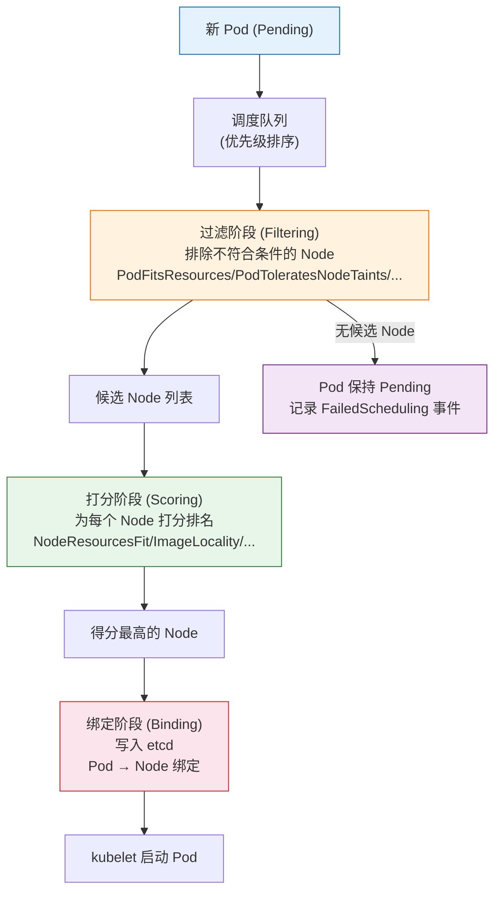
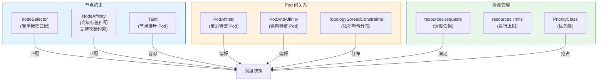
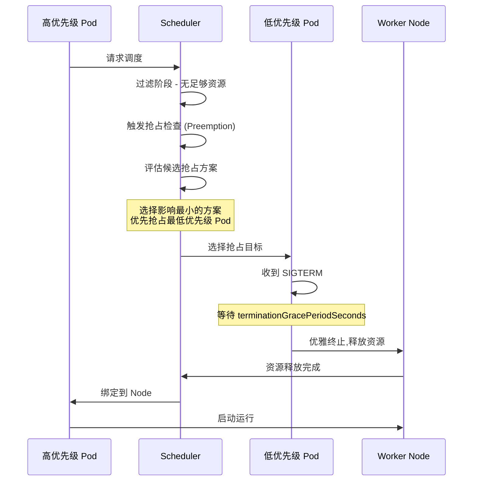

# Kubernetes 调度与编排策略全栈培训

> **适用版本**: Kubernetes v1.28 - v1.32 | **文档类型**: 性能与稳定性专项
> **核心原则**: 资源利用率最大化、业务高可用分布、调度公平性

---

## 演讲概述

### 目标受众

- 架构师：理解调度策略对业务可用性的影响
- SRE 工程师：掌握调度相关故障的排查方法
- 应用运维：合理配置资源请求和调度约束
- 平台工程师：设计多租户环境的调度策略

### 预计时长

| 阶段 | 内容 | 时长 |
|------|------|------|
| 第一阶段 | 调度基础与工作原理 | 30 分钟 |
| 第二阶段 | 高级调度策略 (Affinity/Taint) | 40 分钟 |
| 第三阶段 | 优先级、抢占与重调度 | 30 分钟 |
| 第四阶段 | 资源管理与 QoS 体系 | 25 分钟 |
| 第五阶段 | 实战演示与动手实验 | 35 分钟 |
| 第六阶段 | 性能调优与巡检 | 20 分钟 |
| Q&A | 互动问答 | 15 分钟 |
| **合计** | | **约 3 小时** |

### 核心学习目标

完成本次培训后，学员能够：

1. 描述 kube-scheduler 的过滤-打分-绑定三阶段工作流程
2. 根据业务需求选择合适的调度策略（nodeSelector/Affinity/Taint）
3. 设计跨可用区的高可用部署方案
4. 配置 PriorityClass 实现业务优先级管理
5. 排查 Pod Pending 等调度失败问题
6. 理解 QoS 类别对 Pod 驱逐和调度的影响

### 核心要点

1. 调度器的工作原理：过滤（Filtering）→ 打分（Scoring）→ 绑定（Binding）
2. nodeSelector 是最简单的调度约束，Affinity 是进阶方案
3. 污点与容忍（Taints & Tolerations）实现节点级隔离
4. 反亲和性是防止单点故障的第一道防线
5. 优先级与抢占保证高优先级业务在资源不足时仍可运行
6. 资源 requests 决定调度，limits 决定运行上限

---

## 课程大纲

| 序号 | 章节 | 关键知识点 | 对应演示 |
|------|------|-----------|---------|
| 1 | 调度器工作原理 | 过滤/打分/绑定三阶段 | 演示 1 |
| 2 | nodeSelector 与 nodeName | 简单标签匹配、强制指定 | 演示 2 |
| 3 | 节点亲和性 NodeAffinity | 硬性/软性约束、操作符 | 演示 2 |
| 4 | Pod 亲和/反亲和 | 同节点部署、跨节点分散、跨 AZ 高可用 | 演示 3 |
| 5 | 污点与容忍 | NoSchedule/PreferNoSchedule/NoExecute | 演示 4 |
| 6 | 优先级与抢占 | PriorityClass、抢占流程 | 演示 5 |
| 7 | QoS 与资源管理 | Guaranteed/Burstable/BestEffort | 演示 6 |
| 8 | Descheduler | 重调度策略、负载均衡 | 演示 5 |
| 9 | 调度故障排查 | Pending 原因分析、调试方法 | 演示 7 |

---

## 核心概念讲解

### 调度器做了什么？

Kubernetes 调度器（kube-scheduler）的核心任务是将待调度的 Pod 分配到最合适的 Node 上。这个过程分为三个阶段：

**阶段一：过滤（Filtering）**

排除不符合条件的 Node。过滤条件包括：

| 过滤器 | 说明 | 检查内容 |
|--------|------|---------|
| PodFitsResources | 节点剩余资源是否满足 Pod 的 requests | CPU/Memory 可分配量 |
| PodFitsHostPorts | Pod 需要的 HostPort 是否被占用 | 节点端口占用表 |
| PodMatchNodeSelector | 是否匹配 nodeSelector 和 NodeAffinity | 节点标签 |
| NoDiskConflict | Pod 请求的卷是否与已有 Pod 冲突 | Volume 挂载状态 |
| PodToleratesNodeTaints | Pod 是否容忍节点的污点 | Taint/Toleration 匹配 |
| CheckNodeUnschedulable | 节点是否被标记为不可调度 | Node.Spec.Unschedulable |
| NodeAffinity | 节点是否满足亲和性约束 | 节点标签匹配 |
| InterPodAffinity | Pod 间亲和性是否满足 | 已有 Pod 的拓扑分布 |
| MaxEBSVolumeCount | EBS 卷挂载数量是否超限 | 节点卷数量 |

**阶段二：打分（Scoring）**

对过滤后的候选 Node 进行打分排名：

| 打分器 | 说明 | 权重 | 打分逻辑 |
|--------|------|------|---------|
| NodeResourcesFit | 资源空闲越多分数越高 | 1 | `(capacity - requested) / capacity` |
| NodeResourcesBalancedAllocation | CPU 和内存使用均衡的节点优先 | 1 | 最小化 CPU/内存使用率之差的绝对值 |
| ImageLocality | 节点已有镜像的优先 | 1 | 已有镜像总大小越大分数越高 |
| InterPodAffinity | 满足 Pod 亲和性/反亲和性的优先 | 1 | 匹配的亲和性规则越多分数越高 |
| NodeAffinity | 满足节点亲和性的优先 | 1 | 匹配的偏好越多分数越高 |
| TaintToleration | 污点容忍度匹配越多分数越高 | 1 | 未被容忍的污点越少分数越高 |
| PodTopologySpread | 拓扑分布越均匀分数越高 | 2 | 最小化最大最小副本数之差 |

**阶段三：绑定（Binding）**

将 Pod 绑定到得分最高的 Node，写入 etcd。如果多个 Node 得分相同，则随机选择。

### 基础调度约束

**nodeSelector — 最简单的标签匹配：**

```yaml
apiVersion: v1
kind: Pod
metadata:
  name: ssd-pod
spec:
  nodeSelector:
    disktype: ssd
  containers:
  - name: app
    image: nginx
```

```bash
# 给节点打标签
kubectl label node <node-name> disktype=ssd
# 预期输出: node/<node-name> labeled

# 查看节点标签
kubectl get nodes --show-labels
kubectl describe node <node-name> | grep -A 20 Labels
```

**nodeName — 强制指定节点（绕过调度器）：**

```yaml
apiVersion: v1
kind: Pod
metadata:
  name: fixed-node-pod
spec:
  nodeName: worker-3
  containers:
  - name: app
    image: nginx
```

> **注意**: `nodeName` 完全绕过调度器，生产环境中**严禁滥用**。如果指定的节点不可用，Pod 将永远无法运行。

### 高级调度策略

**节点亲和性 (Node Affinity)：**

比 nodeSelector 更灵活，支持多种操作符和软硬约束：

```yaml
apiVersion: v1
kind: Pod
metadata:
  name: affinity-pod
spec:
  affinity:
    nodeAffinity:
      requiredDuringSchedulingIgnoredDuringExecution:
        nodeSelectorTerms:
        - matchExpressions:
          - key: topology.kubernetes.io/zone
            operator: In
            values:
            - cn-hangzhou-a
            - cn-hangzhou-b
      preferredDuringSchedulingIgnoredDuringExecution:
      - weight: 80
        preference:
          matchExpressions:
          - key: node-type
            operator: In
            values:
            - high-memory
      containers:
      - name: app
        image: nginx
```

**亲和性类型说明：**

| 类型 | 说明 | 行为 |
|------|------|------|
| `requiredDuringSchedulingIgnoredDuringExecution` | 硬性要求，不满足就不调度 | Pod 永远不会调度到不匹配的节点 |
| `preferredDuringSchedulingIgnoredDuringExecution` | 偏好，不满足也可以调度到其他节点 | 调度器会尽量满足，但不保证 |

**操作符说明：**

| 操作符 | 说明 | 示例 |
|--------|------|------|
| `In` | 标签值在列表中 | `zone In [a, b]` → zone=a 或 zone=b |
| `NotIn` | 标签值不在列表中 | `env NotIn [test]` → 非 test 环境 |
| `Exists` | 标签存在（不检查值） | `disktype Exists` → 有 disktype 标签即可 |
| `DoesNotExist` | 标签不存在 | `special DoesNotExist` → 没有特殊标记 |
| `Gt` | 标签值大于指定值（数值比较） | `priority Gt 5` → 优先级 > 5 |
| `Lt` | 标签值小于指定值（数值比较） | `priority Lt 10` → 优先级 < 10 |

**Pod 亲和性与反亲和性：**

```yaml
apiVersion: apps/v1
kind: Deployment
metadata:
  name: web-app
spec:
  replicas: 3
  selector:
    matchLabels:
      app: web
  template:
    metadata:
      labels:
        app: web
    spec:
      affinity:
        podAntiAffinity:
          requiredDuringSchedulingIgnoredDuringExecution:
          - labelSelector:
              matchExpressions:
              - key: app
                operator: In
                values:
                - web
            topologyKey: kubernetes.io/hostname
        podAffinity:
          preferredDuringSchedulingIgnoredDuringExecution:
          - weight: 100
            podAffinityTerm:
              labelSelector:
                matchExpressions:
                - key: app
                  operator: In
                  values:
                  - cache
              topologyKey: kubernetes.io/hostname
      containers:
      - name: web
        image: nginx
```

**Pod 反亲和性的三种策略：**

| 策略 | 效果 | topologyKey | 适用场景 |
|------|------|-------------|---------|
| 同节点反亲和 | 每个 Node 最多一个副本 | `kubernetes.io/hostname` | 防止单点故障 |
| 同可用区反亲和 | 每个 AZ 最多一个副本 | `topology.kubernetes.io/zone` | 跨可用区高可用 |
| 自定义拓扑域 | 按机架/机柜分散 | 自定义 Label | 物理故障域隔离 |

**Pod 拓扑分布约束 (TopologySpreadConstraints)：**

比反亲和性更精细的控制，支持最大偏斜度（maxSkew）：

```yaml
apiVersion: apps/v1
kind: Deployment
metadata:
  name: web-spread
spec:
  replicas: 6
  selector:
    matchLabels:
      app: web-spread
  template:
    metadata:
      labels:
        app: web-spread
    spec:
      topologySpreadConstraints:
      - maxSkew: 1
        topologyKey: topology.kubernetes.io/zone
        whenUnsatisfiable: DoNotSchedule
        labelSelector:
          matchLabels:
            app: web-spread
      - maxSkew: 2
        topologyKey: kubernetes.io/hostname
        whenUnsatisfiable: ScheduleAnyway
        labelSelector:
          matchLabels:
            app: web-spread
      containers:
      - name: web
        image: nginx
```

| 参数 | 说明 |
|------|------|
| `maxSkew` | 最大偏斜度，任意两个拓扑域之间的 Pod 数量差异上限 |
| `whenUnsatisfiable: DoNotSchedule` | 硬性约束，无法满足则不调度 |
| `whenUnsatisfiable: ScheduleAnyway` | 软性约束，尽量满足但不强制 |

### 污点与容忍 (Taints & Tolerations)

**污点 (Taint)**: Node 拒绝 Pod 进来。**容忍 (Toleration)**: Pod 声明可以接受污点。

```bash
# 给节点添加污点
kubectl taint nodes worker-1 dedicated=db:NoSchedule
# 预期输出: node/worker-1 tainted

kubectl taint nodes worker-2 dedicated=db:NoSchedule

# 查看节点污点
kubectl describe node worker-1 | grep Taints
# 预期输出: Taints: dedicated=db:NoSchedule

# 删除污点
kubectl taint nodes worker-1 dedicated=db:NoSchedule-
# 预期输出: node/worker-1 untainted
```

```yaml
apiVersion: v1
kind: Pod
metadata:
  name: db-pod
spec:
  tolerations:
  - key: "dedicated"
    operator: "Equal"
    value: "db"
    effect: "NoSchedule"
  containers:
  - name: postgres
    image: postgres:15
```

**污点效果 (Effect)：**

| Effect | 行为 | 典型场景 |
|--------|------|---------|
| `NoSchedule` | 不调度新 Pod | 专用节点（如 GPU 节点） |
| `PreferNoSchedule` | 尽量不调度（软性） | 临时保护节点资源 |
| `NoExecute` | 不调度新 Pod + 驱逐已有 Pod | 节点故障、维护、磁盘满 |

**内置污点（自动管理）：**

| 污点 | 触发条件 | 说明 |
|------|---------|------|
| `node.kubernetes.io/not-ready` | 节点 NotReady | 默认容忍 300 秒后驱逐 |
| `node.kubernetes.io/unreachable` | 节点不可达 | 默认容忍 300 秒后驱逐 |
| `node.kubernetes.io/memory-pressure` | 内存压力 | 仅影响没有容忍的 Pod |
| `node.kubernetes.io/disk-pressure` | 磁盘压力 | 仅影响没有容忍的 Pod |
| `node.kubernetes.io/network-unavailable` | 网络不可用 | 节点网络未正确配置 |
| `node.kubernetes.io/unschedulable` | 节点被 cordon | 执行 `kubectl cordon` 时添加 |

**容忍的匹配规则：**

| toleration 配置 | 匹配的 Taint | 说明 |
|----------------|-------------|------|
| `key="key", operator="Equal", value="val", effect="NoSchedule"` | `key=val:NoSchedule` | 精确匹配 |
| `key="key", operator="Equal", value="val"` | `key=val:*` | 匹配所有 effect |
| `key="key", operator="Exists"` | `key=*:*` | 只要 key 存在即匹配 |
| `operator="Exists"` | `*:*:*` | 容忍所有污点（危险！） |

### 优先级与抢占 (Priority & Preemption)

当集群资源不足时，高优先级 Pod 可以"抢占"低优先级 Pod 的资源：

```yaml
apiVersion: scheduling.[[entities/kubernetes|k8s]].io/v1
kind: PriorityClass
metadata:
  name: high-priority
value: 1000000
globalDefault: false
description: "核心业务优先级"
preemptionPolicy: PreemptLowerPriority
---
apiVersion: scheduling.k8s.io/v1
kind: PriorityClass
metadata:
  name: low-priority
value: 100
globalDefault: false
description: "非核心业务优先级"
---
apiVersion: v1
kind: Pod
metadata:
  name: critical-pod
spec:
  priorityClassName: high-priority
  containers:
  - name: app
    image: nginx
```

**抢占过程：**

1. 调度器发现资源不足，无法调度高优先级 Pod
2. 查找可以被抢占的低优先级 Pod（预选阶段）
3. 选择影响最小的抢占方案（优先抢占优先级最低的 Pod）
4. 优雅终止被抢占的 Pod（发送 SIGTERM，等待 graceful period）
5. 等待被抢占 Pod 完全终止并释放资源
6. 高优先级 Pod 绑定到释放的节点

**生产环境推荐的 PriorityClass 分级：**

| 名称 | 值 | 适用场景 |
|------|-----|---------|
| `system-cluster-critical` | 2000000000 | kube-system 核心组件 |
| `system-node-critical` | 2000001000 | 节点关键组件（CNI、CSI） |
| `production-critical` | 1000000 | 核心业务（支付、订单） |
| `production-standard` | 900000 | 一般生产业务 |
| `staging` | 500000 | 预发布环境 |
| `development` | 100000 | 开发测试 |
| `batch` | 50000 | 批处理任务 |

### QoS 类别与资源管理

Kubernetes 根据 Pod 的 resources 配置将其分为三个 QoS 级别：

| QoS 类别 | 条件 | 驱逐优先级 | 典型场景 |
|---------|------|-----------|---------|
| **Guaranteed** | requests == limits（CPU 和 Memory 都设置且相等） | 最低（最后被驱逐） | 数据库、核心业务 |
| **Burstable** | 设置了 requests 但不满足 Guaranteed 条件 | 中等 | 一般业务应用 |
| **BestEffort** | 未设置 requests 和 limits | 最高（最先被驱逐） | 批处理、临时任务 |

```yaml
# Guaranteed QoS
resources:
  requests:
    cpu: "1"
    memory: 1Gi
  limits:
    cpu: "1"
    memory: 1Gi

# Burstable QoS
resources:
  requests:
    cpu: 500m
    memory: 512Mi
  limits:
    cpu: "2"
    memory: 2Gi

# BestEffort QoS（不设置 resources）
```

**资源设置的最佳实践：**

| 指标 | requests | limits | 理由 |
|------|----------|--------|------|
| CPU | P99 使用量 | P99 的 1.5-2 倍 | CPU 可压缩，超限只是 Throttle |
| Memory | P99 使用量 + 安全裕量 | 与 requests 相同 | 内存不可压缩，超限会被 OOMKill |

---

## 架构图

### 调度器工作流程



### 调度约束关系图



### 优先级抢占流程



---

## 实战演示步骤

### 演示 1：理解调度器过滤与打分

```bash
# 步骤 1: 查看节点资源和标签
kubectl get nodes -o wide
kubectl describe node <node-1> | grep -A 15 "Capacity"
kubectl describe node <node-1> | grep -A 20 "Allocated resources"

# 预期输出:
# Allocated resources:
#   CPU requests: 1200m (15%)  CPU limits: 2800m (35%)
#   Memory requests: 1Gi (4%)  Memory limits: 3Gi (12%)

# 步骤 2: 查看节点标签（调度依据）
kubectl get nodes --show-labels
# 关注标签:
# kubernetes.io/hostname=node-1
# topology.kubernetes.io/zone=cn-hangzhou-a
# topology.kubernetes.io/region=cn-hangzhou
# node.kubernetes.io/instance-type=ecs.c6.xlarge

# 步骤 3: 创建一个资源请求较大的 Pod
cat <<EOF | kubectl apply -f -
apiVersion: v1
kind: Pod
metadata:
  name: big-pod
spec:
  containers:
  - name: app
    image: nginx
    resources:
      requests:
        cpu: "4"
        memory: 8Gi
      limits:
        cpu: "8"
        memory: 16Gi
EOF

# 步骤 4: 查看 Pod 调度结果
kubectl get pod big-pod -o wide
# 如果集群没有足够资源的节点，Pod 会保持 Pending

kubectl describe pod big-pod | grep -A 10 Events
# 预期输出 (如果 Pending):
# Events:
#   Type     Reason            Age   From               Message
#   Warning  FailedScheduling  5s    default-scheduler  0/3 nodes are available...
#   cpu 4 insufficient on 3 nodes, memory 8Gi insufficient on 2 nodes.
```

### 演示 2：nodeSelector 与 NodeAffinity

```bash
# 步骤 1: 给节点打标签
kubectl label node <node-1> disktype=ssd
kubectl label node <node-2> disktype=hdd
# 预期输出: node/<node-1> labeled

# 步骤 2: 创建使用 nodeSelector 的 Pod
cat <<EOF | kubectl apply -f -
apiVersion: v1
kind: Pod
metadata:
  name: ssd-pod
spec:
  nodeSelector:
    disktype: ssd
  containers:
  - name: app
    image: nginx
    command: ["sleep", "3600"]
EOF

# 步骤 3: 验证调度结果
kubectl get pod ssd-pod -o wide
# 预期输出: ssd-pod   1/1   Running   0   10s   10.244.x.x   <node-1>

# 步骤 4: 使用 NodeAffinity（更灵活）
cat <<EOF | kubectl apply -f -
apiVersion: v1
kind: Pod
metadata:
  name: affinity-demo
spec:
  affinity:
    nodeAffinity:
      requiredDuringSchedulingIgnoredDuringExecution:
        nodeSelectorTerms:
        - matchExpressions:
          - key: topology.kubernetes.io/zone
            operator: In
            values:
            - cn-hangzhou-a
            - cn-hangzhou-b
      preferredDuringSchedulingIgnoredDuringExecution:
      - weight: 80
        preference:
          matchExpressions:
          - key: disktype
            operator: In
            values:
            - ssd
  containers:
  - name: app
    image: nginx
    command: ["sleep", "3600"]
EOF

# 步骤 5: 验证调度到指定可用区的节点
kubectl get pod affinity-demo -o wide
```

### 演示 3：Pod 反亲和性（防单点故障）

```bash
# 步骤 1: 创建强制反亲和的 Deployment
cat <<EOF | kubectl apply -f -
apiVersion: apps/v1
kind: Deployment
metadata:
  name: web-ha
spec:
  replicas: 3
  selector:
    matchLabels:
      app: web-ha
  template:
    metadata:
      labels:
        app: web-ha
    spec:
      affinity:
        podAntiAffinity:
          requiredDuringSchedulingIgnoredDuringExecution:
          - labelSelector:
              matchExpressions:
              - key: app
                operator: In
                values:
                - web-ha
            topologyKey: kubernetes.io/hostname
      containers:
      - name: nginx
        image: nginx
EOF

# 步骤 2: 验证每个 Pod 在不同节点
kubectl get pods -l app=web-ha -o wide
# 预期输出: 每个 Pod 在不同的 Node 上
# NAME                       READY   STATUS    RESTARTS   AGE   IP           NODE
# web-ha-xxxx-aaa            1/1     Running   0          30s   10.244.1.x   node-1
# web-ha-xxxx-bbb            1/1     Running   0          30s   10.244.2.x   node-2
# web-ha-xxxx-ccc            1/1     Running   0          30s   10.244.3.x   node-3

# 步骤 3: 如果副本数 > 节点数，多余 Pod 会 Pending
kubectl scale deployment web-ha --replicas=5
kubectl get pods -l app=web-ha -o wide
# 预期: 3 个 Running，2 个 Pending（因为只有 3 个节点）
```

### 演示 4：污点与容忍（专用节点）

```bash
# 步骤 1: 为数据库创建专用节点
kubectl taint nodes <node-name> dedicated=db:NoSchedule
# 预期输出: node/<node-name> tainted

kubectl label nodes <node-name> dedicated=db
# 预期输出: node/<node-name> labeled

# 步骤 2: 部署数据库（带容忍）
cat <<EOF | kubectl apply -f -
apiVersion: apps/v1
kind: StatefulSet
metadata:
  name: postgres
spec:
  replicas: 1
  selector:
    matchLabels:
      app: postgres
  template:
    metadata:
      labels:
        app: postgres
    spec:
      tolerations:
      - key: "dedicated"
        operator: "Equal"
        value: "db"
        effect: "NoSchedule"
      nodeSelector:
        dedicated: db
      containers:
      - name: postgres
        image: postgres:15
        env:
        - name: POSTGRES_PASSWORD
          value: "testpassword"
        resources:
          requests:
            cpu: "1"
            memory: 2Gi
          limits:
            cpu: "2"
            memory: 4Gi
EOF

# 步骤 3: 验证调度到专用节点
kubectl get pods -l app=postgres -o wide
# 预期输出: postgres-0 在带有 dedicated=db 污点的节点上

# 步骤 4: 尝试部署不带容忍的 Pod（应该无法调度）
cat <<EOF | kubectl apply -f -
apiVersion: v1
kind: Pod
metadata:
  name: no-tolerations-pod
spec:
  nodeSelector:
    dedicated: db
  containers:
  - name: app
    image: nginx
    command: ["sleep", "3600"]
EOF

kubectl get pod no-tolerations-pod
# 预期: Pending（因为不容忍 dedicated=db:NoSchedule 污点）

kubectl describe pod no-tolerations-pod | grep -A 5 Events
# 预期: 0/1 nodes are available: 1 node(s) had taint {dedicated: db}, that the pod didn't tolerate.
```

### 演示 5：优先级与抢占

```bash
# 步骤 1: 创建 PriorityClass
cat <<EOF | kubectl apply -f -
apiVersion: scheduling.k8s.io/v1
kind: PriorityClass
metadata:
  name: critical
value: 1000000
globalDefault: false
preemptionPolicy: PreemptLowerPriority
description: "Critical workloads"
---
apiVersion: scheduling.k8s.io/v1
kind: PriorityClass
metadata:
  name: batch
value: 100
globalDefault: false
description: "Batch workloads"
EOF

# 步骤 2: 部署低优先级任务（填满集群资源）
cat <<EOF | kubectl apply -f -
apiVersion: batch/v1
kind: Job
metadata:
  name: low-priority-job
spec:
  template:
    spec:
      priorityClassName: batch
      containers:
      - name: work
        image: busybox
        command: ["sleep", "3600"]
        resources:
          requests:
            cpu: "1"
            memory: 1Gi
      restartPolicy: Never
EOF

# 步骤 3: 部署高优先级 Pod（触发抢占）
cat <<EOF | kubectl apply -f -
apiVersion: v1
kind: Pod
metadata:
  name: critical-pod
spec:
  priorityClassName: critical
  containers:
  - name: app
    image: nginx
    resources:
      requests:
        cpu: "1"
        memory: 1Gi
EOF

# 步骤 4: 观察抢占过程
kubectl get events --sort-by=.lastTimestamp | grep -i preempt
# 预期输出:
# Normal  Preempted  5s  default-scheduler  Preempted default/low-priority-job-xxx by default/critical-pod

# 步骤 5: 验证结果
kubectl get pods -o wide
# critical-pod 应该是 Running，low-priority-job 的 Pod 被终止
```

### 演示 6：QoS 类别验证

```bash
# 创建三种 QoS 的 Pod
cat <<EOF | kubectl apply -f -
apiVersion: v1
kind: Pod
metadata:
  name: guaranteed-pod
spec:
  containers:
  - name: app
    image: nginx
    resources:
      requests:
        cpu: "1"
        memory: 1Gi
      limits:
        cpu: "1"
        memory: 1Gi
---
apiVersion: v1
kind: Pod
metadata:
  name: burstable-pod
spec:
  containers:
  - name: app
    image: nginx
    resources:
      requests:
        cpu: 500m
        memory: 512Mi
      limits:
        cpu: "1"
        memory: 1Gi
---
apiVersion: v1
kind: Pod
metadata:
  name: besteffort-pod
spec:
  containers:
  - name: app
    image: nginx
EOF

# 查看 QoS 类别
kubectl get pod guaranteed-pod -o jsonpath='{.status.qosClass}'
# 预期输出: Guaranteed

kubectl get pod burstable-pod -o jsonpath='{.status.qosClass}'
# 预期输出: Burstable

kubectl get pod besteffort-pod -o jsonpath='{.status.qosClass}'
# 预期输出: BestEffort
```

### 演示 7：调度器性能监控

```bash
# 查看调度器指标
kubectl -n kube-system exec -it kube-scheduler-<master> -- \
  wget -qO- http://localhost:10259/metrics 2>/dev/null | grep scheduler_

# 关键指标:
# scheduler_schedule_attempts_total           调度尝试次数（按 result: scheduled/unschedulable/error）
# scheduler_scheduling_algorithm_duration_seconds  调度算法耗时
# scheduler_pending_pods                      等待调度的 Pod 数量（按 reason 分组）
# scheduler_preemption_attempts_total         抢占尝试次数

# 查看调度器日志
kubectl logs -n kube-system kube-scheduler-<master> --tail=50

# 查看当前 Pending 的 Pod
kubectl get pods -A --field-selector status.phase=Pending
```

---

## 动手实验

### 实验 1：构建跨可用区高可用部署

**目标**：使用 TopologySpreadConstraints 实现均匀跨 AZ 分布

```bash
# 1. 给节点打可用区标签（如果还没有）
kubectl label node <node-1> topology.kubernetes.io/zone=cn-hangzhou-a
kubectl label node <node-2> topology.kubernetes.io/zone=cn-hangzhou-b
kubectl label node <node-3> topology.kubernetes.io/zone=cn-hangzhou-c

# 2. 创建使用拓扑分布约束的 Deployment
cat <<EOF | kubectl apply -f -
apiVersion: apps/v1
kind: Deployment
metadata:
  name: ha-deployment
spec:
  replicas: 6
  selector:
    matchLabels:
      app: ha-app
  template:
    metadata:
      labels:
        app: ha-app
    spec:
      topologySpreadConstraints:
      - maxSkew: 1
        topologyKey: topology.kubernetes.io/zone
        whenUnsatisfiable: DoNotSchedule
        labelSelector:
          matchLabels:
            app: ha-app
      containers:
      - name: nginx
        image: nginx
EOF

# 3. 验证每个 AZ 的 Pod 分布
kubectl get pods -l app=ha-app -o wide --no-headers | awk '{print $7}' | sort | uniq -c
# 预期: 每个 AZ 各 2 个 Pod

# 4. 模拟一个 AZ 故障（cordon 该 AZ 的所有节点）
kubectl cordon <node-1>

# 5. 观察 Pod 重调度
kubectl get pods -l app=ha-app -o wide -w
```

### 实验 2：调度失败排查演练

**目标**：模拟多种调度失败场景并排查

```bash
# 场景 1: 资源不足
cat <<EOF | kubectl apply -f -
apiVersion: v1
kind: Pod
metadata:
  name: too-big-pod
spec:
  containers:
  - name: app
    image: nginx
    resources:
      requests:
        cpu: "100"
        memory: 1000Gi
EOF
kubectl describe pod too-big-pod | grep -A 5 Events
# 预期: Insufficient cpu, Insufficient memory
kubectl delete pod too-big-pod --force --grace-period=0

# 场景 2: nodeSelector 不匹配
cat <<EOF | kubectl apply -f -
apiVersion: v1
kind: Pod
metadata:
  name: no-match-pod
spec:
  nodeSelector:
    non-existent-label: "true"
  containers:
  - name: app
    image: nginx
EOF
kubectl describe pod no-match-pod | grep -A 5 Events
# 预期: Node didn't match Pod's node affinity/selector
kubectl delete pod no-match-pod --force --grace-period=0

# 场景 3: PVC 无法挂载
cat <<EOF | kubectl apply -f -
apiVersion: v1
kind: Pod
metadata:
  name: pvc-pod
spec:
  containers:
  - name: app
    image: nginx
    volumeMounts:
    - name: data
      mountPath: /data
  volumes:
  - name: data
    persistentVolumeClaim:
      claimName: non-existent-pvc
EOF
kubectl describe pod pvc-pod | grep -A 5 Events
# 预期: persistentvolumeclaim "non-existent-pvc" not found
kubectl delete pod pvc-pod --force --grace-period=0
```

---

## 常见问题与回答

### Q1: 为什么 Pod 一直处于 Pending 状态？

**回答**: Pod Pending 意味着调度器无法为其找到合适的 Node。排查步骤：(1) `kubectl describe pod <name>` 查看 Events；(2) 常见原因：资源不足（CPU/Memory requests 超过所有节点剩余）、PVC 无法挂载、nodeSelector/Affinity 不匹配任何节点、所有节点都有不可容忍的 Taint。最常见的原因是资源 requests 过大。可以用 `kubectl describe node <name>` 查看节点的 Allocatable 和已分配资源。

### Q2: 反亲和性会不会导致 Pod 无法调度？

**回答**: 会。如果使用 `requiredDuringSchedulingIgnoredDuringExecution`（硬性反亲和），当副本数超过节点数时，多余的 Pod 将无法调度。解决方案：(1) 使用 `preferredDuringSchedulingIgnoredDuringExecution`（软性反亲和），不满足也能调度；(2) 确保集群有足够的节点容纳所有副本；(3) 配合集群自动扩缩（Cluster Autoscaler）；(4) 使用 TopologySpreadConstraints 替代反亲和性，控制更精细。

### Q3: 资源的 requests 和 limits 应该如何设置？

**回答**: requests 决定调度，limits 决定运行上限。最佳实践：(1) **requests 设置为 P99 使用量**（确保调度到有足够资源的节点）；(2) **limits 设置为 requests 的 1.5-2 倍**（允许突发流量）；(3) 关键业务使用 Guaranteed QoS（requests == limits）。监控 `resource_request` 和 `resource_usage` 的差距，差距越大说明资源浪费越严重。内存的 limits 不建议设置过大，因为内存是不可压缩资源，超限会被 OOMKill。

### Q4: 如何实现跨可用区高可用部署？

**回答**: 使用 Pod 反亲和性或 TopologySpreadConstraints 配合 topology key：(1) `requiredDuringSchedulingIgnoredDuringExecution` + `topology.kubernetes.io/zone`：强制跨 AZ 分散；(2) TopologySpreadConstraints + `maxSkew: 1`：更均匀的分布；(3) 结合 Pod Disruption Budget（PDB）限制同时不可用的 Pod 数量；(4) 确保每个 AZ 有足够的节点资源；(5) 使用拓扑感知的 Service 流量路由（Topology Aware Routing）。

### Q5: Descheduler 是什么？什么时候需要？

**回答**: Descheduler 是一个重调度工具，解决集群长时间运行后的负载不均问题。调度器只在 Pod 创建时做一次调度决策，不会因为后续的资源变化而重新调度已有 Pod。Descheduler 定期检查并根据策略驱逐不平衡的 Pod（如节点资源使用率差异过大、违反反亲和性、Pod 拓扑分布不均等）。推荐在 100+ 节点的集群中部署。支持的策略：RemoveDuplicates、LowNodeUtilization、HighNodeUtilization、RemovePodsViolatingAntiAffinity 等。

### Q6: 如何调试调度失败的原因？

**回答**: (1) `kubectl describe pod <name>` 查看 Events 中的调度失败原因；(2) `kubectl get events --field-selector involvedObject.name=<pod-name>`；(3) 查看调度器日志：`kubectl logs -n kube-system kube-scheduler-<master>`；(4) 使用 `kubectl debug` 创建调试 Pod 检查节点状态；(5) 检查 `kubectl describe node <name>` 中的 Allocatable 和 Allocated resources；(6) 使用 `kubectl get pods -A --field-selector status.phase=Pending` 批量查看 Pending Pod。

### Q7: 如何实现"尽量在同一节点"的亲和调度？

**回答**: 使用 `podAffinity` + `preferredDuringSchedulingIgnoredDuringExecution`。例如 Web 服务和缓存服务放在同一节点以减少网络延迟：

```yaml
affinity:
  podAffinity:
    preferredDuringSchedulingIgnoredDuringExecution:
    - weight: 100
      podAffinityTerm:
        labelSelector:
          matchLabels:
            app: cache
        topologyKey: kubernetes.io/hostname
```

注意使用 `preferred` 而非 `required`，因为硬性约束可能导致调度失败。

### Q8: 调度器的性能瓶颈在哪里？

**回答**: 在大规模集群（5000+ 节点、150000+ Pod）中，调度器的瓶颈在：(1) 过滤阶段的 Node 数量（O(n) 遍历所有节点）；(2) 打分阶段的计算复杂度（每个 Node 执行所有打分器）；(3) 绑定阶段的 API Server 写入延迟。Kubernetes 通过调度缓存（Scheduler Cache）和绑定速率限制来优化。v1.27+ 引入了 Scheduling Framework，允许通过插件扩展调度逻辑。建议开启 `percentageOfNodesToScore` 参数，在大规模集群中只对部分节点打分。

### Q9: 如何处理节点维护期间的调度？

**回答**: (1) `kubectl cordon <node>`：标记节点为不可调度，新 Pod 不会被调度到该节点，已有 Pod 不受影响；(2) `kubectl drain <node> --ignore-daemonsets --delete-emptydir-data`：驱逐节点上的所有 Pod（DaemonSet 和 emptyDir 除外）；(3) 被驱逐的 Pod 由 Deployment/ReplicaSet 控制器在其他节点重建；(4) 确保配置了 PodDisruptionBudget（PDB）限制同时驱逐的数量；(5) 维护完成后 `kubectl uncordon <node>` 恢复调度。

### Q10: 如何监控调度器的健康状况？

**回答**: 关键指标：`scheduler_schedule_attempts_total{result="error"}`（调度错误率）、`scheduler_scheduling_algorithm_duration_seconds`（调度耗时，P99 应 < 100ms）、`scheduler_pending_pods`（Pending Pod 数量，持续增长需要关注）、`scheduler_preemption_attempts_total`（抢占频率过高需要关注告警）。建议在 Grafana 中创建调度器专用面板。

---

## 要点总结

### 调度策略速查表

| 需求 | 方案 | 复杂度 | 生产推荐 |
|------|------|--------|---------|
| 指定节点标签 | nodeSelector | 低 | 简单场景 |
| 灵活的节点匹配 | NodeAffinity | 中 | 推荐 |
| 节点隔离/专用 | Taints & Tolerations | 中 | 推荐 |
| 防止单点故障 | PodAntiAffinity | 中 | 必须 |
| 跨可用区分散 | TopologySpreadConstraints | 高 | 推荐 |
| 亲近相关服务 | PodAffinity | 中 | 按需 |
| 资源不足时保证 | PriorityClass + Preemption | 高 | 必须 |
| 长期负载均衡 | Descheduler | 高 | 大集群推荐 |

### 资源配置速查表

| 应用类型 | CPU requests | CPU limits | Memory requests | Memory limits | QoS |
|---------|-------------|------------|----------------|--------------|-----|
| 核心业务 | P99 | P99 × 2 | P99 × 1.2 | = requests | Guaranteed |
| 一般业务 | P99 | P99 × 2 | P99 × 1.2 | requests × 2 | Burstable |
| 批处理 | 平均值 | P99 × 2 | 平均值 × 1.5 | 平均值 × 3 | Burstable |
| 开发测试 | 100m | 500m | 128Mi | 512Mi | Burstable |

### SRE 运维红线

| 红线 | 说明 | 违反后果 |
|------|------|---------|
| **红线 1** | 生产环境必须配置反亲和性 | 单节点故障导致服务完全不可用 |
| **红线 2** | 严禁滥用 `nodeName` 绕过调度器 | 调度器无法管理，资源分配失控 |
| **红线 3** | 必须监控分配率 vs 使用率的差距 | 资源浪费严重，成本失控 |
| **红线 4** | 关键业务必须配置 PriorityClass | 资源不足时关键业务可能被抢占 |
| **红线 5** | 所有 Pod 必须配置 resources requests | 调度器无法做出正确决策 |
| **红线 6** | 跨 AZ 部署必须使用拓扑约束 | AZ 故障导致服务全部不可用 |
| **红线 7** | 生产环境严禁使用 BestEffort QoS | 资源不足时最先被驱逐 |

---

## 延伸阅读

### 官方文档

| 资源 | 链接 | 说明 |
|------|------|------|
| Kubernetes 调度 | https://kubernetes.io/docs/concepts/scheduling-eviction/ | 调度概念 |
| Pod Overhead | https://kubernetes.io/docs/concepts/scheduling-eviction/pod-overhead/ | 容器运行时开销 |
| Scheduling Framework | https://kubernetes.io/docs/concepts/scheduling-eviction/scheduling-framework/ | 调度框架 |
| Descheduler | https://github.com/kubernetes-sigs/descheduler | 重调度器 |
| Pod 拓扑分布 | https://kubernetes.io/docs/concepts/scheduling-eviction/topology-spread-constraints/ | 拓扑约束 |

### 关联培训专题

- `kubernetes-architecture-fundamentals-presentation.md` — 控制平面与调度器的关系
- `kubernetes-workload-presentation.md` — Deployment/StatefulSet 的调度需求
- `kubernetes-troubleshooting-methodology-presentation.md` — 调度失败排障
- `kubernetes-storage-presentation.md` — 存储拓扑感知调度
- `kubernetes-observability-presentation.md` — 调度器指标监控

---

> **Kusheet Project** | 作者: Allen Galler (allengaller@gmail.com)
