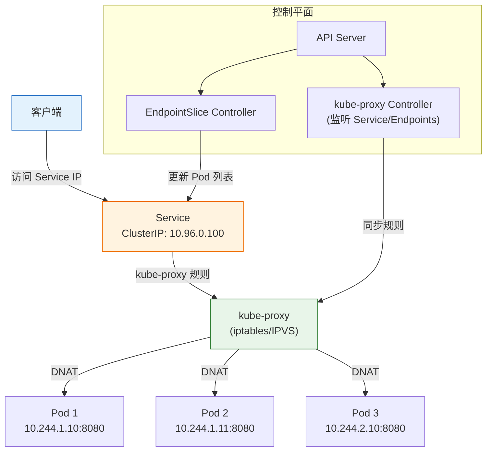
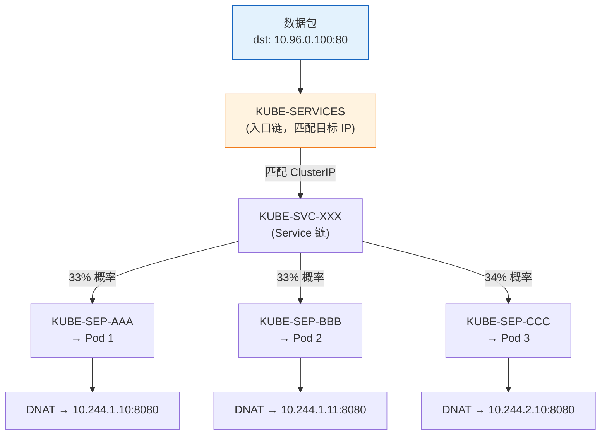
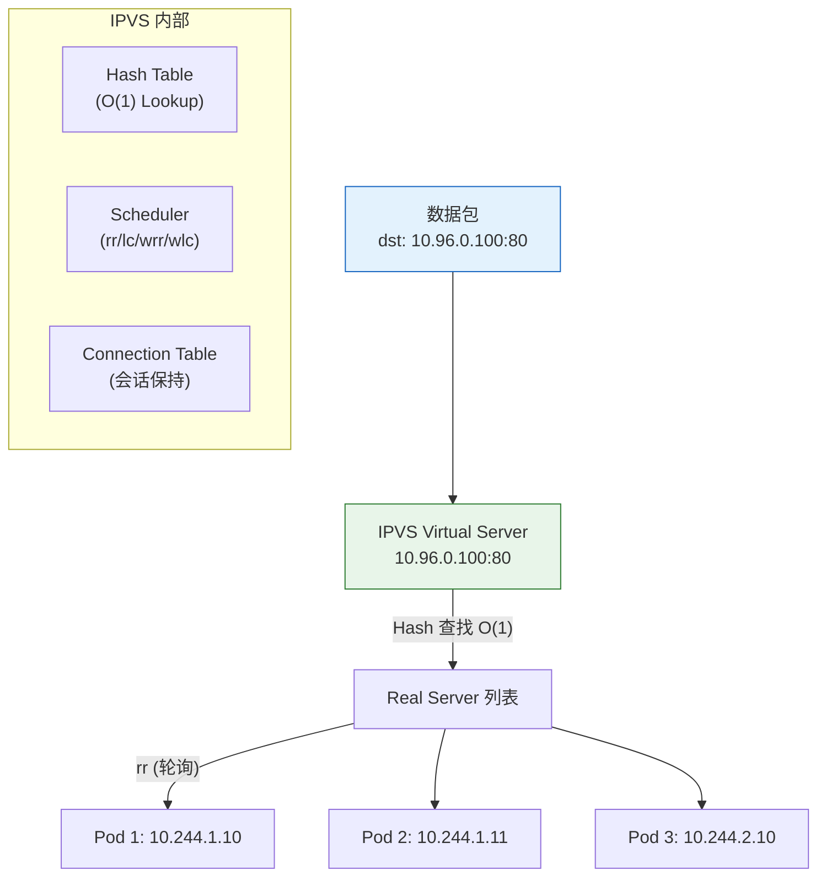

# Kubernetes Service 全栈进阶培训 (从入门到专家)

> **适用版本**: Kubernetes v1.28 - v1.32 | **文档类型**: 全栈技术实战指南
> **核心原则**: 理解服务发现本质、掌握内核转发逻辑、解决大规模网络瓶颈

---

## 演讲概述

### 目标受众

- 初级运维：理解 Service 的核心概念和四种类型
- 网络架构师：深入 kube-proxy 转发机制和性能优化
- SRE 工程师：Service 故障排查与高可用设计
- 应用开发者：理解 Service DNS 和服务发现机制

### 预计时长

| 阶段 | 内容 | 时长 |
|------|------|------|
| 第一阶段 | Service 基础概念与四种类型 | 30 分钟 |
| 第二阶段 | kube-proxy iptables/IPVS 转发原理 | 40 分钟 |
| 第三阶段 | 高级特性（Headless/EndpointSlice/拓扑路由） | 30 分钟 |
| 第四阶段 | 实战演示与动手实验 | 35 分钟 |
| 第五阶段 | 故障排查与 SRE 运维 | 25 分钟 |
| Q&A | 互动问答 | 15 分钟 |
| **合计** | | **约 3 小时** |

### 核心学习目标

完成本次培训后，学员能够：

1. 解释 Service 解决的核心问题和四种类型的适用场景
2. 描述 kube-proxy iptables 和 IPVS 模式的转发流程和性能差异
3. 配置 Headless Service + StatefulSet 实现精确的 Pod 寻址
4. 使用 EndpointSlice 解决大规模 Service 的性能问题
5. 排查 Service 访问不通的常见问题
6. 选择合适的 ExternalTrafficPolicy 策略

### 核心要点

1. Service 为动态变化的 Pod 提供稳定的访问入口
2. 四种 Service 类型各有适用场景
3. kube-proxy 的 iptables 模式和 IPVS 模式的性能差异
4. EndpointSlice 解决大规模集群的性能问题
5. Headless Service 为 StatefulSet 提供精确的 Pod 寻址
6. 生产环境必须使用 IPVS 模式

---

## 课程大纲

| 序号 | 章节 | 关键知识点 | 时长 |
|------|------|-----------|------|
| 1 | 为什么需要 Service | Pod IP 动态性、负载均衡、服务发现 | 10min |
| 2 | 四种 Service 类型 | ClusterIP/NodePort/LoadBalancer/ExternalName | 20min |
| 3 | Service 工作原理 | Label Selector、Endpoints、kube-proxy | 15min |
| 4 | kube-proxy iptables | 规则链、DNAT、随机选择 | 15min |
| 5 | kube-proxy IPVS | 哈希查找、调度算法、连接保持 | 15min |
| 6 | EndpointSlice | 分片存储、大规模优化 | 10min |
| 7 | Headless Service | 无 ClusterIP、StatefulSet 配合 | 10min |
| 8 | ExternalTrafficPolicy | 源 IP 保持、SNAT、跨节点转发 | 10min |
| 9 | 实战演示 | 完整部署和测试 | 35min |

---

## 核心概念讲解

### 为什么需要 Service？

在 Kubernetes 中，Pod 是短暂的——它们会被创建、销毁、重新调度。每次重建后 Pod 的 IP 都会变化。如果客户端直接使用 Pod IP 访问服务，当 Pod 重建后连接就会断开。

**Service 解决的核心问题：**

| 问题 | Service 的解决方案 | 实现机制 |
|------|------------------|---------|
| Pod IP 动态变化 | 提供固定的 ClusterIP（虚拟 IP） | kube-proxy 维护 DNAT 规则 |
| 多个 Pod 副本如何负载均衡 | 自动分发流量到后端 Pod | iptables 随机/IPVS 调度算法 |
| 客户端如何找到 Pod | 通过 DNS 名称访问（CoreDNS） | CoreDNS 解析 Service 名称 |
| 外部如何访问集群内服务 | 通过 NodePort / LoadBalancer / Ingress | 节点端口映射/云商 LB |

**工作原理：**

```
客户端 → Service (ClusterIP:10.96.0.100) → Label Selector 筛选 Pod → 自动维护 Endpoints → 负载分发到后端 Pod

详细流程:
1. 用户创建 Service，指定 selector: app=my-app
2. EndpointSlice Controller 监听 Pod 变化，自动更新 Endpoints
3. kube-proxy 监听 Service/Endpoints 变化，更新 iptables/IPVS 规则
4. CoreDNS 监听 Service 变化，更新 DNS 记录
5. 客户端通过 DNS 解析 Service 名称获得 ClusterIP
6. 数据包到达 ClusterIP，被 kube-proxy 规则 DNAT 到 Pod IP
```

**Service 与 Pod 的关系：**

```
apiVersion: v1
kind: Service
metadata:
  name: my-service
spec:
  selector:           # ← 通过 Label 匹配 Pod
    app: my-app
  ports:
  - port: 80          # Service 端口
    targetPort: 8080  # Pod 容器端口
```

Service 通过 Label Selector 自动发现匹配的 Pod，并维护一个 Endpoints 列表。当 Pod 增减时，Endpoints 自动更新。

### 四种 Service 类型

**ClusterIP（默认）**

```yaml
apiVersion: v1
kind: Service
metadata:
  name: my-service
spec:
  type: ClusterIP
  selector:
    app: my-app
  ports:
  - protocol: TCP
    port: 80
    targetPort: 8080
```

- 分配集群内部虚拟 IP（从 service-cluster-ip-range 分配）
- 仅集群内部可访问
- DNS 名称：`my-service.<namespace>.svc.cluster.local`
- 适用场景：内部服务间调用

**NodePort**

```yaml
apiVersion: v1
kind: Service
metadata:
  name: my-nodeport-service
spec:
  type: NodePort
  selector:
    app: my-app
  ports:
  - protocol: TCP
    port: 80
    targetPort: 8080
    nodePort: 30080
```

- 在 ClusterIP 基础上，在每个节点上开放一个端口（30000-32767）
- 外部可以通过 `<NodeIP>:<NodePort>` 访问
- 适用场景：测试环境、临时外部访问
- 生产环境不推荐（端口管理混乱、无 TLS 终结）

**LoadBalancer**

```yaml
apiVersion: v1
kind: Service
metadata:
  name: my-lb-service
  annotations:
    service.beta.kubernetes.io/alibaba-cloud-loadbalancer-spec: slb.s2.medium
spec:
  type: LoadBalancer
  selector:
    app: my-app
  ports:
  - protocol: TCP
    port: 80
    targetPort: 8080
```

- 在 NodePort 基础上，向云商申请一个外部负载均衡器
- 自动创建外部 LB 并配置健康检查
- 适用场景：生产环境需要外部访问的服务
- 成本：每个 Service 一个 LB

**ExternalName**

```yaml
apiVersion: v1
kind: Service
metadata:
  name: external-db
spec:
  type: ExternalName
  externalName: db.production.internal.example.com
```

- 返回 CNAME 记录，不做代理转发
- 集群内应用通过 `external-db` 访问外部数据库
- 适用场景：集群内服务引用外部服务（如 RDS）

### Service 类型对比

| 维度 | ClusterIP | NodePort | LoadBalancer | ExternalName |
|------|-----------|----------|-------------|-------------|
| 集群内访问 | 是 | 是 | 是 | 是（DNS CNAME） |
| 集群外访问 | 否 | 是 | 是 | 否 |
| 负载均衡 | kube-proxy | kube-proxy | 外部 LB + kube-proxy | 无 |
| 端口管理 | 自动 | 手动指定或自动 | 自动 | 无 |
| 成本 | 无 | 无 | 云商 LB 费用 | 无 |
| 生产推荐 | 内部服务 | 不推荐 | 单服务暴露 | 外部引用 |

### kube-proxy 转发模式

kube-proxy 是 Service 实现的数据平面组件，负责将到达 Service IP 的流量转发到后端 Pod。

**iptables 模式：**

```
客户端请求 (dst: 10.96.0.100:80)
    ↓
iptables KUBE-SERVICES 链 (PREROUTING/OUTPUT)
    ↓
匹配目标 ClusterIP → KUBE-SVC-XXX 链
    ↓
随机概率选择后端 Pod → KUBE-SEP-XXX 链
    ↓
DNAT (目标地址转换) 到 Pod IP:Port
    ↓
数据包发送到 Pod
```

**iptables 规则示例：**

```bash
# 查看 Service 链
sudo iptables -t nat -L KUBE-SERVICES -n
# KUBE-SVC-XXXX  tcp  --  0.0.0.0/0  10.96.0.100  tcp dpt:80

# 查看 Service 对应的后端链
sudo iptables -t nat -L KUBE-SVC-XXXX -n
# 33% probability → KUBE-SEP-AAAA
# 33% probability → KUBE-SEP-BBBB
# 34% probability → KUBE-SEP-CCCC

# 查看后端 Pod DNAT 规则
sudo iptables -t nat -L KUBE-SEP-AAAA -n
# DNAT to: 10.244.1.10:8080
```

- 线性查找，O(n) 复杂度
- 规则数 = Service 数 × Pod 数
- 1000+ Service 时性能显著下降
- 负载均衡方式：随机概率

**IPVS 模式（推荐）：**

```
客户端请求 (dst: 10.96.0.100:80)
    ↓
IPVS 虚拟服务器 (Virtual Server)
    ↓
哈希表查找后端 Pod (O(1) 复杂度)
    ↓
DNAT 到 Pod IP:Port
    ↓
数据包发送到 Pod
```

- 哈希查找，O(1) 复杂度
- 支持多种调度算法：rr（轮询）、lc（最少连接）、wrr（加权轮询）、wlc（加权最少连接）
- 性能不受 Service 数量影响
- 支持连接保持（Session Affinity at L4）

**性能对比：**

| 维度 | iptables | IPVS |
|------|---------|------|
| 查找复杂度 | O(n) 线性 | O(1) 哈希 |
| 1000 Service 延迟 | ~5ms | < 1ms |
| 10000 Service 延迟 | ~50ms | < 1ms |
| 50000 Service 延迟 | ~500ms | < 1ms |
| 负载均衡算法 | 随机概率 | rr/lc/wrr/wlc/sh/dh... |
| 连接保持 | 不支持 | 支持 |
| 推荐 | 小规模集群 | **所有生产环境** |

### EndpointSlice

传统 Endpoints 对象将所有后端 Pod IP 存储在单个资源中。在大规模集群中（10000+ Service，每个 Service 有数百个 Pod），这会导致：

1. 单个 Endpoints 对象过大（超过 1MB etcd 限制）
2. 任何 Pod 变更都触发整个 Endpoints 对象的更新
3. 所有节点同时收到更新，造成网络风暴

**EndpointSlice 的改进：**

- 将后端 Pod 分片存储，每个 Slice 最多 100 个地址
- 更新时只传输变化的 Slice
- 减少 API Server 和网络压力

```yaml
apiVersion: discovery.[[entities/kubernetes.md|k8s]].io/v1
kind: EndpointSlice
metadata:
  name: my-service-abc
  labels:
    kubernetes.io/service-name: my-service
addressType: IPv4
endpoints:
- addresses:
  - 10.244.1.10
  conditions:
    ready: true
  targetRef:
    kind: Pod
    name: my-app-xxx1
- addresses:
  - 10.244.1.11
  conditions:
    ready: true
  targetRef:
    kind: Pod
    name: my-app-xxx2
ports:
- name: http
  port: 8080
  protocol: TCP
```

**Endpoints vs EndpointSlice 对比：**

| 维度 | Endpoints | EndpointSlice |
|------|-----------|---------------|
| 存储方式 | 单个对象，所有 IP | 分片存储，每片 100 个 |
| 更新效率 | 全量更新 | 增量更新 |
| etcd 限制 | 1000 个地址 | 无限制 |
| 大规模性能 | 差 | 好 |
| Kubernetes 默认 | v1.21 之前 | v1.21+ 默认 |

### Headless Service

```yaml
apiVersion: v1
kind: Service
metadata:
  name: headless-service
spec:
  clusterIP: None
  selector:
    app: stateful-app
  ports:
  - port: 5432
    targetPort: 5432
```

- 不分配 ClusterIP
- DNS 查询直接返回所有 Pod IP（而非 Service IP）
- 与 StatefulSet 配合使用，每个 Pod 有稳定的 DNS 名称
- 适用场景：数据库集群（需要精确知道每个 Pod 的地址）

**StatefulSet + Headless Service 的 DNS 规则：**

```
<pod-name>.<service-name>.<namespace>.svc.cluster.local
```

例如：
```
postgres-0.postgres-service.production.svc.cluster.local → 10.244.1.10
postgres-1.postgres-service.production.svc.cluster.local → 10.244.2.20
postgres-2.postgres-service.production.svc.cluster.local → 10.244.3.30
```

**Headless Service DNS 查询对比：**

| 查询 | 普通 Service | Headless Service |
|------|------------|-----------------|
| `my-service.default.svc.cluster.local` | 返回 ClusterIP (10.96.0.100) | 返回所有 Pod IP (10.244.1.10, 10.244.2.20, ...) |
| `pod-0.my-service.default.svc.cluster.local` | 不支持 | 返回特定 Pod IP |

### ExternalTrafficPolicy

| 策略 | 行为 | 源 IP | 网络跳转 | 适用场景 |
|------|------|-------|---------|---------|
| `Cluster`（默认） | 可转发到任意节点的 Pod | 丢失（SNAT） | 可能跨节点 | 通用 |
| `Local` | 仅转发到本节点的 Pod | 保留 | 无跨节点 | 需要真实客户端 IP |

```yaml
apiVersion: v1
kind: Service
metadata:
  name: preserve-source-ip
spec:
  type: LoadBalancer
  externalTrafficPolicy: Local
  selector:
    app: my-app
  ports:
  - port: 80
    targetPort: 8080
```

**Cluster 模式的流量路径：**

```
客户端 → LB → Node A → SNAT → kube-proxy → 转发到 Node B 的 Pod
                                        ↑ 丢失源 IP（被替换为 Node A 的 IP）
```

**Local 模式的流量路径：**

```
客户端 → LB → Node A → kube-proxy → 转发到 Node A 本地的 Pod
                                    ↑ 保留源 IP
注意: 如果 Node A 上没有 Pod，LB 健康检查会失败，不会转发到 Node A
```

---

## 架构图

### Service 流量转发路径



### iptables 转发链路



### IPVS 转发架构



---

## 实战演示步骤

### 演示 1：Service 类型实践

> ⚠️ **🟡 中危变更** — 变更集群资源状态，建议先 --dry-run 或 diff 确认
> - `kubectl apply/create/replace`：创建/变更集群资源

```bash
# 步骤 1: 创建 Deployment
kubectl create deployment demo-app --image=nginx --replicas=3
# 预期输出: deployment.apps/demo-app created

# 步骤 2: 创建 ClusterIP Service
kubectl expose deployment demo-app --port=80 --target-port=80 --type=ClusterIP --name=demo-clusterip
# 预期输出: service/demo-clusterip exposed

# 步骤 3: 查看 Service 和 Endpoints
kubectl get svc demo-clusterip
# 预期输出:
# NAME              TYPE        CLUSTER-IP       EXTERNAL-IP   PORT(S)   AGE
# demo-clusterip    ClusterIP   10.96.100.50     <none>        80/TCP    10s

kubectl get endpoints demo-clusterip
# 预期输出:
# NAME              ENDPOINTS                                     AGE
# demo-clusterip    10.244.1.10:80,10.244.1.11:80,10.244.2.10:80   15s

kubectl describe svc demo-clusterip
# 关注: IP, Endpoints, Selector

# 步骤 4: 测试 ClusterIP 访问
kubectl run test-pod --image=busybox --rm -it --restart=Never -- wget -qO- demo-clusterip
# 预期输出: Nginx 欢迎页面

# 步骤 5: 创建 NodePort Service
kubectl expose deployment demo-app --port=80 --target-port=80 --type=NodePort --name=demo-nodeport
kubectl get svc demo-nodeport
# 预期输出:
# NAME             TYPE       CLUSTER-IP      EXTERNAL-IP   PORT(S)        AGE
# demo-nodeport    NodePort   10.96.100.51    <none>        80:30080/TCP   10s

# 步骤 6: 通过 NodePort 访问
curl http://<node-ip>:30080
# 预期输出: Nginx 欢迎页面
```

### 演示 2：kube-proxy 模式检查与切换

> ⚠️ **🟡 中危变更** — 变更集群资源状态，建议先 --dry-run 或 diff 确认
> - `kubectl apply/create/replace`：创建/变更集群资源
> - `kubectl rollout undo/restart`：触发滚动变更，影响副本

```bash
# 步骤 1: 查看当前 kube-proxy 模式
kubectl get configmap kube-proxy -n kube-system -o yaml | grep mode
# 预期输出: mode: "ipvs" 或 mode: ""

# 步骤 2: 查看 iptables 规则（iptables 模式）
sudo iptables -t nat -L KUBE-SERVICES -n | head -20
# 每个 Service 对应一条 KUBE-SVC-XXX 规则

# 步骤 3: 查看 IPVS 规则（IPVS 模式）
sudo ipvsadm -Ln
# 预期输出:
# TCP  10.96.0.100:80 rr
#   -> 10.244.1.10:8080          Masq    1      0          0
#   -> 10.244.1.11:8080          Masq    1      0          0
#   -> 10.244.2.10:8080          Masq    1      0          0

# 步骤 4: 切换到 IPVS 模式（需要集群管理员权限）
kubectl get configmap kube-proxy -n kube-system -o yaml | \
  sed 's/mode: ""/mode: "ipvs"/' | \
  kubectl apply -f -
kubectl rollout restart ds kube-proxy -n kube-system
# 预期输出: daemonset.apps/kube-proxy restarted

# 步骤 5: 验证切换成功
kubectl get configmap kube-proxy -n kube-system -o yaml | grep mode
# 预期输出: mode: "ipvs"

sudo ipvsadm -Ln | head -5
# 应该能看到 IPVS 规则
```

### 演示 3：Headless Service + StatefulSet

> ⚠️ **🟡 中危变更** — 变更集群资源状态，建议先 --dry-run 或 diff 确认
> - `kubectl apply/create/replace`：创建/变更集群资源

```bash
cat <<EOF | kubectl apply -f -
apiVersion: v1
kind: Service
metadata:
  name: postgres-headless
spec:
  clusterIP: None
  selector:
    app: postgres
  ports:
  - port: 5432
---
apiVersion: apps/v1
kind: StatefulSet
metadata:
  name: postgres
spec:
  serviceName: postgres-headless
  replicas: 3
  selector:
    matchLabels:
      app: postgres
  template:
    metadata:
      labels:
        app: postgres
    spec:
      containers:
      - name: postgres
        image: postgres:15
        env:
        - name: POSTGRES_PASSWORD
          value: "test"
        resources:
          requests:
            cpu: 100m
            memory: 256Mi
EOF

# 验证每个 Pod 的 DNS 解析
kubectl run test-dns --image=busybox --rm -it --restart=Never -- \
  nslookup postgres-0.postgres-headless.default.svc.cluster.local
# 预期输出:
# Server:    10.96.0.10
# Address 1: 10.96.0.10 kube-dns.kube-system.svc.cluster.local
# Name:      postgres-0.postgres-headless.default.svc.cluster.local
# Address 1: 10.244.1.x postgres-0

kubectl run test-dns --image=busybox --rm -it --restart=Never -- \
  nslookup postgres-1.postgres-headless.default.svc.cluster.local

# 查看 Headless Service 的 DNS 返回
kubectl run test-dns --image=busybox --rm -it --restart=Never -- \
  nslookup postgres-headless.default.svc.cluster.local
# 预期: 返回所有 3 个 Pod 的 IP
```

### 演示 4：ExternalTrafficPolicy 对比

> ⚠️ **🟡 中危变更** — 变更集群资源状态，建议先 --dry-run 或 diff 确认
> - `kubectl apply/create/replace`：创建/变更集群资源

```bash
# 创建 LoadBalancer Service (Cluster 模式)
cat <<EOF | kubectl apply -f -
apiVersion: v1
kind: Service
metadata:
  name: lb-cluster
spec:
  type: LoadBalancer
  externalTrafficPolicy: Cluster
  selector:
    app: demo-app
  ports:
  - port: 80
    targetPort: 80
EOF

# 创建 LoadBalancer Service (Local 模式)
cat <<EOF | kubectl apply -f -
apiVersion: v1
kind: Service
metadata:
  name: lb-local
spec:
  type: LoadBalancer
  externalTrafficPolicy: Local
  selector:
    app: demo-app
  ports:
  - port: 80
    targetPort: 80
EOF

# 对比 Endpoints
kubectl get endpoints lb-cluster
kubectl get endpoints lb-local
# Local 模式只有有 Pod 的节点才会出现在 Endpoints 中

# 对比源 IP（在应用 Pod 中打印请求来源 IP）
# Cluster 模式：看到的是节点 IP（经过 SNAT）
# Local 模式：看到的是真实客户端 IP
```

### 演示 5：性能诊断

```bash
# 查看 conntrack 状态
cat /proc/sys/net/netfilter/nf_conntrack_count
# 预期输出: 12345

cat /proc/sys/net/netfilter/nf_conntrack_max
# 预期输出: 131072

# 计算 conntrack 使用率
echo "scale=2; $(cat /proc/sys/net/netfilter/nf_conntrack_count) / $(cat /proc/sys/net/netfilter/nf_conntrack_max) * 100" | bc
# 预期输出: 9.42%（低于 80% 正常）

# 监控 kube-proxy 同步延迟
kubectl -n kube-system exec -it kube-proxy-xxxxx -- \
  wget -qO- http://localhost:10249/metrics 2>/dev/null | grep kubeproxy_sync
# kubeproxy_sync_proxy_rules_duration_seconds: 规则同步耗时
# kubeproxy_network_programming_duration_seconds: 网络编程延迟

# 查看 EndpointSlice
kubectl get endpointslice -l kubernetes.io/service-name=demo-clusterip
# 预期输出:
# NAME              ADDRESSTYPE   PORTS   ENDPOINTS   AGE
# demo-clusterip-xx IPv4          80      3           5m

# 检查 kube-proxy 日志
kubectl logs -n kube-system -l k8s-app=kube-proxy --tail=50
```

---

## 动手实验

### 实验 1：Service 发现机制验证

**目标**：验证 CoreDNS + Service + Endpoints 的完整发现流程

> ⚠️ **🟡 中危变更** — 变更集群资源状态，建议先 --dry-run 或 diff 确认
> - `kubectl apply/create/replace`：创建/变更集群资源

```bash
# 1. 创建 Deployment 和 Service
kubectl create deployment discover-test --image=nginx --replicas=3
kubectl expose deployment discover-test --port=80 --target-port=80 --name=discover-svc

# 2. 查看 DNS 记录
kubectl run dig-test --image=busybox --rm -it --restart=Never -- \
  dig discover-svc.default.svc.cluster.local +short
# 预期: 返回 ClusterIP

# 3. 查看 Endpoints
kubectl get endpoints discover-svc
# 预期: 3 个 Pod IP

# 4. 缩减副本
kubectl scale deployment discover-test --replicas=1

# 5. 验证 Endpoints 自动更新
kubectl get endpoints discover-svc
# 预期: 只剩 1 个 Pod IP

# 6. 扩回副本
kubectl scale deployment discover-test --replicas=3
kubectl get endpoints discover-svc
# 预期: 恢复为 3 个 Pod IP
```

---

## 常见问题与回答

### Q1: Service 的 ClusterIP 是怎么分配的？

**回答**: ClusterIP 从 `--service-cluster-ip-range`（默认 10.96.0.0/12）中分配。每个 Service 分配一个唯一的虚拟 IP，这个 IP 不会出现在任何网络接口上，只存在于 iptables/IPVS 规则中。数据包到达时由 kube-proxy 的规则进行 DNAT 转发到后端 Pod。如果需要指定 ClusterIP，可以设置 `spec.clusterIP: 10.96.100.50`（必须在 service-cluster-ip-range 内）。

### Q2: 为什么有时候 Service 访问不通？

**回答**: 排查步骤：(1) `kubectl get endpoints <service>` ——无 Endpoints 说明 Label Selector 不匹配或 Pod 不 Ready；(2) `kubectl get pods -l app=xxx` ——检查 Pod 状态和 Ready 列；(3) `kubectl get pods -n kube-system -l k8s-app=kube-proxy` ——检查 kube-proxy 是否正常；(4) `sudo iptables -L -n | grep KUBE-SVC` 或 `sudo ipvsadm -Ln` ——检查转发规则是否存在；(5) `cat /proc/sys/net/netfilter/nf_conntrack_count` ——检查 conntrack 是否满。

### Q3: Service 和 Ingress 应该配合使用吗？

**回答**: 是的。标准架构是：外部 LB → Ingress Controller → Service → Pod。Ingress 负责 L7（域名/路径）路由，Service 负责 L4（IP:Port）负载均衡。Ingress 的 backend 指向 Service，Service 再将流量分发到 Pod。不要试图用 Service 替代 Ingress——Service 只提供 L4 转发，无法做域名路由和 TLS 终结。

### Q4: 如何实现会话保持 (Session Affinity)？

**回答**: Service 支持 `sessionAffinity: ClientIP`，基于客户端 IP 进行会话保持：

```yaml
spec:
  sessionAffinity: ClientIP
  sessionAffinityConfig:
    clientIP:
      timeoutSeconds: 10800  # 3 小时

```

注意：这依赖于客户端 IP 不变，如果经过多层代理可能不生效。更可靠的方案是在应用层实现（如使用 Cookie、JWT Token 或一致性哈希）。

### Q5: EndpointSlice 和 Endpoints 的区别？

**回答**: Endpoints 将所有 Pod IP 存在一个对象中（最多 1000 个），大规模时更新压力大（全量更新）。EndpointSlice 将 Pod IP 分片存储（每片最多 100 个），更新时只传变化的部分（增量更新）。Kubernetes v1.21+ 默认使用 EndpointSlice。对于 100+ Pod 的 Service，EndpointSlice 性能优势显著。

### Q6: 如何调试 Service 的 DNS 问题？

**回答**: (1) `kubectl exec <pod> -- nslookup <service-name>` ——短域名测试；(2) `kubectl exec <pod> -- nslookup <service-name>.<namespace>.svc.cluster.local` ——FQDN 测试；(3) 检查 CoreDNS 日志：`kubectl logs -n kube-system -l k8s-app=kube-dns`；(4) 检查 Pod 的 `/etc/resolv.conf`；(5) 检查 CoreDNS Service 和 Endpoints 是否正常。常见问题：namespace 拼写错误、Service 名称拼写错误、CoreDNS Pod 异常。

### Q7: 生产环境应该使用哪种 kube-proxy 模式？

**回答**: 生产环境**必须使用 IPVS 模式**。iptables 模式在 Service 数量超过 1000 后性能显著下降（线性查找 O(n)），而 IPVS 模式性能不受 Service 数量影响（哈希查找 O(1)）。IPVS 还支持更多负载均衡算法（rr/lc/wrr/wlc）和连接保持功能。切换方法：修改 kube-proxy ConfigMap 中的 mode 为 "ipvs"，然后 `kubectl rollout restart ds kube-proxy -n kube-system`。

### Q8: 如何处理 Service 的端口冲突？

**回答**: 同一 Service 中的端口不能冲突（每个端口必须有唯一的 name 或 number）。不同 Service 的 ClusterIP + Port 组合必须唯一。NodePort 的端口范围是 30000-32767，如果需要自定义端口范围，修改 API Server 的 `--service-node-port-range` 参数。LoadBalancer 的端口由外部 LB 管理，不在此限制范围内。

### Q9: ExternalName Service 的实际用途是什么？

**回答**: ExternalName Service 主要用于：(1) 集群内应用通过统一 DNS 名访问外部服务（如 RDS），无需硬编码 IP；(2) 服务迁移期间，通过修改 ExternalName 指向新服务实现无缝切换；(3) 跨集群服务引用。注意：ExternalName 仅返回 CNAME 记录，不做代理转发，不会有 Endpoints。

### Q10: 如何监控 Service 的健康状态？

**回答**: 关键指标：`kubeproxy_sync_proxy_rules_duration_seconds`（规则同步延迟，> 5s 需关注）、`kubeproxy_network_programming_duration_seconds`（编程延迟，从 API 变更到转发生效的时间）、`kube_proxy_endpoint_changes_pending`（待处理的 Endpoints 变更数，持续增长说明同步瓶颈）。建议配置告警：同步延迟 > 5s 警告，conntrack 表使用率 > 80% 警告，Endpoints 变更积压 > 100 警告。

### Q11: Service 的 targetPort 可以是字符串吗？

**回答**: 可以。targetPort 支持数字和字符串两种格式。字符串格式会匹配 Pod 容器的 `ports[].name`：

```yaml
# Pod 中定义了端口名
ports:
- containerPort: 8080
  name: http

# Service 中使用端口名引用
ports:
- port: 80
  targetPort: http  # 引用 Pod 的 ports.name=http
```

好处：当 Pod 的 containerPort 变更时，Service 不需要修改。

---

## 要点总结

### Service 知识图谱

```
Service
├── 类型
│   ├── ClusterIP (集群内部，默认)
│   ├── NodePort (节点端口，30000-32767)
│   ├── LoadBalancer (外部负载均衡)
│   ├── ExternalName (外部引用，CNAME)
│   └── Headless (无 ClusterIP，Pod 直连)
├── 转发机制
│   ├── kube-proxy iptables (O(n)，随机，不推荐)
│   ├── kube-proxy IPVS (O(1)，多种算法，推荐)
│   ├── EndpointSlice (大规模优化，分片存储)
│   └── ExternalTrafficPolicy (源 IP 保持)
├── 高级特性
│   ├── Session Affinity (会话保持)
│   ├── Topology Aware Routing (拓扑路由)
│   ├── Dual Stack (IPv4/IPv6 双栈)
│   └── Multi-Port (多端口 Service)
└── 性能优化
    ├── 切换到 IPVS 模式
    ├── Conntrack 调优 (nf_conntrack_max)
    ├── EndpointSlice 启用
    └── ExternalTrafficPolicy 选择
```

### SRE 运维红线

| 红线 | 说明 | 违反后果 |
|------|------|---------|
| **红线 1** | 生产环境必须使用 IPVS 模式 | Service 数量增加后性能急剧下降 |
| **红线 2** | 必须监控 Conntrack 状态 | 连接追踪表满导致网络不可用 |
| **红线 3** | 大规模集群必须启用 EndpointSlice | Endpoints 更新风暴导致 API Server 过载 |
| **红线 4** | 严禁暴露不必要的 NodePort | 安全风险和端口管理混乱 |
| **红线 5** | 核心服务必须配置健康检查 | 不健康的 Pod 继续接收流量 |
| **红线 6** | 关键 Service 的 Endpoints 必须有告警 | Pod 全部 NotReady 时无法及时发现 |

---

## 延伸阅读

### 官方文档

| 资源 | 链接 | 说明 |
|------|------|------|
| Service 概念 | https://kubernetes.io/docs/concepts/services-networking/service/ | 官方文档 |
| EndpointSlice | https://kubernetes.io/docs/concepts/services-networking/endpoint-slices/ | 分片机制 |
| IPVS 代理 | https://kubernetes.io/docs/concepts/services-networking/service/#proxy-mode-ipvs | IPVS 模式 |
| kube-proxy | https://kubernetes.io/docs/reference/command-line-tools-reference/kube-proxy/ | 参数参考 |
| Topology Aware Routing | https://kubernetes.io/docs/concepts/services-networking/topology-aware-routing/ | 拓扑路由 |

### 关联培训专题

- `kubernetes-coredns-presentation.md` — DNS 解析与 Service 的协作
- `kubernetes-ingress-presentation.md` — Ingress 与 Service 的配合
- `kubernetes-terway-presentation.md` — 网络插件对 Service 的影响
- `kubernetes-troubleshooting-methodology-presentation.md` — Service 排障方法
- `kubernetes-observability-presentation.md` — Service 监控指标

---

> **Kusheet Project** | 作者: Allen Galler (allengaller@gmail.com)

```