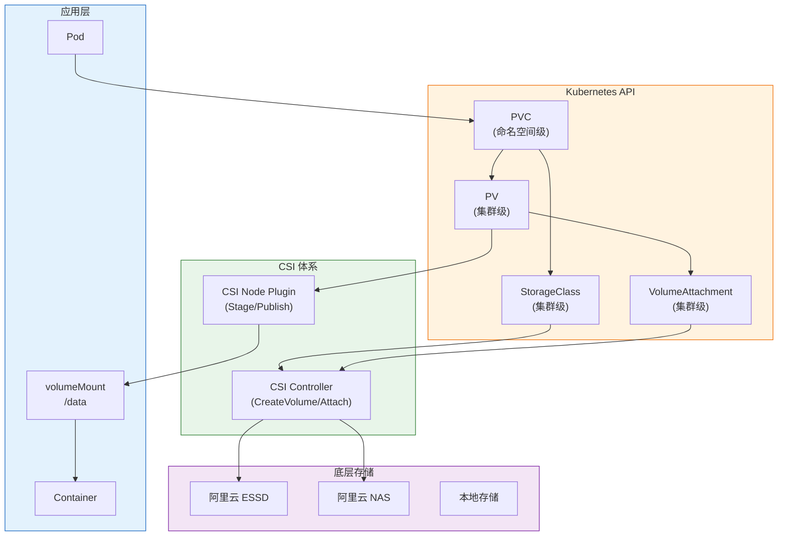
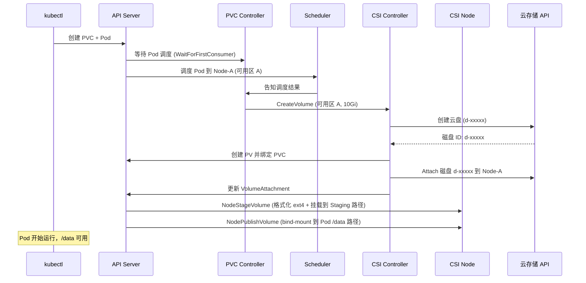
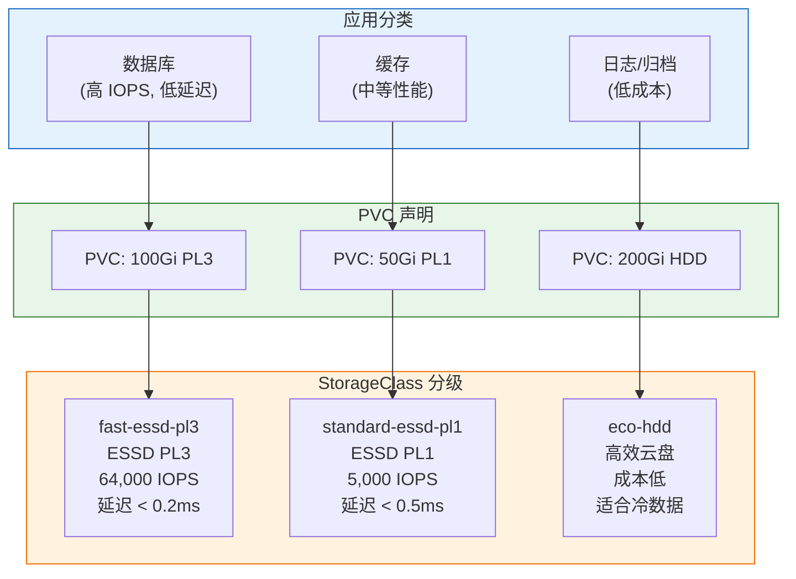

> **生产环境安全提示**
>
> 本文档包含可直接执行的运维命令。执行前请确认：当前目标集群与 Namespace 是否正确；是否具备足够的 RBAC 权限；是否已在非生产环境验证。命令风险等级标注：🔴 高风险（可能造成数据丢失或服务中断）、🟡 中风险（会修改集群状态，但通常可回滚）、🟢 低风险/只读（信息收集，无副作用）。


# Kubernetes 存储体系全栈进阶培训 (从入门到专家)

> **适用版本**: Kubernetes v1.28 - v1.32 | **文档类型**: 全栈技术实战指南
> **核心原则**: 理解持久化本质、掌握 CSI 挂载机制、确保数据容灾闭环

---

## 演讲概述

### 目标受众

- 初级运维：理解 PV/PVC/StorageClass 基础概念
- 存储架构师：深入 CSI 挂载机制和性能调优
- SRE 工程师：存储故障排查与数据容灾保障
- 应用开发者：理解 Pod 挂载和存储选择

### 预计时长

| 阶段 | 内容 | 时长 |
|------|------|------|
| 第一阶段 | 存储基础概念与快速入门 | 30 分钟 |
| 第二阶段 | PV/PVC/StorageClass 三层抽象 | 30 分钟 |
| 第三阶段 | CSI 架构与挂载深度解析 | 40 分钟 |
| 第四阶段 | 生产部署与性能优化 | 30 分钟 |
| 第五阶段 | 实战演示与动手实验 | 35 分钟 |
| 第六阶段 | 故障诊断与数据容灾 | 30 分钟 |
| Q&A | 互动问答 | 15 分钟 |
| **合计** | | **约 3.5 小时** |

### 核心学习目标

完成本次培训后，学员能够：

1. 解释 PV/PVC/StorageClass 三层抽象的关系和作用
2. 描述 CSI 挂载的完整流程（CreateVolume → Stage → Publish）
3. 配置 WaitForFirstConsumer 解决多可用区调度问题
4. 执行卷在线扩容、快照和恢复操作
5. 排查 PVC Pending、Multi-Attach 等常见存储问题
6. 设计完整的数据保护和备份恢复策略

### 核心要点

1. 容器文件系统是临时的，持久化存储是生产环境的基础
2. PV/PVC/StorageClass 三层抽象实现存储的自动化管理
3. CSI (Container Storage Interface) 是存储插件的标准接口
4. WaitForFirstConsumer 延迟绑定解决多可用区问题
5. VolumeSnapshot + Velero 构建完整的数据保护体系

---

## 课程大纲

| 序号 | 章节 | 关键知识点 | 时长 |
|------|------|-----------|------|
| 1 | 为什么需要持久化存储 | 容器临时性、数据丢失风险 | 10min |
| 2 | PV/PVC/StorageClass | 三层抽象、绑定流程、动态供给 | 20min |
| 3 | 访问模式 | RWO/ROX/RWX/RWOP | 10min |
| 4 | CSI 架构 | Controller/Node Plugin、两阶段挂载 | 25min |
| 5 | 存储拓扑感知 | WaitForFirstConsumer、延迟绑定 | 10min |
| 6 | 卷操作 | 在线扩容、快照、克隆、恢复 | 15min |
| 7 | StorageClass 分级 | 性能分级、成本优化 | 10min |
| 8 | 备份与恢复 | VolumeSnapshot、Velero | 15min |
| 9 | 实战演示 | 完整部署和测试 | 35min |

---

## 核心概念讲解

### 为什么需要持久化存储？

容器的设计哲学是**无状态、可替换**的。容器的文件系统是临时的（Ephemeral）——当容器重启或 Pod 被重新调度时，所有写入文件系统的数据都会丢失。但现实中的业务应用（数据库、消息队列、文件存储）都需要持久化数据。

**数据丢失场景：**

| 场景 | 数据丢失？ | 说明 |
|------|-----------|------|
| 容器崩溃重启 | 是 | 容器内文件系统数据丢失 |
| Pod 被删除重建 | 是 | Pod 内所有容器的数据丢失 |
| Pod 被重新调度到其他节点 | 是 | 新节点没有旧数据 |
| Deployment 滚动更新 | 是 | 新 Pod 使用新的容器文件系统 |
| 使用 PVC 挂载 | **否** | 数据存储在独立于 Pod 的卷中 |

**Kubernetes 存储的三层抽象：**

```
┌──────────────────────────────────────────────────────┐
│  应用层 (Pod/Container)                                │
│  └── volumeMounts: 将存储挂载到容器指定路径              │
├──────────────────────────────────────────────────────┤
│  声明层 (PVC)                                          │
│  └── PersistentVolumeClaim: 用户声明需要多少存储          │
├──────────────────────────────────────────────────────┤
│  资源层 (PV / StorageClass)                            │
│  └── PersistentVolume: 实际的存储资源                    │
│  └── StorageClass: 存储模板，自动按需创建 PV              │
├──────────────────────────────────────────────────────┤
│  接口层 (CSI Driver)                                   │
│  └── Container Storage Interface: 标准化的存储插件接口   │
├──────────────────────────────────────────────────────┤
│  底层存储 (云盘 / NAS / Ceph / Local)                   │
│  └── 实际的物理或分布式存储系统                              │
└──────────────────────────────────────────────────────┘
```

### PV、PVC 和 StorageClass 详解

**PV (PersistentVolume)**：集群中的一块存储资源，由管理员预先配置或由 StorageClass 动态创建。PV 是集群级资源（不属于任何命名空间），代表实际的存储后端（如一块云盘、一个 NFS 目录）。

**PVC (PersistentVolumeClaim)**：用户对存储的需求声明。用户不需要关心底层存储的实现细节，只需要声明"我需要 10G、RWO 权限的存储"。PVC 是命名空间级资源。

**StorageClass**：存储的"模板"。它定义了存储的类型（如 SSD、HDD）、CSI 驱动、回收策略等参数。当用户创建 PVC 时，StorageClass 会自动创建匹配的 PV（Dynamic Provisioning）。

**绑定过程：**

```
用户创建 PVC (需要 10Gi, RWO, SSD)
    ↓
Kubernetes 查找匹配的 PV
    ↓
情况 1: 找到现成的 PV → 直接绑定 (Static Provisioning)
情况 2: 有 StorageClass → 动态创建 PV → 绑定 (Dynamic Provisioning)
情况 3: 两者都没有 → PVC 保持 Pending
```

**PV 详细字段解析：**

```yaml
apiVersion: v1
kind: PersistentVolume
metadata:
  name: pv-ssd-10gi
spec:
  capacity:
    storage: 10Gi
  accessModes:
  - ReadWriteOnce
  persistentVolumeReclaimPolicy: Retain
  storageClassName: fast-ssd
  claimRef:                    # 绑定后自动填充
    namespace: default
    name: my-pvc
  csi:
    driver: diskplugin.csi.alibabacloud.com
    volumeHandle: d-xxxxx      # 云盘 ID
    fsType: ext4
  nodeAffinity:                # 拓扑约束
    required:
      nodeSelectorTerms:
      - matchExpressions:
        - key: topology.kubernetes.io/zone
          operator: In
          values:
          - cn-hangzhou-a
```

### 四种访问模式

| 模式 | 缩写 | 说明 | 典型场景 | 存储类型 |
|------|------|------|---------|---------|
| **ReadWriteOnce** | RWO | 单节点读写（最常用） | 数据库、消息队列 | 云盘、Local PV |
| **ReadOnlyMany** | ROX | 多节点只读 | 配置文件分发、静态资源 | NAS、对象存储 |
| **ReadWriteMany** | RWX | 多节点读写 | 共享日志、CMS 系统 | NAS、Ceph FS |
| **ReadWriteOncePod** | RWOP | 单 Pod 独占读写（v1.27+） | 严格单写保证 | 云盘、Local PV |

> **注意**: 不同云商和存储类型对访问模式的支持不同。例如阿里云云盘只支持 RWO，NAS 支持 RWX。选择存储类型前必须确认访问模式需求。

### CSI 挂载全流程

CSI (Container Storage Interface) 是 Kubernetes 与存储系统之间的标准接口。一次完整的卷挂载分为四个阶段：

```
┌──────────────────────────────────────────────────────────┐
│                    CSI 挂载全流程                           │
│                                                            │
│  控制面 (CSI Controller)                                   │
│  ├── 1. CreateVolume      → 调用云 API 创建云盘             │
│  └── 2. ControllerPublish → 将云盘 Attach 到 ECS 节点       │
│                                                            │
│  节点面 (CSI Node Plugin)                                  │
│  ├── 3. NodeStageVolume   → 格式化 + 挂载到 Staging 路径    │
│  └── 4. NodePublishVolume → Bind-mount 到 Pod 目标路径      │
│                                                            │
│  ──────── Pod 运行中 ────────                              │
│                                                            │
│  节点面 (CSI Node Plugin)                                  │
│  ├── 5. NodeUnpublishVolume → 卸载 Pod 目录                │
│  └── 6. NodeUnstageVolume   → 清理 Staging 路径            │
│                                                            │
│  控制面 (CSI Controller)                                   │
│  ├── 7. ControllerUnpublish → 将云盘 Detach 从 ECS 节点     │
│  └── 8. DeleteVolume        → 调用云 API 删除云盘           │
└──────────────────────────────────────────────────────────┘
```

**两阶段挂载的必要性：**

- **Stage（暂存）**：将块设备格式化并挂载到节点上的全局暂存路径（如 `/var/lib/kubelet/pods/<uid>/volumes/kubernetes.io~csi/<pv>/mount`）。这一步是节点级别的，只执行一次——即使有多个 Pod 使用同一个卷。
- **Publish（发布）**：将暂存路径 bind-mount 到 Pod 的目标路径。这一步是 Pod 级别的。

两阶段设计支持 RWX 场景：一次 Stage，多次 Publish（多个 Pod 共享同一个卷）。

**CSI 组件详解：**

| 组件 | 职责 | 运行方式 |
|------|------|---------|
| CSI Controller | CreateVolume、DeleteVolume、ControllerPublish/Unpublish | StatefulSet/Deployment (1-3 副本) |
| CSI Node Plugin | NodeStage/Unstage、NodePublish/Unpublish | DaemonSet (每个节点一个) |
| External Provisioner | 监听 PVC，调用 CSI Controller 创建卷 | Sidecar 容器 |
| External Attacher | 监听 VolumeAttachment，调用 CSI Controller 挂载/卸载 | Sidecar 容器 |
| External Snapshotter | 监听 VolumeSnapshot，调用 CSI Controller 创建快照 | Sidecar 容器 |
| External Resizer | 监听 PVC 扩容请求，调用 CSI Controller 扩容 | Sidecar 容器 |

### 存储拓扑感知

在多可用区集群中，云盘只能挂载到同一可用区的节点。如果在 Pod 调度前就创建了 PV（绑定到特定可用区的云盘），但 Pod 被调度到不同可用区，挂载就会失败。

**解决方案：WaitForFirstConsumer（延迟绑定）**

```yaml
apiVersion: storage.k8s.io/v1
kind: StorageClass
metadata:
  name: standard-ssd
provisioner: diskplugin.csi.alibabacloud.com
volumeBindingMode: WaitForFirstConsumer
parameters:
  type: cloud_essd
  performanceLevel: PL1
reclaimPolicy: Retain
allowVolumeExpansion: true
allowedTopologies:
- matchLabelExpressions:
  - key: topology.kubernetes.io/zone
    values:
    - cn-hangzhou-a
    - cn-hangzhou-b
    - cn-hangzhou-c
```

当 PVC 使用 `WaitForFirstConsumer` 时：
1. PVC 创建时不立即创建 PV 和云盘
2. 等 Pod 被调度到具体节点后
3. 在该节点所在可用区创建云盘
4. 然后完成绑定和挂载

**VolumeBindingMode 对比：**

| 模式 | 绑定时机 | PV 创建位置 | 适用场景 |
|------|---------|------------|---------|
| `Immediate` | PVC 创建即绑定 | 随机可用区 | 单可用区集群 |
| `WaitForFirstConsumer` | Pod 调度后再绑定 | Pod 所在可用区 | **多可用区集群（推荐）** |

### 回收策略

| 策略 | 行为 | PVC 删除后 | 适用场景 |
|------|------|-----------|---------|
| `Retain` | 保留 PV 和数据 | PV 变为 Released 状态，数据保留 | **生产环境（必须）** |
| `Delete` | 删除 PV 和底层存储 | 云盘被删除，数据永久丢失 | 开发/测试 |
| `Recycle` | 清空数据后重用 | rm -rf 后重新可用 | 已废弃，不推荐 |

---

## 架构图

### Kubernetes 存储架构全景



### CSI 挂载流程



### StorageClass 分级架构



---

## 实战演示步骤

### 演示 1：创建第一个 PVC + Pod

> ⚠️ **🔴 灾难性操作** — 含不可逆命令，执行前必须满足变更窗口+双人复核+事前备份+回滚方案
> - `kubectl delete pod --force`：强制删除 Pod，跳过优雅终止与数据刷盘
> - `kubectl apply/create/replace`：创建/变更集群资源
> - `kubectl exec`：进入容器执行命令，可能改变容器状态

> **🔴 高风险操作警告**
>
> 下方命令属于不可逆或高影响操作，执行前请确认：
> - 已备份关键数据与配置
> - 处于批准的变更窗口期
> - 已获得相关责任人授权
> - 已准备回滚或恢复方案
> - 目标集群、Namespace、节点/资源名称正确无误

``` bash
# 🔴 高风险：可能造成数据丢失或服务中断，执行前需备份、变更审批与回滚方案
# 步骤 1: 查看可用 StorageClass
kubectl get sc
# 预期输出:
# NAME             PROVISIONER                       RECLAIMPOLICY   VOLUMEBINDINGMODE
# standard         diskplugin.csi.alibabacloud.com    Delete          Immediate
# standard-ssd     diskplugin.csi.alibabacloud.com    Retain          WaitForFirstConsumer

# 步骤 2: 创建 PVC
cat <<EOF | kubectl apply -f -
apiVersion: v1
kind: PersistentVolumeClaim
metadata:
  name: lab-pvc
spec:
  accessModes: [ReadWriteOnce]
  storageClassName: standard
  resources:
    requests:
      storage: 5Gi
EOF
# 预期输出: persistentvolumeclaim/lab-pvc created

# 步骤 3: 观察 PVC 绑定状态
kubectl get pvc lab-pvc -w
# 预期输出:
# NAME      STATUS   VOLUME   CAPACITY   ACCESS MODES   STORAGECLASS   AGE
# lab-pvc   Bound    pvc-xxx  5Gi        RWO            standard       10s

# 步骤 4: 创建 Pod 使用 PVC
cat <<EOF | kubectl apply -f -
apiVersion: v1
kind: Pod
metadata:
  name: lab-pod
spec:
  containers:
  - name: app
    image: busybox
    command: ["sleep", "3600"]
    volumeMounts:
    - name: data
      mountPath: /data
  volumes:
  - name: data
    persistentVolumeClaim:
      claimName: lab-pvc
EOF

# 步骤 5: 验证挂载
kubectl get pod lab-pod
# 预期: Running

kubectl exec lab-pod -- df -h /data
# 预期输出:
# Filesystem           Size  Used Avail Use% Mounted on
# /dev/vdc             4.9G   20M  4.6G   1% /data

# 写入测试数据
kubectl exec lab-pod -- sh -c "echo 'Hello K8s Storage' > /data/test-file"
kubectl exec lab-pod -- cat /data/test-file
# 预期输出: Hello K8s Storage

# 步骤 6: 删除 Pod 后重建，验证数据持久化
kubectl delete pod lab-pod --force --grace-period=0  # ⚠️ 跳过优雅终止，可能丢数据
# 预期输出: pod "lab-pod" force deleted

cat <<EOF | kubectl apply -f -
apiVersion: v1
kind: Pod
metadata:
  name: lab-pod-2
spec:
  containers:
  - name: app
    image: busybox
    command: ["sleep", "3600"]
    volumeMounts:
    - name: data
      mountPath: /data
  volumes:
  - name: data
    persistentVolumeClaim:
      claimName: lab-pvc
EOF

kubectl exec lab-pod-2 -- cat /data/test-file
# 预期输出: Hello K8s Storage ← 数据还在！
```
### 演示 2：验证 CSI 挂载流程

``` bash
# 🟢 低风险：只读/信息收集，通常无副作用
# 步骤 1: 获取 Pod UID 和 PV 名称
POD_UID=$(kubectl get pod lab-pod-2 -o jsonpath='{.metadata.uid}')
PV_NAME=$(kubectl get pvc lab-pvc -o jsonpath='{.spec.volumeName}')

echo "Pod UID: $POD_UID"
echo "PV Name: $PV_NAME"

# 步骤 2: 查看 VolumeAttachment（卷附加状态）
kubectl get volumeattachment | grep $PV_NAME
# 预期输出:
# NAME                                                                   ATTACHER                         PV         NODE     ATTACHED   AGE
# csi-xxxxx                                                              diskplugin.csi.alibabacloud.com  pvc-xxx    node-1   true       5m

# 步骤 3: 查看 PV 详细信息
kubectl describe pv $PV_NAME
# 关注: Capacity, AccessModes, Reclaim Policy, StorageClass, CSI Volume Handle, Node Affinity

# 步骤 4: 查看 CSI Node 插件日志
kubectl logs -n kube-system -l app=csi-plugin --tail=50 | grep $PV_NAME

# 步骤 5: 在节点上验证挂载（SSH 到节点）
# Staging 路径
ls /var/lib/kubelet/pods/$POD_UID/volumes/kubernetes.io~csi/$PV_NAME/
# 预期输出: mount  dev  (目录和设备文件)

# 查看实际挂载
mount | grep $PV_NAME
```
### 演示 3：卷在线扩容

> ⚠️ **🟡 中危变更** — 变更集群资源状态，建议先 --dry-run 或 diff 确认
> - `kubectl edit/patch`：修改运行中的资源
> - `kubectl exec`：进入容器执行命令，可能改变容器状态

``` bash
# 🟡 中风险：会修改集群/资源状态，执行前请确认目标、影响范围与授权
# 步骤 1: 确认 StorageClass 允许扩容
kubectl get sc -o yaml | grep allowVolumeExpansion
# 预期输出: allowVolumeExpansion: true

# 步骤 2: 查看当前大小
kubectl get pvc lab-pvc
# 预期: CAPACITY: 5Gi

# 步骤 3: 在线扩容 PVC（Pod 运行中！）
kubectl patch pvc lab-pvc -p '{"spec":{"resources":{"requests":{"storage":"20Gi"}}}}'
# 预期输出: persistentvolumeclaim/lab-pvc patched

# 步骤 4: 观察扩容过程
kubectl describe pvc lab-pvc | grep -A5 Conditions
# 预期:
# Conditions:
#   Type                      Status  LastProbeTime  ...  Message
#   FileSystemResizePending   True    ...             ...  Waiting for user to (re-)start a pod

# 步骤 5: 验证扩容结果（kubelet 会自动扩展文件系统）
kubectl exec lab-pod-2 -- df -h /data
# 预期输出:
# Filesystem           Size  Used Avail Use% Mounted on
# /dev/vdc              20G   24M   19G   1% /data
# 注意: 从 5Gi 扩容到 20Gi

# 重要: 扩容不能缩容！从 20Gi 无法缩回 5Gi
```
### 演示 4：VolumeSnapshot 快照与恢复

> ⚠️ **🟡 中危变更** — 变更集群资源状态，建议先 --dry-run 或 diff 确认
> - `kubectl apply/create/replace`：创建/变更集群资源
> - `kubectl exec`：进入容器执行命令，可能改变容器状态

``` bash
# 🟡 中风险：会修改集群/资源状态，执行前请确认目标、影响范围与授权
# 步骤 1: 写入重要数据
kubectl exec lab-pod-2 -- sh -c "echo 'Important data before snapshot' > /data/important.txt"

# 步骤 2: 创建 VolumeSnapshotClass
cat <<EOF | kubectl apply -f -
apiVersion: snapshot.storage.k8s.io/v1
kind: VolumeSnapshotClass
metadata:
  name: csi-snapclass
driver: diskplugin.csi.alibabacloud.com
deletionPolicy: Delete
EOF

# 步骤 3: 创建快照
cat <<EOF | kubectl apply -f -
apiVersion: snapshot.storage.k8s.io/v1
kind: VolumeSnapshot
metadata:
  name: lab-snapshot
spec:
  volumeSnapshotClassName: csi-snapclass
  source:
    persistentVolumeClaimName: lab-pvc
EOF
# 预期输出: volumesnapshot.snapshot.storage.k8s.io/lab-snapshot created

# 步骤 4: 查看快照状态
kubectl get volumesnapshot lab-snapshot -o wide
# 预期输出:
# NAME           READYTOUSE   SOURCEPVC   SOURCESNAPSHOTCONTENT   RESTORESIZE   SNAPSHOTCLASS   SNAPSHOTCONTENT
# lab-snapshot   true         lab-pvc     snapcontent-xxx         5Gi           csi-snapclass   snapcontent-xxx

kubectl describe volumesnapshot lab-snapshot
# 关注: Status.ReadyToUse, Status.RestoreSize

# 步骤 5: 从快照恢复（创建新的 PVC）
cat <<EOF | kubectl apply -f -
apiVersion: v1
kind: PersistentVolumeClaim
metadata:
  name: lab-pvc-restored
spec:
  accessModes: [ReadWriteOnce]
  storageClassName: standard
  dataSource:
    name: lab-snapshot
    kind: VolumeSnapshot
    apiGroup: snapshot.storage.k8s.io
  resources:
    requests:
      storage: 20Gi
EOF

# 步骤 6: 验证恢复的数据
cat <<EOF | kubectl apply -f -
apiVersion: v1
kind: Pod
metadata:
  name: verify-pod
spec:
  containers:
  - name: app
    image: busybox
    command: ["sleep", "3600"]
    volumeMounts:
    - name: data
      mountPath: /data
  volumes:
  - name: data
    persistentVolumeClaim:
      claimName: lab-pvc-restored
EOF

kubectl exec verify-pod -- cat /data/important.txt
# 预期输出: Important data before snapshot ← 数据恢复成功！
```
### 演示 5：备份与恢复 (Velero)

``` bash
# 🟢 低风险：只读/信息收集，通常无副作用
# 步骤 1: 安装 Velero
velero install \
  --provider aws \
  --bucket my-backup-bucket \
  --secret-file ./credentials-velero \
  --use-volume-snapshots \
  --backup-location-config region=cn-hangzhou

# 步骤 2: 创建命名空间级备份
velero backup create daily-backup \
  --include-namespaces production \
  --snapshot-volumes \
  --ttl 168h
# 预期输出: Backup request "daily-backup" submitted successfully.

# 步骤 3: 查看备份状态
velero backup describe daily-backup
# 关注: Status, Start, End, Errors, Volumes

velero backup logs daily-backup

# 步骤 4: 恢复备份
velero restore create --from-backup daily-backup
# 预期输出: Restore request "daily-backup-20260118" submitted successfully.

# 步骤 5: 查看恢复状态
velero restore describe daily-backup-20260118
velero restore logs daily-backup-20260118

# 步骤 6: 定时备份
velero schedule create daily-prod-backup \
  --schedule="0 2 * * *" \
  --include-namespaces production \
  --snapshot-volumes \
  --ttl 168h
```
---

## 动手实验

### 实验 1：完整的数据生命周期管理

**目标**：创建 PVC → 写入数据 → 快照 → 模拟灾难 → 从快照恢复

> ⚠️ **🟡 中危变更** — 变更集群资源状态，建议先 --dry-run 或 diff 确认
> - `kubectl apply/create/replace`：创建/变更集群资源
> - `kubectl exec`：进入容器执行命令，可能改变容器状态

``` bash
# 🟡 中风险：会修改集群/资源状态，执行前请确认目标、影响范围与授权
# 1. 创建 StatefulSet 使用 PVC
cat <<EOF | kubectl apply -f -
apiVersion: apps/v1
kind: StatefulSet
metadata:
  name: data-demo
spec:
  serviceName: data-demo
  replicas: 1
  selector:
    matchLabels:
      app: data-demo
  template:
    metadata:
      labels:
        app: data-demo
    spec:
      containers:
      - name: app
        image: busybox
        command: ["sleep", "3600"]
        volumeMounts:
        - name: data
          mountPath: /data
  volumeClaimTemplates:
  - metadata:
      name: data
    spec:
      accessModes: [ReadWriteOnce]
      storageClassName: standard
      resources:
        requests:
          storage: 5Gi
EOF

# 2. 写入数据
kubectl exec data-demo-0 -- sh -c "echo 'v1 data' > /data/version.txt"
kubectl exec data-demo-0 -- cat /data/version.txt

# 3. 创建快照
cat <<EOF | kubectl apply -f -
apiVersion: snapshot.storage.k8s.io/v1
kind: VolumeSnapshot
metadata:
  name: data-v1-snap
spec:
  volumeSnapshotClassName: csi-snapclass
  source:
    persistentVolumeClaimName: data-data-demo-0
EOF

# 4. 模拟数据损坏
kubectl exec data-demo-0 -- sh -c "echo 'corrupted' > /data/version.txt"

# 5. 从快照恢复
cat <<EOF | kubectl apply -f -
apiVersion: v1
kind: PersistentVolumeClaim
metadata:
  name: data-restored
spec:
  accessModes: [ReadWriteOnce]
  storageClassName: standard
  dataSource:
    name: data-v1-snap
    kind: VolumeSnapshot
    apiGroup: snapshot.storage.k8s.io
  resources:
    requests:
      storage: 5Gi
EOF

# 6. 验证恢复
cat <<EOF | kubectl apply -f -
apiVersion: v1
kind: Pod
metadata:
  name: verify-restored
spec:
  containers:
  - name: app
    image: busybox
    command: ["sleep", "60"]
    volumeMounts:
    - name: data
      mountPath: /data
  volumes:
  - name: data
    persistentVolumeClaim:
      claimName: data-restored
EOF

kubectl exec verify-restored -- cat /data/version.txt
# 预期: v1 data
```
---

## 常见问题与回答

### Q1: PVC 一直 Pending 怎么办？

**回答**: 排查步骤：(1) `kubectl describe pvc <name>` 查看 Events——最直接的信息来源；(2) 检查 StorageClass 是否存在：`kubectl get sc`；(3) 检查 CSI Driver 是否运行：`kubectl get pods -n kube-system -l app=csi-plugin`；(4) 检查云商配额是否充足（磁盘配额、可用区配额）；(5) 如果使用 WaitForFirstConsumer，检查是否有 Pod 引用了这个 PVC——没有 Pod 则不会触发绑定；(6) 检查 ResourceQuota 是否限制了存储总量。

### Q2: Multi-Attach 错误是什么意思？

**回答**: Multi-Attach 表示同一个 PV 被尝试挂载到多个节点，但该 PV 的访问模式是 RWO（只允许单节点读写）。常见原因：(1) Pod 被重新调度到新节点，但旧节点上的卷还未卸载（VolumeAttachment 仍存在）；(2) 旧 Pod 未完全终止（卡在 Terminating）。解决：等待旧 Pod 完全终止和卷卸载（通常 1-5 分钟），或手动检查 `kubectl get volumeattachment` 状态。紧急情况可以手动删除 VolumeAttachment。

### Q3: WaitForFirstConsumer 和 Immediate 怎么选？

**回答**: 单可用区集群可以使用 Immediate。多可用区集群**必须使用 WaitForFirstConsumer**。因为云盘有可用区属性——在 cn-hangzhou-a 创建的云盘只能挂载到 cn-hangzhou-a 的节点。如果提前绑定，Pod 可能被调度到不同可用区导致挂载失败。建议：所有 StorageClass 统一使用 WaitForFirstConsumer，避免出错。

### Q4: 如何选择存储性能级别？

**回答**: 根据应用的 IOPS 和延迟需求选择：(1) **ESSD PL3**（64,000 IOPS，延迟 < 0.2ms）：数据库（MySQL/PostgreSQL/MongoDB）、核心业务；(2) **ESSD PL2**（20,000 IOPS）：中间件（Redis/Kafka/Elasticsearch）、一般业务；(3) **ESSD PL1**（5,000 IOPS）：日志、文件存储、开发测试；(4) **高效云盘**：低频访问、归档数据。建议通过 `fio` 基准测试验证实际性能。

### Q5: 卷扩容有没有风险？

**回答**: 在线扩容（Pod 运行中扩容）对大部分存储类型是安全的，但注意：(1) **扩容不能缩容**——一旦扩到 100Gi 就不能缩回 50Gi；(2) 扩容过程中可能有短暂的 I/O 暂停（取决于存储类型和文件系统）；(3) 文件系统在线扩容由 kubelet 自动完成（支持 ext4 和 xfs）；(4) 建议在业务低峰期执行扩容；(5) 先配置容量告警（85% 警告），在到达 100% 前完成扩容；(6) 确认 StorageClass 设置了 `allowVolumeExpansion: true`。

### Q6: 如何实现存储的高可用？

**回答**: 存储高可用取决于存储后端：(1) **云盘**：依赖云商的数据冗余机制（如阿里云 ESSD 的三副本，数据可靠性 99.9999999%）；(2) **NAS**：多可用区可访问，天然支持高可用；(3) **Ceph**：副本或纠删码保证数据不丢失；(4) **备份**：定期 VolumeSnapshot + Velero 异地备份；(5) **应用层**：数据库主从复制、Redis AOF/RDB 等。注意：云盘本身不支持跨可用区访问，需要应用层实现故障切换。

### Q7: HostPath 和 Local PV 有什么区别？

**回答**: HostPath 直接挂载节点上的目录到容器，不经过 PV/PVC 管理，数据不会随 Pod 迁移，生产环境**严禁使用**（安全风险：Pod 可以访问节点的任意文件）。Local PV 是 Kubernetes 原生支持的本地存储方案，经过 PV/PVC 管理，支持持久化（Pod 重建后数据保留），但不支持 Pod 跨节点迁移。Local PV 适合对延迟极度敏感且不需要迁移的场景（如本地缓存、分布式存储的数据目录）。

### Q8: 如何监控存储使用情况？

**回答**: Kubelet 自动暴露存储指标（`/metrics/cadvisor`）：`kubelet_volume_stats_used_bytes`（已使用）、`kubelet_volume_stats_capacity_bytes`（总容量）、`kubelet_volume_stats_available_bytes`（可用）、`kubelet_volume_stats_inodes_used`（已使用 inode 数）。配置 Prometheus 告警规则：

```yaml
- alert: PVCAlmostFull
  expr: kubelet_volume_stats_used_bytes / kubelet_volume_stats_capacity_bytes > 0.85
  for: 5m
  labels:
    severity: warning
```

同时监控 PVC Pending 数量和 CSI 插件错误率。

### Q9: Velero 备份和 VolumeSnapshot 有什么区别？

**回答**: VolumeSnapshot 是**存储级别**的快照（秒级完成，依赖存储后端支持），只备份卷数据，不备份 Kubernetes 资源定义。Velero 是**集群级**备份工具，同时备份 Kubernetes 资源（Deployment、Service、ConfigMap 等 YAML 定义）和卷数据（通过 VolumeSnapshot 或文件复制）。生产环境推荐两者结合：VolumeSnapshot 用于快速恢复，Velero 用于完整的灾备和跨集群迁移。

### Q10: 如何处理存储性能问题？

**回答**: (1) 确认存储类型和性能级别是否匹配业务需求——数据库用 PL3，日志用 PL1；(2) 使用 `fio` 进行基准测试验证实际 IOPS：`fio --name=test --filename=/data/test --rw=randwrite --bs=4k --size=1G --numjobs=16 --time_based --runtime=60 --group_reporting`；(3) 检查是否有多应用共享同一块磁盘导致 I/O 争抢；(4) 检查网络存储（NAS）的网络带宽是否成为瓶颈；(5) 考虑使用本地存储（Local PV）消除网络开销；(6) 监控 `kubelet_volume_stats_*` 和 etcd 磁盘延迟。

---

## 要点总结

### 存储知识图谱

```
# 🟢 低风险：只读/信息收集，通常无副作用
Kubernetes 存储
├── 核心概念
│   ├── PV (集群级存储资源)
│   ├── PVC (命名空间级存储声明)
│   ├── StorageClass (存储模板 + 动态供给)
│   └── CSI (标准存储接口)
├── 访问模式
│   ├── RWO (单节点读写) ← 最常用
│   ├── ROX (多节点只读)
│   ├── RWX (多节点读写)
│   └── RWOP (单 Pod 独占)
├── 生产实践
│   ├── WaitForFirstConsumer (延迟绑定，多 AZ 必须)
│   ├── Retain 回收策略 (生产必须)
│   ├── 卷在线扩容 (allowVolumeExpansion)
│   ├── StorageClass 性能分级 (PL1/PL2/PL3)
│   └── VolumeSnapshot (快照备份)
├── 数据保护
│   ├── VolumeSnapshot (存储级快照，秒级)
│   ├── Velero (集群级备份，K8s 资源 + 卷数据)
│   ├── 应用级备份 (mysqldump/pg_dump/redis BGSAVE)
│   └── 定时备份 (CronJob + Velero Schedule)
└── 监控告警
    ├── 容量使用率监控 (85% 警告, 95% 严重)
    ├── PVC Pending 告警
    ├── CSI 插件健康检查
    └── 卷挂载失败告警

```
### 存储问题速查表

| 现象 | 可能原因 | 排查命令 | 解决方案 |
|------|---------|---------|---------|
| PVC Pending | StorageClass 不存在 | `kubectl get sc` | 创建 StorageClass |
| PVC Pending | CSI Driver 异常 | `kubectl get pods -n kube-system -l app=csi-plugin` | 重启 CSI Driver |
| PVC Pending | WaitForFirstConsumer 无 Pod | `kubectl describe pvc` | 创建使用 PVC 的 Pod |
| Multi-Attach | 旧 Pod 未完全终止 | `kubectl get volumeattachment` | 等待或手动清理 |
| 挂载失败 | 可用区不匹配 | `kubectl describe pv` | 使用 WaitForFirstConsumer |
| I/O 慢 | 存储性能级别低 | `fio` 基准测试 | 升级存储级别 |
| 磁盘满 | 未配置扩容 | `kubectl exec -- df -h` | 在线扩容 PVC |
| 快照失败 | VolumeSnapshotClass 缺失 | `kubectl get volumesnapshotclass` | 创建 VolumeSnapshotClass |

### SRE 运维红线

| 红线 | 说明 | 违反后果 |
|------|------|---------|
| **红线 1** | 生产环境核心数据必须使用 `Retain` 回收策略 | 误删 PVC 导致数据永久丢失 |
| **红线 2** | 严禁在 Pod 中使用 HostPath 存储敏感数据 | 数据丢失、安全风险、Pod 不可迁移 |
| **红线 3** | 多可用区集群必须配置 WaitForFirstConsumer | Pod 调度到不同可用区导致挂载失败 |
| **红线 4** | 关键业务 PVC 必须配置容量告警（85% 警告，95% 严重） | 磁盘写满导致应用崩溃 |
| **红线 5** | 存储变更必须经过备份验证和灰度发布 | 数据损坏无法恢复 |
| **红线 6** | 定期执行 Velero 备份恢复演练 | 灾难时发现备份不可用 |

### 每日/每周运维检查清单

```markdown
每日检查:
- [ ] PVC Pending 数量 = 0（kubectl get pvc -A | grep Pending）
- [ ] PV Released 数量 = 0（kubectl get pv | grep Released）
- [ ] CSI Driver Pod 运行正常（kubectl get pods -n kube-system -l app=csi-plugin）
- [ ] 存储使用率 < 85%（kubectl get --raw /metrics | grep kubelet_volume_stats_used）
- [ ] VolumeSnapshot 状态正常

每周检查:
- [ ] 备份执行状态和成功率（velero backup get）
- [ ] 存储性能趋势分析（IOPS、延迟趋势）
- [ ] StorageClass 配置一致性审计
- [ ] 清理 Released 状态的 PV（确认数据已迁移后）
- [ ] 检查快照数量和过期清理
```

---

## 延伸阅读

### 官方文档

| 资源 | 链接 | 说明 |
|------|------|------|
| 存储概念 | https://kubernetes.io/docs/concepts/storage/ | 官方存储文档 |
| CSI 文档 | https://kubernetes-csi.github.io/docs/ | CSI 接口规范 |
| VolumeSnapshot | https://kubernetes.io/docs/concepts/storage/volume-snapshots/ | 快照文档 |
| Velero | https://velero.io/docs/ | 备份工具文档 |
| 存储最佳实践 | https://kubernetes.io/docs/concepts/storage/storage-classes/ | StorageClass |

### 关联培训专题

- `kubernetes-architecture-fundamentals-presentation.md` — 存储在架构中的位置
- `kubernetes-workload-presentation.md` — StatefulSet 与持久化存储
- `kubernetes-observability-presentation.md` — 存储监控与告警
- `kubernetes-troubleshooting-methodology-presentation.md` — 存储故障排查
- `kubernetes-scheduling-presentation.md` — 存储拓扑感知调度

---

> **Kusheet Project** | 作者: Allen Galler (allengaller@gmail.com)

## Related

- [[生态参考/领域索引/pvc-index.md|PVC 知识图谱索引]]

```

<!-- risk-assessed -->
