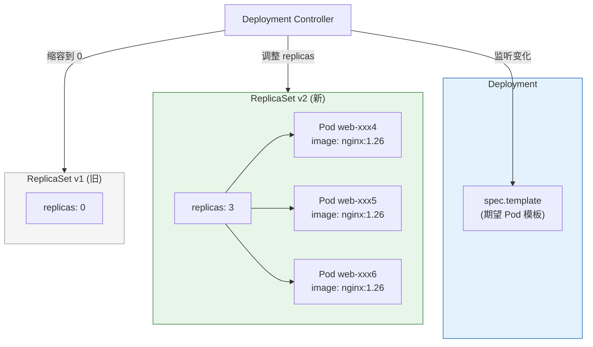
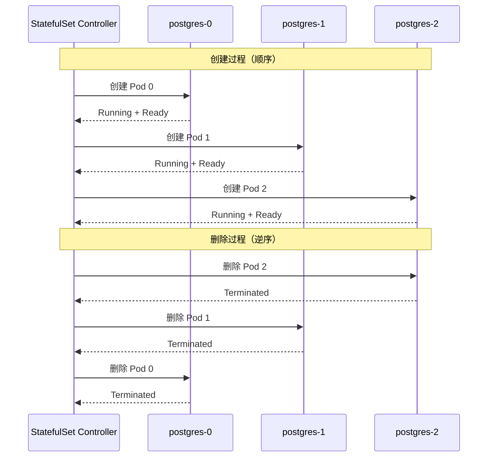
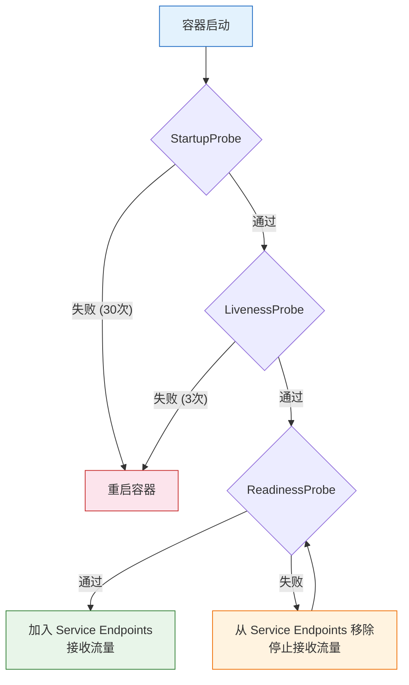

# Kubernetes Workload 全栈进阶培训 (从入门到专家)

> **适用版本**: Kubernetes v1.28 - v1.32 | **文档类型**: 全栈技术实战指南
> **核心原则**: 掌握声明式编排、实现应用高可用稳定性防护

---

## 演讲概述

### 目标受众

- 开发者：理解在 Kubernetes 上运行应用的最佳实践
- 运维初学者：掌握工作负载的创建、更新和排障
- SRE 专家：深入控制器原理和生产稳定性保障

### 预计时长

| 阶段 | 内容 | 时长 |
|------|------|------|
| 第一阶段 | 工作负载基础概念 | 30 分钟 |
| 第二阶段 | Deployment 深度解析 | 35 分钟 |
| 第三阶段 | StatefulSet 与有状态应用 | 30 分钟 |
| 第四阶段 | 实战演示 | 30 分钟 |
| 第五阶段 | 监控告警与弹性伸缩 | 25 分钟 |
| Q&A | 互动问答 | 15 分钟 |
| **合计** | | **约 2.5 小时** |

### 核心要点

1. 四种工作负载类型：Deployment、StatefulSet、DaemonSet、Job/CronJob
2. Deployment 通过 ReplicaSet 实现滚动更新和回滚
3. 资源 QoS（Guaranteed/Burstable/BestEffort）决定 Pod 稳定性
4. 探针（Liveness/Readiness/Startup）保障应用可用性
5. HPA（水平自动扩缩）应对流量波动

---

## 核心概念讲解

### 什么是 Workload？

Workload（工作负载）是在 Kubernetes 上运行的应用程序。Kubernetes 提供了五种内置的工作负载资源：

| 类型 | 用途 | 状态管理 | 典型应用 |
|------|------|---------|---------|
| **Deployment** | 无状态应用 | Pod 无固定标识 | Web 服务、API 服务 |
| **StatefulSet** | 有状态应用 | Pod 有固定标识和顺序 | 数据库、消息队列 |
| **DaemonSet** | 节点级服务 | 每个节点一个 Pod | 日志采集、监控 Agent |
| **Job** | 一次性任务 | 运行完成后退出 | 数据迁移、批处理 |
| **CronJob** | 定时任务 | 按 Cron 表达式调度 | 定时报表、数据备份 |

### Deployment 深度解析

**Deployment 并不直接管理 Pod**，而是通过 ReplicaSet 间接管理：

```
Deployment (声明期望状态)
    ↓ 管理
ReplicaSet v2 (当前版本, replicas=3)
    ↓ 创建/管理
Pod web-app-xxx1 (label: app=web, pod-template-hash=abc123)
Pod web-app-xxx2 (label: app=web, pod-template-hash=abc123)
Pod web-app-xxx3 (label: app=web, pod-template-hash=abc123)
```

**滚动更新原理：**

```yaml
apiVersion: apps/v1
kind: Deployment
metadata:
  name: web-app
spec:
  replicas: 5
  strategy:
    type: RollingUpdate
    rollingUpdate:
      maxSurge: 1        # 允许超出副本数 1 个
      maxUnavailable: 0   # 不允许有不可用副本
  selector:
    matchLabels:
      app: web-app
  template:
    metadata:
      labels:
        app: web-app
    spec:
      containers:
      - name: web
        image: nginx:1.25
        ports:
        - containerPort: 80
```

**滚动更新过程（5 副本，maxSurge=1, maxUnavailable=0）：**

```
阶段 0: [v1] [v1] [v1] [v1] [v1]       # 5 个旧版本
阶段 1: [v1] [v1] [v1] [v1] [v1] [v2]   # 创建 1 个新版本（超出 1 个）
阶段 2: [v1] [v1] [v1] [v1] [v2] [v2]   # 创建第 2 个新版本
阶段 3: [v1] [v1] [v1] [v2] [v2] [v2]   # 删除 1 个旧版本，创建第 3 个新版本
...继续直到全部替换完成
阶段 N: [v2] [v2] [v2] [v2] [v2]         # 5 个新版本
```

**策略参数说明：**

| 参数 | 默认值 | 说明 |
|------|--------|------|
| `maxSurge` | 25% | 滚动更新时允许超出 replicas 的最大数量（可以是数字或百分比） |
| `maxUnavailable` | 25% | 滚动更新时允许不可用的最大数量（可以是数字或百分比） |
| `minReadySeconds` | 0 | Pod 就绪后至少等待多少秒才认为可用 |
| `revisionHistoryLimit` | 10 | 保留的旧 ReplicaSet 数量（用于回滚） |
| `progressDeadlineSeconds` | 600 | 部署超时时间，超过则标记为失败 |

### StatefulSet 与有状态应用

**StatefulSet 与 Deployment 的核心区别：**

| 维度 | Deployment | StatefulSet |
|------|-----------|-------------|
| Pod 名称 | 随机后缀（web-app-7d4f5b） | 有序编号（postgres-0, postgres-1） |
| Pod 标识 | 无固定标识 | 固定标识 + 序号 |
| 启动顺序 | 并行启动 | 顺序启动（0 → 1 → 2） |
| 终止顺序 | 并行终止 | 逆序终止（2 → 1 → 0） |
| PVC | 共享或无 | 每个 Pod 独立 PVC |
| DNS | 通过 Service 负载均衡 | 通过 Headless Service 精确寻址 |

```yaml
apiVersion: apps/v1
kind: StatefulSet
metadata:
  name: postgres
spec:
  serviceName: postgres-headless
  replicas: 3
  selector:
    matchLabels:
      app: postgres
  template:
    metadata:
      labels:
        app: postgres
    spec:
      containers:
      - name: postgres
        image: postgres:15
        ports:
        - containerPort: 5432
        volumeMounts:
        - name: data
          mountPath: /var/lib/postgresql/data
  volumeClaimTemplates:
  - metadata:
      name: data
    spec:
      accessModes: [ReadWriteOnce]
      storageClassName: standard
      resources:
        requests:
          storage: 10Gi
```

**StatefulSet 的稳定网络标识：**

```
postgres-0.postgres-headless.default.svc.cluster.local → Pod postgres-0 的 IP
postgres-1.postgres-headless.default.svc.cluster.local → Pod postgres-1 的 IP
postgres-2.postgres-headless.default.svc.cluster.local → Pod postgres-2 的 IP
```

### 资源 QoS 等级

Kubernetes 根据 Pod 的 requests 和 limits 配置将其分为三个 QoS 等级：

| QoS 等级 | 条件 | 驱逐优先级 | 适用场景 |
|----------|------|-----------|---------|
| **Guaranteed** | requests == limits（CPU 和内存都设置了） | 最低（最后被驱逐） | 核心业务 |
| **Burstable** | 设置了 requests 但 limits 不全等于 requests | 中等 | 一般业务 |
| **BestEffort** | 没有设置 requests 和 limits | 最高（最先被驱逐） | 临时任务 |

```yaml
# Guaranteed QoS（生产环境推荐）
resources:
  requests:
    cpu: "1"
    memory: 1Gi
  limits:
    cpu: "1"
    memory: 1Gi

# Burstable QoS
resources:
  requests:
    cpu: 500m
    memory: 512Mi
  limits:
    cpu: "2"
    memory: 2Gi

# BestEffort QoS（不推荐生产环境使用）
# 不设置 resources
```

### 探针 (Probes)

探针是保障应用可用性的关键机制：

```yaml
apiVersion: v1
kind: Pod
metadata:
  name: app-with-probes
spec:
  containers:
  - name: app
    image: my-app:latest
    startupProbe:
      httpGet:
        path: /health/startup
        port: 8080
      failureThreshold: 30
      periodSeconds: 10
    livenessProbe:
      httpGet:
        path: /health/live
        port: 8080
      failureThreshold: 3
      periodSeconds: 10
    readinessProbe:
      httpGet:
        path: /health/ready
        port: 8080
      failureThreshold: 3
      periodSeconds: 5
```

| 探针类型 | 作用 | 失败后果 | 适用场景 |
|---------|------|---------|---------|
| **StartupProbe** | 检查应用是否启动完成 | 启动阶段失败 → 重启容器 | 启动慢的应用（JVM、大型框架） |
| **LivenessProbe** | 检查应用是否存活 | 失败 → 重启容器 | 死锁、线程耗尽 |
| **ReadinessProbe** | 检查应用是否就绪 | 失败 → 从 Service 移除 | 依赖未就绪、缓存未预热 |

**探针类型对比：**

| 检查方式 | 说明 | 适用场景 |
|---------|------|---------|
| `httpGet` | HTTP GET 请求，2xx/3xx 为成功 | Web 应用 |
| `tcpSocket` | 尝试建立 TCP 连接 | 非HTTP服务（数据库、缓存） |
| `exec` | 在容器内执行命令，返回 0 为成功 | 自定义健康检查脚本 |
| `grpc` | gRPC 健康检查协议 | gRPC 服务 |

### HPA (Horizontal Pod Autoscaler)

```yaml
apiVersion: autoscaling/v2
kind: HorizontalPodAutoscaler
metadata:
  name: web-app-hpa
spec:
  scaleTargetRef:
    apiVersion: apps/v1
    kind: Deployment
    name: web-app
  minReplicas: 3
  maxReplicas: 20
  metrics:
  - type: Resource
    resource:
      name: cpu
      target:
        type: Utilization
        averageUtilization: 70
  - type: Resource
    resource:
      name: memory
      target:
        type: Utilization
        averageUtilization: 80
  behavior:
    scaleDown:
      stabilizationWindowSeconds: 300
      policies:
      - type: Percent
        value: 10
        periodSeconds: 60
    scaleUp:
      stabilizationWindowSeconds: 0
      policies:
      - type: Percent
        value: 100
        periodSeconds: 15
      - type: Pods
        value: 4
        periodSeconds: 15
      selectPolicy: Max
```

**behavior 参数说明：**

| 参数 | 说明 | 推荐 |
|------|------|------|
| `stabilizationWindowSeconds` | 稳定窗口，在此期间不执行扩缩 | 缩容 300s，扩容 0s |
| `selectPolicy` | 多策略选择方式 | Max（取最大扩缩量） |
| `periodSeconds` | 策略评估周期 | 扩容 15s，缩容 60s |

---

## 架构图

### Deployment 更新机制



### StatefulSet 有序管理



### 探针工作机制



---

## 实战演示步骤

### 演示 1：Deployment 滚动更新

```bash
# 步骤 1: 创建 Deployment
kubectl create deployment web-app --image=nginx:1.24 --replicas=5

# 步骤 2: 查看当前状态
kubectl get deployment web-app
kubectl get rs
kubectl get pods -l app=web-app -o wide

# 步骤 3: 触发滚动更新
kubectl set image deployment/web-app nginx=nginx:1.25

# 步骤 4: 实时观察更新过程
kubectl rollout status deployment/web-app

# 步骤 5: 查看更新历史
kubectl rollout history deployment/web-app

# 步骤 6: 回滚到上一版本
kubectl rollout undo deployment/web-app

# 步骤 7: 回滚到特定版本
kubectl rollout undo deployment/web-app --to-revision=1

# 步骤 8: 暂停和恢复更新
kubectl rollout pause deployment/web-app
kubectl set image deployment/web-app nginx=nginx:1.26
kubectl set resources deployment/web-app -c=nginx --limits=cpu=1,memory=512Mi
kubectl rollout resume deployment/web-app
```

### 演示 2：StatefulSet 部署

```bash
# 步骤 1: 创建 Headless Service
cat <<EOF | kubectl apply -f -
apiVersion: v1
kind: Service
metadata:
  name: nginx-headless
spec:
  clusterIP: None
  selector:
    app: nginx-sts
  ports:
  - port: 80
EOF

# 步骤 2: 创建 StatefulSet
cat <<EOF | kubectl apply -f -
apiVersion: apps/v1
kind: StatefulSet
metadata:
  name: nginx-sts
spec:
  serviceName: nginx-headless
  replicas: 3
  selector:
    matchLabels:
      app: nginx-sts
  template:
    metadata:
      labels:
        app: nginx-sts
    spec:
      containers:
      - name: nginx
        image: nginx
        volumeMounts:
        - name: www
          mountPath: /usr/share/nginx/html
  volumeClaimTemplates:
  - metadata:
      name: www
    spec:
      accessModes: [ReadWriteOnce]
      storageClassName: standard
      resources:
        requests:
          storage: 1Gi
EOF

# 步骤 3: 观察有序创建
kubectl get pods -l app=nginx-sts -w

# 步骤 4: 验证稳定网络标识
kubectl run test --image=busybox --rm -it --restart=Never -- \
  nslookup nginx-sts-0.nginx-headless.default.svc.cluster.local

# 步骤 5: 验证独立 PVC
kubectl get pvc -l app=nginx-sts
```

### 演示 3：DaemonSet 部署

```bash
cat <<EOF | kubectl apply -f -
apiVersion: apps/v1
kind: DaemonSet
metadata:
  name: log-collector
  namespace: kube-system
spec:
  selector:
    matchLabels:
      app: log-collector
  template:
    metadata:
      labels:
        app: log-collector
    spec:
      tolerations:
      - key: node-role.kubernetes.io/control-plane
        effect: NoSchedule
      containers:
      - name: [[domain-19-landscape-references/01-cncf-landscape/graduated/fluentd/fluentd|fluentd]]
        image: fluent/fluentd:v1.16
        resources:
          limits:
            cpu: 200m
            memory: 256Mi
          requests:
            cpu: 100m
            memory: 128Mi
        volumeMounts:
        - name: varlog
          mountPath: /var/log
      volumes:
      - name: varlog
        hostPath:
          path: /var/log
EOF

# 验证每个节点一个 Pod
kubectl get ds -n kube-system log-collector
kubectl get pods -n kube-system -l app=log-collector -o wide
```

### 演示 4：CronJob 定时任务

```bash
cat <<EOF | kubectl apply -f -
apiVersion: batch/v1
kind: CronJob
metadata:
  name: daily-report
spec:
  schedule: "0 2 * * *"
  concurrencyPolicy: Forbid
  successfulJobsHistoryLimit: 3
  failedJobsHistoryLimit: 3
  jobTemplate:
    spec:
      backoffLimit: 3
      activeDeadlineSeconds: 3600
      template:
        spec:
          restartPolicy: OnFailure
          containers:
          - name: report
            image: busybox
            command:
            - /bin/sh
            - -c
            - echo "Generating daily report at $(date)" && sleep 10
EOF

# 查看 CronJob 状态
kubectl get cronjob
kubectl get jobs

# 手动触发
kubectl create job manual-report --from=cronjob/daily-report
```

### 演示 5：HPA 弹性伸缩

```bash
# 步骤 1: 部署带资源请求的应用
cat <<EOF | kubectl apply -f -
apiVersion: apps/v1
kind: Deployment
metadata:
  name: stress-app
spec:
  replicas: 2
  selector:
    matchLabels:
      app: stress-app
  template:
    metadata:
      labels:
        app: stress-app
    spec:
      containers:
      - name: stress
        image: progrium/stress
        resources:
          requests:
            cpu: 200m
            memory: 128Mi
          limits:
            cpu: "1"
            memory: 256Mi
EOF

# 步骤 2: 创建 HPA
kubectl autoscale deployment stress-app --cpu-percent=50 --min=2 --max=10

# 步骤 3: 查看当前 HPA 状态
kubectl get hpa

# 步骤 4: 模拟负载
kubectl exec -it deployment/stress-app -- stress --cpu 2 --timeout 120s

# 步骤 5: 观察 HPA 扩容
kubectl get hpa -w
kubectl get pods -l app=stress-app -w
```

---

## 常见问题与回答

### Q1: Deployment 和 StatefulSet 应该怎么选？

**回答**: 99% 的应用应该使用 Deployment。只有当你的应用满足以下条件时才使用 StatefulSet：(1) 需要稳定的网络标识（如数据库主从需要知道彼此地址）；(2) 需要稳定的持久化存储（每个 Pod 独立的 PVC）；(3) 需要有序的部署和扩展（如 ZooKeeper、Kafka）；(4) 需要有序的滚动更新。

### Q2: 滚动更新时如何保证零停机？

**回答**: 关键配置：(1) 设置 `ReadinessProbe`，只有就绪的 Pod 才接收流量；(2) `maxUnavailable: 0` 确保始终有足够的可用副本；(3) 配置 `preStop` 钩子等待连接排空：`lifecycle: preStop: exec: command: ["sleep", "15"]`；(4) 设置 `terminationGracePeriodSeconds: 30`；(5) 使用 `minReadySeconds: 5` 避免 Pod 刚就绪就被使用。

### Q3: Pod 被 OOMKilled 怎么处理？

**回答**: (1) 查看 OOM 原因：`kubectl describe pod <name>` 看 Last State 的 Reason；(2) 检查 limits.memory 是否合理；(3) 分析内存使用趋势（Prometheus）；(4) 临时解决：调大 limits.memory；(5) 根本解决：排查内存泄漏（使用 pprof 或 heap dump）。注意：如果容器因 OOM 被杀，内核日志 `dmesg` 中会有 Out of memory 记录。

### Q4: 如何选择 CPU requests 和 limits？

**回答**: (1) **requests** 设为 P99 使用量（影响调度决策）；(2) **limits** 设为 requests 的 1.5-2 倍（允许突发）；(3) CPU 是可压缩资源，超限会被 Throttle（不会杀 Pod）；(4) 内存是不可压缩资源，超限会被 OOMKill；(5) 核心业务推荐 Guaranteed QoS（requests == limits）。

### Q5: LivenessProbe 和 ReadinessProbe 有什么区别？

**回答**: LivenessProbe 检查应用是否"活着"——失败会重启容器。ReadinessProbe 检查应用是否"就绪"——失败会将 Pod 从 Service 移除但不重启。关键区别：LivenessProbe 失败是毁灭性的（重启容器），ReadinessProbe 失败是保护性的（停止流量但保留容器）。**常见错误**：用 LivenessProbe 检查依赖服务（如数据库），这会导致级联重启。

### Q6: 如何处理 Pod 启动慢的问题？

**回答**: 使用 StartupProbe：(1) 设置较大的 `failureThreshold` 和 `periodSeconds`（如 failureThreshold=30, periodSeconds=10，最长等待 300 秒）；(2) StartupProbe 通过后才开始 Liveness 和 Readiness 检查；(3) 这样应用有充足的时间完成初始化（如 JVM 预热、加载缓存）。不要通过调大 LivenessProbe 的参数来"绕过"，因为那会影响运行时的故障检测速度。

### Q7: 如何实现蓝绿部署？

**回答**: (1) 创建两个 Deployment：web-app-blue（当前版本）和 web-app-green（新版本）；(2) Service 的 selector 指向 blue 版本；(3) 验证 green 版本正常后，更新 Service selector 指向 green；(4) 如需回滚，改回 blue。或者使用 Istio/Argo Rollouts 实现更精细的流量切换。

### Q8: DaemonSet 和 Deployment 的区别？

**回答**: Deployment 的 Pod 数量由 `replicas` 决定，调度器决定放在哪个节点。DaemonSet 会在每个符合条件 的节点上运行一个 Pod（不受 replicas 控制），适合节点级别的服务（日志采集、监控 Agent、网络插件）。DaemonSet 自动适应节点增减——新节点加入时自动创建 Pod。

### Q9: 如何排查 ImagePullBackOff？

**回答**: (1) `kubectl describe pod <name>` 查看 Events 中的具体错误；(2) 常见原因：镜像地址错误（拼写、标签不存在）、网络不通（无法访问镜像仓库）、认证失败（需要 imagePullSecrets）；(3) 验证镜像是否存在：`docker pull <image>` 或 `crane pull <image>`；(4) 私有仓库认证：创建 Secret 并在 Pod 中引用 `imagePullSecrets`。

### Q10: 如何防止 Pod 被意外驱逐？

**回答**: (1) 使用 Guaranteed QoS（最后被驱逐）；(2) 配置 Pod Disruption Budget（PDB）：

```yaml
apiVersion: policy/v1
kind: PodDisruptionBudget
metadata:
  name: web-app-pdb
spec:
  minAvailable: 2
  selector:
    matchLabels:
      app: web-app
```

PDB 确保自愿中断（如节点维护、集群升级）不会导致过多 Pod 同时不可用。注意 PDB 不防止非自愿中断（如节点宕机）。

---

## 要点总结

### Workload 知识图谱

```
Workload
├── Deployment (无状态)
│   ├── ReplicaSet 管理
│   ├── 滚动更新 (maxSurge/maxUnavailable)
│   ├── 回滚 (rollout undo)
│   └── 暂停/恢复 (rollout pause/resume)
├── StatefulSet (有状态)
│   ├── 有序编号 (0, 1, 2...)
│   ├── Headless Service (稳定 DNS)
│   ├── volumeClaimTemplates (独立存储)
│   └── 有序滚动更新
├── DaemonSet (节点级)
│   ├── 每节点一个 Pod
│   ├── 自动适应节点变化
│   └── 容忍 Master 污点
├── Job/CronJob (任务)
│   ├── 重试策略 (backoffLimit)
│   ├── 并发策略 (concurrencyPolicy)
│   └── 历史清理 (historyLimit)
├── 稳定性保障
│   ├── 探针 (Startup/Liveness/Readiness)
│   ├── QoS 等级 (Guaranteed/Burstable/BestEffort)
│   ├── PDB (中断预算)
│   └── preStop 钩子
└── 弹性伸缩
    ├── HPA (CPU/Memory/自定义指标)
    ├── behavior (扩缩策略)
    └── stabilizationWindow (稳定窗口)
```

### SRE 运维红线

| 红线 | 说明 | 违反后果 |
|------|------|---------|
| **红线 1** | 所有 Pod 必须配置 resources requests/limits | 资源争抢导致不可预测的性能 |
| **红线 2** | 核心业务必须配置 ReadinessProbe | 不健康的 Pod 继续接收流量 |
| **红线 3** | 生产环境严禁使用 `latest` 镜像标签 | 无法确定运行版本，无法回滚 |
| **红线 4** | 关键业务必须配置 HPA | 流量突增时无法自动扩容 |
| **红线 5** | StatefulSet 必须使用 Headless Service | 无法通过稳定 DNS 访问特定 Pod |

---

## 延伸阅读

### 官方文档

| 资源 | 链接 | 说明 |
|------|------|------|
| Workloads | https://kubernetes.io/docs/concepts/workloads/ | 工作负载概念 |
| Deployment | https://kubernetes.io/docs/concepts/workloads/controllers/deployment/ | Deployment 详解 |
| StatefulSet | https://kubernetes.io/docs/concepts/workloads/controllers/statefulset/ | StatefulSet 详解 |
| HPA | https://kubernetes.io/docs/tasks/run-application/horizontal-pod-autoscale/ | 自动扩缩 |

### 关联培训专题

- `kubernetes-architecture-fundamentals-presentation.md` — 控制器模式原理
- `kubernetes-scheduling-presentation.md` — 调度与 Pod 分布
- `kubernetes-storage-presentation.md` — StatefulSet 持久化存储
- `kubernetes-observability-presentation.md` — Workload 监控与告警

---

> **Kusheet Project** | 作者: Allen Galler (allengaller@gmail.com)
