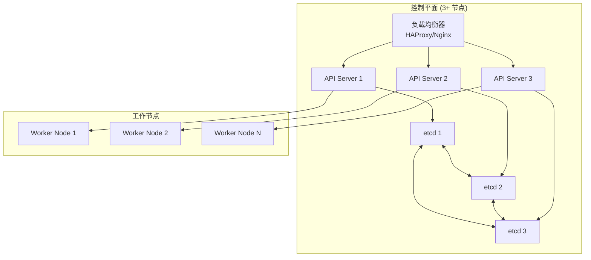

# Kubernetes 集群配置最佳实践

> **适用版本**: Kubernetes v1.25-v1.32 | **最后更新**: 2026-05 | **作者**: 系统生成 | **质量等级**: ⭐⭐⭐⭐⭐ 专家级

> **生产环境实战经验总结**: 基于万级节点集群运维经验，涵盖从集群规划到配置优化的全方位最佳实践

---

## 概述

本指南提供生产环境 Kubernetes 集群配置的最佳实践，帮助团队构建稳定、安全、高效的集群基础设施。

### 目标读者

- **平台工程师**: 了解集群架构设计和配置优化
- **SRE**: 掌握集群可靠性和可观测性实践
- **DevOps 工程师**: 学习集群部署和运维策略

### 前置知识

- Kubernetes 核心概念（Pod、Deployment、Service）
- Linux 系统管理基础
- 网络基础知识

---

## 问题描述

### 常见问题

**问题1：控制平面单点故障**
- **症状**：API Server 不可用，集群管理功能丧失
- **原因**：单主节点架构，缺乏高可用设计
- **影响**：集群管理功能完全丧失，影响业务连续性

**问题2：etcd 性能瓶颈**
- **症状**：API 响应缓慢，集群操作超时
- **原因**：etcd 存储配额不足，性能配置不当
- **影响**：集群操作性能下降，影响业务部署和更新

**问题3：网络配置不当**
- **症状**：Pod 间通信异常，服务发现失败
- **原因**：网络插件配置错误，网络策略缺失
- **影响**：业务服务间通信中断，影响业务功能

---

## 解决方案

### 架构设计

**高可用控制平面架构**：



**架构优势**：
- **高可用**：任意节点故障不影响集群功能
- **负载均衡**：API 请求均匀分布到多个节点
- **数据一致性**：etcd 集群保证数据一致性

### 关键配置

#### 1. API Server 配置

```yaml
# API Server 配置示例
apiVersion: kubeadm.k8s.io/v1beta3
kind: ClusterConfiguration
apiServer:
  extraArgs:
    # 并发控制
    max-requests-inflight: "1000"
    max-mutating-requests-inflight: "500"
    
    # 审计日志
    audit-log-path: "/var/log/kubernetes/audit.log"
    audit-log-maxage: "30"
    audit-log-maxbackup: "10"
    audit-log-maxsize: "100"
    
    # 安全配置
    anonymous-auth: "false"
    enable-admission-plugins: "NodeRestriction,PodSecurityPolicy"
    
    # 性能优化
    event-ttl: "1h"
    service-cluster-ip-range: "10.96.0.0/12"
```

#### 2. etcd 配置

```yaml
# etcd 配置示例
apiVersion: kubeadm.k8s.io/v1beta3
kind: ClusterConfiguration
etcd:
  local:
    dataDir: "/var/lib/etcd"
    extraArgs:
      # 存储配额
      quota-backend-bytes: "8589934592"  # 8GB
      
      # 性能优化
      snapshot-count: "10000"
      heartbeat-interval: "100"
      election-timeout: "1000"
      
      # 安全配置
      client-cert-auth: "true"
      peer-client-cert-auth: "true"
```

#### 3. Controller Manager 配置

```yaml
# Controller Manager 配置示例
apiVersion: kubeadm.k8s.io/v1beta3
kind: ClusterConfiguration
controllerManager:
  extraArgs:
    # 性能优化
    concurrent-deployment-syncs: "10"
    concurrent-replicaset-syncs: "10"
    concurrent-service-syncs: "5"
    
    # 资源限制
    node-monitor-grace-period: "40s"
    pod-eviction-timeout: "5m"
    
    # 垃圾回收
    terminated-pod-gc-threshold: "100"
```

#### 4. Scheduler 配置

```yaml
# Scheduler 配置示例
apiVersion: kubeadm.k8s.io/v1beta3
kind: ClusterConfiguration
scheduler:
  extraArgs:
    # 性能优化
    concurrent-gc-syncs: "20"
    
    # 调度策略
    profiling: "false"
    
    # 资源平衡
    leader-elect: "true"
```

---

## 实施步骤

### 前置条件

**硬件要求**：
- 控制平面节点：4核 CPU, 8GB 内存, 100GB SSD
- 工作节点：根据工作负载需求配置
- 网络：万兆网络，低延迟

**软件要求**：
- 操作系统：Ubuntu 20.04+ / CentOS 7+
- 容器运行时：containerd 1.6+ / CRI-O 1.24+
- Kubernetes：v1.25+

### 步骤1：环境准备

```bash
#!/bin/bash
# 环境准备脚本

# 更新系统
sudo apt update && sudo apt upgrade -y

# 安装必要工具
sudo apt install -y apt-transport-https ca-certificates curl software-properties-common

# 配置内核参数
cat <<EOF | sudo tee /etc/sysctl.d/k8s.conf
net.bridge.bridge-nf-call-ip6tables = 1
net.bridge.bridge-nf-call-iptables = 1
net.ipv4.ip_forward = 1
EOF

sudo sysctl --system

# 禁用 swap
sudo swapoff -a
sudo sed -i '/ swap / s/^\(.*\)$/#\1/g' /etc/fstab
```

### 步骤2：安装容器运行时

```bash
#!/bin/bash
# 安装 containerd

# 添加 Docker 仓库
curl -fsSL https://download.docker.com/linux/ubuntu/gpg | sudo gpg --dearmor -o /usr/share/keyrings/docker-archive-keyring.gpg
echo "deb [arch=$(dpkg --print-architecture) signed-by=/usr/share/keyrings/docker-archive-keyring.gpg] https://download.docker.com/linux/ubuntu $(lsb_release -cs) stable" | sudo tee /etc/apt/sources.list.d/docker.list > /dev/null

sudo apt update
sudo apt install -y containerd.io

# 配置 containerd
sudo mkdir -p /etc/containerd
containerd config default | sudo tee /etc/containerd/config.toml

# 启用 SystemdCgroup
sudo sed -i 's/SystemdCgroup = false/SystemdCgroup = true/g' /etc/containerd/config.toml

# 重启 containerd
sudo systemctl restart containerd
sudo systemctl enable containerd
```

### 步骤3：安装 Kubernetes 组件

```bash
#!/bin/bash
# 安装 Kubernetes 组件

# 添加 Kubernetes 仓库
curl -s https://packages.cloud.google.com/apt/doc/apt-key.gpg | sudo apt-key add -
echo "deb https://apt.kubernetes.io/ kubernetes-xenial main" | sudo tee /etc/apt/sources.list.d/kubernetes.list

sudo apt update
sudo apt install -y kubelet kubeadm kubectl
sudo apt-mark hold kubelet kubeadm kubectl

# 启用 kubelet
sudo systemctl enable kubelet
```

### 步骤4：初始化控制平面

```bash
#!/bin/bash
# 初始化控制平面节点

# 创建配置文件
cat <<EOF > kubeadm-config.yaml
apiVersion: kubeadm.k8s.io/v1beta3
kind: ClusterConfiguration
kubernetesVersion: v1.28.0
controlPlaneEndpoint: "k8s-api.example.com:6443"
networking:
  podSubnet: "10.244.0.0/16"
  serviceSubnet: "10.96.0.0/12"
  dnsDomain: "cluster.local"
apiServer:
  extraArgs:
    max-requests-inflight: "1000"
    audit-log-path: "/var/log/kubernetes/audit.log"
etcd:
  local:
    extraArgs:
      quota-backend-bytes: "8589934592"
EOF

# 初始化集群
sudo kubeadm init --config kubeadm-config.yaml --upload-certs

# 配置 kubectl
mkdir -p $HOME/.kube
sudo cp -i /etc/kubernetes/admin.conf $HOME/.kube/config
sudo chown $(id -u):$(id -g) $HOME/.kube/config
```

### 步骤5：安装网络插件

```bash
#!/bin/bash
# 安装 Calico 网络插件

# 下载 Calico 配置
curl https://raw.githubusercontent.com/projectcalico/calico/v3.26.1/manifests/calico.yaml -O

# 修改 Pod CIDR
sed -i 's|# - name: CALICO_IPV4POOL_CIDR|- name: CALICO_IPV4POOL_CIDR|g' calico.yaml
sed -i 's|#   value: "192.168.0.0/16"|  value: "10.244.0.0/16"|g' calico.yaml

# 应用配置
kubectl apply -f calico.yaml
```

### 步骤6：加入工作节点

```bash
#!/bin/bash
# 加入工作节点

# 在控制平面节点获取加入命令
kubeadm token create --print-join-command

# 在工作节点执行加入命令
sudo kubeadm join k8s-api.example.com:6443 --token <token> --discovery-token-ca-cert-hash sha256:<hash>
```

---

## 验证方法

### 自动化验证脚本

```bash
#!/bin/bash
# 集群配置验证脚本

echo "=== Kubernetes 集群配置验证 ==="
echo "验证时间: $(date)"
echo ""

# 检查控制平面状态
echo "1. 控制平面状态:"
kubectl get nodes -o wide
echo ""

# 检查系统组件
echo "2. 系统组件状态:"
kubectl get pods -n kube-system
echo ""

# 检查 etcd 集群状态
echo "3. etcd 集群状态:"
kubectl -n kube-system exec -it etcd-$(hostname) -- etcdctl \
  --endpoints=https://127.0.0.1:2379 \
  --cacert=/etc/kubernetes/pki/etcd/ca.crt \
  --cert=/etc/kubernetes/pki/etcd/server.crt \
  --key=/etc/kubernetes/pki/etcd/server.key \
  member list
echo ""

# 检查 API Server 配置
echo "4. API Server 配置:"
kubectl get pods -n kube-system -l component=kube-apiserver -o yaml | grep -A 5 "audit-log-path"
echo ""

# 检查网络插件
echo "5. 网络插件状态:"
kubectl get pods -n kube-system -l k8s-app=calico-node
echo ""

# 检查集群资源使用
echo "6. 集群资源使用:"
kubectl top nodes
echo ""

echo "=== 验证完成 ==="
```

### 手动验证清单

**控制平面验证**：
- [ ] 所有控制平面节点状态为 Ready
- [ ] etcd 集群成员数量正确（3+）
- [ ] API Server 响应时间 < 1s
- [ ] Controller Manager 和 Scheduler 正常运行

**网络验证**：
- [ ] Pod 间通信正常
- [ ] Service 发现正常
- [ ] DNS 解析正常
- [ ] 网络策略生效

**存储验证**：
- [ ] 默认存储类配置正确
- [ ] 持久卷创建和绑定正常
- [ ] 存储性能满足要求

---

## 常见陷阱

### 陷阱1：etcd 存储配额不足

**问题**：etcd 默认存储配额为 2GB，对于大型集群可能不足。

**后果**：集群无法创建新资源，API Server 响应缓慢。

**正确做法**：
```yaml
# 设置合适的 etcd 存储配额
etcd:
  local:
    extraArgs:
      quota-backend-bytes: "8589934592"  # 8GB
```

### 陷阱2：API Server 并发限制不当

**问题**：API Server 并发限制设置过低，无法处理大量请求。

**后果**：API Server 过载，请求超时。

**正确做法**：
```yaml
# 设置合适的并发限制
apiServer:
  extraArgs:
    max-requests-inflight: "1000"
    max-mutating-requests-inflight: "500"
```

### 陷阱3：网络插件配置错误

**问题**：网络插件 Pod CIDR 配置与集群不匹配。

**后果**：Pod 间通信异常，服务发现失败。

**正确做法**：
```bash
# 确保网络插件配置与集群 Pod CIDR 一致
sed -i 's|# - name: CALICO_IPV4POOL_CIDR|- name: CALICO_IPV4POOL_CIDR|g' calico.yaml
sed -i 's|#   value: "192.168.0.0/16"|  value: "10.244.0.0/16"|g' calico.yaml
```

---

## 相关资源

### 官方文档
- [Kubernetes 集群安装](https://kubernetes.io/docs/setup/production-environment/tools/kubeadm/install-kubeadm/)
- [etcd 配置](https://etcd.io/docs/latest/op-guide/configuration/)
- [API Server 配置](https://kubernetes.io/docs/reference/command-line-tools-reference/kube-apiserver/)

### 工具推荐
- [kubeadm](https://kubernetes.io/docs/reference/setup-tools/kubeadm/) - 集群引导工具
- [etcdctl](https://etcd.io/docs/latest/dev-guide/interacting_v3/) - etcd 命令行工具
- [calicoctl](https://docs.tigera.io/calico/latest/operations/calicoctl/install) - Calico 管理工具

### 参考案例
- [生产环境集群配置案例](https://kubernetes.io/docs/setup/best-practices/cluster-large/)
- [高可用集群部署](https://kubernetes.io/docs/setup/production-environment/tools/kubeadm/high-availability/)

---

## 版本历史

| 版本 | 日期 | 变更说明 | 作者 |
|------|------|----------|------|
| v1.0 | 2026-05 | 初始版本 | 系统生成 |

---

**最佳实践原则**: 具体、可操作、可验证、可维护

---

**文档维护**：定期审查和更新，确保与 Kubernetes 版本保持同步