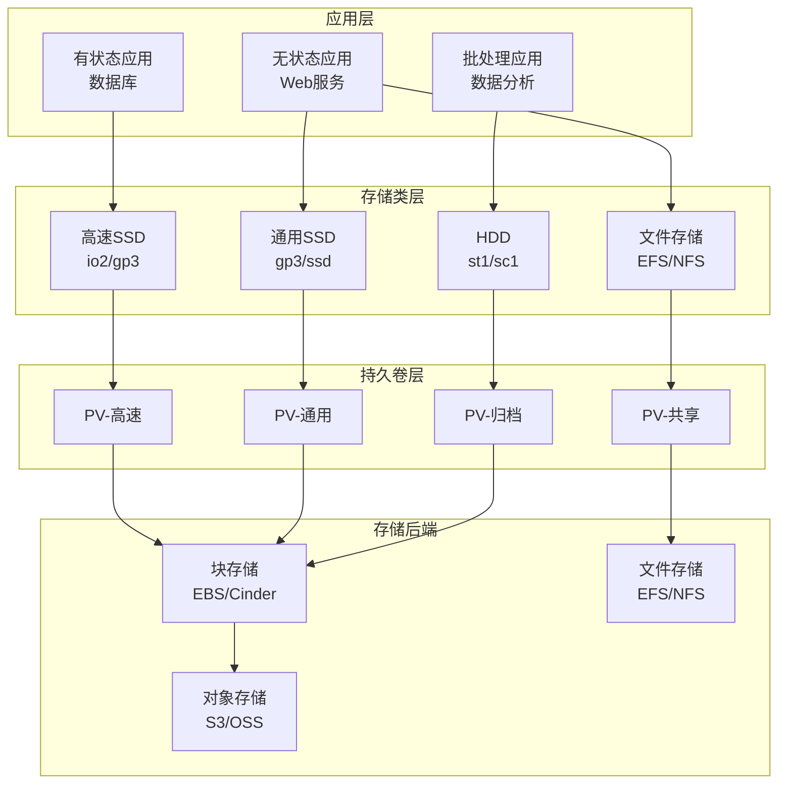

# Kubernetes 存储配置最佳实践

> **适用版本**: Kubernetes v1.25-v1.32 | **最后更新**: 2026-05 | **作者**: 系统生成 | **质量等级**: ⭐⭐⭐⭐⭐ 专家级

> **生产环境实战经验总结**: 基于大规模集群存储运维经验，涵盖从存储类设计到数据备份的全方位最佳实践

---

## 概述

本指南提供生产环境 Kubernetes 存储配置的最佳实践，帮助团队构建可靠、高效、可扩展的存储基础设施。

### 目标读者

- **存储工程师**: 了解Kubernetes存储架构和存储类设计
- **SRE**: 掌握存储故障排查和性能优化
- **DevOps 工程师**: 学习持久卷配置和数据备份

### 前置知识

- Kubernetes 核心概念（PV、PVC、StorageClass）
- 存储基础（块存储、文件存储、对象存储）
- 数据备份和恢复基础

---

## 问题描述

### 常见问题

**问题1：存储性能瓶颈**
- **症状**：应用I/O延迟高，吞吐量低
- **原因**：存储类选择不当，存储配置不佳
- **影响**：应用性能下降，用户体验差

**问题2：数据丢失风险**
- **症状**：Pod重建后数据丢失
- **原因**：持久卷配置不当，回收策略错误
- **影响**：数据丢失，业务中断

**问题3：存储成本过高**
- **症状**：存储费用超出预算
- **原因**：存储类选择不当，存储空间浪费
- **影响**：成本超支，资源浪费

---

## 解决方案

### 存储类设计

**存储类规划矩阵**：

| 存储类型 | 适用场景 | 性能 | 成本 | 示例 |
|---------|---------|------|------|------|
| **高速SSD** | 数据库、缓存 | 极高 | 高 | io2, gp3 |
| **通用SSD** | 应用数据、日志 | 高 | 中 | gp3, ssd |
| **HDD** | 归档、备份 | 中 | 低 | st1, sc1 |
| **文件存储** | 共享存储、配置 | 中 | 中 | EFS, NFS |
| **对象存储** | 静态资源、备份 | 高 | 低 | S3, OSS |

**存储类设计原则**：
- **按需选择**：根据应用性能需求选择存储类型
- **分层存储**：热数据用高速存储，冷数据用低成本存储
- **预留空间**：预留20%空间应对突发需求
- **监控告警**：监控存储使用率和性能指标

### 存储架构设计

**生产环境存储架构**：



**架构优势**：
- **分层清晰**：各层职责明确，易于维护
- **性能优化**：按需选择存储类型
- **成本可控**：分层存储降低成本
- **高可用**：多副本和备份策略

### 关键配置

#### 1. StorageClass 配置

```yaml
# 高速SSD存储类
apiVersion: storage.k8s.io/v1
kind: StorageClass
metadata:
  name: fast-ssd
  annotations:
    storageclass.kubernetes.io/is-default-class: "false"
provisioner: kubernetes.io/aws-ebs
parameters:
  type: io2
  iopsPerGB: "50"
  fsType: ext4
reclaimPolicy: Retain
volumeBindingMode: WaitForFirstConsumer
allowVolumeExpansion: true
---
# 通用SSD存储类
apiVersion: storage.k8s.io/v1
kind: StorageClass
metadata:
  name: general-ssd
  annotations:
    storageclass.kubernetes.io/is-default-class: "true"
provisioner: kubernetes.io/aws-ebs
parameters:
  type: gp3
  iops: "3000"
  throughput: "125"
  fsType: ext4
reclaimPolicy: Delete
volumeBindingMode: WaitForFirstConsumer
allowVolumeExpansion: true
---
# HDD存储类
apiVersion: storage.k8s.io/v1
kind: StorageClass
metadata:
  name: cold-storage
provisioner: kubernetes.io/aws-ebs
parameters:
  type: st1
  fsType: ext4
reclaimPolicy: Delete
volumeBindingMode: WaitForFirstConsumer
allowVolumeExpansion: true
```

#### 2. PersistentVolume 配置

```yaml
# 静态PV配置
apiVersion: v1
kind: PersistentVolume
metadata:
  name: pv-database
  labels:
    type: database
    environment: production
spec:
  capacity:
    storage: 100Gi
  accessModes:
    - ReadWriteOnce
  persistentVolumeReclaimPolicy: Retain
  storageClassName: fast-ssd
  awsElasticBlockStore:
    volumeID: vol-0123456789abcdef0
    fsType: ext4
```

#### 3. PersistentVolumeClaim 配置

```yaml
# 数据库PVC
apiVersion: v1
kind: PersistentVolumeClaim
metadata:
  name: pvc-database
  namespace: production
spec:
  accessModes:
    - ReadWriteOnce
  storageClassName: fast-ssd
  resources:
    requests:
      storage: 100Gi
  selector:
    matchLabels:
      type: database
      environment: production
```

---

## 实施步骤

### 前置条件

**硬件要求**：
- 存储后端：支持动态供应的存储系统
- 网络：节点与存储后端网络互通
- 容量：足够的存储空间

**软件要求**：
- Kubernetes：v1.25+
- 存储驱动：对应存储后端的CSI驱动
- 备份工具：Velero或类似工具

### 步骤1：存储规划

```bash
#!/bin/bash
# 存储规划脚本

# 1. 评估存储需求
echo "=== 存储需求评估 ==="
echo "数据库存储: 100Gi (高速SSD)"
echo "应用存储: 50Gi (通用SSD)"
echo "日志存储: 200Gi (HDD)"
echo "备份存储: 500Gi (对象存储)"

# 2. 计算成本
echo ""
echo "=== 成本估算 ==="
echo "高速SSD: $0.10/GB/月"
echo "通用SSD: $0.08/GB/月"
echo "HDD: $0.045/GB/月"
echo "对象存储: $0.023/GB/月"

# 3. 总成本
TOTAL_COST=$((100*10 + 50*8 + 200*45/10 + 500*23/10))
echo ""
echo "总成本: $${TOTAL_COST}/月"
```

### 步骤2：安装CSI驱动

```bash
#!/bin/bash
# 安装 AWS EBS CSI 驱动

# 1. 添加 Helm 仓库
helm repo add aws-ebs-csi-driver https://kubernetes-sigs.github.io/aws-ebs-csi-driver
helm repo update

# 2. 安装 CSI 驱动
helm install aws-ebs-csi-driver aws-ebs-csi-driver/aws-ebs-csi-driver \
  --namespace kube-system \
  --set enableVolumeScheduling=true \
  --set enableVolumeResizing=true \
  --set enableVolumeSnapshot=true

# 3. 验证安装
kubectl get pods -n kube-system | grep ebs-csi
```

### 步骤3：创建存储类

```bash
#!/bin/bash
# 创建存储类

# 1. 创建高速SSD存储类
cat <<EOF | kubectl apply -f -
apiVersion: storage.k8s.io/v1
kind: StorageClass
metadata:
  name: fast-ssd
provisioner: ebs.csi.aws.com
parameters:
  type: io2
  iops: "5000"
  fsType: ext4
reclaimPolicy: Retain
volumeBindingMode: WaitForFirstConsumer
allowVolumeExpansion: true
EOF

# 2. 创建通用SSD存储类
cat <<EOF | kubectl apply -f -
apiVersion: storage.k8s.io/v1
kind: StorageClass
metadata:
  name: general-ssd
  annotations:
    storageclass.kubernetes.io/is-default-class: "true"
provisioner: ebs.csi.aws.com
parameters:
  type: gp3
  iops: "3000"
  throughput: "125"
  fsType: ext4
reclaimPolicy: Delete
volumeBindingMode: WaitForFirstConsumer
allowVolumeExpansion: true
EOF

# 3. 验证存储类
kubectl get storageclass
```

### 步骤4：配置数据备份

```bash
#!/bin/bash
# 安装备份工具 Velero

# 1. 下载 Velero
wget https://github.com/vmware-tanzu/velero/releases/download/v1.12.0/velero-v1.12.0-linux-amd64.tar.gz
tar -xvf velero-v1.12.0-linux-amd64.tar.gz
sudo mv velero-v1.12.0-linux-amd64/velero /usr/local/bin/

# 2. 配置备份存储
cat <<EOF > credentials-velero
[default]
aws_access_key_id=<AWS_ACCESS_KEY_ID>
aws_secret_access_key=<AWS_SECRET_ACCESS_KEY>
EOF

# 3. 安装 Velero
velero install \
  --provider aws \
  --plugins velero/velero-plugin-for-aws:v1.8.0 \
  --bucket my-velero-backup \
  --backup-location-config region=us-east-1 \
  --snapshot-location-config region=us-east-1 \
  --secret-file ./credentials-velero

# 4. 验证安装
velero version
```

---

## 验证方法

### 自动化验证脚本

```bash
#!/bin/bash
# 存储配置验证脚本

echo "=== Kubernetes 存储配置验证 ==="
echo "验证时间: $(date)"
echo ""

# 1. 检查存储类
echo "1. 存储类:"
kubectl get storageclass
echo ""

# 2. 检查持久卷
echo "2. 持久卷:"
kubectl get pv
echo ""

# 3. 检查持久卷声明
echo "3. 持久卷声明:"
kubectl get pvc --all-namespaces
echo ""

# 4. 检查CSI驱动
echo "4. CSI驱动:"
kubectl get csidrivers
echo ""

# 5. 检查卷快照
echo "5. 卷快照:"
kubectl get volumesnapshot --all-namespaces
echo ""

# 6. 检查备份状态
echo "6. 备份状态:"
velero backup get
echo ""

echo "=== 验证完成 ==="
```

### 手动验证清单

**存储类验证**：
- [ ] 存储类创建成功
- [ ] 默认存储类设置正确
- [ ] 动态供应正常工作
- [ ] 卷扩缩容功能正常

**持久卷验证**：
- [ ] PV创建成功
- [ ] PVC绑定正常
- [ ] 数据持久化正常
- [ ] Pod重建后数据保留

**备份验证**：
- [ ] 备份任务创建成功
- [ ] 备份数据完整
- [ ] 恢复测试成功
- [ ] 备份策略生效

---

## 常见陷阱

### 陷阱1：回收策略配置不当

**问题**：PVC删除后PV被删除，导致数据丢失。

**后果**：重要数据丢失，无法恢复。

**正确做法**：
```yaml
# 生产环境使用Retain策略
apiVersion: storage.k8s.io/v1
kind: StorageClass
metadata:
  name: production-storage
provisioner: ebs.csi.aws.com
reclaimPolicy: Retain  # 重要：使用Retain而非Delete
```

### 陷阱2：存储性能不匹配

**问题**：数据库使用HDD存储，导致性能瓶颈。

**后果**：数据库响应缓慢，影响业务。

**正确做法**：
```yaml
# 数据库使用高速SSD
apiVersion: v1
kind: PersistentVolumeClaim
metadata:
  name: database-pvc
spec:
  storageClassName: fast-ssd  # 使用高速SSD
  resources:
    requests:
      storage: 100Gi
```

### 陷阱3：未配置卷扩缩容

**问题**：存储空间不足时无法扩容。

**后果**：应用无法写入数据，服务中断。

**正确做法**：
```yaml
# 启用卷扩缩容
apiVersion: storage.k8s.io/v1
kind: StorageClass
metadata:
  name: expandable-storage
provisioner: ebs.csi.aws.com
allowVolumeExpansion: true  # 启用扩缩容
```

---

## 相关资源

### 官方文档
- [Kubernetes 存储](https://kubernetes.io/docs/concepts/storage/)
- [持久卷](https://kubernetes.io/docs/concepts/storage/persistent-volumes/)
- [存储类](https://kubernetes.io/docs/concepts/storage/storage-classes/)

### 工具推荐
- [Velero](https://velero.io/) - 备份和恢复
- [CSI](https://kubernetes-csi.github.io/) - 容器存储接口
- [OpenEBS](https://openebs.io/) - 云原生存储

### 参考案例
- [AWS EBS CSI驱动](https://docs.aws.amazon.com/eks/latest/userguide/ebs-csi.html)
- [GCE PD CSI驱动](https://github.com/kubernetes-sigs/gcp-compute-persistent-disk-csi-driver)

---

## 版本历史

| 版本 | 日期 | 变更说明 | 作者 |
|------|------|----------|------|
| v1.0 | 2026-05 | 初始版本 | 系统生成 |

---

**最佳实践原则**: 具体、可操作、可验证、可维护

---

**文档维护**：定期审查和更新，确保与Kubernetes版本和存储驱动版本保持同步