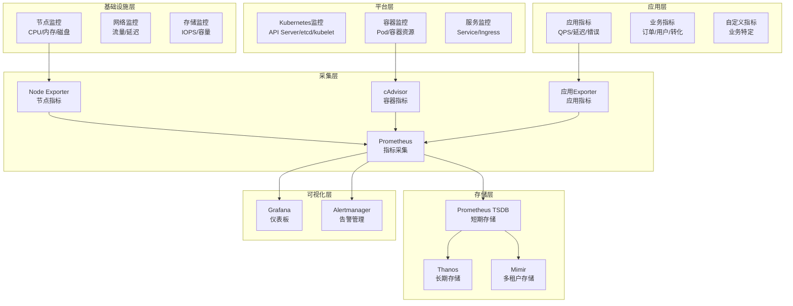

# Kubernetes 监控最佳实践

> **适用版本**: Kubernetes v1.25-v1.32 | **最后更新**: 2026-05 | **作者**: 系统生成 | **质量等级**: ⭐⭐⭐⭐⭐ 专家级

> **生产环境实战经验总结**: 基于大规模集群监控运维经验，涵盖从Prometheus部署到告警配置的全方位最佳实践

---

## 概述

本指南提供生产环境 Kubernetes 监控配置的最佳实践，帮助团队构建全面、高效、可靠的监控体系。

### 目标读者

- **SRE**: 了解监控架构设计和告警配置
- **DevOps 工程师**: 掌握Prometheus部署和配置
- **平台工程师**: 学习监控指标收集和可视化

### 前置知识

- Kubernetes 核心概念（Pod、Service、Namespace）
- 监控基础（指标、告警、仪表板）
- Prometheus 基础（PromQL、告警规则）

---

## 问题描述

### 常见问题

**问题1：监控覆盖不全**
- **症状**：部分服务未被监控
- **原因**：监控配置不完整，指标收集缺失
- **影响**：问题发现延迟，问题定位困难

**问题2：告警风暴**
- **症状**：大量告警，难以处理
- **原因**：告警规则配置不当，阈值设置不合理
- **影响**：告警疲劳，重要告警被忽略

**问题3：监控性能瓶颈**
- **症状**：监控系统响应缓慢
- **原因**：Prometheus配置不当，存储空间不足
- **影响**：监控数据延迟，告警不及时

---

## 解决方案

### 监控架构设计

**监控架构设计原则**：
- **全面覆盖**：监控所有关键组件
- **分层监控**：基础设施、平台、应用三层监控
- **智能告警**：合理的告警阈值和策略
- **可观测性**：指标、日志、追踪三位一体

**监控架构图**：



### 关键配置

#### 1. Prometheus配置

```yaml
# Prometheus配置
apiVersion: monitoring.coreos.com/v1
kind: Prometheus
metadata:
  name: prometheus
  namespace: monitoring
spec:
  replicas: 2
  retention: 30d
  resources:
    requests:
      memory: 2Gi
      cpu: 1
    limits:
      memory: 4Gi
      cpu: 2
  storage:
    volumeClaimTemplate:
      spec:
        storageClassName: fast-ssd
        resources:
          requests:
            storage: 100Gi
  serviceMonitorSelector:
    matchLabels:
      team: devops
  ruleSelector:
    matchLabels:
      team: devops
  alerting:
    alertmanagers:
    - namespace: monitoring
      name: alertmanager
      port: web
```

#### 2. ServiceMonitor配置

```yaml
# ServiceMonitor配置
apiVersion: monitoring.coreos.com/v1
kind: ServiceMonitor
metadata:
  name: app-monitor
  namespace: production
  labels:
    team: devops
spec:
  selector:
    matchLabels:
      app: myapp
  endpoints:
  - port: metrics
    interval: 30s
    path: /metrics
  namespaceSelector:
    matchNames:
    - production
```

#### 3. 告警规则配置

```yaml
# 告警规则配置
apiVersion: monitoring.coreos.com/v1
kind: PrometheusRule
metadata:
  name: app-alerts
  namespace: monitoring
  labels:
    team: devops
spec:
  groups:
  - name: app-alerts
    rules:
    - alert: HighErrorRate
      expr: rate(http_requests_total{status=~"5.."}[5m]) / rate(http_requests_total[5m]) > 0.05
      for: 5m
      labels:
        severity: critical
      annotations:
        summary: "高错误率告警"
        description: "应用错误率超过5%，当前值: {{ $value }}"
    
    - alert: HighLatency
      expr: histogram_quantile(0.95, rate(http_request_duration_seconds_bucket[5m])) > 1
      for: 5m
      labels:
        severity: warning
      annotations:
        summary: "高延迟告警"
        description: "95%请求延迟超过1秒，当前值: {{ $value }}"
```

---

## 实施步骤

### 前置条件

**硬件要求**：
- Prometheus服务器：4核CPU, 8GB内存, 100GB SSD
- 存储：高性能SSD，足够存储30天数据

**软件要求**：
- Kubernetes：v1.25+
- Helm：v3.0+
- Prometheus Operator：v0.65+

### 步骤1：安装Prometheus Operator

```bash
#!/bin/bash
# 安装Prometheus Operator

# 1. 添加Helm仓库
helm repo add prometheus-community https://prometheus-community.github.io/helm-charts
helm repo update

# 2. 创建命名空间
kubectl create namespace monitoring

# 3. 安装kube-prometheus-stack
helm install kube-prometheus prometheus-community/kube-prometheus-stack \
  --namespace monitoring \
  --set prometheus.prometheusSpec.retention=30d \
  --set prometheus.prometheusSpec.storageSpec.volumeClaimTemplate.spec.storageClassName=fast-ssd \
  --set prometheus.prometheusSpec.storageSpec.volumeClaimTemplate.spec.resources.requests.storage=100Gi

# 4. 验证安装
kubectl get pods -n monitoring
```

### 步骤2：配置节点监控

```bash
#!/bin/bash
# 配置节点监控

# 1. 安装Node Exporter
helm install node-exporter prometheus-community/prometheus-node-exporter \
  --namespace monitoring

# 2. 验证Node Exporter
kubectl get pods -n monitoring | grep node-exporter

# 3. 检查指标
kubectl port-forward -n monitoring svc/node-exporter 9100:9100
curl http://localhost:9100/metrics | head -20
```

### 步骤3：配置应用监控

```bash
#!/bin/bash
# 配置应用监控

# 1. 创建ServiceMonitor
cat <<EOF | kubectl apply -f -
apiVersion: monitoring.coreos.com/v1
kind: ServiceMonitor
metadata:
  name: app-monitor
  namespace: production
  labels:
    team: devops
spec:
  selector:
    matchLabels:
      app: myapp
  endpoints:
  - port: metrics
    interval: 30s
    path: /metrics
  namespaceSelector:
    matchNames:
    - production
EOF

# 2. 验证ServiceMonitor
kubectl get servicemonitor -n production
```

### 步骤4：配置告警

```bash
#!/bin/bash
# 配置告警

# 1. 创建告警规则
cat <<EOF | kubectl apply -f -
apiVersion: monitoring.coreos.com/v1
kind: PrometheusRule
metadata:
  name: app-alerts
  namespace: monitoring
  labels:
    team: devops
spec:
  groups:
  - name: app-alerts
    rules:
    - alert: HighErrorRate
      expr: rate(http_requests_total{status=~"5.."}[5m]) / rate(http_requests_total[5m]) > 0.05
      for: 5m
      labels:
        severity: critical
      annotations:
        summary: "高错误率告警"
        description: "应用错误率超过5%，当前值: {{ $value }}"
EOF

# 2. 验证告警规则
kubectl get prometheusrule -n monitoring
```

---

## 验证方法

### 自动化验证脚本

```bash
#!/bin/bash
# 监控配置验证脚本

echo "=== Kubernetes 监控配置验证 ==="
echo "验证时间: $(date)"
echo ""

# 1. 检查Prometheus状态
echo "1. Prometheus状态:"
kubectl get pods -n monitoring | grep prometheus
echo ""

# 2. 检查ServiceMonitor
echo "2. ServiceMonitor:"
kubectl get servicemonitor --all-namespaces
echo ""

# 3. 检查告警规则
echo "3. 告警规则:"
kubectl get prometheusrule --all-namespaces
echo ""

# 4. 检查Grafana
echo "4. Grafana状态:"
kubectl get pods -n monitoring | grep grafana
echo ""

# 5. 检查Alertmanager
echo "5. Alertmanager状态:"
kubectl get pods -n monitoring | grep alertmanager
echo ""

# 6. 测试Prometheus查询
echo "6. Prometheus查询测试:"
kubectl port-forward -n monitoring svc/kube-prometheus-prometheus 9090:9090 &
sleep 2
curl -s "http://localhost:9090/api/v1/query?query=up" | jq '.data.result | length'
kill %1
echo ""

echo "=== 验证完成 ==="
```

### 手动验证清单

**Prometheus验证**：
- [ ] Prometheus运行正常
- [ ] 数据采集正常
- [ ] 存储空间充足
- [ ] 查询性能正常

**ServiceMonitor验证**：
- [ ] ServiceMonitor创建成功
- [ ] 指标采集正常
- [ ] 标签配置正确
- [ ] 采集间隔合理

**告警验证**：
- [ ] 告警规则创建成功
- [ ] 告警触发正常
- [ ] 告警通知正常
- [ ] 告警恢复正常

**Grafana验证**：
- [ ] Grafana运行正常
- [ ] 数据源配置正确
- [ ] 仪表板显示正常
- [ ] 告警展示正常

---

## 常见陷阱

### 陷阱1：Prometheus存储空间不足

**问题**：Prometheus存储空间不足，导致数据丢失。

**后果**：监控数据丢失，告警不及时。

**正确做法**：
```yaml
# 配置足够的存储空间
apiVersion: monitoring.coreos.com/v1
kind: Prometheus
metadata:
  name: prometheus
spec:
  retention: 30d
  storage:
    volumeClaimTemplate:
      spec:
        storageClassName: fast-ssd
        resources:
          requests:
            storage: 100Gi  # 根据数据量调整
```

### 陷阱2：告警规则配置不当

**问题**：告警阈值设置不合理，导致告警风暴。

**后果**：告警疲劳，重要告警被忽略。

**正确做法**：
```yaml
# 合理的告警阈值
apiVersion: monitoring.coreos.com/v1
kind: PrometheusRule
spec:
  groups:
  - name: app-alerts
    rules:
    - alert: HighErrorRate
      expr: rate(http_requests_total{status=~"5.."}[5m]) / rate(http_requests_total[5m]) > 0.05
      for: 5m  # 持续5分钟才触发
      labels:
        severity: critical
```

### 陷阱3：ServiceMonitor标签不匹配

**问题**：ServiceMonitor标签与Service标签不匹配。

**后果**：指标采集失败，监控数据缺失。

**正确做法**：
```yaml
# 确保标签匹配
apiVersion: monitoring.coreos.com/v1
kind: ServiceMonitor
metadata:
  name: app-monitor
  labels:
    team: devops  # 与Prometheus的serviceMonitorSelector匹配
spec:
  selector:
    matchLabels:
      app: myapp  # 与Service标签匹配
```

---

## 相关资源

### 官方文档
- [Prometheus](https://prometheus.io/docs/)
- [Prometheus Operator](https://github.com/prometheus-operator/prometheus-operator)
- [Grafana](https://grafana.com/docs/)

### 工具推荐
- [kube-prometheus](https://github.com/prometheus-operator/kube-prometheus) - Kubernetes监控
- [Thanos](https://thanos.io/) - 长期存储
- [Alertmanager](https://prometheus.io/docs/alerting/latest/alertmanager/) - 告警管理

### 参考案例
- [Prometheus最佳实践](https://prometheus.io/docs/practices/)
- [Kubernetes监控](https://kubernetes.io/docs/concepts/cluster-administration/monitoring/)

---

## 版本历史

| 版本 | 日期 | 变更说明 | 作者 |
|------|------|----------|------|
| v1.0 | 2026-05 | 初始版本 | 系统生成 |

---

**最佳实践原则**: 具体、可操作、可验证、可维护

---

**文档维护**：定期审查和更新，确保与Prometheus和Kubernetes版本保持同步