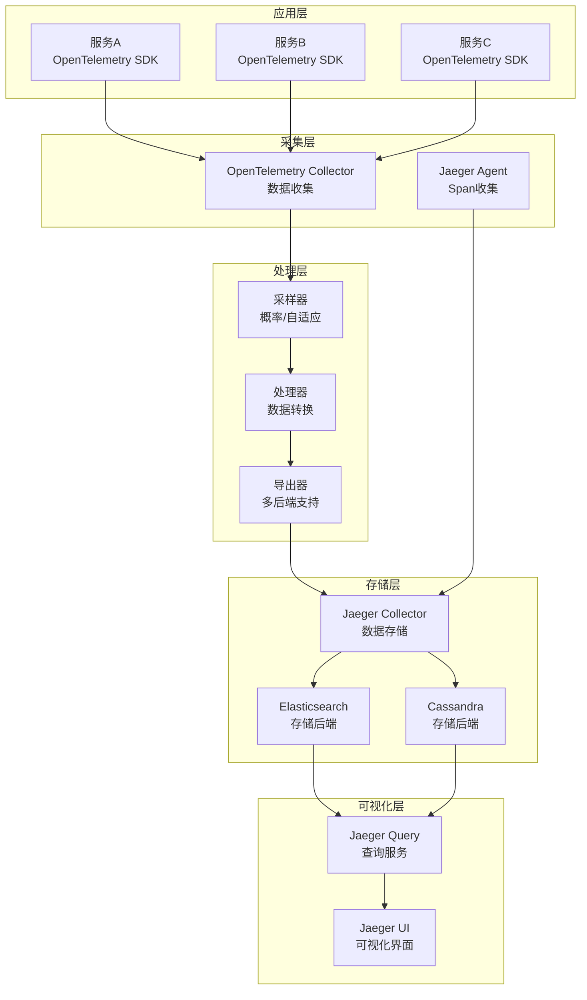

# Kubernetes 分布式追踪最佳实践

> **适用版本**: Kubernetes v1.25-v1.32 | **最后更新**: 2026-05 | **作者**: 系统生成 | **质量等级**: ⭐⭐⭐⭐⭐ 专家级

> **生产环境实战经验总结**: 基于大规模集群分布式追踪运维经验，涵盖从Jaeger部署到OpenTelemetry集成的全方位最佳实践

---

## 概述

本指南提供生产环境 Kubernetes 分布式追踪配置的最佳实践，帮助团队构建高效、可靠、可扩展的分布式追踪体系。

### 目标读者

- **SRE**: 了解分布式追踪架构设计和故障排查
- **DevOps 工程师**: 掌握Jaeger部署和配置
- **应用开发工程师**: 学习OpenTelemetry集成和追踪上下文传播

### 前置知识

- Kubernetes 核心概念（Pod、Service、Deployment）
- 分布式追踪基础（Span、Trace、Context Propagation）
- OpenTelemetry 基础（SDK、Collector、Exporter）

---

## 问题描述

### 常见问题

**问题1：追踪数据丢失**
- **症状**：部分追踪数据缺失
- **原因**：采样率配置不当，缓冲区溢出
- **影响**：性能分析困难，问题定位困难

**问题2：追踪性能开销大**
- **症状**：应用性能下降
- **原因**：追踪采样率过高，追踪数据量大
- **影响**：应用性能下降，用户体验差

**问题3：追踪上下文传播失败**
- **症状**：跨服务追踪断裂
- **原因**：追踪上下文传播配置不当
- **影响**：分布式追踪不完整，问题定位困难

---

## 解决方案

### 分布式追踪架构设计

**分布式追踪架构设计原则**：
- **低开销**：最小化性能影响
- **高可靠**：确保追踪数据不丢失
- **可扩展**：支持大规模分布式系统
- **易于集成**：与现有系统无缝集成

**分布式追踪架构图**：



### 关键配置

#### 1. OpenTelemetry Collector配置

```yaml
# OpenTelemetry Collector配置
apiVersion: v1
kind: ConfigMap
metadata:
  name: otel-collector-config
  namespace: tracing
data:
  config.yaml: |
    receivers:
      otlp:
        protocols:
          grpc:
            endpoint: 0.0.0.0:4317
          http:
            endpoint: 0.0.0.0:4318
      jaeger:
        protocols:
          grpc:
            endpoint: 0.0.0.0:14250
          thrift_http:
            endpoint: 0.0.0.0:14268
    
    processors:
      batch:
        timeout: 5s
        send_batch_size: 1024
      memory_limiter:
        check_interval: 1s
        limit_mib: 512
        spike_limit_mib: 128
    
    exporters:
      otlp/jaeger:
        endpoint: jaeger-collector.tracing.svc.cluster.local:4317
        tls:
          insecure: true
    
    service:
      pipelines:
        traces:
          receivers: [otlp, jaeger]
          processors: [memory_limiter, batch]
          exporters: [otlp/jaeger]
```

#### 2. Jaeger配置

```yaml
# Jaeger配置
apiVersion: jaegertracing.io/v1
kind: Jaeger
metadata:
  name: jaeger
  namespace: tracing
spec:
  strategy: production
  collector:
    maxReplicas: 5
    resources:
      requests:
        memory: 512Mi
        cpu: 500m
      limits:
        memory: 1Gi
        cpu: 1
  storage:
    type: elasticsearch
    options:
      es:
        server-urls: http://elasticsearch.logging.svc.cluster.local:9200
        index-prefix: jaeger
        num-shards: 3
        num-replicas: 1
  query:
    resources:
      requests:
        memory: 256Mi
        cpu: 250m
      limits:
        memory: 512Mi
        cpu: 500m
```

#### 3. OpenTelemetry SDK配置

```yaml
# OpenTelemetry SDK配置（以Java为例）
apiVersion: v1
kind: ConfigMap
metadata:
  name: otel-sdk-config
  namespace: production
data:
  OTEL_EXPORTER_OTLP_ENDPOINT: "http://otel-collector.tracing.svc.cluster.local:4317"
  OTEL_SERVICE_NAME: "myapp"
  OTEL_TRACES_SAMPLER: "parentbased_traceidratio"
  OTEL_TRACES_SAMPLER_ARG: "0.1"
  OTEL_PROPAGATORS: "tracecontext,baggage"
```

---

## 实施步骤

### 前置条件

**硬件要求**：
- Jaeger服务器：4核CPU, 8GB内存, 100GB SSD
- 存储：高性能SSD，足够存储7天追踪数据

**软件要求**：
- Kubernetes：v1.25+
- Helm：v3.0+
- Jaeger Operator：v1.49+

### 步骤1：安装Jaeger Operator

```bash
#!/bin/bash
# 安装Jaeger Operator

# 1. 添加Helm仓库
helm repo add jaegertracing https://jaegertracing.github.io/helm-charts
helm repo update

# 2. 创建命名空间
kubectl create namespace tracing

# 3. 安装Jaeger Operator
helm install jaeger-operator jaegertracing/jaeger-operator \
  --namespace tracing \
  --set rbac.clusterRole=true

# 4. 验证安装
kubectl get pods -n tracing
```

### 步骤2：部署Jaeger

```bash
#!/bin/bash
# 部署Jaeger

# 1. 部署Jaeger实例
cat <<EOF | kubectl apply -f -
apiVersion: jaegertracing.io/v1
kind: Jaeger
metadata:
  name: jaeger
  namespace: tracing
spec:
  strategy: production
  collector:
    maxReplicas: 5
    resources:
      requests:
        memory: 512Mi
        cpu: 500m
      limits:
        memory: 1Gi
        cpu: 1
  storage:
    type: elasticsearch
    options:
      es:
        server-urls: http://elasticsearch.logging.svc.cluster.local:9200
        index-prefix: jaeger
        num-shards: 3
        num-replicas: 1
  query:
    resources:
      requests:
        memory: 256Mi
        cpu: 250m
      limits:
        memory: 512Mi
        cpu: 500m
EOF

# 2. 验证部署
kubectl get jaeger -n tracing
```

### 步骤3：安装OpenTelemetry Collector

```bash
#!/bin/bash
# 安装OpenTelemetry Collector

# 1. 添加Helm仓库
helm repo add open-telemetry https://open-telemetry.github.io/opentelemetry-helm-charts
helm repo update

# 2. 安装OpenTelemetry Collector
helm install otel-collector open-telemetry/opentelemetry-collector \
  --namespace tracing \
  --set mode=deployment \
  --set config.receivers.otlp.protocols.grpc.endpoint=0.0.0.0:4317 \
  --set config.receivers.otlp.protocols.http.endpoint=0.0.0.0:4318 \
  --set config.exporters.otlp.endpoint=jaeger-collector.tracing.svc.cluster.local:4317 \
  --set config.service.pipelines.traces.receivers=[otlp] \
  --set config.service.pipelines.traces.exporters=[otlp]

# 3. 验证安装
kubectl get pods -n tracing | grep otel-collector
```

### 步骤4：配置应用集成

```bash
#!/bin/bash
# 配置应用集成

# 1. 创建OpenTelemetry SDK配置
cat <<EOF | kubectl apply -f -
apiVersion: v1
kind: ConfigMap
metadata:
  name: otel-sdk-config
  namespace: production
data:
  OTEL_EXPORTER_OTLP_ENDPOINT: "http://otel-collector.tracing.svc.cluster.local:4317"
  OTEL_SERVICE_NAME: "myapp"
  OTEL_TRACES_SAMPLER: "parentbased_traceidratio"
  OTEL_TRACES_SAMPLER_ARG: "0.1"
  OTEL_PROPAGATORS: "tracecontext,baggage"
EOF

# 2. 更新应用Deployment
cat <<EOF | kubectl apply -f -
apiVersion: apps/v1
kind: Deployment
metadata:
  name: myapp
  namespace: production
spec:
  replicas: 3
  selector:
    matchLabels:
      app: myapp
  template:
    metadata:
      labels:
        app: myapp
    spec:
      containers:
      - name: myapp
        image: myapp:v1.0
        envFrom:
        - configMapRef:
            name: otel-sdk-config
        ports:
        - containerPort: 8080
EOF

# 3. 验证配置
kubectl get deployment myapp -n production
```

---

## 验证方法

### 自动化验证脚本

```bash
#!/bin/bash
# 分布式追踪配置验证脚本

echo "=== Kubernetes 分布式追踪配置验证 ==="
echo "验证时间: $(date)"
echo ""

# 1. 检查Jaeger状态
echo "1. Jaeger状态:"
kubectl get jaeger -n tracing
echo ""

# 2. 检查OpenTelemetry Collector状态
echo "2. OpenTelemetry Collector状态:"
kubectl get pods -n tracing | grep otel-collector
echo ""

# 3. 检查Jaeger UI
echo "3. Jaeger UI:"
kubectl get svc -n tracing | grep jaeger-query
echo ""

# 4. 测试追踪数据
echo "4. 追踪数据测试:"
kubectl port-forward -n tracing svc/jaeger-query 16686:16686 &
sleep 2
curl -s "http://localhost:16686/api/services" | jq '.data'
kill %1
echo ""

echo "=== 验证完成 ==="
```

### 手动验证清单

**Jaeger验证**：
- [ ] Jaeger集群运行正常
- [ ] Collector接收数据正常
- [ ] Query服务查询正常
- [ ] UI显示正常

**OpenTelemetry Collector验证**：
- [ ] Collector运行正常
- [ ] 数据接收正常
- [ ] 数据处理正常
- [ ] 数据导出正常

**应用集成验证**：
- [ ] SDK配置正确
- [ ] 追踪数据生成正常
- [ ] 追踪上下文传播正常
- [ ] 追踪数据完整

---

## 常见陷阱

### 陷阱1：采样率配置不当

**问题**：采样率设置过高，导致性能开销大。

**后果**：应用性能下降，存储成本增加。

**正确做法**：
```yaml
# 配置合适的采样率
apiVersion: v1
kind: ConfigMap
metadata:
  name: otel-sdk-config
data:
  OTEL_TRACES_SAMPLER: "parentbased_traceidratio"
  OTEL_TRACES_SAMPLER_ARG: "0.1"  # 10%采样率
```

### 陷阱2：追踪上下文传播失败

**问题**：跨服务追踪上下文传播失败。

**后果**：分布式追踪不完整，问题定位困难。

**正确做法**：
```yaml
# 配置追踪上下文传播
apiVersion: v1
kind: ConfigMap
metadata:
  name: otel-sdk-config
data:
  OTEL_PROPAGATORS: "tracecontext,baggage"  # 使用W3C标准
```

### 陷阱3：存储后端配置不当

**问题**：存储后端配置不当，导致数据丢失。

**后果**：追踪数据丢失，性能分析困难。

**正确做法**：
```yaml
# 配置合适的存储后端
apiVersion: jaegertracing.io/v1
kind: Jaeger
metadata:
  name: jaeger
spec:
  storage:
    type: elasticsearch
    options:
      es:
        server-urls: http://elasticsearch.logging.svc.cluster.local:9200
        index-prefix: jaeger
        num-shards: 3
        num-replicas: 1
```

---

## 相关资源

### 官方文档
- [Jaeger](https://www.jaegertracing.io/docs/)
- [OpenTelemetry](https://opentelemetry.io/docs/)
- [分布式追踪](https://opentelemetry.io/docs/concepts/signals/traces/)

### 工具推荐
- [Jaeger](https://www.jaegertracing.io/) - 分布式追踪
- [OpenTelemetry](https://opentelemetry.io/) - 可观测性框架
- [Zipkin](https://zipkin.io/) - 分布式追踪

### 参考案例
- [Jaeger Kubernetes部署](https://www.jaegertracing.io/docs/1.49/operator/)
- [OpenTelemetry Kubernetes集成](https://opentelemetry.io/docs/kubernetes/operator/)

---

## 版本历史

| 版本 | 日期 | 变更说明 | 作者 |
|------|------|----------|------|
| v1.0 | 2026-05 | 初始版本 | 系统生成 |

---

**最佳实践原则**: 具体、可操作、可验证、可维护

---

**文档维护**：定期审查和更新，确保与Jaeger和OpenTelemetry版本保持同步