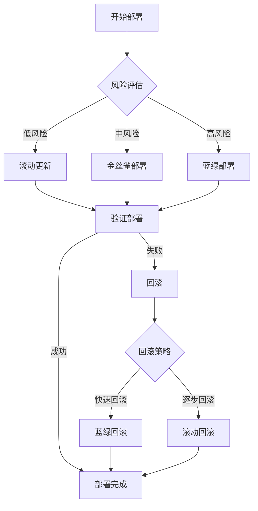

# Kubernetes 部署策略最佳实践

> **适用版本**: Kubernetes v1.25-v1.32 | **最后更新**: 2026-05 | **作者**: 系统生成 | **质量等级**: ⭐⭐⭐⭐⭐ 专家级

> **生产环境实战经验总结**: 基于大规模集群部署运维经验，涵盖从滚动更新到金丝雀部署的全方位最佳实践

---

## 概述

本指南提供生产环境 Kubernetes 部署策略配置的最佳实践，帮助团队构建安全、可靠、高效的部署流程。

### 目标读者

- **DevOps 工程师**: 了解部署策略设计和实施
- **SRE**: 掌握部署故障排查和回滚
- **平台工程师**: 学习部署自动化和工具集成

### 前置知识

- Kubernetes 核心概念（Deployment、Service、Ingress）
- 部署基础（滚动更新、回滚、版本管理）
- CI/CD 基础（持续集成、持续部署）

---

## 问题描述

### 常见问题

**问题1：部署中断**
- **症状**：部署过程中服务中断
- **原因**：部署策略配置不当，健康检查失败
- **影响**：服务中断，用户体验差

**问题2：回滚困难**
- **症状**：部署失败后难以回滚
- **原因**：版本管理不当，回滚策略缺失
- **影响**：故障恢复延迟，业务损失

**问题3：部署效率低**
- **症状**：部署耗时长，效率低下
- **原因**：部署流程不优化，资源不足
- **影响**：交付速度慢，竞争力下降

---

## 解决方案

### 部署策略设计

**部署策略对比**：

| 策略 | 描述 | 优点 | 缺点 | 适用场景 |
|------|------|------|------|---------|
| **滚动更新** | 逐步替换旧版本 | 零停机，资源效率高 | 版本共存，回滚慢 | 大多数应用 |
| **蓝绿部署** | 同时运行新旧版本 | 快速回滚，零停机 | 资源需求高 | 关键应用 |
| **金丝雀部署** | 小范围验证新版本 | 风险低，可验证 | 流程复杂 | 高风险应用 |
| **A/B测试** | 按条件路由流量 | 灵活，可验证 | 配置复杂 | 功能验证 |

**部署策略选择流程图**：



### 关键配置

#### 1. 滚动更新配置

```yaml
# 滚动更新配置
apiVersion: apps/v1
kind: Deployment
metadata:
  name: myapp
  namespace: production
spec:
  replicas: 3
  strategy:
    type: RollingUpdate
    rollingUpdate:
      maxUnavailable: 1
      maxSurge: 1
  selector:
    matchLabels:
      app: myapp
  template:
    metadata:
      labels:
        app: myapp
    spec:
      containers:
      - name: myapp
        image: myapp:v1.0
        ports:
        - containerPort: 8080
        resources:
          requests:
            memory: 256Mi
            cpu: 250m
          limits:
            memory: 512Mi
            cpu: 500m
        livenessProbe:
          httpGet:
            path: /healthz
            port: 8080
          initialDelaySeconds: 30
          periodSeconds: 10
        readinessProbe:
          httpGet:
            path: /ready
            port: 8080
          initialDelaySeconds: 5
          periodSeconds: 5
```

#### 2. 蓝绿部署配置

```yaml
# 蓝绿部署配置
apiVersion: v1
kind: Service
metadata:
  name: myapp
  namespace: production
spec:
  selector:
    app: myapp
    version: blue  # 切换到green进行蓝绿部署
  ports:
  - port: 80
    targetPort: 8080
---
# 蓝色版本
apiVersion: apps/v1
kind: Deployment
metadata:
  name: myapp-blue
  namespace: production
spec:
  replicas: 3
  selector:
    matchLabels:
      app: myapp
      version: blue
  template:
    metadata:
      labels:
        app: myapp
        version: blue
    spec:
      containers:
      - name: myapp
        image: myapp:v1.0
        ports:
        - containerPort: 8080
---
# 绿色版本
apiVersion: apps/v1
kind: Deployment
metadata:
  name: myapp-green
  namespace: production
spec:
  replicas: 3
  selector:
    matchLabels:
      app: myapp
      version: green
  template:
    metadata:
      labels:
        app: myapp
        version: green
    spec:
      containers:
      - name: myapp
        image: myapp:v2.0
        ports:
        - containerPort: 8080
```

#### 3. 金丝雀部署配置

```yaml
# 金丝雀部署配置
apiVersion: flagger.app/v1beta1
kind: Canary
metadata:
  name: myapp
  namespace: production
spec:
  targetRef:
    apiVersion: apps/v1
    kind: Deployment
    name: myapp
  progressDeadlineSeconds: 60
  analysis:
    interval: 30s
    threshold: 5
    maxWeight: 50
    stepWeight: 10
    metrics:
    - name: request-success-rate
      thresholdRange:
        min: 99
      interval: 1m
    - name: request-duration
      thresholdRange:
        max: 500
      interval: 30s
  service:
    port: 80
    targetPort: 8080
    gateways:
    - public-gateway.istio-system.svc.cluster.local
    hosts:
    - myapp.example.com
```

---

## 实施步骤

### 前置条件

**硬件要求**：
- 足够的资源支持多版本并行
- 网络支持流量路由

**软件要求**：
- Kubernetes：v1.25+
- Ingress Controller：Nginx/Traefik/Istio
- 金丝雀工具：Flagger（可选）

### 步骤1：配置滚动更新

```bash
#!/bin/bash
# 配置滚动更新

# 1. 创建Deployment
cat <<EOF | kubectl apply -f -
apiVersion: apps/v1
kind: Deployment
metadata:
  name: myapp
  namespace: production
spec:
  replicas: 3
  strategy:
    type: RollingUpdate
    rollingUpdate:
      maxUnavailable: 1
      maxSurge: 1
  selector:
    matchLabels:
      app: myapp
  template:
    metadata:
      labels:
        app: myapp
    spec:
      containers:
      - name: myapp
        image: myapp:v1.0
        ports:
        - containerPort: 8080
        livenessProbe:
          httpGet:
            path: /healthz
            port: 8080
          initialDelaySeconds: 30
          periodSeconds: 10
        readinessProbe:
          httpGet:
            path: /ready
            port: 8080
          initialDelaySeconds: 5
          periodSeconds: 5
EOF

# 2. 验证部署
kubectl get deployment myapp -n production
```

### 步骤2：配置蓝绿部署

```bash
#!/bin/bash
# 配置蓝绿部署

# 1. 创建蓝色版本
cat <<EOF | kubectl apply -f -
apiVersion: apps/v1
kind: Deployment
metadata:
  name: myapp-blue
  namespace: production
spec:
  replicas: 3
  selector:
    matchLabels:
      app: myapp
      version: blue
  template:
    metadata:
      labels:
        app: myapp
        version: blue
    spec:
      containers:
      - name: myapp
        image: myapp:v1.0
        ports:
        - containerPort: 8080
EOF

# 2. 创建绿色版本
cat <<EOF | kubectl apply -f -
apiVersion: apps/v1
kind: Deployment
metadata:
  name: myapp-green
  namespace: production
spec:
  replicas: 3
  selector:
    matchLabels:
      app: myapp
      version: green
  template:
    metadata:
      labels:
        app: myapp
        version: green
    spec:
      containers:
      - name: myapp
        image: myapp:v2.0
        ports:
        - containerPort: 8080
EOF

# 3. 创建Service
cat <<EOF | kubectl apply -f -
apiVersion: v1
kind: Service
metadata:
  name: myapp
  namespace: production
spec:
  selector:
    app: myapp
    version: blue
  ports:
  - port: 80
    targetPort: 8080
EOF

# 4. 验证部署
kubectl get deployment -n production
kubectl get service myapp -n production
```

### 步骤3：配置金丝雀部署

```bash
#!/bin/bash
# 配置金丝雀部署

# 1. 安装Flagger
helm repo add flagger https://flagger.app
helm repo update

helm install flagger flagger/flagger \
  --namespace flagger-system \
  --create-namespace \
  --set meshProvider=istio

# 2. 创建金丝雀配置
cat <<EOF | kubectl apply -f -
apiVersion: flagger.app/v1beta1
kind: Canary
metadata:
  name: myapp
  namespace: production
spec:
  targetRef:
    apiVersion: apps/v1
    kind: Deployment
    name: myapp
  progressDeadlineSeconds: 60
  analysis:
    interval: 30s
    threshold: 5
    maxWeight: 50
    stepWeight: 10
    metrics:
    - name: request-success-rate
      thresholdRange:
        min: 99
      interval: 1m
    - name: request-duration
      thresholdRange:
        max: 500
      interval: 30s
  service:
    port: 80
    targetPort: 8080
EOF

# 3. 验证配置
kubectl get canary -n production
```

### 步骤4：配置回滚策略

```bash
#!/bin/bash
# 配置回滚策略

# 1. 查看部署历史
kubectl rollout history deployment/myapp -n production

# 2. 回滚到上一版本
kubectl rollout undo deployment/myapp -n production

# 3. 回滚到指定版本
kubectl rollout undo deployment/myapp --to-revision=2 -n production

# 4. 验证回滚
kubectl get deployment myapp -n production
```

---

## 验证方法

### 自动化验证脚本

```bash
#!/bin/bash
# 部署策略验证脚本

echo "=== Kubernetes 部署策略配置验证 ==="
echo "验证时间: $(date)"
echo ""

# 1. 检查Deployment状态
echo "1. Deployment状态:"
kubectl get deployment -n production
echo ""

# 2. 检查滚动更新状态
echo "2. 滚动更新状态:"
kubectl rollout status deployment/myapp -n production
echo ""

# 3. 检查Service状态
echo "3. Service状态:"
kubectl get service -n production
echo ""

# 4. 检查Ingress状态
echo "4. Ingress状态:"
kubectl get ingress -n production
echo ""

# 5. 检查金丝雀状态
echo "5. 金丝雀状态:"
kubectl get canary -n production
echo ""

# 6. 测试部署
echo "6. 部署测试:"
kubectl run test-pod --image=busybox --rm -it --restart=Never -- wget -qO- http://myapp.production.svc.cluster.local
echo ""

echo "=== 验证完成 ==="
```

### 手动验证清单

**滚动更新验证**：
- [ ] 滚动更新配置正确
- [ ] 健康检查配置正确
- [ ] 更新过程无中断
- [ ] 回滚功能正常

**蓝绿部署验证**：
- [ ] 蓝绿版本配置正确
- [ ] 流量切换正常
- [ ] 快速回滚正常
- [ ] 资源使用合理

**金丝雀部署验证**：
- [ ] 金丝雀配置正确
- [ ] 流量路由正常
- [ ] 指标监控正常
- [ ] 自动回滚正常

---

## 常见陷阱

### 陷阱1：健康检查配置不当

**问题**：健康检查配置不当，导致部署中断。

**后果**：服务中断，用户体验差。

**正确做法**：
```yaml
# 配置合适的健康检查
apiVersion: apps/v1
kind: Deployment
spec:
  template:
    spec:
      containers:
      - name: myapp
        livenessProbe:
          httpGet:
            path: /healthz
            port: 8080
          initialDelaySeconds: 30
          periodSeconds: 10
        readinessProbe:
          httpGet:
            path: /ready
            port: 8080
          initialDelaySeconds: 5
          periodSeconds: 5
```

### 陷阱2：资源限制配置不当

**问题**：资源限制配置不当，导致部署失败。

**后果**：Pod无法调度，部署失败。

**正确做法**：
```yaml
# 配置合适的资源限制
apiVersion: apps/v1
kind: Deployment
spec:
  template:
    spec:
      containers:
      - name: myapp
        resources:
          requests:
            memory: 256Mi
            cpu: 250m
          limits:
            memory: 512Mi
            cpu: 500m
```

### 陷阱3：回滚策略缺失

**问题**：未配置回滚策略，导致故障恢复困难。

**后果**：故障恢复延迟，业务损失。

**正确做法**：
```bash
# 配置回滚策略
# 1. 保留部署历史
kubectl annotate deployment/myapp -n production \
  kubernetes.io/change-cause="Initial deployment"

# 2. 验证回滚功能
kubectl rollout undo deployment/myapp -n production
```

---

## 相关资源

### 官方文档
- [Deployment](https://kubernetes.io/docs/concepts/workloads/controllers/deployment/)
- [滚动更新](https://kubernetes.io/docs/concepts/workloads/controllers/deployment/#rolling-update-deployment)
- [回滚](https://kubernetes.io/docs/concepts/workloads/controllers/deployment/#rolling-back-a-deployment)

### 工具推荐
- [Flagger](https://flagger.app/) - 渐进式交付
- [Argo Rollouts](https://argoproj.github.io/rollouts/) - 渐进式交付
- [Istio](https://istio.io/) - 服务网格

### 参考案例
- [金丝雀部署](https://flagger.app/usage/progressive-delivery/)
- [蓝绿部署](https://kubernetes.io/docs/concepts/workloads/controllers/deployment/#rolling-update-deployment)

---

## 版本历史

| 版本 | 日期 | 变更说明 | 作者 |
|------|------|----------|------|
| v1.0 | 2026-05 | 初始版本 | 系统生成 |

---

**最佳实践原则**: 具体、可操作、可验证、可维护

---

**文档维护**：定期审查和更新，确保与Kubernetes版本和部署工具版本保持同步