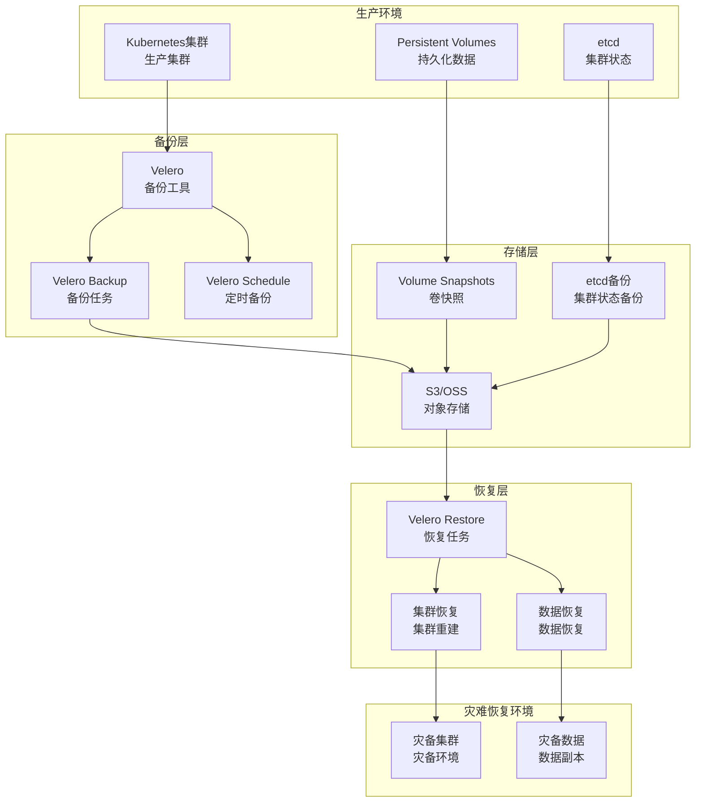

# Kubernetes 灾难恢复最佳实践

> **适用版本**: Kubernetes v1.25-v1.32 | **最后更新**: 2026-05 | **作者**: 系统生成 | **质量等级**: ⭐⭐⭐⭐⭐ 专家级

> **生产环境实战经验总结**: 基于大规模集群灾难恢复运维经验，涵盖从备份策略到业务连续性的全方位最佳实践

---

## 概述

本指南提供生产环境 Kubernetes 灾难恢复配置的最佳实践，帮助团队构建可靠、高效、可验证的灾难恢复体系。

### 目标读者

- **SRE**: 了解灾难恢复架构设计和故障演练
- **DevOps 工程师**: 掌握Velero部署和备份策略
- **平台工程师**: 学习业务连续性规划和恢复流程

### 前置知识

- Kubernetes 核心概念（Namespace、PV、PVC）
- 备份基础（全量备份、增量备份、恢复）
- 业务连续性基础（RTO、RPO）

---

## 问题描述

### 常见问题

**问题1：数据丢失**
- **症状**：重要数据丢失
- **原因**：备份策略不当，恢复流程失败
- **影响**：业务中断，数据丢失

**问题2：恢复时间长**
- **症状**：故障恢复时间长
- **原因**：恢复流程不优化，备份数据量大
- **影响**：业务中断时间长，损失大

**问题3：备份验证失败**
- **症状**：备份数据无法恢复
- **原因**：备份验证缺失，备份数据损坏
- **影响**：灾难恢复失败，业务损失

---

## 解决方案

### 灾难恢复架构设计

**灾难恢复架构设计原则**：
- **RTO最小化**：最小化恢复时间目标
- **RPO最小化**：最小化恢复点目标
- **自动化**：自动化备份和恢复流程
- **可验证**：定期验证备份有效性

**灾难恢复架构图**：



### 关键配置

#### 1. Velero配置

```yaml
# Velero配置
apiVersion: velero.io/v1
kind: BackupStorageLocation
metadata:
  name: default
  namespace: velero
spec:
  provider: aws
  objectStorage:
    bucket: my-velero-backup
    prefix: velero
  config:
    region: us-east-1
    profile: default
---
# VolumeSnapshotLocation配置
apiVersion: velero.io/v1
kind: VolumeSnapshotLocation
metadata:
  name: default
  namespace: velero
spec:
  provider: aws
  config:
    region: us-east-1
```

#### 2. 备份策略配置

```yaml
# 定时备份配置
apiVersion: velero.io/v1
kind: Schedule
metadata:
  name: daily-backup
  namespace: velero
spec:
  schedule: "0 2 * * *"
  template:
    includedNamespaces:
    - production
    - staging
    includedResources:
    - deployments
    - services
    - configmaps
    - secrets
    - persistentvolumeclaims
    - persistentvolumes
    storageLocation: default
    volumeSnapshotLocations:
    - default
    ttl: 720h
    snapshotVolumes: true
---
# 周备份配置
apiVersion: velero.io/v1
kind: Schedule
metadata:
  name: weekly-backup
  namespace: velero
spec:
  schedule: "0 3 * * 0"
  template:
    includedNamespaces:
    - "*"
    storageLocation: default
    volumeSnapshotLocations:
    - default
    ttl: 2160h
    snapshotVolumes: true
```

#### 3. 恢复策略配置

```yaml
# 恢复配置
apiVersion: velero.io/v1
kind: Restore
metadata:
  name: restore-20260519
  namespace: velero
spec:
  backupName: daily-backup-20260519
  includedNamespaces:
  - production
  restorePVs: true
  namespaceMapping:
    production: production-restored
```

---

## 实施步骤

### 前置条件

**硬件要求**：
- 对象存储：S3/OSS/GCS
- 网络：备份存储与集群网络互通

**软件要求**：
- Kubernetes：v1.25+
- Velero：v1.12+
- 云服务商CLI：AWS CLI/OSS CLI

### 步骤1：安装Velero

```bash
#!/bin/bash
# 安装Velero

# 1. 下载Velero
wget https://github.com/vmware-tanzu/velero/releases/download/v1.12.0/velero-v1.12.0-linux-amd64.tar.gz
tar -xvf velero-v1.12.0-linux-amd64.tar.gz
sudo mv velero-v1.12.0-linux-amd64/velero /usr/local/bin/

# 2. 创建备份存储凭证
cat <<EOF > credentials-velero
[default]
aws_access_key_id=<AWS_ACCESS_KEY_ID>
aws_secret_access_key=<AWS_SECRET_ACCESS_KEY>
EOF

# 3. 安装Velero
velero install \
  --provider aws \
  --plugins velero/velero-plugin-for-aws:v1.8.0 \
  --bucket my-velero-backup \
  --backup-location-config region=us-east-1 \
  --snapshot-location-config region=us-east-1 \
  --secret-file ./credentials-velero

# 4. 验证安装
velero version
```

### 步骤2：配置备份策略

```bash
#!/bin/bash
# 配置备份策略

# 1. 创建每日备份
cat <<EOF | kubectl apply -f -
apiVersion: velero.io/v1
kind: Schedule
metadata:
  name: daily-backup
  namespace: velero
spec:
  schedule: "0 2 * * *"
  template:
    includedNamespaces:
    - production
    - staging
    includedResources:
    - deployments
    - services
    - configmaps
    - secrets
    - persistentvolumeclaims
    - persistentvolumes
    storageLocation: default
    volumeSnapshotLocations:
    - default
    ttl: 720h
    snapshotVolumes: true
EOF

# 2. 创建每周备份
cat <<EOF | kubectl apply -f -
apiVersion: velero.io/v1
kind: Schedule
metadata:
  name: weekly-backup
  namespace: velero
spec:
  schedule: "0 3 * * 0"
  template:
    includedNamespaces:
    - "*"
    storageLocation: default
    volumeSnapshotLocations:
    - default
    ttl: 2160h
    snapshotVolumes: true
EOF

# 3. 验证备份策略
velero schedule get
```

### 步骤3：配置备份验证

```bash
#!/bin/bash
# 配置备份验证

# 1. 创建备份验证脚本
cat <<EOF > verify-backup.sh
#!/bin/bash
# 备份验证脚本

echo "=== 备份验证开始 ==="
echo "验证时间: \$(date)"

# 1. 检查备份状态
echo "1. 检查备份状态:"
velero backup get

# 2. 检查最新备份
echo "2. 检查最新备份:"
LATEST_BACKUP=\$(velero backup get --output json | jq -r '.items[0].metadata.name')
echo "最新备份: \$LATEST_BACKUP"

# 3. 验证备份详情
echo "3. 验证备份详情:"
velero backup describe \$LATEST_BACKUP

# 4. 检查备份日志
echo "4. 检查备份日志:"
velero backup logs \$LATEST_BACKUP

echo "=== 备份验证完成 ==="
EOF

chmod +x verify-backup.sh
```

### 步骤4：配置恢复演练

```bash
#!/bin/bash
# 配置恢复演练

# 1. 创建恢复演练脚本
cat <<EOF > restore-drill.sh
#!/bin/bash
# 恢复演练脚本

echo "=== 恢复演练开始 ==="
echo "演练时间: \$(date)"

# 1. 选择备份
echo "1. 选择备份:"
LATEST_BACKUP=\$(velero backup get --output json | jq -r '.items[0].metadata.name')
echo "选择备份: \$LATEST_BACKUP"

# 2. 创建恢复任务
echo "2. 创建恢复任务:"
velero restore create restore-\$(date +%Y%m%d) \
  --from-backup \$LATEST_BACKUP \
  --namespace-mappings production:production-drill

# 3. 等待恢复完成
echo "3. 等待恢复完成:"
velero restore wait restore-\$(date +%Y%m%d)

# 4. 验证恢复结果
echo "4. 验证恢复结果:"
kubectl get all -n production-drill

echo "=== 恢复演练完成 ==="
EOF

chmod +x restore-drill.sh
```

---

## 验证方法

### 自动化验证脚本

```bash
#!/bin/bash
# 灾难恢复配置验证脚本

echo "=== Kubernetes 灾难恢复配置验证 ==="
echo "验证时间: $(date)"
echo ""

# 1. 检查Velero状态
echo "1. Velero状态:"
velero version
echo ""

# 2. 检查备份存储位置
echo "2. 备份存储位置:"
velero backup-location get
echo ""

# 3. 检查备份策略
echo "3. 备份策略:"
velero schedule get
echo ""

# 4. 检查备份状态
echo "4. 备份状态:"
velero backup get
echo ""

# 5. 检查恢复任务
echo "5. 恢复任务:"
velero restore get
echo ""

echo "=== 验证完成 ==="
```

### 手动验证清单

**备份验证**：
- [ ] Velero安装成功
- [ ] 备份存储位置配置正确
- [ ] 备份策略配置正确
- [ ] 备份任务执行正常

**恢复验证**：
- [ ] 恢复流程配置正确
- [ ] 恢复任务执行正常
- [ ] 恢复数据完整
- [ ] 恢复后服务正常

**演练验证**：
- [ ] 恢复演练定期执行
- [ ] 演练结果记录完整
- [ ] 演练问题及时修复
- [ ] 演练报告定期生成

---

## 常见陷阱

### 陷阱1：备份策略不当

**问题**：备份策略不当，导致数据丢失。

**后果**：重要数据丢失，业务中断。

**正确做法**：
```yaml
# 配置合适的备份策略
apiVersion: velero.io/v1
kind: Schedule
metadata:
  name: daily-backup
spec:
  schedule: "0 2 * * *"  # 每天凌晨2点
  template:
    includedNamespaces:
    - production
    snapshotVolumes: true  # 包含卷快照
    ttl: 720h  # 保留30天
```

### 陷阱2：备份验证缺失

**问题**：未验证备份有效性，导致恢复失败。

**后果**：灾难恢复失败，业务损失。

**正确做法**：
```bash
# 定期验证备份
# 1. 检查备份状态
velero backup get

# 2. 验证备份详情
velero backup describe <backup-name>

# 3. 检查备份日志
velero backup logs <backup-name>

# 4. 执行恢复演练
velero restore create --from-backup <backup-name>
```

### 陷阱3：恢复流程不优化

**问题**：恢复流程不优化，导致恢复时间长。

**后果**：业务中断时间长，损失大。

**正确做法**：
```bash
# 优化恢复流程
# 1. 优先恢复关键服务
velero restore create \
  --include-namespaces production \
  --include-resources deployments,services

# 2. 并行恢复
velero restore create \
  --restore-volumes=true \
  --namespace-mappings production:production-restored

# 3. 验证恢复结果
kubectl get all -n production-restored
```

---

## 相关资源

### 官方文档
- [Velero](https://velero.io/docs/)
- [Kubernetes备份](https://kubernetes.io/docs/concepts/storage/persistent-volumes/)
- [灾难恢复](https://kubernetes.io/docs/concepts/workloads/controllers/deployment/)

### 工具推荐
- [Velero](https://velero.io/) - 备份和恢复
- [Kasten](https://www.kasten.io/) - 数据管理
- [Portworx](https://portworx.com/) - 云原生存储

### 参考案例
- [Velero部署](https://velero.io/docs/main/basic-install/)
- [备份策略](https://velero.io/docs/main/backup-reference/)
- [恢复流程](https://velero.io/docs/main/restore-reference/)

---

## 版本历史

| 版本 | 日期 | 变更说明 | 作者 |
|------|------|----------|------|
| v1.0 | 2026-05 | 初始版本 | 系统生成 |

---

**最佳实践原则**: 具体、可操作、可验证、可维护

---

**文档维护**：定期审查和更新，确保与Velero和Kubernetes版本保持同步