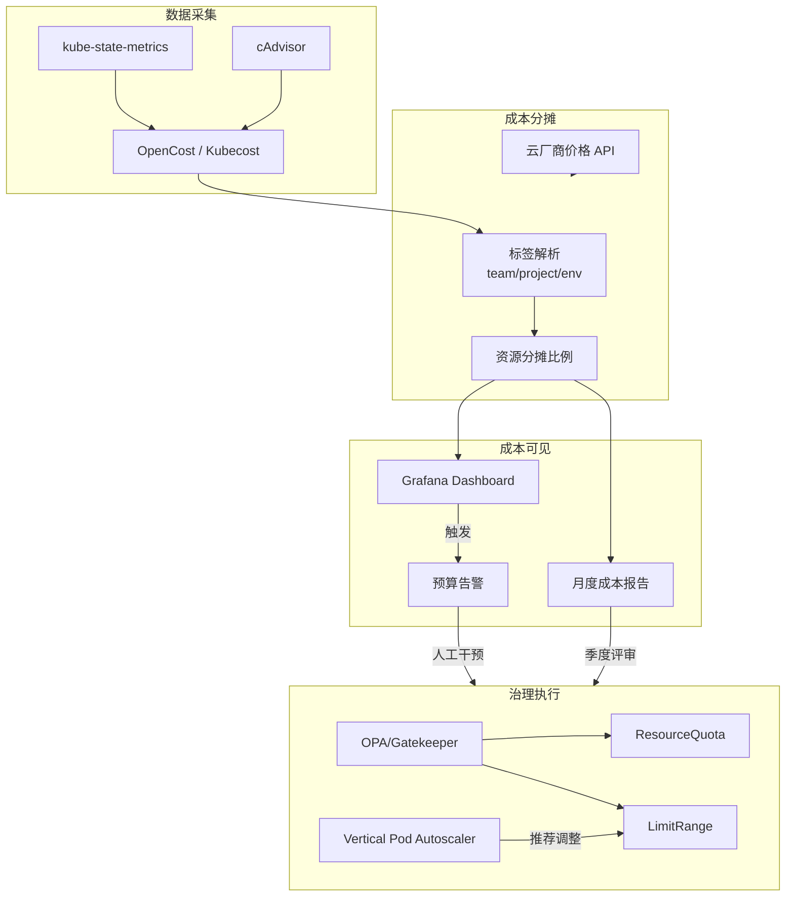
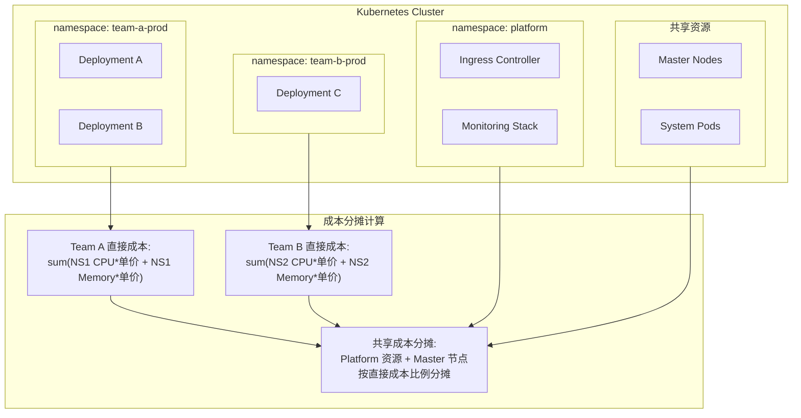
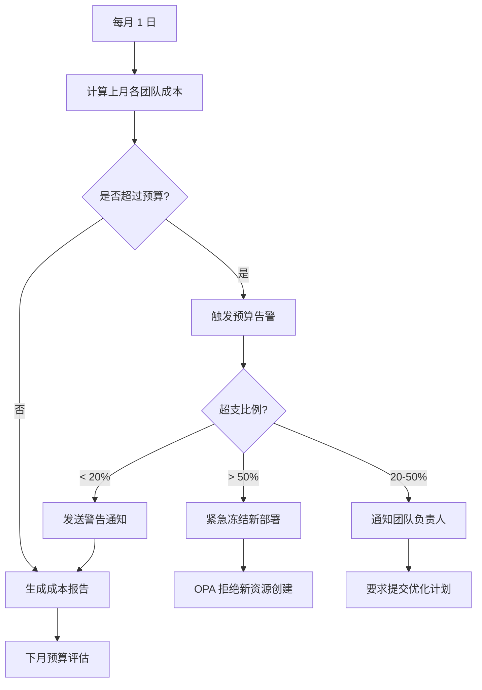
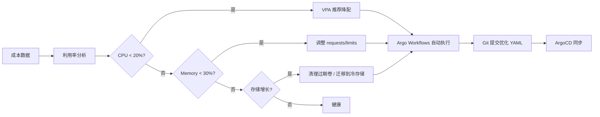

> **生产环境安全提示**
>
> 本文档包含可直接执行的运维命令。执行前请确认：当前目标集群与 Namespace 是否正确；是否具备足够的 RBAC 权限；是否已在非生产环境验证。命令风险等级标注：🔴 高风险（可能造成数据丢失或服务中断）、🟡 中风险（会修改集群状态，但通常可回滚）、🟢 低风险/只读（信息收集，无副作用）。


# FinOps 资源治理

## 概述

[[entities/kubernetes.md|Kubernetes]] 的多租户架构让资源分配变得复杂：平台团队提供集群，业务团队部署工作负载，但"谁用了多少资源、花了多少钱"往往是一笔糊涂账。FinOps 提供成本可见性与优化方法，平台治理提供资源配额与策略执行。本页连接 domain-07-platform-engineering 的治理框架与 domain-11-production-operations 的 FinOps 实践，展示如何在多租户 K8s 环境中构建"成本可见 → 预算约束 → 自动优化"的闭环治理体系。

## 核心连接

| 域 | 核心能力 | FinOps 治理的桥接作用 |
|---|---|---|
| **Platform Engineering (domain-07)** | 资源配额、命名空间模板、策略执行（OPA/Gatekeeper） | 治理层提供资源分配的"硬约束"，防止超支 |
| **Production Operations (domain-11)** | 成本分析、预算管理、利用率优化 | FinOps 层提供成本分配的"软约束"，驱动优化行为 |

**关键洞察：成本治理不是单纯的技术问题，而是组织问题。** 技术层（配额、限制）解决"不能超支"，但文化层（Showback、团队成本可见）解决"不想超支"。两者缺一不可。

## 架构图

### 成本治理闭环架构



### 多租户成本分摊模型



### 预算门控流程



## 核心机制

### 成本标签策略

```yaml
# 统一标签策略：所有资源必须携带
metadata:
  labels:
    # 组织维度
    cost-center: cc-001
    team: platform
    project: order-service
    owner: alice@example.com
    # 环境维度
    environment: production
    # 技术维度
    app.kubernetes.io/name: order-service
    app.kubernetes.io/component: api
    app.kubernetes.io/part-of: e-commerce
    # FinOps 维度
    finops.billing: chargeback
    finops.budget-group: production-critical
```

**标签缺失治理（OPA Policy）：**

```rego
# OPA Gatekeeper 约束：禁止缺失成本标签的资源创建
package k8srequiredlabels

violation[{"msg": msg}] {
  input.review.object.metadata.labels["cost-center"]
  input.review.object.metadata.labels["team"]
  input.review.object.metadata.labels["environment"]
  not all_required_labels_present
  msg := "Resource must have cost-center, team, and environment labels"
}

all_required_labels_present {
  input.review.object.metadata.labels["cost-center"]
  input.review.object.metadata.labels["team"]
  input.review.object.metadata.labels["environment"]
}
```

### 资源配额与成本关联

```yaml
# ResourceQuota：将技术配额转化为成本预算
apiVersion: v1
kind: ResourceQuota
metadata:
  name: team-a-quota
  namespace: team-a-prod
  annotations:
    finops.budget-monthly: "5000"  # USD
    finops.budget-alert-threshold: "80"
spec:
  hard:
    # CPU: 100 cores * $30/core/month = $3000
    requests.cpu: "100"
    limits.cpu: "200"
    # Memory: 400Gi * $4/Gi/month = $1600
    requests.memory: 400Gi
    limits.memory: 800Gi
    # Storage: 2000Gi * $0.1/Gi/month = $200
    requests.storage: 2000Gi
    # GPU: 4 * $2000/GPU/month = $8000 (需单独审批)
    nvidia.com/gpu: "0"
    # Pod 数量限制
    pods: "200"
    # LoadBalancer: $15/month * 5 = $75
    services.loadbalancers: "5"
```

**配额到成本的映射：**

| 资源类型 | 单价（AWS 参考） | 配额示例 | 月度成本 |
|---|---|---|---|
| CPU (request) | $30/vCPU/月 | 100 vCPU | $3,000 |
| Memory | $4/Gi/月 | 400 Gi | $1,600 |
| Storage (SSD) | $0.1/Gi/月 | 2,000 Gi | $200 |
| LoadBalancer | $15/月 | 5 个 | $75 |
| **合计** | | | **$4,875** |

### 成本分摊算法

```
直接成本 = Σ(容器实际使用资源 × 资源单价)

共享成本分摊:
  平台资源成本 (监控/日志/DNS) = $2000/月
  分摊比例 = 团队直接成本 / 总直接成本
  Team A 分摊 = $2000 × ($3000 / $10000) = $600

总成本 = 直接成本 + 分摊共享成本
```

**OpenCost 分摊配置：**

```yaml
# OpenCost Helm values
opencost:
  exporter:
    defaultCurrency: USD
  customPricing:
    enabled: true
    costModel:
      CPU: 30.0
      RAM: 4.0
      storage: 0.1
      GPU: 2000.0
  allocations:
    # 按标签聚合
    aggregateBy:
      - namespace
      - label:team
      - label:project
    # 共享资源分摊
    sharedOverhead:
      - namespace: kube-system
      - namespace: monitoring
      - namespace: ingress-nginx
    shareSplit: weighted  # 按权重分摊
```

### 自动成本优化策略



**VPA 成本优化模式：**

```yaml
# VPA 配置：自动推荐资源调整
apiVersion: autoscaling.k8s.io/v1
kind: VerticalPodAutoscaler
metadata:
  name: cost-optimizer
spec:
  targetRef:
    apiVersion: apps/v1
    kind: Deployment
    name: web-service
  updatePolicy:
    updateMode: "Off"  # 仅推荐，不自动执行（生产安全）
  resourcePolicy:
    containerPolicies:
      - containerName: "*"
        minAllowed:
          cpu: 50m
          memory: 64Mi
        maxAllowed:
          cpu: 4
          memory: 8Gi
        controlledResources: ["cpu", "memory"]
        controlledValues: RequestsAndLimits
```

## 最佳实践

### 1. 分层预算管理

```
组织预算层级:
┌─────────────────────────────────────────┐
│  公司级预算: $500K/月                    │
│  → 由 CFO / FinOps 团队管理              │
├─────────────────────────────────────────┤
│  部门级预算: $100K/月 (Engineering)      │
│  → 由 VP Engineering 管理                │
├─────────────────────────────────────────┤
│  团队级预算: $10K/月 (Platform Team)     │
│  → 由 Team Lead 管理                     │
├─────────────────────────────────────────┤
│  项目级预算: $2K/月 (监控平台)           │
│  → 由 Project Owner 管理                 │
├─────────────────────────────────────────┤
│  环境级配额: $500/月 (dev namespace)     │
│  → 由 ResourceQuota 硬限制               │
└─────────────────────────────────────────┘
```

### 2. Showback vs Chargeback

| 模式 | 机制 | 效果 | 适用阶段 |
|---|---|---|---|
| **Showback** | 展示成本，不实际收费 | 提高意识，驱动自优化 | FinOps 初期 |
| **Chargeback** | 按实际使用向团队收费 | 强约束，直接激励 | FinOps 成熟 |
| **Hybrid** | Showback + 超限 Chargeback | 平衡透明度与约束 | 过渡期 |

```yaml
# Showback 报表配置（OpenCost + Grafana）
opencost:
  ui:
    enabled: true
  prometheus:
    internal:
      enabled: true
  # 生成按团队聚合的成本报告
  reports:
    - name: team-monthly
      schedule: "0 9 1 * *"  # 每月 1 日上午 9 点
      aggregateBy:
        - label:team
        - namespace
      window: 30d
      format: csv
      email:
        to: finops@example.com
```

### 3. 成本异常检测

```promql
# 成本异常：某团队成本突增 > 50%
(
  sum(
    opencost_container_cpu_allocation{team="platform"}
  )
  -
  sum(
    opencost_container_cpu_allocation{team="platform"} offset 7d
  )
)
/
sum(
  opencost_container_cpu_allocation{team="platform"} offset 7d
)
> 0.5
```

```yaml
# PrometheusRule：成本异常告警
apiVersion: monitoring.coreos.com/v1
kind: PrometheusRule
metadata:
  name: cost-anomaly-alerts
spec:
  groups:
    - name: cost-anomaly
      rules:
        - alert: CostSpikeDetected
          expr: |
            (
              sum by (team) (
                opencost_container_cpu_allocation
                + opencost_container_memory_allocation
              )
              -
              sum by (team) (
                opencost_container_cpu_allocation offset 7d
                + opencost_container_memory_allocation offset 7d
              )
            )
            /
            sum by (team) (
              opencost_container_cpu_allocation offset 7d
              + opencost_container_memory_allocation offset 7d
            )
            > 0.5
          for: 1h
          labels:
            severity: warning
          annotations:
            summary: "团队 {{ $labels.team }} 成本突增超过 50%"
            description: "请检查是否有资源泄漏或异常扩容"
```

### 4. 闲置资源清理

``` bash
# 🟢 低风险：只读/信息收集，通常无副作用
# 检测闲置 PV（7 天无 IO）
kubectl get pv -o json | jq '
  .items[] |
  select(.status.phase == "Bound") |
  select(.metadata.annotations["pv.kubernetes.io/bound-by-controller"] == "yes") |
  {name: .metadata.name, claim: .spec.claimRef.name, age: .metadata.creationTimestamp}
'

# 检测闲置 LoadBalancer
kubectl get svc --all-namespaces -o json | jq '
  .items[] |
  select(.spec.type == "LoadBalancer") |
  {name: .metadata.name, namespace: .metadata.namespace, created: .metadata.creationTimestamp}
'
```
**自动化清理策略：**
- **闲置 Namespace**：30 天无 Pod 活动的 dev namespace 自动删除
- **闲置 PV**：通过 CSI 监控 IO，7 天零 IO 的 PV 自动快照后删除
- **闲置 LoadBalancer**：通过流量监控，7 天零流量的 LB 自动释放

## 工具推荐

| 工具 | 角色 | 与 FinOps 治理的集成 |
|---|---|---|
| **OpenCost** | 成本分配 | CNCF 开源，与 Prometheus 集成，支持多集群 |
| **Kubecost** | 成本分析 | OpenCost 的商业版，UI 更丰富 |
| **OPA/Gatekeeper** | 策略执行 | 强制资源标签、配额合规 |
| **VPA** | 资源优化 | 自动推荐 requests/limits 调整 |
| **Falco** | 异常检测 | 检测资源创建异常（如超大 Pod） |
| **Argo Workflows** | 自动化 | 定时执行成本优化任务 |
| **Grafana** | 可视化 | 成本 Dashboard 和告警 |

## 张力与权衡

| 张力 | 详情 |
|---|---|
| **成本精确度 vs 复杂度** | 精确到 Pod 级的成本分摊需要大量标签管理和监控数据采集。在大型集群（> 10K Pod）中，这带来显著的 Prometheus 存储和查询开销。 |
| **Showback 透明度 vs 团队抵触** | 公开各团队成本可能引发"为什么我的团队成本最高"的政治问题。需要配套"成本优化支持"而非单纯"成本问责"。 |
| **ResourceQuota 硬限制 vs 业务弹性** | 严格的配额在防止超支的同时，可能阻碍业务突发扩容（如营销活动）。需要设计"弹性配额"（基础配额 + 临时申请）。 |
| **共享成本分摊公平性** | 平台团队（监控、日志、Ingress）的成本如何公平分摊？按 CPU 用量？按团队数量？按业务重要性？没有完美方案。 |
| **成本优化与性能保证** | 压缩资源 requests 可以降低成本，但可能导致节点过度销售（oversubscription），在流量突增时引发 OOM 或 CPU 节流。 |

## 开放问题

- **云厂商账单 vs K8s 资源消耗的差异：** 云厂商按节点计费，但 K8s 按容器分配资源。节点未使用的资源（碎片）如何分摊给团队？
- **Spot/Preemptible 实例的成本波动：** 使用 Spot 实例大幅降低成本，但实例回收导致 Pod 迁移。如何在成本报告中反映这种"不稳定性"？
- **多集群成本统一视图：** 跨云、跨集群的成本如何统一货币、统一口径、统一展示？
- **FinOps 与碳足迹：** 成本优化（使用更少资源）通常也减少碳排放。是否可以将成本治理与绿色计算指标结合？

## 相关 Domain

- domain-07-platform-engineering/03-governance
- domain-07-platform-engineering/governance
- domain-11-production-operations/01-finops
- [[concepts/observability-finops.md|observability-finops]]

> *This page synthesizes patterns across multiple sources and domains.* ^[inferred]
## Related

- [[domain-17-system-foundation/topic-dictionary/networking/ingress.md|Ingress]]
- [[domain-17-system-foundation/topic-dictionary/fundamentals/namespaces.md|命名空间]]
- [[entities/prometheus.md|Prometheus (entities)]]
- [[entities/argo.md|Argo Workflows]]


<!-- risk-assessed -->
