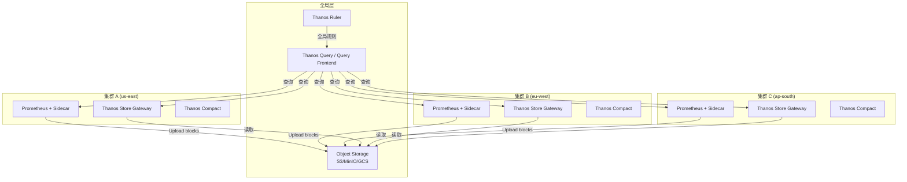
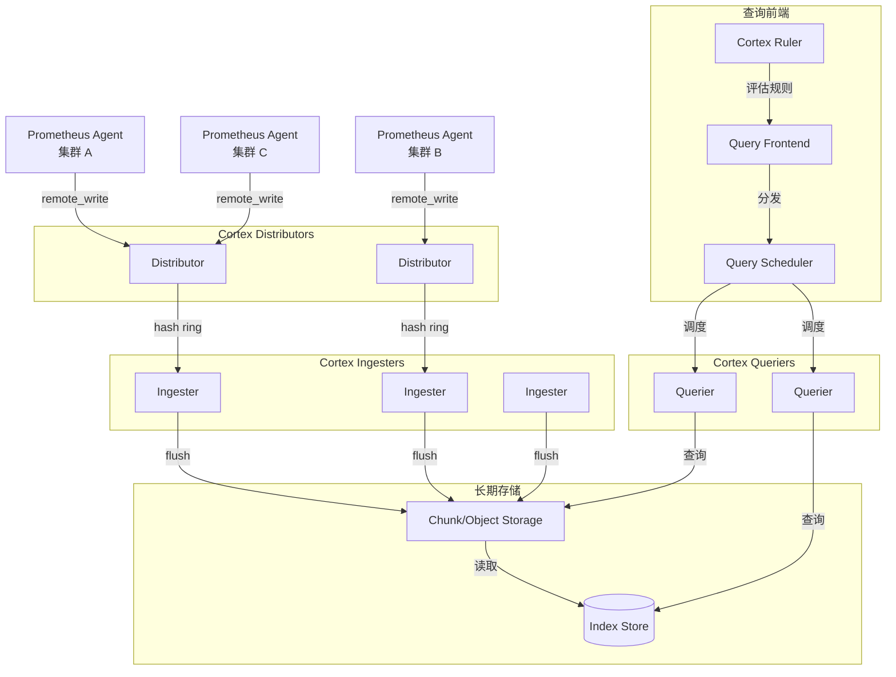
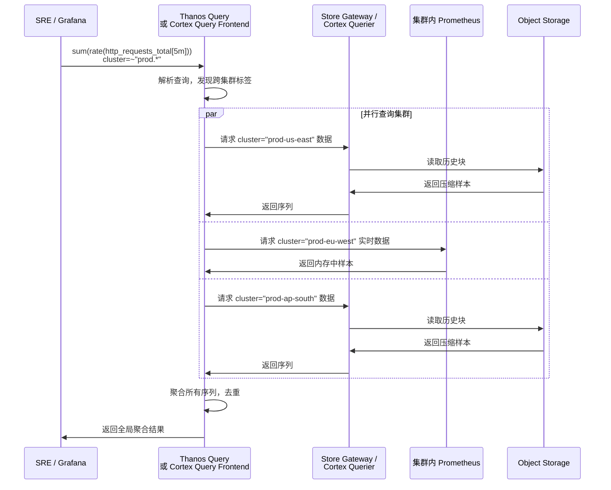

# 多集群可观测性联邦架构

## 概述

现代 [[entities/kubernetes.md|Kubernetes]] 平台通常由多个集群组成——按环境划分（开发/测试/生产）、按地域划分（Region A/B/C）、按团队划分（平台/业务/AI）。每个集群独立运行 [[entities/prometheus.md|Prometheus]]，但运维团队需要一个统一的"全局视图"来回答跨集群问题："所有生产集群的 API Server 延迟趋势如何？""跨地域的服务调用链路是否健康？" 本页连接 domain-03-networking-traffic 的多集群网络拓扑与 domain-06-observability 的联邦监控系统，展示 Thanos 和 Cortex 如何实现真正的多集群可观测性联邦。

## 核心连接

| 域 | 核心能力 | 联邦监控的桥接作用 |
|---|---|---|
| **Networking (domain-03)** | 多集群网络（[[entities/cilium.md|Cilium]] [[domain-17-system-foundation/topic-dictionary/networking/cluster-mesh.md|Cluster Mesh]]）、流量路由 | 联邦查询需要跨集群网络可达，mTLS 保障安全传输 |
| **Observability (domain-06)** | 指标采集、告警、长期存储 | 联邦层聚合多个 Prometheus 数据，提供统一查询和全局告警 |

**关键洞察：多集群可观测性的核心矛盾是"分布式采集"与"集中式洞察"的冲突。** 每个集群的 Prometheus 是自治的（高可用、本地存储、独立告警），但全局视图需要打破集群边界。Thanos 和 Cortex 通过"中心化查询 + 分布式存储"的架构解决这一矛盾。

## 架构图

### Thanos 联邦架构



### Cortex 联邦架构



### 跨集群查询数据流



## 核心机制

### Thanos vs Cortex 对比

| 维度 | Thanos | Cortex |
|---|---|---|
| **架构哲学** | 保留 Prometheus，增强其能力 | 替换 Prometheus 存储，集中式 ingestion |
| **数据路径** | Prometheus 本地存储 + 异步上传对象存储 | Prometheus remote_write → Cortex Ingester |
| **查询模式** | 去重合并（StoreAPI + PromQL） | 分布式查询（Querier + 存储后端） |
| **多租户** | 有限（通过 label 隔离） | 原生多租户（tenant ID 隔离） |
| **水平扩展** | Query 可扩展，存储依赖对象存储 | 全组件水平可扩展 |
| **适用场景** | < 50 集群，需要保留本地 Prometheus | > 50 集群，SaaS 化监控平台 |

### 关键组件详解

#### Thanos Sidecar

```yaml
# Prometheus + Thanos Sidecar 部署片段
containers:
  - name: prometheus
    image: prom/prometheus:v3.2.1
    args:
      - --config.file=/etc/prometheus/prometheus.yml
      - --storage.tsdb.path=/prometheus
      - --storage.tsdb.min-block-duration=2h
      - --storage.tsdb.max-block-duration=2h
  - name: thanos-sidecar
    image: thanosio/thanos:v0.34.0
    args:
      - sidecar
      - --tsdb.path=/prometheus
      - --objstore.config-file=/etc/thanos/bucket.yml
      - --prometheus.url=http://localhost:9090
```

Sidecar 职责：
1. 监听 Prometheus TSDB 块完成事件
2. 将完成的块上传至对象存储（S3/GCS/MinIO）
3. 暴露 StoreAPI，使 Thanos Query 能实时查询 Prometheus 内存数据

#### Thanos Query 全局查询

```promql
# 跨所有集群的 API Server 请求延迟
histogram_quantile(0.99,
  sum by (cluster, le) (
    rate(apiserver_request_duration_seconds_bucket[5m])
  )
)

# 按区域聚合的 Pod CPU 使用率
sum by (cluster, region) (
  rate(container_cpu_usage_seconds_total[5m])
)
```

Query 自动处理：
- **去重**：同一指标来自 Sidecar（实时）和 Store Gateway（历史），Query 自动选择去重
- **部分响应**：某个集群不可达时，返回可用集群数据 + 警告
- **向下采样**：长期数据自动使用 5m/1h 聚合，加速查询

### Cortex 多租户架构

```yaml
# Cortex 多租户 remote_write 配置
global:
  external_labels:
    cluster: prod-us-east
    tenant: platform-team

remote_write:
  - url: http://cortex-gateway/api/prom/push
    headers:
      X-Scope-OrgID: platform-team
    queue_config:
      capacity: 10000
      max_samples_per_send: 2000
```

Cortex 的 `X-Scope-OrgID` 头实现硬多租户隔离：
- 每个 tenant 的数据在 Ingester 和对象存储中完全隔离
- 查询时必须在 Header 中指定 OrgID
- Grafana 可通过 Data Source 配置自动注入 OrgID

## 最佳实践

### 1. 分层联邦策略

```
三层监控联邦:
┌─────────────────────────────────────────┐
│  层1: 集群本地 Prometheus                │
│  → 实时告警（< 1min 延迟）               │
│  → 15 天本地存储                         │
│  → 自治运行，不依赖中心                   │
├─────────────────────────────────────────┤
│  层2: 区域级 Thanos/Cortex               │
│  → 区域内多集群聚合                       │
│  → 长期存储（90 天）                     │
│  → 区域级 SLO 监控                        │
├─────────────────────────────────────────┤
│  层3: 全局级 Thanos Query                │
│  → 跨区域/跨云统一视图                    │
│  → 全局告警（延迟可接受 > 5min）          │
│  → 容量规划与成本分析                     │
└─────────────────────────────────────────┘
```

### 2. 网络与安全设计

多集群联邦需要解决跨集群网络连通性：

| 方案 | 实现 | 适用场景 |
|---|---|---|
| **VPN / 专线** | 集群间 VPC Peering | 同云厂商多区域 |
| **Submariner** | K8s 原生跨集群网络 | 混合云/多厂商 |
| **Cilium Cluster Mesh** | eBPF 跨集群路由 | 已有 Cilium 环境 |
| **API Gateway + mTLS** | 仅暴露 Query API | 高安全要求 |

**安全要点：**
- Thanos StoreAPI 和 Cortex Distributor 启用 TLS/mTLS
- 使用 Istio 或 Cilium 的跨集群 mTLS 加密联邦流量
- 限制 Query 组件只能读取，禁止通过联邦接口写入

### 3. 高基数问题治理

多集群联邦放大了高基数（high cardinality）问题：

```promql
# 危险：跨 50 集群查询，每个集群 1000 Pod，5min 内产生 250K 序列
container_cpu_usage_seconds_total{pod=~".*"}

# 安全：先聚合，再查询
sum by (cluster, namespace) (
  rate(container_cpu_usage_seconds_total[5m])
)
```

**治理策略：**
- 全局标签标准化：`cluster`、`region`、`environment`、`team`
- 丢弃无用标签：Drop `instance`、`pod_template_hash` 等高频变化标签
-  Recording Rules：将高频查询预聚合为低频指标

### 4. 告警分层

| 层级 | 工具 | 延迟 | 示例 |
|---|---|---|---|
| **集群本地** | Prometheus Alertmanager | < 1min | Pod OOM、节点 NotReady |
| **区域联邦** | Thanos Ruler / Cortex Ruler | 2-5min | 区域级 SLO 违反 |
| **全局联邦** | Thanos Ruler / 外部系统 | 5-15min | 跨集群依赖延迟、全局容量 |

```yaml
# Thanos Ruler 全局规则示例
groups:
  - name: global_slo
    rules:
      - alert: GlobalErrorBudgetBurn
        expr: |
          (
            sum by (service) (
              rate(http_requests_total{status=~"5.."}[1h])
            )
            /
            sum by (service) (
              rate(http_requests_total[1h])
            )
          ) > 0.001
        for: 5m
        labels:
          severity: critical
        annotations:
          summary: "服务 {{ $labels.service }} 全局错误率超过 SLO"
```

### 5. 成本优化

| 手段 | 效果 | 实现 |
|---|---|---|
| 块压缩 (Thanos) | 减少 70% 存储 | 2h TSDB 块 → 压缩上传 |
| 查询缓存 | 减少 50% 计算 | Query Frontend memcached |
| 向下采样 | 加速历史查询 | 5m/1h 分辨率自动降采样 |
| 保留策略 | 控制存储增长 | 全局 1 年，区域 90 天，本地 15 天 |

## 工具推荐

| 工具 | 角色 | 适用场景 |
|---|---|---|
| **Thanos** | Prometheus 联邦扩展 | 已有 Prometheus，< 50 集群 |
| **Cortex** | 集中式多租户监控 | 大规模/SaaS，> 50 集群 |
| **Grafana Mimir** | Cortex 的分支 | Grafana Cloud 首选，功能对齐 |
| **VictoriaMetrics** | 高性能替代 | 单机高性能，资源受限环境 |
| **Submariner** | 跨集群网络 | 需要 Pod 级跨集群通信 |
| **Cilium Cluster Mesh** | eBPF 跨集群 | 已有 Cilium，追求性能 |
| **Promxy** | 轻量联邦 | 仅需跨集群查询，不需要长期存储 |

## 张力与权衡

| 张力 | 详情 |
|---|---|
| **实时性 vs 一致性** | 联邦查询聚合多个集群数据，网络延迟导致不同集群的"同一时刻"数据有时间差。全局视图的实时性天然弱于单集群。 |
| **自治性 vs 集中化** | 集群本地 Prometheus 自治（无外部依赖）是 K8s 设计哲学，但联邦监控需要依赖中心存储和网络。灾备设计需考虑联邦层问题时的降级方案。 |
| **查询复杂度 vs 性能** | 跨集群 PromQL 查询（如 `sum by (cluster) (...)`) 需要在联邦层拉取所有原始序列再聚合。高基数场景下查询可能超时。Recording Rules 是必要优化。 |
| **多租户隔离 vs 全局视图** | Cortex 的硬多租户阻止跨租户查询，但平台团队需要全局视图。需要设计"超级租户"或聚合层来平衡隔离与可见性。 |
| **对象存储成本 vs 查询速度** | 历史数据放在对象存储（低成本）但查询慢，热数据放在 SSD（高成本）但查询快。Thanos 的 Store Gateway 缓存和 Cortex 的 Ingester 缓存是关键。 |

## 开放问题

- **联邦链路问题：** 当某集群与联邦中心断联时，该集群的数据是否能在恢复后补录？Thanos 的"延迟上传"机制如何处理？
- **跨集群追踪关联：** 指标联邦成熟，但跨集群的分布式追踪（Trace）联邦仍不成熟。如何关联集群 A 的入口到集群 B 的服务调用？
- **联邦层的单点问题：** Thanos Query 或 Cortex Query Frontend 成为事实上的单点。如何设计联邦层自身的高可用？
- **多云联邦成本：** 跨云厂商的联邦查询产生巨额出口流量费用。是否有"边缘聚合 + 中心查询"的架构来降低带宽成本？

## 相关 Domain

- domain-03-networking-traffic/00-core-k8s-networking
- domain-03-networking-traffic/02-cni
- domain-06-observability/02-metrics
- domain-06-observability/07-tools
- Cilium eBPF × 可观测性.md|Cilium eBPF × 可观测性]]

> *This page synthesizes patterns across multiple sources and domains.* ^[inferred]
