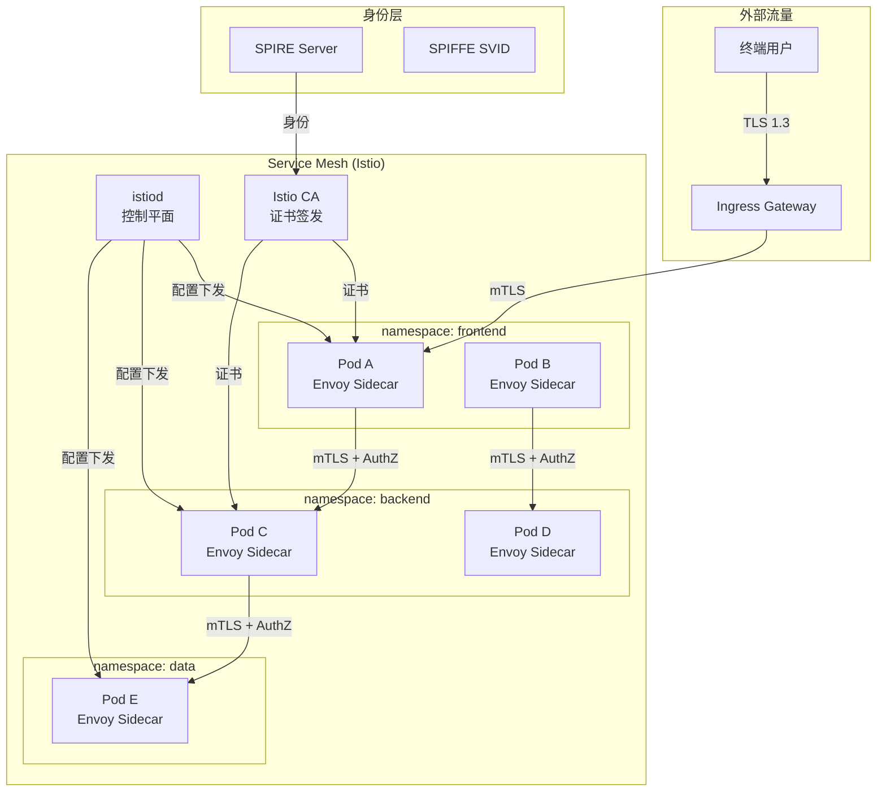
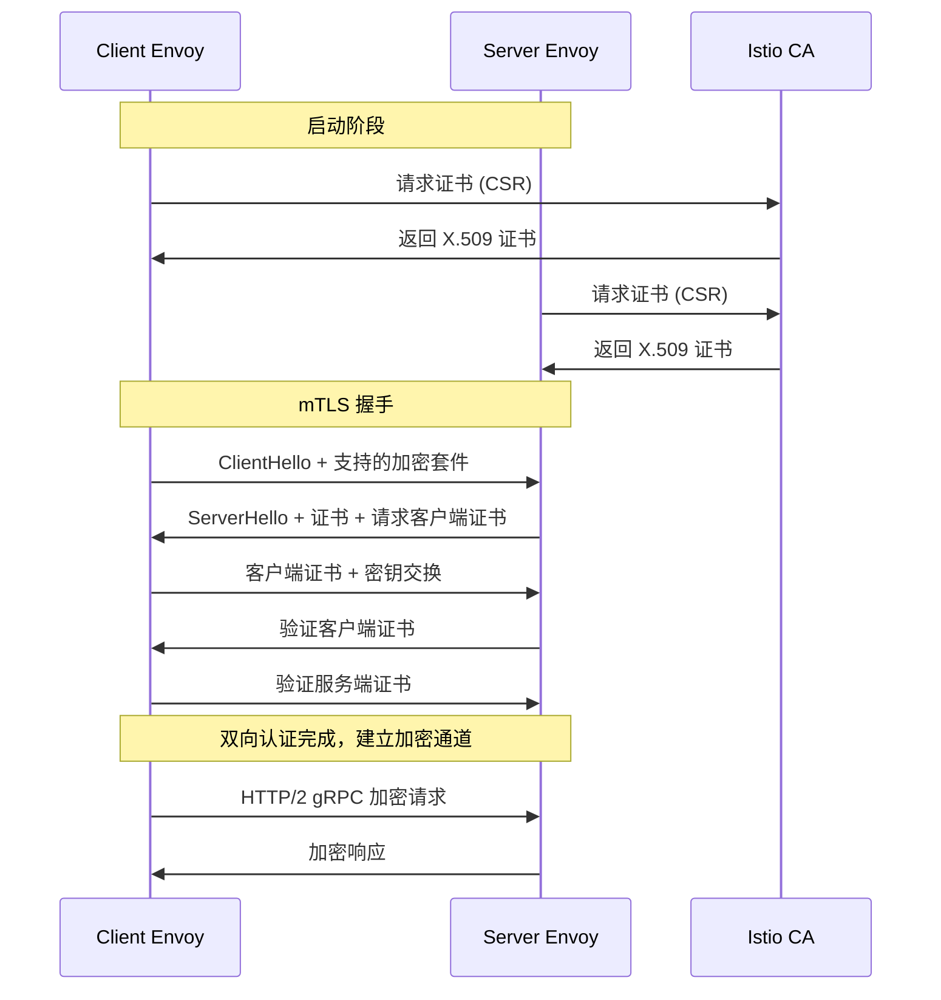
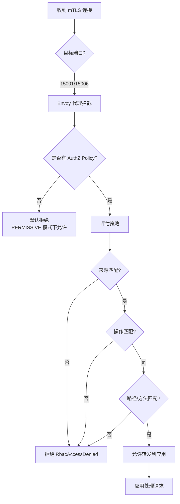
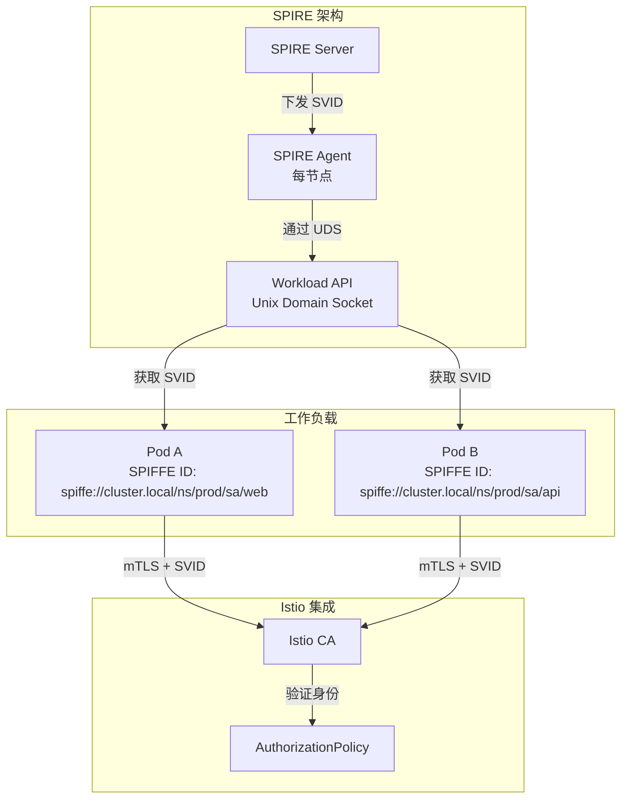
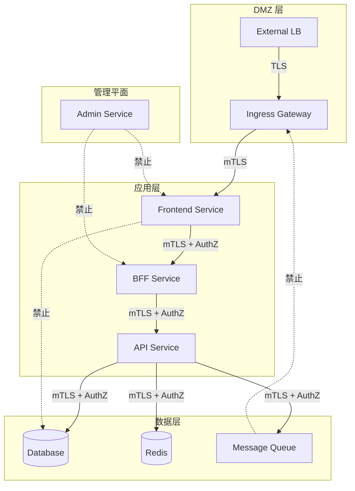
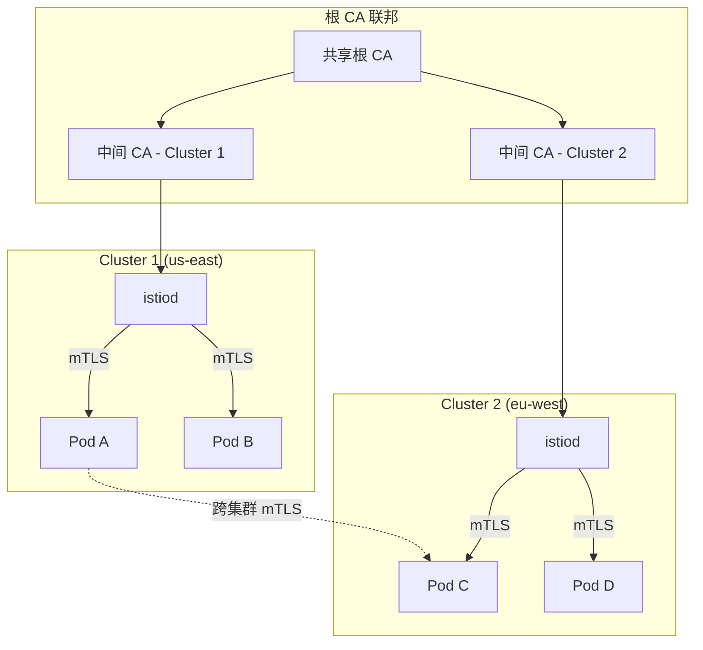
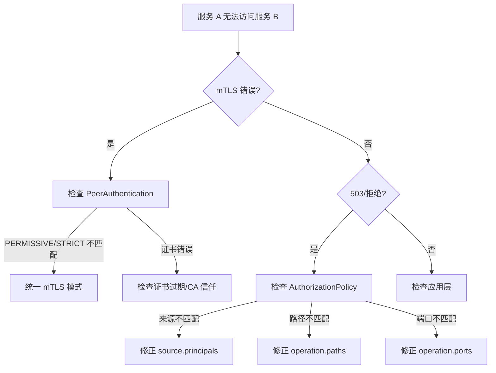

# [[系统基础/知识字典/networking/service-mesh.md|Service Mesh]] 零信任安全架构

## 概述

零信任（Zero Trust）的核心原则是"从不信任、始终验证"——无论流量来自集群外部还是内部，都必须经过认证和授权。Service Mesh（以 [[entities/istio.md|Istio]] 为代表）是零信任理念在 [[entities/kubernetes.md|Kubernetes]] 服务间通信层的具体技术实现：通过自动 mTLS、L7 授权策略和统一身份框架，将安全从"网络边界"下沉到"每次服务调用"。本页连接 网络 的服务网格能力与 安全 的零信任安全框架，展示如何在 K8s 环境中构建服务网格驱动的零信任架构。

## 核心连接

| 域 | 核心能力 | 零信任的桥接作用 |
|---|---|---|
| **Networking (domain-03)** | 服务发现、流量管理、L7 代理 | 网格提供 mTLS、授权策略、流量加密的执行层 |
| **Security (domain-05)** | 身份认证、访问控制、安全审计 | 零信任提供策略框架（谁可以访问什么、如何验证） |

**关键洞察：传统安全模型是"城堡+护城河"——内部信任、外部不信任。零信任 + 服务网格将安全模型转变为"每个房间都有门禁"——每次服务调用都是独立的信任验证。**

## 架构图

### 零信任服务网格架构



### mTLS 握手流程



### AuthorizationPolicy 决策流程



## 核心机制

### 零信任四大原则 × 服务网格实现

| 零信任原则 | 服务网格机制 | 具体实现 |
|---|---|---|
| **永不信任、始终验证** | 自动 mTLS | Istio 为每个服务自动签发证书，所有服务间通信加密 |
| **最小权限访问** | AuthorizationPolicy | L7 细粒度控制：基于身份、命名空间、HTTP 方法、路径 |
| **持续监控与审计** | 可观测性 | 自动导出黄金指标（延迟/流量/错误/饱和度）和访问日志 |
| **微分段** | L7 网络策略 | NetworkPolicy 做 L3/L4 粗粒度，AuthZ Policy 做 L7 细粒度 |

### mTLS 模式演进

```
Istio mTLS 模式:
  PERMISSIVE (宽容模式)
    → 允许明文和 mTLS 同时存在
    → 迁移期使用，逐步切流
    
  STRICT (严格模式)
    → 仅允许 mTLS 连接
    → 生产目标状态
    
  DISABLE (禁用模式)
    → 仅明文通信
    → 仅用于特殊兼容场景
```

```yaml
# 全局强制 mTLS
apiVersion: security.istio.io/v1beta1
kind: PeerAuthentication
metadata:
  name: default
  namespace: istio-system
spec:
  mtls:
    mode: STRICT
---
# 命名空间级例外（迁移期）
apiVersion: security.istio.io/v1beta1
kind: PeerAuthentication
metadata:
  name: legacy-exception
  namespace: legacy-system
spec:
  mtls:
    mode: PERMISSIVE
  selector:
    matchLabels:
      app: legacy-service
```

### AuthorizationPolicy 策略层级

```yaml
# 层级 1: 默认拒绝所有
apiVersion: security.istio.io/v1beta1
kind: AuthorizationPolicy
metadata:
  name: deny-all
  namespace: production
spec:
  {}
---
# 层级 2: 允许 frontend 访问 backend
apiVersion: security.istio.io/v1beta1
kind: AuthorizationPolicy
metadata:
  name: backend-policy
  namespace: production
spec:
  selector:
    matchLabels:
      app: backend-api
  action: ALLOW
  rules:
    - from:
        - source:
            namespaces: ["frontend"]
            principals: ["cluster.local/ns/frontend/sa/frontend-sa"]
      to:
        - operation:
            methods: ["GET", "POST"]
            paths: ["/api/v1/*"]
      when:
        - key: request.headers[x-request-id]
          values: ["*"]
---
# 层级 3: 允许 backend 访问 database
apiVersion: security.istio.io/v1beta1
kind: AuthorizationPolicy
metadata:
  name: database-policy
  namespace: production
spec:
  selector:
    matchLabels:
      app: database
  action: ALLOW
  rules:
    - from:
        - source:
            namespaces: ["production"]
            principals: ["cluster.local/ns/production/sa/backend-sa"]
      to:
        - operation:
            methods: ["POST"]
            ports: ["5432"]
```

### SPIFFE/SPIRE 身份框架



```yaml
# SPIRE 与 Istio 集成配置
apiVersion: spire.spiffe.io/v1alpha1
kind: ClusterSPIFFEID
metadata:
  name: workload-id
spec:
  spiffeIDTemplate: "spiffe://{{ .TrustDomain }}/ns/{{ .PodMeta.Namespace }}/sa/{{ .PodSpec.ServiceAccountName }}"
  podSelector:
    matchLabels:
      spiffe.io/spire-managed-identity: "true"
  workloadSelectorTemplates:
    - "k8s:ns:{{ .PodMeta.Namespace }}"
    - "k8s:sa:{{ .PodSpec.ServiceAccountName }}"
```

### 零信任网络分段



**分段策略：**
- DMZ → App：允许，但仅特定端口
- App → Data：允许，但仅数据库 ServiceAccount
- App → App：按 AuthZ Policy 细粒度控制
- Data → 任何：默认拒绝
- Admin → App：仅管理端口允许

## 最佳实践

### 1. 渐进式 mTLS 迁移

```
mTLS 迁移五步法:
┌─────────────────────────────────────────┐
│  步骤 1: 部署 Istio，PERMISSIVE 模式      │
│  → 观察流量，确认无影响                   │
├─────────────────────────────────────────┤
│  步骤 2: 启用 mTLS 指标监控               │
│  → 确认 mTLS 连接比例                     │
├─────────────────────────────────────────┤
│  步骤 3: 非关键命名空间切换到 STRICT      │
│  → 验证上下游兼容性                       │
├─────────────────────────────────────────┤
│  步骤 4: 核心命名空间切换到 STRICT        │
│  → 生产核心业务验证                       │
├─────────────────────────────────────────┤
│  步骤 5: 全局 STRICT，遗留系统例外        │
│  → 长期维护例外清单                       │
└─────────────────────────────────────────┘
```

### 2. AuthorizationPolicy 设计模式

```yaml
# 模式 1: 默认拒绝 + 显式允许（推荐）
apiVersion: security.istio.io/v1beta1
kind: AuthorizationPolicy
metadata:
  name: default-deny
  namespace: production
spec:
  {}
---
# 模式 2: 命名空间隔离
apiVersion: security.istio.io/v1beta1
kind: AuthorizationPolicy
metadata:
  name: ns-isolation
  namespace: team-a
spec:
  action: ALLOW
  rules:
    - from:
        - source:
            namespaces: ["team-a", "istio-system"]
---
# 模式 3: 路径级访问控制
apiVersion: security.istio.io/v1beta1
kind: AuthorizationPolicy
metadata:
  name: path-level
  namespace: production
spec:
  selector:
    matchLabels:
      app: api-gateway
  action: ALLOW
  rules:
    - to:
        - operation:
            methods: ["GET"]
            paths: ["/public/*", "/health"]
    - from:
        - source:
            namespaces: ["frontend"]
      to:
        - operation:
            methods: ["GET", "POST"]
            paths: ["/api/*"]
    - from:
        - source:
            namespaces: ["admin"]
      to:
        - operation:
            methods: ["*"]
            paths: ["/admin/*", "/api/*"]
```

### 3. 零信任可观测性

```promql
# mTLS 连接健康度
istio_tcp_connections_opened_total{connection_security_policy="mutual_tls"}
/ 
istio_tcp_connections_opened_total

# AuthZ 拒绝率
sum(rate(istio_request_denials_total[5m]))
/
sum(rate(istio_requests_total[5m]))

# 证书即将过期告警
(
  istio_cert_expiry_seconds / 86400
) < 7  # 7 天内过期
```

```yaml
# 证书轮换监控
apiVersion: monitoring.coreos.com/v1
kind: PrometheusRule
metadata:
  name: mesh-security-alerts
spec:
  groups:
    - name: mesh-security
      rules:
        - alert: IstioCertificateExpiringSoon
          expr: |
            (
              istio_cert_expiry_seconds{}
              / 86400
            ) < 7
          for: 1h
          labels:
            severity: critical
          annotations:
            summary: "Istio 证书将在 7 天内过期"
        - alert: HighAuthorizationDenialRate
          expr: |
            sum(rate(istio_request_denials_total[5m]))
            /
            sum(rate(istio_requests_total[5m]))
            > 0.01
          for: 5m
          labels:
            severity: warning
          annotations:
            summary: "授权拒绝率超过 1%，可能存在策略配置错误"
```

### 4. 多集群零信任



```yaml
# 多集群信任域配置
apiVersion: install.istio.io/v1alpha1
kind: IstioOperator
spec:
  profile: default
  meshConfig:
    trustDomain: cluster.local
    defaultConfig:
      proxyMetadata:
        ISTIO_META_DNS_CAPTURE: "true"
  components:
    pilot:
      k8s:
        env:
          - name: PILOT_ENABLE_CROSS_CLUSTER_WORKLOAD_ENTRY
            value: "true"
```

### 5. 零信任排障决策树



## 工具推荐

| 工具 | 角色 | 与零信任的集成 |
|---|---|---|
| **Istio** | 服务网格 | mTLS、AuthZ Policy、可观测性 |
| **[[entities/cilium.md|Cilium]]** | eBPF 网络 | 替代方案：L4 mTLS + NetworkPolicy |
| **SPIRE** | 身份管理 | SPIFFE SVID 签发和轮换 |
| **Cert-Manager** | 证书管理 | 与 Istio CA 集成 |
| **Falco** | 运行时安全 | 检测绕过网格的异常流量 |
| **Tetragon** | eBPF 安全 | 内核级网络策略执行 |
| **OPA/Gatekeeper** | 策略即代码 | 验证 AuthZ Policy 配置合规 |

## 张力与权衡

| 张力 | 详情 |
|---|---|
| **Sidecar 开销 vs 安全深度** | Istio Sidecar 增加 ~100MB 内存和 ~5% CPU。对于安全要求极高的场景，这是可接受的；但对于边缘计算或资源受限环境，Ambient 模式或 Cilium eBPF 是更好的选择。 |
| **策略复杂度 vs 安全覆盖** | 细粒度的 AuthZ Policy（到路径级）提供强安全，但配置复杂且容易出错。"默认拒绝 + 逐步放开"是推荐策略，但初期阻力大。 |
| **mTLS 性能 vs 兼容性** | 严格 mTLS（STRICT）最安全，但遗留系统可能不支持。PERMISSIVE 模式是过渡方案，但长期存在会降低安全收益。 |
| **SPIFFE 身份 vs K8s ServiceAccount** | SPIFFE 提供全局统一身份，但引入新组件（SPIRE）增加复杂度。Istio 原生使用 K8s ServiceAccount 作为身份，简单但限于单集群。 |
| **网格覆盖 vs 非网格流量** | 服务网格只能保护网格内的流量。Pod 到外部服务（如 RDS、S3）的流量不在网格内，需要额外的出口网关或 VPC 防火墙策略。 |

## 开放问题

- **加密流量的可见性：** mTLS 加密了服务间通信，但也使传统网络监控工具无法查看内容。如何在保持加密的同时满足安全审计的"可见性"要求？
- **零信任与性能的终极平衡：** Cilium eBPF 可以将 L4 mTLS 性能损失降至 <1%，但牺牲了 L7 授权能力。是否存在一种方案能同时实现 L7 安全 + 接近零的性能损失？
- **供应链安全与网格身份：** 如果容器镜像被篡改（供应链攻击），网格的 mTLS 身份认证仍然会通过——因为身份是 Pod 级别的，不是代码级别的。如何将代码签名与网格身份关联？
- **零信任的成本度量：** 实施零信任（Istio + SPIRE + 审计）有明确的工程和计算成本，但安全收益难以量化。如何构建零信任的 ROI 模型？

## 相关 Domain

- 网络/02-service-mesh
- 网络/05-service-mesh
- 安全/02-network-security
- 安全/01-identity-access
- [[concepts/服务网格 x 零信任安全.md|服务网格 x 零信任安全]]
- Cilium eBPF × 可观测性.md|Cilium eBPF × 可观测性]]

> *This page synthesizes patterns across multiple sources and domains.* ^[inferred]
