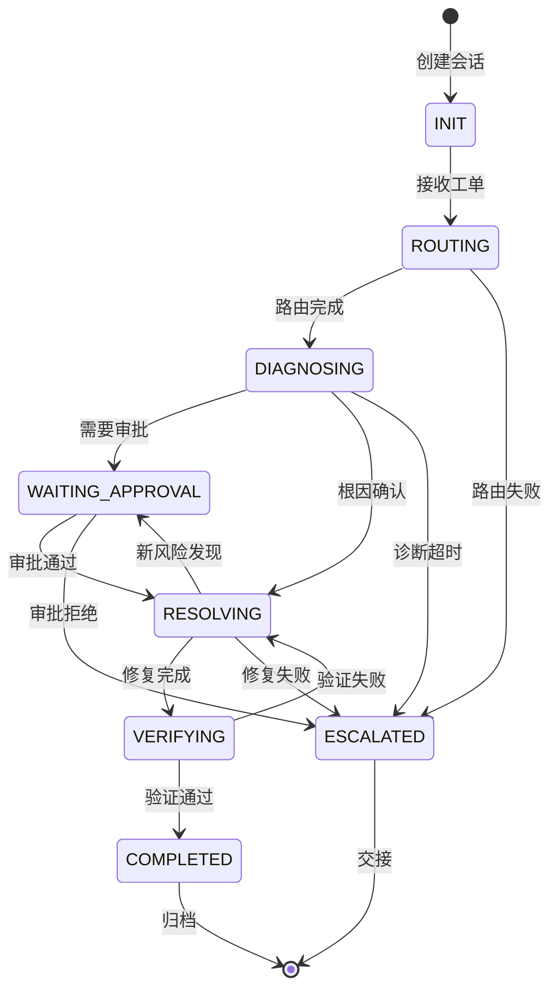

# 会话上下文管理机制 (Session Context Management)

> **版本**: v1.0
> **创建日期**: 2026-05-18
> **用途**: 支持"追问-确认-修复-验证"多轮对话的上下文管理
> **依赖**: P0-1 工单分类体系, P0-2 多技能协同协议

---

## 1. 概述

### 1.1 问题背景

工单处理不是一次性对话，而是多轮交互过程：

```
用户: "XX 节点 NotReady，请排查"
Agent: "已确认节点 NotReady，正在诊断..."
Agent: "发现是 kubelet 证书过期，是否需要自动续期？"
用户: "是，请执行"
Agent: "证书已续期，正在 uncordon 节点..."
Agent: "节点已恢复 Ready，Pod 正在重新调度..."
Agent: "验证完成，3 个 Pod 已重新运行。是否需要进一步检查？"
用户: "好的，结束工单"
```

在这个过程中，Agent 需要：
1. **记忆**: 记住之前诊断过的步骤和发现
2. **理解**: 理解用户的新增信息或确认
3. **延续**: 基于之前的上下文继续操作
4. **总结**: 在工单结束时提供完整摘要

### 1.2 上下文管理设计目标

| 目标 | 说明 |
|------|------|
| 对话连续性 | 工单期间所有交互共享同一上下文 |
| 状态可追溯 | 每个状态变更都有时间戳和原因 |
| 高效检索 | 快速定位历史上下文中的关键信息 |
| 资源控制 | 控制上下文大小，避免内存溢出 |

---

## 2. 会话状态机

### 2.1 状态定义

```yaml
SessionState:
  session_id: string           # 唯一会话 ID
  ticket_id: string             # 关联的工单 ID
  status: enum                  # 当前会话状态

  # 状态枚举
  statuses:
    - INIT              # 初始化
    - ROUTING           # 路由决策中
    - DIAGNOSING        # 诊断执行中
    - WAITING_APPROVAL  # 等待审批
    - RESOLVING         # 修复执行中
    - VERIFYING         # 验证中
    - COMPLETED         # 已完成
    - ESCALATED         # 已升级
    - EXPIRED           # 已过期

  # 时间追踪
  created_at: timestamp
  updated_at: timestamp
  expires_at: timestamp        # 超时自动关闭

  # 当前活跃的 Skill
  active_skill_id: string | null
  skill_execution_context: SkillContext | null
```

### 2.2 状态转换图 (Mermaid)



### 2.3 状态转换规则

| 当前状态 | 触发事件 | 下一状态 | 动作 |
|---------|---------|---------|------|
| INIT | 工单创建 | ROUTING | 启动路由决策 |
| ROUTING | Skill 路由成功 | DIAGNOSING | 激活 Skill |
| ROUTING | 无法路由 | ESCALATED | 升级人工 |
| DIAGNOSING | 根因确认 | RESOLVING | 执行修复 |
| DIAGNOSING | 需要人工审批 | WAITING_APPROVAL | 暂停 |
| DIAGNOSING | 诊断超时 15min | ESCALATED | 升级人工 |
| WAITING_APPROVAL | 审批通过 | RESOLVING | 执行修复 |
| WAITING_APPROVAL | 审批拒绝/超时 | ESCALATED | 升级人工 |
| RESOLVING | 修复执行完成 | VERIFYING | 验证 |
| RESOLVING | 高风险修复需审批 | WAITING_APPROVAL | 暂停 |
| RESOLVING | 修复失败 | ESCALATED | 升级人工 |
| VERIFYING | 验证通过 | COMPLETED | 归档 |
| VERIFYING | 验证失败 | RESOLVING | 重新修复 |
| COMPLETED | 会话归档 | - | 结束 |
| ESCALATED | 人工处理 | - | 交接 |

---

## 3. 上下文结构

### 3.1 上下文分层

```yaml
ContextLayers:
  # Layer 1: 会话层 (Session-level)
  session_context:
    session_id: "sess-20260518-001"
    ticket_id: "TKT-20260518-001"
    user_id: "user@example.com"
    created_at: "2026-05-18T10:00:00Z"
    language: "zh"                    # 用户语言偏好
    agent_mode: "L2-semi-auto"        # Agent 执行模式

  # Layer 2: 诊断层 (Diagnostic-level)
  diagnostic_context:
    category: "TC-INFRA-NODE"
    skill_id: "SKILL-NODE-001"
    current_phase: "D2"              # Phase 1/2/3
    completed_steps: ["D1.1", "D1.2", "D1.3", "D2.1"]
    findings: [...]
    hypothesis: "kubelet certificate expired"

  # Layer 3: 技能层 (Skill-level)
  skill_context:
    skill_id: "SKILL-NODE-001"
    execution_mode: "L2-semi-auto"
    risk_level: "medium"
    current_step: "D2.2"
    step_output: {...}
    root_cause_candidates: [...]

  # Layer 4: 对话层 (Dialogue-level)
  dialogue_context:
    turns: [...]
    last_user_message: "证书续期需要多久？"
    last_agent_message: "预计 2-3 分钟完成"
    pending_confirmations: [...]
    user_preferences: {...}
```

### 3.2 上下文传递格式 (JSON)

```json
{
  "session_id": "sess-20260518-001",
  "ticket_id": "TKT-20260518-001",
  "version": 1,
  "timestamp": "2026-05-18T10:05:00Z",
  "layers": {
    "session": {
      "status": "DIAGNOSING",
      "active_skill_id": "SKILL-NODE-001",
      "elapsed_time_ms": 300000
    },
    "diagnostic": {
      "category": "TC-INFRA-NODE",
      "current_phase": "D2",
      "completed_steps": ["D1.1", "D1.2", "D1.3", "D2.1"],
      "findings": [
        {
          "step": "D1.3",
          "output": "Node not Ready for 10 minutes",
          "severity": "critical"
        },
        {
          "step": "D2.1",
          "output": "kubelet serving certificate expired at 2026-05-17T08:00:00Z",
          "severity": "critical"
        }
      ],
      "hypothesis": "RC-001: kubelet serving certificate expired",
      "confidence": 0.95
    },
    "skill": {
      "skill_id": "SKILL-NODE-001",
      "risk_level": "medium",
      "requires_approval": true,
      "pending_action": {
        "rem_id": "REM-001",
        "description": "Rotate kubelet serving certificate",
        "impact": "kubelet 重启，期间节点不可用"
      }
    },
    "dialogue": {
      "turn_count": 3,
      "last_turn": {
        "role": "user",
        "message": "是否需要自动续期证书？",
        "intent": "confirmation"
      },
      "pending_confirmations": [
        {
          "type": "approval",
          "item": "REM-001: Rotate kubelet serving certificate",
          "required": true,
          "expires_at": "2026-05-18T10:10:00Z"
        }
      ]
    }
  },
  "metadata": {
    "created_at": "2026-05-18T10:00:00Z",
    "updated_at": "2026-05-18T10:05:00Z",
    "ttl": "24h",
    "urgency": "high"
  }
}
```

---

## 4. 对话管理

### 4.1 对话状态追踪

```yaml
DialogueState:
  turn_id: integer              # 对话轮次
  role: "user" | "agent"        # 发言角色
  timestamp: timestamp          # 时间戳

  # 用户消息分析
  user_message:
    raw_text: string           # 原始消息
    intent: enum               # CONFIRMATION | REJECTION | QUESTION | COMMAND | INFO
    entities: [...]            # 识别的实体

  # Agent 回复
  agent_message:
    message_type: enum         # INFO | QUESTION | ACTION | RESULT | ESCALATION
    skill_id: string | null    # 关联的 Skill
    requires_response: boolean  # 是否需要用户回复
    response_deadline: timestamp | null

  # 对话历史 (最近 20 轮)
  history:
    - turn_id: 1
      role: "user"
      message: "XX 节点 NotReady，请排查"
      intent: "command"

    - turn_id: 2
      role: "agent"
      message: "已确认节点 NotReady，正在诊断..."
      action: "SKILL-NODE-001 activated"

    - turn_id: 3
      role: "agent"
      message: "发现是 kubelet 证书过期（2026-05-17 到期），是否需要自动续期？"
      requires_confirmation: true
      confirmation_item: "REM-001: Rotate certificate"
```

### 4.2 意图识别扩展

基于 P0-1 的意图识别，对话中的新增意图：

| 意图 | 说明 | 处理方式 |
|------|------|---------|
| CONFIRMATION | 用户确认（如"是"、"执行"） | 执行待审批的修复操作 |
| REJECTION | 用户拒绝（如"否"、"取消"） | 取消操作，升级人工 |
| QUESTION | 用户提问（如"需要多久？"） | 回答问题，保持诊断状态 |
| COMMAND | 用户指令（如"立即重启"） | 优先执行，更新状态 |
| INFO | 用户补充信息（如"节点最近升级过"） | 更新上下文，触发重新诊断 |

### 4.3 多轮对话模板

#### 模板 1: 修复确认

```
Agent: "发现根因 [RC-001: kubelet 证书过期]
        影响范围: 节点 XX，3 个 Pod 将被驱逐
        修复方案: 续期证书 + uncordon 节点
        预计用时: 3 分钟
        是否批准执行？ (🟡 中风险 - 需审批)"

User: "批准"

Agent: "正在执行 REM-001 (续期证书)...
        证书已续期
        正在 uncordon 节点...
        节点已恢复 Ready"

---
[验证通过后]

Agent: "✓ 节点状态: Ready
        ✓ 3 个 Pod 已重新调度
        ✓ 证书有效期至 2026-08-18
        工单已自动关闭。如需进一步检查请告知。"
```

#### 模板 2: 追问澄清

```
Agent: "已完成初步诊断
        发现两个可能根因:
        A) kubelet 证书过期 (置信度 85%)
        B) containerd 异常 (置信度 60%)

        请确认: 节点最近是否有升级或重启操作？"

User: "昨天刚升级了 kubelet 版本"

Agent: "收到。根据您提供的信息，升级后证书轮换可能出现异常，
        这与根因 A (证书过期) 高度吻合。

        正在执行针对证书过期的深度诊断..."

---
[诊断确认]

Agent: "诊断确认: kubelet 证书未自动轮换
        是否需要自动续期证书？"
```

---

## 5. 类案匹配 (Case-Based Reasoning)

### 5.1 历史工单索引

```yaml
CaseIndex:
  # 基于症状的索引
  symptom_index:
    "Node NotReady": ["CASE-001", "CASE-015", "CASE-023"]
    "Pod CrashLoopBackOff": ["CASE-002", "CASE-016"]
    "DNS resolution failed": ["CASE-003", "CASE-021"]

  # 基于根因的索引
  root_cause_index:
    "RC-001 (certificate expired)": ["CASE-001", "CASE-008"]
    "RC-002 (disk pressure)": ["CASE-015", "CASE-019"]

  # 基于组件的索引
  component_index:
    "kubelet": ["CASE-001", "CASE-004", "CASE-010"]
    "CoreDNS": ["CASE-003", "CASE-021"]
```

### 5.2 相似度匹配

```json
{
  "query": {
    "symptoms": ["Node NotReady", "kubelet certificate expired"],
    "cluster_version": "1.31.4",
    "cloud_provider": "ACK"
  },
  "matched_cases": [
    {
      "case_id": "CASE-001",
      "similarity_score": 0.92,
      "symptoms_match": ["Node NotReady", "certificate expired"],
      "solution": {
        "rem_id": "REM-001",
        "steps": ["Rotate certificate", "Uncordon node"],
        "outcome": "resolved"
      },
      "context_diff": {
        "cluster_version": "1.30.0 vs 1.31.4",
        "note": "v1.31 证书自动轮换机制有变化，需额外检查"
      }
    }
  ],
  "recommended_actions": {
    "first_try": "REM-001 as CASE-001",
    "fallback": "Check kube-controller-manager certificate rotation config"
  }
}
```

### 5.3 类案数据结构

```yaml
HistoricalCase:
  case_id: string              # CASE-YYYYMMDD-NNN
  ticket_id: string            # 原始工单 ID

  # 问题描述
  problem:
    symptoms: [string]
    category: string
    severity: "P0" | "P1" | "P2" | "P3"
    cluster_info:
      version: string
      cloud_provider: string
      node_count: integer

  # 诊断过程
  diagnostic:
    steps_taken: [string]
    duration_ms: integer
    skills_used: [string]

  # 解决方案
  resolution:
    root_cause_id: string
    root_cause_description: string
    steps: [string]
    rem_id: string
    outcome: "resolved" | "escalated" | "partial"

  # 元数据
  metadata:
    created_at: timestamp
    resolved_at: timestamp
    resolution_time_ms: integer
    agent_version: string

  # 反馈
  feedback:
    user_rating: integer        # 1-5
    user_comment: string
    corrections: [string]      # 后续修正
```

---

## 6. 上下文注入机制

### 6.1 上下文注入时机

| 时机 | 注入内容 | 说明 |
|------|---------|------|
| 会话创建 | session_context | 初始化会话基本信息 |
| 路由完成 | diagnostic_context | 注入分类和 Skill 信息 |
| 步骤执行 | skill_context | 每个诊断步骤后更新 |
| 对话交互 | dialogue_context | 每轮对话后更新 |
| Skill 协同 | coordination_context | 多 Skill 协同时注入 |

### 6.2 上下文压缩规则

当上下文超过阈值时，执行压缩：

```yaml
ContextCompression:
  max_turns: 50                 # 最大对话轮次
  max_finding_count: 20         # 最大发现数
  max_history_turns: 20         # 保留最近 20 轮

  compression_rules:
    - rule: "保留最近 20 轮对话，压缩早期对话"
      action: "摘要化早期对话，保留关键发现"

    - rule: "findings 超过 20 条"
      action: "按 severity 排序，保留 P0/P1"

    - rule: "超过 24 小时"
      action: "归档会话，生成摘要"
```

### 6.3 上下文传递协议

```yaml
ContextTransfer:
  # Skill 之间的上下文传递
  skill_to_skill:
    from_skill: "SKILL-POD-002"
    to_skill: "SKILL-NET-001"
    transfer_type: "trigger"  # trigger | share | inherit

    shared_data:
      - namespace
      - affected_workload
      - node_selector
      - network_info

  # 诊断步骤之间的传递
  step_to_step:
    from_step: "D1.3"
    to_step: "D2.1"
    carry_forward:
      - confirmed_symptoms
      - node_name
      - cluster_version
```

---

## 7. 实现检查清单

### 7.1 会话管理检查项

| 检查项 | 说明 |
|--------|------|
| 会话创建 | 每个工单创建独立会话，上下文隔离 |
| 状态追踪 | 状态变更记录时间戳和原因 |
| 超时管理 | 会话超时自动升级或归档 |
| 并发控制 | 多工单并发时上下文不混淆 |

### 7.2 对话管理检查项

| 检查项 | 说明 |
|--------|------|
| 意图识别 | 支持 CONFIRMATION/REJECTION/QUESTION/COMMAND/INFO |
| 多轮支持 | 支持"追问-确认-修复-验证"完整流程 |
| 确认模板 | 高风险操作有明确的确认模板 |
| 回复生成 | 基于历史上下文生成连贯回复 |

### 7.3 类案匹配检查项

| 检查项 | 说明 |
|--------|------|
| 索引更新 | 新工单解决后自动更新索引 |
| 相似度阈值 | 相似度 > 0.8 时自动推荐 |
| 上下文差异 | 推荐时标注与历史的差异点 |
| 冷启动 | 无历史时基于规则推荐 |

---

## 8. 与外部系统集成

### 8.1 工单系统集成

```yaml
Integration_TicketSystem:
  supported_systems:
    - "PagerDuty"
    - "Jira"
    - "Linear"
    - "飞书工单"
    - "钉钉工单"

  integration_points:
    - "工单创建时同步会话"
    - "状态变更同步到工单"
    - "解决时更新工单状态"
    - "升级时推送通知"

  data_mapping:
    ticket_field: "category"
    session_field: "diagnostic_context.category"
```

### 8.2 监控系统集成

```yaml
Integration_Monitoring:
  supported_systems:
    - "Prometheus/AlertManager"
    - "Grafana"
    - "Datadog"

  integration_points:
    - "告警触发自动创建会话"
    - "会话状态同步到告警"
    - "解决时静默告警"

  alert_to_ticket_mapping:
    alert_label: "ticket_category"
    session_field: "diagnostic_context.category"
```

---

## 9. 错误处理

### 9.1 上下文丢失处理

| 场景 | 处理方式 |
|------|---------|
| 会话超时 | 自动归档，生成摘要，提示用户新建会话 |
| 服务重启 | 从持久化存储恢复会话，标记为 RECOVERED |
| 并发冲突 | 锁定会话，排队处理 |

### 9.2 状态不一致处理

| 场景 | 处理方式 |
|------|---------|
| Skill 执行结果与上下文矛盾 | 以 Skill 结果为准，更新上下文 |
| 用户确认与 Skill 建议矛盾 | 以 Skill 建议优先，提示用户风险 |
| 多 Skill 结论矛盾 | 遵循 P0-2 的冲突解决规则 |

---

**关联文档**:
- [P0-1: 工单分类体系与意图识别语料库](./P0-1-ticket-classification-intent-recognition.md)
- [P0-2: 多技能协同协议](./P0-2-multi-skill-coordination-protocol.md)
- [domain-10-troubleshooting-diagnostics/[[domain-04-storage-data/README.md|README]].md](../domain-10-troubleshooting-diagnostics/topic-skills/README.md)
- [domain-10-troubleshooting-diagnostics/topic-fta/list/](../domain-10-troubleshooting-diagnostics/topic-fta/list/) — FTA 问题树参考