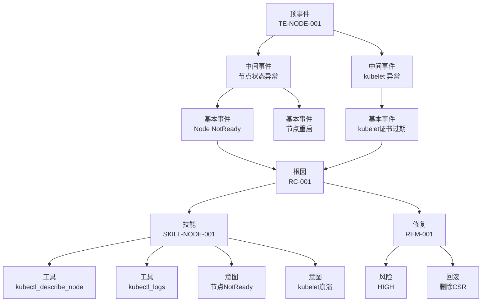

# 知识图谱 RDF 模型定义

> **版本**: v1.0
> **创建日期**: 2026-05-18
> **用途**: 建立 KUDIG 知识库的知识图谱 RDF 模型，支持跨域推理

---

## 1. RDF 模型概述

### 1.1 命名空间

```turtle
@prefix kudig: <https://kudig.io/ontology/>
@prefix rdf: <http://www.w3.org/1999/02/22-rdf-syntax-ns#>
@prefix rdfs: <http://www.w3.org/2000/01/rdf-schema#>
@prefix xsd: <http://www.w3.org/2001/XMLSchema#>
@prefix skos: <http://www.w3.org/2004/02/skos/core#>
@prefix dct: <http://purl.org/dc/terms/>
```

### 1.2 核心实体类型

| 实体类型 | 说明 | 示例 |
|----------|------|------|
| FaultTree | 问题树 | FTA-NODE-023 |
| RootCause | 根因 | RC-001 |
| Skill | 技能文档 | SKILL-NODE-001 |
| Symptom | 症状 | SYMP-001 |
| DiagnosticStep | 诊断步骤 | DS-001 |
| Remediation | 修复方案 | REM-001 |
| Domain | 知识域 | domain-10-troubleshooting-diagnostics |
| Tool | 工具 | kubectl_get_pods |

---

## 2. 核心关系定义

### 2.1 问题树关系

```turtle
# 问题树包含顶事件
kudig:FTA-NODE-023 rdf:type kudig:FaultTree .
kudig:FTA-NODE-023 kudig:hasTopEvent kudig:TE-NODE-001 .
kudig:TE-NODE-001 rdf:type kudig:TopEvent ;
    kudig:severity "P0" ;
    kudig:title "Node异常" .

# 顶事件分解为中间事件
kudig:TE-NODE-001 kudig:decomposedInto kudig:IE-NODE-001, kudig:IE-NODE-002 .
kudig:IE-NODE-001 rdf:type kudig:IntermediateEvent ;
    kudig:logicGate "OR" .

# 中间事件包含基本事件
kudig:IE-NODE-001 kudig:contains kudig:BE-NODE-001, kudig:BE-NODE-002 .

# 基本事件关联根因
kudig:BE-NODE-001 kudig:leadsTo kudig:RC-001 .
kudig:RC-001 rdf:type kudig:RootCause ;
    kudig:title "kubelet证书过期" ;
    kudig:probability "0.85"^^xsd:float .
```

### 2.2 技能关联关系

```turtle
# 根因对应技能
kudig:RC-001 kudig:coveredBy kudig:SKILL-NODE-001 .

# 技能关联问题树
kudig:SKILL-NODE-001 rdf:type kudig:Skill ;
    kudig:skillId "SKILL-NODE-001" ;
    kudig:category "TC-INFRA-NODE" ;
    kudig:documentedIn kudig:FTA-NODE-023 ;
    kudig:hasStep kudig:DS-NODE-001, kudig:DS-NODE-002 .

# 技能被意图触发
kudig:SKILL-NODE-001 kudig:triggeredBy kudig:INTENT-001, kudig:INTENT-002 .
```

### 2.3 诊断路径关系

```turtle
# 诊断步骤序列
kudig:DS-NODE-001 rdf:type kudig:DiagnosticStep ;
    kudig:stepId "D1.1" ;
    kudig:command "kubectl get node ${NODE_NAME} -o json" ;
    kudig:expectedResult "status.conditions[].type == 'Ready'" ;
    kudig:nextStep kudig:DS-NODE-002 .

# 诊断步骤关联工具
kudig:DS-NODE-001 kudig:usesTool kudig:TOOL-kubectl_get_nodes .

# 修复方案关联根因
kudig:RC-001 kudig:remediatedBy kudig:REM-001 .
kudig:REM-001 rdf:type kudig:Remediation ;
    kudig:remId "REM-001" ;
    kudig:action "kubectl certificate approve <csr-name>" ;
    kudig:riskLevel "HIGH" ;
    kudig:rollback "kubectl delete csr <csr-name>" .
```

### 2.4 知识域关系

```turtle
# 技能属于知识域
kudig:SKILL-NODE-001 kudig:belongsTo kudig:DOMAIN-12 .
kudig:DOMAIN-12 rdf:type kudig:Domain ;
    kudig:domainId "domain-10-troubleshooting-diagnostics" ;
    kudig:title "问题排查" ;
    kudig:hasDocument kudig:DOC-01, kudig:DOC-02 .

# 知识域交叉引用
kudig:DOMAIN-12 kudig:crossRefersTo kudig:DOMAIN-3, kudig:DOMAIN-5 .
kudig:DOMAIN-3 rdf:type kudig:Domain ; kudig:title "控制平面" .
kudig:DOMAIN-5 rdf:type kudig:Domain ; kudig:title "网络" .

# 文档关联顶事件
kudig:DOC-01 rdf:type kudig:Document ;
    kudig:title "Node问题排查" ;
    kudig:covers kudig:TE-NODE-001, kudig:TE-NODE-002 .
```

---

## 3. 意图分类本体

```turtle
# 工单大类
kudig:TC-INFRA rdf:type kudig:TicketCategory ;
    skos:prefLabel "基础设施" ;
    skos:scopeNote "节点、网络、存储、控制平面等底层组件问题" .

kudig:TC-APP rdf:type kudig:TicketCategory ;
    skos:prefLabel "应用层" ;
    skos:scopeNote "[[concepts/pod-lifecycle.md|pod]]、Deployment、Service 等应用运行时问题" .

kudig:TC-SEC rdf:type kudig:TicketCategory ;
    skos:prefLabel "安全合规" ;
    skos:scopeNote "认证、授权、证书、审计等安全事件" .

kudig:TC-DATA rdf:type kudig:TicketCategory ;
    skos:prefLabel "数据层" ;
    skos:scopeNote "数据库、缓存、消息队列等数据相关问题" .

# 工单子类
kudig:TC-INFRA-NODE rdf:type kudig:TicketSubcategory ;
    skos:prefLabel "节点问题" ;
    skos:broader kudig:TC-INFRA .

kudig:TC-INFRA-NET rdf:type kudig:TicketSubcategory ;
    skos:prefLabel "网络问题" ;
    skos:broader kudig:TC-INFRA .

kudig:TC-APP-POD rdf:type kudig:TicketSubcategory ;
    skos:prefLabel "Pod生命周期" ;
    skos:broader kudig:TC-APP .
```

---

## 4. 推理规则定义

### 4.1 症状到根因推理

```prolog
# IF 节点 NotReady AND kubelet证书过期 THEN 根因=RC-001
kudig:reasoningRule1 a kudig:InferenceRule ;
    kudig:ruleId "RUL-001" ;
    kudig:antecedent """
        ?symptom kudig:hasType 'NodeNotReady' .
        ?node kudig:hasCondition 'KubeletCertificateExpired' .
    """ ;
    kudig:consequent "kudig:RC-001" ;
    kudig:confidence "0.95"^^xsd:float .

# IF Pod Pending AND 无可用节点 THEN 根因=RC-002
kudig:reasoningRule2 a kudig:InferenceRule ;
    kudig:ruleId "RUL-002" ;
    kudig:antecedent """
        ?symptom kudig:hasType 'PodPending' .
        ?symptom kudig:hasReason 'Unschedulable' .
    """ ;
    kudig:consequent "kudig:RC-002" ;
    kudig:confidence "0.90"^^xsd:float .
```

### 4.2 根因到修复推理

```prolog
# IF 根因=RC-001 AND 证书过期 THEN 推荐REM-001
kudig:reasoningRule3 a kudig:InferenceRule ;
    kudig:ruleId "RUL-003" ;
    kudig:antecedent "kudig:RC-001" ;
    kudig:consequent "kudig:REM-001" ;
    kudig:hasCondition "kudig:RC-001.kudig:hasState 'cert_expired'" .
```

### 4.3 多技能协同推理

```prolog
# IF 根因涉及多组件 THEN 触发多技能协同
kudig:reasoningRule4 a kudig:InferenceRule ;
    kudig:ruleId "RUL-004" ;
    kudig:antecedent """
        ?rc kudig:hasComponent ?comp1 .
        ?rc kudig:hasComponent ?comp2 .
        FILTER (?comp1 != ?comp2)
    """ ;
    kudig:consequent "kudig:CORD-SKILL-001" ;
    kudig:coordinationType "parallel" .
```

---

## 5. 实例数据 (Turtle 格式)

### 5.1 Node NotReady 完整链路

```turtle
# 顶事件
kudig:TE-NODE-001 rdf:type kudig:TopEvent ;
    kudig:eventId "TE-NODE-001" ;
    kudig:title "Node异常" ;
    kudig:severity "P0" ;
    kudig:ftaId "FTA-NODE-023" .

# 中间事件
kudig:IE-NODE-001 rdf:type kudig:IntermediateEvent ;
    kudig:eventId "IE-NODE-001" ;
    kudig:title "节点状态异常" ;
    kudig:logicGate "OR" ;
    kudig:parentEvent kudig:TE-NODE-001 .

kudig:IE-NODE-002 rdf:type kudig:IntermediateEvent ;
    kudig:eventId "IE-NODE-002" ;
    kudig:title "kubelet 异常" ;
    kudig:logicGate "OR" ;
    kudig:parentEvent kudig:TE-NODE-001 .

# 基本事件
kudig:BE-NODE-001 rdf:type kudig:BasicEvent ;
    kudig:eventId "BE-NODE-001" ;
    kudig:title "Node NotReady" ;
    kudig:parentEvent kudig:IE-NODE-001 ;
    kudig:leadsTo kudig:RC-001 .

kudig:BE-NODE-002 rdf:type kudig:BasicEvent ;
    kudig:eventId "BE-NODE-002" ;
    kudig:title "kubelet 证书过期" ;
    kudig:parentEvent kudig:IE-NODE-002 ;
    kudig:leadsTo kudig:RC-001 .

# 根因
kudig:RC-001 rdf:type kudig:RootCause ;
    kudig:rcId "RC-001" ;
    kudig:title "kubelet serving certificate expired" ;
    kudig:probability "0.85"^^xsd:float ;
    kudig:coveredBy kudig:SKILL-NODE-001 ;
    kudig:remediatedBy kudig:REM-001 .

# 技能
kudig:SKILL-NODE-001 rdf:type kudig:Skill ;
    kudig:skillId "SKILL-NODE-001" ;
    kudig:category "TC-INFRA-NODE" ;
    kudig:ftaId "FTA-NODE-023" ;
    kudig:documentedIn kudig:DOC-domain-12-06 .

# 修复方案
kudig:REM-001 rdf:type kudig:Remediation ;
    kudig:remId "REM-001" ;
    kudig:action "kubectl certificate approve <csr-name>" ;
    kudig:riskLevel "HIGH" ;
    kudig:rollback "kubectl delete csr <csr-name>" ;
    kudig:prerequisite "CSR must exist and be in Pending state" .
```

---

## 6. SPARQL 查询示例

### 6.1 查询症状对应的根因和修复

```sparql
PREFIX kudig: <https://kudig.io/ontology/>

SELECT ?rootCause ?remediation ?skill
WHERE {
    ?symptom kudig:hasType "NodeNotReady" .
    ?symptom kudig:leadsTo ?rootCause .
    ?rootCause kudig:remediatedBy ?remediation .
    ?rootCause kudig:coveredBy ?skill .
}
```

### 6.2 查询技能覆盖的问题树

```sparql
PREFIX kudig: <https://kudig.io/ontology/>

SELECT ?fta ?topEvent ?skill
WHERE {
    ?skill kudig:skillId "SKILL-NODE-001" .
    ?skill kudig:documentedIn ?fta .
    ?fta kudig:hasTopEvent ?topEvent .
}
```

### 6.3 查询跨域关联

```sparql
PREFIX kudig: <https://kudig.io/ontology/>

SELECT ?domain1 ?domain2
WHERE {
    ?skill1 kudig:belongsTo ?domain1 .
    ?skill2 kudig:belongsTo ?domain2 .
    ?domain1 kudig:crossRefersTo ?domain2 .
    FILTER (?domain1 != ?domain2)
}
```

---

## 7. 图谱可视化



---

**下一步行动**: 将此 RDF 模型实现为实际的知识图谱数据库（如 Neo4j 或 Amazon Neptune），支持生产级推理查询。