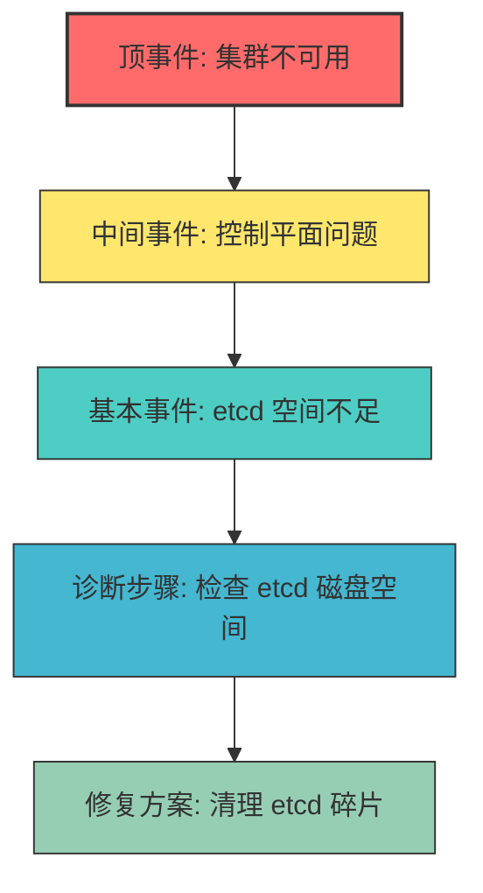
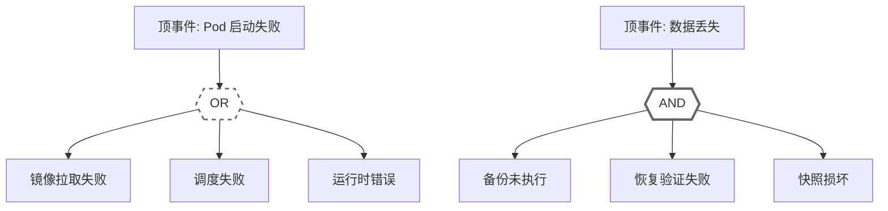
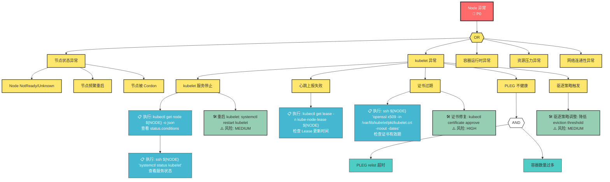
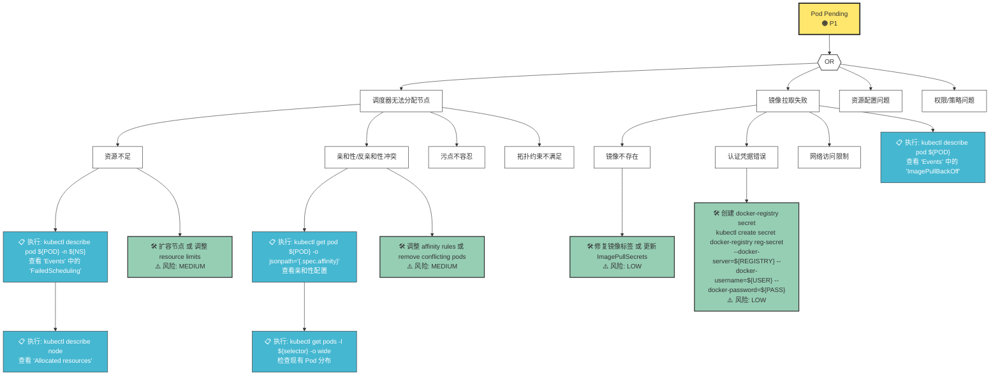
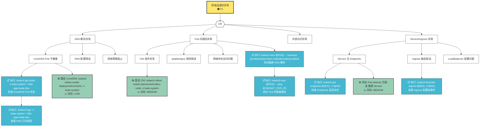

# P1-4 决策树 Mermaid 可视化规范与实例

> **版本**: v1.0
> **创建日期**: 2026-05-18
> **用途**: 定义决策树可视化标准，供 AI Agent 生成可读的问题诊断流程图

---

## 1. 可视化标准概述

### 1.1 设计原则

| 原则 | 说明 |
|------|------|
| **层次清晰** | 父子节点从上到下排列，同级节点左对齐 |
| **色彩语义** | 不同严重程度使用不同颜色 |
| **交互友好** | 支持点击跳转和悬停提示 |
| **可执行** | Mermaid 代码可直接渲染为 SVG/PNG |

### 1.2 节点类型规范

| 节点类型 | 形状 | 颜色 | 用途 |
|----------|------|------|------|
| 顶事件 (TE) | 六边形 | 🔴 `#FF6B6B` | 问题起点 |
| 中间事件 (IE) | 菱形 | 🟠 `#FFE66D` | 复合原因 |
| 基本事件 (BE) | 圆角矩形 | 🟡 `#4ECDC4` | 单一根因 |
| 逻辑门 (OR/AND) | 边框标识 | 灰色 | 条件关系 |
| 诊断步骤 (DS) | 矩形 | 🔵 `#45B7D1` | 操作指引 |
| 修复方案 (REM) | 圆角矩形 | 🟢 `#96CEB4` | 修复动作 |
| 工具调用 (TOOL) | 虚线矩形 | 🟣 `#DDA0DD` | kubectl 命令 |

---

## 2. Mermaid 语法规范

### 2.1 基础语法



### 2.2 逻辑门表示



---

## 3. 决策树实例

### 3.1 Node NotReady 决策树



### 3.2 Pod Pending 决策树



### 3.3 网络连通性决策树



---

## 4. 决策树生成模板

### 4.1 自动化生成脚本

```python
#!/usr/bin/env python3
"""
决策树 Mermaid 生成器
根据 FTA JSON 输入生成 Mermaid 格式的决策树
"""

import json
from typing import Dict, List

class FTAMermaidGenerator:
    def __init__(self, fta_data: Dict):
        self.fta = fta_data
        self.nodes = []
        self.edges = []
        self.classes = []
        
    def generate(self) -> str:
        """生成完整的 Mermaid 代码"""
        self._add_header()
        self._process_events()
        self._add_styles()
        return self._build_mermaid()
    
    def _add_header(self):
        """添加 Mermaid 头部"""
        self.nodes.append("flowchart TD")
        self.nodes.append("    %% ========== 顶事件 ==========")
        te = self.fta['top_event']
        self.nodes.append(f'    TE["{te["title"]}<br/>🔴 {te["severity"]}"]')
        self.edges.append("    TE --> OR1")
        
    def _process_events(self):
        """处理事件树"""
        # ... 递归处理事件
        
    def _add_styles(self):
        """添加样式定义"""
        self.classes.append("    classDef te fill:#FF6B6B,stroke:#333,stroke-width:3px,color:#fff")
        self.classes.append("    classDef ie fill:#FFE66D,stroke:#333,stroke-width:1px")
        self.classes.append("    classDef be fill:#4ECDC4,stroke:#333,stroke-width:1px")
        self.classes.append("    classDef ds fill:#45B7D1,stroke:#333,stroke-width:1px,color:#fff")
        self.classes.append("    classDef rem fill:#96CEB4,stroke:#333,stroke-width:2px")
        
    def _build_mermaid(self) -> str:
        """构建最终 Mermaid 代码"""
        sections = [
            "\n".join(self.nodes),
            "\n".join(self.edges),
            "\n".join(self.classes)
        ]
        return "\n".join(sections)

# 使用示例
if __name__ == "__main__":
    sample_fta = {
        "top_event": {
            "id": "TE-001",
            "title": "集群不可用",
            "severity": "P0"
        }
    }
    generator = FTAMermaidGenerator(sample_fta)
    print(generator.generate())
```

### 4.2 Mermaid 配置

```yaml
mermaid:
  theme: default
  flowchart:
    curve: linear
    padding: 20
    nodeSpacing: 50
    rankSpacing: 80
  securityLevel: loose
  startOnLoad: true
```

---

## 5. 渲染与交互

### 5.1 渲染方式

| 方式 | 命令 | 适用场景 |
|------|------|---------|
| Mermaid Live | https://mermaid.live | 实时预览 |
| mkdocs-mermaid | 文档站点 | 静态生成 |
| Docusaurus | 文档站点 | 支持 Mermaid |
| VuePress | 文档站点 | Mermaid 插件 |

### 5.2 mkdocs.yml 配置

```yaml
markdown_extensions:
  - pymdownx.superfences:
      custom_fences:
        - name: mermaid
          class: mermaid
          format: !!python/name:pymdownx.superfences.fence_code_format
```

---

## 6. 质量检查清单

- [ ] 顶事件必须标注严重程度 (P0/P1/P2)
- [ ] 所有逻辑门 (OR/AND) 必须清晰标注
- [ ] 每个基本事件必须有对应的诊断步骤
- [ ] 每个诊断步骤必须包含实际可执行的命令
- [ ] 每个修复方案必须标注风险等级
- [ ] 修复方案必须包含回滚方法
- [ ] Mermaid 代码可通过 https://mermaid.live 渲染验证

---

**下一步行动**: 在 domain-10-troubleshooting-diagnostics 目录下所有文档中应用此规范，将现有问题排查流程转换为 Mermaid 决策树格式。